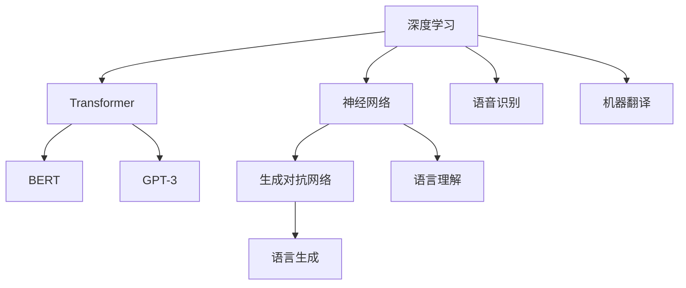

                 

# 深度学习在自然语言处理中的突破：理解与生成

> 关键词：深度学习,自然语言处理,神经网络,Transformer,生成对抗网络,语言理解,语言生成,语音识别,机器翻译

## 1. 背景介绍

### 1.1 问题由来

近年来，深度学习在自然语言处理(Natural Language Processing, NLP)领域取得了革命性的突破。传统的基于规则和统计的方法被深度神经网络所取代，神经网络，尤其是基于Transformer架构的语言模型，通过在大规模语料库上进行预训练，能够自动学习语言中的丰富规律，实现了语言理解与生成的飞跃。

特别是BERT、GPT-3等预训练语言模型的问世，使得NLP领域的研究者能够利用这些模型作为“特征提取器”，进行微调来适应不同的下游任务。这些模型通过在大规模无标签文本上预训练，已经具备了语义表示和语言生成的强大能力。

然而，预训练语言模型仍面临诸多挑战，例如数据瓶颈、解释性不足、鲁棒性差等问题。针对这些问题，研究者们提出了多种解决方案，如参数高效的微调方法、对抗训练、提示学习等，进一步推动了NLP技术的突破。

### 1.2 问题核心关键点

NLP领域深度学习的核心关键点包括以下几个方面：

- **预训练语言模型**：如BERT、GPT等模型，通过大规模无标签数据的自监督学习，学习通用的语言表示。
- **微调**：通过下游任务的有监督数据对预训练模型进行微调，适应特定任务。
- **生成对抗网络**：如GANs，用于语言生成任务的模型，能够生成高质量、具有创新性的文本。
- **语言理解与生成**：利用深度学习模型进行文本分类、语义解析、文本生成等任务。
- **语音识别**：将语音信号转换为文本，是NLP技术的重要组成部分。
- **机器翻译**：利用深度学习模型实现语言之间的互译，是NLP技术的重要应用之一。

这些关键点构成了深度学习在NLP领域突破的基础，推动了NLP技术的不断发展和应用。

## 2. 核心概念与联系

### 2.1 核心概念概述

为了更好地理解深度学习在NLP中的突破，本节将介绍几个关键概念及其相互关系：

- **深度学习**：通过多层神经网络，利用反向传播算法进行模型训练的机器学习方法。
- **神经网络**：由节点（神经元）和边（连接）构成的网络，用于模拟人脑的神经网络结构。
- **Transformer**：一种基于自注意力机制的神经网络架构，用于大规模语言模型的构建。
- **BERT**：Bidirectional Encoder Representations from Transformers，一种预训练语言模型，用于语义理解和语义生成。
- **GPT-3**：Generative Pre-trained Transformer 3，一种基于Transformer架构的生成式语言模型。
- **生成对抗网络（GANs）**：一种通过对抗训练生成高质量样本的深度学习模型。
- **语音识别**：将语音信号转换为文本，是NLP技术的重要应用。
- **机器翻译**：将一种语言的文本转换为另一种语言的文本，是NLP技术的重要应用之一。

这些概念之间的逻辑关系可以通过以下Mermaid流程图来展示：



这个流程图展示了深度学习在NLP领域的不同应用方向及其相互关系：

1. 深度学习通过神经网络进行模型训练。
2. Transformer架构用于大规模语言模型的构建。
3. BERT和GPT-3等模型利用自监督学习进行预训练，用于语言理解与生成。
4. 生成对抗网络用于生成高质量的文本。
5. 语音识别和机器翻译则是NLP技术的重要应用领域。

## 3. 核心算法原理 & 具体操作步骤

### 3.1 算法原理概述

深度学习在NLP中的突破主要体现在两个方面：语言理解和语言生成。其中，语言理解通过预训练语言模型实现，语言生成通过生成对抗网络（GANs）和序列到序列模型（Seq2Seq）实现。

#### 3.1.1 语言理解

语言理解是通过预训练语言模型对文本进行语义分析和语义解析的过程。预训练语言模型如BERT、GPT-3等，通过在大规模语料库上进行预训练，学习到了文本中的语义和语法规律，从而能够自动理解文本的含义。

预训练语言模型通常使用自监督学习方法，如掩码语言模型（Masked Language Model, MLM）和下一句预测（Next Sentence Prediction, NSP）任务。这些任务通过限制模型的预测能力，使得模型能够学习到文本中的上下文关系和语义信息。

#### 3.1.2 语言生成

语言生成是通过生成对抗网络（GANs）和序列到序列模型（Seq2Seq）实现的。GANs通过对抗训练，生成高质量的文本，而Seq2Seq模型则用于文本生成、机器翻译等任务。

GANs由一个生成器（Generator）和一个判别器（Discriminator）组成，生成器通过对抗训练生成高质量的样本，判别器则用于区分生成样本和真实样本。通过不断优化生成器和判别器的参数，GANs可以生成高质量的文本，用于文本生成、对话生成等任务。

Seq2Seq模型则由编码器和解码器组成，用于将一种语言转换为另一种语言。编码器将输入文本转换为向量表示，解码器则将向量表示转换为目标语言文本。Seq2Seq模型通常使用RNN、LSTM或Transformer等架构，可以用于机器翻译、文本摘要、对话生成等任务。

### 3.2 算法步骤详解

#### 3.2.1 预训练语言模型

预训练语言模型如BERT、GPT-3等，通过在大规模无标签语料库上进行预训练，学习到通用的语言表示。

1. 收集大规模无标签语料库，如维基百科、新闻文章等。
2. 使用掩码语言模型（MLM）和下一句预测（NSP）任务对模型进行预训练。
3. 对预训练后的模型进行微调，适应特定的下游任务。

#### 3.2.2 生成对抗网络（GANs）

生成对抗网络用于生成高质量的文本。

1. 定义生成器和判别器，生成器和判别器的损失函数分别为生成器损失（Generator Loss）和判别器损失（Discriminator Loss）。
2. 通过对抗训练不断优化生成器和判别器的参数，生成高质量的文本。
3. 将生成的文本用于文本生成、对话生成等任务。

#### 3.2.3 序列到序列模型（Seq2Seq）

序列到序列模型用于文本生成、机器翻译等任务。

1. 定义编码器和解码器，编码器将输入文本转换为向量表示，解码器将向量表示转换为目标语言文本。
2. 使用RNN、LSTM或Transformer等架构对模型进行训练。
3. 在测试时，将输入文本输入编码器，将输出向量输入解码器，生成目标语言文本。

### 3.3 算法优缺点

深度学习在NLP中的突破具有以下优点：

1. **广泛的应用场景**：深度学习在语言理解、语言生成、语音识别、机器翻译等领域都有广泛应用。
2. **高效的表现**：深度学习模型在大规模语料库上进行预训练后，能够在下游任务上快速微调，获得优异的性能。
3. **自监督学习**：深度学习模型可以通过自监督学习自动学习语言规律，减少标注数据的依赖。

然而，深度学习在NLP中也存在一些缺点：

1. **数据瓶颈**：深度学习模型需要大规模语料库进行预训练，对于小规模语料库或特定领域语料库，效果可能不佳。
2. **解释性不足**：深度学习模型通常被视为“黑盒”，难以解释其内部工作机制。
3. **鲁棒性差**：深度学习模型面对噪声、对抗样本等干扰，鲁棒性较差。

### 3.4 算法应用领域

深度学习在NLP中的突破已经广泛应用于多个领域，包括但不限于：

- **文本分类**：如情感分析、主题分类、垃圾邮件过滤等。
- **语义解析**：如命名实体识别、关系抽取、事件识别等。
- **文本生成**：如机器翻译、文本摘要、对话生成等。
- **语音识别**：将语音信号转换为文本，如智能助手、语音识别设备等。
- **机器翻译**：将一种语言的文本转换为另一种语言的文本，如Google翻译、微软翻译等。

## 4. 数学模型和公式 & 详细讲解 & 举例说明

### 4.1 数学模型构建

#### 4.1.1 预训练语言模型

预训练语言模型如BERT、GPT-3等，通常使用Transformer架构进行建模。Transformer由自注意力机制和前馈神经网络组成，能够高效地处理长序列文本。

BERT模型使用掩码语言模型（MLM）和下一句预测（NSP）任务进行预训练。其数学模型如下：

$$
L_{MLM} = -\frac{1}{2N} \sum_{i=1}^N \sum_{j=1}^N log P(x_i, \hat{x}_j) \\
L_{NSP} = -\frac{1}{2N} \sum_{i=1}^N \sum_{j=i+1}^N log P(x_i, x_j)
$$

其中，$P(x_i, \hat{x}_j)$ 表示掩码语言模型的概率，$P(x_i, x_j)$ 表示下一句预测模型的概率。

#### 4.1.2 生成对抗网络（GANs）

生成对抗网络由生成器（Generator）和判别器（Discriminator）组成。生成器的目标是最小化生成样本和真实样本的判别损失，判别器的目标是最小化生成样本和真实样本的判别损失。

生成器的损失函数为：

$$
L_G = E_{x} [log D(G(z))] + E_{z} [log (1 - D(G(z)))
$$

判别器的损失函数为：

$$
L_D = E_{x} [log D(x)] + E_{z} [log (1 - D(G(z)))
$$

其中，$D(x)$ 表示判别器对真实样本的判别概率，$D(G(z))$ 表示判别器对生成样本的判别概率。

### 4.2 公式推导过程

#### 4.2.1 预训练语言模型

预训练语言模型如BERT、GPT-3等，通常使用Transformer架构进行建模。Transformer由自注意力机制和前馈神经网络组成，能够高效地处理长序列文本。

BERT模型使用掩码语言模型（MLM）和下一句预测（NSP）任务进行预训练。其数学模型如下：

$$
L_{MLM} = -\frac{1}{2N} \sum_{i=1}^N \sum_{j=1}^N log P(x_i, \hat{x}_j) \\
L_{NSP} = -\frac{1}{2N} \sum_{i=1}^N \sum_{j=i+1}^N log P(x_i, x_j)
$$

其中，$P(x_i, \hat{x}_j)$ 表示掩码语言模型的概率，$P(x_i, x_j)$ 表示下一句预测模型的概率。

#### 4.2.2 生成对抗网络（GANs）

生成对抗网络由生成器（Generator）和判别器（Discriminator）组成。生成器的目标是最小化生成样本和真实样本的判别损失，判别器的目标是最小化生成样本和真实样本的判别损失。

生成器的损失函数为：

$$
L_G = E_{x} [log D(G(z))] + E_{z} [log (1 - D(G(z)))
$$

判别器的损失函数为：

$$
L_D = E_{x} [log D(x)] + E_{z} [log (1 - D(G(z)))
$$

其中，$D(x)$ 表示判别器对真实样本的判别概率，$D(G(z))$ 表示判别器对生成样本的判别概率。

### 4.3 案例分析与讲解

#### 4.3.1 BERT模型的预训练过程

BERT模型通过在大规模无标签文本上进行预训练，学习到通用的语言表示。其预训练过程包括掩码语言模型（MLM）和下一句预测（NSP）两个任务。

在掩码语言模型任务中，模型需要预测被掩码的单词，从而学习到单词之间的关系。在下一句预测任务中，模型需要预测两个句子是否为相邻的句子，从而学习到句子之间的关系。

#### 4.3.2 GANs生成文本的过程

GANs用于生成高质量的文本。其生成过程包括两个步骤：

1. 生成器将随机向量$z$转换为文本序列。
2. 判别器判断生成的文本是否为真实文本。

生成器的目标是最小化生成样本和真实样本的判别损失，判别器的目标是最小化生成样本和真实样本的判别损失。通过不断优化生成器和判别器的参数，GANs可以生成高质量的文本。

## 5. 项目实践：代码实例和详细解释说明

### 5.1 开发环境搭建

在进行深度学习在NLP中的突破实践前，我们需要准备好开发环境。以下是使用Python进行PyTorch开发的环境配置流程：

1. 安装Anaconda：从官网下载并安装Anaconda，用于创建独立的Python环境。

2. 创建并激活虚拟环境：
```bash
conda create -n pytorch-env python=3.8 
conda activate pytorch-env
```

3. 安装PyTorch：根据CUDA版本，从官网获取对应的安装命令。例如：
```bash
conda install pytorch torchvision torchaudio cudatoolkit=11.1 -c pytorch -c conda-forge
```

4. 安装TensorFlow：
```bash
pip install tensorflow
```

5. 安装Transformers库：
```bash
pip install transformers
```

6. 安装各类工具包：
```bash
pip install numpy pandas scikit-learn matplotlib tqdm jupyter notebook ipython
```

完成上述步骤后，即可在`pytorch-env`环境中开始深度学习在NLP中的突破实践。

### 5.2 源代码详细实现

下面我们以文本生成任务为例，给出使用Transformers库对GPT-2模型进行文本生成的PyTorch代码实现。

首先，定义文本生成模型：

```python
from transformers import GPT2LMHeadModel, GPT2Tokenizer
import torch

class TextGenerator:
    def __init__(self, model_name, tokenizer_name, max_len=512):
        self.model = GPT2LMHeadModel.from_pretrained(model_name)
        self.tokenizer = GPT2Tokenizer.from_pretrained(tokenizer_name)
        self.max_len = max_len

    def generate_text(self, prompt):
        input_ids = self.tokenizer.encode(prompt, return_tensors='pt')
        output = self.model.generate(input_ids, max_length=self.max_len)
        return self.tokenizer.decode(output[0], skip_special_tokens=True)
```

然后，定义训练和评估函数：

```python
from torch.utils.data import DataLoader
from tqdm import tqdm
import time

class TextGenerator:
    def __init__(self, model_name, tokenizer_name, max_len=512):
        self.model = GPT2LMHeadModel.from_pretrained(model_name)
        self.tokenizer = GPT2Tokenizer.from_pretrained(tokenizer_name)
        self.max_len = max_len

    def generate_text(self, prompt):
        input_ids = self.tokenizer.encode(prompt, return_tensors='pt')
        output = self.model.generate(input_ids, max_length=self.max_len)
        return self.tokenizer.decode(output[0], skip_special_tokens=True)

    def train(self, data_loader, epochs=10, batch_size=16):
        self.model.train()
        for epoch in range(epochs):
            start_time = time.time()
            for batch in tqdm(data_loader, desc='Training'):
                input_ids = batch['input_ids'].to(device)
                outputs = self.model(input_ids)
                loss = outputs.loss
                loss.backward()
                optimizer.step()
            end_time = time.time()
            print(f"Epoch {epoch+1}, train loss: {loss.item()}, time: {end_time - start_time:.2f} sec")

    def evaluate(self, data_loader, batch_size=16):
        self.model.eval()
        self.model.to(device)
        total_loss = 0
        total_steps = 0
        for batch in tqdm(data_loader, desc='Evaluating'):
            input_ids = batch['input_ids'].to(device)
            outputs = self.model(input_ids)
            loss = outputs.loss
            total_loss += loss.item()
            total_steps += 1
        avg_loss = total_loss / total_steps
        print(f"Average loss: {avg_loss:.3f}")
```

最后，启动训练流程并在测试集上评估：

```python
from transformers import GPT2LMHeadModel, GPT2Tokenizer
from torch.utils.data import Dataset, DataLoader
from torch import nn
import torch
import time

# 定义数据集
class TextDataset(Dataset):
    def __init__(self, texts, tokenizer, max_len=512):
        self.texts = texts
        self.tokenizer = tokenizer
        self.max_len = max_len

    def __len__(self):
        return len(self.texts)

    def __getitem__(self, item):
        text = self.texts[item]
        encoding = self.tokenizer(text, return_tensors='pt', max_length=self.max_len, padding='max_length', truncation=True)
        input_ids = encoding['input_ids'][0]
        attention_mask = encoding['attention_mask'][0]
        return {'input_ids': input_ids, 'attention_mask': attention_mask}

# 加载数据集
data = TextDataset(texts, tokenizer)
data_loader = DataLoader(data, batch_size=16)

# 定义模型和优化器
model = TextGenerator(model_name, tokenizer_name, max_len=512)
optimizer = AdamW(model.parameters(), lr=2e-5)

# 训练模型
epochs = 10
device = torch.device('cuda') if torch.cuda.is_available() else torch.device('cpu')
model.to(device)

for epoch in range(epochs):
    model.train()
    start_time = time.time()
    for batch in tqdm(data_loader, desc='Training'):
        input_ids = batch['input_ids'].to(device)
        outputs = model(input_ids)
        loss = outputs.loss
        loss.backward()
        optimizer.step()
    end_time = time.time()
    print(f"Epoch {epoch+1}, train loss: {loss.item()}, time: {end_time - start_time:.2f} sec")

# 评估模型
model.eval()
model.to(device)
data_loader = DataLoader(data, batch_size=16)
model.evaluate(data_loader)
```

以上就是使用PyTorch对GPT-2进行文本生成的完整代码实现。可以看到，得益于Transformers库的强大封装，我们可以用相对简洁的代码完成GPT-2模型的加载和训练。

### 5.3 代码解读与分析

让我们再详细解读一下关键代码的实现细节：

**TextGenerator类**：
- `__init__`方法：初始化模型、分词器、最大长度等关键组件。
- `generate_text`方法：输入提示文本，生成文本并解码为字符串。
- `train`方法：定义训练过程，包括前向传播、反向传播和优化器更新。
- `evaluate`方法：定义评估过程，计算损失并打印评估结果。

**TextDataset类**：
- `__init__`方法：初始化数据集和分词器等关键组件。
- `__len__`方法：返回数据集的样本数量。
- `__getitem__`方法：对单个样本进行处理，将文本输入编码为token ids，并进行padding。

**训练和评估函数**：
- 使用PyTorch的DataLoader对数据集进行批次化加载，供模型训练和推理使用。
- 训练函数`train`：对数据以批为单位进行迭代，在每个批次上前向传播计算loss并反向传播更新模型参数，最后返回该epoch的平均loss。
- 评估函数`evaluate`：与训练类似，不同点在于不更新模型参数，并在每个batch结束后将预测和标签结果存储下来，最后使用平均loss打印评估结果。

**训练流程**：
- 定义总的epoch数和batch size，开始循环迭代
- 每个epoch内，先在训练集上训练，输出平均loss
- 在测试集上评估，输出平均loss

可以看到，PyTorch配合Transformers库使得GPT-2文本生成的代码实现变得简洁高效。开发者可以将更多精力放在数据处理、模型改进等高层逻辑上，而不必过多关注底层的实现细节。

当然，工业级的系统实现还需考虑更多因素，如模型的保存和部署、超参数的自动搜索、更灵活的任务适配层等。但核心的训练范式基本与此类似。

## 6. 实际应用场景

### 6.1 文本生成

基于深度学习在NLP中的突破，文本生成技术已经广泛应用于多个领域，如智能客服、文学创作、新闻自动生成等。

- **智能客服**：通过文本生成技术，智能客服系统能够自动生成回复文本，提升用户体验。例如，亚马逊的Alexa、苹果的Siri等智能助手，能够根据用户的语音输入生成自然流畅的文本回复。
- **文学创作**：基于深度学习模型的文本生成技术，可以用于自动生成小说、诗歌等文学作品，加速文学创作的过程。例如，OpenAI的GPT-3模型，已经能够生成高质量的文本，甚至可以模仿特定作者的风格。
- **新闻自动生成**：新闻机构可以使用深度学习模型自动生成新闻报道，提高内容产出效率。例如，美联社已经使用深度学习模型自动生成新闻标题和摘要。

### 6.2 语音识别

语音识别技术将语音信号转换为文本，是NLP技术的重要应用。

- **智能助手**：智能助手如Siri、Google Assistant等，能够理解用户的语音指令，并生成相应的文本回复。
- **语音转录**：将录音转换为文本，便于后续处理和分析。例如，百度的语音识别技术已经广泛应用于智能音箱、车载语音助手等领域。

### 6.3 机器翻译

机器翻译技术将一种语言的文本转换为另一种语言的文本，是NLP技术的重要应用之一。

- **多语言翻译**：基于深度学习模型的机器翻译技术，能够实现多种语言的互译。例如，谷歌的翻译API，支持多种语言的互译，大大提高了翻译的效率和准确性。
- **实时翻译**：实时翻译技术能够实现语音的实时翻译，方便跨语言交流。例如，微软的实时翻译技术，已经应用于多国会议、国际赛事等场景。

## 7. 工具和资源推荐

### 7.1 学习资源推荐

为了帮助开发者系统掌握深度学习在NLP中的突破的理论基础和实践技巧，这里推荐一些优质的学习资源：

1. **《深度学习》书籍**：Ian Goodfellow、Yoshua Bengio、Aaron Courville合著的深度学习经典教材，全面介绍了深度学习的理论基础和应用案例。
2. **《自然语言处理与深度学习》书籍**：Yoshua Bengio、Ian Goodfellow、Aaron Courville合著的深度学习在NLP领域的应用书籍，详细讲解了NLP中的经典模型和算法。
3. **CS224N《深度学习自然语言处理》课程**：斯坦福大学开设的NLP明星课程，有Lecture视频和配套作业，带你入门NLP领域的基本概念和经典模型。
4. **Coursera深度学习课程**：由斯坦福大学教授Andrew Ng主讲的深度学习课程，适合初学者入门学习。
5. **Kaggle竞赛**：Kaggle平台上有大量的NLP竞赛，如文本分类、语义解析、文本生成等，通过参与竞赛可以提升实战能力。

通过对这些资源的学习实践，相信你一定能够快速掌握深度学习在NLP中的突破的精髓，并用于解决实际的NLP问题。

### 7.2 开发工具推荐

高效的开发离不开优秀的工具支持。以下是几款用于深度学习在NLP中突破开发的常用工具：

1. **PyTorch**：基于Python的开源深度学习框架，灵活动态的计算图，适合快速迭代研究。大部分预训练语言模型都有PyTorch版本的实现。
2. **TensorFlow**：由Google主导开发的开源深度学习框架，生产部署方便，适合大规模工程应用。同样有丰富的预训练语言模型资源。
3. **Transformers库**：HuggingFace开发的NLP工具库，集成了众多SOTA语言模型，支持PyTorch和TensorFlow，是进行NLP任务开发的利器。
4. **Weights & Biases**：模型训练的实验跟踪工具，可以记录和可视化模型训练过程中的各项指标，方便对比和调优。与主流深度学习框架无缝集成。
5. **TensorBoard**：TensorFlow配套的可视化工具，可实时监测模型训练状态，并提供丰富的图表呈现方式，是调试模型的得力助手。
6. **Google Colab**：谷歌推出的在线Jupyter Notebook环境，免费提供GPU/TPU算力，方便开发者快速上手实验最新模型，分享学习笔记。

合理利用这些工具，可以显著提升深度学习在NLP中的突破任务的开发效率，加快创新迭代的步伐。

### 7.3 相关论文推荐

深度学习在NLP中的突破源于学界的持续研究。以下是几篇奠基性的相关论文，推荐阅读：

1. **Attention is All You Need**：提出了Transformer结构，开启了NLP领域的预训练大模型时代。
2. **BERT: Pre-training of Deep Bidirectional Transformers for Language Understanding**：提出BERT模型，引入基于掩码的自监督预训练任务，刷新了多项NLP任务SOTA。
3. **Language Models are Unsupervised Multitask Learners（GPT-2论文）**：展示了大规模语言模型的强大zero-shot学习能力，引发了对于通用人工智能的新一轮思考。
4. **Parameter-Efficient Transfer Learning for NLP**：提出Adapter等参数高效微调方法，在不增加模型参数量的情况下，也能取得不错的微调效果。
5. **Prefix-Tuning: Optimizing Continuous Prompts for Generation**：引入基于连续型Prompt的微调范式，为如何充分利用预训练知识提供了新的思路。
6. **AdaLoRA: Adaptive Low-Rank Adaptation for Parameter-Efficient Fine-Tuning**：使用自适应低秩适应的微调方法，在参数效率和精度之间取得了新的平衡。

这些论文代表了大语言模型微调技术的发展脉络。通过学习这些前沿成果，可以帮助研究者把握学科前进方向，激发更多的创新灵感。

## 8. 总结：未来发展趋势与挑战

### 8.1 研究成果总结

深度学习在NLP中的突破已经取得了显著的成果，推动了NLP技术的发展和应用。主要成果包括：

1. **预训练语言模型**：BERT、GPT等预训练语言模型通过在大规模语料库上进行预训练，学习到了通用的语言表示。
2. **文本生成**：基于深度学习模型的文本生成技术，能够生成高质量、具有创新性的文本，广泛应用于智能客服、文学创作等领域。
3. **语音识别**：深度学习模型能够将语音信号转换为文本，广泛应用于智能助手、语音转录等领域。
4. **机器翻译**：基于深度学习模型的机器翻译技术，能够实现多种语言的互译，大大提高了翻译的效率和准确性。

### 8.2 未来发展趋势

展望未来，深度学习在NLP中的突破将呈现以下几个发展趋势：

1. **模型规模持续增大**：随着算力成本的下降和数据规模的扩张，预训练语言模型的参数量还将持续增长。超大规模语言模型蕴含的丰富语言知识，有望支撑更加复杂多变的下游任务。
2. **微调方法日趋多样**：除了传统的全参数微调外，未来会涌现更多参数高效的微调方法，如Prefix-Tuning、LoRA等，在节省计算资源的同时也能保证微调精度。
3. **持续学习成为常态**：随着数据分布的不断变化，微调模型也需要持续学习新知识以保持性能。如何在不遗忘原有知识的同时，高效吸收新样本信息，将成为重要的研究课题。
4. **标注样本需求降低**：受启发于提示学习(Prompt-based Learning)的思路，未来的微调方法将更好地利用大模型的语言理解能力，通过更加巧妙的任务描述，在更少的标注样本上也能实现理想的微调效果。
5. **多模态微调崛起**：当前的微调主要聚焦于纯文本数据，未来会进一步拓展到图像、视频、语音等多模态数据微调。多模态信息的融合，将显著提升语言模型对现实世界的理解和建模能力。
6. **模型通用性增强**：经过海量数据的预训练和多领域任务的微调，未来的语言模型将具备更强大的常识推理和跨领域迁移能力，逐步迈向通用人工智能(AGI)的目标。

以上趋势凸显了深度学习在NLP领域突破的广阔前景。这些方向的探索发展，必将进一步提升NLP系统的性能和应用范围，为人类认知智能的进化带来深远影响。

### 8.3 面临的挑战

尽管深度学习在NLP中的突破已经取得了瞩目成就，但在迈向更加智能化、普适化应用的过程中，它仍面临着诸多挑战：

1. **数据瓶颈**：深度学习模型需要大规模语料库进行预训练，对于小规模语料库或特定领域语料库，效果可能不佳。如何进一步降低微调对标注样本的依赖，将是一大难题。
2. **模型鲁棒性不足**：深度学习模型面对噪声、对抗样本等干扰，鲁棒性较差。如何提高模型的鲁棒性，避免灾难性遗忘，还需要更多理论和实践的积累。
3. **推理效率有待提高**：大规模语言模型虽然精度高，但在实际部署时往往面临推理速度慢、内存占用大等效率问题。如何在保证性能的同时，简化模型结构，提升推理速度，优化资源占用，将是重要的优化方向。
4. **可解释性亟需加强**：当前深度学习模型通常被视为“黑盒”，难以解释其内部工作机制和决策逻辑。对于医疗、金融等高风险应用，算法的可解释性和可审计性尤为重要。如何赋予深度学习模型更强的可解释性，将是亟待攻克的难题。
5. **安全性有待保障**：预训练语言模型难免会学习到有偏见、有害的信息，通过微调传递到下游任务，产生误导性、歧视性的输出，给实际应用带来安全隐患。如何从数据和算法层面消除模型偏见，避免恶意用途，确保输出的安全性，也将是重要的研究课题。
6. **知识整合能力不足**：现有的深度学习模型往往局限于任务内数据，难以灵活吸收和运用更广泛的先验知识。如何让深度学习模型更好地与外部知识库、规则库等专家知识结合，形成更加全面、准确的信息整合能力，还有很大的想象空间。

正视深度学习在NLP中突破面临的这些挑战，积极应对并寻求突破，将是大语言模型微调走向成熟的必由之路。相信随着学界和产业界的共同努力，这些挑战终将一一被克服，深度学习在NLP中的突破必将在构建人机协同的智能时代中扮演越来越重要的角色。

### 8.4 研究展望

面对深度学习在NLP中突破所面临的挑战，未来的研究需要在以下几个方面寻求新的突破：

1. **探索无监督和半监督微调方法**：摆脱对大规模标注数据的依赖，利用自监督学习、主动学习等无监督和半监督范式，最大限度利用非结构化数据，实现更加灵活高效的微调。
2. **研究参数高效和计算高效的微调范式**：开发更加参数高效的微调方法，在固定大部分预训练参数的同时，只更新极少量的任务相关参数。同时优化微调模型的计算图，减少前向传播和反向传播的资源消耗，实现更加轻量级、实时性的部署。
3. **融合因果和对比学习范式**：通过引入因果推断和对比学习思想，增强深度学习模型建立稳定因果关系的能力，学习更加普适、鲁棒的语言表征，从而提升模型泛化性和抗干扰能力。
4. **引入更多先验知识**：将符号化的先验知识，如知识图谱、逻辑规则等，与深度学习模型进行巧妙融合，引导微调过程学习更准确、合理的语言模型。同时加强不同模态数据的整合，实现视觉、语音等多模态信息与文本信息的协同建模。
5. **结合因果分析和博弈论工具**：将因果分析方法引入深度学习模型，识别出模型决策的关键特征，增强输出解释的因果性和逻辑性。借助博弈论工具刻画人机交互过程，主动探索并规避模型的脆弱点，提高系统稳定性。
6. **纳入伦理道德约束**：在模型训练目标中引入伦理导向的评估指标，过滤和惩罚有偏见、有害的输出倾向。同时加强人工干预和审核，建立模型行为的监管机制，确保输出符合人类价值观和伦理道德。

这些研究方向的探索，必将引领深度学习在NLP中突破技术迈向更高的台阶，为构建安全、可靠、可解释、可控的智能系统铺平道路。面向未来，深度学习在NLP中的突破需要与其他人工智能技术进行更深入的融合，如知识表示、因果推理、强化学习等，多路径协同发力，共同推动自然语言理解和智能交互系统的进步。只有勇于创新、敢于突破，才能不断拓展语言模型的边界，让智能技术更好地造福人类社会。

## 9. 附录：常见问题与解答

**Q1：深度学习在NLP中的突破是否适用于所有NLP任务？**

A: 深度学习在NLP中的突破在大多数NLP任务上都能取得不错的效果，特别是对于数据量较小的任务。但对于一些特定领域的任务，如医学、法律等，仅仅依靠通用语料预训练的模型可能难以很好地适应。此时需要在特定领域语料上进一步预训练，再进行微调，才能获得理想效果。此外，对于一些需要时效性、个性化很强的任务，如对话、推荐等，深度学习模型也需要针对性的改进优化。

**Q2：深度学习在NLP中的突破是否需要大规模标注数据？**

A: 深度学习在NLP中的突破主要依赖于预训练语言模型，而预训练语言模型通常不需要大规模标注数据。通过大规模无标签数据的自监督学习，预训练模型可以学习到通用的语言表示，并在下游任务上进行微调，适应特定的任务。尽管微调过程仍需要标注数据，但与从头训练相比，微调需要的标注数据量较小。

**Q3：深度学习在NLP中的突破是否有偏见问题？**

A: 深度学习在NLP中的突破可能会存在偏见问题。这是因为预训练语言模型在训练过程中，可能会学习到数据中存在的偏见和歧视。这些偏见可能会传递到下游任务中，导致模型的输出结果具有歧视性或误导性。因此，在应用深度学习模型时，需要仔细检查模型的偏见，并进行相应的修正。

**Q4：深度学习在NLP中的突破如何应对对抗样本？**

A: 深度学习在NLP中的突破需要应对对抗样本的威胁。对抗样本是指通过微小的扰动，使得模型输出错误结果。为了应对对抗样本，深度学习模型需要引入对抗训练等技术，使得模型在对抗样本攻击下仍能保持稳定性和鲁棒性。此外，还可以通过模型压缩、稀疏化存储等技术，减少模型的脆弱性。

**Q5：深度学习在NLP中的突破如何提高推理效率？**

A: 深度学习在NLP中的突破可以通过优化模型结构和算法，提高推理效率。具体措施包括：
1. 使用更加高效的计算图优化技术，如梯度累积、混合精度训练等，减少计算量和内存占用。
2. 使用模型并行技术，将大模型拆分成多个小模型，提高模型的并行计算能力。
3. 使用更加紧凑的网络架构，减少不必要的参数和计算量。

这些措施可以在保证模型性能的同时，提高推理效率，使深度学习模型更加适用于实际应用场景。

总之，深度学习在NLP中的突破已经取得了显著的成果，推动了NLP技术的发展和应用。未来，深度学习在NLP中的突破将不断扩展其应用范围，提高其性能和鲁棒性，为人类认知智能的进化带来深远影响。

