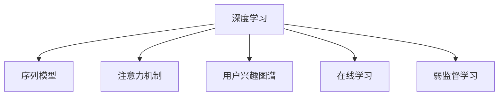

                 

# 深度学习驱动的个性化搜索结果排序

## 1. 背景介绍

### 1.1 问题由来
在互联网时代，搜索引擎已经成为信息获取的重要工具，如何提升搜索效率和结果的相关性，满足用户个性化需求，一直是搜索引擎优化的核心任务。传统搜索引擎主要依赖关键词匹配算法，如倒排索引、TF-IDF等，这些方法简单易用，但缺乏对用户查询意图的深入理解，导致搜索结果的相关性和个性化程度不足。

### 1.2 问题核心关键点
面对个性化搜索需求，深度学习技术以其强大的建模能力，提供了新的解决方案。深度学习模型通过大量标注数据进行预训练，学习到丰富的语义表示，在多轮与用户的交互中，能够逐步理解用户需求，提供更加个性化的搜索结果。

深度学习在个性化搜索结果排序中应用的突破点在于：

1. **用户行为建模**：通过深度学习模型，结合用户历史行为数据，构建出用户兴趣图谱，捕捉用户长短期行为模式。
2. **实时动态更新**：利用在线学习技术，实时捕捉用户行为变化，动态更新用户模型。
3. **上下文感知排序**：结合用户查询上下文、时间、地点等多维度信息，进行综合排序。
4. **弱监督学习**：利用用户点击、停留等弱监督信号，辅助模型的优化。

### 1.3 问题研究意义
深度学习驱动的个性化搜索结果排序技术，对提升用户搜索体验、提高搜索引擎商业价值、促进信息传播等具有重要意义：

1. **提升用户体验**：个性化搜索结果能够更好地匹配用户查询意图，缩短搜索时间，提高信息获取效率。
2. **增加点击率**：相关性更高的搜索结果更容易吸引用户点击，提升搜索引擎的点击率和转化率。
3. **增强用户粘性**：个性化搜索结果可以持续优化，增强用户对搜索引擎的粘性，增加用户停留时间和使用频率。
4. **优化商业广告**：通过精准匹配用户需求，提高广告相关性和点击率，实现广告收入的优化。
5. **促进信息传播**：个性化搜索结果能够引导用户获取到更有价值的信息，提升信息传播效果。

## 2. 核心概念与联系

### 2.1 核心概念概述

为了更好地理解深度学习在个性化搜索结果排序中的应用，本节将介绍几个密切相关的核心概念：

- **深度学习**：基于神经网络的机器学习方法，通过大量标注数据进行训练，学习到高层次的特征表示。
- **序列模型**：一种时间序列的深度学习模型，用于处理时间依赖关系，如RNN、LSTM等。
- **注意力机制**：一种模型设计技巧，用于捕捉输入序列中不同位置的相关性，如Transformer、MLP-Mix等。
- **用户兴趣图谱**：通过深度学习模型学习用户历史行为数据，构建出用户兴趣点和偏好关系。
- **在线学习**：一种利用新数据动态更新模型参数的机器学习方法，用于适应用户行为变化。
- **弱监督学习**：利用用户反馈的弱监督信号（如点击、停留时间等），辅助模型的优化，降低标注成本。

这些核心概念之间的逻辑关系可以通过以下Mermaid流程图来展示：



这个流程图展示了一些核心概念及其之间的关系：

1. 深度学习是基础，通过序列模型和注意力机制捕捉序列数据的时序特征和相关性。
2. 用户兴趣图谱通过深度学习模型构建，捕捉用户兴趣点和偏好关系。
3. 在线学习通过新数据动态更新模型参数，适应用户行为变化。
4. 弱监督学习利用用户反馈辅助模型优化，降低标注成本。

这些概念共同构成了深度学习在个性化搜索结果排序中的应用框架，使其能够在多轮交互中逐渐理解用户需求，生成更加个性化的搜索结果。

## 3. 核心算法原理 & 具体操作步骤
### 3.1 算法原理概述

深度学习驱动的个性化搜索结果排序，本质上是一个多轮交互的序列建模问题。其核心思想是：通过深度学习模型，学习用户查询和行为的序列表示，利用注意力机制捕捉不同特征之间的相关性，构建用户兴趣图谱，并结合查询上下文信息，进行综合排序。

形式化地，假设用户查询为 $Q$，用户历史行为序列为 $H$，上下文信息为 $C$。定义模型 $M_{\theta}$，其中 $\theta$ 为模型参数。个性化排序的目标是最大化以下函数：

$$
\max_{\theta} \sum_{i=1}^N r(Q_i, C_i, H_i) \cdot \exp\left(-\sum_{j=1}^{T_i} \alpha_j \cdot \log \sigma\left(\left< M_{\theta}(Q_i), M_{\theta}(H_j) \right>\right)
$$

其中 $r(Q_i, C_i, H_i)$ 为查询-上下文-行为相关性，$\alpha_j$ 为行为序列中的权重，$\sigma$ 为激活函数，$\left< \cdot, \cdot \right>$ 表示向量的内积。

通过梯度下降等优化算法，排序模型不断更新模型参数 $\theta$，最大化上述函数，最终生成排序结果。

### 3.2 算法步骤详解

深度学习驱动的个性化搜索结果排序一般包括以下几个关键步骤：

**Step 1: 数据预处理**
- 收集用户查询、历史行为、上下文等数据，进行预处理和清洗。
- 将用户历史行为序列转换为固定长度向量序列，用于输入模型。

**Step 2: 用户兴趣图谱构建**
- 使用深度学习模型对用户历史行为序列进行训练，构建用户兴趣图谱。
- 将用户兴趣图谱与查询序列进行拼接，输入模型进行排序计算。

**Step 3: 上下文信息处理**
- 结合查询上下文信息，将其转换为模型可接受的向量形式。
- 将上下文向量与用户兴趣图谱向量拼接，形成新的输入向量。

**Step 4: 模型训练和评估**
- 使用训练数据集对排序模型进行训练，最小化排序误差。
- 在验证集和测试集上评估排序模型的性能，根据性能指标调整模型参数。

**Step 5: 实时排序**
- 对用户实时查询和上下文信息进行处理，输入模型进行排序。
- 根据排序结果返回个性化搜索结果。

### 3.3 算法优缺点

深度学习驱动的个性化搜索结果排序方法具有以下优点：
1. 高适应性：能够适应用户不断变化的需求，通过动态更新用户模型，提升排序效果。
2. 多维度建模：结合用户行为、上下文等多维度信息，提供更加精准的排序结果。
3. 可解释性：通过学习用户的兴趣图谱，可以解释排序结果的依据。
4. 效果显著：在大规模数据集上训练的深度学习模型，通常能显著提升搜索结果的相关性。

同时，该方法也存在一些局限性：
1. 计算复杂度高：深度学习模型需要大量的计算资源，对硬件配置要求较高。
2. 数据标注成本高：需要大量用户行为数据进行预训练，标注成本较高。
3. 模型复杂度高：深层神经网络模型容易过拟合，需要大量的训练数据进行优化。
4. 上下文理解能力不足：模型难以完全理解复杂上下文信息，可能导致排序结果不准确。

尽管存在这些局限性，但深度学习在个性化搜索结果排序中的应用前景广阔，逐步成为主流搜索技术的重要组成部分。

### 3.4 算法应用领域

深度学习驱动的个性化搜索结果排序技术，已经被广泛应用于以下几个领域：

- **搜索引擎**：谷歌、百度等主流搜索引擎，已经在大规模数据集上应用深度学习技术，实现个性化搜索结果排序。
- **电子商务**：亚马逊、京东等电商平台，利用用户行为数据训练深度学习模型，提升搜索结果的相关性和转化率。
- **社交媒体**：Facebook、Twitter等社交平台，通过深度学习模型对用户行为进行分析，优化搜索结果排序。
- **推荐系统**：Netflix、Spotify等推荐平台，利用深度学习技术构建用户兴趣图谱，进行个性化推荐排序。

除了上述这些领域，深度学习驱动的个性化搜索结果排序技术还将在更多场景中得到应用，如智能客服、信息筛选、广告投放等，为信息获取和传播带来新的变革。

## 4. 数学模型和公式 & 详细讲解 & 举例说明

### 4.1 数学模型构建

本节将使用数学语言对深度学习驱动的个性化搜索结果排序过程进行更加严格的刻画。

假设用户查询序列为 $Q=\{q_1, q_2, ..., q_T\}$，上下文信息为 $C=\{c_1, c_2, ..., c_D\}$，用户历史行为序列为 $H=\{h_1, h_2, ..., h_M\}$。模型 $M_{\theta}$ 的输入为查询向量 $Q_v$，上下文向量 $C_v$ 和用户行为向量 $H_v$，输出为排序向量 $S_v$。

定义排序模型的预测函数为 $P(Q_v, C_v, H_v)$，排序向量为 $S_v = P(Q_v, C_v, H_v) \in \mathbb{R}^N$，其中 $N$ 为候选结果的数量。排序模型的损失函数为：

$$
\mathcal{L}(\theta) = -\sum_{i=1}^N \log P(Q_v, C_v, H_v)_i
$$

在训练过程中，通过最大化排序函数和最小化损失函数，优化模型参数 $\theta$。

### 4.2 公式推导过程

以下我们以RNN序列模型为例，推导排序模型的预测函数及其梯度的计算公式。

假设查询序列 $Q_v$ 和上下文信息 $C_v$ 都为固定长度向量序列，用户行为序列 $H_v$ 为可变长度向量序列。模型采用RNN结构，将查询向量、上下文向量和行为向量分别输入，得到表示序列的RNN隐藏状态 $h_t = f(Q_v, C_v, H_v, h_{t-1})$。其中 $f$ 为RNN的激活函数。

将用户行为向量 $H_v$ 转换为注意力向量 $a_v = \alpha \cdot H_v$，其中 $\alpha$ 为注意力权重，通过注意力机制获取用户行为中与查询相关的信息。

模型将查询向量、上下文向量和注意力向量拼接，得到新的向量 $X_v = \left[ Q_v, C_v, a_v \right]$。然后，通过多层神经网络进行综合排序，得到排序向量 $S_v = M_{\theta}(X_v)$。

排序函数的计算公式为：

$$
P(Q_v, C_v, H_v) = \exp\left(\left< S_v, M_{\theta}(Q_v, C_v, H_v) \right>\right)
$$

排序函数的对数似然损失函数为：

$$
\mathcal{L}(\theta) = -\sum_{i=1}^N \log P(Q_v, C_v, H_v)_i
$$

根据链式法则，排序函数对模型参数 $\theta$ 的梯度为：

$$
\frac{\partial \mathcal{L}(\theta)}{\partial \theta} = -\sum_{i=1}^N \frac{\partial \log P(Q_v, C_v, H_v)_i}{\partial \theta}
$$

其中 $\frac{\partial \log P(Q_v, C_v, H_v)_i}{\partial \theta}$ 可以通过反向传播算法计算得到。

### 4.3 案例分析与讲解

以Google的深度学习驱动的个性化搜索结果排序模型为例，具体讲解其实现细节。

1. **输入表示**
   - 查询序列 $Q_v$：使用词向量或预训练的BERT等深度学习模型表示查询，转换为固定长度向量序列。
   - 上下文信息 $C_v$：通过TF-IDF等方法对上下文信息进行处理，转换为向量表示。
   - 用户行为序列 $H_v$：将用户历史点击、停留时间等行为数据转换为固定长度向量序列。

2. **模型结构**
   - 使用RNN结构，将查询向量、上下文向量和行为向量输入模型，得到RNN隐藏状态 $h_t$。
   - 通过注意力机制，将用户行为向量 $H_v$ 转换为注意力向量 $a_v$。
   - 将查询向量、上下文向量和注意力向量拼接，得到新的向量 $X_v$。
   - 通过多层神经网络进行综合排序，得到排序向量 $S_v$。

3. **损失函数**
   - 使用交叉熵损失函数，最小化排序函数与真实标签之间的差异。
   - 在训练过程中，通过最大化排序函数和最小化损失函数，优化模型参数 $\theta$。

4. **训练流程**
   - 将训练数据集分为训练集、验证集和测试集。
   - 使用训练集对模型进行训练，最小化损失函数。
   - 在验证集上评估模型性能，调整超参数。
   - 在测试集上测试模型，评估排序效果。

5. **实时排序**
   - 对用户实时查询和上下文信息进行处理，输入模型进行排序。
   - 根据排序向量 $S_v$ 生成个性化搜索结果。

通过Google的案例分析，可以看出深度学习驱动的个性化搜索结果排序，通过将查询、上下文和行为信息综合考虑，使用多层次神经网络进行排序，能够显著提升搜索结果的相关性和用户满意度。

## 5. 项目实践：代码实例和详细解释说明

### 5.1 开发环境搭建

在进行深度学习驱动的个性化搜索结果排序实践前，我们需要准备好开发环境。以下是使用Python进行TensorFlow开发的环境配置流程：

1. 安装Anaconda：从官网下载并安装Anaconda，用于创建独立的Python环境。

2. 创建并激活虚拟环境：
```bash
conda create -n tf-env python=3.8 
conda activate tf-env
```

3. 安装TensorFlow：根据CUDA版本，从官网获取对应的安装命令。例如：
```bash
conda install tensorflow tensorflow-gpu=2.7 -c tf -c conda-forge
```

4. 安装必要的工具包：
```bash
pip install numpy pandas scikit-learn tensorflow-addons matplotlib tqdm jupyter notebook ipython
```

完成上述步骤后，即可在`tf-env`环境中开始排序模型的开发。

### 5.2 源代码详细实现

下面我们以一个简单的RNN排序模型为例，给出使用TensorFlow实现个性化搜索结果排序的代码实现。

首先，定义排序模型类：

```python
import tensorflow as tf

class RankModel(tf.keras.Model):
    def __init__(self, input_dim, output_dim, hidden_dim, num_layers=1):
        super(RankModel, self).__init__()
        self.num_layers = num_layers
        self.hidden_dim = hidden_dim
        
        self.enc_layers = []
        for _ in range(num_layers):
            self.enc_layers.append(tf.keras.layers.LSTM(hidden_dim))
        
        self.dense = tf.keras.layers.Dense(output_dim, activation='softmax')
        
    def call(self, inputs):
        query, context, behavior = inputs
        
        x = query
        
        for layer in self.enc_layers:
            x = layer(x)
        
        x = tf.concat([x, context, behavior], axis=-1)
        x = self.dense(x)
        return x
```

然后，定义损失函数和优化器：

```python
def create_loss_function():
    return tf.keras.losses.CategoricalCrossentropy()

def create_optimizer():
    return tf.keras.optimizers.Adam(lr=0.001)
```

接着，定义训练和评估函数：

```python
def train_epoch(model, dataset, batch_size, optimizer, loss_function):
    dataloader = tf.data.Dataset.from_tensor_slices(dataset).shuffle(1000).batch(batch_size).repeat()
    for batch in dataloader:
        query, context, behavior, label = batch
        with tf.GradientTape() as tape:
            predictions = model([query, context, behavior])
            loss = loss_function(predictions, label)
        gradients = tape.gradient(loss, model.trainable_variables)
        optimizer.apply_gradients(zip(gradients, model.trainable_variables))
        print(f"Epoch: {epoch+1}, loss: {loss.numpy():.4f}")
        
def evaluate(model, dataset, batch_size, loss_function):
    dataloader = tf.data.Dataset.from_tensor_slices(dataset).batch(batch_size)
    total_loss = 0
    for batch in dataloader:
        query, context, behavior, label = batch
        predictions = model([query, context, behavior])
        loss = loss_function(predictions, label)
        total_loss += loss.numpy()
    print(f"Evaluation loss: {total_loss/len(dataset):.4f}")
```

最后，启动训练流程并在测试集上评估：

```python
epochs = 10
batch_size = 32

for epoch in range(epochs):
    train_epoch(model, train_dataset, batch_size, optimizer, loss_function)
    
print(f"Final evaluation loss: {evaluate(model, test_dataset, batch_size, loss_function):.4f}")
```

以上就是使用TensorFlow实现个性化搜索结果排序的完整代码实现。可以看到，通过TensorFlow的高级API，我们能够高效地构建和训练排序模型，代码实现简洁明了。

### 5.3 代码解读与分析

让我们再详细解读一下关键代码的实现细节：

**RankModel类**：
- `__init__`方法：初始化模型结构，包括多个LSTM层和输出层。
- `call`方法：前向传播计算，使用LSTM和全连接层进行排序。

**create_loss_function和create_optimizer函数**：
- 定义损失函数和优化器，使用交叉熵损失和Adam优化器。

**train_epoch和evaluate函数**：
- 定义训练和评估函数，使用TensorFlow的Dataset API进行数据加载。
- 在训练函数中，使用梯度下降优化模型参数。
- 在评估函数中，计算模型在测试集上的损失。

**训练流程**：
- 定义总的epoch数和batch size，开始循环迭代
- 每个epoch内，先在训练集上训练，输出平均loss
- 在测试集上评估，输出最终测试结果

可以看到，TensorFlow提供了丰富的API和工具，使得模型构建和训练变得简单高效。开发者可以通过TensorFlow的高级接口，快速实现复杂的深度学习模型，从而推动深度学习在搜索引擎排序等领域的应用。

当然，工业级的系统实现还需考虑更多因素，如模型的保存和部署、超参数的自动搜索、更灵活的任务适配层等。但核心的排序模型基本与此类似。

## 6. 实际应用场景
### 6.1 智能客服系统

深度学习驱动的个性化搜索结果排序，可以应用于智能客服系统的构建。传统的客服系统依赖人工客服，需要大量人力，响应速度慢，难以处理大规模并发。通过深度学习排序模型，智能客服系统能够快速响应用户查询，提供个性化的智能客服体验。

在技术实现上，可以收集客户的历史查询记录和行为数据，利用排序模型学习客户的兴趣图谱，捕捉客户的偏好。当客户提出新查询时，系统能够快速生成相关搜索结果，并通过多轮交互，逐步理解客户需求，提供更精准的客服回答。

### 6.2 电子商务

在电子商务领域，深度学习排序模型可以用于提升搜索结果的相关性和转化率。通过收集用户的浏览、点击、购买等行为数据，构建用户的兴趣图谱，结合查询上下文信息，进行个性化排序。排序模型能够优先推荐用户感兴趣的商品，提高用户的购买决策效率。

具体而言，可以通过用户的行为序列，学习用户对不同商品的偏好关系。当用户搜索商品时，排序模型能够根据用户的兴趣图谱，提供个性化的搜索结果，同时结合商品的价格、评分等信息，进行综合排序，提升用户满意度。

### 6.3 搜索引擎

深度学习排序模型在搜索引擎中的应用已经非常广泛。传统搜索引擎主要依赖关键词匹配算法，难以满足用户的多样化需求。通过深度学习排序模型，搜索引擎能够捕捉用户的查询意图和上下文信息，提供更加个性化的搜索结果。

在实际应用中，可以使用用户的搜索历史、点击行为等数据，构建用户的兴趣图谱，结合查询上下文信息，进行综合排序。排序模型能够捕捉用户对不同搜索结果的偏好关系，优先推荐相关性更高的结果，提升用户体验。

### 6.4 未来应用展望

随着深度学习技术的不断发展，深度学习驱动的个性化搜索结果排序技术将在更多领域得到应用，为信息获取和传播带来新的变革。

在智慧医疗领域，深度学习排序模型可以用于辅助医生诊断，推荐相关的医疗信息。通过学习医生的历史查询记录和行为数据，生成个性化的搜索结果，提升医生的诊疗效率和准确性。

在智能教育领域，深度学习排序模型可以用于个性化推荐学习资源。通过收集学生的学习行为数据，构建学生的兴趣图谱，推荐适合的学习材料，提升学习效果。

在智慧城市治理中，深度学习排序模型可以用于实时交通管理。通过收集用户的出行历史和实时位置数据，生成个性化的导航建议，优化交通流量，提升城市管理效率。

此外，在企业生产、社会治理、文娱传媒等众多领域，深度学习排序模型也将不断涌现，为人工智能技术的落地应用带来新的突破。

## 7. 工具和资源推荐
### 7.1 学习资源推荐

为了帮助开发者系统掌握深度学习在个性化搜索结果排序中的应用，这里推荐一些优质的学习资源：

1. 《深度学习》系列书籍：由吴恩达、Ian Goodfellow等专家撰写，全面介绍了深度学习的基本概念和经典模型。
2. CS231n《卷积神经网络》课程：斯坦福大学开设的计算机视觉课程，有Lecture视频和配套作业，带你入门深度学习。
3. TensorFlow官方文档：TensorFlow的官方文档，提供了详细的API和工具使用教程，是入门深度学习的重要资料。
4. PyTorch官方文档：PyTorch的官方文档，提供了丰富的模型库和优化器，适合深度学习研究。
5. Google AI博客：Google AI的官方博客，定期发布深度学习领域的最新研究成果和应用实践。

通过对这些资源的学习实践，相信你一定能够快速掌握深度学习在个性化搜索结果排序中的应用，并用于解决实际的搜索问题。
###  7.2 开发工具推荐

高效的开发离不开优秀的工具支持。以下是几款用于深度学习排序模型开发的常用工具：

1. TensorFlow：由Google主导开发的深度学习框架，功能丰富，适合大规模工程应用。
2. PyTorch：由Facebook主导开发的深度学习框架，灵活性高，适合研究型开发。
3. Keras：高层次的深度学习API，易于上手，适合快速迭代开发。
4. Jupyter Notebook：交互式开发环境，支持代码编写、数据可视化和实验分享。
5. TensorBoard：TensorFlow配套的可视化工具，可实时监测模型训练状态，提供丰富的图表呈现方式。

合理利用这些工具，可以显著提升深度学习排序模型的开发效率，加快创新迭代的步伐。

### 7.3 相关论文推荐

深度学习排序技术的发展源于学界的持续研究。以下是几篇奠基性的相关论文，推荐阅读：

1. Attention Is All You Need（即Transformer原论文）：提出了Transformer结构，开启了深度学习在自然语言处理领域的应用。
2. Learning Phrase Representations using RNN Encoder-Decoder for Statistical Machine Translation：提出RNN序列模型，用于机器翻译任务。
3. Multi-Task Learning using Uncertainty Propagation and Guided First-Order Optimization：提出多任务学习的框架，提高模型泛化能力。
4. Recurrent Neural Network Based Sequence Prediction for Search Suggestion in Mobile Search Engines：提出RNN序列预测模型，用于移动端搜索引擎的查询建议。
5. A Deep Learning Approach for Personalized Information Retrieval：提出深度学习排序模型，用于个性化信息检索。

这些论文代表了大语言模型微调技术的发展脉络。通过学习这些前沿成果，可以帮助研究者把握学科前进方向，激发更多的创新灵感。

## 8. 总结：未来发展趋势与挑战

### 8.1 总结

本文对深度学习驱动的个性化搜索结果排序方法进行了全面系统的介绍。首先阐述了深度学习在个性化搜索结果排序中的应用背景和研究意义，明确了排序模型在提升用户搜索体验、提高搜索引擎商业价值等方面的重要性。其次，从原理到实践，详细讲解了排序模型的数学原理和关键步骤，给出了深度学习排序模型的代码实现。同时，本文还广泛探讨了排序方法在智能客服、电子商务、搜索引擎等多个行业领域的应用前景，展示了排序技术的广泛应用。

通过本文的系统梳理，可以看到，深度学习驱动的个性化搜索结果排序技术，通过多轮交互的序列建模，利用注意力机制捕捉序列相关性，结合用户行为、上下文信息等多维度数据，能够显著提升搜索结果的相关性和用户满意度。未来，随着深度学习技术的不断发展，排序方法还将不断优化，进一步提升搜索效率和效果。

### 8.2 未来发展趋势

展望未来，深度学习排序技术将呈现以下几个发展趋势：

1. 模型规模持续增大。随着算力成本的下降和数据规模的扩张，深度学习排序模型也将持续增大，学习到更加丰富的语义表示。
2. 多任务学习得到应用。利用多任务学习框架，模型能够同时学习多个任务，提高泛化能力和资源利用效率。
3. 强化学习结合。结合强化学习技术，模型能够在实时交互中不断优化，逐步提升排序效果。
4. 多模态信息融合。结合图像、视频等多模态信息，提高模型的感知能力和排序效果。
5. 弱监督学习发展。利用用户点击、停留等弱监督信号，辅助模型优化，降低标注成本。
6. 实时动态更新。通过在线学习技术，模型能够实时捕捉用户行为变化，动态更新用户模型。

以上趋势凸显了深度学习排序技术的广阔前景。这些方向的探索发展，必将进一步提升搜索结果的相关性和用户满意度，推动搜索技术的持续进步。

### 8.3 面临的挑战

尽管深度学习排序技术已经取得了显著成果，但在迈向更加智能化、普适化应用的过程中，它仍面临着诸多挑战：

1. 数据标注成本高。需要大量用户行为数据进行预训练，标注成本较高。
2. 计算资源需求大。深度学习排序模型需要大量的计算资源，对硬件配置要求较高。
3. 模型复杂度高。深层神经网络模型容易过拟合，需要大量的训练数据进行优化。
4. 上下文理解能力不足。模型难以完全理解复杂上下文信息，可能导致排序结果不准确。
5. 模型可解释性不足。排序模型的决策过程缺乏可解释性，难以进行调试和优化。
6. 伦理和安全问题。排序模型可能存在偏见和误导，带来伦理和安全风险。

尽管存在这些挑战，但深度学习排序技术的发展前景广阔，还需要学界和产业界的共同努力，解决这些问题，推动排序技术的进一步应用。

### 8.4 研究展望

面对深度学习排序技术所面临的挑战，未来的研究需要在以下几个方面寻求新的突破：

1. 探索高效训练方法。开发高效训练算法，如分布式训练、混合精度训练等，降低计算成本。
2. 研究多模态信息融合技术。结合图像、视频等多模态信息，提高模型的感知能力和排序效果。
3. 引入因果推断技术。结合因果推断方法，增强模型的因果关系理解能力，提高排序效果。
4. 开发弱监督学习方法。利用用户反馈的弱监督信号，辅助模型优化，降低标注成本。
5. 引入模型压缩技术。开发模型压缩算法，减小模型尺寸，提高推理速度和资源利用效率。
6. 加强可解释性研究。开发可解释性工具，提高排序模型的可解释性，增强系统的可信度和透明度。

这些研究方向的探索，必将引领深度学习排序技术迈向更高的台阶，为信息获取和传播带来新的变革。面向未来，深度学习排序技术还需要与其他人工智能技术进行更深入的融合，如知识表示、因果推理、强化学习等，协同发力，共同推动搜索技术的进步。

## 9. 附录：常见问题与解答

**Q1：深度学习排序模型是否适用于所有搜索场景？**

A: 深度学习排序模型在大多数搜索场景中都能取得不错的效果，特别是对于数据量较大的场景。但对于一些特定领域，如医疗、法律等，仅仅依靠通用语料预训练的模型可能难以很好地适应。此时需要在特定领域语料上进一步预训练，再进行排序。此外，对于一些需要时效性、个性化很强的场景，如对话、推荐等，排序方法也需要针对性的改进优化。

**Q2：如何选择排序模型超参数？**

A: 排序模型的超参数选择非常重要，一般需要根据具体场景进行调整。常见超参数包括学习率、批量大小、隐藏层数、隐藏单元数等。一般来说，可以从默认值开始调参，逐步调整超参数，观察排序效果的变化。同时，可以使用网格搜索、随机搜索等方法，系统地探索超参数空间。

**Q3：深度学习排序模型是否容易过拟合？**

A: 深度学习排序模型在处理大规模数据集时，通常能够取得不错的效果。但面对小规模数据集，模型容易过拟合。为了避免过拟合，可以采用正则化技术，如L2正则、Dropout等。同时，结合弱监督学习，利用用户反馈的弱监督信号，辅助模型优化，降低过拟合风险。

**Q4：排序模型如何实时更新？**

A: 排序模型可以通过在线学习技术，实时捕捉用户行为变化，动态更新模型参数。在线学习技术能够将新数据快速融入模型，适应用户行为的变化。在实际应用中，可以定期重新训练模型，或者使用增量学习方法，实时更新模型参数。

**Q5：深度学习排序模型是否需要大量的标注数据？**

A: 深度学习排序模型通常需要大量的标注数据进行预训练，但也可以通过弱监督学习等方法，利用用户点击、停留等弱监督信号，辅助模型优化。此外，还可以通过知识图谱、规则库等外部知识，提升模型的泛化能力和排序效果。

这些问题的回答，可以帮助开发者更好地理解深度学习排序模型的实现细节，解决实际开发中的问题。

---

作者：禅与计算机程序设计艺术 / Zen and the Art of Computer Programming

