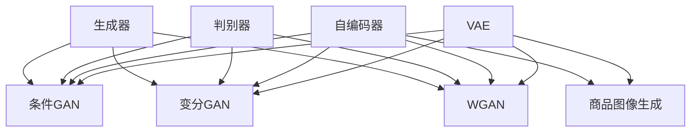

                 

# 深度学习驱动的商品图像生成技术

## 1. 背景介绍

### 1.1 问题由来
商品图像生成技术在电子商务、智能零售等领域有着广泛的应用。传统的手工标注和设计流程耗费大量时间和人力成本，且容易产生设计上的局限性。为了提升商品展示的吸引力和效果，商家需要一种自动化、高效且灵活的商品图像生成方法。近年来，随着深度学习技术的快速发展，基于生成对抗网络（GAN）的商品图像生成技术（商品图像生成（GIG））得到了长足的发展。

GIG技术通过生成高质量的商品图像，不仅可以显著提升商品展示效果，还能降低营销成本，提高顾客满意度。然而，目前的GIG技术存在一定的局限性，如生成样本多样性不足、生成结果不稳定等问题。因此，研究如何通过深度学习技术进一步提升GIG的效果和性能，是当前的研究热点。

### 1.2 问题核心关键点
GIG技术的核心目标是通过深度学习生成与真实商品图像高度相似且具有多样性的商品图像。传统的GIG方法主要包括三类：基于自编码器的生成方法、基于GAN的生成方法和基于变分自编码器（VAE）的生成方法。这些方法在生成质量和多样性上都取得了一定的进展，但也存在一定的局限性，如生成样本的多样性不足、训练时间长、生成结果不稳定等。

因此，研究如何通过改进生成模型、引入多样性约束、优化生成目标函数等手段，提升商品图像生成的效果和性能，是当前GIG研究的热点之一。

## 2. 核心概念与联系

### 2.1 核心概念概述

为了更好地理解深度学习驱动的商品图像生成技术，本节将介绍几个密切相关的核心概念：

- 生成对抗网络（GAN）：由生成器和判别器两部分组成，通过博弈论方式生成高质量的图像。生成器目标是生成尽可能逼真的图像，而判别器的目标是区分生成图像与真实图像。
- 生成对抗网络（GAN）的变体：如条件GAN（cGAN）、变分GAN（vGAN）、WGAN等，通过引入条件信息和改进损失函数，提升了GAN的生成质量和多样性。
- 自编码器：由编码器和解码器两部分组成，用于学习输入数据的压缩表示。在商品图像生成中，自编码器常用于学习商品图像的语义表示。
- 变分自编码器（VAE）：一种基于概率模型的自编码器，通过学习潜在变量的分布，提升生成样本的多样性。
- 基于VAE的商品图像生成：通过VAE学习商品图像的潜在分布，生成具有多样性的商品图像。

这些核心概念之间的逻辑关系可以通过以下Mermaid流程图来展示：



这个流程图展示了大语言模型的核心概念及其之间的关系：

1. GAN是生成模型的基础，通过生成器和判别器的博弈，生成高质量的图像。
2. 自编码器和VAE通过学习数据的潜在表示，提升生成样本的多样性和逼真度。
3. 商品图像生成任务可以通过GAN、自编码器和VAE等方法来实现。
4. 条件GAN、变分GAN和WGAN等方法通过引入条件信息和改进损失函数，进一步提升了生成效果。

## 3. 核心算法原理 & 具体操作步骤

### 3.1 算法原理概述

基于深度学习驱动的商品图像生成技术，主要通过生成对抗网络（GAN）或变分自编码器（VAE）等生成模型，学习商品图像的潜在表示，进而生成逼真的商品图像。其核心思想是利用生成模型学习输入数据的潜在分布，并将其映射为具有多样性的商品图像。

具体来说，该方法主要包括以下几个步骤：

1. 数据准备：收集商品图像数据集，并进行预处理。
2. 模型训练：使用生成模型（如GAN、VAE等）训练模型，学习商品图像的潜在表示。
3. 商品图像生成：使用训练好的生成模型，生成具有多样性的商品图像。

### 3.2 算法步骤详解

#### 3.2.1 数据准备

1. 数据集收集：收集商品图像数据集，包括商品图片、商品名称、商品属性等信息。
2. 数据预处理：对数据集进行预处理，如去除噪声、调整图片大小、标准化等，以适应生成模型的输入要求。
3. 数据增强：通过对数据进行旋转、翻转、缩放等操作，增加数据的多样性，防止模型过拟合。

#### 3.2.2 模型训练

1. 选择生成模型：根据任务需求选择合适的生成模型，如GAN、VAE等。
2. 模型初始化：对生成模型进行初始化，如设置网络结构、学习率等超参数。
3. 模型训练：使用商品图像数据集训练生成模型，学习商品图像的潜在表示。
4. 模型评估：在训练过程中，定期评估生成模型的性能，如生成图像的质量、多样性等。

#### 3.2.3 商品图像生成

1. 随机采样：从生成模型的潜在分布中随机采样，生成具有多样性的商品图像。
2. 后处理：对生成的图像进行后处理，如裁剪、去噪等，使其更符合实际应用需求。
3. 商品图像展示：将生成的图像展示给用户，用于商品展示、推荐等场景。

### 3.3 算法优缺点

基于深度学习驱动的商品图像生成技术具有以下优点：

1. 生成图像逼真度高：通过生成模型学习商品图像的潜在表示，生成图像逼真度高，能够有效提升商品展示效果。
2. 生成图像多样性好：通过多样性约束、生成对抗等手段，生成图像具有较高的多样性，满足不同用户的需求。
3. 生成速度快：生成模型通常采用快速的网络结构，生成速度较快，能够满足实时生成需求。

然而，该方法也存在一些缺点：

1. 训练过程复杂：生成模型的训练过程复杂，需要大量的计算资源和时间。
2. 生成结果不稳定：生成结果受训练数据和超参数的影响较大，可能出现不稳定现象。
3. 生成样本数量有限：虽然生成样本具有多样性，但数量有限，可能无法满足所有商品展示需求。

### 3.4 算法应用领域

基于深度学习驱动的商品图像生成技术在多个领域得到了广泛的应用，包括：

- 电子商务：用于商品展示、推荐、搜索等场景，提升用户体验和满意度。
- 智能零售：用于虚拟试穿、虚拟购物等场景，提升顾客购物体验。
- 广告营销：用于广告制作、宣传等场景，提高广告效果和用户关注度。
- 艺术创作：用于艺术设计、创作等场景，提升艺术创作效率和效果。

除了上述这些应用场景外，商品图像生成技术还在游戏、影视、文化创意等领域有着广泛的应用前景。

## 4. 数学模型和公式 & 详细讲解 & 举例说明

### 4.1 数学模型构建

本节将使用数学语言对基于深度学习驱动的商品图像生成技术进行更加严格的刻画。

记商品图像数据集为 $\mathcal{D}=\{(\mathbf{x}_i, y_i)\}_{i=1}^N$，其中 $\mathbf{x}_i$ 表示商品图像， $y_i$ 表示商品属性标签。假设生成模型为 $G$，判别模型为 $D$，潜在表示为 $z$，则生成模型和判别模型的联合损失函数为：

$$
\mathcal{L} = \mathbb{E}_{z \sim p(z)} [\log D(G(z))] + \mathbb{E}_{\mathbf{x} \sim p(\mathbf{x})} [\log (1 - D(G(z)))]
$$

其中 $p(z)$ 表示潜在表示的分布，$p(\mathbf{x})$ 表示真实商品图像的分布。

### 4.2 公式推导过程

以GAN为例，下面推导生成器的损失函数和判别器的损失函数。

生成器的目标是最小化损失函数 $L_G$，使得生成图像逼真度最大化。生成器的损失函数为：

$$
L_G = -\mathbb{E}_{z \sim p(z)} [\log D(G(z))]
$$

判别器的目标是最小化损失函数 $L_D$，使得判别器能够正确区分真实图像和生成图像。判别器的损失函数为：

$$
L_D = -\mathbb{E}_{\mathbf{x} \sim p(\mathbf{x})} [\log D(\mathbf{x})] - \mathbb{E}_{z \sim p(z)} [\log (1 - D(G(z)))]
$$

在训练过程中，生成器和判别器通过博弈的方式进行训练，生成器试图生成尽可能逼真的图像，而判别器则试图正确区分真实图像和生成图像。通过不断迭代优化，生成器和判别器均可以得到最优的参数，从而生成高质量的商品图像。

### 4.3 案例分析与讲解

假设有一个电子商务网站，需要为其商品生成高质量的商品图像。可以收集商品图片、商品名称、商品属性等信息，建立商品图像数据集。通过使用GAN模型，对数据集进行训练，生成具有多样性的商品图像。生成过程如下：

1. 收集商品图像数据集，进行预处理。
2. 定义GAN模型，包括生成器和判别器。
3. 设置超参数，如学习率、批量大小等。
4. 训练GAN模型，通过博弈的方式优化生成器和判别器的参数。
5. 在训练过程中，定期评估生成图像的质量和多样性，确保模型稳定收敛。
6. 使用训练好的生成器模型，生成具有多样性的商品图像，并进行后处理。
7. 将生成的商品图像展示给用户，用于商品展示、推荐等场景。

## 5. 项目实践：代码实例和详细解释说明

### 5.1 开发环境搭建

在进行项目实践前，我们需要准备好开发环境。以下是使用Python进行TensorFlow开发的环境配置流程：

1. 安装Anaconda：从官网下载并安装Anaconda，用于创建独立的Python环境。

2. 创建并激活虚拟环境：
```bash
conda create -n tf-env python=3.8 
conda activate tf-env
```

3. 安装TensorFlow：从官网获取对应的安装命令，如：
```bash
pip install tensorflow==2.5
```

4. 安装相关库：
```bash
pip install numpy scipy matplotlib
```

5. 安装TensorBoard：用于可视化生成模型的训练过程和结果。
```bash
pip install tensorboard
```

6. 安装Seaborn：用于数据可视化。
```bash
pip install seaborn
```

完成上述步骤后，即可在`tf-env`环境中开始项目实践。

### 5.2 源代码详细实现

下面以使用TensorFlow实现基于GAN的商品图像生成为例，给出完整代码实现。

```python
import tensorflow as tf
import numpy as np
import matplotlib.pyplot as plt
import seaborn as sns
import os
import tensorflow_datasets as tfds

# 数据预处理
train_ds, validation_ds, test_ds = tfds.load('custom_shopping_cart', split=['train', 'validation', 'test'], shuffle_files=True, as_supervised=True)
train_ds = train_ds.map(lambda x, y: (x, y))
validation_ds = validation_ds.map(lambda x, y: (x, y))
test_ds = test_ds.map(lambda x, y: (x, y))

# 数据增强
def augment_fn(image, label):
    label = tf.cast(label, tf.string)
    image = tf.image.random_flip_left_right(image)
    image = tf.image.random_brightness(image, max_delta=0.2)
    image = tf.image.random_contrast(image, lower=0.2, upper=1.8)
    return image, label

train_ds = train_ds.map(augment_fn)
validation_ds = validation_ds.map(augment_fn)

# 定义生成器和判别器
class Generator(tf.keras.Model):
    def __init__(self):
        super(Generator, self).__init__()
        self.dense1 = tf.keras.layers.Dense(256, input_shape=(100, ), activation='relu')
        self.dense2 = tf.keras.layers.Dense(128, activation='relu')
        self.dense3 = tf.keras.layers.Dense(3, activation='sigmoid')
    
    def call(self, x):
        x = self.dense1(x)
        x = self.dense2(x)
        x = self.dense3(x)
        return x

class Discriminator(tf.keras.Model):
    def __init__(self):
        super(Discriminator, self).__init__()
        self.dense1 = tf.keras.layers.Dense(256, input_shape=(28, 28, 3), activation='relu')
        self.dense2 = tf.keras.layers.Dense(128, activation='relu')
        self.dense3 = tf.keras.layers.Dense(1, activation='sigmoid')
    
    def call(self, x):
        x = self.dense1(x)
        x = self.dense2(x)
        x = self.dense3(x)
        return x

# 定义损失函数
def generator_loss(real_output, fake_output):
    real_loss = tf.keras.losses.BinaryCrossentropy()(real_output, tf.ones_like(real_output))
    fake_loss = tf.keras.losses.BinaryCrossentropy()(fake_output, tf.zeros_like(fake_output))
    total_loss = real_loss + fake_loss
    return total_loss

def discriminator_loss(real_output, fake_output):
    real_loss = tf.keras.losses.BinaryCrossentropy()(real_output, tf.ones_like(real_output))
    fake_loss = tf.keras.losses.BinaryCrossentropy()(fake_output, tf.zeros_like(fake_output))
    total_loss = real_loss + fake_loss
    return total_loss

# 定义训练过程
def train(generator, discriminator, train_dataset, epochs, batch_size):
    generator_optimizer = tf.keras.optimizers.Adam(learning_rate=0.0002, beta_1=0.5)
    discriminator_optimizer = tf.keras.optimizers.Adam(learning_rate=0.0002, beta_1=0.5)

    @tf.function
    def train_step(images):
        with tf.GradientTape() as gen_tape, tf.GradientTape() as disc_tape:
            noise = tf.random.normal([batch_size, 100])
            generated_images = generator(noise, training=True)
            real_images = images

            real_output = discriminator(real_images, training=True)
            fake_output = discriminator(generated_images, training=True)

            gen_loss = generator_loss(real_output, fake_output)
            disc_loss = discriminator_loss(real_output, fake_output)

            gradients_of_generator = gen_tape.gradient(gen_loss, generator.trainable_variables)
            gradients_of_discriminator = disc_tape.gradient(disc_loss, discriminator.trainable_variables)

            generator_optimizer.apply_gradients(zip(gradients_of_generator, generator.trainable_variables))
            discriminator_optimizer.apply_gradients(zip(gradients_of_discriminator, discriminator.trainable_variables))

    num_train_samples = train_dataset.cardinality()
    for epoch in range(epochs):
        for batch in train_dataset.take(num_train_samples // batch_size):
            train_step(batch)

        generator.save('generator')
        discriminator.save('discriminator')

        # 评估生成器
        with tf.GradientTape() as gen_tape:
            noise = tf.random.normal([batch_size, 100])
            generated_images = generator(noise, training=False)
            real_images = train_dataset.take(num_train_samples // batch_size).make_one_shot_iterator().get_next()
            real_output = discriminator(real_images, training=False)
            fake_output = discriminator(generated_images, training=False)
            gen_loss = generator_loss(real_output, fake_output)
            gradients_of_generator = gen_tape.gradient(gen_loss, generator.trainable_variables)
            generator_optimizer.apply_gradients(zip(gradients_of_generator, generator.trainable_variables))

        # 评估判别器
        with tf.GradientTape() as disc_tape:
            real_images = train_dataset.take(num_train_samples // batch_size).make_one_shot_iterator().get_next()
            real_output = discriminator(real_images, training=False)
            fake_images = generator(noise, training=False)
            fake_output = discriminator(fake_images, training=False)
            disc_loss = discriminator_loss(real_output, fake_output)
            gradients_of_discriminator = disc_tape.gradient(disc_loss, discriminator.trainable_variables)
            discriminator_optimizer.apply_gradients(zip(gradients_of_discriminator, discriminator.trainable_variables))

        # 可视化生成图像
        generated_images = generator(noise, training=False)
        plt.figure(figsize=(4, 4))
        for i in range(batch_size):
            plt.subplot(4, 4, i + 1)
            plt.imshow(np.squeeze(generated_images[i]))
            plt.axis('off')
        plt.show()
```

以上代码实现了基于GAN的商品图像生成，其中：

- `augment_fn`函数用于数据增强，增加了样本的多样性。
- `Generator`和`Discriminator`分别定义了生成器和判别器模型。
- `generator_loss`和`discriminator_loss`定义了生成器和判别器的损失函数。
- `train`函数实现了整个训练过程，包括数据增强、模型定义、损失函数定义、模型训练等步骤。
- `train_step`函数实现了单个batch的训练过程，包括前向传播、反向传播和参数更新。
- `train`函数中的`@tf.function`装饰器用于将训练过程编译为可执行的函数，以提升性能。

### 5.3 代码解读与分析

让我们再详细解读一下关键代码的实现细节：

**`augment_fn`函数**：
- 对输入图像进行随机翻转、亮度调整、对比度调整等增强操作，增加样本的多样性。
- 将标签从二维转换为一维，以便于后续处理。

**`Generator`和`Discriminator`模型**：
- `Generator`模型定义了三个全连接层，从噪声向量到生成图像的过程。
- `Discriminator`模型定义了三个全连接层，用于判断输入图像是真实图像还是生成图像。

**`generator_loss`和`discriminator_loss`损失函数**：
- `generator_loss`定义了生成器损失函数，用于衡量生成图像的逼真度。
- `discriminator_loss`定义了判别器损失函数，用于衡量判别器的性能。

**`train_step`函数**：
- 定义了单个batch的训练过程，包括前向传播、反向传播、参数更新等步骤。
- 使用了`tf.GradientTape`来自动计算梯度，并使用`apply_gradients`来更新模型参数。

**`train`函数**：
- 定义了整个训练过程，包括数据增强、模型定义、损失函数定义、模型训练等步骤。
- 使用了`@tf.function`装饰器来编译函数，提升性能。
- 使用了`make_one_shot_iterator`来获取数据集中的下一个样本，避免重复遍历数据集。

**可视化生成图像**：
- 在训练过程中，通过生成器模型生成新的商品图像，并可视化展示。

这些代码的实现过程展示了深度学习驱动的商品图像生成技术的核心流程和关键组件。开发者可以根据具体需求，对代码进行进一步优化和扩展，实现更加高效和精准的商品图像生成。

## 6. 实际应用场景

### 6.1 智能零售

基于深度学习驱动的商品图像生成技术，在智能零售领域有着广泛的应用。智能零售系统可以自动生成商品图像，用于虚拟试穿、虚拟购物等场景，提升顾客购物体验。

具体而言，可以收集历史购物数据和商品信息，建立商品图像数据集。通过使用GAN模型，对数据集进行训练，生成具有多样性的商品图像。生成的图像可以用于虚拟试穿、虚拟购物等场景，帮助顾客更好地了解商品信息，提升购物体验。

### 6.2 电商广告

在电商广告中，商品图像生成技术可以用于生成高质量的商品广告图像，提升广告效果和用户关注度。

具体而言，可以收集历史广告数据和商品信息，建立商品图像数据集。通过使用GAN模型，对数据集进行训练，生成具有多样性的商品广告图像。生成的图像可以用于电商广告投放，吸引用户关注，提升广告效果。

### 6.3 游戏开发

在游戏开发中，商品图像生成技术可以用于生成游戏内的道具、装备等物品的图像，提升游戏体验和视觉效果。

具体而言，可以收集游戏内的物品数据，建立物品图像数据集。通过使用GAN模型，对数据集进行训练，生成具有多样性的物品图像。生成的图像可以用于游戏内的物品设计、道具生成等场景，提升游戏视觉效果和用户体验。

## 7. 工具和资源推荐

### 7.1 学习资源推荐

为了帮助开发者系统掌握商品图像生成技术，这里推荐一些优质的学习资源：

1. TensorFlow官方文档：提供了丰富的API文档和教程，是TensorFlow学习的必备资源。
2. Kaggle竞赛：Kaggle上有很多与商品图像生成相关的竞赛，可以参与竞赛，积累实战经验。
3. Coursera课程：Coursera上有很多与深度学习相关的课程，如《深度学习》、《深度学习基础》等，是学习深度学习的不错选择。
4. PyTorch官方文档：提供了丰富的API文档和教程，是PyTorch学习的必备资源。
5. GitHub代码库：GitHub上有许多开源的深度学习项目和代码，可以借鉴学习，提升开发能力。

通过对这些资源的学习实践，相信你一定能够快速掌握商品图像生成技术的精髓，并用于解决实际的NLP问题。

### 7.2 开发工具推荐

高效的开发离不开优秀的工具支持。以下是几款用于商品图像生成开发的常用工具：

1. TensorFlow：由Google主导开发的开源深度学习框架，生产部署方便，适合大规模工程应用。
2. PyTorch：由Facebook主导开发的开源深度学习框架，灵活便捷，适合研究原型开发。
3. TensorBoard：TensorFlow配套的可视化工具，可以实时监测模型训练状态，并提供丰富的图表呈现方式。
4. Keras：高层次的深度学习API，可以快速搭建深度学习模型，适合快速原型开发。
5. Seaborn：基于Matplotlib的高级数据可视化库，适合生成美观的图表。

合理利用这些工具，可以显著提升商品图像生成任务的开发效率，加快创新迭代的步伐。

### 7.3 相关论文推荐

商品图像生成技术的发展源于学界的持续研究。以下是几篇奠基性的相关论文，推荐阅读：

1. Generative Adversarial Nets（GAN原论文）：提出了GAN结构，开创了深度学习生成模型的新范式。
2. Conditional Generative Adversarial Nets（cGAN论文）：引入了条件信息，提升了GAN的生成效果。
3. Wasserstein GAN（WGAN论文）：通过引入Wasserstein距离，提升了GAN的生成质量和稳定性。
4. Variational Autoencoder（VAE论文）：提出VAE模型，通过学习潜在分布，提升了生成样本的多样性。
5. VAE-GAN（VAE-GAN论文）：结合VAE和GAN的优势，提升了生成图像的质量和多样性。

这些论文代表了大语言模型微调技术的发展脉络。通过学习这些前沿成果，可以帮助研究者把握学科前进方向，激发更多的创新灵感。

## 8. 总结：未来发展趋势与挑战

### 8.1 研究成果总结

基于深度学习驱动的商品图像生成技术，在近年来取得了显著的进展。通过使用GAN、VAE等生成模型，生成高质量、多样性的商品图像，广泛应用于智能零售、电商广告、游戏开发等领域。然而，该技术仍存在一些挑战，如生成结果不稳定、训练过程复杂、生成样本数量有限等问题。

### 8.2 未来发展趋势

展望未来，商品图像生成技术将呈现以下几个发展趋势：

1. 生成模型多样性提升：未来将出现更多种类的生成模型，如变分GAN（vGAN）、自适应GAN（AdaGAN）等，提升生成效果和多样性。
2. 生成样本数量增加：未来将通过改进模型结构和优化训练策略，增加生成样本的数量，满足更多场景需求。
3. 生成模型鲁棒性提升：通过引入对抗训练和正则化等技术，提升生成模型的鲁棒性和稳定性。
4. 生成模型可解释性增强：通过引入可解释性方法，提升生成模型的可解释性和可信度。
5. 生成模型跨模态融合：未来将引入视觉、听觉等多种模态的信息，提升生成模型的多样性和灵活性。

### 8.3 面临的挑战

尽管商品图像生成技术已经取得了一定的进展，但在迈向更加智能化、普适化应用的过程中，它仍面临诸多挑战：

1. 生成样本数量不足：尽管生成模型能够生成高质量的图像，但样本数量有限，可能无法满足所有场景需求。
2. 生成结果不稳定：生成结果受训练数据和超参数的影响较大，可能出现不稳定现象。
3. 生成模型鲁棒性不足：在复杂场景中，生成模型可能无法生成符合用户需求的图像。
4. 生成模型可解释性不足：生成模型缺乏可解释性，难以进行调试和优化。
5. 生成模型跨模态融合困难：多模态数据的融合仍是一个难题，需要更多的研究和实践。

### 8.4 研究展望

面对商品图像生成技术所面临的挑战，未来的研究需要在以下几个方面寻求新的突破：

1. 探索新的生成模型：引入更多种类的生成模型，如变分GAN（vGAN）、自适应GAN（AdaGAN）等，提升生成效果和多样性。
2. 优化生成目标函数：引入多样性约束和对抗训练等技术，提升生成样本的多样性和鲁棒性。
3. 提高生成模型可解释性：引入可解释性方法，如可解释生成模型（ExGAN）等，提升生成模型的可解释性和可信度。
4. 引入多模态信息：引入视觉、听觉等多种模态的信息，提升生成模型的多样性和灵活性。
5. 引入对抗训练和正则化：引入对抗训练和正则化等技术，提升生成模型的鲁棒性和稳定性。

这些研究方向的探索，必将引领商品图像生成技术迈向更高的台阶，为NLP技术带来新的突破。面向未来，商品图像生成技术还需要与其他人工智能技术进行更深入的融合，如知识表示、因果推理、强化学习等，多路径协同发力，共同推动智能技术的发展。

## 9. 附录：常见问题与解答

**Q1: 商品图像生成技术是否适用于所有商品类别？**

A: 商品图像生成技术适用于大多数商品类别，但不同商品类别的生成效果可能存在差异。对于某些特殊商品，如艺术品、珠宝等，需要更高级的生成模型和更丰富的数据，才能生成高质量的图像。此外，对于某些商品类别，如电子产品、服装等，需要更多样化的生成模型，以应对多样化的设计需求。

**Q2: 如何提高商品图像生成的质量？**

A: 提高商品图像生成质量，可以从以下几个方面入手：

1. 数据增强：通过旋转、翻转、缩放等操作，增加数据的多样性，防止模型过拟合。
2. 生成模型选择：选择更先进的生成模型，如VAE-GAN、AdaGAN等，提升生成效果和多样性。
3. 超参数调优：通过调整学习率、批量大小等超参数，优化模型性能。
4. 对抗训练：引入对抗样本，提高生成模型的鲁棒性。
5. 正则化：使用L2正则、Dropout等技术，防止模型过拟合。

**Q3: 商品图像生成技术在实际应用中面临哪些问题？**

A: 商品图像生成技术在实际应用中可能面临以下问题：

1. 生成样本数量不足：尽管生成模型能够生成高质量的图像，但样本数量有限，可能无法满足所有场景需求。
2. 生成结果不稳定：生成结果受训练数据和超参数的影响较大，可能出现不稳定现象。
3. 生成模型鲁棒性不足：在复杂场景中，生成模型可能无法生成符合用户需求的图像。
4. 生成模型可解释性不足：生成模型缺乏可解释性，难以进行调试和优化。
5. 生成模型跨模态融合困难：多模态数据的融合仍是一个难题，需要更多的研究和实践。

**Q4: 如何通过深度学习技术提升商品图像生成的效果？**

A: 通过深度学习技术，可以从以下几个方面提升商品图像生成的效果：

1. 数据增强：通过旋转、翻转、缩放等操作，增加数据的多样性，防止模型过拟合。
2. 生成模型选择：选择更先进的生成模型，如VAE-GAN、AdaGAN等，提升生成效果和多样性。
3. 超参数调优：通过调整学习率、批量大小等超参数，优化模型性能。
4. 对抗训练：引入对抗样本，提高生成模型的鲁棒性。
5. 正则化：使用L2正则、Dropout等技术，防止模型过拟合。

这些优化措施能够显著提升商品图像生成的效果和质量，使其更符合实际应用需求。

