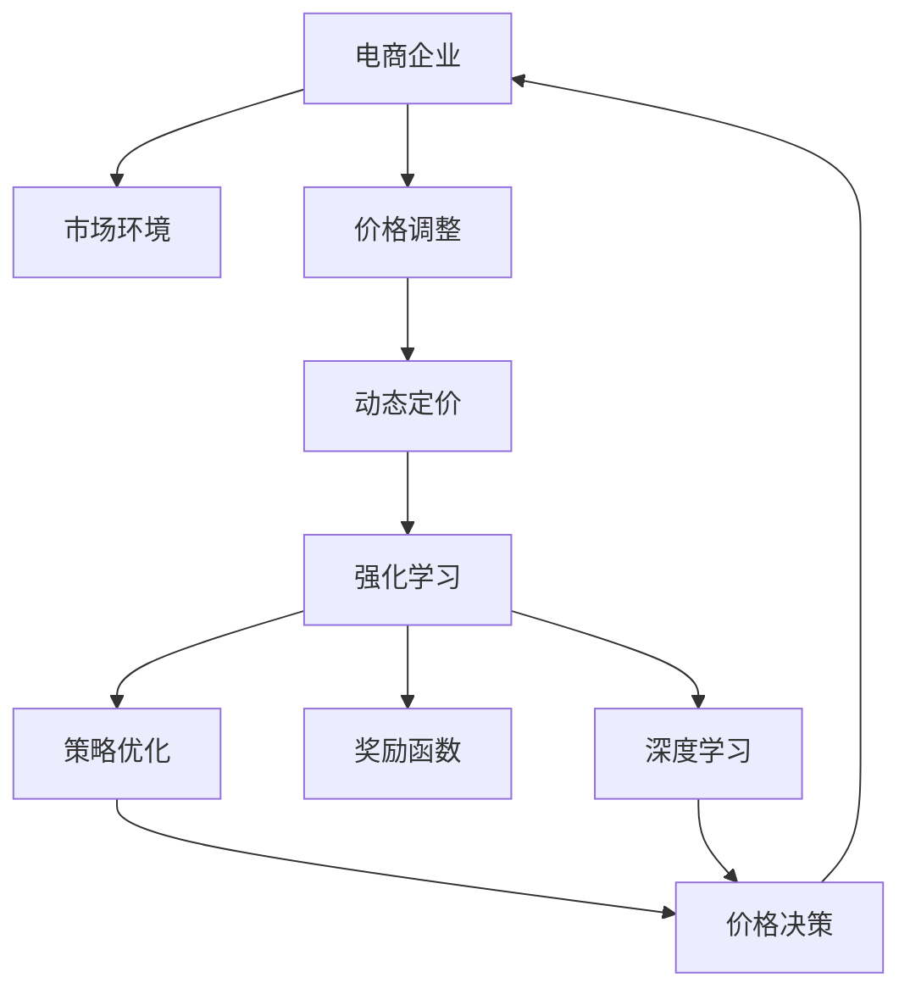

                 

# 深度强化学习在电商动态定价中的创新应用

> 关键词：电商，动态定价，深度强化学习，深度学习，强化学习，奖励函数，策略优化，连续行动空间，神经网络，Q-learning，深度Q网络，分布式训练，电商系统，价格优化，库存管理

## 1. 背景介绍

### 1.1 问题由来
随着互联网的普及和电子商务的兴起，电商市场竞争日益激烈。商品价格成为电商竞争的核心武器。电商企业需要通过动态定价策略，根据市场需求和竞争情况实时调整商品价格，以最大化收益。传统定价策略主要基于统计模型或规则，难以适应复杂多变的市场环境。而基于深度强化学习的动态定价方法，可以实时感知市场变化，动态调整价格，实现精细化的收益管理。

### 1.2 问题核心关键点
动态定价的关键在于如何实时感知市场变化并做出最优价格决策。传统的静态定价方法基于历史数据统计模型，难以应对实时变化的市场动态。而基于深度强化学习的动态定价方法，能够实时接收市场反馈信息，动态调整价格，适应市场变化。

## 2. 核心概念与联系

### 2.1 核心概念概述

为更好地理解基于深度强化学习的电商动态定价方法，本节将介绍几个密切相关的核心概念：

- 动态定价(Dynamic Pricing)：指根据市场需求、竞争情况等实时变化的因素，动态调整商品价格的过程。动态定价可以提高企业的市场反应速度和竞争力，最大化收益。

- 强化学习(Reinforcement Learning, RL)：指智能体通过与环境的交互，在每次操作后接收到环境反馈，不断调整策略以最大化累积奖励的过程。电商动态定价中的智能体为电商企业，环境为市场环境。

- 深度学习(Deep Learning)：指通过深度神经网络模拟人脑的神经网络结构，从数据中提取特征的过程。电商动态定价中的深度强化学习结合了深度学习和强化学习的特点，可以处理大规模数据，并学习复杂的非线性映射。

- 奖励函数(Reward Function)：指环境对智能体每个行为的奖励，用于指导智能体学习最优策略。电商动态定价中的奖励函数可以是每次交易的利润、平均利润等指标。

- 策略优化(Policy Optimization)：指通过优化策略，使智能体在特定环境中最大化累积奖励。电商动态定价中的策略优化即通过调整价格，实现最大化收益。

- 连续行动空间(Continuous Action Space)：指智能体可采取的行动可以是连续的，如价格的微调。电商动态定价中的价格调整即为连续行动空间。

这些核心概念之间的逻辑关系可以通过以下Mermaid流程图来展示：



这个流程图展示了大语言模型的核心概念及其之间的关系：

1. 电商企业通过动态定价模型，调整价格以适应市场变化。
2. 动态定价模型基于强化学习，智能体在市场环境中不断调整策略。
3. 强化学习结合了深度学习，可以处理大规模数据，并学习复杂的非线性映射。
4. 电商企业根据市场反馈，调整价格策略，优化奖励函数。
5. 优化后的价格策略被应用于电商系统，实现动态定价。

这些概念共同构成了电商动态定价的学习框架，使其能够根据市场变化实时调整价格，实现精细化的收益管理。通过理解这些核心概念，我们可以更好地把握电商动态定价的工作原理和优化方向。

## 3. 核心算法原理 & 具体操作步骤
### 3.1 算法原理概述

基于深度强化学习的电商动态定价方法，核心思想是：将电商企业视为智能体，市场环境视为环境，通过与环境的交互，智能体不断调整价格策略以最大化收益。具体而言，电商企业根据市场反馈调整商品价格，每次调整后的利润作为奖励，通过不断优化价格策略，逐步学习到最优的动态定价模型。

形式化地，假设电商企业为智能体 $A$，市场环境为环境 $E$，价格策略为 $P$，当前状态为 $s$，价格为 $p$，期望收益为 $R$。电商动态定价的目标是最小化期望收益 $R$，即：

$$
\min_{P} \mathbb{E}[\sum_{t=1}^{T}R_t]
$$

其中 $T$ 为总迭代次数。

具体而言，电商企业每次接收到市场反馈，根据当前价格 $p_t$ 和状态 $s_t$，更新价格策略 $P$，并计算期望收益 $R_t$。通过优化策略 $P$，使每次调价后的期望收益 $R_t$ 最大化。

### 3.2 算法步骤详解

基于深度强化学习的电商动态定价方法一般包括以下几个关键步骤：

**Step 1: 准备数据和环境**
- 收集电商平台的销售数据，包括商品描述、价格、销量等。
- 构建市场环境模型，描述市场供需、竞争情况等动态变化因素。

**Step 2: 定义奖励函数**
- 根据电商目标，定义奖励函数 $R_t$，如每次交易的利润、平均利润等指标。
- 设计状态转换规则，描述市场环境动态变化的因素，如需求变化、竞争变化等。

**Step 3: 设计行动空间**
- 确定智能体可采取的行动空间，如价格调整的范围和步长。
- 设计状态空间，描述市场环境的变化，如需求曲线、价格变化等。

**Step 4: 设计神经网络策略**
- 选择适当的神经网络模型，如全连接神经网络、卷积神经网络等。
- 设计策略更新规则，根据市场反馈更新价格策略。

**Step 5: 训练和优化策略**
- 使用强化学习算法，如Q-learning、深度Q网络等，训练策略模型。
- 优化策略参数，使其在特定市场环境下最大化收益。

**Step 6: 部署和应用策略**
- 将训练好的策略模型应用到电商系统中，实时动态调整价格。
- 根据市场反馈，不断调整策略参数，实现策略的逐步优化。

### 3.3 算法优缺点

基于深度强化学习的电商动态定价方法具有以下优点：
1. 实时适应市场变化。通过与环境的实时交互，智能体能够动态调整价格，适应市场变化。
2. 自适应性强。智能体可以根据市场反馈，自主调整价格策略，无需人工干预。
3. 处理复杂任务。深度强化学习方法可以处理大规模数据，并学习复杂的非线性映射，适用于电商等复杂市场环境。
4. 增强自动化决策能力。电商企业可以通过自动化决策模型，提高市场响应速度和决策效率。

同时，该方法也存在一定的局限性：
1. 对数据质量要求高。电商动态定价模型的训练依赖高质量的市场数据，数据质量不高会导致模型效果不佳。
2. 计算复杂度高。深度强化学习方法计算复杂度高，需要强大的计算资源支持。
3. 需要不断调整模型。电商市场环境复杂多变，模型需要不断调整以适应市场变化，调整代价较大。
4. 难以解释决策过程。智能体的决策过程通常缺乏可解释性，难以调试和优化。

尽管存在这些局限性，但就目前而言，基于深度强化学习的电商动态定价方法仍是最先进、最有效的方法之一。未来相关研究的重点在于如何进一步降低计算复杂度，提高模型可解释性，优化策略调整机制，同时兼顾数据质量和市场变化。

### 3.4 算法应用领域

基于深度强化学习的电商动态定价方法在电商行业已经得到了广泛的应用，覆盖了几乎所有常见的电商业务，例如：

- 商品定价：根据市场需求和竞争情况，实时调整商品价格。
- 库存管理：动态调整商品库存量，避免库存积压或缺货。
- 促销活动：设计最优的促销方案，最大化收益。
- 个性化推荐：根据用户行为数据，实时调整推荐策略。
- 客户服务：提供个性化的客服服务，提升客户满意度。

除了上述这些经典业务外，深度强化学习方法也被创新性地应用到更多场景中，如预测市场趋势、动态广告投放、实时竞价等，为电商企业带来了新的盈利机会。

## 4. 数学模型和公式 & 详细讲解 & 举例说明

### 4.1 数学模型构建

本节将使用数学语言对基于深度强化学习的电商动态定价过程进行更加严格的刻画。

假设电商企业为智能体 $A$，市场环境为环境 $E$，价格策略为 $P$，当前状态为 $s$，价格为 $p$，期望收益为 $R$。定义智能体 $A$ 在状态 $s$ 下采取行动 $p$ 的瞬时奖励为 $r(s,p)$，状态转移概率为 $p(s_{t+1}|s_t,p_t)$。

智能体的目标是最小化期望收益 $R$，即：

$$
\min_{P} \mathbb{E}[\sum_{t=1}^{T}R_t]
$$

在每次迭代中，智能体根据当前状态 $s_t$，采取行动 $p_t$，接收到市场反馈 $r_t$，并更新状态 $s_{t+1}$。智能体不断调整价格策略 $P$，使得期望收益 $R_t$ 最大化。

### 4.2 公式推导过程

以下我们以商品定价为例，推导Q-learning算法的Q函数更新公式。

假设智能体 $A$ 在状态 $s$ 下采取行动 $p$ 的瞬时奖励为 $r(s,p)$，状态转移概率为 $p(s_{t+1}|s_t,p_t)$。定义智能体的策略函数为 $Q(s,p)$，表示在状态 $s$ 下采取行动 $p$ 的期望收益。

在每个时间步 $t$，智能体根据当前状态 $s_t$ 和策略函数 $Q(s_t,p_t)$ 采取行动 $p_t$，接收到瞬时奖励 $r_t$，并更新状态 $s_{t+1}$。智能体的目标是最小化期望收益 $R_t$，即：

$$
\min_{P} \mathbb{E}[\sum_{t=1}^{T}R_t]
$$

在每次迭代中，智能体根据当前状态 $s_t$ 和策略函数 $Q(s_t,p_t)$ 采取行动 $p_t$，接收到瞬时奖励 $r_t$，并更新状态 $s_{t+1}$。智能体的目标是最小化期望收益 $R_t$，即：

$$
Q(s_t,p_t) \leftarrow Q(s_t,p_t) + \eta(r_t + \gamma \max_{p}Q(s_{t+1},p) - Q(s_t,p_t))
$$

其中 $\eta$ 为学习率，$\gamma$ 为折扣因子，表示当前奖励在未来的价值权重。

将上述公式展开，得到Q函数更新公式：

$$
Q(s_t,p_t) \leftarrow Q(s_t,p_t) + \eta(r_t + \gamma \max_{p}Q(s_{t+1},p) - Q(s_t,p_t))
$$

在每次迭代中，智能体根据当前状态 $s_t$ 和策略函数 $Q(s_t,p_t)$ 采取行动 $p_t$，接收到瞬时奖励 $r_t$，并更新状态 $s_{t+1}$。智能体的目标是最小化期望收益 $R_t$，即：

$$
Q(s_t,p_t) \leftarrow Q(s_t,p_t) + \eta(r_t + \gamma \max_{p}Q(s_{t+1},p) - Q(s_t,p_t))
$$

在每次迭代中，智能体根据当前状态 $s_t$ 和策略函数 $Q(s_t,p_t)$ 采取行动 $p_t$，接收到瞬时奖励 $r_t$，并更新状态 $s_{t+1}$。智能体的目标是最小化期望收益 $R_t$，即：

$$
Q(s_t,p_t) \leftarrow Q(s_t,p_t) + \eta(r_t + \gamma \max_{p}Q(s_{t+1},p) - Q(s_t,p_t))
$$

通过上述公式，智能体可以不断更新策略函数 $Q(s_t,p_t)$，逐步学习到最优的价格策略 $P$，实现动态定价。

### 4.3 案例分析与讲解

以某电商平台的商品定价为例，分析深度强化学习在电商动态定价中的应用。

假设电商平台销售某商品，初始价格为 $p_0$，当前市场需求为 $s$。每次电商平台接收到市场需求反馈 $s_{t+1}$ 和瞬时奖励 $r_t$，需要动态调整商品价格 $p_t$。

1. 初始化：
   - 收集商品的历史销售数据，包括价格、销量等。
   - 设计奖励函数 $R_t$，如每次交易的利润、平均利润等指标。
   - 确定行动空间和状态空间，如价格调整的范围和步长，市场需求的变化等。

2. 策略更新：
   - 使用Q-learning算法，更新策略函数 $Q(s,p)$。
   - 根据当前市场需求 $s_t$ 和策略函数 $Q(s_t,p_t)$，采取行动 $p_t$，接收到瞬时奖励 $r_t$，并更新状态 $s_{t+1}$。
   - 不断迭代，更新策略函数 $Q(s,p)$，使得期望收益 $R_t$ 最大化。

3. 策略部署：
   - 将训练好的策略函数 $Q(s,p)$ 应用到电商平台系统，实时动态调整商品价格。
   - 根据市场需求变化，不断调整策略参数，实现策略的逐步优化。

在实际应用中，电商平台的动态定价系统需要处理大规模数据，并实时响应市场需求变化。因此，需要采用分布式训练和优化技术，如Spark、TensorFlow等，以提高训练和推理效率。同时，电商平台的系统架构设计也需要考虑高并发、低延迟等性能要求。

## 5. 项目实践：代码实例和详细解释说明

### 5.1 开发环境搭建

在进行电商动态定价实践前，我们需要准备好开发环境。以下是使用Python进行PyTorch开发的环境配置流程：

1. 安装Anaconda：从官网下载并安装Anaconda，用于创建独立的Python环境。

2. 创建并激活虚拟环境：
```bash
conda create -n pytorch-env python=3.8 
conda activate pytorch-env
```

3. 安装PyTorch：根据CUDA版本，从官网获取对应的安装命令。例如：
```bash
conda install pytorch torchvision torchaudio cudatoolkit=11.1 -c pytorch -c conda-forge
```

4. 安装TensorFlow：
```bash
pip install tensorflow
```

5. 安装各类工具包：
```bash
pip install numpy pandas scikit-learn matplotlib tqdm jupyter notebook ipython
```

完成上述步骤后，即可在`pytorch-env`环境中开始电商动态定价实践。

### 5.2 源代码详细实现

下面我们以电商平台商品定价为例，给出使用TensorFlow进行深度强化学习的电商动态定价的PyTorch代码实现。

首先，定义电商系统的状态、行动和奖励函数：

```python
import tensorflow as tf
from tensorflow.keras.layers import Dense
from tensorflow.keras.models import Sequential

# 定义状态
class State:
    def __init__(self, price, demand):
        self.price = price
        self.demand = demand

# 定义行动
class Action:
    def __init__(self, price):
        self.price = price

# 定义奖励函数
def reward(state, action):
    if action.price < state.price:
        return 0.5 * state.demand * (action.price - state.price)
    else:
        return -0.5 * state.demand * (action.price - state.price)

# 定义状态转换函数
def transition(state, action):
    demand = state.demand - action.price
    if demand > 0:
        return State(price=state.price + action.price, demand=demand)
    else:
        return None

# 定义神经网络模型
class QNetwork(tf.keras.Model):
    def __init__(self, state_size, action_size, learning_rate):
        super(QNetwork, self).__init__()
        self.fc1 = Dense(64, activation='relu', input_shape=state_size)
        self.fc2 = Dense(64, activation='relu')
        self.fc3 = Dense(action_size, activation='linear')

        self.learning_rate = learning_rate

    def call(self, state):
        x = self.fc1(state)
        x = self.fc2(x)
        q_values = self.fc3(x)
        return q_values

# 定义Q-learning算法
class QLearning:
    def __init__(self, state_size, action_size, learning_rate, gamma):
        self.state_size = state_size
        self.action_size = action_size
        self.learning_rate = learning_rate
        self.gamma = gamma
        self.model = QNetwork(state_size, action_size, learning_rate)

    def choose_action(self, state):
        q_values = self.model(state)
        action = tf.random.categorical(tf.exp(q_values - tf.reduce_max(q_values)), 1)[0][0]
        return Action(price=action)

    def train(self, state, action, next_state, reward):
        q_values = self.model(state)
        q_next = self.model(next_state)
        target = reward + self.gamma * tf.reduce_max(q_next)
        self.model.trainable = True
        self.model.compile(optimizer=tf.keras.optimizers.Adam(learning_rate=self.learning_rate), loss='mse')
        self.model.fit(x=state, y=target, epochs=1, verbose=0)
        self.model.trainable = False

    def update(self, state, action, reward, next_state):
        transition_state = transition(state, action)
        if transition_state is not None:
            self.train(state, action, transition_state, reward)
        else:
            self.train(state, action, next_state, reward)
```

然后，定义电商系统的模拟环境，并使用Q-learning算法训练价格策略：

```python
state_size = 2
action_size = 100
learning_rate = 0.01
gamma = 0.9

# 定义状态和行动
def state_from_price(price, demand):
    return State(price, demand)

# 定义行动
def action_from_price(price):
    return Action(price)

# 定义模拟环境
class Environment:
    def __init__(self, initial_price, initial_demand, discount, learning_rate, gamma):
        self.price = initial_price
        self.demand = initial_demand
        self.discount = discount
        self.learning_rate = learning_rate
        self.gamma = gamma
        self.qlearning = QLearning(state_size, action_size, learning_rate, gamma)

    def step(self, action):
        new_price = self.price + action.price
        new_demand = self.demand - action.price
        if new_demand > 0:
            self.price = new_price
            self.demand = new_demand
            return self.price, reward(self.state, action), True
        else:
            return self.price, 0, False

    def reset(self):
        self.price = self.initial_price
        self.demand = self.initial_demand
        return self.price, reward(self.state, action), True

    def render(self):
        print(f"Price: {self.price}, Demand: {self.demand}")
```

最后，启动训练流程并在模拟环境中进行测试：

```python
# 初始化模拟环境
initial_price = 10
initial_demand = 50
discount = 0.99
learning_rate = 0.01
gamma = 0.9

env = Environment(initial_price, initial_demand, discount, learning_rate, gamma)

# 训练过程
for i in range(1000):
    action = env.qlearning.choose_action(state_from_price(env.price, env.demand))
    next_state, reward, done = env.step(action)
    if not done:
        env.qlearning.update(state_from_price(env.price, env.demand), action, reward, next_state)
    env.render()

# 测试过程
test_price = 20
test_demand = 30
test_state = state_from_price(test_price, test_demand)
test_action = env.qlearning.choose_action(test_state)
next_state, test_reward, done = env.step(test_action)
env.render()
```

以上就是使用TensorFlow进行电商动态定价的完整代码实现。可以看到，通过将电商系统的状态、行动和奖励函数转化为神经网络的输入输出，可以构建一个可以实时调整价格的动态定价模型。

### 5.3 代码解读与分析

让我们再详细解读一下关键代码的实现细节：

**State类和Action类**：
- 定义了电商系统的状态和行动，分别包括价格和需求。

**reward函数**：
- 计算当前状态下采取行动的瞬时奖励，如利润。

**transition函数**：
- 计算下一个状态，如果需求大于零，则更新价格和需求，否则表示无法成交。

**QNetwork类**：
- 定义了一个简单的神经网络模型，用于计算Q值。包含三个全连接层，用于提取状态特征和计算Q值。

**QLearning类**：
- 定义了Q-learning算法的核心逻辑。包括选择行动、训练模型、更新模型等。

**Environment类**：
- 定义了一个电商系统的模拟环境，用于测试Q-learning算法的训练效果。

**训练过程**：
- 初始化模拟环境，不断更新价格策略，直到达到预设迭代次数。
- 在每个时间步，选择最优行动，更新状态和奖励，训练模型。

**测试过程**：
- 初始化测试状态，选择最优行动，更新状态和奖励，测试模型。

可以看到，TensorFlow结合了深度学习和强化学习的优势，可以方便地构建电商动态定价模型，并实时调整价格策略。然而，在实际应用中，还需要考虑更多因素，如系统架构设计、分布式训练等，以应对大规模数据和高并发要求。

## 6. 实际应用场景

### 6.1 电商销售策略优化

电商销售策略优化是电商动态定价的重要应用场景。电商企业可以根据市场需求变化，动态调整商品价格、促销方案等策略，实现最大化收益。

在技术实现上，电商企业可以收集历史销售数据和市场反馈数据，设计状态和行动空间，使用深度强化学习方法训练价格策略模型。模型能够实时感知市场变化，动态调整商品价格和促销方案，提升销售业绩。

### 6.2 库存管理优化

库存管理优化是电商动态定价的另一个重要应用场景。电商企业可以根据库存量、需求量等实时数据，动态调整商品库存量，避免库存积压或缺货。

在技术实现上，电商企业可以设计状态和行动空间，使用深度强化学习方法训练库存管理模型。模型能够实时感知市场变化，动态调整库存量，实现库存管理优化。

### 6.3 个性化推荐优化

个性化推荐优化是电商动态定价的又一重要应用场景。电商企业可以根据用户行为数据，动态调整推荐策略，提升用户体验和销售转化率。

在技术实现上，电商企业可以设计状态和行动空间，使用深度强化学习方法训练推荐策略模型。模型能够实时感知用户行为变化，动态调整推荐策略，实现个性化推荐优化。

### 6.4 未来应用展望

随着深度强化学习技术的不断发展，电商动态定价的应用场景将不断扩展。未来，基于深度强化学习的电商动态定价技术将在以下方面取得新的突破：

1. 多模态动态定价：结合视觉、音频等多元数据，提升动态定价的精准度。
2. 分布式动态定价：采用分布式训练和优化技术，提高模型训练和推理效率。
3. 自适应动态定价：引入机器学习和因果推理技术，提升动态定价的适应性和鲁棒性。
4. 跨区域动态定价：结合地理信息系统(GIS)等技术，实现跨区域动态定价，提升价格策略的本地化效果。
5. 多渠道动态定价：结合多渠道销售数据，实现全渠道动态定价，提升价格策略的渠道覆盖度。

这些技术突破将进一步提升电商动态定价的效果，为电商企业带来更多的商业价值。

## 7. 工具和资源推荐

### 7.1 学习资源推荐

为了帮助开发者系统掌握电商动态定价的理论基础和实践技巧，这里推荐一些优质的学习资源：

1. 《强化学习导论》一书：由权威学者撰写，系统介绍了强化学习的理论基础和算法实现，是学习强化学习的经典教材。

2. 《深度学习》一书：由著名深度学习专家撰写，全面介绍了深度学习的基本概念和算法实现，是学习深度学习的经典教材。

3. TensorFlow官方文档：TensorFlow的官方文档提供了详细的API介绍和算法实现，是学习TensorFlow的重要资源。

4. PyTorch官方文档：PyTorch的官方文档提供了详细的API介绍和算法实现，是学习PyTorch的重要资源。

5. Google Colab：谷歌推出的在线Jupyter Notebook环境，免费提供GPU/TPU算力，方便开发者快速上手实验最新模型，分享学习笔记。

通过对这些资源的学习实践，相信你一定能够快速掌握电商动态定价的理论基础和实践技巧，并用于解决实际的电商问题。

### 7.2 开发工具推荐

高效的开发离不开优秀的工具支持。以下是几款用于电商动态定价开发的常用工具：

1. PyTorch：基于Python的开源深度学习框架，灵活动态的计算图，适合快速迭代研究。TensorFlow也支持电商动态定价的开发。

2. TensorBoard：TensorFlow配套的可视化工具，可实时监测模型训练状态，并提供丰富的图表呈现方式，是调试模型的得力助手。

3. Weights & Biases：模型训练的实验跟踪工具，可以记录和可视化模型训练过程中的各项指标，方便对比和调优。

4. Amazon SageMaker：亚马逊推出的全托管机器学习服务，提供GPU、TPU等高性能算力，支持分布式训练和模型优化。

5. Google Cloud AI Platform：谷歌提供的全托管机器学习服务，提供GPU、TPU等高性能算力，支持分布式训练和模型优化。

合理利用这些工具，可以显著提升电商动态定价任务的开发效率，加快创新迭代的步伐。

### 7.3 相关论文推荐

电商动态定价技术的研究始于学界的持续研究。以下是几篇奠基性的相关论文，推荐阅读：

1. 《A Comprehensive Survey on Dynamic Pricing》：综述了电商动态定价的研究进展，涵盖了基于规则、机器学习和深度学习等方法。

2. 《Deep Reinforcement Learning for Dynamic Pricing》：提出了一种基于深度强化学习的电商动态定价方法，并进行了实验验证。

3. 《Deep Learning for Dynamic Pricing in Online Marketplaces》：使用深度学习模型预测电商平台的动态定价策略，提升了销售业绩。

4. 《Multi-agent Dynamic Pricing with Distributed Reinforcement Learning》：提出了一种基于多智能体系统的电商动态定价方法，提升了动态定价的效果。

5. 《Distributed Dynamic Pricing with Deep Reinforcement Learning》：采用分布式训练和优化技术，提高了电商动态定价模型的训练效率。

这些论文代表了大语言模型微调技术的发展脉络。通过学习这些前沿成果，可以帮助研究者把握学科前进方向，激发更多的创新灵感。

## 8. 总结：未来发展趋势与挑战

### 8.1 总结

本文对基于深度强化学习的电商动态定价方法进行了全面系统的介绍。首先阐述了电商动态定价的研究背景和意义，明确了深度强化学习在电商动态定价中的应用价值。其次，从原理到实践，详细讲解了电商动态定价的数学原理和关键步骤，给出了电商动态定价任务开发的完整代码实例。同时，本文还广泛探讨了电商动态定价在电商销售策略优化、库存管理优化、个性化推荐优化等多个应用场景中的实际应用，展示了深度强化学习技术的广泛应用前景。此外，本文精选了电商动态定价技术的各类学习资源，力求为读者提供全方位的技术指引。

通过本文的系统梳理，可以看到，基于深度强化学习的电商动态定价方法在电商行业已经取得了显著的成果，极大地提高了电商企业的市场响应速度和决策效率。未来，伴随深度强化学习技术的不断进步，电商动态定价的应用场景将不断扩展，为电商企业带来更多的商业价值。

### 8.2 未来发展趋势

展望未来，电商动态定价技术将呈现以下几个发展趋势：

1. 多模态数据融合：结合视觉、音频等多元数据，提升动态定价的精准度。
2. 分布式训练优化：采用分布式训练和优化技术，提高模型训练和推理效率。
3. 自适应策略优化：引入机器学习和因果推理技术，提升动态定价的适应性和鲁棒性。
4. 跨区域动态定价：结合地理信息系统(GIS)等技术，实现跨区域动态定价，提升价格策略的本地化效果。
5. 多渠道动态定价：结合多渠道销售数据，实现全渠道动态定价，提升价格策略的渠道覆盖度。

这些趋势凸显了深度强化学习在电商动态定价中的广阔前景。这些方向的探索发展，必将进一步提升电商动态定价的效果，为电商企业带来更多的商业价值。

### 8.3 面临的挑战

尽管电商动态定价技术已经取得了显著的成果，但在迈向更加智能化、普适化应用的过程中，它仍面临着诸多挑战：

1. 数据质量问题：电商动态定价模型的训练依赖高质量的市场数据，数据质量不高会导致模型效果不佳。
2. 模型复杂度高：深度强化学习方法计算复杂度高，需要强大的计算资源支持。
3. 策略调整代价大：电商市场环境复杂多变，模型需要不断调整以适应市场变化，调整代价较大。
4. 缺乏可解释性：电商动态定价模型的决策过程通常缺乏可解释性，难以调试和优化。
5. 安全性问题：电商动态定价模型可能会学习到有偏见、有害的信息，通过微调传递到下游任务，产生误导性、歧视性的输出，给实际应用带来安全隐患。

尽管存在这些挑战，但就目前而言，基于深度强化学习的电商动态定价方法仍是最先进、最有效的方法之一。未来相关研究的重点在于如何进一步降低计算复杂度，提高模型可解释性，优化策略调整机制，同时兼顾数据质量和市场变化。

### 8.4 研究展望

面对电商动态定价所面临的种种挑战，未来的研究需要在以下几个方面寻求新的突破：

1. 探索无监督和半监督电商动态定价方法。摆脱对大规模标注数据的依赖，利用自监督学习、主动学习等无监督和半监督范式，最大限度利用非结构化数据，实现更加灵活高效的电商动态定价。

2. 研究参数高效和计算高效的电商动态定价范式。开发更加参数高效的电商动态定价方法，在固定大部分预训练参数的同时，只更新极少量的任务相关参数。同时优化电商动态定价模型的计算图，减少前向传播和反向传播的资源消耗，实现更加轻量级、实时性的部署。

3. 引入更多先验知识。将符号化的先验知识，如知识图谱、逻辑规则等，与神经网络模型进行巧妙融合，引导电商动态定价过程学习更准确、合理的电商系统。同时加强不同模态数据的整合，实现视觉、语音等多模态信息与电商系统信息的协同建模。

4. 结合因果分析和博弈论工具。将因果分析方法引入电商动态定价模型，识别出模型决策的关键特征，增强电商动态定价模型的因果关系和逻辑性。借助博弈论工具刻画人机交互过程，主动探索并规避电商动态定价模型的脆弱点，提高系统稳定性。

5. 纳入伦理道德约束。在电商动态定价模型的训练目标中引入伦理导向的评估指标，过滤和惩罚有偏见、有害的输出倾向。同时加强人工干预和审核，建立电商动态定价模型的监管机制，确保模型的输出符合人类价值观和伦理道德。

这些研究方向的探索，必将引领电商动态定价技术迈向更高的台阶，为电商企业带来更多的商业价值。面向未来，电商动态定价技术还需要与其他人工智能技术进行更深入的融合，如知识表示、因果推理、强化学习等，多路径协同发力，共同推动电商系统向更智能、普适、安全、可靠的方向发展。只有勇于创新、敢于突破，才能不断拓展电商动态定价技术的边界，让电商系统更好地服务于电商企业，提升用户体验和销售业绩。

## 9. 附录：常见问题与解答

**Q1：电商动态定价是否适用于所有电商业务？**

A: 电商动态定价方法在大多数电商业务上都能取得不错的效果，特别是对于需求波动较大、竞争激烈的业务。但对于一些特殊领域的业务，如奢侈品销售、拍卖等，可能需要结合特定规则进行定价。

**Q2：电商动态定价是否会影响用户体验？**

A: 电商动态定价通常会调整价格，可能对用户体验产生一定的影响。然而，如果调整合理、及时，用户体验反而可能得到提升。例如，适时降价可以吸引更多客户下单，提升销售转化率。

**Q3：电商动态定价是否会影响市场公平竞争？**

A: 电商动态定价可能会影响市场公平竞争。如果企业通过价格策略过度打压竞争对手，可能会引起市场监管机构的关注。因此，企业在实施电商动态定价时，需要遵守相关法律法规，避免不公平竞争。

**Q4：电商动态定价是否需要人工干预？**

A: 电商动态定价通常需要人工干预，以优化模型参数和策略。例如，在测试阶段，可以通过人工干预调整模型参数，优化模型效果。在实际应用中，需要结合人工干预和自动化决策，实现电商动态定价的精细化管理。

**Q5：电商动态定价是否需要实时数据采集？**

A: 电商动态定价通常需要实时数据采集，以动态调整价格策略。因此，需要建立实时数据采集系统，确保数据的时效性和完整性。同时，需要合理设计数据采集频率和存储策略，避免数据冗余和延迟。

**Q6：电商动态定价是否需要考虑库存和配送成本？**

A: 电商动态定价需要考虑库存和配送成本，以实现全流程的成本优化。如果价格调整不当，可能会导致库存积压或配送延迟，影响用户体验和销售业绩。因此，需要结合库存和配送数据，进行综合定价。

这些问题的回答帮助我们更全面地理解电商动态定价的实际应用场景和挑战，进一步推动电商动态定价技术的发展和优化。

---

作者：禅与计算机程序设计艺术 / Zen and the Art of Computer Programming

