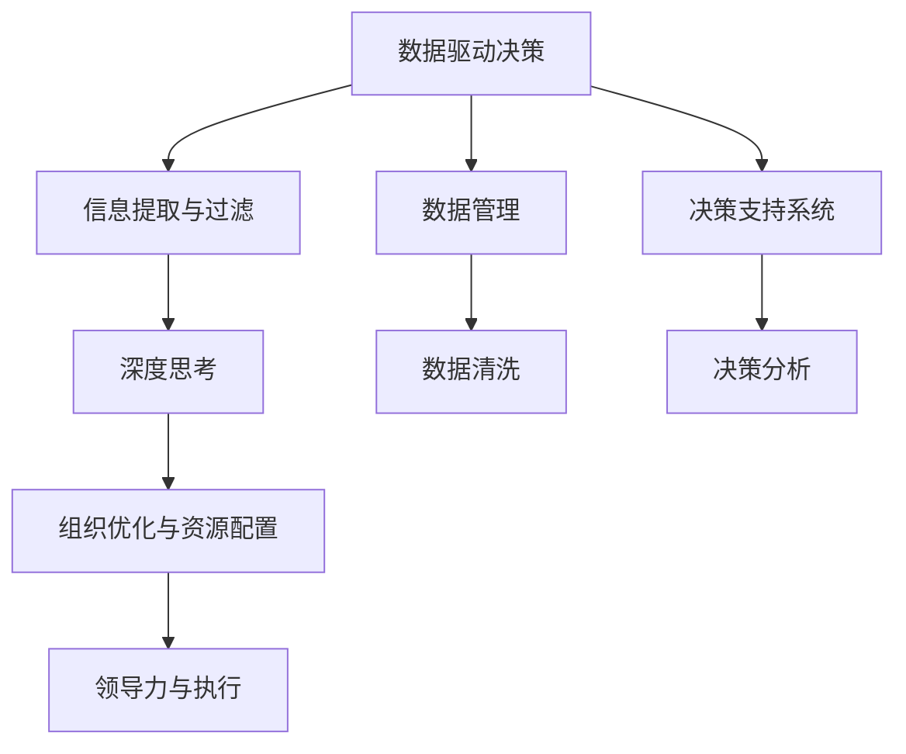

                 

# 深度思考:管理者洞悉关键信息的关键

> 关键词：深度思考, 管理者, 关键信息, 决策, 数据驱动, 洞见, 组织优化, 资源配置, 领导力

## 1. 背景介绍

### 1.1 问题由来
在现代企业中，管理者面临着越来越复杂的决策任务，需要从海量数据中快速提取出关键信息，做出明智的决策。然而，信息过载和信息质量问题常常让管理者陷入决策困境。如何在瞬息万变的数据流中，抓住核心问题，形成清晰的洞见，是当今管理者面临的重要挑战。

### 1.2 问题核心关键点
本文将探讨管理者如何通过深度思考，洞悉关键信息，以支撑有效的决策。我们将围绕以下几个核心关键点展开：

1. **数据驱动决策**：理解和管理者如何利用数据驱动决策，避免依赖直觉。
2. **信息提取与过滤**：掌握如何从海量信息中提取出关键信息，形成清晰的洞见。
3. **深度思考与分析**：探讨深度思考的策略和工具，辅助管理者进行高效分析。
4. **组织优化与资源配置**：讨论如何通过数据和分析结果，优化组织结构与资源配置。
5. **领导力与执行**：分析深度思考和数据驱动决策对领导力与组织执行力的提升。

### 1.3 问题研究意义
掌握深度思考和数据驱动决策的核心方法，对现代管理者尤为重要。它不仅能提高决策的科学性和效率，还能增强组织的适应力和竞争力。本文旨在提供一套全面的方法和工具，帮助管理者在数据驱动时代，做出更加明智的决策。

## 2. 核心概念与联系

### 2.1 核心概念概述

为更好地理解数据驱动决策和深度思考的关键要素，我们首先介绍几个核心概念：

- **数据驱动决策**：基于数据和分析结果而非直觉或经验进行决策的过程。其核心是利用数据来揭示决策背后的逻辑和趋势，从而做出更加客观和科学的决策。
- **信息提取与过滤**：从大规模数据集中提取关键信息，过滤掉噪音和干扰因素，形成有价值的洞见。这是实现数据驱动决策的基础。
- **深度思考**：一种深入思考和分析问题的方法，旨在通过多角度、多层次的审视，挖掘问题的本质和关联，形成全面而深刻的理解。
- **组织优化与资源配置**：通过数据分析和洞见，优化组织结构、流程和资源分配，提高组织的效率和响应能力。
- **领导力与执行**：领导者如何在数据和分析的支持下，引领团队执行决策，实现目标。

这些概念之间的逻辑关系可以通过以下Mermaid流程图来展示：



这个流程图展示了大数据时代下，管理者决策过程的主要步骤：

1. 通过数据驱动决策，管理者将数据作为决策的基础。
2. 信息提取与过滤，将原始数据转化为有用的洞见。
3. 深度思考，通过多维度分析，形成全面理解。
4. 组织优化与资源配置，基于分析结果调整组织结构和资源分配。
5. 领导力与执行，管理者带领团队执行决策，实现目标。

这些概念共同构成了现代管理决策的框架，管理者需要在每个环节中充分利用数据和分析工具，才能做出高效、科学的决策。

## 3. 核心算法原理 & 具体操作步骤
### 3.1 算法原理概述

数据驱动决策和深度思考的算法原理，本质上是基于统计学、机器学习、优化算法等技术的综合应用。其核心思想是通过数据分析和建模，揭示数据背后的模式和趋势，从而辅助管理者进行决策。

在具体操作上，一般包括以下几个关键步骤：

1. **数据收集与整理**：收集相关数据，并进行清洗和预处理。
2. **数据分析与建模**：使用统计分析、机器学习等方法，构建数据模型。
3. **洞见提取与验证**：通过模型分析和可视化工具，提取关键洞见，验证其准确性。
4. **决策支持与优化**：将洞见转化为决策支持，优化资源配置和组织结构。
5. **执行与反馈**：实施决策，并根据执行结果进行反馈调整。

### 3.2 算法步骤详解

#### 步骤1：数据收集与整理
数据收集是数据驱动决策的第一步。数据来源包括内部系统（如ERP、CRM等）、外部数据源（如市场调研、社交媒体等）。

- **数据收集**：选择合适的数据源，确保数据的全面性和准确性。
- **数据清洗**：去除重复、错误、缺失的数据，进行格式转换和标准化。
- **数据存储**：选择合适的数据存储方式，如数据库、数据仓库等，保证数据的访问效率和安全性。

#### 步骤2：数据分析与建模
数据分析与建模是提取关键洞见的核心步骤。

- **数据探索性分析（EDA）**：使用统计学方法，如均值、方差、相关性分析，初步了解数据特征。
- **特征工程**：从原始数据中提取有用的特征，如特征选择、特征转换等。
- **机器学习建模**：使用回归、分类、聚类等算法，构建数据模型。
- **模型评估与优化**：使用交叉验证、A/B测试等方法，评估模型性能，并进行调优。

#### 步骤3：洞见提取与验证
洞见提取与验证是数据驱动决策的关键环节。

- **模型分析**：通过可视化工具，如散点图、柱状图、热力图等，展示模型的结果。
- **洞见提取**：从模型分析结果中，提取关键洞见，如趋势、关联、异常等。
- **验证与解释**：通过业务知识验证洞见的合理性，并解释其背后的逻辑。

#### 步骤4：决策支持与优化
决策支持与优化是将洞见转化为实际决策的关键步骤。

- **决策制定**：根据洞见，制定合理的决策方案。
- **资源配置**：基于决策方案，调整资源分配，如人力、物力、财力等。
- **组织优化**：调整组织结构，优化流程，提高效率。

#### 步骤5：执行与反馈
执行与反馈是决策过程的最终环节，确保决策的有效性。

- **执行计划**：制定详细的执行计划，明确责任人和时间节点。
- **执行监控**：实时监控执行过程，确保按计划进行。
- **反馈调整**：根据执行结果，进行反馈调整，优化后续决策。

### 3.3 算法优缺点

数据驱动决策和深度思考的算法，具有以下优点：

1. **科学性**：基于数据和模型分析，提高了决策的科学性和客观性。
2. **全面性**：通过多角度、多层次的分析，形成全面的洞见。
3. **可解释性**：数据和模型分析结果具有可解释性，便于理解和验证。

但同时也存在一些缺点：

1. **数据质量问题**：数据质量直接影响分析结果的准确性。
2. **模型复杂性**：构建复杂模型，需要大量时间和资源。
3. **技术门槛**：需要具备一定的技术背景和分析能力。

尽管如此，数据驱动决策和深度思考依然是现代管理决策的主要手段，随着技术的发展，这些方法的普及性和应用效果将不断提升。

### 3.4 算法应用领域

数据驱动决策和深度思考的方法，在多个领域得到了广泛应用：

1. **金融行业**：风险管理、投资决策、客户分析等。
2. **制造业**：生产调度、库存管理、质量控制等。
3. **零售行业**：客户行为分析、产品推荐、库存优化等。
4. **医疗行业**：患者诊疗、疾病预测、治疗方案优化等。
5. **政府管理**：公共政策制定、社会服务优化、应急响应等。

这些领域的管理者，通过数据驱动决策和深度思考，显著提升了决策的效率和效果，推动了业务的持续改进和创新。

## 4. 数学模型和公式 & 详细讲解  
### 4.1 数学模型构建

本节将使用数学语言对数据驱动决策和深度思考的核心算法进行更加严格的刻画。

假设我们有 $N$ 个样本 $(x_1, y_1), (x_2, y_2), ..., (x_N, y_N)$，其中 $x$ 为特征向量，$y$ 为标签。定义训练集为 $D=\{(x_i, y_i)\}_{i=1}^N$。

定义模型为 $f(x; \theta)$，其中 $\theta$ 为模型参数。假设我们使用了线性回归模型，则模型可以表示为：

$$
f(x; \theta) = \theta_0 + \sum_{i=1}^p \theta_i x_i
$$

定义损失函数为均方误差损失（MSE）：

$$
\mathcal{L}(\theta) = \frac{1}{N}\sum_{i=1}^N (y_i - f(x_i; \theta))^2
$$

优化目标是最小化损失函数，即找到最优参数：

$$
\theta^* = \mathop{\arg\min}_{\theta} \mathcal{L}(\theta)
$$

在实践中，我们通常使用梯度下降等优化算法来近似求解上述最优化问题。设 $\eta$ 为学习率，则参数的更新公式为：

$$
\theta \leftarrow \theta - \eta \nabla_{\theta}\mathcal{L}(\theta)
$$

其中 $\nabla_{\theta}\mathcal{L}(\theta)$ 为损失函数对参数 $\theta$ 的梯度，可通过反向传播算法高效计算。

### 4.2 公式推导过程

以线性回归模型为例，推导损失函数的梯度计算过程。

对损失函数 $\mathcal{L}(\theta)$ 对 $\theta_0$ 和 $\theta_1$ 求偏导：

$$
\frac{\partial \mathcal{L}(\theta)}{\partial \theta_0} = -\frac{2}{N} \sum_{i=1}^N (y_i - \theta_0 - \sum_{i=1}^p \theta_i x_i)
$$

$$
\frac{\partial \mathcal{L}(\theta)}{\partial \theta_i} = -\frac{2}{N} \sum_{i=1}^N (y_i - \theta_0 - \sum_{i=1}^p \theta_i x_i) x_i
$$

在得到损失函数的梯度后，即可带入参数更新公式，完成模型的迭代优化。重复上述过程直至收敛，最终得到适应数据驱动决策的线性回归模型参数 $\theta^*$。

## 5. 项目实践：代码实例和详细解释说明
### 5.1 开发环境搭建

在进行数据驱动决策和深度思考实践前，我们需要准备好开发环境。以下是使用Python进行Scikit-learn开发的环境配置流程：

1. 安装Anaconda：从官网下载并安装Anaconda，用于创建独立的Python环境。

2. 创建并激活虚拟环境：
```bash
conda create -n data-analysis-env python=3.8 
conda activate data-analysis-env
```

3. 安装Scikit-learn：
```bash
conda install scikit-learn
```

4. 安装Pandas、NumPy等常用工具包：
```bash
pip install pandas numpy matplotlib scikit-learn seaborn
```

完成上述步骤后，即可在`data-analysis-env`环境中开始项目实践。

### 5.2 源代码详细实现

下面我们以金融行业中的客户流失预测为例，给出使用Scikit-learn进行线性回归模型构建的Python代码实现。

首先，定义数据处理函数：

```python
import pandas as pd
from sklearn.model_selection import train_test_split
from sklearn.linear_model import LinearRegression
from sklearn.metrics import mean_squared_error

# 加载数据
df = pd.read_csv('customer_churn.csv')

# 数据预处理
X = df.drop(['Churn'], axis=1)
y = df['Churn']

# 数据分割
X_train, X_test, y_train, y_test = train_test_split(X, y, test_size=0.2, random_state=42)

# 模型训练与评估
model = LinearRegression()
model.fit(X_train, y_train)
y_pred = model.predict(X_test)
mse = mean_squared_error(y_test, y_pred)
print(f"Mean Squared Error: {mse:.3f}")
```

然后，定义训练和评估函数：

```python
def train_model(X_train, X_test, y_train, y_test):
    model = LinearRegression()
    model.fit(X_train, y_train)
    y_pred = model.predict(X_test)
    mse = mean_squared_error(y_test, y_pred)
    return mse

# 训练模型
mse = train_model(X_train, X_test, y_train, y_test)
print(f"Mean Squared Error: {mse:.3f}")
```

最后，启动训练流程并在测试集上评估：

```python
X_train, X_test, y_train, y_test = train_test_split(X, y, test_size=0.2, random_state=42)

mse = train_model(X_train, X_test, y_train, y_test)
print(f"Mean Squared Error: {mse:.3f}")
```

以上就是使用Scikit-learn进行客户流失预测线性回归模型构建的完整代码实现。可以看到，通过Scikit-learn的封装，代码实现变得简洁高效。

### 5.3 代码解读与分析

让我们再详细解读一下关键代码的实现细节：

**数据处理函数**：
- 使用Pandas库加载数据，并进行数据预处理，去除不必要的列。
- 使用train_test_split方法将数据集分割为训练集和测试集，比例为80%训练集、20%测试集。
- 使用LinearRegression模型进行线性回归训练，并计算测试集上的均方误差（MSE）。

**训练和评估函数**：
- 定义train_model函数，进行模型训练和评估。
- 使用均方误差（MSE）评估模型性能，返回评估结果。
- 在主函数中调用train_model函数，输出均方误差结果。

**启动训练流程**：
- 调用train_model函数进行模型训练和评估。
- 输出均方误差结果。

可以看到，Scikit-learn提供了便捷高效的数据处理和模型训练接口，使得数据驱动决策和深度思考的代码实现变得简单直接。

当然，工业级的系统实现还需考虑更多因素，如模型的保存和部署、超参数的自动搜索、更灵活的任务适配层等。但核心的算法原理和实现思路，与上述代码实现基本一致。

## 6. 实际应用场景
### 6.1 金融风险管理

金融行业面临着诸多风险，如信用风险、市场风险、操作风险等。传统的人工风险评估方法往往主观性强、效率低，难以应对快速变化的市场环境。数据驱动决策和深度思考技术，为金融风险管理提供了新的解决方案。

具体而言，金融机构可以收集客户的交易数据、行为数据、社交媒体数据等，构建多维度特征矩阵。通过线性回归、逻辑回归等模型，进行风险预测和评估。微调后的模型能够更准确地识别高风险客户，优化贷款审批流程，降低信用违约率。

### 6.2 医疗诊断优化

医疗行业对诊断的及时性和准确性要求极高。传统的人工诊断方法耗时长、误诊率高，难以应对海量的病历数据。数据驱动决策和深度思考技术，为医疗诊断提供了新的工具。

例如，医疗机构可以收集患者的病历数据、治疗记录、基因数据等，构建多维度特征矩阵。通过深度学习模型，如卷积神经网络（CNN）、长短时记忆网络（LSTM）等，进行疾病预测和诊断。微调后的模型能够更准确地诊断疾病，提高治疗效果，减少误诊率。

### 6.3 供应链优化

供应链管理涉及到供应商选择、库存管理、物流优化等多个环节。传统的手工管理方法复杂繁琐，容易出现错误。数据驱动决策和深度思考技术，为供应链管理提供了新的思路。

例如，企业可以收集供应商的历史交易数据、物流数据、生产数据等，构建多维度特征矩阵。通过回归模型、聚类模型等，进行供应商评估和物流优化。微调后的模型能够更有效地识别优选供应商，优化库存管理，提高物流效率，降低成本。

### 6.4 未来应用展望

随着数据驱动决策和深度思考技术的不断演进，其在更多领域的应用前景将不断拓展。

- **智能制造**：利用工业互联网数据，进行生产过程优化、设备维护预测等。
- **智慧农业**：通过传感器数据，进行作物生长监测、病虫害预测等。
- **智慧城市**：利用城市大数据，进行交通管理、环境监测、灾害预警等。
- **智能物流**：通过物联网数据，进行货物追踪、配送优化等。

未来，数据驱动决策和深度思考技术将成为各行业数字化转型的重要支撑，推动智能社会的建设和发展。

## 7. 工具和资源推荐
### 7.1 学习资源推荐

为了帮助开发者系统掌握数据驱动决策和深度思考的理论基础和实践技巧，这里推荐一些优质的学习资源：

1. 《Python数据科学手册》系列书籍：由数据科学专家撰写，深入浅出地介绍了Python在数据科学中的应用，包括数据清洗、分析、可视化等。

2. Coursera《机器学习》课程：由斯坦福大学Andrew Ng教授开设，涵盖机器学习的基本概念和算法，适合入门学习。

3. Kaggle数据科学竞赛平台：提供大量真实世界数据集和竞赛任务，训练数据分析和建模能力。

4. KDNuggets博客：提供数据科学领域的最新动态和实战案例，适合了解行业前沿和最佳实践。

通过对这些资源的学习实践，相信你一定能够快速掌握数据驱动决策和深度思考的精髓，并用于解决实际的决策问题。

### 7.2 开发工具推荐

高效的开发离不开优秀的工具支持。以下是几款用于数据驱动决策和深度思考开发的常用工具：

1. Jupyter Notebook：开源的交互式编程环境，支持代码、文档和数据集成，方便数据分析和建模。

2. R语言：统计分析领域的领先语言，拥有丰富的统计分析和可视化工具。

3. Tableau：商业智能工具，支持数据连接、可视化、报表生成等，适合数据探索和洞见提取。

4. Python的Scikit-learn、TensorFlow等库：提供便捷高效的数据处理和建模接口，支持多种机器学习算法。

5. Matplotlib、Seaborn等库：支持数据可视化，帮助发现数据中的模式和趋势。

合理利用这些工具，可以显著提升数据驱动决策和深度思考的开发效率，加快创新迭代的步伐。

### 7.3 相关论文推荐

数据驱动决策和深度思考技术的发展源于学界的持续研究。以下是几篇奠基性的相关论文，推荐阅读：

1. "On the Shoulders of Giants: The Science of Synthesis and the Benefits of Cross-Disciplinary Research"（《站在巨人的肩膀上：跨学科研究的合成与益处》）：介绍了数据驱动决策的科学原理和应用案例。

2. "The Elements of Statistical Learning"（《统计学习基础》）：由机器学习专家撰写，全面介绍了统计学习的基本概念和算法。

3. "Data-Driven Decision Making: A Systematic Approach to Enhance Business Insight"（《基于数据驱动的决策制定：提升商业洞察的系统方法》）：介绍了数据驱动决策的系统方法论和实践指南。

4. "The Data Warehouse Toolkit"（《数据仓库工具包》）：由数据仓库专家撰写，介绍了数据仓库的基本概念和实现技术。

这些论文代表了大数据驱动决策和深度思考技术的发展脉络。通过学习这些前沿成果，可以帮助研究者把握学科前进方向，激发更多的创新灵感。

## 8. 总结：未来发展趋势与挑战

### 8.1 研究成果总结

本文对数据驱动决策和深度思考的核心方法进行了全面系统的介绍。首先阐述了数据驱动决策在现代管理中的重要性和应用场景，明确了深度思考在决策过程中的核心地位。其次，从原理到实践，详细讲解了数据驱动决策和深度思考的数学模型和操作步骤，给出了完整的数据分析和建模代码实例。同时，本文还广泛探讨了数据驱动决策和深度思考在金融、医疗、供应链等多个行业领域的应用前景，展示了其强大的应用潜力。

通过本文的系统梳理，可以看到，数据驱动决策和深度思考是现代管理决策的重要工具，其科学性和全面性在多个实际应用中得到了验证。未来，随着数据技术的发展和应用，数据驱动决策和深度思考将进一步普及和深入，推动管理决策的科学化、智能化进程。

### 8.2 未来发展趋势

展望未来，数据驱动决策和深度思考技术将呈现以下几个发展趋势：

1. **多源数据融合**：未来将更多地利用多源异构数据，进行全面分析，提升决策的准确性和全面性。
2. **深度学习与统计结合**：深度学习和统计分析将有机结合，形成更加全面的决策支持系统。
3. **实时数据分析**：实时数据流将实时进行分析，实现动态决策，提高决策的时效性和响应能力。
4. **自然语言处理**：自然语言处理技术将进一步提升数据的可读性和可理解性，辅助决策制定。
5. **自动化决策**：自动化决策系统将逐步普及，实现更高效、更精准的决策过程。

以上趋势凸显了数据驱动决策和深度思考技术的广阔前景。这些方向的探索发展，必将进一步提升管理决策的科学性和智能化水平，为组织创造更大的价值。

### 8.3 面临的挑战

尽管数据驱动决策和深度思考技术已经取得了瞩目成就，但在迈向更加智能化、普适化应用的过程中，它仍面临着诸多挑战：

1. **数据质量问题**：数据的质量直接影响分析结果的准确性。如何保证数据的完整性、准确性和一致性，是数据驱动决策的首要挑战。
2. **模型复杂性**：构建复杂模型，需要大量时间和资源。如何在模型复杂度和模型效果之间找到平衡，是数据驱动决策的重要挑战。
3. **技术门槛**：需要具备一定的技术背景和分析能力。如何降低技术门槛，使更多管理者和业务人员能够使用这些技术，是普及数据驱动决策的关键。
4. **数据隐私和安全**：数据驱动决策需要大量敏感数据，如何保护数据隐私和安全，避免数据泄露和滥用，是数据驱动决策的重要保障。

正视数据驱动决策和深度思考面临的这些挑战，积极应对并寻求突破，将是大数据驱动决策走向成熟的必由之路。相信随着学界和产业界的共同努力，这些挑战终将一一被克服，数据驱动决策将逐步普及，为管理决策带来革命性的变化。

### 8.4 研究展望

面对数据驱动决策和深度思考面临的种种挑战，未来的研究需要在以下几个方面寻求新的突破：

1. **数据治理**：建立完善的数据治理体系，保证数据的完整性、准确性和一致性。
2. **自动化分析**：开发自动化的数据分析工具，减少人工干预，提高分析效率。
3. **模型简化**：开发更简单、更轻量级的模型，降低技术门槛，提高模型的普及性和应用效果。
4. **隐私保护**：引入隐私保护技术，保护数据隐私和安全，增强数据驱动决策的信任度。
5. **跨学科融合**：结合其他学科的理论与方法，形成更加全面、综合的决策支持系统。

这些研究方向的探索，必将引领数据驱动决策和深度思考技术迈向更高的台阶，为管理决策带来更加科学、高效、精准的支持。面向未来，数据驱动决策和深度思考技术需要在数据质量、模型复杂性、技术门槛、数据隐私等各个环节不断优化，才能真正实现数据驱动决策的普及和应用。

## 9. 附录：常见问题与解答

**Q1：数据驱动决策和深度思考是否适用于所有管理决策？**

A: 数据驱动决策和深度思考在大多数管理决策中都能取得不错的效果，特别是对于数据量较大的决策。但对于一些主观性强、需要直觉判断的决策，如领导力培养、战略规划等，需要结合数据和经验，进行综合判断。

**Q2：如何选择合适的模型和算法？**

A: 选择合适的模型和算法需要考虑多个因素，如数据特征、业务需求、计算资源等。一般建议从简单的线性回归、逻辑回归等模型入手，逐步尝试更复杂的模型，如决策树、随机森林、神经网络等。

**Q3：数据驱动决策和深度思考的局限性有哪些？**

A: 数据驱动决策和深度思考的局限性主要包括：
1. 数据质量问题：数据的质量直接影响分析结果的准确性。
2. 模型复杂性：构建复杂模型，需要大量时间和资源。
3. 技术门槛：需要具备一定的技术背景和分析能力。
4. 数据隐私和安全：数据驱动决策需要大量敏感数据，如何保护数据隐私和安全，避免数据泄露和滥用，是数据驱动决策的重要保障。

尽管如此，数据驱动决策和深度思考依然是现代管理决策的主要手段，随着技术的发展，这些方法的普及性和应用效果将不断提升。

**Q4：数据驱动决策和深度思考对组织的影响有哪些？**

A: 数据驱动决策和深度思考对组织的影响主要体现在以下几个方面：
1. 提高决策的科学性和效率。
2. 优化资源配置和组织结构，提高组织的响应能力和效率。
3. 增强组织的数据分析和决策能力，提升竞争力。
4. 提供更加全面、客观的决策支持，减少决策的偏差和误判。

通过数据驱动决策和深度思考，组织能够更加科学、高效地制定和管理决策，实现持续改进和创新。

---

作者：禅与计算机程序设计艺术 / Zen and the Art of Computer Programming

