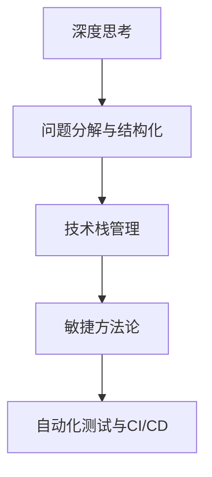

                 

# 深度思考与管理问题解决能力的提升

## 1. 背景介绍

### 1.1 问题由来
在快速发展的信息化时代，技术栈日益复杂，管理问题变得更为错综复杂。以往依靠人工经验决策的管理方式已不能满足日益增长的业务需求，亟需引入更为科学和智能的手段来提高问题解决的效率和质量。

### 1.2 问题核心关键点
该文章聚焦于如何通过深度思考与管理方法论，提升个人和团队的问题解决能力，特别是在技术问题解决方面。具体关键点包括：
1. **深度思考的训练**：通过结构化、系统化的训练方法，提升个人从问题现象到本质的理解和判断能力。
2. **管理问题结构化**：如何将复杂问题拆分为可管理的小问题，并通过逐步解决提升整体效果。
3. **技术栈的复杂性**：如何处理技术栈中多工具、多语言、多框架共存的情况，提升系统整合能力。
4. **快速迭代与优化**：通过敏捷方法论，提升问题解决效率和质量，实现快速反馈和持续优化。

## 2. 核心概念与联系

### 2.1 核心概念概述

为更好地理解问题解决的方法论，本节将介绍几个密切相关的核心概念：

- **深度思考**：一种通过逐步分析和推导，从问题的表面现象深入到本质，找到根本解的思维方式。深度思考需要系统化的训练和实践，以培养对问题的深刻洞察力。
- **问题分解与结构化**：将复杂问题拆分为小问题，通过系统化的方法逐步解决，最终完成整体问题的解决。这一过程需要对问题的各个部分进行精确的定义和分析。
- **技术栈管理**：在多工具、多语言、多框架共存的情况下，如何合理组织和协调这些技术，使其协同工作，提升系统整合能力。
- **敏捷方法论**：通过迭代、快速反馈、持续改进等方式，提升问题解决效率和质量，实现快速迭代与优化。
- **自动化测试与持续集成(CI/CD)**：通过自动化测试和持续集成，快速发现和修复问题，提升系统稳定性和可靠性。

这些核心概念之间的逻辑关系可以通过以下Mermaid流程图来展示：



这个流程图展示的核心概念及其之间的关系：

1. 深度思考是问题解决的起点，通过系统化的训练，提升对问题的洞察力。
2. 问题分解与结构化是解决复杂问题的关键，通过拆分和系统化的方法逐步解决。
3. 技术栈管理是复杂问题解决的基础，通过合理组织和协调技术资源，提升系统整合能力。
4. 敏捷方法论是快速迭代与优化的保障，通过迭代和快速反馈提升问题解决效率。
5. 自动化测试与CI/CD是持续改进的支撑，通过快速发现和修复问题，提升系统稳定性和可靠性。

## 3. 核心算法原理 & 具体操作步骤
### 3.1 算法原理概述

深度思考与管理问题解决的核心算法原理主要包括以下几个方面：

1. **问题现象到本质的理解**：通过系统化的训练方法，使个人掌握从问题现象深入到本质的思考方法。
2. **问题的结构化处理**：将复杂问题拆分为小问题，并系统化地处理每一部分，最终完成整体问题的解决。
3. **技术栈的整合与协同**：通过合理组织和协调技术资源，提升系统整合能力。
4. **快速迭代与持续优化**：通过敏捷方法论和自动化测试等手段，提升问题解决效率和质量。

### 3.2 算法步骤详解

基于以上核心算法原理，问题解决的过程可以分为以下几个关键步骤：

1. **定义问题**：明确问题现象、影响范围和关键因素。
2. **深入分析**：通过系统化的训练方法，从问题现象深入到本质，找到根本原因。
3. **问题分解**：将复杂问题拆分为可管理的小问题，并系统化地处理每一部分。
4. **技术栈整合**：根据问题特点，合理选择和协调技术资源，提升系统整合能力。
5. **迭代优化**：通过敏捷方法论和自动化测试，快速反馈和持续改进，提升问题解决效率和质量。

### 3.3 算法优缺点

基于深度思考与管理方法论的问题解决算法，具有以下优点：

1. **系统性**：通过系统化的方法处理问题，避免了片面思考和盲区。
2. **结构化**：将复杂问题拆分为小问题，提升了问题解决的效率和效果。
3. **协同性**：通过合理组织和协调技术资源，提升系统整合能力。
4. **敏捷性**：通过快速迭代和持续优化，提升问题解决效率和质量。

同时，该方法也存在以下局限性：

1. **培训成本高**：系统化的训练需要投入大量时间和资源。
2. **对技术栈要求高**：需要具备一定技术栈管理经验，适合有一定技术背景的团队。
3. **方法复杂**：整体方法论较为复杂，需要系统学习和实践。

### 3.4 算法应用领域

基于深度思考与管理问题解决的方法论，已经在软件开发、项目管理、数据分析等多个领域得到了广泛的应用，提升了问题解决的效率和效果。

- **软件开发**：通过敏捷开发和持续集成等手段，提升问题解决的效率和质量。
- **项目管理**：通过系统化的项目管理方法，提升项目的执行效率和成果质量。
- **数据分析**：通过数据驱动的方法论，提升数据分析的准确性和实用性。

## 4. 数学模型和公式 & 详细讲解 & 举例说明
### 4.1 数学模型构建

基于深度思考与管理问题解决的方法论，我们可以构建一个数学模型来描述问题解决的流程。假设问题的复杂度为 $C$，问题解决的效率为 $E$，系统的整合能力为 $S$，通过以下数学模型进行建模：

$$
E = f(C, S)
$$

其中 $f$ 表示问题解决的效率与问题复杂度、系统整合能力之间的函数关系。

### 4.2 公式推导过程

为了简化计算，我们可以假设问题的复杂度 $C$ 与系统整合能力 $S$ 成正比关系，即 $C = kS$，其中 $k$ 为比例系数。将此关系代入效率公式中，得到：

$$
E = f(kS, S) = g(k)S^n
$$

其中 $g(k)$ 表示系统整合能力对问题解决效率的影响因子，$n$ 表示问题解决效率随系统整合能力的增长率。

### 4.3 案例分析与讲解

以软件开发中的敏捷开发为例，分析其如何通过系统化的方法提升问题解决的效率和质量。

在敏捷开发中，将复杂项目拆分为多个迭代周期，每个迭代周期内通过快速反馈和持续改进，逐步解决系统中的问题。根据上述数学模型，系统整合能力 $S$ 包括：

- **技术栈管理**：选择合适的开发工具和框架，提升系统整合能力。
- **代码质量管理**：通过自动化测试和代码审查等手段，提升代码质量。
- **持续集成(CI/CD)**：通过持续集成和快速部署，提升问题解决效率和质量。

通过这些措施，系统整合能力 $S$ 得到提升，从而提升问题解决效率 $E$。

## 5. 项目实践：代码实例和详细解释说明
### 5.1 开发环境搭建

在进行问题解决实践前，我们需要准备好开发环境。以下是使用Python进行敏捷开发环境配置的流程：

1. **安装Anaconda**：从官网下载并安装Anaconda，用于创建独立的Python环境。

2. **创建并激活虚拟环境**：
```bash
conda create -n agile-env python=3.8 
conda activate agile-env
```

3. **安装必要的工具包**：
```bash
pip install numpy pandas scikit-learn tqdm jupyter notebook ipython
```

4. **安装敏捷开发工具**：
```bash
pip install jira
```

完成上述步骤后，即可在`agile-env`环境中开始敏捷开发实践。

### 5.2 源代码详细实现

以下是使用Jira进行敏捷开发的Python代码实现：

```python
from jira import JIRA

# 配置Jira客户端
jira = JIRA(options={'host': 'https://example.com', 
                    'basic_auth': ('username', 'password')})

# 获取项目所有问题
project_key = 'Project Key'
issues = jira.search_issues(project=project_key, status='To Do')

# 定义敏捷开发流程
def sprint issuetitle, issuid):
    jira.transition_issues(issuid, 'In Progress')
    jira.add_comment(issuid, 'Start sprint: {}'.format(sprint))
    
def done issuid):
    jira.transition_issues(issuid, 'Done')
    jira.add_comment(issuid, 'Sprint completed: {}'.format(done))

# 执行敏捷开发流程
for issue in issues:
    if issue.status == 'To Do':
        sprint(issue.issuetitle, issue.id)
    elif issue.status == 'In Progress':
        done(issue.id)
```

以上代码实现了基于Jira的敏捷开发流程，通过定义`start_sprint`和`done`函数，模拟了敏捷开发中的迭代周期。在实际应用中，可以使用Jira的API进行更复杂的操作，如任务分配、进度追踪等。

### 5.3 代码解读与分析

让我们再详细解读一下关键代码的实现细节：

**Jira客户端配置**：
- `jira`变量：初始化Jira客户端，指定服务器地址和基本认证信息。

**获取项目所有问题**：
- `jira.search_issues`方法：根据项目键和状态，搜索符合条件的问题列表。

**敏捷开发流程定义**：
- `sprint`函数：将任务状态从'To Do'修改为'In Progress'，并添加任务开始注释。
- `done`函数：将任务状态从'In Progress'修改为'Done'，并添加任务完成注释。

**敏捷开发流程执行**：
- 循环遍历所有问题，根据其当前状态，执行相应的任务开始或任务完成操作。

可以看到，使用Jira的API进行敏捷开发，可以方便地实现问题管理和任务追踪，提升了问题解决的效率和质量。

当然，工业级的系统实现还需考虑更多因素，如任务优先级、里程碑设置、团队协作等。但核心的敏捷开发流程基本与此类似。

## 6. 实际应用场景
### 6.1 软件开发

敏捷开发方法论在软件开发中得到了广泛应用，通过敏捷开发，提升了问题解决的效率和质量，降低了开发成本。

在敏捷开发中，将复杂项目拆分为多个迭代周期，每个迭代周期内通过快速反馈和持续改进，逐步解决系统中的问题。敏捷开发的核心思想包括：

1. **迭代开发**：将大项目拆分为多个小迭代，每个迭代周期通常为1-4周。
2. **快速反馈**：通过持续集成和快速部署，快速发现和修复问题。
3. **持续改进**：通过回顾会议和持续优化，提升问题解决效率和质量。

### 6.2 项目管理

项目管理通过系统化的项目管理方法，提升了项目的执行效率和成果质量。

在项目管理中，通过敏捷开发、任务管理、进度追踪等手段，使项目进展透明，问题解决高效。项目管理的关键步骤包括：

1. **需求管理**：通过需求分析、需求评审等方式，明确项目目标和需求。
2. **任务分配**：将项目任务拆分为可管理的小任务，并分配给相应的团队成员。
3. **进度追踪**：通过甘特图、看板等方式，实时追踪项目进度和问题状态。
4. **风险管理**：通过风险评估、风险控制等方式，降低项目风险。

### 6.3 数据分析

数据分析通过数据驱动的方法论，提升了数据分析的准确性和实用性。

在数据分析中，通过数据采集、数据清洗、数据分析等手段，从数据中提取有价值的信息，指导业务决策。数据分析的关键步骤包括：

1. **数据采集**：通过ETL等手段，从各种数据源采集数据。
2. **数据清洗**：通过数据清洗、数据补全等方式，提升数据质量。
3. **数据分析**：通过统计分析、机器学习等手段，提取有价值的信息。
4. **数据可视化**：通过可视化工具，展示分析结果，指导业务决策。

## 7. 工具和资源推荐
### 7.1 学习资源推荐

为了帮助开发者系统掌握深度思考与管理方法论，这里推荐一些优质的学习资源：

1. **《深度思考的艺术》**：介绍深度思考的原理和训练方法，帮助提升对问题的洞察力。
2. **《敏捷开发实践》**：介绍敏捷开发的核心思想和实践方法，提升项目管理的效率和质量。
3. **《数据分析与决策》**：介绍数据分析的原理和方法，提升数据驱动决策的能力。
4. **《项目管理基础》**：介绍项目管理的核心概念和方法，提升项目执行的效率和成果质量。

通过对这些资源的学习实践，相信你一定能够掌握深度思考与管理方法论，并将其应用于实际问题解决中。

### 7.2 开发工具推荐

高效的开发离不开优秀的工具支持。以下是几款用于问题解决开发的常用工具：

1. **Jira**：广泛使用的项目管理工具，支持敏捷开发、任务管理、进度追踪等功能。
2. **GitLab**：基于Git的项目管理平台，支持代码托管、持续集成、自动化测试等功能。
3. **Confluence**：企业级知识管理平台，支持文档协作、知识分享等功能。
4. **Trello**：简单易用的任务管理工具，支持看板、列表等管理方式。
5. **Jenkins**：开源持续集成工具，支持自动化构建、部署和测试等功能。
6. **Docker**：容器化技术，支持多环境下的应用部署和迁移。

合理利用这些工具，可以显著提升问题解决的效率和质量，加快创新迭代的步伐。

### 7.3 相关论文推荐

深度思考与管理方法论的研究源于学界的持续研究。以下是几篇奠基性的相关论文，推荐阅读：

1. **《敏捷软件开发：原则、模式与实践》**：介绍敏捷开发的核心思想和实践方法，推动软件开发领域的发展。
2. **《数据驱动决策：原理、方法和实践》**：介绍数据分析的原理和方法，提升数据驱动决策的能力。
3. **《项目管理：理论与实践》**：介绍项目管理的关键概念和方法，提升项目管理的效率和质量。
4. **《深度思考：从现象到本质》**：介绍深度思考的原理和训练方法，提升对问题的洞察力。

这些论文代表了大语言模型微调技术的发展脉络。通过学习这些前沿成果，可以帮助研究者把握学科前进方向，激发更多的创新灵感。

## 8. 总结：未来发展趋势与挑战
### 8.1 总结

本文对深度思考与管理问题解决能力提升的方法论进行了全面系统的介绍。首先阐述了深度思考与管理方法论的研究背景和意义，明确了问题解决在提升工作效率和质量方面的重要价值。其次，从原理到实践，详细讲解了问题解决的核心步骤，给出了问题解决任务开发的完整代码实例。同时，本文还探讨了问题解决在软件开发、项目管理、数据分析等多个领域的应用前景，展示了问题解决范式的巨大潜力。此外，本文精选了问题解决技术的各类学习资源，力求为读者提供全方位的技术指引。

通过本文的系统梳理，可以看到，深度思考与管理方法论正在成为问题解决的重要范式，极大地提升了问题解决的效率和质量。受益于深度思考的训练、问题分解与结构化、技术栈管理、敏捷方法论等方法的综合应用，问题解决过程更为系统、高效。未来，伴随技术栈的不断丰富和问题复杂度的增加，问题解决能力还将进一步提升。

### 8.2 未来发展趋势

展望未来，深度思考与管理问题解决能力提升技术将呈现以下几个发展趋势：

1. **自动化与智能化**：问题解决过程将越来越多地引入自动化工具和智能化算法，提升问题解决的效率和质量。
2. **跨学科融合**：问题解决范式将融合更多学科的知识和方法，提升问题解决的深度和广度。
3. **动态适应与自学习**：问题解决模型将具备动态适应和自学习能力，能够根据问题特点进行自我优化和提升。
4. **人机协同**：问题解决将更加注重人机协同，结合人类智慧和机器能力，提升问题解决的创新性和有效性。
5. **知识图谱与专家系统**：问题解决将引入知识图谱和专家系统，提升系统整合能力和知识应用能力。

以上趋势凸显了深度思考与管理问题解决技术的发展方向。这些方向的探索发展，必将进一步提升问题解决的效率和质量，为技术栈的复杂化问题提供有效的解决方案。

### 8.3 面临的挑战

尽管深度思考与管理问题解决能力提升技术已经取得了显著成果，但在迈向更为智能化、自动化和协同化应用的过程中，它仍面临诸多挑战：

1. **跨领域知识整合**：问题解决范式需要整合更多学科的知识，不同领域的知识整合难度较大。
2. **多技术栈协作**：在技术栈日益复杂的情况下，如何进行有效协作是一个难题。
3. **问题定义与分解**：如何准确地定义和分解问题，避免分解过细或过粗，需要更多的实践经验。
4. **自动化与智能化**：虽然自动化工具可以提升效率，但如何智能化地解决问题，避免陷入过度依赖自动化工具的困境，仍需探索。
5. **人机协同**：如何在人机协同中发挥各自优势，提升问题解决的创新性和有效性，需要更多的实践和研究。

这些挑战需要我们在实践中不断探索和改进，才能更好地提升问题解决能力。

### 8.4 研究展望

面对深度思考与管理问题解决能力提升技术面临的挑战，未来的研究需要在以下几个方面寻求新的突破：

1. **跨领域知识整合**：通过引入知识图谱和专家系统，提升问题解决的知识整合能力。
2. **多技术栈协作**：通过引入协作工具和协同方法，提升技术栈协作的效率和效果。
3. **问题定义与分解**：通过系统化的训练和方法，提升问题定义与分解的能力。
4. **自动化与智能化**：开发更加智能化的问题解决模型，提升问题解决的效率和质量。
5. **人机协同**：通过引入协作工具和协同方法，提升人机协同的效果。

这些研究方向将引领深度思考与管理问题解决技术迈向更高的台阶，为技术栈的复杂化问题提供有效的解决方案。未来，随着技术栈的不断丰富和问题复杂度的增加，问题解决能力还将进一步提升，为人类的认知智能和生产效率的提升带来新的突破。

## 9. 附录：常见问题与解答
**Q1：深度思考是否适用于所有问题？**

A: 深度思考适用于复杂度较高、难以通过直观判断的问题。对于简单问题，建议直接进行问题解决，避免过度复杂的思考过程。

**Q2：问题分解的粒度如何确定？**

A: 问题分解的粒度应根据问题的复杂度和团队能力进行灵活调整。通常建议将问题分解为可管理的小问题，避免分解过细或过粗。

**Q3：技术栈管理的主要难点是什么？**

A: 技术栈管理的主要难点在于如何选择合适的技术栈工具和框架，确保技术的协同工作。建议根据问题的特点和团队的技术背景，选择最适合的技术栈。

**Q4：敏捷开发的核心思想是什么？**

A: 敏捷开发的核心思想包括迭代开发、快速反馈、持续改进等。通过敏捷开发，提升问题解决的效率和质量，降低开发成本。

**Q5：数据分析的关键步骤是什么？**

A: 数据分析的关键步骤包括数据采集、数据清洗、数据分析和数据可视化。通过数据分析，从数据中提取有价值的信息，指导业务决策。

---

作者：禅与计算机程序设计艺术 / Zen and the Art of Computer Programming

