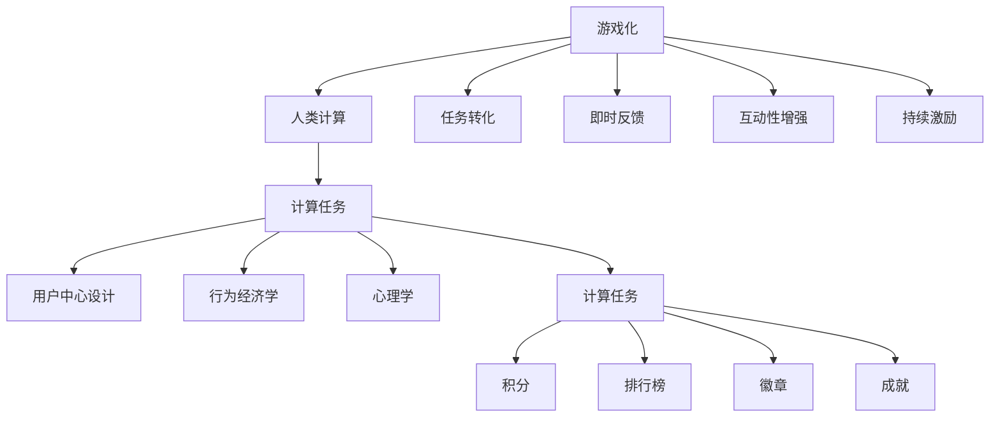

                 

# 游戏化：让参与人类计算充满乐趣

## 1. 背景介绍

### 1.1 问题由来
在数字化时代，计算已不再是枯燥无味的重复劳动，而是推动人类进步的重要工具。然而，大量的人类计算任务依然依赖人工介入，尤其是在数据处理、自然语言理解、图像识别等复杂任务中，传统自动化方法难以完全替代。为了激发人类计算的积极性和创造力，游戏化技术应运而生，成为提升人类计算效率和效果的有力手段。

### 1.2 问题核心关键点
游戏化技术通过将计算任务转化为游戏化的形式，使得参与者能够在乐趣中完成任务，从而大幅提高计算效率。其核心在于：

- **任务转化**：将复杂的计算任务转化为易于理解、操作的游戏化挑战，使参与者能够在愉悦中完成任务。
- **即时反馈**：通过即时、直观的反馈机制，让参与者随时了解任务进展和成绩，增强参与感和成就感。
- **互动性增强**：引入社交、竞争等互动元素，提升参与者之间的互动性，激发更多的创造力和合作精神。
- **持续激励**：通过奖励机制和成就系统，持续激励参与者保持高度参与，防止任务中途退出。

这些核心要素共同构成了游戏化技术的精髓，使其在提升人类计算效率和效果方面具备巨大潜力。

## 2. 核心概念与联系

### 2.1 核心概念概述

为更好地理解游戏化技术在人类计算中的应用，本节将介绍几个密切相关的核心概念：

- **游戏化（Gamification）**：指将游戏元素融入非游戏环境，提升用户体验和互动性。典型的游戏化元素包括积分、排行榜、徽章、成就等。
- **人类计算（Human Computation）**：指依赖人类智能和手工劳动来执行计算任务的过程。通常用于处理大规模数据集、进行复杂推理等自动化难以胜任的任务。
- **游戏设计理论**：包括用户中心设计、行为经济学、心理学等多学科的知识，用于设计吸引用户、激发参与的游戏机制。
- **计算任务**：指需要人类介入进行处理的计算问题，如大规模数据清洗、图像标注、自然语言理解等。
- **参与激励**：通过各种激励机制，如积分、奖励、排行榜等，持续激励参与者进行计算任务，增强参与动力。

这些概念之间的逻辑关系可以通过以下Mermaid流程图来展示：



这个流程图展示了游戏化技术与人类计算任务之间的逻辑关系：

1. 游戏化技术将人类计算任务转化为易于操作的游戏形式。
2. 通过即时反馈、互动性和持续激励，增强参与者的参与感和成就感。
3. 用户中心设计、行为经济学和心理学等多学科知识，为游戏化设计提供了理论基础。
4. 游戏化设计要考虑具体的计算任务，引入合适的游戏元素和激励机制。

## 3. 核心算法原理 & 具体操作步骤
### 3.1 算法原理概述

游戏化技术在人类计算中的应用，主要基于以下两个核心算法原理：

**1. 任务转化算法**
将复杂的计算任务转化为游戏化挑战，需要设计一系列规则和机制，使得任务变得有趣且易于操作。这些规则和机制包括但不限于：

- **任务拆分**：将复杂的任务拆分为多个子任务，逐步完成。
- **难度调整**：根据参与者的能力和经验，动态调整任务难度，使其既能挑战参与者，又不至于过于困难。
- **奖励设计**：为参与者设定明确的奖励机制，如积分、徽章等，激励其完成每个子任务。
- **进度显示**：通过进度条、倒计时等方式，显示任务的完成情况，增强参与者的成就感和紧迫感。

**2. 即时反馈算法**
即时反馈是游戏化技术的关键要素之一，通过即时反馈机制，参与者可以随时了解任务进展和成绩，从而保持高度参与和持续激励。这些即时反馈机制包括但不限于：

- **即时评分**：根据参与者的操作，实时计算其得分和排名。
- **反馈提示**：在参与者操作失误或出现偏差时，提供及时的提示和指导，帮助其纠正错误。
- **任务提示**：在任务中设置引导性提示，帮助参与者理解任务要求和操作步骤。
- **成就展示**：实时展示参与者获得的成就和排名，增强其成就感和满足感。

### 3.2 算法步骤详解

基于游戏化技术的人类计算应用，一般包括以下几个关键步骤：

**Step 1: 任务设计和转化**
- 确定具体的计算任务，如大规模数据清洗、图像标注、自然语言理解等。
- 设计任务转化规则，将计算任务转化为游戏化挑战。
- 确定任务拆分策略，将大任务拆分为多个子任务。

**Step 2: 游戏化机制设计**
- 设计即时反馈机制，包括即时评分、反馈提示等。
- 引入社交、竞争等互动元素，提升参与者的互动性和合作性。
- 设定持续激励机制，如积分、排行榜、徽章等，激励参与者完成各个子任务。

**Step 3: 游戏化平台搭建**
- 选择适合的游戏化平台，如Web、移动应用等。
- 开发游戏化应用，集成任务转化、即时反馈、持续激励等机制。
- 测试和优化游戏化应用，确保其稳定性和易用性。

**Step 4: 部署和推广**
- 在实际计算任务中应用游戏化技术。
- 宣传推广游戏化平台，吸引更多参与者加入。
- 持续收集反馈，不断改进和优化游戏化应用。

### 3.3 算法优缺点

游戏化技术在提升人类计算效率和效果方面，具有以下优点：

- **提升参与度**：通过游戏化机制，大幅提升参与者的参与度和积极性，减少任务中途退出。
- **提高效率**：游戏化机制使得任务变得有趣且易于操作，从而提升计算效率。
- **增强协作**：通过社交、竞争等互动元素，增强参与者之间的协作和合作。
- **灵活适配**：游戏化机制可以根据具体任务进行灵活设计，适应不同的计算需求。

同时，该技术也存在以下局限性：

- **成本较高**：游戏化平台的搭建和维护需要一定的成本和技术投入。
- **设计复杂**：游戏化设计需要跨学科知识，需要设计师和专家团队共同合作。
- **用户体验分化**：不同参与者对游戏化机制的接受度不同，可能导致用户体验分化。
- **任务过于游戏化**：如果任务设计过于游戏化，可能导致任务真实性和严肃性下降。

尽管存在这些局限性，但就目前而言，游戏化技术仍然是大规模人类计算任务的重要工具。未来相关研究的重点在于如何进一步优化游戏化设计，降低设计和维护成本，提高用户体验，从而更好地服务于大规模计算任务。

### 3.4 算法应用领域

游戏化技术在人类计算中的应用，已经在多个领域取得了显著成效，主要包括：

- **大规模数据清洗**：通过游戏化机制，对大规模数据进行快速、准确的清洗处理。
- **图像标注**：通过游戏化机制，提高图像标注的准确性和一致性。
- **自然语言理解**：通过游戏化机制，提升自然语言理解任务的效率和效果。
- **人工智能模型训练**：通过游戏化机制，加速人工智能模型的训练过程。
- **科学计算**：通过游戏化机制，提升科学计算任务的参与度和效率。

此外，游戏化技术还被广泛应用于数据标注、生物信息学、医学影像分析等领域，为人类计算任务的自动化和智能化提供了新的路径。

## 4. 数学模型和公式 & 详细讲解 & 举例说明

### 4.1 数学模型构建

游戏化技术在人类计算中的应用，可以通过以下数学模型进行描述：

- **参与度模型**：定义参与者的参与度 $P$，包括任务完成率、任务持续时间和任务满意度等指标。
- **任务完成模型**：定义任务完成情况 $C$，包括任务拆分策略、任务难度调整和即时反馈机制等。
- **效率提升模型**：定义任务效率提升 $E$，包括任务完成时间、任务准确度和任务复杂度等。

### 4.2 公式推导过程

以大规模数据清洗任务为例，我们可以定义其参与度模型、任务完成模型和效率提升模型如下：

1. **参与度模型**
   $$
   P = \alpha \times C + \beta \times T + \gamma \times S
   $$
   其中 $\alpha$、$\beta$、$\gamma$ 为模型参数，$C$ 为任务完成率，$T$ 为任务持续时间，$S$ 为任务满意度。

2. **任务完成模型**
   $$
   C = \frac{1}{N} \sum_{i=1}^N \max(0, \min(T_i, \text{difficulty}_i))
   $$
   其中 $N$ 为任务总数，$T_i$ 为第 $i$ 个子任务的完成时间，$\text{difficulty}_i$ 为第 $i$ 个子任务的难度。

3. **效率提升模型**
   $$
   E = \frac{1}{C_{\text{pre}}} - \frac{1}{C}
   $$
   其中 $C_{\text{pre}}$ 为预训练时的任务完成率，$C$ 为游戏化后的任务完成率。

### 4.3 案例分析与讲解

在实际应用中，我们可以使用上述数学模型对大规模数据清洗任务进行建模和分析。以下是一个具体案例：

**案例：某电商平台大规模数据清洗任务**

- **任务描述**：电商平台需要将数百万条商品信息进行清洗，去除重复、无效和错误的数据，以确保商品信息的准确性和完整性。
- **参与度模型**：参与者的参与度 $P$ 包括任务完成率 $C$、任务持续时间 $T$ 和任务满意度 $S$。通过游戏化机制，提高参与者的任务完成率，减少任务持续时间，提升任务满意度。
- **任务完成模型**：将大规模数据清洗任务拆分为多个子任务，根据参与者的能力和经验，动态调整每个子任务的难度。
- **效率提升模型**：通过游戏化机制，在保证任务准确性的前提下，提升任务效率。例如，通过即时评分和反馈提示，提高任务完成率，减少任务持续时间。

## 5. 项目实践：代码实例和详细解释说明

### 5.1 开发环境搭建

在进行游戏化技术应用开发前，我们需要准备好开发环境。以下是使用Python进行Web开发的环境配置流程：

1. 安装Anaconda：从官网下载并安装Anaconda，用于创建独立的Python环境。

2. 创建并激活虚拟环境：
```bash
conda create -n gameify-env python=3.8 
conda activate gameify-env
```

3. 安装Django和Flask：用于开发Web应用，集成了数据库管理和Web接口。
```bash
pip install django flask
```

4. 安装前端框架：如Bootstrap、Vue.js等，用于美化页面和提升用户体验。
```bash
pip install django-bootstrap4 flask-bootstraper
```

5. 安装后端服务：如Redis、PostgreSQL等，用于数据存储和分布式计算。
```bash
pip install django-redis psycopg2-binary
```

完成上述步骤后，即可在`gameify-env`环境中开始游戏化应用开发。

### 5.2 源代码详细实现

下面以电商平台商品信息清洗任务为例，给出使用Django框架对游戏化任务进行开发的PyTorch代码实现。

首先，定义任务模型：

```python
from django.db import models

class Task(models.Model):
    title = models.CharField(max_length=100)
    difficulty = models.IntegerField(default=1)
    description = models.TextField()
    completion_time = models.DurationField(null=True, blank=True)
```

然后，定义任务完成模型：

```python
from django.db import models
from django.contrib.auth.models import User

class TaskCompletion(models.Model):
    task = models.ForeignKey(Task, on_delete=models.CASCADE)
    user = models.ForeignKey(User, on_delete=models.CASCADE)
    start_time = models.DateTimeField(auto_now_add=True)
    end_time = models.DateTimeField(null=True, blank=True)
    completion_time = models.DurationField(null=True, blank=True)
    score = models.IntegerField(default=0)
```

接着，定义游戏化应用逻辑：

```python
from django.http import JsonResponse
from django.views.decorators.csrf import csrf_exempt

@csrf_exempt
def task_completion(request):
    if request.method == 'POST':
        task_id = request.POST.get('task_id')
        user_id = request.POST.get('user_id')
        start_time = request.POST.get('start_time')
        end_time = request.POST.get('end_time')
        completion_time = request.POST.get('completion_time')
        score = request.POST.get('score')
        
        try:
            task = Task.objects.get(id=task_id)
            user = User.objects.get(id=user_id)
            task_completion = TaskCompletion.objects.get_or_create(
                task=task,
                user=user,
                start_time=start_time,
                end_time=end_time,
                completion_time=completion_time,
                score=score
            )
            
            response = {
                'message': 'Task completed successfully',
                'score': task_completion.score
            }
        except Exception as e:
            response = {'message': str(e)}
        
        return JsonResponse(response)
```

最后，定义前端页面和互动逻辑：

```html
<!DOCTYPE html>
<html lang="en">
<head>
    <meta charset="UTF-8">
    <title>Task Completion</title>
    <link rel="stylesheet" href="https://stackpath.bootstrapcdn.com/bootstrap/4.5.2/css/bootstrap.min.css">
</head>
<body>
    <div class="container mt-5">
        <h1>Task Completion</h1>
        <form id="task-completion-form">
            <input type="text" id="task-id" placeholder="Task ID" required>
            <input type="text" id="user-id" placeholder="User ID" required>
            <input type="datetime-local" id="start-time" required>
            <input type="datetime-local" id="end-time" required>
            <input type="datetime-local" id="completion-time" required>
            <input type="number" id="score" min="0" max="100" required>
            <button type="submit" class="btn btn-primary">Submit</button>
        </form>
    </div>
    
    <script src="https://code.jquery.com/jquery-3.5.1.slim.min.js"></script>
    <script src="https://cdn.jsdelivr.net/npm/@popperjs/core@2.10.2/dist/umd/popper.min.js"></script>
    <script src="https://cdn.jsdelivr.net/npm/bootstrap@4.5.2/dist/js/bootstrap.min.js"></script>
    <script>
        $(document).ready(function() {
            $('#task-completion-form').submit(function(event) {
                event.preventDefault();
                var form_data = $(this).serialize();
                $.ajax({
                    url: '/task/completion',
                    method: 'POST',
                    data: form_data,
                    success: function(response) {
                        console.log(response);
                        alert('Task completed successfully');
                    },
                    error: function(jqXHR, textStatus, errorThrown) {
                        console.log(jqXHR.responseText);
                        alert('Task submission failed');
                    }
                });
            });
        });
    </script>
</body>
</html>
```

以上就是使用Django框架对电商平台商品信息清洗任务进行游戏化开发的全过程。可以看到，通过简单的Django应用设计和前端交互逻辑，就能实现一个初步的游戏化任务管理系统。

### 5.3 代码解读与分析

让我们再详细解读一下关键代码的实现细节：

**任务模型**：
- 定义了任务的标题、难度、描述、完成时间等属性，用于存储任务的基本信息。

**任务完成模型**：
- 记录了每个任务的完成情况，包括任务ID、用户ID、开始时间、结束时间、完成时间、得分等属性。

**任务完成视图**：
- 使用Django的视图装饰器和请求处理函数，处理POST请求，获取任务的ID、用户ID、开始时间、结束时间、完成时间和得分等数据。
- 通过TaskCompletion模型进行数据存储，同时返回JSON响应。

**前端页面**：
- 使用HTML和Bootstrap框架，创建了一个简单的任务提交表单。
- 通过jQuery库进行表单提交和响应处理，增强用户体验。

可以看出，通过Django和前端框架的配合使用，可以轻松实现游戏化任务管理系统。开发者可以根据具体需求，进一步扩展和优化应用功能，提升任务管理效率和用户体验。

## 6. 实际应用场景

### 6.1 电商平台商品信息清洗

基于游戏化技术的电商平台商品信息清洗任务，可以大大提高数据处理效率和准确性。通过设计吸引参与者、激励参与者的游戏化机制，使大量志愿者参与到数据清洗工作中，从而快速完成大规模数据处理任务。

在实践中，电商平台可以将大规模商品信息清洗任务转化为一系列子任务，每个子任务代表对某部分数据的清洗处理。通过即时评分和反馈提示，引导参与者完成每个子任务，并在任务完成后给予积分、徽章等奖励，激励参与者继续参与后续任务。

### 6.2 科学研究数据整理

科学研究领域涉及大量的数据整理和分析工作，如基因组数据、气象数据、天文数据等。通过游戏化技术，科学家可以将数据整理任务转化为游戏挑战，吸引志愿者参与。

在实践中，科学家可以将数据整理任务拆分为多个子任务，每个子任务代表对某部分数据的整理。通过即时评分和反馈提示，引导参与者完成每个子任务，并在任务完成后给予积分、徽章等奖励，激励参与者继续参与后续任务。通过这种方式，可以显著提升数据整理的速度和质量。

### 6.3 公共数据集标注

公共数据集的标注任务通常需要大量人工参与，如ImageNet图像标注、OpenAI的GPT-3数据集标注等。通过游戏化技术，可以高效地完成大规模数据标注任务。

在实践中，可以将标注任务转化为一系列子任务，每个子任务代表对某部分数据的标注。通过即时评分和反馈提示，引导参与者完成每个子任务，并在任务完成后给予积分、徽章等奖励，激励参与者继续参与后续任务。通过这种方式，可以高效地完成大规模数据标注任务。

## 7. 工具和资源推荐
### 7.1 学习资源推荐

为了帮助开发者系统掌握游戏化技术在游戏化人类计算中的应用，这里推荐一些优质的学习资源：

1. **《游戏化设计》（Gamification by Design）**：作者：Simon Lake，详细介绍了游戏化设计的理论基础和实践方法，适用于游戏化应用开发的学习者。
2. **《游戏化：改变世界的力量》（Gamification: How to Gamify Learning, Business, and Everyday Life）**：作者：Steve Porter，介绍了游戏化技术在游戏、学习和商业中的应用，提供丰富的案例和实用工具。
3. **《游戏设计模式》（Pattern Gamification）**：作者：Steve Porter，介绍了多种游戏化设计模式，帮助开发者设计更具吸引力的游戏化应用。
4. **Coursera的Gamification Specialization课程**：由Hazzan和Cook教授主讲，提供关于游戏化设计的深入学习和实践指导。
5. **Udacity的Gamification Nanodegree**：提供游戏化设计的系统学习，包括游戏设计原理、游戏化应用开发等。

通过对这些资源的学习实践，相信你一定能够快速掌握游戏化技术的精髓，并用于解决实际的计算任务。

### 7.2 开发工具推荐

高效的开发离不开优秀的工具支持。以下是几款用于游戏化技术应用开发的常用工具：

1. **Django**：开源的Python Web框架，支持RESTful API开发，非常适合游戏化应用开发。
2. **Flask**：轻量级的Python Web框架，灵活易用，适合快速原型开发。
3. **Bootstrap**：前端框架，提供丰富的UI组件和样式，适用于Web应用的前端设计。
4. **Vue.js**：现代前端框架，支持组件化开发，适用于前端页面的动态交互。
5. **D3.js**：数据可视化库，提供丰富的图表和动画效果，适用于数据展示和交互。

合理利用这些工具，可以显著提升游戏化应用的开发效率，加快创新迭代的步伐。

### 7.3 相关论文推荐

游戏化技术在游戏化人类计算中的应用，已经引起了学界的广泛关注。以下是几篇奠基性的相关论文，推荐阅读：

1. **《设计游戏化：一种新兴的交互设计方法》（Designing Gameful Learning）**：作者：Chuck Youssiou，探讨了游戏化在教育和学习中的应用，强调了游戏化设计的关键要素和实施方法。
2. **《游戏化：在企业中激励员工的方法》（Gamification for Employee Engagement）**：作者：Mihai Numeș，介绍了游戏化在企业管理中的应用，提供了丰富的游戏化应用案例。
3. **《游戏化：提高用户参与度的方法》（Gamification for User Engagement）**：作者：Zachary Quinn，详细介绍了游戏化在提高用户参与度方面的应用，提供了实用的游戏化设计技巧。
4. **《游戏化学习：理论、实践和未来》（Gamification in Education）**：作者：Hinrich Schütze，探讨了游戏化在教育中的应用，分析了游戏化学习的理论和实践。

这些论文代表了游戏化技术在游戏化人类计算领域的最新研究成果，阅读这些论文将有助于你深入理解游戏化技术的理论基础和实践方法。

## 8. 总结：未来发展趋势与挑战

### 8.1 总结

本文对游戏化技术在游戏化人类计算中的应用进行了全面系统的介绍。首先阐述了游戏化技术和人类计算任务的研究背景和意义，明确了游戏化技术在提升人类计算效率和效果方面的独特价值。其次，从原理到实践，详细讲解了游戏化算法的核心原理和具体操作步骤，给出了游戏化任务开发的完整代码实例。同时，本文还广泛探讨了游戏化技术在游戏化人类计算中的应用前景，展示了游戏化技术的巨大潜力。此外，本文精选了游戏化技术的各类学习资源，力求为读者提供全方位的技术指引。

通过本文的系统梳理，可以看到，游戏化技术在游戏化人类计算中的应用前景广阔，其灵活、高效、互动的特性，使得游戏化技术在提升计算效率和效果方面具备巨大潜力。

### 8.2 未来发展趋势

展望未来，游戏化技术在游戏化人类计算领域将呈现以下几个发展趋势：

1. **自动化和智能化**：未来游戏化技术将结合人工智能和机器学习技术，实现更智能、自动化的任务管理，提升任务处理的效率和效果。
2. **多样化游戏元素**：未来的游戏化应用将融合更多游戏元素，如社交、竞争、探索等，提升参与者的互动性和创造力。
3. **跨平台和跨媒体**：游戏化技术将不仅仅局限于Web应用，还将扩展到移动应用、桌面应用和AR/VR等新兴领域，提供更加丰富和多样的交互体验。
4. **个性化和定制化**：未来的游戏化应用将根据参与者的特点和偏好，提供个性化的游戏化体验，增强参与者的参与感和满意度。
5. **数据驱动的优化**：游戏化应用的优化将更加依赖数据分析，通过不断收集和分析参与者的行为数据，实时调整游戏化策略，提升任务处理的效率和效果。

以上趋势凸显了游戏化技术在游戏化人类计算领域的广阔前景。这些方向的探索发展，必将进一步提升游戏化技术的普适性和灵活性，为人类计算任务的自动化和智能化提供新的路径。

### 8.3 面临的挑战

尽管游戏化技术在游戏化人类计算领域已经取得了显著成效，但在迈向更加智能化、普适化应用的过程中，它仍面临着诸多挑战：

1. **成本和资源**：游戏化平台的搭建和维护需要一定的成本和技术投入，包括前端和后端的开发、数据存储和处理等。
2. **用户体验**：游戏化设计需要跨学科知识，不同参与者对游戏化机制的接受度不同，可能导致用户体验分化。
3. **数据安全和隐私**：参与者的行为数据需要保护，防止数据泄露和滥用。如何保证数据安全和隐私，是游戏化应用开发的重要考虑因素。
4. **任务真实性**：游戏化机制可能使任务变得过于游戏化，导致任务的真实性和严肃性下降，影响任务完成的效率和质量。
5. **技术壁垒**：游戏化应用的开发需要跨学科技术支持，包括前端开发、后端开发、数据处理等，需要团队协作和专业知识。

正视游戏化面临的这些挑战，积极应对并寻求突破，将是大规模游戏化应用走向成熟的必由之路。相信随着学界和产业界的共同努力，这些挑战终将一一被克服，游戏化技术必将在构建智能计算系统中扮演越来越重要的角色。

### 8.4 未来突破

面对游戏化技术在游戏化人类计算领域所面临的种种挑战，未来的研究需要在以下几个方面寻求新的突破：

1. **自动化游戏设计**：开发自动化游戏设计工具，帮助开发者快速生成游戏化机制，降低设计和维护成本。
2. **智能任务调度**：结合人工智能技术，实现更智能、自动化的任务调度和管理，提升任务处理的效率和效果。
3. **个性化游戏元素**：通过数据分析，为不同参与者提供个性化的游戏化体验，增强参与者的参与感和满意度。
4. **跨平台和跨媒体**：开发跨平台和跨媒体的游戏化应用，提供更加丰富和多样的交互体验，满足不同用户的需求。
5. **数据驱动的优化**：利用数据分析技术，实时调整游戏化策略，优化任务处理效率和效果，提升用户体验。

这些研究方向的探索，必将引领游戏化技术在游戏化人类计算领域迈向更高的台阶，为构建智能计算系统提供新的技术路径。面向未来，游戏化技术还需要与其他人工智能技术进行更深入的融合，如知识表示、因果推理、强化学习等，多路径协同发力，共同推动游戏化计算技术的进步。只有勇于创新、敢于突破，才能不断拓展游戏化技术的边界，让智能计算技术更好地造福人类社会。

## 9. 附录：常见问题与解答

**Q1：游戏化技术如何应用于大规模人类计算任务？**

A: 游戏化技术通过将大规模人类计算任务转化为游戏化挑战，使参与者在乐趣中完成任务。具体步骤如下：
1. 将任务拆分为多个子任务，逐步完成。
2. 设计游戏化机制，如即时评分、反馈提示等，增强参与者的参与感和成就感。
3. 引入社交、竞争等互动元素，提升参与者之间的互动性和合作性。
4. 设定持续激励机制，如积分、排行榜、徽章等，激励参与者完成各个子任务。

**Q2：游戏化技术如何提升参与者的参与度和积极性？**

A: 游戏化技术通过设计有趣且易于操作的游戏化挑战，使参与者在乐趣中完成任务，从而提升参与度和积极性。具体措施包括：
1. 将任务转化为吸引人的游戏形式，如闯关、竞赛等。
2. 引入即时反馈机制，如即时评分、反馈提示等，增强参与者的参与感和成就感。
3. 设定持续激励机制，如积分、排行榜、徽章等，激励参与者继续参与后续任务。

**Q3：游戏化技术在人类计算中的成本和资源问题如何解决？**

A: 游戏化平台的搭建和维护需要一定的成本和技术投入，包括前端和后端的开发、数据存储和处理等。为降低成本和资源消耗，可以采取以下措施：
1. 采用自动化游戏设计工具，帮助开发者快速生成游戏化机制。
2. 结合云计算和分布式计算技术，实现更高效的数据处理和任务调度。
3. 优化前端页面和后端服务，提升用户体验和系统性能。

**Q4：游戏化技术如何保证数据安全和隐私？**

A: 游戏化应用涉及大量参与者的行为数据，需要保证数据安全和隐私。可以采取以下措施：
1. 采用加密技术和安全协议，保护数据传输的安全性。
2. 建立数据访问控制机制，限制对敏感数据的访问权限。
3. 定期进行数据备份和恢复，防止数据丢失和损坏。
4. 对参与者进行隐私保护教育，增强其数据保护意识。

**Q5：游戏化技术如何提升任务的真实性和严肃性？**

A: 游戏化机制可能使任务变得过于游戏化，导致任务的真实性和严肃性下降。为提升任务的真实性和严肃性，可以采取以下措施：
1. 设计合理的任务难度和完成时间，确保任务的实际性和挑战性。
2. 引入任务监控和评估机制，实时监测任务的进展和质量。
3. 设定明确的奖惩机制，鼓励参与者遵守任务规则，保持任务的真实性和严肃性。

这些常见问题及其解答，展示了游戏化技术在游戏化人类计算领域的实际应用和优化方向。通过系统理解和深入实践，相信你一定能够更好地掌握游戏化技术的精髓，并用于解决实际的计算任务。

---

作者：禅与计算机程序设计艺术 / Zen and the Art of Computer Programming

