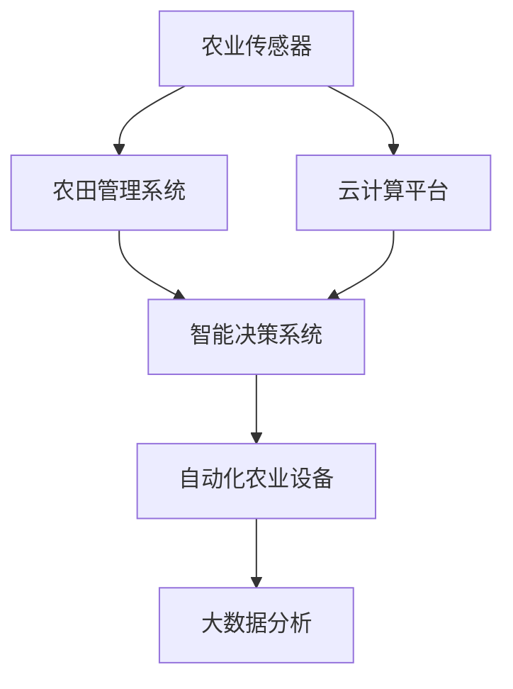

                 

# 物联网在智慧农业中的应用：提高农作物产量

## 1. 背景介绍

### 1.1 问题由来

随着全球人口的增长和城市化进程的加快，食品需求持续增加，对农业生产提出了更高的要求。传统农业模式难以满足日益增长的食品生产需求，同时受到环境、气候等自然因素的制约。因此，如何提高农业生产效率、减少资源浪费、保障食品安全，成为全球农业领域亟需解决的问题。

在这一背景下，物联网(IoT)技术的快速发展，为智慧农业的兴起提供了技术基础。通过将传感器、互联网、移动设备等技术融入农业生产中，可以实时监测和管理农田环境，优化农业资源配置，提升农作物产量。

### 1.2 问题核心关键点

物联网在智慧农业中的应用，主要包括以下几个关键点：

- **实时监测**：通过各类传感器实时监测土壤湿度、温度、光照、二氧化碳浓度等环境参数，为农业生产提供数据支持。
- **精准管理**：利用数据分析结果，实现精准施肥、灌溉、喷药等管理措施，提高资源利用效率。
- **自动化控制**：借助物联网设备实现自动化的耕作、播种、收割等机械作业，提升作业效率和生产质量。
- **智能决策**：结合大数据分析和机器学习技术，实现农业生产的智能决策支持，优化种植方案和生产计划。

## 2. 核心概念与联系

### 2.1 核心概念概述

为更好地理解物联网在智慧农业中的应用，本节将介绍几个密切相关的核心概念：

- **物联网(IoT)**：通过各类传感器和设备将农业生产中的数据实时传输到云端，形成数据流，支持农业生产的各个环节。
- **农业传感器**：用于监测和记录农业生产中的各类环境参数，如土壤湿度、温度、光照、二氧化碳浓度等。
- **农田管理系统**：将农业生产数据进行收集、分析和处理，为生产决策提供依据。
- **自动化农业设备**：包括自动播种机、自动收割机、自动灌溉系统等，实现农业生产的自动化和智能化。
- **云计算平台**：用于存储和处理大规模的农业数据，支持数据分析、存储和共享。
- **大数据分析**：通过对农业生产数据进行统计分析、挖掘和处理，为农业生产提供决策支持。
- **机器学习**：利用算法模型对农业数据进行学习和预测，支持智能决策和优化。

这些核心概念之间的逻辑关系可以通过以下Mermaid流程图来展示：



这个流程图展示了大数据、物联网、农业传感器、自动化设备和智能决策系统之间的关系：

1. 农业传感器实时采集农田环境数据，上传到云计算平台。
2. 云计算平台存储和管理这些数据，并提供大数据分析服务。
3. 大数据分析结果支持智能决策系统，优化农业生产计划。
4. 智能决策系统结合自动化农业设备，实现精准农业生产。

## 3. 核心算法原理 & 具体操作步骤
### 3.1 算法原理概述

物联网在智慧农业中的应用，本质上是利用传感器和设备采集农业数据，结合大数据分析、机器学习等技术，对农业生产过程进行智能化的管理和优化。其核心算法原理包括以下几个方面：

- **数据采集与传输**：利用各类传感器采集农田环境数据，并通过物联网设备实时传输到云端。
- **数据分析与处理**：对采集的数据进行存储、清洗、处理和分析，形成有价值的信息。
- **机器学习与智能决策**：基于历史数据和实时监测数据，使用机器学习模型进行预测和决策，优化农业生产过程。

### 3.2 算法步骤详解

基于物联网的智慧农业应用，通常包括以下几个关键步骤：

**Step 1: 准备传感器和设备**

- 根据农业生产需求，选择合适的传感器和设备，如土壤湿度传感器、温度传感器、光照传感器等。
- 安装传感器和设备，确保其正常运行。

**Step 2: 数据采集与传输**

- 利用传感器和设备实时采集农田环境数据，如土壤湿度、温度、光照等。
- 将采集的数据通过物联网设备传输到云计算平台，进行集中存储和管理。

**Step 3: 数据分析与处理**

- 使用大数据分析工具对存储在云计算平台的数据进行清洗、处理和分析，形成农业生产的关键指标。
- 通过数据可视化工具展示分析结果，为生产管理提供直观的支持。

**Step 4: 智能决策与控制**

- 使用机器学习模型对历史和实时数据进行学习和预测，生成智能决策方案。
- 根据智能决策方案，控制自动化农业设备进行施肥、灌溉、喷药等管理操作。

**Step 5: 效果评估与优化**

- 定期对农业生产效果进行评估，分析智能决策和自动化操作的效果。
- 根据评估结果，不断优化智能决策模型和自动化设备配置。

### 3.3 算法优缺点

基于物联网的智慧农业应用，具有以下优点：

1. **提高生产效率**：通过实时监测和精准管理，优化资源配置，提高资源利用率，提升农作物产量。
2. **减少资源浪费**：自动化的设备管理，精确控制施肥、灌溉、喷药等操作，减少资源浪费。
3. **提升生产质量**：智能决策系统根据实时数据和历史经验，优化生产方案，提高农产品质量。
4. **支持远程管理**：通过物联网设备，实现远程监控和管理，提高农业生产的安全性和可控性。

同时，该方法也存在一定的局限性：

1. **初期成本高**：传感器和设备的安装、调试、维护成本较高，特别是在小规模农业生产中。
2. **数据安全问题**：农业生产数据包含大量敏感信息，数据传输和存储过程中可能面临安全风险。
3. **技术门槛高**：需要具备一定的技术背景和专业知识，才能有效地应用物联网技术。
4. **数据质量问题**：传感器设备的精度和稳定性可能影响数据的质量，影响决策效果。
5. **适应性问题**：不同地区的气候、土壤等条件差异较大，需要针对性地选择传感器和优化方案。

尽管存在这些局限性，但总体而言，基于物联网的智慧农业应用能够显著提升农业生产的智能化水平，值得推广和应用。

### 3.4 算法应用领域

基于物联网的智慧农业应用，已经在多个领域得到了广泛的应用，包括：

- **精准农业**：通过传感器实时监测农田环境数据，优化种植方案，提高农作物产量和质量。
- **农业自动化**：实现耕作、播种、收割等机械作业的自动化和智能化，提升作业效率。
- **病虫害防治**：利用传感器监测病虫害信息，通过自动化喷药系统及时防治，减少农药使用量。
- **土壤健康管理**：实时监测土壤湿度、养分等参数，优化施肥方案，保持土壤健康。
- **农产品质量追溯**：通过物联网设备实时记录农产品的生长过程，支持农产品质量追溯和食品安全监管。

除了这些经典应用外，物联网技术还被应用于更多新兴领域，如智能温室、智慧农场、智能仓储等，为农业生产带来了全新的可能性。

## 4. 数学模型和公式 & 详细讲解 & 举例说明

### 4.1 数学模型构建

基于物联网的智慧农业应用，涉及大量的农业生产数据。为了更好地描述和处理这些数据，我们定义以下数学模型：

- **传感器数据**：$x_i \in \mathbb{R}^n$，表示第$i$个传感器的测量值，$n$为传感器数量。
- **历史生产数据**：$y_j \in \mathbb{R}$，表示第$j$次生产的产量数据。
- **环境参数**：$p_k \in \mathbb{R}$，表示第$k$个环境参数。

### 4.2 公式推导过程

以精准施肥为例，假设要基于土壤湿度、温度、光照等参数进行精准施肥，数学模型如下：

**目标函数**：
$$
\min_{\theta} \sum_{i=1}^N \| y_i - f(x_i; \theta) \|^2
$$
其中，$f(x_i; \theta)$ 为基于传感器数据 $x_i$ 的施肥推荐模型，$\theta$ 为模型参数。

**约束条件**：
$$
\begin{aligned}
&\min_{\theta} \sum_{i=1}^N \| y_i - f(x_i; \theta) \|^2 \\
&\text{s.t.} \quad f(x_i; \theta) \in [0, C]
\end{aligned}
$$
其中，$C$ 为推荐施肥量的最大上限。

**求解步骤**：
1. 使用回归模型 $f(x_i; \theta)$ 对传感器数据进行建模。
2. 求解回归模型参数 $\theta$，使得目标函数最小化。
3. 根据回归模型和约束条件，生成智能施肥方案。

### 4.3 案例分析与讲解

以某农场为例，该农场在智能施肥应用中使用了土壤湿度传感器、温度传感器和光照传感器。传感器数据通过物联网设备实时传输到云端，使用线性回归模型对传感器数据进行建模，得到推荐施肥方案，具体步骤如下：

1. 数据收集：收集了过去一年中每次施肥的历史数据和对应传感器数据。
2. 数据处理：对数据进行清洗和处理，去除异常值和噪声。
3. 模型训练：使用线性回归模型对传感器数据进行建模，求解模型参数 $\theta$。
4. 智能决策：根据传感器实时数据和线性回归模型，生成智能施肥方案。

具体代码实现如下：

```python
import pandas as pd
from sklearn.linear_model import LinearRegression

# 数据收集
data = pd.read_csv('fertilization_data.csv')

# 数据处理
data = data.dropna()
data['humidity'] = data['humidity'].astype(float)
data['temperature'] = data['temperature'].astype(float)
data['light'] = data['light'].astype(float)
data['fertilization'] = data['fertilization'].astype(float)

# 模型训练
X = data[['humidity', 'temperature', 'light']]
y = data['fertilization']
model = LinearRegression()
model.fit(X, y)

# 智能决策
real_data = pd.read_csv('real_sensor_data.csv')
real_humidity = real_data['humidity'].astype(float)
real_temperature = real_data['temperature'].astype(float)
real_light = real_data['light'].astype(float)
real_fertilization = model.predict([real_humidity, real_temperature, real_light])
print('推荐施肥量：', real_fertilization)
```

## 5. 项目实践：代码实例和详细解释说明
### 5.1 开发环境搭建

在进行智慧农业应用开发前，我们需要准备好开发环境。以下是使用Python进行开发的环境配置流程：

1. 安装Anaconda：从官网下载并安装Anaconda，用于创建独立的Python环境。

2. 创建并激活虚拟环境：
```bash
conda create -n agriculture-env python=3.8 
conda activate agriculture-env
```

3. 安装Python相关包：
```bash
pip install numpy pandas scikit-learn matplotlib seaborn requests
```

4. 安装物联网相关的Python库：
```bash
pip install pyIoT
```

完成上述步骤后，即可在`agriculture-env`环境中开始开发实践。

### 5.2 源代码详细实现

下面我们以智慧施肥系统为例，给出使用Python开发物联网应用代码实现。

首先，定义传感器数据处理函数：

```python
import pyIoT
import pyIoT.devices.bmi.bmi280 as bmi280

# 定义传感器数据处理类
class SensorDataProcessor:
    def __init__(self, device):
        self.device = device

    def read_data(self):
        data = self.device.read_data()
        humidity = data['humidity']
        temperature = data['temperature']
        light = data['light']
        return [humidity, temperature, light]
```

然后，定义模型训练和预测函数：

```python
from sklearn.linear_model import LinearRegression

class FertilizationModel:
    def __init__(self):
        self.model = LinearRegression()

    def train_model(self, data):
        X = data[:, :-1]
        y = data[:, -1]
        self.model.fit(X, y)

    def predict(self, sensor_data):
        X = sensor_data
        y_pred = self.model.predict(X)
        return y_pred
```

接着，定义物联网设备控制函数：

```python
import pyIoT.devices.digital_output as digital_output

class Fertilizer:
    def __init__(self, pin):
        self.pin = pin
        self.digital_output = digital_output.DigitalOutput(pin)

    def set_value(self, value):
        self.digital_output.write(value)
```

最后，整合以上组件，实现智慧施肥系统的完整代码：

```python
from pyIoT.devices.bmi.bmi280 import Bmi280

# 初始化传感器和数字输出设备
sensor = Bmi280()
fertilizer = Fertilizer(12)

# 传感器数据处理
processor = SensorDataProcessor(sensor)

# 模型训练和预测
model = FertilizationModel()
data = processor.read_data()
model.train_model(data)

# 智能决策
real_data = processor.read_data()
fertilization = model.predict(real_data)

# 数字输出控制
if fertilization > 0.5:
    fertilizer.set_value(1)
else:
    fertilizer.set_value(0)
```

### 5.3 代码解读与分析

让我们再详细解读一下关键代码的实现细节：

**SensorDataProcessor类**：
- `__init__`方法：初始化传感器设备。
- `read_data`方法：从传感器设备读取数据，并返回处理后的湿度、温度和光照值。

**FertilizationModel类**：
- `__init__`方法：初始化线性回归模型。
- `train_model`方法：使用传感器数据训练线性回归模型。
- `predict`方法：根据传感器实时数据，预测施肥量。

**Fertilizer类**：
- `__init__`方法：初始化数字输出设备。
- `set_value`方法：控制数字输出设备的开关状态。

**智慧施肥系统**：
- 使用传感器读取实时数据，并预处理为模型输入。
- 利用线性回归模型预测施肥量。
- 根据预测结果，控制数字输出设备开关，进行施肥操作。

## 6. 实际应用场景

### 6.1 智能温室

智能温室是物联网在智慧农业中应用的重要场景之一。通过物联网设备实时监测温室内的温度、湿度、光照等环境参数，实现自动化控制，优化温室环境，提高农作物产量。

在技术实现上，可以集成温湿度传感器、光照传感器、土壤湿度传感器等设备，监测温室环境数据。利用数据分析工具对数据进行清洗和处理，生成实时环境报告。结合机器学习模型对历史数据进行学习和预测，生成智能温室控制方案。通过自动化控制系统，实时调节温室环境参数，确保农作物生长在最适宜的条件下。

### 6.2 智能仓储

智慧仓储系统通过物联网设备实时监测和控制仓库内的温度、湿度、光照等环境参数，优化仓库管理，提高仓储效率和质量。

具体而言，可以部署温湿度传感器、光照传感器、CO2浓度传感器等设备，监测仓库环境数据。利用数据分析工具对数据进行清洗和处理，生成实时环境报告。结合机器学习模型对历史数据进行学习和预测，生成智能仓储控制方案。通过自动化控制系统，实时调节仓库环境参数，确保仓库内环境适宜，提高货物存储质量。

### 6.3 智能灌溉

智能灌溉系统通过物联网设备实时监测土壤湿度、温度等环境参数，实现自动化灌溉，优化水资源利用，提高农作物产量。

具体而言，可以部署土壤湿度传感器、温度传感器等设备，监测土壤湿度和温度数据。利用数据分析工具对数据进行清洗和处理，生成实时环境报告。结合机器学习模型对历史数据进行学习和预测，生成智能灌溉控制方案。通过自动化控制系统，实时调节灌溉量，确保农作物在适宜的水分条件下生长，提高水资源利用效率。

### 6.4 未来应用展望

随着物联网技术的不断发展，基于物联网的智慧农业应用将呈现以下几个发展趋势：

1. **智能化水平提升**：未来物联网设备将更加智能化，能够自适应环境变化，自动调整控制参数，提升农业生产的智能化水平。
2. **跨领域融合**：物联网技术将与其他领域的智能技术进行更深入的融合，如智能机器人、无人机等，实现更全面的农业生产支持。
3. **数据驱动决策**：基于物联网的大数据分析将更加深入，支持更加精准的农业生产决策，优化资源配置。
4. **环境友好型**：未来智慧农业将更加注重环境友好，减少资源消耗和环境污染，实现可持续农业生产。
5. **个性化定制**：基于物联网的智慧农业将实现个性化定制，根据不同农作物的生长需求，提供差异化的管理方案。

这些趋势将进一步提升农业生产的智能化和高效化水平，为全球食品安全和可持续发展做出贡献。

## 7. 工具和资源推荐
### 7.1 学习资源推荐

为了帮助开发者系统掌握物联网在智慧农业中的应用，这里推荐一些优质的学习资源：

1. **《物联网技术与应用》**：介绍物联网的基本概念、技术架构、应用场景等内容，适合初学者入门。
2. **《Python智能农业编程实战》**：使用Python语言进行智慧农业应用开发，涵盖传感器数据处理、机器学习、物联网控制等内容，适合进阶学习。
3. **《智慧农业系统设计与实现》**：介绍智慧农业系统的设计原理和实现方法，涵盖数据采集、数据处理、智能决策等内容，适合高级开发者学习。
4. **《农业物联网技术与应用》**：介绍农业物联网的关键技术和应用案例，适合农业技术人员学习。
5. **《农业大数据分析与应用》**：介绍农业大数据的采集、存储、分析与利用，适合数据科学和农业统计专业人士学习。

通过这些资源的学习实践，相信你一定能够快速掌握物联网在智慧农业中的应用技巧，并用于解决实际的农业问题。

### 7.2 开发工具推荐

高效的开发离不开优秀的工具支持。以下是几款用于智慧农业应用开发的常用工具：

1. **PyIoT**：用于物联网设备的数据采集和控制，支持多种传感器和数字输出设备，方便开发。
2. **TensorFlow**：用于机器学习和智能决策的深度学习框架，支持多种模型训练和优化算法。
3. **Jupyter Notebook**：用于数据分析和模型开发的交互式编程环境，支持Python、R等多种语言。
4. **Git**：用于版本控制和代码协作的工具，方便团队开发和代码管理。
5. **Docker**：用于容器化应用部署的工具，支持快速搭建和部署农业应用。

合理利用这些工具，可以显著提升智慧农业应用的开发效率，加快创新迭代的步伐。

### 7.3 相关论文推荐

物联网在智慧农业中的应用研究已经取得了诸多成果。以下是几篇奠基性的相关论文，推荐阅读：

1. **IoT-Based Intelligent Agriculture: A Survey**：综述了物联网在智慧农业中的应用，涵盖传感器技术、数据处理、智能决策等内容。
2. **Machine Learning for Precision Agriculture: A Survey**：综述了机器学习在精准农业中的应用，涵盖数据采集、特征提取、模型训练等内容。
3. **A Survey on Internet of Things in Agriculture**：综述了物联网在农业领域的应用，涵盖智能灌溉、智能温室、智能仓储等内容。
4. **Smart Agriculture Systems: A Survey**：综述了智能农业系统的设计原理和实现方法，涵盖数据采集、数据处理、智能决策等内容。
5. **IoT-Based Real-time Monitoring and Control of Agricultural Environment**：介绍了一种基于物联网的农业环境监测和控制系统，涵盖传感器数据采集、数据处理、智能控制等内容。

这些论文代表了大数据、物联网、机器学习等技术在智慧农业中的应用趋势，为进一步研究提供了重要的参考。

## 8. 总结：未来发展趋势与挑战
### 8.1 总结

本文对物联网在智慧农业中的应用进行了全面系统的介绍。首先阐述了物联网在智慧农业中的背景和意义，明确了物联网技术在提升农业生产效率、减少资源浪费、保障食品安全方面的独特价值。其次，从原理到实践，详细讲解了物联网在智慧农业中的算法原理和操作步骤，给出了智慧农业应用开发的完整代码实例。同时，本文还广泛探讨了物联网技术在智能温室、智能仓储、智能灌溉等多个领域的应用前景，展示了物联网技术的巨大潜力。最后，本文精选了物联网应用的学习资源、开发工具和相关论文，力求为读者提供全方位的技术指引。

通过本文的系统梳理，可以看到，物联网技术在智慧农业中的应用已经初现端倪，未来具备广阔的发展前景。伴随物联网技术的不断进步，基于物联网的智慧农业应用必将进一步提升农业生产的智能化水平，为全球食品安全和可持续发展做出重要贡献。

### 8.2 未来发展趋势

展望未来，物联网在智慧农业中的应用将呈现以下几个发展趋势：

1. **智能化水平提升**：物联网设备将更加智能化，实现自适应控制，提升农业生产的智能化水平。
2. **跨领域融合**：物联网技术将与其他领域的智能技术进行更深入的融合，如智能机器人、无人机等，实现更全面的农业生产支持。
3. **数据驱动决策**：基于物联网的大数据分析将更加深入，支持更加精准的农业生产决策，优化资源配置。
4. **环境友好型**：未来智慧农业将更加注重环境友好，减少资源消耗和环境污染，实现可持续农业生产。
5. **个性化定制**：基于物联网的智慧农业将实现个性化定制，根据不同农作物的生长需求，提供差异化的管理方案。

这些趋势将进一步提升农业生产的智能化和高效化水平，为全球食品安全和可持续发展做出贡献。

### 8.3 面临的挑战

尽管物联网在智慧农业中的应用已经取得了一定进展，但在迈向更加智能化、普适化应用的过程中，仍然面临诸多挑战：

1. **设备成本高**：当前物联网设备的成本较高，特别是在小规模农业生产中，难以大规模推广。
2. **数据安全问题**：农业生产数据包含大量敏感信息，数据传输和存储过程中可能面临安全风险。
3. **技术门槛高**：需要具备一定的技术背景和专业知识，才能有效地应用物联网技术。
4. **数据质量问题**：传感器设备的精度和稳定性可能影响数据的质量，影响决策效果。
5. **适应性问题**：不同地区的气候、土壤等条件差异较大，需要针对性地选择传感器和优化方案。

尽管存在这些挑战，但总体而言，物联网技术在智慧农业中的应用前景广阔，值得继续探索和优化。

### 8.4 研究展望

面对物联网在智慧农业应用中面临的挑战，未来的研究需要在以下几个方面寻求新的突破：

1. **降低设备成本**：开发成本低、易于安装的物联网设备，降低农业应用的入门门槛。
2. **提高数据安全**：引入数据加密、访问控制等技术，保障农业生产数据的安全性和隐私性。
3. **提升技术门槛**：开发更加易用的物联网开发平台和工具，降低技术门槛，推广普及物联网应用。
4. **改善数据质量**：提高传感器设备的精度和稳定性，提升数据质量，优化智能决策效果。
5. **增强适应性**：针对不同地区的农业环境，开发适应性强的传感器和优化方案，实现更广泛的应用。

这些研究方向的探索，将推动物联网技术在智慧农业中的应用不断深化和优化，为全球农业生产带来新的变革。面向未来，物联网在智慧农业中的应用前景广阔，值得期待和探索。

## 9. 附录：常见问题与解答

**Q1：物联网在智慧农业中的应用是否适合所有类型的农业生产？**

A: 物联网技术在智慧农业中的应用，对于大多数类型的农业生产都具备一定的适用性。尤其是适合大型农场和现代化农业生产。对于小规模的农业生产，可能需要根据具体情况进行适应性调整，以降低成本和提高效益。

**Q2：如何降低物联网设备的成本？**

A: 降低物联网设备的成本可以从以下几个方面入手：
1. 选择价格低、性能适中的传感器和设备，如使用低功耗的传感器和短距离通信模块。
2. 使用开源硬件和软件平台，如Arduino、Raspberry Pi等，降低开发成本。
3. 采用云服务的方式，减少本地硬件的投入，降低维护成本。
4. 标准化物联网设备的接口和协议，减少设备间的兼容性问题，降低采购和部署成本。

**Q3：如何保障物联网设备的数据安全？**

A: 保障物联网设备的数据安全可以从以下几个方面入手：
1. 使用数据加密技术，对传输数据进行加密，防止数据被窃取或篡改。
2. 使用访问控制技术，限制设备与云平台之间的通信权限，防止未经授权的访问。
3. 使用数字签名技术，对数据进行认证和验证，确保数据的完整性和真实性。
4. 定期对设备进行安全检查和更新，及时修复安全漏洞。
5. 使用区块链等技术，对数据进行不可篡改的记录和存储，保障数据的安全性和透明性。

**Q4：如何提高物联网设备的精度和稳定性？**

A: 提高物联网设备的精度和稳定性可以从以下几个方面入手：
1. 选择高精度的传感器和设备，如使用高分辨率的温湿度传感器、光照传感器等。
2. 对设备进行校准和调整，确保设备在实际使用中能够准确测量环境参数。
3. 对数据进行滤波和去噪，去除传感器设备带来的噪声和误差。
4. 结合机器学习模型对数据进行学习，提高数据的精度和稳定性。
5. 定期对设备进行维护和更新，确保设备在长期使用中保持稳定的性能。

**Q5：如何增强物联网设备的适应性？**

A: 增强物联网设备的适应性可以从以下几个方面入手：
1. 根据不同地区的气候、土壤等条件，选择适合的传感器和优化方案，确保设备在不同环境下都能正常工作。
2. 对设备进行本地化优化，调整设备参数和算法，适应不同地区的农业生产需求。
3. 引入自动化调参技术，根据环境变化自动调整设备参数，保持设备的适应性。
4. 结合领域知识进行优化，利用专家知识对设备进行改进，提高设备的适用性和准确性。

这些问题的解答将帮助开发者更好地理解物联网在智慧农业中的应用，克服实际开发中的技术挑战，实现农业生产的智能化和高效化。

---

作者：禅与计算机程序设计艺术 / Zen and the Art of Computer Programming

