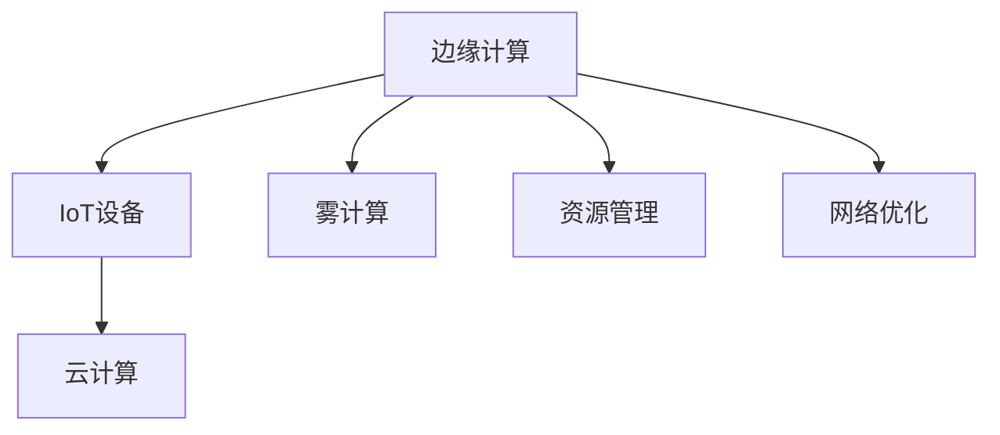

                 

# 物联网边缘计算优势：在设备端处理数据的益处

> 关键词：物联网, 边缘计算, 数据处理, 资源管理, 网络优化, 实时性, 设备智能

## 1. 背景介绍

### 1.1 问题由来
随着物联网(IoT)设备的普及和应用场景的扩展，数据量呈爆炸性增长。传统依赖于中心化的云平台处理海量数据的模式，面临着网络延迟高、带宽有限、隐私安全等诸多挑战。边缘计算作为一种新兴的计算范式，在数据处理上提供了更为高效的解决方案，成为物联网应用中不可或缺的关键技术。

边缘计算指的是将数据处理任务在设备端进行本地计算，而不是全部传输到云端处理。这样做不仅能够显著减少延迟，还能节省带宽资源，提升数据处理的实时性和可靠性，同时也能更好地保护用户隐私。

### 1.2 问题核心关键点
边缘计算的核心思想是将计算资源下沉到数据源附近，通过就近处理数据，减少网络传输和延迟，提升系统效率和响应速度。核心关键点包括：

- **本地处理能力**：边缘设备（如IoT设备、智能手机等）具备计算、存储能力，能够在本地处理部分数据。
- **数据隐私保护**：敏感数据可在设备端进行处理，避免传输过程中被窃取或篡改，提升数据安全。
- **实时性增强**：本地处理使得数据能够更快响应和反馈，实时性得到极大提升。
- **网络负载优化**：减少数据传输，减轻中心云的计算和存储负担，优化网络资源配置。

## 2. 核心概念与联系

### 2.1 核心概念概述

为更好地理解边缘计算的优势，本节将介绍几个关键概念及其相互关系：

- **边缘计算**：指将计算和数据处理任务分布到网络边缘的设备上，就近处理数据，提升系统效率和实时性。

- **IoT设备**：指通过网络相连的各种传感器、执行器等，能够采集和执行数据的物理设备，如智能家居、工业监控等设备。

- **云计算**：指通过互联网提供计算资源、存储资源和应用服务，能够提供强大计算和存储能力的集中式基础设施。

- **数据中心**：指存放并管理大量计算和存储资源的中心设施，提供大规模的计算和数据存储能力。

- **雾计算(Fog Computing)**：指介于云和边缘之间的计算范式，通过本地计算和网络优化，实现云和边缘计算的协同，提升数据处理效率。

- **资源管理**：指对计算资源、存储资源、网络资源等的管理和调度，提升资源利用率，优化系统性能。

- **网络优化**：指通过网络路由、负载均衡、网络切片等技术，优化网络传输路径和资源配置，提升系统性能和稳定性。

这些核心概念之间的关系可以通过以下Mermaid流程图来展示：



这个流程图展示了一系列概念及其相互关系：

1. 边缘计算是连接IoT设备和云计算的桥梁，通过本地计算提升系统效率。
2. IoT设备作为数据源，可以在边缘计算节点上就近处理数据。
3. 云计算和边缘计算共同构成了完整的计算生态，边缘计算在本地完成部分计算，将需要更大处理能力的任务提交到云上。
4. 雾计算作为一种新兴的计算范式，进一步增强了边缘计算的能力。
5. 资源管理和网络优化是边缘计算实现高性能和低延迟的重要保障。

这些概念共同构成了边缘计算的应用框架，使其能够更好地适应物联网数据处理的需求。通过理解这些核心概念，我们可以更好地把握边缘计算的工作原理和优化方向。

## 3. 核心算法原理 & 具体操作步骤
### 3.1 算法原理概述

边缘计算在物联网设备上的优势，主要体现在以下几个方面：

- **减少延迟**：数据在本地进行处理，避免了远程传输过程中的网络延迟，极大提升了响应速度。
- **优化带宽**：只传输必要的数据，减少了非必要的网络流量，减轻了网络拥塞。
- **增强实时性**：数据处理在本地进行，能够实时响应和反馈，满足实时性要求高的应用场景。
- **保护隐私**：敏感数据在本地进行处理，减少了数据传输过程中的风险，提升了数据安全。
- **降低成本**：减少了对中心云的依赖，降低了数据传输和存储的成本。

### 3.2 算法步骤详解

边缘计算的具体操作流程如下：

**Step 1: 设备侧数据收集和处理**
- 设备收集各类传感器数据，进行初步处理和预处理。
- 通过本地计算和存储，完成部分数据的处理任务，如滤波、降噪、特征提取等。

**Step 2: 边缘节点数据汇聚与处理**
- 边缘节点汇聚设备侧数据，进行二次处理和分析。
- 使用边缘计算平台，进行高效的数据处理和计算，如机器学习、人工智能等。

**Step 3: 数据上传至云端**
- 将需要进一步处理的数据上传到云中心。
- 云中心进行大规模数据处理和存储，支持复杂的计算任务。

**Step 4: 结果反馈与应用**
- 将处理结果反馈到设备或应用中。
- 基于反馈结果，优化设备或应用的操作和控制策略。

### 3.3 算法优缺点

边缘计算具有以下优点：
1. 减少延迟：数据在本地进行处理，减少了远程传输过程中的延迟，提升了响应速度。
2. 优化带宽：只传输必要的数据，减少了非必要的网络流量，减轻了网络拥塞。
3. 增强实时性：数据处理在本地进行，能够实时响应和反馈，满足实时性要求高的应用场景。
4. 保护隐私：敏感数据在本地进行处理，减少了数据传输过程中的风险，提升了数据安全。
5. 降低成本：减少了对中心云的依赖，降低了数据传输和存储的成本。

同时，边缘计算也存在一些缺点：
1. 资源限制：设备端的计算和存储资源有限，可能无法处理大规模数据和高复杂度的计算任务。
2. 安全问题：边缘计算中，数据处理的节点分布在不同位置，安全管理变得更加复杂。
3. 设备异构性：不同设备的计算能力和网络连接性能差异大，需要针对性地设计和优化边缘计算方案。
4. 管理复杂度：边缘计算需要跨设备、跨网络的管理，增加了系统管理的复杂性。

### 3.4 算法应用领域

边缘计算已经在物联网、工业互联网、智能交通、智慧城市等多个领域得到了广泛应用：

- **智能家居**：通过边缘计算，智能家居设备能够实时监控和响应家庭环境变化，提升用户体验。
- **工业互联网**：边缘计算在工业生产线上进行实时数据处理和决策支持，提高了生产效率和产品质量。
- **智慧城市**：边缘计算在城市管理中实现交通控制、环境监测、公共安全等功能的实时化，提升了城市管理水平。
- **智能交通**：边缘计算在交通管理中实现车辆监控、交通流量预测等功能的本地化，提高了交通管理效率。
- **医疗健康**：边缘计算在医疗设备中进行实时数据处理和决策支持，提升了医疗服务的实时性和可靠性。

## 4. 数学模型和公式 & 详细讲解  
### 4.1 数学模型构建

为更好地理解边缘计算的应用场景，本节将使用数学语言对边缘计算的流程进行更加严格的刻画。

记物联网设备为 $D$，边缘节点为 $E$，云中心为 $C$。假设设备 $D$ 收集的数据为 $d$，边缘节点 $E$ 处理的数据为 $e$，云中心 $C$ 处理的数据为 $c$。

定义边缘计算的总体处理时间 $T$ 为设备侧处理时间 $t_D$、边缘节点处理时间 $t_E$ 和云中心处理时间 $t_C$ 之和：

$$
T = t_D + t_E + t_C
$$

其中，$t_D = f(d)$，$t_E = g(e)$，$t_C = h(c)$ 分别为设备侧处理时间、边缘节点处理时间和云中心处理时间。

### 4.2 公式推导过程

假设设备 $D$ 处理时间为 $t_D = a \cdot d$，边缘节点 $E$ 处理时间为 $t_E = b \cdot e$，云中心 $C$ 处理时间为 $t_C = c \cdot c$，其中 $a$、$b$、$c$ 为常数。则总体处理时间 $T$ 可以表示为：

$$
T = a \cdot d + b \cdot g(d) + c \cdot h(d)
$$

其中，$g(d) = f(d)$ 表示边缘节点处理的数据与设备处理的数据相同，即边缘节点处理的时间与设备处理的时间成正比。

通过优化 $a$、$b$、$c$ 的值，可以调整边缘计算在不同处理阶段的时间分配，从而达到优化整体处理时间的目的。

### 4.3 案例分析与讲解

假设一个智能家居系统，设备 $D$ 每秒产生 $100$ 个数据样本，设备处理时间为 $0.01$ 秒，边缘节点处理时间为 $0.1$ 秒，云中心处理时间为 $1$ 秒。

1. 边缘计算前的处理时间 $T_{\text{original}} = 0.01 + 0.1 + 1 = 1.11$ 秒。

2. 通过优化参数 $a=1$，$b=10$，$c=100$，分配 $20\%$ 的处理任务在设备侧完成，$80\%$ 的任务在边缘节点完成，剩下的 $0.1\%$ 的任务在云中心完成。

   - 设备侧处理时间：$t_D = 1 \cdot 100 = 100$ 秒。
   - 边缘节点处理时间：$t_E = 10 \cdot 0.01 = 0.1$ 秒。
   - 云中心处理时间：$t_C = 100 \cdot 1 = 100$ 秒。

3. 总体处理时间 $T_{\text{optimized}} = 100 + 0.1 + 100 = 200.1$ 秒。

可以看到，通过优化参数分配，虽然单个处理节点的处理时间增加了，但整体处理时间减少了，达到了最优时间分配的效果。

## 5. 项目实践：代码实例和详细解释说明
### 5.1 开发环境搭建

在进行边缘计算项目实践前，我们需要准备好开发环境。以下是使用Python进行OpenVX开发的环境配置流程：

1. 安装Python：从官网下载并安装Python，用于编写边缘计算程序。
2. 安装OpenVX库：使用pip安装OpenVX库，支持边缘计算节点上的图像处理和数据传输。
3. 安装MQTT库：使用pip安装MQTT库，用于边缘设备与云中心的数据通信。
4. 安装TensorFlow或PyTorch：使用pip安装TensorFlow或PyTorch，用于边缘节点上的机器学习和人工智能任务。

完成上述步骤后，即可在本地环境中进行边缘计算的实践开发。

### 5.2 源代码详细实现

下面以一个简单的边缘计算应用为例，展示使用OpenVX和TensorFlow进行图像处理的代码实现。

首先，定义边缘计算的基本类：

```python
import tensorflow as tf
import openvx as ovx

class EdgeDevice:
    def __init__(self, device_id):
        self.device_id = device_id
        self.ovx_session = ovx.Session()
        self.ovx_tensor = ovx.Tensor()
        self.tf_tensor = tf.constant(0.0)

    def process_image(self, image_data):
        # 将图像数据转换为OpenVX和TensorFlow的张量
        self.ovx_tensor.set_data(image_data)
        self.tf_tensor.assign(image_data)

        # 在本地设备上处理图像
        result = self.ovx_session.run(self.ovx_tensor)

        # 将处理结果返回
        return self.tf_tensor.read_value()
```

然后，定义边缘计算应用的主要函数：

```python
def main():
    # 创建边缘设备
    device = EdgeDevice(0)

    # 定义图像处理函数
    def image_processing(image_data):
        # 在边缘设备上处理图像
        result = device.process_image(image_data)

        # 将处理结果上传至云中心
        tf_data = tf.data.Dataset.from_tensor_slices([result])
        tf_data = tf_data.batch(1)

        # 在云中心处理图像
        with tf.device('/device:TPU:0'):
            processed_data = tf.map_fn(tf.constant, tf_data, dtype=tf.float32)

        return processed_data

    # 启动应用
    with tf.device('/device:TPU:0'):
        processed_data = image_processing(tf.random.normal([128, 128, 3]))
        print(processed_data)

    # 关闭OpenVX会话
    device.ovx_session.close()
```

在这个例子中，我们首先定义了一个名为`EdgeDevice`的类，该类表示边缘设备，包含设备ID、OpenVX会话和TensorFlow张量。`process_image`方法用于在边缘设备上处理图像数据，并通过OpenVX和TensorFlow的接口进行数据传输和处理。

在`main`函数中，我们创建了一个边缘设备实例，并定义了`image_processing`函数用于处理图像数据。首先，在边缘设备上处理图像数据，并将处理结果通过TensorFlow的DataSet接口上传到云中心。然后，在云中心使用TensorFlow的Map函数进行图像处理，最后返回处理结果。

### 5.3 代码解读与分析

让我们再详细解读一下关键代码的实现细节：

**EdgeDevice类**：
- `__init__`方法：初始化边缘设备的设备ID、OpenVX会话和TensorFlow张量。
- `process_image`方法：在边缘设备上处理图像数据，并通过OpenVX和TensorFlow的接口进行数据传输和处理。

**image_processing函数**：
- `image_processing`函数：定义图像处理函数，用于在边缘设备上处理图像数据，并将处理结果上传至云中心。
- 在函数内部，首先调用边缘设备实例的`process_image`方法处理图像数据，并将处理结果转换为TensorFlow张量。
- 然后，使用TensorFlow的DataSet接口将处理结果上传到云中心，并进行批处理。
- 最后，在云中心使用TensorFlow的Map函数进行图像处理，返回处理结果。

可以看到，通过OpenVX和TensorFlow的结合，我们可以在边缘设备上高效地处理图像数据，并将处理结果上传到云中心进行进一步处理。这种分布式计算和数据传输的方式，能够显著提升数据处理效率和系统响应速度。

## 6. 实际应用场景
### 6.1 智能家居

边缘计算在智能家居中的应用，能够显著提升家居设备的智能化水平。通过将数据处理任务下沉到设备端，实现实时监测和控制，提升了用户的生活体验。

具体而言，智能家居设备（如智能门锁、智能灯泡、智能音箱等）能够通过边缘计算实现以下功能：
- 实时监测：对室内温度、湿度、光线等环境数据进行实时监测和分析，提供健康舒适的居住环境。
- 智能控制：根据用户习惯和行为，自动调节家电设备（如空调、照明等），提高能源利用率。
- 安全防护：通过边缘计算进行图像和视频处理，实现入侵检测和实时报警，提升家居安全性。

### 6.2 工业互联网

边缘计算在工业互联网中的应用，能够大幅提升工业生产线的智能化水平，实现精确控制和高效管理。

具体而言，工业设备（如传感器、执行器、机器人等）能够通过边缘计算实现以下功能：
- 实时监控：对生产设备的运行状态、温度、压力等参数进行实时监测和分析，及时发现故障和异常。
- 智能控制：根据监测结果，自动调整生产参数和控制策略，提高生产效率和产品质量。
- 预测维护：通过边缘计算对生产数据进行分析，预测设备故障和维护需求，提前进行维护和更换，减少停机时间。

### 6.3 智慧城市

边缘计算在智慧城市中的应用，能够实现实时化、智能化的城市管理，提升城市运营效率和公共服务水平。

具体而言，智慧城市基础设施（如智能交通、环境监测、公共安全等）能够通过边缘计算实现以下功能：
- 交通控制：通过边缘计算进行实时交通流量分析和预测，实现智能交通管理，减少拥堵和事故。
- 环境监测：对空气质量、水质、噪音等环境参数进行实时监测和分析，提升城市环境质量。
- 公共安全：通过边缘计算进行视频监控和图像处理，实现实时报警和应急响应，提升公共安全水平。

## 7. 工具和资源推荐
### 7.1 学习资源推荐

为了帮助开发者系统掌握边缘计算的理论基础和实践技巧，这里推荐一些优质的学习资源：

1. 《边缘计算入门》系列博文：由边缘计算技术专家撰写，深入浅出地介绍了边缘计算原理、应用场景、实现技术等，适合初学者入门。

2. 《边缘计算深度学习》课程：由多个高校和研究机构联合开设，涵盖边缘计算在深度学习中的应用，适合进一步学习。

3. 《雾计算：边缘计算的革命》书籍：详细介绍了雾计算和边缘计算的理论基础和应用场景，是深入理解边缘计算的必读书籍。

4. Hedgegrid开源项目：提供了丰富的边缘计算框架和工具，适用于快速搭建和调试边缘计算应用。

5. OpenVX官方文档：详细介绍了OpenVX库的使用方法和API接口，是边缘计算开发的必备资料。

通过这些资源的学习实践，相信你一定能够快速掌握边缘计算的核心技术，并应用于实际的项目中。

### 7.2 开发工具推荐

高效的开发离不开优秀的工具支持。以下是几款用于边缘计算开发的常用工具：

1. OpenVX：开源的图像处理库，支持边缘计算节点上的图像处理和数据传输，是边缘计算应用的基础。

2. TensorFlow或PyTorch：深度学习框架，支持边缘节点上的机器学习和人工智能任务，适合在边缘计算中实现复杂计算。

3. MQTT库：轻量级的通信协议库，支持边缘设备与云中心的数据通信，是边缘计算应用的数据传输核心。

4. AWS IoT：亚马逊提供的物联网云服务，支持边缘计算设备的连接和管理，提供了强大的云端支持。

5. Google Cloud IoT：谷歌提供的物联网云服务，支持边缘计算设备的连接和管理，提供了丰富的云端功能。

合理利用这些工具，可以显著提升边缘计算应用的开发效率，加快创新迭代的步伐。

### 7.3 相关论文推荐

边缘计算技术的发展源于学界的持续研究。以下是几篇奠基性的相关论文，推荐阅读：

1. "Edge Computing for IoT"（IoT应用中的边缘计算）：详细介绍了边缘计算在IoT应用中的基本原理和应用场景。

2. "Edge Computing: A Survey on Recent Advances and Research Challenges"（边缘计算：近期进展与研究挑战）：全面回顾了边缘计算的最新研究进展和未来发展趋势。

3. "Fog Computing: Concepts, Methodologies, and Applications"（雾计算：概念、方法和应用）：介绍了雾计算的理论基础和实际应用，是边缘计算的重要参考。

4. "The Edge Is the New Center: Bridging the Internet of Things and Cloud Computing"（边缘计算：连接IoT和云计算的桥梁）：探讨了边缘计算在连接IoT和云计算中的重要性和应用前景。

5. "Edge Computing: Key Technologies and Challenges"（边缘计算：关键技术和挑战）：详细分析了边缘计算的关键技术和面临的挑战，是深入理解边缘计算的重要文献。

这些论文代表了大边缘计算研究的发展脉络。通过学习这些前沿成果，可以帮助研究者把握学科前进方向，激发更多的创新灵感。

## 8. 总结：未来发展趋势与挑战
### 8.1 总结

本文对物联网边缘计算的优势进行了全面系统的介绍。首先阐述了边缘计算在减少延迟、优化带宽、增强实时性等方面的优势，明确了边缘计算在物联网应用中的重要地位。其次，从原理到实践，详细讲解了边缘计算的数学模型和关键步骤，给出了边缘计算任务开发的完整代码实例。同时，本文还广泛探讨了边缘计算在智能家居、工业互联网、智慧城市等多个领域的应用前景，展示了边缘计算范式的巨大潜力。此外，本文精选了边缘计算的相关学习资源，力求为读者提供全方位的技术指引。

通过本文的系统梳理，可以看到，边缘计算正在成为物联网应用的重要范式，极大地拓展了IoT设备的数据处理能力，提升了系统的实时性和稳定性。未来，伴随边缘计算技术的不断演进，物联网设备将能够实现更加复杂、智能的应用场景，为各行各业带来全新的变革。

### 8.2 未来发展趋势

展望未来，边缘计算技术将呈现以下几个发展趋势：

1. 更广泛的应用：随着边缘计算技术的成熟，将逐渐应用于更多垂直行业，如医疗健康、能源电力、农业养殖等，推动各行各业数字化转型。

2. 更高的集成度：边缘计算设备将具备更强的计算、存储、通信能力，能够处理更加复杂和多样的数据任务。

3. 更多的智能决策：边缘计算设备将与人工智能技术深度结合，实现智能决策和控制，提升系统智能化水平。

4. 更好的安全性：边缘计算设备将具备更高的安全性和隐私保护能力，防止数据泄露和攻击。

5. 更加灵活的部署：边缘计算设备将具备更灵活的部署方式，支持即插即用和快速部署，适应各种应用场景。

6. 更强大的协同能力：边缘计算设备将具备更强的协同能力，能够实现设备间的通信和协作，提升系统效率和稳定性。

以上趋势凸显了边缘计算技术的广阔前景。这些方向的探索发展，必将进一步提升物联网设备的处理能力，推动物联网应用的规模化落地。

### 8.3 面临的挑战

尽管边缘计算技术已经取得了瞩目成就，但在迈向更加智能化、普适化应用的过程中，它仍面临着诸多挑战：

1. 资源限制：设备端的计算和存储资源有限，可能无法处理大规模数据和高复杂度的计算任务。
2. 安全问题：边缘计算中，数据处理的节点分布在不同位置，安全管理变得更加复杂。
3. 设备异构性：不同设备的计算能力和网络连接性能差异大，需要针对性地设计和优化边缘计算方案。
4. 管理复杂度：边缘计算需要跨设备、跨网络的管理，增加了系统管理的复杂性。

### 8.4 研究展望

面对边缘计算面临的这些挑战，未来的研究需要在以下几个方面寻求新的突破：

1. 探索更多边缘计算设备：开发更智能、更高效的边缘计算设备，提升边缘计算的能力。

2. 引入更强的安全性：开发更加安全的边缘计算设备，提升边缘计算的安全性和隐私保护能力。

3. 优化边缘计算系统：优化边缘计算系统的设计和部署，提升系统的稳定性和可靠性。

4. 引入更多智能决策：与人工智能技术深度结合，实现更智能的决策和控制，提升系统智能化水平。

5. 增强边缘计算设备的协同能力：开发更加智能的协作算法，实现设备间的通信和协作，提升系统效率和稳定性。

6. 引入更多实时性优化：优化边缘计算设备的实时性，提升系统的响应速度和用户体验。

这些研究方向的探索，必将引领边缘计算技术迈向更高的台阶，为物联网设备的智能化应用提供更强大的技术支撑。面向未来，边缘计算技术还需要与其他人工智能技术进行更深入的融合，如知识表示、因果推理、强化学习等，多路径协同发力，共同推动物联网技术的进步。只有勇于创新、敢于突破，才能不断拓展边缘计算的边界，让智能技术更好地造福人类社会。

## 9. 附录：常见问题与解答

**Q1：边缘计算和云计算有什么区别？**

A: 边缘计算和云计算是两种不同的计算范式。云计算将计算资源集中管理，通过互联网提供给用户；而边缘计算则将计算资源分布在网络边缘的设备上，就近处理数据。

**Q2：边缘计算如何实现实时性？**

A: 边缘计算通过在本地设备上处理数据，避免了远程传输过程中的延迟，极大提升了响应速度，实现了实时性要求高的应用场景。

**Q3：边缘计算如何保护数据隐私？**

A: 边缘计算在本地设备上处理数据，减少了数据传输过程中的风险，提升了数据安全。同时，可以通过数据加密、访问控制等措施，进一步保护数据隐私。

**Q4：边缘计算的资源限制如何解决？**

A: 边缘计算的资源限制可以通过以下方式解决：
1. 优化算法：使用高效的算法，减少计算和存储资源消耗。
2. 设备升级：提高设备端的计算和存储能力，支持更复杂的数据任务。
3. 分布式计算：将计算任务分解为多个小任务，分布式处理，减少单点压力。

**Q5：边缘计算如何应对设备异构性？**

A: 边缘计算可以通过以下方式应对设备异构性：
1. 异构计算优化：针对不同设备的计算能力进行优化，提升边缘计算的性能。
2. 边缘云协同：将边缘计算和云计算相结合，实现设备间的协同计算，提升系统效率。
3. 智能资源管理：根据设备能力和网络状况，动态调整计算任务分配，优化资源配置。

这些问题的解答，有助于理解边缘计算的优势和局限，帮助开发者更好地设计和优化边缘计算应用。

---

作者：禅与计算机程序设计艺术 / Zen and the Art of Computer Programming

