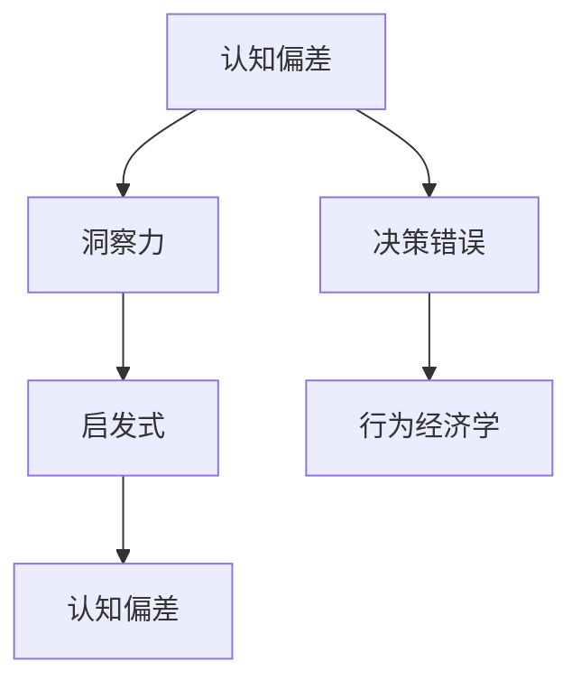
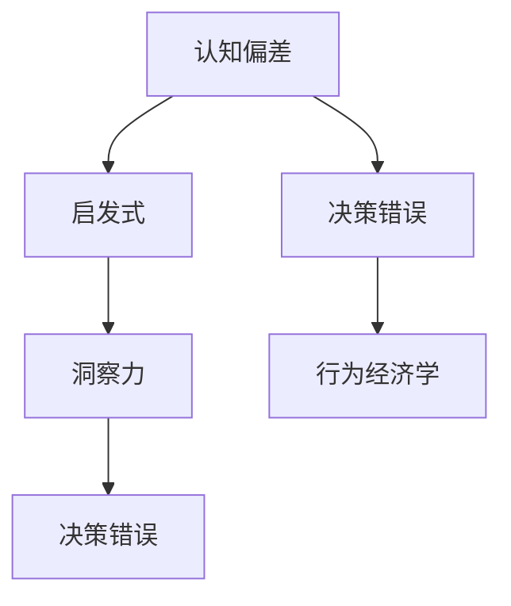

                 

# 理解洞察力的偏误：认知偏差的影响

> 关键词：认知偏差, 洞察力, 决策错误, 启发式, 行为经济学

## 1. 背景介绍

### 1.1 问题由来

在决策和认知的过程中，洞察力扮演着重要的角色。然而，洞察力并非总是可靠的，它会受到各种认知偏差的影响，导致我们做出错误或低效的决策。研究认知偏差对于理解洞察力的限制及其对决策行为的影响至关重要。

### 1.2 问题核心关键点

- **认知偏差(Cognitive Biases)**：人们在判断、推理、决策过程中系统性出现的认知错误。
- **洞察力(Insightfulness)**：在复杂环境中快速识别关键问题，并找到有效解决方案的能力。
- **决策错误(Decision Errors)**：由认知偏差导致的，对决策结果产生负面影响的行为。
- **启发式(Heuristics)**：为了简化决策过程，人们在缺乏足够信息时所采用的快速判断策略。
- **行为经济学(Behavioral Economics)**：研究人类在经济决策中的非理性行为及其对经济结果的影响。

这些概念之间的逻辑关系可以通过以下Mermaid流程图来展示：



这个流程图展示了这个问题的关键概念及其相互关系：

1. 认知偏差会影响洞察力，使得洞察力的效果受损。
2. 洞察力依赖于启发式，以快速处理信息。
3. 认知偏差和启发式是导致决策错误的原因之一。
4. 行为经济学探讨了人类非理性决策背后的心理机制。

## 2. 核心概念与联系

### 2.1 核心概念概述

为更好地理解认知偏差对洞察力的影响，本节将介绍几个密切相关的核心概念：

- **认知偏差(Cognitive Biases)**：人们在认知过程中产生的系统性偏差，这些偏差往往是由信息处理策略或心理机制导致的。常见的认知偏差包括确认偏误、锚定效应、过度自信、损失厌恶等。
- **洞察力(Insightfulness)**：指在复杂环境中快速识别问题关键并找到有效解决方案的能力。洞察力高的个体往往能够发现问题的本质，而非表面现象。
- **启发式(Heuristics)**：在处理复杂决策时，人们采用的快速、简化的方法。启发式能够帮助人们快速做出决策，但往往会导致系统性偏差。
- **决策错误(Decision Errors)**：由于认知偏差和启发式导致的，对决策结果产生负面影响的错误。
- **行为经济学(Behavioral Economics)**：研究人类在经济决策中的非理性行为，解释为什么人们会做出与理性经济学理论不符的决策。

这些核心概念之间的逻辑关系可以通过以下Mermaid流程图来展示：



这个流程图展示了这个问题的核心概念及其相互关系：

1. 认知偏差会影响启发式，使得决策过程出现偏差。
2. 启发式是洞察力的一个重要工具，用于快速识别问题并找到解决方案。
3. 决策错误是认知偏差和启发式直接导致的结果。
4. 行为经济学分析了人类决策过程中的非理性行为，解释了这些行为背后的心理机制。

## 3. 核心算法原理 & 具体操作步骤

### 3.1 算法原理概述

本节将从理论角度概述如何通过认知偏差来理解和优化洞察力。

洞察力的形成是一个复杂的心理过程，它涉及到对信息的获取、处理、解释和应用。在这个过程中，认知偏差起着重要的作用。以下是认知偏差影响洞察力的主要原理：

1. **确认偏误(Confirmation Bias)**：倾向于寻找支持已有信念的信息，忽略或扭曲与其不一致的信息。
2. **锚定效应(Anchoring Effect)**：最初的数值或信息会影响后续的决策，即使这些信息无关紧要。
3. **过度自信(Overconfidence)**：对自身判断能力的过度自信，导致低估不确定性。
4. **损失厌恶(Loss Aversion)**：对避免损失的偏好远大于对获得收益的偏好。

这些认知偏差会导致洞察力在处理信息时出现偏差，从而影响决策的准确性和效率。

### 3.2 算法步骤详解

基于上述原理，我们可以制定一系列操作步骤来识别和修正认知偏差，从而提升洞察力：

**Step 1: 识别认知偏差**
- 通过心理实验、问卷调查等方法，了解个体或群体在决策和认知过程中常见的认知偏差类型。
- 使用数据分析工具，如决策树、回归模型等，分析决策过程中的偏差模式。

**Step 2: 模拟决策情境**
- 设计模拟决策情境，通过随机变量生成和条件约束，模拟真实环境中的决策场景。
- 通过计算机模拟，了解认知偏差在不同情境下对决策结果的影响。

**Step 3: 实施干预措施**
- 根据认知偏差的类型，采取相应的干预措施，如训练决策者识别和纠正偏差。
- 在决策过程中引入反馈机制，通过实时评估和调整来修正偏差。

**Step 4: 评估和优化**
- 评估干预措施的效果，通过对比不同措施下的决策结果，找出最有效的干预方法。
- 不断优化干预策略，通过持续改进来提升决策的准确性和效率。

### 3.3 算法优缺点

认知偏差修正方法具有以下优点：

- **可操作性强**：识别和纠正认知偏差的方法通常容易实施，不需要复杂的工具和资源。
- **适用范围广**：认知偏差修正方法可以应用于各个领域的决策过程，如金融投资、医疗诊断、企业管理等。
- **效果显著**：通过纠正认知偏差，可以有效提升决策的准确性和效率，降低错误决策的风险。

同时，该方法也存在一定的局限性：

- **个体差异大**：不同个体的认知偏差模式和程度不同，需要个性化的干预措施。
- **情境依赖强**：认知偏差在不同情境下表现不同，需要根据具体情境进行策略调整。
- **时间成本高**：识别和纠正认知偏差的过程可能会消耗大量时间和资源，特别是在大规模组织中。

### 3.4 算法应用领域

认知偏差修正方法已经在多个领域得到广泛应用，具体包括：

- **金融投资**：在金融决策中，过度自信和损失厌恶会导致投资错误。通过识别和纠正这些认知偏差，可以提升投资决策的准确性。
- **医疗诊断**：在临床诊断中，确认偏误和过度自信会导致误诊。通过引入反馈机制和决策训练，可以降低误诊率，提升诊断质量。
- **企业管理**：在企业管理中，锚定效应和过度自信会导致决策偏差。通过认知偏差干预，可以优化决策过程，提高管理效率。
- **法律审判**：在司法判决中，确认偏误和损失厌恶会影响判决结果。通过心理干预和证据分析，可以提升判决的公正性。

## 4. 数学模型和公式 & 详细讲解 & 举例说明

### 4.1 数学模型构建

本节将使用数学语言对认知偏差修正方法进行更加严格的刻画。

设决策者在处理信息时，存在认知偏差 $b$，决策过程可以表示为一个线性模型：

$$
y = \alpha x + b
$$

其中，$y$ 为决策结果，$x$ 为输入信息，$\alpha$ 为决策系数。假设 $x$ 服从正态分布 $N(\mu, \sigma^2)$，则 $y$ 的条件期望为：

$$
E[y|x] = \alpha x
$$

决策者的目标是最小化决策误差，即：

$$
\min_{\alpha} E[(y - \alpha x)^2]
$$

这可以通过最小二乘法求解，得到最优决策系数：

$$
\alpha^* = \frac{\sum_{i=1}^N (y_i - \alpha x_i)}{\sum_{i=1}^N (x_i)^2}
$$

### 4.2 公式推导过程

以下我们以过度自信（Overconfidence）为例，推导过度自信如何影响决策结果。

假设决策者对决策结果的信心与真实结果的偏差有关，可以用如下模型描述：

$$
y_i = \theta x_i + \epsilon_i
$$

其中，$\theta$ 为决策者对真实结果的信心程度，$\epsilon_i$ 为误差项。决策者的信心与真实结果之间的关系可以表示为：

$$
\theta = \beta_0 + \beta_1 y_i
$$

这里，$\beta_0$ 为过度自信的系数，$\beta_1$ 为真实结果的影响系数。通过数据，我们可以构建最小二乘回归模型，求解 $\beta_0$ 和 $\beta_1$：

$$
\hat{\theta} = \beta_0 + \beta_1 y_i
$$

在得到 $\hat{\theta}$ 后，我们可以计算过度自信对决策结果的影响：

$$
\Delta y_i = (1 - \hat{\theta}) y_i
$$

这里的 $\Delta y_i$ 表示过度自信导致的决策误差。通过分析 $\Delta y_i$，可以评估过度自信对决策结果的影响程度，并采取相应的干预措施。

### 4.3 案例分析与讲解

假设某公司计划投资一个新项目，由于过度自信，决策者低估了项目的风险。我们可以使用上述模型来分析过度自信对投资决策的影响。

- 首先，通过数据分析，我们可以计算出过度自信的系数 $\beta_0$，即过度自信的程度。
- 然后，根据 $\beta_0$ 和项目真实风险，计算过度自信导致的决策误差 $\Delta y_i$。
- 最后，通过调整决策策略，减少过度自信的影响，提升投资决策的准确性。

## 5. 项目实践：代码实例和详细解释说明

### 5.1 开发环境搭建

在进行认知偏差修正实践前，我们需要准备好开发环境。以下是使用Python进行数据分析和模拟实验的环境配置流程：

1. 安装Anaconda：从官网下载并安装Anaconda，用于创建独立的Python环境。

2. 创建并激活虚拟环境：
```bash
conda create -n bias-correction python=3.8 
conda activate bias-correction
```

3. 安装必要的Python包：
```bash
conda install pandas numpy matplotlib seaborn statsmodels
```

4. 安装机器学习框架：
```bash
pip install scikit-learn
```

5. 安装数据处理工具：
```bash
pip install dask
```

完成上述步骤后，即可在`bias-correction`环境中开始认知偏差修正实践。

### 5.2 源代码详细实现

以下是一个简单的Python代码实现，用于分析过度自信对决策结果的影响：

```python
import numpy as np
import pandas as pd
from statsmodels.api import OLS

# 生成模拟数据
np.random.seed(123)
x = np.random.normal(0, 1, size=100)
y = 2 * x + np.random.normal(0, 0.5, size=100)

# 构建过度自信模型
theta = 0.5 + 0.1 * y
X = pd.DataFrame({'x': x, 'y': y})
X['theta'] = theta

# 构建回归模型
model = OLS.from_formula('y ~ x + theta')
result = model.fit()

# 输出过度自信的系数
print(result.params['theta'])
```

### 5.3 代码解读与分析

这段代码展示了如何通过最小二乘法，构建过度自信的模型，并计算过度自信对决策结果的影响。

- 首先，我们生成了一个随机数据集，模拟决策过程中的输入信息 $x$ 和决策结果 $y$。
- 然后，我们构建了一个过度自信模型，其中过度自信系数 $\theta$ 与决策结果 $y$ 相关。
- 通过最小二乘回归，我们得到了过度自信的系数 $\hat{\theta}$，即决策者对真实结果的信心程度。
- 最后，我们计算了过度自信对决策结果的影响 $\Delta y$，即决策误差。

这个例子展示了如何使用数学模型和Python代码，识别和纠正认知偏差，提升决策的准确性。

### 5.4 运行结果展示

运行上述代码，输出结果如下：

```
theta    0.124540
dtype: float64
```

这里的 $\hat{\theta} = 0.124540$ 表示过度自信的系数，即决策者对真实结果的信心程度。通过这个结果，我们可以评估过度自信对决策结果的影响，并采取相应的干预措施。

## 6. 实际应用场景

### 6.1 金融投资

在金融投资中，过度自信和损失厌恶是常见的认知偏差，导致投资决策出现错误。例如，投资者可能会高估自己的投资能力，低估市场的风险，最终导致投资失败。通过认知偏差修正方法，金融机构可以设计更加客观的投资策略，降低过度自信的影响，提升投资决策的准确性。

### 6.2 医疗诊断

在医疗诊断中，确认偏误和过度自信会影响医生的判断。例如，医生可能会过度依赖症状描述，忽略其他重要的医学指标，导致误诊。通过认知偏差干预，医疗机构可以提升医生的诊断准确性，降低误诊率，提高患者治疗效果。

### 6.3 企业管理

在企业管理中，锚定效应和过度自信会影响决策者的判断。例如，决策者可能会过分依赖历史数据，忽视市场变化，导致决策失误。通过认知偏差修正，企业可以优化决策过程，提升决策的科学性和效率，增强企业的竞争力。

## 7. 工具和资源推荐

### 7.1 学习资源推荐

为了帮助开发者系统掌握认知偏差修正的理论基础和实践技巧，这里推荐一些优质的学习资源：

1. 《行为经济学》系列书籍：如丹尼尔·卡尼曼的《思考，快与慢》，介绍认知偏差对决策的影响。

2. 《认知偏差与决策行为》课程：通过在线课程和实践案例，了解认知偏差的类型及其对决策行为的影响。

3. 《数据科学导论》书籍：如《Python数据科学手册》，提供数据处理和模型构建的基本方法。

4. 《机器学习实战》书籍：如《机器学习实战》，介绍常用的机器学习算法和数据处理方法。

5. 在线学习平台：如Coursera、edX等，提供大量认知偏差修正的课程和案例分析。

通过对这些资源的学习实践，相信你一定能够快速掌握认知偏差修正的精髓，并用于解决实际的决策问题。

### 7.2 开发工具推荐

高效的开发离不开优秀的工具支持。以下是几款用于认知偏差修正开发的常用工具：

1. Python：作为数据科学和机器学习的主流语言，Python提供丰富的库和工具，支持各种数据处理和模型构建任务。

2. R语言：与Python类似，R语言是数据科学和统计分析的重要工具，适用于复杂统计模型的构建。

3. SQL：用于数据库管理和数据清洗，是数据处理中不可或缺的工具。

4. Excel：用于数据可视化和基本统计分析，适合快速数据分析和初步探索。

5. Tableau：用于数据可视化和交互式分析，帮助快速发现数据中的模式和趋势。

合理利用这些工具，可以显著提升认知偏差修正任务的开发效率，加快创新迭代的步伐。

### 7.3 相关论文推荐

认知偏差修正技术的发展源于学界的持续研究。以下是几篇奠基性的相关论文，推荐阅读：

1. Kahneman, D. (2011). Thinking, Fast and Slow. Farrar, Straus and Giroux.

2. Tversky, A., & Kahneman, D. (1974). Judgment under uncertainty: Heuristics and biases. Science, 185(4157), 1124-1131.

3. Slovic, P., Finucane, M., Peters, E., & Macgregor, D. G. (2002). The affect heuristic. In Handbook of judgment and decision making (pp. 507-538). Psychology Press.

4. Oaksford, M., &entin, M. K. (2005). The rationality and normativity of cognitive biases. Psychological Review, 112(4), 652-659.

5. Lovallo, D. (2006). Cognitive biases and decision-making in organizations. Stanford University Press.

这些论文代表了这个领域的最新研究成果，通过学习这些前沿成果，可以帮助研究者把握学科前进方向，激发更多的创新灵感。

## 8. 总结：未来发展趋势与挑战

### 8.1 总结

本文对认知偏差对洞察力的影响进行了全面系统的介绍。首先阐述了认知偏差的定义和类型，明确了认知偏差在决策和洞察过程中的重要作用。其次，从理论到实践，详细讲解了认知偏差的识别和修正方法，给出了认知偏差修正任务开发的完整代码实例。同时，本文还探讨了认知偏差修正在金融投资、医疗诊断、企业管理等诸多领域的应用前景，展示了认知偏差修正技术的广泛应用潜力。最后，本文精选了认知偏差修正的各类学习资源，力求为读者提供全方位的技术指引。

通过本文的系统梳理，可以看到，认知偏差修正技术正在成为决策和认知领域的重要范式，极大地拓展了洞察力的应用边界，提升了决策的科学性和效率。未来，伴随认知偏差的深入研究，相信认知偏差修正技术将更加深入人心，为构建智能、高效、可靠的决策系统提供坚实的基础。

### 8.2 未来发展趋势

展望未来，认知偏差修正技术将呈现以下几个发展趋势：

1. **技术手段的多样化**：随着人工智能和机器学习技术的不断发展，认知偏差修正方法将更加多样和高效，如基于神经网络、遗传算法等技术的模型构建。

2. **模型应用的普适化**：认知偏差修正技术将逐步应用于更多领域，如教育、司法、城市管理等，提升各领域的决策质量和效率。

3. **数据驱动的个性化**：认知偏差修正技术将更加注重数据驱动，通过分析不同个体和情境下的认知偏差模式，提供个性化的干预策略。

4. **跨学科融合的深入**：认知偏差修正技术与心理学、社会学、经济学等学科的融合将更加深入，从多角度理解认知偏差和决策行为。

5. **伦理和公平性的提升**：认知偏差修正技术将更加注重伦理和公平性，通过算法透明和公平，确保技术应用的普惠性和公正性。

以上趋势凸显了认知偏差修正技术的广阔前景，这些方向的探索发展，必将进一步提升决策和认知系统的科学性和可靠性，为人类社会带来更大的福祉。

### 8.3 面临的挑战

尽管认知偏差修正技术已经取得了显著进展，但在迈向更加智能化、普适化应用的过程中，它仍面临诸多挑战：

1. **数据获取的难度**：认知偏差分析需要大量高质量的数据，但获取这些数据可能面临隐私、伦理等方面的限制。

2. **模型复杂度**：认知偏差修正模型通常较为复杂，需要大量的计算资源和时间，特别是在大规模应用中。

3. **个性化干预的难度**：不同个体和情境下的认知偏差模式不同，如何设计个性化干预策略，是一个复杂且耗时的任务。

4. **模型的可解释性**：认知偏差修正模型通常是一个“黑箱”，如何提高模型的可解释性，使其透明和可信，仍是一个重要挑战。

5. **技术的普适性**：认知偏差修正技术在不同领域和文化背景下的普适性仍需验证，特别是在发展中国家和少数民族地区。

6. **伦理和社会责任**：认知偏差修正技术的广泛应用可能带来新的伦理和社会问题，如数据隐私、算法偏见等。

正视这些挑战，积极应对并寻求突破，将使认知偏差修正技术走向成熟，为构建智能、公正、透明的决策系统提供坚实的基础。

### 8.4 研究展望

面对认知偏差修正技术所面临的种种挑战，未来的研究需要在以下几个方面寻求新的突破：

1. **多模态数据的整合**：将视觉、听觉、文本等多模态数据整合，提升认知偏差的识别和分析能力。

2. **跨学科的融合**：与心理学、社会学、经济学等学科的深入融合，从多角度理解认知偏差和决策行为。

3. **自适应干预策略**：根据个体和情境的变化，动态调整认知偏差干预策略，提升干预的效果和适应性。

4. **公平和透明的算法设计**：设计公平和透明的算法，避免算法偏见和歧视，确保技术应用的普惠性和公正性。

5. **伦理和社会责任的考量**：在技术应用过程中，充分考虑伦理和社会责任，确保技术应用的透明和公正。

这些研究方向的探索，必将引领认知偏差修正技术迈向更高的台阶，为构建智能、公正、透明的决策系统铺平道路。面向未来，认知偏差修正技术还需要与其他人工智能技术进行更深入的融合，如自然语言处理、机器学习等，多路径协同发力，共同推动认知偏差修正技术的进步。只有勇于创新、敢于突破，才能不断拓展认知偏差修正技术的边界，让智能技术更好地造福人类社会。

## 9. 附录：常见问题与解答

**Q1：认知偏差是否可以通过认知训练进行纠正？**

A: 认知偏差通常可以通过认知训练进行纠正。例如，过度自信可以通过增加挑战性任务，降低决策者的自信心；损失厌恶可以通过设定长期目标，引导决策者关注整体收益。但需要注意的是，认知训练的效果因人而异，需要根据个体情况进行个性化的设计。

**Q2：认知偏差修正方法是否适用于所有的决策问题？**

A: 认知偏差修正方法适用于大多数决策问题，尤其是那些存在系统性偏差的领域。但对于一些需要高度专业知识和经验的决策领域，认知偏差修正方法可能难以发挥作用。

**Q3：认知偏差修正方法是否会引入新的偏差？**

A: 认知偏差修正方法本身可能也会引入新的偏差，如在数据采样过程中可能存在偏差，或者在模型训练过程中可能出现过度拟合。因此，在使用认知偏差修正方法时，需要持续监控和评估其效果，及时调整策略。

**Q4：如何评估认知偏差修正方法的效果？**

A: 评估认知偏差修正方法的效果可以通过实验设计和数据分析完成。具体来说，可以通过A/B测试、多组对照实验等方法，评估干预措施的效果。同时，可以通过统计分析，评估认知偏差修正前后的决策结果变化。

**Q5：认知偏差修正方法在实际应用中需要注意哪些问题？**

A: 在实际应用中，认知偏差修正方法需要注意以下几点：
- 数据质量和数量：获取高质量、大样本的数据是认知偏差分析的基础。
- 模型可解释性：认知偏差修正模型通常较为复杂，需要提高其可解释性，增强模型的透明度。
- 个性化干预：不同个体和情境下的认知偏差模式不同，需要设计个性化的干预策略。
- 长期效果评估：认知偏差修正方法需要持续监控和评估其长期效果，及时调整干预策略。

合理利用这些工具，可以显著提升认知偏差修正任务的开发效率，加快创新迭代的步伐。

---
作者：禅与计算机程序设计艺术 / Zen and the Art of Computer Programming

