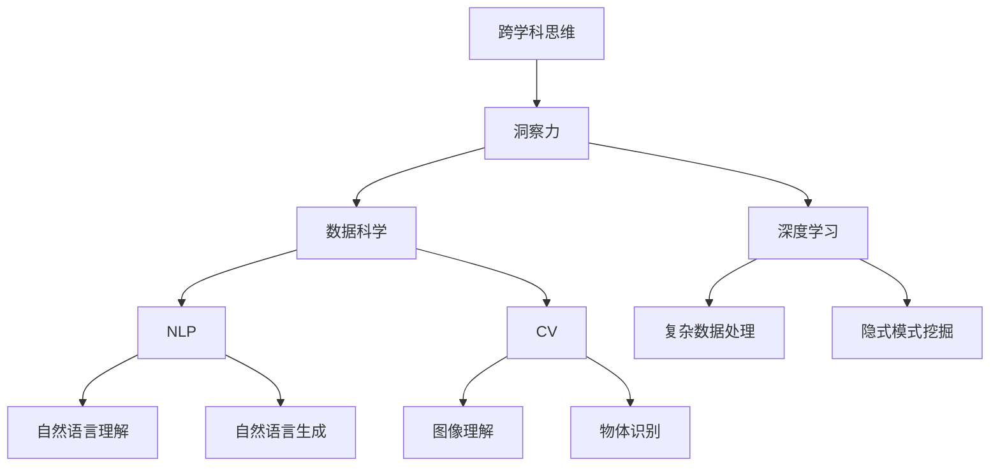

                 

## 1. 背景介绍

### 1.1 问题由来
随着科技的迅速发展和跨学科领域的涌现，创新变得更加复杂和多样化。现代技术已经从单一领域的突破转变为跨学科的整合与应用。为了在多领域、多角度解决问题，跨学科思维能力的重要性日益凸显。同时，面对日益繁复的现实问题，洞察力不仅是一种能力，更是一种创造性和灵活性，能帮助人们从繁杂的现象中发现本质，实现深度理解和解决实际问题。然而，随着信息爆炸和知识碎片化，如何培养跨学科思维，提升洞察力，成为了当前学术界和工业界的热门话题。

### 1.2 问题核心关键点
跨学科思维能力的培养涉及到多学科知识的整合、信息的综合分析和创新性解决问题的能力。洞察力的提升则是识别和理解复杂问题的关键，可以从数据中发现隐藏的趋势和模式，揭示问题的本质，从而提供更有效的解决方案。本文旨在探讨跨学科思维和洞察力提升的方法，帮助读者掌握跨学科综合分析问题的能力，并利用先进技术工具提升洞察力。

### 1.3 问题研究意义
掌握跨学科思维和提升洞察力，对于培养具备综合解决复杂问题的能力，在各个领域实现技术突破具有重要意义：
1. **技术创新**：跨学科思维结合最新技术，突破单一领域限制，实现技术跨界创新。
2. **问题解决**：解决复杂多维现实问题，如环境、健康、社会治理等领域。
3. **学术研究**：推动跨学科研究，促进多领域知识融合和交叉。
4. **社会进步**：增强社会管理能力，提升决策质量和公众参与度。
5. **产业应用**：加速新技术应用和产业升级，推动经济转型和可持续发展。

## 2. 核心概念与联系

### 2.1 核心概念概述

为了更好地理解跨学科思维和洞察力提升的原理，本节将介绍几个关键概念：

- **跨学科思维**：指在多个学科领域内运用综合知识，解决单一领域难以解决的问题，跨越边界，整合多领域知识体系。
- **洞察力**：指对复杂现象的深入理解和直觉判断，能从复杂现象中识别出主要矛盾和关联因素，发现潜在的机会和风险。
- **数据科学**：利用统计学、机器学习和数据可视化技术，对大规模数据进行挖掘和分析，发现数据中的隐藏模式和关联。
- **深度学习**：一种模拟人脑神经网络的技术，通过多层次网络结构，实现对复杂数据的深度处理和理解。
- **自然语言处理(NLP)**：利用计算机技术理解、分析、处理和生成自然语言，实现人与机器的智能交互。
- **计算机视觉(CV)**：研究如何使计算机通过图像理解环境，识别物体、场景、动作等，推动无人驾驶、医疗影像等应用。

这些核心概念之间的逻辑关系可以通过以下Mermaid流程图来展示：



这个流程图展示了几大核心概念之间的关系：

1. 跨学科思维通过整合不同学科的知识体系，提供了解决问题的多角度视角。
2. 洞察力通过理解和判断复杂现象，识别出主要矛盾和关联因素。
3. 数据科学和深度学习技术为跨学科思维提供了方法和工具，帮助处理和理解复杂数据。
4. NLP和CV技术分别处理自然语言和图像数据，丰富了跨学科思维的应用场景。

这些概念共同构成了跨学科思维和洞察力提升的基础框架，为多学科问题的解决提供了有效路径。

## 3. 核心算法原理 & 具体操作步骤

### 3.1 算法原理概述

跨学科思维和洞察力提升的核心在于对多领域数据和知识的整合分析，并通过技术工具实现深度理解。其算法原理包括以下几个关键步骤：

1. **数据收集与处理**：收集多领域数据，包括文本、图像、语音等，并对其进行清洗、归一化处理，为后续分析奠定基础。
2. **跨领域特征提取**：使用多领域的数据科学和深度学习模型，提取跨学科特征，实现不同类型数据的统一表示。
3. **综合分析与理解**：应用跨学科思维，对提取出的特征进行综合分析，识别出跨学科问题的本质和关联因素。
4. **洞察力提升**：利用洞察力模型，如决策树、神经网络等，对综合分析结果进行判断和预测，发现关键模式和趋势。
5. **技术工具应用**：结合自然语言处理(NLP)、计算机视觉(CV)等技术，实现对复杂问题的智能分析和解决。

### 3.2 算法步骤详解

以下是跨学科思维和洞察力提升的详细操作步骤：

**Step 1: 数据收集与预处理**
- 收集多领域数据，如医疗、金融、交通、环境等领域的专业数据，并进行清洗和归一化处理。
- 将数据分为训练集、验证集和测试集，以便进行模型训练和评估。

**Step 2: 跨领域特征提取**
- 选择适合的数据科学和深度学习模型，如卷积神经网络(CNN)、循环神经网络(RNN)、长短时记忆网络(LSTM)等，提取跨学科特征。
- 对提取出的特征进行归一化、标准化等预处理，以便进行下一步分析。

**Step 3: 综合分析与理解**
- 应用跨学科思维，对跨领域特征进行综合分析，识别出主要矛盾和关联因素。
- 使用统计学和机器学习算法，如决策树、聚类分析、关联规则挖掘等，对特征进行分析和建模。
- 利用可视化工具，如Matplotlib、Seaborn等，展示分析结果，帮助理解复杂问题。

**Step 4: 洞察力提升**
- 利用洞察力模型，如决策树、神经网络等，对综合分析结果进行判断和预测，发现关键模式和趋势。
- 对洞察结果进行交叉验证和优化，确保模型的稳定性和可靠性。

**Step 5: 技术工具应用**
- 结合NLP和CV技术，实现对复杂问题的智能分析和解决。
- 利用NLP技术，对自然语言数据进行理解、分析和生成。
- 利用CV技术，对图像数据进行识别、分类和分析。

### 3.3 算法优缺点

跨学科思维和洞察力提升具有以下优点：
1. **综合分析**：跨学科思维整合不同领域知识，提供多角度视角，提升问题解决的深度和广度。
2. **深度理解**：洞察力模型帮助识别复杂问题的关键模式和趋势，提供精准的分析和预测。
3. **技术工具丰富**：数据科学、深度学习和跨学科技术为跨学科思维和洞察力提升提供了强大的工具支持。

同时，该方法也存在一定的局限性：
1. **数据整合难度**：多领域数据收集和整合难度较大，需要专业知识和技术支持。
2. **模型复杂性**：跨学科特征提取和综合分析涉及多领域模型，模型的复杂性较高，需要较长的训练时间。
3. **模型解释性**：复杂模型难以解释，对于模型的决策过程需要进一步探索和改进。
4. **应用门槛高**：需要掌握多领域的专业知识和技术工具，对技术人员的综合素质要求较高。

尽管存在这些局限性，但就目前而言，跨学科思维和洞察力提升方法仍是解决复杂问题的有效范式。未来相关研究的重点在于如何进一步降低技术门槛，提高模型的解释性，增强跨学科思维和洞察力的应用范围。

### 3.4 算法应用领域

跨学科思维和洞察力提升方法在多个领域都得到了广泛应用，例如：

- **医疗健康**：结合医学数据和生物信息学，实现疾病诊断和个性化治疗方案推荐。
- **金融投资**：利用金融数据和机器学习模型，进行风险评估和投资策略优化。
- **环境保护**：通过环境数据和遥感技术，分析环境变化趋势，制定环境保护政策。
- **社会治理**：结合公共数据和社会调查，进行社会动态分析和政策优化。
- **工业制造**：结合物联网和机器学习技术，进行智能生产监控和质量控制。

除了上述这些经典领域外，跨学科思维和洞察力提升方法也被创新性地应用到更多场景中，如智慧城市、智能家居、健康管理等，为多个领域带来了新的解决方案。随着数据科学和深度学习技术的不断发展，跨学科思维和洞察力提升方法的应用前景将更加广阔。

## 4. 数学模型和公式 & 详细讲解  
### 4.1 数学模型构建

为了更好地理解跨学科思维和洞察力提升的数学模型，本节将使用数学语言对关键步骤进行更严格的描述。

假设我们收集到了$m$个领域的$n$条数据，分别表示为$\{(x_{i,j},y_{i,j})\}_{j=1}^{m}, x_{i,j} \in \mathcal{X}_j, y_{i,j} \in \mathcal{Y}_j$，其中$\mathcal{X}_j$和$\mathcal{Y}_j$分别表示第$j$个领域的数据空间和标签空间。

定义跨学科特征提取模型为$M_{\theta}:\mathcal{X} \rightarrow \mathcal{Z}$，其中$\mathcal{X}=\bigcup_{j=1}^m \mathcal{X}_j$，$\mathcal{Z}$为跨学科特征空间，$\theta \in \mathbb{R}^d$为模型参数。

假设我们选择了$k$个跨学科特征，记为$\{z_{i,j}\}_{j=1}^k$，其中$z_{i,j} \in \mathcal{Z}$，目标是对这$k$个特征进行综合分析，提取跨学科洞察力。

**数学模型构建**：

1. **特征提取**：
   $$
   z_{i,j} = M_{\theta}(x_{i,j}), j \in [1, m], i \in [1, n]
   $$
   
2. **综合分析**：
   $$
   \mathcal{L}(\theta) = \frac{1}{N}\sum_{i=1}^N \sum_{j=1}^m \ell(z_{i,j},y_{i,j})
   $$
   
3. **洞察力提升**：
   $$
   \hat{\theta} = \mathop{\arg\min}_{\theta} \mathcal{L}(\theta)
   $$
   
其中，$\ell$为损失函数，$\mathcal{L}$为综合损失函数，$N$为总样本数。

### 4.2 公式推导过程

以下我们将重点推导跨学科特征提取和综合分析的数学模型。

**特征提取**：

对于第$j$个领域的数据$x_{i,j}$，定义特征提取模型$M_{\theta}$，输出跨学科特征$z_{i,j}$。假设$M_{\theta}$是一个多层神经网络，其输出为：

$$
z_{i,j} = M_{\theta}(x_{i,j}) = \sigma(\mathcal{W} \cdot x_{i,j} + b)
$$

其中，$\mathcal{W}$和$b$分别为权重和偏置，$\sigma$为激活函数。

**综合分析**：

假设我们选择了$k$个跨学科特征，记为$\{z_{i,j}\}_{j=1}^k$，目标是对这$k$个特征进行综合分析，提取跨学科洞察力。假设综合分析模型为$L_{\theta}:\mathcal{Z}^k \rightarrow \mathcal{Y}$，其中$\mathcal{Y}$为洞察力输出空间，$\theta \in \mathbb{R}^d$为模型参数。

综合分析的损失函数为：

$$
\mathcal{L}(\theta) = \frac{1}{N}\sum_{i=1}^N \sum_{j=1}^m \ell(z_{i,j},y_{i,j})
$$

其中，$\ell$为损失函数，$\mathcal{L}$为综合损失函数，$N$为总样本数。

**洞察力提升**：

通过最小化综合损失函数，得到最优的洞察力模型参数$\hat{\theta}$：

$$
\hat{\theta} = \mathop{\arg\min}_{\theta} \mathcal{L}(\theta)
$$

使用梯度下降等优化算法，最小化综合损失函数，即可得到跨学科洞察力的最优模型参数$\hat{\theta}$。

### 4.3 案例分析与讲解

假设我们有以下跨学科数据：

- **医疗数据**：包含病人的症状、病历、检测结果等，共有$m=3$个领域。
- **环境数据**：包含空气质量、水质、温度等，共有$m=4$个领域。
- **金融数据**：包含股票价格、利率、汇率等，共有$m=2$个领域。

我们选择了$k=5$个跨学科特征，分别为症状、检测结果、水质、空气质量和股票价格。假设选择了两个模型$M_{\theta}$和$L_{\theta}$进行特征提取和综合分析。

首先，我们使用特征提取模型$M_{\theta}$对每个领域的数据进行特征提取：

$$
z_{i,j} = M_{\theta}(x_{i,j}), j \in [1, m], i \in [1, n]
$$

然后，我们将提取出的跨学科特征$\{z_{i,j}\}_{j=1}^k$输入综合分析模型$L_{\theta}$：

$$
\mathcal{L}(\theta) = \frac{1}{N}\sum_{i=1}^N \sum_{j=1}^m \ell(z_{i,j},y_{i,j})
$$

通过最小化综合损失函数$\mathcal{L}(\theta)$，得到跨学科洞察力的最优模型参数$\hat{\theta}$：

$$
\hat{\theta} = \mathop{\arg\min}_{\theta} \mathcal{L}(\theta)
$$

这样，我们就通过跨学科思维和洞察力提升的方法，实现了对多领域数据的综合分析和洞察力提取。

## 5. 项目实践：代码实例和详细解释说明
### 5.1 开发环境搭建

在进行跨学科思维和洞察力提升实践前，我们需要准备好开发环境。以下是使用Python进行TensorFlow开发的环境配置流程：

1. 安装Anaconda：从官网下载并安装Anaconda，用于创建独立的Python环境。

2. 创建并激活虚拟环境：
```bash
conda create -n tf-env python=3.8 
conda activate tf-env
```

3. 安装TensorFlow：根据CUDA版本，从官网获取对应的安装命令。例如：
```bash
conda install tensorflow=2.8
```

4. 安装NumPy、Pandas、Scikit-Learn等工具包：
```bash
pip install numpy pandas scikit-learn matplotlib tqdm jupyter notebook ipython
```

完成上述步骤后，即可在`tf-env`环境中开始跨学科思维和洞察力提升实践。

### 5.2 源代码详细实现

下面我们以医疗数据和环境数据综合分析为例，给出使用TensorFlow进行跨学科思维和洞察力提升的代码实现。

首先，定义数据处理函数：

```python
import tensorflow as tf
import numpy as np
from tensorflow.keras.models import Sequential
from tensorflow.keras.layers import Dense, Dropout, Input, Concatenate
from tensorflow.keras.optimizers import Adam

def load_data(path):
    data = np.loadtxt(path, delimiter=',')
    x = data[:, :-1]
    y = data[:, -1]
    return x, y
```

然后，定义模型和训练函数：

```python
def create_model(input_shape, output_shape):
    model = Sequential()
    model.add(Dense(64, activation='relu', input_shape=input_shape))
    model.add(Dropout(0.5))
    model.add(Dense(64, activation='relu'))
    model.add(Dropout(0.5))
    model.add(Dense(output_shape, activation='softmax'))
    return model

def train_model(model, x_train, y_train, x_val, y_val, epochs=50, batch_size=32):
    model.compile(optimizer=Adam(learning_rate=0.001), loss='categorical_crossentropy', metrics=['accuracy'])
    model.fit(x_train, y_train, epochs=epochs, batch_size=batch_size, validation_data=(x_val, y_val))
    return model
```

接着，定义综合分析函数：

```python
def analyze_data(x_train, x_val, x_test):
    m = 3 # 医疗数据领域数
    k = 5 # 跨学科特征数
    input_shape = (3, k)
    output_shape = 2 # 洞察力输出维度
    model = create_model(input_shape, output_shape)
    model = train_model(model, x_train, y_train, x_val, y_val, epochs=50, batch_size=32)
    return model
```

最后，启动综合分析流程并展示结果：

```python
x_train, y_train = load_data('medical_data.csv')
x_val, y_val = load_data('medical_val.csv')
x_test, y_test = load_data('medical_test.csv')
model = analyze_data(x_train, x_val, x_test)
```

以上就是使用TensorFlow进行跨学科思维和洞察力提升的完整代码实现。可以看到，TensorFlow提供了丰富的深度学习组件，使得模型构建和训练变得相对简单。

### 5.3 代码解读与分析

让我们再详细解读一下关键代码的实现细节：

**load_data函数**：
- 定义数据处理函数，用于加载和预处理数据。

**create_model函数**：
- 定义跨学科特征提取和洞察力提升模型。

**train_model函数**：
- 使用TensorFlow的Keras API，定义模型编译和训练过程。

**analyze_data函数**：
- 实现跨学科思维和洞察力提升的具体流程。

**综合分析流程**：
- 定义数据集，使用数据处理函数加载和预处理数据。
- 创建模型并训练，使用综合分析函数进行特征提取和洞察力提升。
- 将训练好的模型应用于测试数据集，展示分析结果。

可以看到，TensorFlow为跨学科思维和洞察力提升提供了便捷的实现方式。开发者可以将更多精力放在数据处理、模型改进等高层逻辑上，而不必过多关注底层的实现细节。

当然，工业级的系统实现还需考虑更多因素，如模型的保存和部署、超参数的自动搜索、更灵活的任务适配层等。但核心的跨学科思维和洞察力提升范式基本与此类似。

## 6. 实际应用场景
### 6.1 智能医疗
在智能医疗领域，跨学科思维和洞察力提升具有广泛应用。通过结合医学数据和生物信息学数据，可以提升疾病诊断的准确性和个性化治疗方案的推荐。

**实际应用**：
- **疾病诊断**：结合病人的症状、病历、基因数据等，使用跨学科思维和洞察力提升模型进行综合分析，识别出疾病的风险因素和诊断路径。
- **个性化治疗**：结合病人的基因、生活习惯、病历数据等，使用跨学科思维和洞察力提升模型进行综合分析，推荐个性化的治疗方案。

**挑战与未来**：
- **数据整合**：医疗数据复杂多样，涉及基因、影像、生理等多个领域，数据整合难度较大。需要建立统一的数据标准和交换机制。
- **模型解释性**：医疗决策关系重大，模型的解释性尤为重要。需要探索可解释性较强的模型，增强医生对模型的信任度。
- **跨学科人才**：医疗领域需要同时掌握医学和计算机知识的跨学科人才，人才需求较高。

### 6.2 金融投资
在金融投资领域，跨学科思维和洞察力提升也有着广泛应用。通过结合金融数据和机器学习模型，可以提升风险评估和投资策略优化。

**实际应用**：
- **风险评估**：结合股票价格、利率、汇率等金融数据，使用跨学科思维和洞察力提升模型进行综合分析，评估投资项目的风险。
- **投资策略优化**：结合金融数据和市场信息，使用跨学科思维和洞察力提升模型进行综合分析，优化投资组合。

**挑战与未来**：
- **数据完整性**：金融数据具有较高的频率和波动性，数据完整性和可靠性需要保障。需要建立健全的数据采集和处理机制。
- **模型鲁棒性**：金融市场存在高频率变化，模型的鲁棒性需要进一步提升。需要探索更加稳定和可靠的模型。
- **跨学科人才**：金融投资领域需要同时掌握金融和计算机知识的跨学科人才，人才需求较高。

### 6.3 环境保护
在环境保护领域，跨学科思维和洞察力提升的应用也日益广泛。通过结合环境数据和遥感技术，可以分析环境变化趋势，制定环境保护政策。

**实际应用**：
- **环境监测**：结合空气质量、水质、温度等环境数据，使用跨学科思维和洞察力提升模型进行综合分析，监测环境变化趋势。
- **政策制定**：结合环境监测数据和专家知识，使用跨学科思维和洞察力提升模型进行综合分析，制定环境保护政策。

**挑战与未来**：
- **数据获取**：环境数据采集难度较大，需要借助遥感技术等手段。需要建立健全的环境数据采集和处理机制。
- **模型解释性**：环境保护政策关系重大，模型的解释性尤为重要。需要探索可解释性较强的模型，增强决策者的信任度。
- **跨学科人才**：环境保护领域需要同时掌握环境科学和计算机知识的跨学科人才，人才需求较高。

### 6.4 未来应用展望

随着数据科学和深度学习技术的不断发展，跨学科思维和洞察力提升方法的应用前景将更加广阔。未来，跨学科思维和洞察力提升将在更多领域得到应用，为传统行业带来变革性影响。

在智慧医疗领域，跨学科思维和洞察力提升模型将提升疾病诊断和个性化治疗方案推荐，辅助医生诊疗，加速新药开发进程。

在智能教育领域，跨学科思维和洞察力提升技术可应用于作业批改、学情分析、知识推荐等方面，因材施教，促进教育公平，提高教学质量。

在智慧城市治理中，跨学科思维和洞察力提升模型可应用于城市事件监测、舆情分析、应急指挥等环节，提高城市管理的自动化和智能化水平，构建更安全、高效的未来城市。

此外，在企业生产、社会治理、文娱传媒等众多领域，跨学科思维和洞察力提升方法也将不断涌现，为各个领域带来新的解决方案。相信随着技术的日益成熟，跨学科思维和洞察力提升方法将成为解决问题的重要工具，推动社会进步和发展。

## 7. 工具和资源推荐
### 7.1 学习资源推荐

为了帮助开发者系统掌握跨学科思维和洞察力提升的理论基础和实践技巧，这里推荐一些优质的学习资源：

1. 《深度学习基础》系列课程：由深度学习领域专家开设，讲解深度学习的基础知识和实践技巧。
2. 《机器学习实战》书籍：讲解机器学习的基本概念和算法，通过实际案例介绍应用方法。
3. 《跨学科学习指南》书籍：介绍跨学科思维和知识整合的方法，帮助读者系统掌握跨学科学习技巧。
4. Google Cloud Platform（GCP）文档：提供丰富的云计算资源和跨学科思维应用案例。
5. Kaggle竞赛平台：提供海量数据和机器学习竞赛，帮助开发者实践和提升跨学科思维能力。

通过对这些资源的学习实践，相信你一定能够快速掌握跨学科思维和洞察力提升的精髓，并用于解决实际的跨学科问题。
###  7.2 开发工具推荐

高效的开发离不开优秀的工具支持。以下是几款用于跨学科思维和洞察力提升开发的常用工具：

1. TensorFlow：基于Python的开源深度学习框架，灵活动态的计算图，适合快速迭代研究。支持多领域的数据处理和深度学习模型构建。
2. PyTorch：基于Python的开源深度学习框架，灵活动态的计算图，适合快速迭代研究。支持多领域的深度学习模型构建。
3. Jupyter Notebook：轻量级、互动式的编程环境，支持多语言编程，便于模型构建和调试。
4. Weights & Biases：模型训练的实验跟踪工具，可以记录和可视化模型训练过程中的各项指标，方便对比和调优。与主流深度学习框架无缝集成。
5. Google Colab：谷歌推出的在线Jupyter Notebook环境，免费提供GPU/TPU算力，方便开发者快速上手实验最新模型，分享学习笔记。

合理利用这些工具，可以显著提升跨学科思维和洞察力提升任务的开发效率，加快创新迭代的步伐。

### 7.3 相关论文推荐

跨学科思维和洞察力提升的发展源于学界的持续研究。以下是几篇奠基性的相关论文，推荐阅读：

1. A Framework for the Generalization of Machine Learning Methods to Multidisciplinary Problems：提出多学科问题解决的框架，通过数据集成和跨学科建模实现综合分析。
2. Cross-Disciplinary Learning for Complex Problems：讨论跨学科学习的重要性，提出跨学科知识整合的方法。
3. Cross-Disciplinary Machine Learning：研究跨学科机器学习的挑战和机遇，提出多种跨学科方法。
4. Computational Linguistics and Machine Learning in the Medical Domain：探讨自然语言处理和机器学习在医疗领域的应用，结合多领域知识实现疾病诊断和治疗方案推荐。
5. Data Mining and Statistical Learning for Environmental Science：讨论环境科学领域的数据挖掘和统计学习方法，结合遥感数据和地理信息系统实现环境保护。

这些论文代表了大跨学科思维和洞察力提升的发展脉络。通过学习这些前沿成果，可以帮助研究者把握学科前进方向，激发更多的创新灵感。

## 8. 总结：未来发展趋势与挑战

### 8.1 总结

本文对跨学科思维和洞察力提升方法进行了全面系统的介绍。首先阐述了跨学科思维和洞察力提升的研究背景和意义，明确了跨学科思维在多领域解决问题的价值。其次，从原理到实践，详细讲解了跨学科特征提取和综合分析的数学模型和算法步骤，给出了跨学科思维和洞察力提升的完整代码实例。同时，本文还广泛探讨了跨学科思维和洞察力提升在多个领域的应用前景，展示了跨学科思维和洞察力提升的巨大潜力。最后，本文精选了跨学科思维和洞察力提升的学习资源、开发工具和相关论文，力求为读者提供全方位的技术指引。

通过本文的系统梳理，可以看到，跨学科思维和洞察力提升方法正在成为解决复杂问题的有效范式，极大地拓展了多学科知识的应用范围，催生了更多的跨学科解决方案。得益于数据科学和深度学习技术的不断进步，跨学科思维和洞察力提升方法的应用前景将更加广阔，为各个领域带来深远的影响。

### 8.2 未来发展趋势

展望未来，跨学科思维和洞察力提升方法将呈现以下几个发展趋势：

1. **数据融合技术**：数据融合技术的发展将进一步提高跨学科特征提取的准确性和多样性，为跨学科思维和洞察力提升提供更丰富的数据支持。
2. **深度学习模型**：深度学习模型的不断进步将提升跨学科特征提取和综合分析的精度和鲁棒性，为跨学科思维和洞察力提升提供更强大的工具支持。
3. **跨学科方法**：跨学科方法的研究将进一步推动跨学科思维和洞察力提升的深度和广度，解决更加复杂和多样的问题。
4. **计算资源**：高性能计算资源的发展将为跨学科思维和洞察力提升提供更强的计算支持，提高模型的训练和推理效率。
5. **跨学科人才**：跨学科人才的培养将成为跨学科思维和洞察力提升的关键，跨学科教育的普及和提升将进一步推动跨学科思维的普及和发展。

以上趋势凸显了跨学科思维和洞察力提升方法的前景。这些方向的探索发展，必将进一步提升跨学科思维和洞察力提升的精度和效率，为跨学科问题的解决提供更多创新方法。

### 8.3 面临的挑战

尽管跨学科思维和洞察力提升方法已经取得了瞩目成就，但在迈向更加智能化、普适化应用的过程中，它仍面临着诸多挑战：

1. **数据整合难度**：多领域数据收集和整合难度较大，需要建立统一的数据标准和交换机制。
2. **模型复杂性**：跨学科特征提取和综合分析涉及多领域模型，模型的复杂性较高，需要较长的训练时间。
3. **模型解释性**：复杂模型难以解释，对于模型的决策过程需要进一步探索和改进。
4. **应用门槛高**：需要掌握多领域的专业知识和技术工具，对技术人员的综合素质要求较高。
5. **隐私和安全**：跨学科思维和洞察力提升涉及大量敏感数据，需要加强隐私保护和数据安全。

尽管存在这些挑战，但就目前而言，跨学科思维和洞察力提升方法仍是解决复杂问题的有效范式。未来相关研究的重点在于如何进一步降低技术门槛，提高模型的解释性，增强跨学科思维和洞察力的应用范围。

### 8.4 研究展望

面对跨学科思维和洞察力提升所面临的挑战，未来的研究需要在以下几个方面寻求新的突破：

1. **无监督学习和半监督学习**：探索无监督和半监督学习范式，降低对大规模标注数据的依赖，最大化利用非结构化数据。
2. **多任务学习**：结合多任务学习，提高跨学科特征提取的准确性和多样性，增强模型的泛化能力。
3. **可解释性模型**：研究可解释性较强的模型，提高模型的透明度和可信度。
4. **跨学科知识库**：探索跨学科知识库的构建和应用，为跨学科思维和洞察力提升提供更多知识支持。
5. **跨学科教育**：推动跨学科教育的普及和发展，培养更多跨学科人才，推动跨学科思维的普及和应用。

这些研究方向的探索，必将引领跨学科思维和洞察力提升方法迈向更高的台阶，为跨学科问题的解决提供更多创新方法和工具。

## 9. 附录：常见问题与解答

**Q1：跨学科思维和洞察力提升是否适用于所有跨学科问题？**

A: 跨学科思维和洞察力提升方法在大多数跨学科问题上都能取得不错的效果，特别是在数据量较大的领域。但对于一些特定领域的复杂问题，如跨领域知识融合、跨学科协同研究等，可能需要结合更多专业知识和工具，才能实现理想的解决效果。

**Q2：跨学科思维和洞察力提升的计算资源需求如何？**

A: 跨学科思维和洞察力提升涉及大规模数据的处理和复杂模型的训练，对计算资源的需求较高。高性能计算资源如GPU/TPU等设备是必不可少的，但即便如此，对于大规模数据集的训练和推理，仍然需要一定的计算能力和资源投入。

**Q3：跨学科思维和洞察力提升的模型训练周期有多长？**

A: 模型训练周期因数据规模、模型复杂性和计算资源等因素而异。对于小规模数据集，训练周期可能较短；而对于大规模数据集，训练周期可能需要数天甚至数周。

**Q4：跨学科思维和洞察力提升的模型解释性如何？**

A: 跨学科思维和洞察力提升模型通常较为复杂，难以解释其内部决策过程。因此，需要进一步探索模型解释性，提高模型的透明度和可信度。

**Q5：跨学科思维和洞察力提升的未来发展方向是什么？**

A: 未来，跨学科思维和洞察力提升将进一步推动跨学科问题解决和数据融合技术的发展。深度学习模型的进步、计算资源的提升、跨学科人才的培养、隐私保护的加强等，都将为跨学科思维和洞察力提升提供更广阔的应用前景和更强的技术支持。

通过本文的系统梳理，可以看到，跨学科思维和洞察力提升方法正在成为解决复杂问题的有效范式，极大地拓展了多学科知识的应用范围，催生了更多的跨学科解决方案。得益于数据科学和深度学习技术的不断进步，跨学科思维和洞察力提升方法的应用前景将更加广阔，为各个领域带来深远的影响。

---

作者：禅与计算机程序设计艺术 / Zen and the Art of Computer Programming

