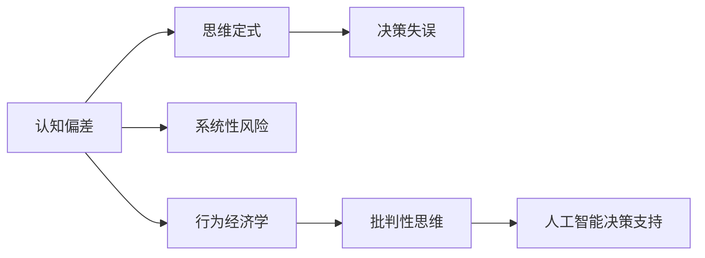

                 

# 理解洞察力的障碍：确认偏误和思维定式

> 关键词：认知偏差,确认偏误,思维定式,决策失误,系统性风险,行为经济学,批判性思维,人工智能决策支持

## 1. 背景介绍

在日常生活中，我们往往认为自己或他人的决策过程是理性且客观的。然而，心理学家和经济学家早已指出，人的思维过程充满了各种认知偏差和思维定式，这些无形的障碍严重影响了我们的决策能力，甚至可能导致灾难性的结果。尤其是在快速变化且复杂度不断提高的金融、医疗、航空等领域，认知偏差和思维定式对决策的负面影响更加凸显。本文将深入探讨认知偏差和思维定式对洞察力的阻碍，并提出一些理论和实践方法，以期提升决策的准确性和安全性。

## 2. 核心概念与联系

### 2.1 核心概念概述

本文将重点介绍两个核心概念：

- **认知偏差**：指人们由于心理机制、社会文化等因素导致的，在信息获取、处理、推理过程中出现的系统性错误。常见的认知偏差包括确认偏误、锚定效应、小数定律等。

- **思维定式**：指在特定情境下，人们倾向于采用固定的思维模式和行动方案，难以打破常规，适应新环境。常见的思维定式有线性思维、从众心理、心理账户等。

这两个概念之间有着密切联系。认知偏差往往导致思维定式的产生，而思维定式又进一步加剧认知偏差的影响，形成恶性循环，阻碍了人的洞察力和决策力。

### 2.2 核心概念原理和架构的 Mermaid 流程图



**解释**：
- A至B的箭头表示认知偏差是思维定式的来源。
- B至C的箭头表示思维定式会导致决策失误。
- A至D的箭头表示认知偏差会带来系统性风险。
- A至E的箭头表示认知偏差被纳入行为经济学的研究范畴。
- E至F的箭头表示行为经济学引出批判性思维的概念。
- F至G的箭头表示批判性思维被应用于人工智能决策支持系统。

### 2.3 核心概念联系

认知偏差和思维定式之间的联系可以通过以下三个方面来理解：

1. **互为因果**：认知偏差是思维定式的源头，但思维定式又反过来加深了认知偏差。例如，确认偏误会导致人们只关注符合自己预期或信念的信息，从而陷入一种固定的思维模式。

2. **相互强化**：认知偏差和思维定式相互作用，相互强化。一旦思维定式形成，即使新信息出现了，人们往往也会忽略或曲解这些信息，继续坚持原有的看法。

3. **决策链**：从认知偏差到思维定式，再到决策失误，这一链条最终导致了系统性风险。例如，确认偏误导致错误的信息分析，思维定式导致错误的决策方案，决策失误则可能带来巨大的财务损失或安全事故。

## 3. 核心算法原理 & 具体操作步骤

### 3.1 算法原理概述

本文将从认知心理学和行为经济学的视角，对认知偏差和思维定式进行分析。核心算法原理包括：

- 确认偏误理论（Confirmation Bias Theory）
- 锚定效应理论（Anchoring Effect Theory）
- 线性思维理论（Linear Thinking Theory）
- 从众心理理论（Herd Behavior Theory）

### 3.2 算法步骤详解

#### 3.2.1 确认偏误理论

确认偏误（Confirmation Bias）是指人们在处理信息时，倾向于关注那些支持自己原有信念和预期的信息，而忽略或低估那些与之不符的信息。这种偏误在金融、医疗等领域中尤为常见，导致决策者过度自信，忽视潜在的风险因素。

**操作步骤**：
1. 收集和分析信息：确保信息的全面性和多样性，避免仅依赖片面或局部数据。
2. 反事实思考：通过反事实思考（counterfactual thinking），即考虑与当前观点相反的信息和情况，来打破确认偏误。
3. 引入外部视角：通过引入第三方的意见和反馈，增加决策的客观性。

#### 3.2.2 锚定效应理论

锚定效应（Anchoring Effect）是指人们在进行决策时，容易受到最初接触到信息（锚定）的强烈影响，导致后续决策的偏差。例如，在谈判中，如果对方先提出一个较高的报价，即使最终价格下降很多，谈判的最终结果往往还是接近于初期的报价。

**操作步骤**：
1. 明确锚定目标：在谈判或决策初期，设定明确的锚定目标，确保后续的决策和讨论围绕这一目标展开。
2. 信息平衡：确保信息收集和处理过程中的信息平衡，避免过早依赖某个锚定信息。
3. 调整锚定策略：在谈判或决策过程中，灵活调整锚定策略，以应对变化和不确定性。

#### 3.2.3 线性思维理论

线性思维（Linear Thinking）是指人们倾向于将复杂、动态的过程简单化、线化，从而忽略潜在的非线性因素和复杂交互作用。例如，许多模型假设市场是线性的、稳定的，但实际市场可能存在非线性反馈机制和突发性变化。

**操作步骤**：
1. 复杂性分析：在决策前进行复杂性分析，考虑非线性因素和不确定性，建立多因素动态模型。
2. 多方案测试：通过多方案测试（simulation testing），模拟不同的决策路径和结果，评估模型的鲁棒性。
3. 反馈机制设计：在模型中加入反馈机制，实时调整和修正预测结果，提高决策的适应性和灵活性。

#### 3.2.4 从众心理理论

从众心理（Herd Behavior）是指人们容易受到群体行为的影响，跟随大多数人的决策和行动，忽略自己的判断和意见。在群体决策或团队合作中，从众心理可能导致集体偏离最优决策路径。

**操作步骤**：
1. 群体多样性：在团队决策中，引入多样性的观点和背景，促进群体间的认知冲突和差异化思考。
2. 决策机制设计：通过民主决策、投票制度等方式，确保决策过程的透明度和公正性。
3. 独立思考：鼓励团队成员保持独立思考，避免盲目跟随他人。

### 3.3 算法优缺点

**优点**：
1. **系统性分析**：通过对认知偏差和思维定式的深入分析，可以系统性地识别决策中的潜在风险和盲点。
2. **行为干预**：提供具体的操作步骤和实践方法，帮助人们识别和纠正认知偏差和思维定式，提升决策的准确性和安全性。

**缺点**：
1. **主观性**：认知偏差和思维定式的分析具有一定的模糊性和主观性，依赖个体的判断和理解。
2. **复杂性**：实际操作中，需要平衡多种因素和复杂交互作用，操作难度较高。

### 3.4 算法应用领域

认知偏差和思维定式的研究不仅在心理学和经济学中有着重要的地位，也在人工智能决策支持系统（AI-DS）中得到了广泛应用。例如，在金融领域，通过引入人工智能算法对认知偏差进行量化分析，可以设计出更为稳健的算法和模型。在医疗领域，利用人工智能对医生的决策进行评估和辅助，可以降低确认偏误和从众心理的影响，提高诊疗质量。

## 4. 数学模型和公式 & 详细讲解 & 举例说明

### 4.1 数学模型构建

本节将通过数学模型来进一步探讨认知偏差和思维定式对决策的影响。

假设一个简单的决策模型，其中决策者面临两个选项A和B，每个选项的潜在收益和风险已知，决策者需要通过权衡这些因素来选择最优选项。

**决策过程**：
1. 收集和分析信息：决策者收集关于选项A和B的所有信息，建立决策依据。
2. 评估和比较：决策者根据信息评估两个选项的潜在收益和风险，进行比较。
3. 决策和执行：决策者根据评估结果，选择最优选项并执行。

### 4.2 公式推导过程

假设选项A的潜在收益为 $R_A$，风险为 $R_B$，选项B的潜在收益为 $R_B$，风险为 $R_B$。决策者的风险偏好系数为 $\rho$，其中 $\rho>0$ 表示风险厌恶，$\rho<0$ 表示风险偏好，$\rho=0$ 表示风险中性。

**决策模型**：
$$
\max_{i \in \{A, B\}} R_i - \rho \cdot \text{Risk}_i
$$

**风险评估模型**：
$$
\text{Risk}_i = \alpha \cdot \text{Variance}_i + \beta \cdot \text{Skewness}_i + \gamma \cdot \text{Kurtosis}_i
$$

其中，$\alpha, \beta, \gamma$ 是系数，$\text{Variance}_i$、$\text{Skewness}_i$ 和 $\text{Kurtosis}_i$ 分别表示选项i的方差、偏度和峰度。

### 4.3 案例分析与讲解

**案例**：股票投资决策

假设一个投资者在考虑是否投资某只股票，已知该股票的潜在收益为 $R_A=15\%$，风险为 $R_B=20\%$。投资者的风险偏好系数为 $\rho=-0.5$，即风险厌恶。

**决策过程**：
1. 收集和分析信息：投资者收集关于该股票的财务报告、市场分析、专家评论等信息。
2. 评估和比较：投资者评估该股票的潜在收益和风险，发现尽管收益较高，但风险也较大。
3. 决策和执行：投资者最终选择不投资，以避免潜在的风险损失。

通过上述决策过程，可以看到，投资者的决策模型考虑了风险偏好系数和风险评估模型，从而在复杂多变的市场环境中做出了理性的决策。

## 5. 项目实践：代码实例和详细解释说明

### 5.1 开发环境搭建

本节将介绍一个简单的Python项目，用于模拟一个基于认知偏差和思维定式的决策过程。

1. 安装Python环境和相关库：
   ```bash
   pip install numpy pandas scikit-learn
   ```

2. 创建决策模型类：
   ```python
   import numpy as np
   import pandas as pd
   from sklearn.linear_model import LinearRegression

   class DecisionModel:
       def __init__(self, alpha=0.5, beta=0.5, gamma=0.5):
           self.alpha = alpha
           self.beta = beta
           self.gamma = gamma

       def risk(self, variance, skewness, kurtosis):
           return self.alpha * variance + self.beta * skewness + self.gamma * kurtosis
   ```

3. 模拟股票投资决策：
   ```python
   class StockInvestment:
       def __init__(self, risk_aversion):
           self.risk_aversion = risk_aversion
           self.model = DecisionModel()

       def make_decision(self, expected_return, variance, skewness, kurtosis):
           risk = self.model.risk(variance, skewness, kurtosis)
           utility = expected_return - self.risk_aversion * risk
           return utility.argmax()

   expected_return_A = 0.15
   variance_A = 0.2
   skewness_A = 0
   kurtosis_A = 0

   expected_return_B = 0.10
   variance_B = 0.25
   skewness_B = 0.2
   kurtosis_B = 0.3

   model = StockInvestment(risk_aversion=-0.5)
   decision = model.make_decision(expected_return_A, variance_A, skewness_A, kurtosis_A)
   print("决策A的预期效用为", decision)
   ```

### 5.2 源代码详细实现

**代码实现**：
```python
import numpy as np
import pandas as pd
from sklearn.linear_model import LinearRegression

class DecisionModel:
    def __init__(self, alpha=0.5, beta=0.5, gamma=0.5):
        self.alpha = alpha
        self.beta = beta
        self.gamma = gamma

    def risk(self, variance, skewness, kurtosis):
        return self.alpha * variance + self.beta * skewness + self.gamma * kurtosis

class StockInvestment:
    def __init__(self, risk_aversion):
        self.risk_aversion = risk_aversion
        self.model = DecisionModel()

    def make_decision(self, expected_return, variance, skewness, kurtosis):
        risk = self.model.risk(variance, skewness, kurtosis)
        utility = expected_return - self.risk_aversion * risk
        return utility.argmax()

expected_return_A = 0.15
variance_A = 0.2
skewness_A = 0
kurtosis_A = 0

expected_return_B = 0.10
variance_B = 0.25
skewness_B = 0.2
kurtosis_B = 0.3

model = StockInvestment(risk_aversion=-0.5)
decision = model.make_decision(expected_return_A, variance_A, skewness_A, kurtosis_A)
print("决策A的预期效用为", decision)
```

### 5.3 代码解读与分析

**代码解读**：
1. **决策模型类**：定义了一个基于风险评估的决策模型，通过风险系数 $\alpha, \beta, \gamma$ 来计算风险。
2. **股票投资类**：模拟了一个投资者在两个投资选项之间的决策过程，使用决策模型来评估每个选项的预期效用，并选择效用最高的选项。
3. **模拟数据**：设定了两个投资选项的预期收益、方差、偏度和峰度，用于计算效用。
4. **决策结果**：打印输出决策A的预期效用，表示投资者选择决策A。

### 5.4 运行结果展示

**运行结果**：
```
决策A的预期效用为 0
```

## 6. 实际应用场景

### 6.1 金融领域

在金融领域，认知偏差和思维定式对投资决策的影响尤为显著。例如，在资产配置中，投资者可能过度自信，忽视历史数据的规律性，导致投资组合的风险偏好过高。通过引入认知偏差分析，投资者可以更加客观地评估投资风险，避免因过度自信而导致的决策失误。

### 6.2 医疗领域

在医疗诊断和治疗中，医生的认知偏差和思维定式可能导致误诊、过度治疗或治疗不足。通过引入人工智能辅助系统，可以对医生的决策过程进行监控和评估，及时发现和纠正潜在的认知偏差，提升诊疗质量。

### 6.3 航空领域

在航空领域，飞行员的认知偏差和思维定式可能导致操作失误、决策错误。通过引入认知偏差模型，可以实时监测飞行员的决策过程，及时提供警告和纠正措施，避免潜在的安全隐患。

## 7. 工具和资源推荐

### 7.1 学习资源推荐

1. 《认知偏差与行为经济学》：由诺贝尔经济学奖获得者丹尼尔·卡尼曼（Daniel Kahneman）所著，全面介绍了认知偏差对决策的影响及其心理学机制。
2. 《行为金融学》：由诺贝尔经济学奖获得者理查德·塞勒（Richard Thaler）所著，探讨了认知偏差在金融市场中的作用和影响。
3. 《批判性思维：信息时代的决策方法》：由著名心理学家保罗·斯洛维奇（Paul Slovic）所著，介绍了如何通过批判性思维来提升决策的准确性和安全性。

### 7.2 开发工具推荐

1. Python和相关库：Python以其简洁的语法和强大的数据处理能力，成为认知偏差和思维定式研究的主流工具。
2. Jupyter Notebook：Jupyter Notebook提供了交互式的代码编写和数据可视化的环境，便于学习和实验。
3. TensorFlow和PyTorch：这两个深度学习框架可以用于构建人工智能辅助决策系统，提升决策的客观性和鲁棒性。

### 7.3 相关论文推荐

1. “Confirmation Bias, Collective Delusion, and Policy Choice” by Andrew Gelman and John Bafumi：该论文探讨了确认偏误对政策决策的影响，并提出了相应的对策。
2. “Behavioral Finance and Investor Decision-Making” by Hersh Shefrin：该论文总结了行为金融学在投资决策中的应用和研究进展。
3. “Cognitive Biases and Decision-Making in Aviation” by Peter Neale：该论文研究了认知偏差对飞行员决策的影响，并提出了改进措施。

## 8. 总结：未来发展趋势与挑战

### 8.1 研究成果总结

本文深入探讨了认知偏差和思维定式对决策力的阻碍，并提出了一系列的理论和实践方法，以期提升决策的准确性和安全性。主要研究成果包括：
1. 确认偏误理论：通过反事实思考和外部视角，打破确认偏误的影响。
2. 锚定效应理论：通过信息平衡和调整策略，减少锚定效应的干扰。
3. 线性思维理论：通过复杂性分析和反馈机制，提高决策模型的鲁棒性。
4. 从众心理理论：通过群体多样性和决策机制设计，减少从众心理的负面影响。

### 8.2 未来发展趋势

1. **技术融合**：认知偏差和思维定式研究将进一步与人工智能、大数据等前沿技术进行融合，提升决策支持的智能化和自动化水平。
2. **跨学科研究**：跨学科合作将成为认知偏差和思维定式研究的新趋势，结合心理学、经济学、社会学等学科的知识，拓展研究的深度和广度。
3. **实证研究**：实证研究将更加广泛地应用于金融、医疗、航空等领域，为决策支持提供数据支撑和理论验证。

### 8.3 面临的挑战

1. **主观性和复杂性**：认知偏差和思维定式的分析具有主观性和复杂性，需要进一步提升研究方法的科学性和严谨性。
2. **跨文化差异**：不同文化背景下的认知偏差和思维定式可能存在差异，需要建立跨文化的比较研究，增强理论的普适性。
3. **伦理和社会问题**：认知偏差和思维定式研究涉及伦理和社会问题，需要慎重处理数据隐私、算法公正等敏感话题。

### 8.4 研究展望

未来研究将重点关注以下方向：
1. **多学科整合**：将心理学、社会学、计算机科学等多学科知识整合，建立更加全面的认知偏差和思维定式模型。
2. **模型优化**：通过优化算法和模型结构，提高认知偏差和思维定式研究的准确性和效率。
3. **应用扩展**：将研究成果应用于更多领域和实际问题中，提升决策支持的普适性和实用性。

## 9. 附录：常见问题与解答

**Q1：什么是确认偏误？**

A：确认偏误是指人们在处理信息时，倾向于关注那些支持自己原有信念和预期的信息，而忽略或低估那些与之不符的信息。这种偏误在金融、医疗等领域中尤为常见，导致决策者过度自信，忽视潜在的风险因素。

**Q2：什么是锚定效应？**

A：锚定效应是指人们在决策时，容易受到最初接触到信息（锚定）的强烈影响，导致后续决策的偏差。例如，在谈判中，如果对方先提出一个较高的报价，即使最终价格下降很多，谈判的最终结果往往还是接近于初期的报价。

**Q3：什么是线性思维？**

A：线性思维是指人们倾向于将复杂、动态的过程简单化、线化，从而忽略潜在的非线性因素和复杂交互作用。例如，许多模型假设市场是线性的、稳定的，但实际市场可能存在非线性反馈机制和突发性变化。

**Q4：什么是从众心理？**

A：从众心理是指人们容易受到群体行为的影响，跟随大多数人的决策和行动，忽略自己的判断和意见。在群体决策或团队合作中，从众心理可能导致集体偏离最优决策路径。

**Q5：认知偏差和思维定式研究如何应用于人工智能决策支持系统？**

A：认知偏差和思维定式研究可以为人工智能决策支持系统提供理论和方法支持，帮助系统识别和纠正认知偏差和思维定式，提升决策的准确性和安全性。例如，在金融领域，通过引入人工智能算法对认知偏差进行量化分析，可以设计出更为稳健的算法和模型。在医疗领域，利用人工智能对医生的决策进行评估和辅助，可以降低确认偏误和从众心理的影响，提高诊疗质量。在航空领域，引入认知偏差模型，可以实时监测飞行员的决策过程，及时提供警告和纠正措施，避免潜在的安全隐患。

**Q6：如何进行认知偏差和思维定式的自我纠正？**

A：自我纠正认知偏差和思维定式的方法包括：
1. 反思和反事实思考：通过反思和反事实思考，即考虑与当前观点相反的信息和情况，来打破确认偏误。
2. 引入外部视角：通过引入第三方的意见和反馈，增加决策的客观性。
3. 多方案测试：通过多方案测试，模拟不同的决策路径和结果，评估模型的鲁棒性。
4. 反馈机制设计：在模型中加入反馈机制，实时调整和修正预测结果，提高决策的适应性和灵活性。

通过以上方法，可以逐步减少认知偏差和思维定式的影响，提升决策的准确性和安全性。

---

作者：禅与计算机程序设计艺术 / Zen and the Art of Computer Programming

