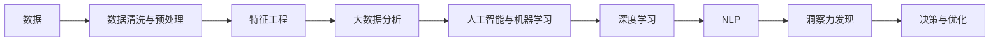

                 

# 理解洞察力：人类思维的制高点

## 1. 背景介绍

### 1.1 问题由来

在当今信息化和智能化的时代，数据的数量和质量正以前所未有的速度增长，但信息的海量化和碎片化也使得人们很难从中提取有价值的洞察力。如何在海量数据中发现有用的信息和模式，成为各行各业共同面临的难题。

### 1.2 问题核心关键点

洞察力（Insight）是理解和处理数据的关键。它不仅仅是数据的简单提取，而是从数据中发现背后更深层次的关联、趋势和模式。洞察力的提取不仅需要先进的数据处理技术，更需要深入的领域知识和深厚的洞察力。

### 1.3 问题研究意义

理解洞察力对于推动大数据和人工智能的发展具有重要意义：

- **提升决策效率**：洞察力能够帮助决策者快速发现问题根源，制定更有效的策略和措施。
- **优化资源配置**：通过洞察力分析，可以更合理地分配资源，提高效率和效益。
- **创新驱动**：洞察力是创新的源泉，帮助企业在激烈的市场竞争中保持领先地位。
- **改善用户体验**：洞察力分析能够提升产品和服务质量，改善用户体验。
- **推动智能技术**：洞察力是人工智能和大数据技术落地的重要保障，能够为算法模型提供有价值的训练数据和优化方向。

## 2. 核心概念与联系

### 2.1 核心概念概述

为了更好地理解洞察力，本节将介绍几个核心概念：

- **数据驱动决策**：以数据为基础，通过分析数据挖掘出潜在的洞察力，指导决策。
- **大数据分析**：利用先进的算法和技术，对海量数据进行分析和处理，提取有价值的信息。
- **人工智能与机器学习**：通过训练算法模型，让机器具备自动发现规律和模式的能力。
- **深度学习**：一种特殊的机器学习方法，能够处理更复杂的非线性关系和模式。
- **自然语言处理（NLP）**：理解和处理人类语言的技术，广泛应用于文本分析和情感分析等任务。

这些概念之间的联系紧密，共同构成了洞察力提取和应用的基本框架。通过理解这些核心概念，我们能够更好地把握洞察力提取和应用的关键技术。

### 2.2 核心概念原理和架构的 Mermaid 流程图



这个流程图展示了从数据到洞察力的整个流程。首先，通过数据清洗与预处理，将原始数据转化为可用格式。接着，利用特征工程提取关键特征。然后，通过大数据分析和机器学习算法，对数据进行深度处理。最后，利用深度学习和NLP技术，从数据中发现洞察力，指导决策和优化过程。

## 3. 核心算法原理 & 具体操作步骤

### 3.1 算法原理概述

洞察力的提取通常需要经过以下步骤：

1. **数据采集与预处理**：获取原始数据并进行清洗、转换、筛选等预处理，确保数据的可用性。
2. **特征提取**：从原始数据中提取关键特征，用于后续分析和建模。
3. **模型训练**：利用机器学习或深度学习算法训练模型，学习数据的模式和规律。
4. **洞察力发现**：通过模型分析和解释，从数据中发现背后的洞察力。
5. **决策与优化**：利用洞察力指导决策和优化过程，实现实际应用。

### 3.2 算法步骤详解

#### 3.2.1 数据采集与预处理

数据采集是洞察力提取的第一步。数据可以来源于各种渠道，如社交媒体、传感器、数据库等。数据采集后，需要进行清洗和预处理，去除噪声和无关数据，填补缺失值，确保数据的质量和一致性。

#### 3.2.2 特征提取

特征提取是将原始数据转换为可用于分析的格式的过程。常用的特征提取方法包括统计分析、时间序列分析、文本分析等。例如，对于文本数据，可以使用TF-IDF、词向量等技术提取关键特征。

#### 3.2.3 模型训练

模型训练是洞察力提取的核心步骤。常用的模型包括线性回归、决策树、随机森林、支持向量机、神经网络等。在深度学习中，卷积神经网络（CNN）和循环神经网络（RNN）被广泛用于图像和序列数据的处理。

#### 3.2.4 洞察力发现

洞察力发现是通过模型分析和解释，从数据中发现背后的规律和模式。常用的方法包括可视化技术、关联规则挖掘、异常检测等。例如，可以使用热力图展示数据分布，使用关联规则挖掘发现数据中的隐含关系。

#### 3.2.5 决策与优化

决策与优化是将洞察力转化为实际应用的过程。例如，对于电商推荐系统，可以通过洞察力发现用户兴趣和行为模式，从而优化推荐算法，提高用户体验。

### 3.3 算法优缺点

洞察力提取的优点：

- **自动化分析**：通过自动化算法，减少人工分析的时间和成本。
- **准确性高**：机器学习模型能够处理大规模数据，减少人为误差。
- **实时性**：算法可以实时处理和分析数据，提供即时洞察力。
- **可扩展性强**：算法可以处理不同类型的数据，支持多种分析场景。

洞察力提取的缺点：

- **数据质量依赖**：洞察力提取依赖于数据的完整性和准确性，低质量数据可能影响分析结果。
- **复杂度高**：复杂的算法需要更多的计算资源和时间，对计算能力要求高。
- **结果解释性不足**：模型往往缺乏可解释性，难以解释其内部工作机制。
- **偏见和偏差**：算法可能受到数据集和模型的偏见影响，导致结果偏差。

### 3.4 算法应用领域

洞察力提取广泛应用于以下几个领域：

- **金融行业**：通过分析市场数据，发现投资机会和风险点，优化投资策略。
- **医疗健康**：通过分析患者数据，发现疾病模式和风险因素，改进诊疗方案。
- **电商零售**：通过分析用户行为数据，发现购买趋势和需求，优化产品推荐和定价。
- **供应链管理**：通过分析供应链数据，优化库存管理和物流调度，提高效率和降低成本。
- **客户服务**：通过分析客户反馈数据，发现客户需求和问题，提升服务质量和满意度。

## 4. 数学模型和公式 & 详细讲解 & 举例说明

### 4.1 数学模型构建

洞察力提取的数学模型构建通常包括以下步骤：

1. **定义问题**：明确分析目标和问题。
2. **数据表示**：将数据转化为数学表示形式，如向量、矩阵等。
3. **模型选择**：选择合适的模型进行训练和分析。
4. **优化求解**：利用优化算法求解模型参数。
5. **结果解释**：对模型结果进行解释和分析。

### 4.2 公式推导过程

以线性回归模型为例，推导其数学公式。

设有一个包含n个样本的线性回归问题，每个样本有m个特征和1个目标值，线性回归模型的目标是最小化损失函数：

$$
\min_{\theta} \sum_{i=1}^{n} (y_i - \theta^T x_i)^2
$$

其中，$y_i$为目标值，$x_i$为特征向量，$\theta$为模型参数。利用梯度下降算法求解上述优化问题，得到模型参数的更新公式：

$$
\theta_{t+1} = \theta_t - \alpha (\nabla_{\theta} L(\theta_t)) 
$$

其中，$\alpha$为学习率，$\nabla_{\theta} L(\theta_t)$为目标函数对参数$\theta$的梯度。

### 4.3 案例分析与讲解

#### 案例一：电商推荐系统

电商推荐系统通过分析用户历史行为数据，发现用户的购买偏好和趋势，从而推荐商品。假设有一个包含N个用户和M个商品的数据集，每个用户有R个历史行为数据。使用协同过滤算法进行分析，得到用户对商品的评分矩阵。通过矩阵分解，可以发现用户对商品的隐式评分，进而推荐用户可能感兴趣的商品。

#### 案例二：医疗健康预测

医疗健康预测通过分析患者历史健康数据，发现疾病模式和风险因素，从而预测患者的健康状况。假设有一个包含N个患者和M个健康指标的数据集，每个患者有R个历史健康记录。使用随机森林算法进行分析，得到患者的健康风险模型。通过模型分析，可以预测患者的疾病风险，并制定个性化的预防和治疗方案。

## 5. 项目实践：代码实例和详细解释说明

### 5.1 开发环境搭建

在进行项目实践前，我们需要准备好开发环境。以下是使用Python进行Scikit-learn开发的环境配置流程：

1. 安装Anaconda：从官网下载并安装Anaconda，用于创建独立的Python环境。

2. 创建并激活虚拟环境：
```bash
conda create -n sklearn-env python=3.7 
conda activate sklearn-env
```

3. 安装Scikit-learn：
```bash
conda install scikit-learn
```

4. 安装必要的工具包：
```bash
pip install numpy pandas matplotlib scikit-learn tqdm jupyter notebook ipython
```

完成上述步骤后，即可在`sklearn-env`环境中开始项目实践。

### 5.2 源代码详细实现

我们使用Scikit-learn库实现一个简单的线性回归模型，并输出模型的训练结果和预测结果。

```python
import numpy as np
from sklearn.linear_model import LinearRegression
from sklearn.model_selection import train_test_split

# 生成随机数据
X = np.random.rand(100, 2)
y = np.dot(X, np.array([0.1, 0.2])) + 1 + np.random.randn(100)

# 划分训练集和测试集
X_train, X_test, y_train, y_test = train_test_split(X, y, test_size=0.2, random_state=0)

# 训练线性回归模型
model = LinearRegression()
model.fit(X_train, y_train)

# 输出模型系数
print(model.coef_)

# 输出模型截距
print(model.intercept_)

# 在测试集上进行预测
y_pred = model.predict(X_test)

# 输出预测结果
print(y_pred)
```

### 5.3 代码解读与分析

让我们再详细解读一下关键代码的实现细节：

**数据生成**：首先，生成100个随机样本数据，每个样本有2个特征和1个目标值，目标值由特征线性加噪生成。

**模型训练**：使用Scikit-learn库的线性回归模型，训练模型并输出模型的系数和截距。

**模型预测**：在测试集上进行预测，输出预测结果。

**代码解读**：
- 首先，使用Numpy库生成随机数据。
- 使用Scikit-learn库的`train_test_split`方法划分训练集和测试集。
- 创建`LinearRegression`模型，并使用`fit`方法进行模型训练。
- 使用`coef_`属性输出模型系数，使用`intercept_`属性输出模型截距。
- 使用`predict`方法对测试集进行预测，输出预测结果。

## 6. 实际应用场景

### 6.1 金融行业

金融行业通过分析市场数据，发现投资机会和风险点，优化投资策略。例如，利用机器学习模型分析股票市场的历史数据，发现市场的长期趋势和周期性规律，从而进行投资决策。

### 6.2 医疗健康

医疗健康通过分析患者数据，发现疾病模式和风险因素，改进诊疗方案。例如，利用深度学习模型分析患者的历史健康数据，发现疾病的传播规律和预防措施，提高诊疗效果。

### 6.3 电商零售

电商零售通过分析用户行为数据，发现购买趋势和需求，优化产品推荐和定价。例如，利用协同过滤算法分析用户的历史购买记录，发现用户的购买偏好，从而进行个性化的商品推荐。

### 6.4 供应链管理

供应链管理通过分析供应链数据，优化库存管理和物流调度，提高效率和降低成本。例如，利用机器学习模型分析供应链的历史数据，发现库存水平和物流调度的最优方案，提高供应链的运行效率。

## 7. 工具和资源推荐

### 7.1 学习资源推荐

为了帮助开发者系统掌握洞察力提取的理论基础和实践技巧，这里推荐一些优质的学习资源：

1. 《数据科学基础》系列博文：由数据科学家撰写，涵盖数据处理、统计分析、机器学习等多个主题，系统讲解洞察力提取的各个环节。

2. CS229《机器学习》课程：斯坦福大学开设的机器学习课程，由Trevor Hastie教授主讲，系统介绍机器学习的基本概念和算法。

3. 《深度学习》书籍：Ian Goodfellow等编著，全面介绍了深度学习的原理、算法和应用，是深度学习领域的经典教材。

4. Kaggle竞赛平台：提供了丰富的数据集和竞赛，可以实践机器学习算法，提升洞察力提取能力。

5. GitHub开源项目：包含了各种机器学习模型的实现和应用案例，可以作为学习和实践的参考。

通过对这些资源的学习实践，相信你一定能够快速掌握洞察力提取的精髓，并用于解决实际的分析问题。

### 7.2 开发工具推荐

高效的开发离不开优秀的工具支持。以下是几款用于洞察力提取开发的常用工具：

1. Scikit-learn：基于Python的开源机器学习库，支持多种经典算法，易于上手。

2. TensorFlow：由Google主导开发的开源深度学习框架，支持大规模工程应用。

3. Keras：基于TensorFlow的高级神经网络库，易于构建和调试深度学习模型。

4. PyTorch：由Facebook开发的开源深度学习框架，支持动态图计算，灵活度高。

5. Jupyter Notebook：交互式编程环境，支持多语言编程，方便开发者进行实验和分享代码。

合理利用这些工具，可以显著提升洞察力提取任务的开发效率，加快创新迭代的步伐。

### 7.3 相关论文推荐

洞察力提取技术的发展源于学界的持续研究。以下是几篇奠基性的相关论文，推荐阅读：

1. Machine Learning: A Probabilistic Perspective：Tom Mitchell著，全面介绍了机器学习的基本概念和算法，是机器学习领域的经典教材。

2. An Introduction to Statistical Learning：Gareth James等著，介绍了统计学习的基本原理和方法，适合初学者入门。

3. Deep Learning：Ian Goodfellow等著，全面介绍了深度学习的原理、算法和应用，是深度学习领域的经典教材。

4. The Elements of Statistical Learning：Trevor Hastie等著，介绍了统计学习的基本原理和方法，是统计学习领域的经典教材。

这些论文代表了大数据和机器学习领域的最新研究进展，通过学习这些前沿成果，可以帮助研究者把握学科前进方向，激发更多的创新灵感。

## 8. 总结：未来发展趋势与挑战

### 8.1 总结

本文对洞察力提取的方法进行了全面系统的介绍。首先阐述了洞察力的重要性，明确了洞察力提取在推动大数据和人工智能发展中的关键作用。其次，从原理到实践，详细讲解了洞察力提取的数学模型和操作步骤，给出了洞察力提取任务开发的完整代码实例。同时，本文还广泛探讨了洞察力提取在金融、医疗、电商等多个领域的应用前景，展示了洞察力提取技术的广阔应用空间。此外，本文精选了洞察力提取的各类学习资源，力求为读者提供全方位的技术指引。

通过本文的系统梳理，可以看到，洞察力提取作为人工智能和大数据技术落地的重要保障，其重要性不容忽视。它不仅提升了数据驱动决策的效率和质量，还推动了各行各业的智能化转型。未来，随着大数据和人工智能技术的不断进步，洞察力提取技术也将迎来新的发展机遇，进一步推动社会的智能化和数字化进程。

### 8.2 未来发展趋势

展望未来，洞察力提取技术将呈现以下几个发展趋势：

1. **自动化程度提高**：随着算法和技术的发展，洞察力提取将更加自动化，减少人工干预。
2. **多模态数据融合**：洞察力提取将不仅仅局限于单模态数据，而是逐步拓展到多模态数据融合，提升数据的全面性和准确性。
3. **实时性增强**：洞察力提取将具备更强的实时处理能力，能够快速响应数据变化，提供即时洞察力。
4. **可解释性提升**：洞察力提取将更加注重模型的可解释性，帮助用户理解和信任模型结果。
5. **泛化能力增强**：洞察力提取将具备更强的泛化能力，能够处理更多样化的数据和问题。

以上趋势凸显了洞察力提取技术的广阔前景。这些方向的探索发展，必将进一步提升洞察力提取的能力和应用范围，为人工智能和大数据技术带来新的突破。

### 8.3 面临的挑战

尽管洞察力提取技术已经取得了瞩目成就，但在迈向更加智能化、普适化应用的过程中，它仍面临着诸多挑战：

1. **数据质量瓶颈**：洞察力提取依赖于高质量的数据，如何获取和处理高质量数据，是洞察力提取的重要挑战。
2. **计算资源限制**：洞察力提取需要大量的计算资源，如何优化算法和模型，减少计算资源消耗，是洞察力提取的重要方向。
3. **模型复杂度问题**：洞察力提取模型的复杂度不断增加，如何简化模型结构，提高模型的稳定性和可解释性，是洞察力提取的重要挑战。
4. **结果可靠性问题**：洞察力提取结果的可靠性依赖于数据和模型的质量，如何提高模型的鲁棒性和可靠性，是洞察力提取的重要方向。

### 8.4 研究展望

面对洞察力提取所面临的挑战，未来的研究需要在以下几个方面寻求新的突破：

1. **数据采集与处理**：开发更加高效和自动化的数据采集和处理技术，确保数据的质量和可用性。
2. **模型简化与优化**：开发更加高效和可解释的洞察力提取模型，减少计算资源消耗，提高模型的稳定性和可解释性。
3. **多模态数据融合**：开发更加高效和多模态数据融合技术，提升数据的全面性和准确性。
4. **实时处理与响应**：开发更加实时和高效的洞察力提取算法，提高系统的响应速度和实时性。
5. **模型鲁棒性与可靠性**：开发更加鲁棒和可靠的洞察力提取模型，提高模型的鲁棒性和可靠性。

这些研究方向将推动洞察力提取技术的不断进步，为人工智能和大数据技术带来新的突破，推动社会的智能化和数字化进程。

## 9. 附录：常见问题与解答

**Q1：如何获取高质量的数据？**

A: 高质量的数据是洞察力提取的基础。以下是一些获取高质量数据的策略：

1. **数据采集工具**：使用专业的数据采集工具，如爬虫、API接口等，获取可靠的数据源。
2. **数据清洗与预处理**：对采集的数据进行清洗、筛选、去重等预处理，确保数据的质量和一致性。
3. **数据标注与标注**：对数据进行标注和验证，确保数据标签的准确性和一致性。
4. **数据集合并与融合**：将多个数据集进行合并和融合，提升数据的多样性和全面性。

**Q2：如何简化洞察力提取模型？**

A: 模型简化是提高洞察力提取效率和稳定性的重要策略。以下是一些简化模型的策略：

1. **特征选择**：选择对洞察力提取有显著影响的特征，减少模型的复杂度。
2. **模型剪枝**：通过剪枝技术去除冗余的参数和节点，提高模型的效率。
3. **模型融合**：将多个模型进行融合，取长补短，提升模型的准确性和鲁棒性。
4. **模型优化**：使用优化算法对模型进行优化，提高模型的稳定性和收敛速度。

**Q3：如何提高洞察力提取结果的可靠性？**

A: 提高洞察力提取结果的可靠性需要综合考虑数据、模型和算法等多个因素。以下是一些提高可靠性的策略：

1. **数据质量保障**：确保数据的质量和可靠性，减少噪声和偏差。
2. **模型鲁棒性**：使用鲁棒性强的算法和模型，减少模型的过拟合和偏差。
3. **算法优化**：优化算法和模型，提高算法的稳定性和收敛速度。
4. **结果验证**：对洞察力提取结果进行验证和评估，确保结果的准确性和可靠性。

**Q4：如何实现多模态数据的洞察力提取？**

A: 实现多模态数据的洞察力提取需要综合考虑不同模态数据的特性和处理方式。以下是一些实现多模态数据的策略：

1. **数据融合技术**：使用数据融合技术，将不同模态的数据进行融合，提升数据的全面性和准确性。
2. **跨模态学习**：使用跨模态学习算法，在不同模态之间建立关联，提升模型的泛化能力。
3. **联合训练**：将不同模态的数据联合训练，提升模型的多模态处理能力。

**Q5：如何提高洞察力提取的可解释性？**

A: 提高洞察力提取的可解释性需要综合考虑模型和算法等多个因素。以下是一些提高可解释性的策略：

1. **模型简化**：简化模型的结构和参数，提高模型的可解释性。
2. **特征解释**：对模型的特征进行解释，帮助用户理解模型的决策过程。
3. **结果可视化**：使用可视化技术展示模型的结果，帮助用户理解模型的输出。
4. **用户参与**：引入用户参与和反馈，提升模型的可解释性和可信度。

---

作者：禅与计算机程序设计艺术 / Zen and the Art of Computer Programming

