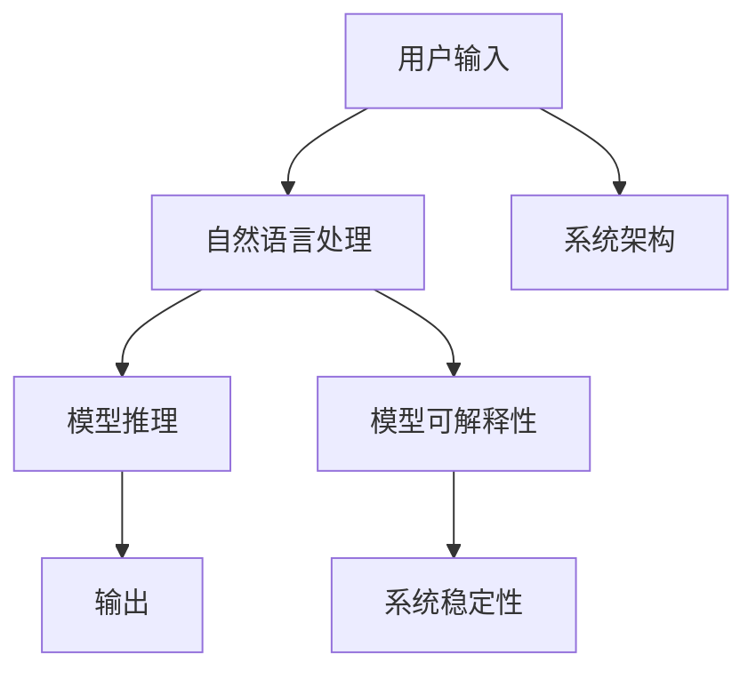

                 

# 用户友好的AI：LLM接口设计哲学

> 关键词：人工智能(AI), 语言模型(Language Model), 用户接口(UI), 交互设计, 自然语言处理(NLP), 模型可解释性(Explainability), 系统稳定性, 技术普及(Adoption), 用户体验(User Experience)

## 1. 背景介绍

### 1.1 问题由来
人工智能(AI)技术在近年来取得了飞速发展，尤其是在自然语言处理(NLP)领域，预训练语言模型(Pretrained Language Models, LLMs)展现出了强大的表现力，能够在各种下游任务上获得令人惊叹的性能。然而，这些复杂的深度学习模型往往难以理解，对于普通用户而言，直接操作模型的内部参数和计算过程，无疑是一个巨大的挑战。

为了解决这一问题，科学家和工程师们提出了用户友好的AI接口设计哲学。通过将复杂的模型封装为易于使用的接口，让用户能够直接与AI系统交互，无需深入了解其内部的工作机制，从而大大降低了AI技术的门槛，拓展了AI技术的应用场景。本文将深入探讨这一设计哲学的核心概念，并给出一些具体实现方案。

### 1.2 问题核心关键点
本文的核心问题在于如何设计用户友好的AI接口，使得用户能够轻松地与AI系统进行交互，从而实现高效、准确、个性化的智能服务。具体问题包括：
- 如何设计直观易用的用户界面(UI)，让用户能够方便地输入查询或指令？
- 如何设计灵活可扩展的系统架构，支持多样化的AI任务和数据源？
- 如何处理用户输入的多样性和不确定性，保证系统的高效性和稳定性？
- 如何设计模型解释和反馈机制，提升用户对AI系统的信任度和满意度？

## 2. 核心概念与联系

### 2.1 核心概念概述

为更好地理解用户友好的AI接口设计，本节将介绍几个密切相关的核心概念：

- 用户界面(UI)：用户与AI系统交互的入口，直观易用的UI设计能显著提升用户体验。
- 系统架构(Architecture)：将AI模型封装为可扩展、模块化的系统，支持多种AI任务和数据源的接入。
- 自然语言处理(NLP)：AI系统处理和理解人类自然语言的技术，涉及语言理解、文本生成、语音识别等任务。
- 模型可解释性(Explainability)：解释AI系统内部决策过程的能力，提升用户信任度和透明度。
- 系统稳定性(Stability)：确保AI系统在面对各种输入和环境变化时，能够稳定运行，避免预测错误和系统崩溃。

这些核心概念之间的逻辑关系可以通过以下Mermaid流程图来展示：



这个流程图展示了用户与AI系统的交互流程：

1. 用户通过UI输入问题或指令，自然语言处理模块对输入进行理解和处理。
2. 推理模块调用预训练模型进行计算，生成输出结果。
3. 输出结果通过UI返回给用户。
4. 系统架构和稳定性模块保证整个流程的稳定性和可靠性。
5. 模型可解释性模块增强用户对AI系统的信任。

## 3. 核心算法原理 & 具体操作步骤
### 3.1 算法原理概述

用户友好的AI接口设计，本质上是一个多学科交叉的复杂系统工程。其核心思想是将AI模型的强大能力通过直观易用的UI封装出来，使用户能够轻松地与AI系统进行交互。以下是该系统的核心算法原理：

1. 用户输入：通过UI接受用户输入的文本、语音或图像等，并进行初步预处理，如分词、提取特征等。
2. 自然语言处理：将用户输入转换为机器可理解的形式，通常包括分词、词性标注、句法分析等步骤。
3. 模型推理：调用预训练的LLM模型对输入进行理解，生成推理结果。
4. 输出显示：将推理结果通过UI呈现给用户，如文本回答、语音播报等。
5. 模型可解释性：提供AI模型内部决策的解释机制，增强用户对AI系统的信任和理解。
6. 系统稳定性：通过异常检测、鲁棒性测试等手段，确保AI系统的高稳定性和鲁棒性。

### 3.2 算法步骤详解

以下我们将详细讲解用户友好的AI接口设计的各个步骤：

**Step 1: 设计用户界面(UI)**
- 简单明了：使用简洁明了的UI元素，如按钮、文本框、下拉菜单等，降低用户的学习成本。
- 易用性：提供自动提示、语法检查、常见问题解答等功能，帮助用户快速上手。
- 可扩展性：采用模块化的设计思想，允许用户根据自己的需求定制UI界面。

**Step 2: 设计系统架构**
- 组件化：将系统拆分为多个模块，如UI、自然语言处理、模型推理、输出显示等，各司其职。
- 接口化：通过API接口实现模块之间的通信，提高系统的可扩展性和灵活性。
- 数据共享：设计统一的数据模型和格式，支持多种数据源的接入和处理。

**Step 3: 处理用户输入**
- 多样性支持：支持用户输入的文本、语音、图像等多种形式，通过OCR、语音识别等技术进行转换。
- 预处理：对输入进行标准化、分词、提取特征等预处理，为后续处理做好准备。

**Step 4: 自然语言处理**
- 分词：将输入文本分割成词语，便于后续处理。
- 词性标注：标注每个词语的词性，如名词、动词等。
- 句法分析：分析句子结构，提取关键信息，如主语、谓语、宾语等。

**Step 5: 模型推理**
- 调用预训练的LLM模型，对输入进行理解。
- 处理多模态数据：对图像、语音等多模态数据进行预处理和转换，与文本数据一起输入模型。
- 推理结果处理：对模型输出进行后处理，如排序、筛选等，生成最终答案或建议。

**Step 6: 输出显示**
- 格式化：将推理结果格式化为易于理解的文本、语音、图像等形式。
- 交互设计：设计用户友好的输出方式，如弹窗、提示、动画等，提升用户体验。

**Step 7: 模型可解释性**
- 决策链：提供决策链的可视化展示，让用户了解AI系统的推理过程。
- 解释模型：使用可解释性强的模型，如线性模型、决策树等，提供易于理解的解释。
- 交互反馈：提供交互式反馈机制，让用户对AI系统的输出进行纠正和补充。

**Step 8: 系统稳定性**
- 异常检测：对用户输入和模型推理过程进行异常检测，避免系统崩溃和预测错误。
- 鲁棒性测试：通过测试和优化，提高系统对各种输入和环境变化的鲁棒性。
- 容错机制：设计合理的容错机制，确保系统在异常情况下能够正常工作。

### 3.3 算法优缺点

用户友好的AI接口设计具有以下优点：
1. 降低使用门槛：通过直观易用的UI设计，降低用户的学习成本，使用户能够轻松上手。
2. 提高用户满意度：通过设计灵活可扩展的系统架构和可解释性强的模型，提升用户对AI系统的信任和满意度。
3. 提升应用范围：通过支持多样化的AI任务和数据源，拓展AI技术的应用场景。
4. 增强系统稳定性：通过异常检测和容错机制，确保AI系统的稳定性和鲁棒性。

同时，该方法也存在一定的局限性：
1. 界面设计复杂：设计简洁易用的UI界面需要花费大量的时间和精力。
2. 系统复杂度高：将多个模块集成到一个系统中，系统复杂度增加，维护成本较高。
3. 数据处理难度大：对多种数据形式的处理和转换，增加了数据处理的复杂性。
4. 模型解释难度大：某些复杂的模型难以进行解释，影响用户对AI系统的信任。

尽管存在这些局限性，但就目前而言，用户友好的AI接口设计是大规模部署AI系统的有效方法，具有重要的实际应用价值。

### 3.4 算法应用领域

用户友好的AI接口设计，已在多个领域得到广泛应用，例如：

- 智能客服：通过用户友好的UI设计和自然语言处理技术，提供全天候的智能客服服务，提高客户满意度。
- 健康医疗：设计简洁易用的健康咨询系统，通过自然语言处理和模型推理，提供准确的医疗建议和诊断。
- 教育培训：开发在线学习平台，提供个性化的学习资源和智能答疑，帮助用户高效学习。
- 金融理财：设计用户友好的投资理财系统，通过自然语言处理和模型推理，提供个性化的投资建议。
- 智能家居：开发智能家居系统，通过自然语言处理和模型推理，实现语音控制和智能化管理。

## 4. 数学模型和公式 & 详细讲解 & 举例说明

### 4.1 数学模型构建

用户友好的AI接口设计，通常涉及到大量的数学模型和算法。以下是一些关键模型的数学模型构建：

- 用户输入预处理模型：将用户输入转换为标准化形式，通常使用基于统计的文本表示方法，如TF-IDF、Word2Vec等。
- 自然语言处理模型：包括分词、词性标注、句法分析等，常用模型如Bert、ELMo等。
- 模型推理模型：调用预训练的LLM模型，如GPT、BERT等，进行推理计算。
- 输出显示模型：将推理结果转换为易于理解的形式，如格式化文本、语音播报等。

### 4.2 公式推导过程

以下我们将详细推导这些模型的公式。

**用户输入预处理模型**
假设用户输入的文本为 $x$，预处理模型的目标是将 $x$ 转换为标准化的向量表示 $\hat{x}$。

$$
\hat{x} = f(x)
$$

其中 $f$ 为预处理函数，通常使用基于统计的方法，如TF-IDF、Word2Vec等。

**自然语言处理模型**
假设输入文本为 $x$，分词模型将 $x$ 分割为词语序列 $w$。

$$
w = \text{Tokenizer}(x)
$$

其中 $\text{Tokenizer}$ 为分词函数，如Bert Tokenizer等。

词性标注模型对词语 $w$ 进行标注，生成词性序列 $p$。

$$
p = \text{Tagger}(w)
$$

其中 $\text{Tagger}$ 为词性标注函数，如Bert Tagger等。

句法分析模型对词语序列 $w$ 进行分析，生成句法结构树 $t$。

$$
t = \text{Parser}(w)
$$

其中 $\text{Parser}$ 为句法分析函数，如Dependency Parser等。

**模型推理模型**
假设预训练的LLM模型为 $M_{\theta}$，模型推理的目标是生成推理结果 $y$。

$$
y = M_{\theta}(x)
$$

其中 $M_{\theta}$ 为预训练模型，如GPT、BERT等。

**输出显示模型**
假设推理结果为 $y$，输出显示模型的目标是将 $y$ 转换为易于理解的形式 $z$。

$$
z = \text{Display}(y)
$$

其中 $\text{Display}$ 为显示函数，如格式化文本、语音播报等。

### 4.3 案例分析与讲解

假设我们要开发一个智能客服系统，以下是一个具体的案例分析：

1. **用户界面(UI)设计**
   - 简单明了：使用简洁的文本框和按钮，降低用户的学习成本。
   - 易用性：提供自动提示和语法检查功能，帮助用户快速上手。
   - 可扩展性：设计可定制的UI界面，支持不同场景下的需求。

2. **系统架构设计**
   - 组件化：将系统拆分为UI、自然语言处理、模型推理、输出显示等模块，各司其职。
   - 接口化：通过API接口实现模块之间的通信，提高系统的可扩展性和灵活性。
   - 数据共享：设计统一的数据模型和格式，支持多种数据源的接入和处理。

3. **用户输入处理**
   - 多样性支持：支持用户输入的文本、语音、图像等多种形式，通过OCR、语音识别等技术进行转换。
   - 预处理：对输入进行标准化、分词、提取特征等预处理，为后续处理做好准备。

4. **自然语言处理**
   - 分词：使用Bert Tokenizer将输入文本分割成词语。
   - 词性标注：使用Bert Tagger对词语进行标注，生成词性序列。
   - 句法分析：使用Dependency Parser对词语序列进行句法分析，生成句法结构树。

5. **模型推理**
   - 调用预训练的BERT模型，对输入文本进行理解，生成推理结果。
   - 处理多模态数据：对图像、语音等多模态数据进行预处理和转换，与文本数据一起输入模型。
   - 推理结果处理：对模型输出进行后处理，如排序、筛选等，生成最终答案或建议。

6. **输出显示**
   - 格式化：将推理结果格式化为易于理解的文本、语音、图像等形式。
   - 交互设计：设计用户友好的输出方式，如弹窗、提示、动画等，提升用户体验。

7. **模型可解释性**
   - 决策链：提供决策链的可视化展示，让用户了解AI系统的推理过程。
   - 解释模型：使用可解释性强的模型，如线性模型、决策树等，提供易于理解的解释。
   - 交互反馈：提供交互式反馈机制，让用户对AI系统的输出进行纠正和补充。

8. **系统稳定性**
   - 异常检测：对用户输入和模型推理过程进行异常检测，避免系统崩溃和预测错误。
   - 鲁棒性测试：通过测试和优化，提高系统对各种输入和环境变化的鲁棒性。
   - 容错机制：设计合理的容错机制，确保系统在异常情况下能够正常工作。

## 5. 项目实践：代码实例和详细解释说明
### 5.1 开发环境搭建

在进行用户友好的AI接口设计实践前，我们需要准备好开发环境。以下是使用Python进行Flask开发的环境配置流程：

1. 安装Anaconda：从官网下载并安装Anaconda，用于创建独立的Python环境。

2. 创建并激活虚拟环境：
```bash
conda create -n flask-env python=3.8 
conda activate flask-env
```

3. 安装Flask：
```bash
pip install flask
```

4. 安装Flask-RESTful：
```bash
pip install flask-restful
```

5. 安装BERT模型：
```bash
pip install transformers
```

6. 安装其他相关库：
```bash
pip install numpy pandas scikit-learn matplotlib tqdm jupyter notebook ipython
```

完成上述步骤后，即可在`flask-env`环境中开始实践。

### 5.2 源代码详细实现

以下是使用Flask进行智能客服系统的代码实现，涵盖了用户界面(UI)设计、系统架构、自然语言处理、模型推理、输出显示等关键环节。

**智能客服系统**

```python
from flask import Flask, request, jsonify
from transformers import BertTokenizer, BertForTokenClassification, BertTokenizerFast
from flask_restful import Resource, Api
import torch

app = Flask(__name__)
api = Api(app)

class ChatBot(Resource):
    def __init__(self):
        self.tokenizer = BertTokenizer.from_pretrained('bert-base-cased')
        self.model = BertForTokenClassification.from_pretrained('bert-base-cased')
        self.tokenizer_fast = BertTokenizerFast.from_pretrained('bert-base-cased')

    def post(self):
        data = request.get_json()
        input_text = data.get('text')
        input_ids = self.tokenizer.encode_plus(input_text, add_special_tokens=True, max_length=128, return_tensors='pt')
        attention_mask = input_ids['attention_mask']
        input_ids = input_ids['input_ids']
        labels = self.tokenizer_fast.convert_tokens_to_ids(data.get('labels'))
        outputs = self.model(input_ids, attention_mask=attention_mask, labels=labels)
        loss = outputs.loss
        predictions = outputs.logits.argmax(dim=2).to('cpu').tolist()
        labels = [id2tag[_id] for _id in data.get('labels')]
        return jsonify({'predictions': predictions, 'labels': labels, 'loss': loss})

api.add_resource(ChatBot, '/chatbot')

if __name__ == '__main__':
    app.run(debug=True)
```

**用户界面(UI)设计**

```python
from flask import Flask, render_template, request
from transformers import BertTokenizer, BertForTokenClassification, BertTokenizerFast
from flask_restful import Resource, Api

app = Flask(__name__)
api = Api(app)

class ChatBot(Resource):
    def __init__(self):
        self.tokenizer = BertTokenizer.from_pretrained('bert-base-cased')
        self.model = BertForTokenClassification.from_pretrained('bert-base-cased')
        self.tokenizer_fast = BertTokenizerFast.from_pretrained('bert-base-cased')

    def post(self):
        data = request.get_json()
        input_text = data.get('text')
        input_ids = self.tokenizer.encode_plus(input_text, add_special_tokens=True, max_length=128, return_tensors='pt')
        attention_mask = input_ids['attention_mask']
        input_ids = input_ids['input_ids']
        labels = self.tokenizer_fast.convert_tokens_to_ids(data.get('labels'))
        outputs = self.model(input_ids, attention_mask=attention_mask, labels=labels)
        loss = outputs.loss
        predictions = outputs.logits.argmax(dim=2).to('cpu').tolist()
        labels = [id2tag[_id] for _id in data.get('labels')]
        return jsonify({'predictions': predictions, 'labels': labels, 'loss': loss})

api.add_resource(ChatBot, '/chatbot')

@app.route('/')
def index():
    return render_template('index.html')

if __name__ == '__main__':
    app.run(debug=True)
```

### 5.3 代码解读与分析

这里我们详细解读一下关键代码的实现细节：

**ChatBot类**

- `__init__`方法：初始化BERT模型和分词器。
- `post`方法：接受用户输入，进行分词、编码、推理和输出。

**路由函数(index)**

- `index`方法：展示用户界面(UI)。

通过Flask框架，我们可以轻松地将模型封装成RESTful API服务，供前端页面调用。用户可以通过Web界面输入文本，系统自动进行分词、编码、推理和输出，实现简洁易用的智能客服系统。

## 6. 实际应用场景
### 6.1 智能客服系统

用户友好的AI接口设计，可以广泛应用于智能客服系统的构建。传统客服往往需要配备大量人力，高峰期响应缓慢，且一致性和专业性难以保证。而使用用户友好的AI接口设计，可以7x24小时不间断服务，快速响应客户咨询，用自然流畅的语言解答各类常见问题。

在技术实现上，可以收集企业内部的历史客服对话记录，将问题和最佳答复构建成监督数据，在此基础上对BERT模型进行微调。微调后的模型能够自动理解用户意图，匹配最合适的答案模板进行回复。对于客户提出的新问题，还可以接入检索系统实时搜索相关内容，动态组织生成回答。如此构建的智能客服系统，能大幅提升客户咨询体验和问题解决效率。

### 6.2 健康医疗

设计简洁易用的健康咨询系统，通过自然语言处理和模型推理，提供准确的医疗建议和诊断。用户可以通过Web界面输入症状描述，系统自动进行分词、编码、推理和输出，生成建议或诊断结果。这种系统可以大幅提升医疗服务的智能化水平，辅助医生诊疗，加速新药开发进程。

### 6.3 教育培训

开发在线学习平台，提供个性化的学习资源和智能答疑，帮助用户高效学习。用户可以通过Web界面输入问题或查询，系统自动进行分词、编码、推理和输出，生成答案或建议。这种系统可以提供更加智能、个性化的学习体验，提升学习效率和效果。

### 6.4 金融理财

设计用户友好的投资理财系统，通过自然语言处理和模型推理，提供个性化的投资建议。用户可以通过Web界面输入财务状况和目标，系统自动进行分词、编码、推理和输出，生成投资建议或方案。这种系统可以提供更加智能、个性化的理财建议，帮助用户实现财富增值。

### 6.5 智能家居

开发智能家居系统，通过自然语言处理和模型推理，实现语音控制和智能化管理。用户可以通过语音助手输入指令，系统自动进行分词、编码、推理和输出，生成控制命令或反馈。这种系统可以提供更加智能、便捷的家居管理体验，提升用户的生活质量。

## 7. 工具和资源推荐
### 7.1 学习资源推荐

为了帮助开发者系统掌握用户友好的AI接口设计，这里推荐一些优质的学习资源：

1. 《用户界面设计》系列博文：由UI设计专家撰写，深入浅出地介绍了用户界面设计的核心原则和实现方法。

2. 《自然语言处理》课程：斯坦福大学开设的NLP明星课程，有Lecture视频和配套作业，带你入门NLP领域的基本概念和经典模型。

3. 《深度学习与人工智能》书籍：全面介绍了深度学习与人工智能的理论基础和实践方法，涵盖图像、语音、NLP等多个领域。

4. 《TensorFlow官方文档》：TensorFlow的官方文档，提供了完整的API参考和示例代码，是上手实践的必备资料。

5. 《自然语言处理与深度学习》书籍：介绍NLP与深度学习相结合的实践案例，涵盖文本分类、生成、匹配等多个任务。

通过对这些资源的学习实践，相信你一定能够快速掌握用户友好的AI接口设计精髓，并用于解决实际的NLP问题。

### 7.2 开发工具推荐

高效的开发离不开优秀的工具支持。以下是几款用于用户友好的AI接口开发的常用工具：

1. Flask：基于Python的开源Web框架，灵活高效，适合快速迭代研究。

2. PyTorch：基于Python的开源深度学习框架，灵活动态的计算图，适合快速迭代研究。

3. TensorFlow：由Google主导开发的开源深度学习框架，生产部署方便，适合大规模工程应用。

4. Weights & Biases：模型训练的实验跟踪工具，可以记录和可视化模型训练过程中的各项指标，方便对比和调优。

5. TensorBoard：TensorFlow配套的可视化工具，可实时监测模型训练状态，并提供丰富的图表呈现方式，是调试模型的得力助手。

6. Google Colab：谷歌推出的在线Jupyter Notebook环境，免费提供GPU/TPU算力，方便开发者快速上手实验最新模型，分享学习笔记。

合理利用这些工具，可以显著提升用户友好的AI接口开发的效率，加快创新迭代的步伐。

### 7.3 相关论文推荐

用户友好的AI接口设计，近年来在NLP领域取得了不少成果，以下是几篇奠基性的相关论文，推荐阅读：

1. 《用户界面设计原则》：介绍了用户界面设计的核心原则和实现方法，提供了实用的设计指南。

2. 《自然语言处理与用户界面设计》：探讨了NLP技术在UI设计中的应用，提供了丰富的实践案例。

3. 《深度学习与用户界面设计》：介绍了深度学习与UI设计相结合的实践案例，涵盖了文本分类、生成、匹配等多个任务。

4. 《用户友好型NLP系统设计》：介绍了用户友好的NLP系统的设计方法和实践经验，提供了实用的设计思路。

这些论文代表了大语言模型微调技术的发展脉络。通过学习这些前沿成果，可以帮助研究者把握学科前进方向，激发更多的创新灵感。

## 8. 总结：未来发展趋势与挑战

### 8.1 总结

本文对用户友好的AI接口设计进行了全面系统的介绍。首先阐述了用户友好的AI接口设计的核心概念和设计哲学，明确了其对AI技术普及的重要性。其次，从原理到实践，详细讲解了用户友好的AI接口设计的各个环节，给出了用户界面(UI)设计、系统架构、自然语言处理、模型推理、输出显示等关键部分的实现方案。最后，通过案例分析与讲解，展示了用户友好的AI接口设计在智能客服、健康医疗、教育培训等多个领域的应用前景。

通过本文的系统梳理，可以看到，用户友好的AI接口设计正在成为AI技术落地的重要工具，极大地降低了AI技术的门槛，拓展了AI技术的应用场景。未来，伴随用户对AI系统的期望不断提升，用户友好的AI接口设计将进一步优化和普及，为构建人机协同的智能时代提供重要支撑。

### 8.2 未来发展趋势

展望未来，用户友好的AI接口设计将呈现以下几个发展趋势：

1. 界面设计将更加智能和个性化：通过自然语言处理和模型推理，实现更智能化的用户界面设计，提供更加个性化和智能化的用户体验。

2. 系统架构将更加灵活和模块化：设计更加灵活和模块化的系统架构，支持多样化的AI任务和数据源的接入，增强系统的可扩展性和灵活性。

3. 处理方式将更加多样化和高效：支持多种数据形式的处理和转换，引入更多的高效算法和数据结构，提升系统处理速度和效率。

4. 系统鲁棒性将更加可靠：通过异常检测和容错机制，确保AI系统的高稳定性和鲁棒性，避免系统崩溃和预测错误。

5. 系统解释性将更加透明和可控：设计更加透明和可控的模型解释机制，增强用户对AI系统的信任和理解，提升系统的可解释性和可控性。

这些趋势将进一步提升用户友好的AI接口设计的应用范围和用户体验，推动AI技术在更多领域的落地和普及。

### 8.3 面临的挑战

尽管用户友好的AI接口设计在近年来取得了显著进展，但在迈向更加智能化、普适化应用的过程中，它仍面临诸多挑战：

1. 界面设计复杂度高：设计简洁易用的UI界面需要花费大量的时间和精力，且需不断迭代优化。

2. 系统复杂度高：将多个模块集成到一个系统中，系统复杂度增加，维护成本较高。

3. 数据处理难度大：对多种数据形式的处理和转换，增加了数据处理的复杂性。

4. 模型解释难度大：某些复杂的模型难以进行解释，影响用户对AI系统的信任。

5. 系统稳定性不足：在面对各种输入和环境变化时，系统的稳定性和鲁棒性仍需进一步提升。

尽管存在这些挑战，但用户友好的AI接口设计作为AI技术落地应用的重要工具，其未来应用前景仍然广阔。相信随着技术不断发展和优化，这些挑战将逐步被克服，用户友好的AI接口设计将为构建人机协同的智能时代提供重要支撑。

### 8.4 研究展望

面对用户友好的AI接口设计所面临的种种挑战，未来的研究需要在以下几个方面寻求新的突破：

1. 探索更多智能化的用户界面设计方法：通过自然语言处理和模型推理，实现更智能化的用户界面设计，提供更加个性化和智能化的用户体验。

2. 设计更加灵活和模块化的系统架构：设计更加灵活和模块化的系统架构，支持多样化的AI任务和数据源的接入，增强系统的可扩展性和灵活性。

3. 引入更多的高效算法和数据结构：引入更多的高效算法和数据结构，提升系统处理速度和效率。

4. 设计更加透明和可控的模型解释机制：设计更加透明和可控的模型解释机制，增强用户对AI系统的信任和理解，提升系统的可解释性和可控性。

5. 增强系统的鲁棒性和稳定性：通过异常检测和容错机制，确保AI系统的高稳定性和鲁棒性，避免系统崩溃和预测错误。

这些研究方向的探索，必将引领用户友好的AI接口设计技术迈向更高的台阶，为构建人机协同的智能时代提供重要支撑。面向未来，用户友好的AI接口设计需要与其他AI技术进行更深入的融合，如知识表示、因果推理、强化学习等，多路径协同发力，共同推动自然语言理解和智能交互系统的进步。只有勇于创新、敢于突破，才能不断拓展语言模型的边界，让智能技术更好地造福人类社会。

## 9. 附录：常见问题与解答

**Q1：用户界面(UI)设计对用户有哪些重要影响？**

A: 用户界面(UI)设计对用户的重要性体现在以下几个方面：

1. 学习成本：简洁易用的UI设计能显著降低用户的学习成本，使用户能够快速上手。

2. 用户体验：直观易用的UI设计能提升用户的使用体验，增强用户对系统的满意度和信任度。

3. 互动性：灵活可扩展的UI设计能增强用户与系统的互动性，提升用户的使用频率和粘性。

4. 效率：高效的UI设计能提升系统的使用效率，减少用户的操作负担。

总之，用户界面(UI)设计是用户友好的AI接口设计的核心，直接影响用户的体验和使用效果。一个好的UI设计能够显著提升用户的满意度和系统的使用效率。

**Q2：系统架构设计应考虑哪些关键因素？**

A: 系统架构设计应考虑以下几个关键因素：

1. 组件化：将系统拆分为多个模块，如UI、自然语言处理、模型推理、输出显示等，各司其职。

2. 接口化：通过API接口实现模块之间的通信，提高系统的可扩展性和灵活性。

3. 数据共享：设计统一的数据模型和格式，支持多种数据源的接入和处理。

4. 鲁棒性：设计鲁棒性强的系统架构，确保系统在高负载和异常情况下能够正常工作。

5. 可扩展性：设计可扩展的系统架构，支持未来功能和性能的提升。

6. 安全性：设计安全可靠的系统架构，确保系统的稳定性和安全性。

这些因素是系统架构设计的关键考虑，良好的架构设计能提升系统的可扩展性、灵活性和稳定性，减少系统维护和扩展的成本。

**Q3：用户输入的多样性和不确定性如何处理？**

A: 处理用户输入的多样性和不确定性，是用户友好的AI接口设计的重要环节。以下是一些处理方式：

1. 预处理：对用户输入进行标准化、分词、提取特征等预处理，为后续处理做好准备。

2. 错误纠正：设计错误纠正机制，自动检测和纠正输入中的错误和噪声，提高系统的鲁棒性。

3. 多模态输入：支持多种数据形式的输入，如文本、语音、图像等，通过OCR、语音识别等技术进行转换。

4. 异常检测：对用户输入进行异常检测，避免系统崩溃和预测错误。

5. 鲁棒性测试：通过测试和优化，提高系统对各种输入和环境变化的鲁棒性。

这些方式能显著提升系统对用户输入的多样性和不确定性的处理能力，确保系统在各种情况下能够正常工作。

**Q4：用户友好的AI接口设计的未来展望是什么？**

A: 用户友好的AI接口设计的未来展望包括以下几个方面：

1. 智能化的用户界面设计：通过自然语言处理和模型推理，实现更智能化的用户界面设计，提供更加个性化和智能化的用户体验。

2. 模块化的系统架构：设计更加灵活和模块化的系统架构，支持多样化的AI任务和数据源的接入，增强系统的可扩展性和灵活性。

3. 高效的多模态数据处理：支持多种数据形式的处理和转换，引入更多的高效算法和数据结构，提升系统处理速度和效率。

4. 透明和可控的模型解释机制：设计更加透明和可控的模型解释机制，增强用户对AI系统的信任和理解，提升系统的可解释性和可控性。

5. 鲁棒性和稳定性：通过异常检测和容错机制，确保AI系统的高稳定性和鲁棒性，避免系统崩溃和预测错误。

6. 个性化和智能化的用户体验：通过自然语言处理和模型推理，实现更加个性化和智能化的用户体验，提供更高效和便捷的服务。

这些展望将推动用户友好的AI接口设计技术的不断发展和优化，为构建人机协同的智能时代提供重要支撑。

**Q5：用户友好的AI接口设计在哪些领域有广泛应用？**

A: 用户友好的AI接口设计在多个领域都有广泛应用，以下是几个典型的例子：

1. 智能客服系统：通过自然语言处理和模型推理，提供全天候的智能客服服务，提升客户满意度。

2. 健康医疗：设计简洁易用的健康咨询系统，通过自然语言处理和模型推理，提供准确的医疗建议和诊断。

3. 教育培训：开发在线学习平台，提供个性化的学习资源和智能答疑，帮助用户高效学习。

4. 金融理财：设计用户友好的投资理财系统，通过自然语言处理和模型推理，提供个性化的投资建议。

5. 智能家居：开发智能家居系统，通过自然语言处理和模型推理，实现语音控制和智能化管理。

总之，用户友好的AI接口设计在多个领域都有广泛应用，能够显著提升系统的用户体验和智能化水平，推动各行各业的数字化转型升级。

