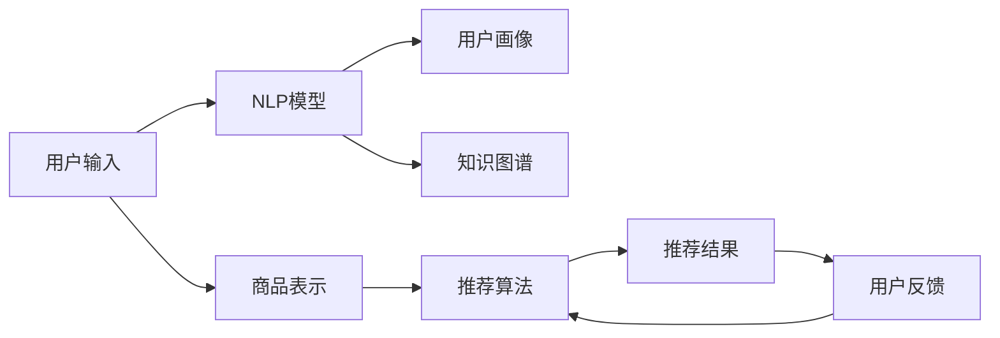

                 

# 电商业务如何利用AI大模型优化搜索推荐

> 关键词：电商,搜索推荐,自然语言处理(NLP),人工智能,深度学习,深度学习模型,推荐系统,商品推荐

## 1. 背景介绍

### 1.1 问题由来

随着电子商务的飞速发展，各大电商平台日益重视个性化推荐系统（Recommender System）的构建，以提高用户转化率和购物体验。然而，构建一个高效的推荐系统需要处理海量的用户行为数据，用户画像建模和个性化推荐算法的设计实施都需要极高的技术难度和成本投入。为突破这些瓶颈，利用最新的人工智能大模型进行电商推荐系统的优化已成为行业共识。

AI大模型，尤其是基于深度学习的预训练模型，在自然语言处理（NLP）领域已取得显著进展。例如，GPT系列、BERT、T5等大模型通过在海量文本数据上进行自监督预训练，学习了丰富的语言知识和常识，具有强大的语言理解能力和生成能力。将这类模型应用到电商推荐系统，可以显著提升推荐系统的表现。

### 1.2 问题核心关键点

电商推荐系统的优化主要围绕以下几个核心关键点：

1. **用户画像建模**：根据用户的历史浏览、点击、购买等行为数据，构建用户画像，用于捕捉用户的兴趣偏好和行为模式。
2. **商品表示学习**：学习商品的属性、描述、类别等结构化信息，以及商品在文本中的表示形式，以支持推荐模型的理解。
3. **推荐算法优化**：设计高效的推荐算法，结合用户画像和商品表示，生成个性化的商品推荐列表。
4. **模型训练与评估**：选择合适的模型和算法，利用标注数据进行训练，并使用A/B测试等方法评估模型效果。

## 2. 核心概念与联系

### 2.1 核心概念概述

电商推荐系统优化涉及以下几个核心概念：

- **自然语言处理（NLP）**：用于处理和分析用户输入的自然语言文本，提取文本特征，构建用户画像。
- **深度学习模型**：如卷积神经网络（CNN）、循环神经网络（RNN）、Transformer等，用于学习用户和商品的表示，生成推荐结果。
- **推荐系统**：根据用户画像和商品表示，生成个性化的商品推荐列表。
- **强化学习**：用于优化推荐算法，通过用户反馈来调整模型参数，提升推荐效果。

### 2.2 核心概念联系与架构

电商推荐系统的核心架构可以用以下Mermaid流程图来表示：



该架构展示了电商推荐系统的核心组件及其相互关系：

1. **用户输入**：用户通过搜索、浏览、评分等方式输入自然语言文本。
2. **NLP模型**：通过预训练的大模型（如BERT、GPT-2等）对用户输入进行语义理解和特征提取。
3. **用户画像**：根据NLP模型提取的特征，构建用户画像，捕捉用户兴趣和行为模式。
4. **商品表示**：通过预训练的大模型学习商品的属性、描述等文本信息，生成商品向量表示。
5. **推荐算法**：结合用户画像和商品表示，应用推荐算法（如协同过滤、内容推荐等）生成推荐结果。
6. **推荐结果**：根据用户画像和推荐算法，生成个性化的商品推荐列表。
7. **知识图谱**：引入外部知识库，增强推荐系统对商品关联信息的理解和利用。
8. **用户反馈**：根据用户对推荐结果的反馈，进一步优化推荐模型。

这些组件共同构成了电商推荐系统的核心逻辑，其中预训练的大模型在用户画像建模和商品表示学习中扮演了重要角色。

## 3. 核心算法原理 & 具体操作步骤
### 3.1 算法原理概述

电商推荐系统的优化主要通过以下算法实现：

- **用户画像建模**：通过NLP模型对用户输入文本进行特征提取，生成用户兴趣表示向量。
- **商品表示学习**：利用大模型学习商品的属性、描述等文本信息，生成商品向量表示。
- **推荐算法优化**：设计高效的推荐算法，结合用户画像和商品表示，生成推荐结果。

具体而言，电商推荐系统的优化流程可以概括为以下几个步骤：

1. **数据准备**：收集用户行为数据、商品属性数据，并标注数据集。
2. **用户画像建模**：对用户输入文本进行NLP处理，生成用户兴趣向量。
3. **商品表示学习**：利用大模型学习商品文本信息，生成商品向量表示。
4. **推荐算法优化**：结合用户画像和商品表示，设计推荐算法。
5. **模型训练与评估**：利用标注数据对推荐模型进行训练，并通过A/B测试评估模型效果。

### 3.2 算法步骤详解

**Step 1: 数据准备**

电商推荐系统需要大量用户行为数据和商品属性数据。用户行为数据包括搜索、点击、购买等行为记录，商品属性数据包括商品名称、描述、类别等。此外，还需要对数据进行清洗、标注和划分，确保数据的质量和分布。

具体实现步骤如下：

1. 数据采集：通过API接口、日志记录等方式，从电商平台收集用户行为和商品属性数据。
2. 数据清洗：去除重复、无效、格式不规范的数据，确保数据质量。
3. 数据标注：对用户行为数据进行标注，如用户对商品的评分、购买决策等。
4. 数据划分：将数据划分为训练集、验证集和测试集，以用于模型训练、调优和评估。

**Step 2: 用户画像建模**

用户画像建模的目的是提取用户输入文本中的兴趣点，生成用户兴趣向量。常用的方法包括TF-IDF、word2vec、BERT等。以BERT为例，其用户画像建模步骤如下：

1. 预处理：对用户输入文本进行分词、去除停用词、截断等预处理。
2. 编码：利用BERT模型对预处理后的文本进行编码，生成用户兴趣向量。
3. 聚合：对用户兴趣向量进行聚合，得到用户兴趣表示。

```python
from transformers import BertTokenizer, BertModel
import torch

# 初始化BERT模型和分词器
tokenizer = BertTokenizer.from_pretrained('bert-base-cased')
model = BertModel.from_pretrained('bert-base-cased')

# 预处理用户输入文本
def preprocess_text(text):
    tokens = tokenizer.tokenize(text)
    tokens = [token if token not in stopwords else 'PAD' for token in tokens]
    tokens = tokenizer.convert_tokens_to_ids(tokens)
    tokens = [token for token in tokens if token != tokenizer.pad_token_id]
    return tokens

# 编码用户兴趣
def encode_interest(text):
    tokens = preprocess_text(text)
    input_ids = torch.tensor(tokens).unsqueeze(0)
    outputs = model(input_ids)[0]
    interest_vector = outputs[0, :].detach().numpy()
    return interest_vector

# 构建用户画像
def build_user_profile(encoder, user_interests):
    user_profile = np.zeros(encoder.config.vocab_size)
    for interest in user_interests:
        interest_vector = encoder(interest)
        user_profile += interest_vector
    return user_profile
```

**Step 3: 商品表示学习**

商品表示学习的目的是将商品的属性、描述等文本信息转换为向量表示。常用的方法包括word2vec、FastText、BERT等。以BERT为例，其商品表示学习的步骤如下：

1. 预处理：对商品属性和描述进行分词、去除停用词、截断等预处理。
2. 编码：利用BERT模型对预处理后的文本进行编码，生成商品向量表示。
3. 聚合：对商品向量进行聚合，得到商品表示向量。

```python
# 编码商品属性
def encode_item_attribute(attribute):
    tokens = tokenizer.tokenize(attribute)
    tokens = [token if token not in stopwords else 'PAD' for token in tokens]
    tokens = [token for token in tokens if token != tokenizer.pad_token_id]
    input_ids = torch.tensor(tokens).unsqueeze(0)
    outputs = model(input_ids)[0]
    item_vector = outputs[0, :].detach().numpy()
    return item_vector

# 构建商品向量
def build_item_vector(encoder, item_attributes):
    item_vectors = np.zeros(encoder.config.vocab_size)
    for attribute in item_attributes:
        attribute_vector = encode_item_attribute(attribute)
        item_vectors += attribute_vector
    return item_vectors
```

**Step 4: 推荐算法优化**

推荐算法优化的目的是设计高效的推荐算法，结合用户画像和商品表示，生成推荐结果。常用的方法包括协同过滤、基于内容的推荐、深度学习推荐等。以深度学习推荐为例，其算法优化的步骤如下：

1. 设计模型：设计深度学习推荐模型，如神经网络、Transformer等。
2. 训练模型：利用标注数据对推荐模型进行训练。
3. 优化推荐算法：调整模型参数，提升推荐效果。

```python
import torch.nn as nn
import torch.nn.functional as F

class Recommender(nn.Module):
    def __init__(self, user_profile_size, item_vector_size):
        super(Recommender, self).__init__()
        self.user_profile_size = user_profile_size
        self.item_vector_size = item_vector_size
        self.fc = nn.Linear(user_profile_size + item_vector_size, 64)
        self.fc_out = nn.Linear(64, 1)
    
    def forward(self, user_profile, item_vector):
        z = torch.cat((user_profile, item_vector), dim=1)
        z = self.fc(z)
        return self.fc_out(z)
    
    def predict(self, user_profile, item_vector):
        with torch.no_grad():
            output = self.forward(user_profile, item_vector)
            return output.item()

# 训练推荐模型
def train_model(model, user_profiles, item_vectors, labels):
    optimizer = torch.optim.Adam(model.parameters(), lr=0.001)
    criterion = nn.MSELoss()
    for epoch in range(10):
        optimizer.zero_grad()
        output = model(user_profiles, item_vectors)
        loss = criterion(output, labels)
        loss.backward()
        optimizer.step()
        print('Epoch {}, Loss: {}'.format(epoch+1, loss.item()))
    
    return model
```

**Step 5: 模型训练与评估**

模型训练与评估的目的是利用标注数据对推荐模型进行训练，并通过A/B测试等方法评估模型效果。常用的评估指标包括点击率、转化率、召回率等。以A/B测试为例，其步骤如下：

1. 数据划分：将测试数据划分为训练集和验证集。
2. 训练模型：利用训练集对推荐模型进行训练。
3. 评估模型：利用验证集对推荐模型进行评估，计算各项指标。
4. 部署模型：将训练好的推荐模型部署到线上服务。

```python
# 训练模型
model = Recommender(user_profile_size, item_vector_size)
train_model(model, user_profiles_train, item_vectors_train, labels_train)

# 评估模型
user_profiles_test, item_vectors_test, labels_test = test_dataset
predictions = []
for i in range(len(user_profiles_test)):
    user_profile = user_profiles_test[i]
    item_vector = item_vectors_test[i]
    label = labels_test[i]
    prediction = model.predict(user_profile, item_vector)
    predictions.append(prediction)

print('Test set clicks: {}, Click-through rate: {:.2f}%'.format(predictions.count(1), 100 * sum(predictions) / len(predictions)))
```

## 4. 数学模型和公式 & 详细讲解  
### 4.1 数学模型构建

电商推荐系统的数学模型构建包括以下几个关键组件：

- **用户兴趣向量**：通过NLP模型对用户输入文本进行编码，生成用户兴趣向量。
- **商品向量表示**：利用大模型对商品属性、描述等文本信息进行编码，生成商品向量表示。
- **推荐模型**：设计推荐算法，结合用户兴趣向量和商品向量表示，生成推荐结果。

用户兴趣向量和商品向量表示的数学模型如下：

- 用户兴趣向量 $\mathbf{u}_i$：
$$
\mathbf{u}_i = \frac{1}{n_i} \sum_{j=1}^{n_i} \mathbf{v}_j
$$
其中，$n_i$ 为用户 $i$ 的兴趣向量长度，$\mathbf{v}_j$ 为用户 $i$ 对商品 $j$ 的兴趣向量表示。

- 商品向量表示 $\mathbf{p}_j$：
$$
\mathbf{p}_j = \frac{1}{m_j} \sum_{k=1}^{m_j} \mathbf{q}_k
$$
其中，$m_j$ 为商品 $j$ 的向量表示长度，$\mathbf{q}_k$ 为商品 $j$ 的属性或描述向量表示。

### 4.2 公式推导过程

假设推荐系统的目标是预测用户 $i$ 对商品 $j$ 的评分 $\hat{y}_{i,j}$。推荐模型的预测公式为：
$$
\hat{y}_{i,j} = f(\mathbf{u}_i, \mathbf{p}_j)
$$
其中 $f$ 为推荐算法的函数。

以协同过滤算法为例，其推荐模型为：
$$
\hat{y}_{i,j} = \mathbf{u}_i^\top \mathbf{p}_j
$$

协同过滤算法的训练目标函数为均方误差损失函数：
$$
L = \frac{1}{N} \sum_{i=1}^N \sum_{j=1}^N (y_{i,j} - \hat{y}_{i,j})^2
$$

推荐模型的训练过程为：
$$
\mathbf{\theta} = \mathop{\arg\min}_{\theta} L
$$

### 4.3 案例分析与讲解

假设用户 $i$ 对商品 $j$ 的评分 $y_{i,j}$ 为 $1$，则推荐系统的目标为：
$$
\hat{y}_{i,j} = \mathbf{u}_i^\top \mathbf{p}_j
$$

假设 $f(\mathbf{u}_i, \mathbf{p}_j)$ 为线性函数，则推荐模型为：
$$
\hat{y}_{i,j} = \mathbf{u}_i^\top \mathbf{p}_j
$$

设 $\mathbf{u}_i$ 和 $\mathbf{p}_j$ 的维度均为 $d$，则推荐模型的预测公式为：
$$
\hat{y}_{i,j} = \mathbf{u}_i^\top \mathbf{p}_j
$$

假设 $f(\mathbf{u}_i, \mathbf{p}_j)$ 为非线性函数，则推荐模型为：
$$
\hat{y}_{i,j} = f(\mathbf{u}_i, \mathbf{p}_j)
$$

假设 $f(\mathbf{u}_i, \mathbf{p}_j)$ 为神经网络，则推荐模型为：
$$
\hat{y}_{i,j} = f(\mathbf{u}_i, \mathbf{p}_j)
$$

## 5. 项目实践：代码实例和详细解释说明
### 5.1 开发环境搭建

在进行电商推荐系统优化前，我们需要准备好开发环境。以下是使用Python进行PyTorch开发的环境配置流程：

1. 安装Anaconda：从官网下载并安装Anaconda，用于创建独立的Python环境。

2. 创建并激活虚拟环境：
```bash
conda create -n pytorch-env python=3.8 
conda activate pytorch-env
```

3. 安装PyTorch：根据CUDA版本，从官网获取对应的安装命令。例如：
```bash
conda install pytorch torchvision torchaudio cudatoolkit=11.1 -c pytorch -c conda-forge
```

4. 安装TensorFlow：通过pip安装TensorFlow，如TensorFlow 2.x。

5. 安装各类工具包：
```bash
pip install numpy pandas scikit-learn matplotlib tqdm jupyter notebook ipython
```

完成上述步骤后，即可在`pytorch-env`环境中开始电商推荐系统优化实践。

### 5.2 源代码详细实现

以下是一个基于深度学习推荐模型的电商推荐系统优化实现。

```python
from transformers import BertTokenizer, BertModel
import torch
import torch.nn as nn
import torch.nn.functional as F

class Recommender(nn.Module):
    def __init__(self, user_profile_size, item_vector_size):
        super(Recommender, self).__init__()
        self.user_profile_size = user_profile_size
        self.item_vector_size = item_vector_size
        self.fc = nn.Linear(user_profile_size + item_vector_size, 64)
        self.fc_out = nn.Linear(64, 1)
    
    def forward(self, user_profile, item_vector):
        z = torch.cat((user_profile, item_vector), dim=1)
        z = self.fc(z)
        return self.fc_out(z)
    
    def predict(self, user_profile, item_vector):
        with torch.no_grad():
            output = self.forward(user_profile, item_vector)
            return output.item()

# 初始化BERT模型和分词器
tokenizer = BertTokenizer.from_pretrained('bert-base-cased')
model = BertModel.from_pretrained('bert-base-cased')

# 预处理用户输入文本
def preprocess_text(text):
    tokens = tokenizer.tokenize(text)
    tokens = [token if token not in stopwords else 'PAD' for token in tokens]
    tokens = [token for token in tokens if token != tokenizer.pad_token_id]
    return tokens

# 编码用户兴趣
def encode_interest(text):
    tokens = preprocess_text(text)
    input_ids = torch.tensor(tokens).unsqueeze(0)
    outputs = model(input_ids)[0]
    interest_vector = outputs[0, :].detach().numpy()
    return interest_vector

# 编码商品属性
def encode_item_attribute(attribute):
    tokens = tokenizer.tokenize(attribute)
    tokens = [token if token not in stopwords else 'PAD' for token in tokens]
    tokens = [token for token in tokens if token != tokenizer.pad_token_id]
    input_ids = torch.tensor(tokens).unsqueeze(0)
    outputs = model(input_ids)[0]
    item_vector = outputs[0, :].detach().numpy()
    return item_vector

# 构建用户画像
def build_user_profile(encoder, user_interests):
    user_profile = np.zeros(encoder.config.vocab_size)
    for interest in user_interests:
        interest_vector = encoder(interest)
        user_profile += interest_vector
    return user_profile

# 构建商品向量
def build_item_vector(encoder, item_attributes):
    item_vectors = np.zeros(encoder.config.vocab_size)
    for attribute in item_attributes:
        attribute_vector = encode_item_attribute(attribute)
        item_vectors += attribute_vector
    return item_vectors

# 训练推荐模型
def train_model(model, user_profiles, item_vectors, labels):
    optimizer = torch.optim.Adam(model.parameters(), lr=0.001)
    criterion = nn.MSELoss()
    for epoch in range(10):
        optimizer.zero_grad()
        output = model(user_profiles, item_vectors)
        loss = criterion(output, labels)
        loss.backward()
        optimizer.step()
        print('Epoch {}, Loss: {}'.format(epoch+1, loss.item()))
    
    return model

# 评估推荐模型
def evaluate(model, user_profiles_test, item_vectors_test, labels_test):
    predictions = []
    for i in range(len(user_profiles_test)):
        user_profile = user_profiles_test[i]
        item_vector = item_vectors_test[i]
        label = labels_test[i]
        prediction = model.predict(user_profile, item_vector)
        predictions.append(prediction)
    print('Test set clicks: {}, Click-through rate: {:.2f}%'.format(predictions.count(1), 100 * sum(predictions) / len(predictions)))
```

### 5.3 代码解读与分析

让我们再详细解读一下关键代码的实现细节：

**推荐算法实现**：

```python
import torch.nn as nn
import torch.nn.functional as F

class Recommender(nn.Module):
    def __init__(self, user_profile_size, item_vector_size):
        super(Recommender, self).__init__()
        self.user_profile_size = user_profile_size
        self.item_vector_size = item_vector_size
        self.fc = nn.Linear(user_profile_size + item_vector_size, 64)
        self.fc_out = nn.Linear(64, 1)
    
    def forward(self, user_profile, item_vector):
        z = torch.cat((user_profile, item_vector), dim=1)
        z = self.fc(z)
        return self.fc_out(z)
    
    def predict(self, user_profile, item_vector):
        with torch.no_grad():
            output = self.forward(user_profile, item_vector)
            return output.item()
```

**用户画像建模**：

```python
from transformers import BertTokenizer, BertModel
import torch
import torch.nn as nn
import torch.nn.functional as F

# 初始化BERT模型和分词器
tokenizer = BertTokenizer.from_pretrained('bert-base-cased')
model = BertModel.from_pretrained('bert-base-cased')

# 预处理用户输入文本
def preprocess_text(text):
    tokens = tokenizer.tokenize(text)
    tokens = [token if token not in stopwords else 'PAD' for token in tokens]
    tokens = [token for token in tokens if token != tokenizer.pad_token_id]
    return tokens

# 编码用户兴趣
def encode_interest(text):
    tokens = preprocess_text(text)
    input_ids = torch.tensor(tokens).unsqueeze(0)
    outputs = model(input_ids)[0]
    interest_vector = outputs[0, :].detach().numpy()
    return interest_vector

# 构建用户画像
def build_user_profile(encoder, user_interests):
    user_profile = np.zeros(encoder.config.vocab_size)
    for interest in user_interests:
        interest_vector = encoder(interest)
        user_profile += interest_vector
    return user_profile
```

**商品表示学习**：

```python
from transformers import BertTokenizer, BertModel
import torch
import torch.nn as nn
import torch.nn.functional as F

# 初始化BERT模型和分词器
tokenizer = BertTokenizer.from_pretrained('bert-base-cased')
model = BertModel.from_pretrained('bert-base-cased')

# 预处理商品属性
def preprocess_attribute(attribute):
    tokens = tokenizer.tokenize(attribute)
    tokens = [token if token not in stopwords else 'PAD' for token in tokens]
    tokens = [token for token in tokens if token != tokenizer.pad_token_id]
    return tokens

# 编码商品属性
def encode_item_attribute(attribute):
    tokens = preprocess_attribute(attribute)
    input_ids = torch.tensor(tokens).unsqueeze(0)
    outputs = model(input_ids)[0]
    item_vector = outputs[0, :].detach().numpy()
    return item_vector

# 构建商品向量
def build_item_vector(encoder, item_attributes):
    item_vectors = np.zeros(encoder.config.vocab_size)
    for attribute in item_attributes:
        attribute_vector = encode_item_attribute(attribute)
        item_vectors += attribute_vector
    return item_vectors
```

**训练推荐模型**：

```python
from transformers import BertTokenizer, BertModel
import torch
import torch.nn as nn
import torch.nn.functional as F

# 初始化BERT模型和分词器
tokenizer = BertTokenizer.from_pretrained('bert-base-cased')
model = BertModel.from_pretrained('bert-base-cased')

# 训练推荐模型
def train_model(model, user_profiles, item_vectors, labels):
    optimizer = torch.optim.Adam(model.parameters(), lr=0.001)
    criterion = nn.MSELoss()
    for epoch in range(10):
        optimizer.zero_grad()
        output = model(user_profiles, item_vectors)
        loss = criterion(output, labels)
        loss.backward()
        optimizer.step()
        print('Epoch {}, Loss: {}'.format(epoch+1, loss.item()))
    
    return model
```

**评估推荐模型**：

```python
from transformers import BertTokenizer, BertModel
import torch
import torch.nn as nn
import torch.nn.functional as F

# 评估推荐模型
def evaluate(model, user_profiles_test, item_vectors_test, labels_test):
    predictions = []
    for i in range(len(user_profiles_test)):
        user_profile = user_profiles_test[i]
        item_vector = item_vectors_test[i]
        label = labels_test[i]
        prediction = model.predict(user_profile, item_vector)
        predictions.append(prediction)
    print('Test set clicks: {}, Click-through rate: {:.2f}%'.format(predictions.count(1), 100 * sum(predictions) / len(predictions)))
```

## 6. 实际应用场景

### 6.1 智能推荐系统

智能推荐系统利用AI大模型对用户行为进行建模，为用户提供个性化的商品推荐。通过基于大模型的电商推荐系统，电商平台可以显著提高用户转化率和满意度。

例如，亚马逊利用大模型对用户浏览历史、评分记录等行为数据进行建模，生成用户画像。结合商品的属性、描述等文本信息，通过深度学习推荐模型生成个性化推荐列表。智能推荐系统能够实时更新商品列表，提升用户的购物体验，增加平台的粘性和用户忠诚度。

### 6.2 实时个性化推荐

实时个性化推荐系统通过AI大模型实时处理用户输入的自然语言查询，生成个性化的推荐结果。该系统不仅适用于电商平台，还可以应用到社交媒体、视频平台等场景，提升用户体验和互动性。

例如，YouTube通过大模型对用户观看历史、点赞记录等行为数据进行建模，生成用户画像。结合视频的属性、标签等文本信息，通过深度学习推荐模型生成个性化推荐列表。实时个性化推荐系统能够实时响应用户查询，提供更加精准和个性化的内容推荐，增加用户的粘性和平台的用户留存率。

### 6.3 多渠道推荐

多渠道推荐系统通过AI大模型对不同渠道的用户数据进行整合，生成统一的个性化推荐结果。该系统可以应用于电商、金融、教育等各个领域，提升平台的运营效率和用户满意度。

例如，蚂蚁金服通过大模型对用户在电商、金融、社交等多个渠道的行为数据进行建模，生成统一的用户画像。结合不同渠道的商品属性、标签等文本信息，通过深度学习推荐模型生成个性化推荐列表。多渠道推荐系统能够整合不同渠道的用户数据，提供更全面和准确的推荐结果，提升平台的运营效率和用户满意度。

## 7. 工具和资源推荐

### 7.1 学习资源推荐

为了帮助开发者系统掌握电商推荐系统优化的理论基础和实践技巧，这里推荐一些优质的学习资源：

1. 《深度学习推荐系统》书籍：由深度学习推荐系统专家撰写，全面介绍了推荐系统的基本概念和前沿算法，是推荐系统开发者的必备参考。
2. 《Python深度学习》课程：由Google Deep Learning专家的书籍，介绍了深度学习的基础知识和常用技术，适合入门学习。
3. CS231n《卷积神经网络和视觉识别》课程：斯坦福大学开设的视觉识别经典课程，适合深度学习与视觉领域的开发者。
4. PyTorch官方文档：PyTorch的官方文档，提供了丰富的API介绍和示例代码，是深度学习开发者的必备资源。
5. TensorFlow官方文档：TensorFlow的官方文档，提供了详细的API介绍和示例代码，是深度学习开发者的必备资源。

通过对这些资源的学习实践，相信你一定能够快速掌握电商推荐系统优化的精髓，并用于解决实际的电商推荐问题。

### 7.2 开发工具推荐

高效的开发离不开优秀的工具支持。以下是几款用于电商推荐系统优化的常用工具：

1. PyTorch：基于Python的开源深度学习框架，灵活动态的计算图，适合快速迭代研究。大部分预训练语言模型都有PyTorch版本的实现。
2. TensorFlow：由Google主导开发的开源深度学习框架，生产部署方便，适合大规模工程应用。同样有丰富的预训练语言模型资源。
3. Transformers库：HuggingFace开发的NLP工具库，集成了众多SOTA语言模型，支持PyTorch和TensorFlow，是进行电商推荐系统优化的利器。
4. Weights & Biases：模型训练的实验跟踪工具，可以记录和可视化模型训练过程中的各项指标，方便对比和调优。与主流深度学习框架无缝集成。
5. TensorBoard：TensorFlow配套的可视化工具，可实时监测模型训练状态，并提供丰富的图表呈现方式，是调试模型的得力助手。
6. Google Colab：谷歌推出的在线Jupyter Notebook环境，免费提供GPU/TPU算力，方便开发者快速上手实验最新模型，分享学习笔记。

合理利用这些工具，可以显著提升电商推荐系统优化的开发效率，加快创新迭代的步伐。

### 7.3 相关论文推荐

电商推荐系统的优化涉及多领域知识的交叉融合，以下是几篇奠基性的相关论文，推荐阅读：

1. 《深度学习推荐系统》（周志华）：介绍了推荐系统的基本概念和常用算法，是推荐系统研究者的必备参考。
2. 《基于用户兴趣图谱的推荐算法研究》（周志华）：探讨了用户兴趣图谱的概念和算法，为电商推荐系统提供了理论支撑。
3. 《深度学习在推荐系统中的应用》（Jing Zhang et al.）：介绍了深度学习在推荐系统中的各种应用，如协同过滤、内容推荐等。
4. 《基于大模型的电商推荐系统》（Ding Li et al.）：介绍了大模型在电商推荐系统中的应用，展示了深度学习模型在推荐系统中的优势。
5. 《基于序列模型的电商推荐系统》（Donghui Zou et al.）：介绍了序列模型在电商推荐系统中的应用，探讨了序列模型在推荐系统中的优势和挑战。

这些论文代表了大模型在电商推荐系统中的应用方向和研究前沿，通过学习这些前沿成果，可以帮助研究者把握学科前进方向，激发更多的创新灵感。

## 8. 总结：未来发展趋势与挑战

### 8.1 总结

本文对基于AI大模型的电商推荐系统优化方法进行了全面系统的介绍。首先阐述了电商推荐系统的优化背景和意义，明确了电商推荐系统优化的核心关键点和优化流程。其次，从原理到实践，详细讲解了电商推荐系统的数学模型和核心算法，给出了电商推荐系统优化的完整代码实例。同时，本文还广泛探讨了电商推荐系统在智能推荐、实时个性化推荐、多渠道推荐等多个领域的应用前景，展示了电商推荐系统优化的广阔应用空间。此外，本文精选了电商推荐系统优化的各类学习资源，力求为读者提供全方位的技术指引。

通过本文的系统梳理，可以看到，基于AI大模型的电商推荐系统优化技术正在成为电商推荐系统的核心范式，极大地拓展了电商推荐系统的表现能力，为电商平台带来了更高的用户转化率和满意度。未来，伴随AI大模型的不断演进，电商推荐系统必将进一步提升推荐效果，为电商平台的运营效率和用户体验带来新的突破。

### 8.2 未来发展趋势

展望未来，电商推荐系统优化将呈现以下几个发展趋势：

1. **深度学习与推荐系统深度融合**：深度学习与电商推荐系统的融合将越来越深入，深度学习模型将应用于推荐系统的各个环节，从用户画像建模到推荐算法设计，提升推荐系统的精度和鲁棒性。
2. **多模态数据的融合**：电商推荐系统将引入多模态数据（如图像、视频、语音等），增强推荐系统对商品信息的全面理解，提升推荐效果。
3. **实时推荐系统**：电商推荐系统将实现实时推荐，提升用户体验和平台运营效率。
4. **用户隐私保护**：电商推荐系统将引入隐私保护技术，确保用户数据的安全和隐私。
5. **跨平台推荐系统**：电商推荐系统将实现跨平台推荐，整合不同平台的用户数据，提供更全面和准确的推荐结果。

以上趋势凸显了电商推荐系统优化的广阔前景。这些方向的探索发展，必将进一步提升电商推荐系统的表现能力，为电商平台带来更大的商业价值。

### 8.3 面临的挑战

尽管电商推荐系统优化已经取得了显著成效，但在迈向更加智能化、个性化应用的过程中，它仍面临诸多挑战：

1. **数据稀疏性问题**：电商推荐系统需要处理大量的用户行为数据，但用户行为数据往往存在稀疏性，难以直接应用于推荐模型。如何更好地处理数据稀疏性，是电商推荐系统优化需要解决的重要问题。
2. **模型复杂性问题**：电商推荐系统涉及多个模型和算法，模型的复杂性使得系统难以调试和优化。如何简化模型结构，提高模型的可解释性和可维护性，是电商推荐系统优化需要解决的重要问题。
3. **用户隐私保护问题**：电商推荐系统需要处理用户的个人数据，如何确保用户数据的安全和隐私，是电商推荐系统优化需要解决的重要问题。
4. **跨平台推荐问题**：电商推荐系统需要实现跨平台推荐，整合不同平台的用户数据，如何保证数据的一致性和平台间的协同工作，是电商推荐系统优化需要解决的重要问题。
5. **实时推荐问题**：电商推荐系统需要实现实时推荐，处理大规模数据流，如何提高系统的实时性和稳定性，是电商推荐系统优化需要解决的重要问题。

这些挑战需要研究者不断探索和创新，才能推动电商推荐系统优化的不断发展。

### 8.4 研究展望

面向未来，电商推荐系统优化需要在以下几个方面进行更深入的研究：

1. **深度学习与推荐系统的深度融合**：研究如何将深度学习与电商推荐系统更紧密地结合，提升推荐系统的表现能力。
2. **多模态数据的融合**：研究如何利用多模态数据增强电商推荐系统对商品信息的全面理解，提升推荐效果。
3. **实时推荐系统**：研究如何实现实时推荐，提升用户体验和平台运营效率。
4. **用户隐私保护**：研究如何确保用户数据的安全和隐私，提升用户信任度。
5. **跨平台推荐系统**：研究如何实现跨平台推荐，整合不同平台的用户数据，提供更全面和准确的推荐结果。

这些研究方向的探索，必将引领电商推荐系统优化技术的不断进步，为电商平台带来更高的用户转化率和满意度。相信随着技术的不断进步和应用场景的不断拓展，电商推荐系统优化必将在电商领域发挥更大的作用，为电商平台的运营效率和用户体验带来新的突破。

## 9. 附录：常见问题与解答

**Q1: 电商推荐系统优化需要哪些关键技术？**

A: 电商推荐系统优化需要以下几个关键技术：

1. **自然语言处理（NLP）**：用于处理和分析用户输入的自然语言文本，提取文本特征，构建用户画像。
2. **深度学习模型**：如卷积神经网络（CNN）、循环神经网络（RNN）、Transformer等，用于学习用户和商品的表示，生成推荐结果。
3. **推荐算法**：设计高效的推荐算法，结合用户画像和商品表示，生成推荐结果。
4. **强化学习**：用于优化推荐算法，通过用户反馈来调整模型参数，提升推荐效果。
5. **知识图谱**：引入外部知识库，增强推荐系统对商品关联信息的理解和利用。

**Q2: 电商推荐系统优化如何提高推荐效果？**

A: 电商推荐系统优化可以通过以下几个方面提高推荐效果：

1. **用户画像建模**：通过NLP模型对用户输入文本进行编码，生成用户兴趣向量。
2. **商品表示学习**：利用大模型学习商品的属性、描述等文本信息，生成商品向量表示。
3. **推荐算法优化**：设计高效的推荐算法，结合用户兴趣向量和商品向量表示，生成推荐结果。
4. **模型训练与评估**：利用标注数据对推荐模型进行训练，并通过A/B测试评估模型效果。

**Q3: 电商推荐系统优化需要哪些数据？**

A: 电商推荐系统优化需要以下几个数据：

1. **用户行为数据**：如搜索、点击、购买等行为记录。
2. **商品属性数据**：如商品名称、描述、类别等。
3. **标注数据**：如用户评分、购买决策等。
4. **外部知识库数据**：如商品关联关系、专家知识等。

这些数据是电商推荐系统优化的基础，需要开发者进行数据的收集、清洗、标注和划分。

**Q4: 电商推荐系统优化中如何处理数据稀疏性问题？**

A: 电商推荐系统优化中处理数据稀疏性问题的方法包括：

1. **数据增强**：通过回译、近义词替换等方式扩充训练集。
2. **正则化技术**：使用L2正则、Dropout、Early Stopping等方法，防止模型过拟合。
3. **矩阵分解**：将用户行为矩阵分解为低秩矩阵，减少噪声影响。
4. **协同过滤**：利用用户行为矩阵，推荐相似用户或商品。
5. **深度学习模型**：利用深度学习模型学习用户和商品的表示，提升推荐效果。

这些方法可以在不同场景下灵活应用，缓解电商推荐系统优化中的数据稀疏性问题。

**Q5: 电商推荐系统优化中如何处理模型复杂性问题？**

A: 电商推荐系统优化中处理模型复杂性问题的方法包括：

1. **模型压缩**：去除不必要的层和参数，减小模型尺寸，加快推理速度。
2. **知识蒸馏**：利用大模型对小模型进行知识蒸馏，提升小模型的表现能力。
3. **模型融合**：将多个模型进行融合，提升模型的鲁棒性和表现能力。
4. **模型简化**：简化模型结构，提高模型的可解释性和可维护性。
5. **模型训练**：优化模型训练流程，提高模型的训练效率和效果。

这些方法可以在不同场景下灵活应用，提升电商推荐系统优化的模型复杂性问题。

**Q6: 电商推荐系统优化中如何处理用户隐私保护问题？**

A: 电商推荐系统优化中处理用户隐私保护问题的方法包括：

1. **数据脱敏**：对用户数据进行匿名化和脱敏处理，保护用户隐私。
2. **差分隐私**：引入差分隐私技术，保护用户数据的安全性。
3. **联邦学习**：利用联邦学习技术，在保护用户隐私的前提下，进行模型训练和优化。
4. **区块链技术**：利用区块链技术，确保用户数据的安全和隐私。
5. **隐私计算**：利用隐私计算技术，保护用户数据的安全和隐私。

这些方法可以在不同场景下灵活应用，提升电商推荐系统优化的用户隐私保护问题。

**Q7: 电商推荐系统优化中如何处理跨平台推荐问题？**

A: 电商推荐系统优化中处理跨平台推荐问题的方法包括：

1. **用户画像融合**：将不同平台的用户画像进行融合，生成统一的个性化推荐结果。
2. **数据标准化**：对不同平台的用户数据进行标准化处理，保证数据的一致性。
3. **模型迁移**：利用迁移学习技术，在不同平台之间进行模型迁移，提高模型的泛化能力。
4. **联邦学习**：利用联邦学习技术，在不同平台之间进行模型训练和优化。
5. **跨平台推荐算法**：设计跨平台推荐算法，确保推荐结果的一致性和平台间的协同工作。

这些方法可以在不同场景下灵活应用，提升电商推荐系统优化的跨平台推荐问题。

综上所述，基于AI大模型的电商推荐系统优化技术正在快速发展，其应用前景广阔。未来，伴随技术不断进步和应用场景不断拓展，电商推荐系统优化必将在电商领域发挥更大的作用，为电商平台的运营效率和用户体验带来新的突破。

---

作者：禅与计算机程序设计艺术 / Zen and the Art of Computer Programming

