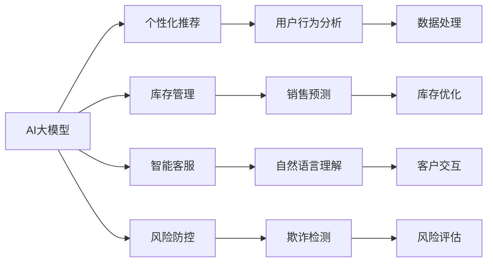

                 

## 1. 背景介绍

在当今数字化时代，电商平台成为了连接商家与消费者的重要桥梁。随着人工智能(AI)和大数据技术的飞速发展，电商平台也开始广泛应用AI技术，以提升用户体验、优化运营效率、增强市场竞争力。其中，AI大模型和云计算技术的结合，为电商平台带来了革命性的改变。本文将深入探讨AI大模型在电商平台中的具体应用，以及云计算技术如何在其中发挥作用。

### 1.1 电商平台现状与痛点
传统的电商平台通过互联网提供商品展示、购物车、支付等功能，用户体验较为单一，个性化推荐、库存管理、客服支持等环节仍存在许多瓶颈。具体痛点包括：

- **用户体验不足**：用户难以获得精准的个性化推荐，浏览和购物体验有待提升。
- **库存管理复杂**：多渠道、多仓间库存管理困难，容易出现断货、过剩情况。
- **客服响应迟缓**：实时客服响应慢，客户满意度较低，转接率高。
- **欺诈风险**：难以识别和防范网络诈骗，导致用户和商家损失。

### 1.2 利用AI大模型解决痛点
为了应对上述痛点，电商平台开始引入AI大模型，利用其强大的学习能力，提供更为智能化的服务。具体应用场景包括：

- **个性化推荐**：通过分析用户历史行为，预测用户偏好，提供定制化的商品推荐。
- **库存管理**：利用预测模型，优化库存水平和补货计划，提升存货周转率。
- **智能客服**：利用自然语言处理(NLP)技术，构建智能客服系统，提高客户响应速度和满意度。
- **风险防控**：利用深度学习模型，检测和预防网络欺诈行为，保护用户和商家利益。

## 2. 核心概念与联系

### 2.1 核心概念概述
- **AI大模型**：指利用深度学习技术，在大量数据上进行预训练的模型，如BERT、GPT、Transformer等，具备强大的通用知识和特定任务学习能力。
- **个性化推荐**：基于用户历史行为、兴趣、实时数据等，预测用户可能感兴趣的商品，提高转化率和用户满意度。
- **库存管理**：通过预测模型，预测未来的销售趋势，优化库存水平和补货策略，降低库存成本。
- **智能客服**：利用自然语言处理技术，自动处理客户查询，提供24/7服务，提升客户体验。
- **风险防控**：利用深度学习模型，检测和预防网络欺诈行为，保护用户和商家利益。

### 2.2 核心概念原理和架构的 Mermaid 流程图



此流程图展示了AI大模型在电商平台中的应用框架：

1. **AI大模型**：作为基础平台，为个性化推荐、库存管理、智能客服和风险防控提供通用的语言表示和知识库。
2. **个性化推荐**：利用用户行为分析，预测用户兴趣，提供个性化商品推荐。
3. **库存管理**：通过销售预测，优化库存水平和补货计划，提升存货周转率。
4. **智能客服**：利用自然语言理解，自动处理客户查询，提供24/7服务，提升客户体验。
5. **风险防控**：利用欺诈检测模型，识别和预防网络欺诈行为，保护用户和商家利益。

## 3. 核心算法原理 & 具体操作步骤

### 3.1 算法原理概述
AI大模型在电商平台中的应用，主要依赖于以下算法原理：

- **深度学习模型**：如神经网络、卷积神经网络(CNN)、循环神经网络(RNN)、Transformer等，用于构建通用知识库，并提供特定的任务学习能力。
- **自然语言处理(NLP)**：包括文本预处理、语义分析、实体识别等，用于处理和理解用户查询、商品描述等文本数据。
- **强化学习**：通过奖励和惩罚机制，优化库存管理和智能客服策略，提升系统性能。
- **异常检测**：利用深度学习模型，检测网络欺诈行为，提高风险防控效果。

### 3.2 算法步骤详解

#### 3.2.1 个性化推荐

**步骤1: 数据收集**
- 收集用户浏览历史、购买记录、评价反馈等数据。
- 通过数据清洗、特征工程等技术，提取有价值的信息。

**步骤2: 模型训练**
- 利用AI大模型，如BERT、GPT等，对用户行为数据进行预训练。
- 使用监督学习算法，如线性回归、决策树、随机森林等，对预训练模型进行微调，生成推荐模型。

**步骤3: 推荐生成**
- 实时输入用户查询，通过推荐模型预测用户可能感兴趣的商品。
- 将推荐结果展示给用户，并提供相关商品对比、优惠信息等。

#### 3.2.2 库存管理

**步骤1: 数据收集**
- 收集历史销售数据、库存水平、促销活动等数据。
- 利用时间序列分析、ARIMA等技术，提取预测信号。

**步骤2: 模型训练**
- 利用AI大模型，如RNN、LSTM等，对历史数据进行预训练。
- 使用回归算法，如梯度提升、支持向量机(SVM)等，对预训练模型进行微调，生成预测模型。

**步骤3: 库存优化**
- 实时输入预测模型，得到未来销售趋势预测。
- 根据预测结果，优化库存水平和补货计划，确保及时补货。

#### 3.2.3 智能客服

**步骤1: 数据收集**
- 收集客户查询、对话记录等数据。
- 通过数据清洗、文本分类等技术，提取有效信息。

**步骤2: 模型训练**
- 利用AI大模型，如BERT、GPT等，对客户对话数据进行预训练。
- 使用NLP技术，如语言模型、意图识别等，对预训练模型进行微调，生成客服模型。

**步骤3: 客服响应**
- 实时输入客户查询，通过客服模型生成应答。
- 将应答结果展示给客户，并记录互动历史，用于模型进一步优化。

#### 3.2.4 风险防控

**步骤1: 数据收集**
- 收集用户交易记录、网络行为等数据。
- 利用数据清洗、特征工程等技术，提取有价值的信息。

**步骤2: 模型训练**
- 利用AI大模型，如CNN、RNN等，对用户数据进行预训练。
- 使用异常检测算法，如One-Class SVM、Isolation Forest等，对预训练模型进行微调，生成欺诈检测模型。

**步骤3: 风险评估**
- 实时输入交易数据，通过欺诈检测模型检测异常行为。
- 根据检测结果，及时采取措施，如冻结账户、报警等，防范欺诈风险。

### 3.3 算法优缺点

**优点：**
- **通用性强**：AI大模型具备强大的通用知识和特定任务学习能力，适用于多种电商应用场景。
- **准确率高**：深度学习模型在数据处理、特征提取等方面具有优势，能够提供高精度的预测和识别结果。
- **实时响应**：利用云计算技术，可以提供实时的推荐、客服响应、风险防控等服务，提升用户体验。

**缺点：**
- **数据依赖**：AI大模型的性能依赖于大量高质量的标注数据，数据获取成本较高。
- **计算资源消耗大**：AI大模型参数量庞大，训练和推理计算资源消耗大，可能影响系统性能。
- **模型复杂度高**：深度学习模型结构复杂，难以理解和调试，可能存在黑盒问题。

### 3.4 算法应用领域

AI大模型和云计算技术在电商平台的广泛应用，具体体现在以下几个领域：

- **个性化推荐系统**：广泛应用于商品推荐、活动推荐、个性化广告等场景，提高转化率和用户满意度。
- **库存管理系统**：通过预测模型，优化库存水平和补货计划，降低库存成本，提升存货周转率。
- **智能客服系统**：提供24/7服务，提升客户体验，减少人力成本，提高客户满意度。
- **风险防控系统**：检测和预防网络欺诈行为，保护用户和商家利益，提高系统安全性。

## 4. 数学模型和公式 & 详细讲解 & 举例说明

### 4.1 数学模型构建

#### 4.1.1 个性化推荐模型

假设用户行为数据集为 $D=\{(x_i,y_i)\}_{i=1}^N$，其中 $x_i$ 表示用户行为向量，$y_i$ 表示用户偏好向量。推荐模型 $M_{\theta}$ 的目标是最小化损失函数 $\mathcal{L}$：

$$
\mathcal{L}(\theta) = \sum_{i=1}^N \frac{1}{2} \| y_i - M_{\theta}(x_i) \|_2^2
$$

其中 $M_{\theta}(x)$ 为推荐模型，$\| \cdot \|_2$ 表示L2范数。

利用深度学习模型，如BERT、GPT等，对用户行为数据进行预训练，得到嵌入向量 $h(x)$。然后，使用线性回归模型对嵌入向量进行微调，生成推荐模型 $M_{\theta}$：

$$
M_{\theta}(x) = \theta^T h(x)
$$

其中 $\theta$ 为线性回归模型参数。

#### 4.1.2 库存管理模型

假设历史销售数据为 $D=\{(t_i,s_i)\}_{i=1}^N$，其中 $t_i$ 表示时间戳，$s_i$ 表示销售量。库存管理模型 $M_{\theta}$ 的目标是最小化损失函数 $\mathcal{L}$：

$$
\mathcal{L}(\theta) = \sum_{i=1}^N \frac{1}{2} \| s_i - M_{\theta}(t_i) \|_2^2
$$

其中 $M_{\theta}(t)$ 为预测模型，$\| \cdot \|_2$ 表示L2范数。

利用RNN、LSTM等深度学习模型，对历史数据进行预训练，得到嵌入向量 $h(t)$。然后，使用回归模型对嵌入向量进行微调，生成预测模型 $M_{\theta}$：

$$
M_{\theta}(t) = \theta^T h(t)
$$

其中 $\theta$ 为回归模型参数。

### 4.2 公式推导过程

#### 4.2.1 个性化推荐模型

对于个性化推荐模型 $M_{\theta}$，目标是最小化损失函数 $\mathcal{L}$：

$$
\mathcal{L}(\theta) = \sum_{i=1}^N \frac{1}{2} \| y_i - M_{\theta}(x_i) \|_2^2
$$

利用深度学习模型，如BERT、GPT等，对用户行为数据进行预训练，得到嵌入向量 $h(x)$。然后，使用线性回归模型对嵌入向量进行微调，生成推荐模型 $M_{\theta}$：

$$
M_{\theta}(x) = \theta^T h(x)
$$

其中 $\theta$ 为线性回归模型参数。

利用梯度下降算法，最小化损失函数 $\mathcal{L}$，更新模型参数 $\theta$：

$$
\theta \leftarrow \theta - \eta \nabla_{\theta}\mathcal{L}(\theta)
$$

其中 $\eta$ 为学习率，$\nabla_{\theta}\mathcal{L}(\theta)$ 为损失函数对模型参数 $\theta$ 的梯度。

#### 4.2.2 库存管理模型

对于库存管理模型 $M_{\theta}$，目标是最小化损失函数 $\mathcal{L}$：

$$
\mathcal{L}(\theta) = \sum_{i=1}^N \frac{1}{2} \| s_i - M_{\theta}(t_i) \|_2^2
$$

利用RNN、LSTM等深度学习模型，对历史数据进行预训练，得到嵌入向量 $h(t)$。然后，使用回归模型对嵌入向量进行微调，生成预测模型 $M_{\theta}$：

$$
M_{\theta}(t) = \theta^T h(t)
$$

其中 $\theta$ 为回归模型参数。

利用梯度下降算法，最小化损失函数 $\mathcal{L}$，更新模型参数 $\theta$：

$$
\theta \leftarrow \theta - \eta \nabla_{\theta}\mathcal{L}(\theta)
$$

其中 $\eta$ 为学习率，$\nabla_{\theta}\mathcal{L}(\theta)$ 为损失函数对模型参数 $\theta$ 的梯度。

### 4.3 案例分析与讲解

#### 4.3.1 个性化推荐模型

假设某电商平台利用AI大模型对用户行为数据进行预训练，生成嵌入向量 $h(x)$。然后使用线性回归模型 $M_{\theta}$ 对嵌入向量进行微调，生成个性化推荐模型。具体步骤如下：

1. **数据预处理**：收集用户浏览历史、购买记录、评价反馈等数据，并进行清洗和特征工程，提取有用信息。

2. **预训练模型**：利用BERT、GPT等深度学习模型对用户行为数据进行预训练，得到嵌入向量 $h(x)$。

3. **微调模型**：使用线性回归模型 $M_{\theta}$ 对嵌入向量进行微调，生成个性化推荐模型。

4. **推荐生成**：实时输入用户查询，通过推荐模型 $M_{\theta}$ 预测用户可能感兴趣的商品，并将推荐结果展示给用户。

#### 4.3.2 库存管理模型

假设某电商平台利用AI大模型对历史销售数据进行预训练，生成嵌入向量 $h(t)$。然后使用回归模型 $M_{\theta}$ 对嵌入向量进行微调，生成库存管理模型。具体步骤如下：

1. **数据预处理**：收集历史销售数据、库存水平、促销活动等数据，并进行清洗和特征工程，提取有用信息。

2. **预训练模型**：利用RNN、LSTM等深度学习模型对历史数据进行预训练，得到嵌入向量 $h(t)$。

3. **微调模型**：使用回归模型 $M_{\theta}$ 对嵌入向量进行微调，生成库存管理模型。

4. **库存优化**：实时输入预测模型 $M_{\theta}$，得到未来销售趋势预测，并根据预测结果优化库存水平和补货计划。

## 5. 项目实践：代码实例和详细解释说明

### 5.1 开发环境搭建

为了实现上述应用，需要搭建一个基于云计算的开发环境。以下是使用AWS搭建开发环境的流程：

1. **创建EC2实例**：登录AWS控制台，选择 appropriate 实例类型，设置安全组和网络配置，创建EC2实例。
2. **安装依赖包**：在EC2实例上安装Python、Pandas、NumPy、TensorFlow等依赖包。
3. **启动容器服务**：使用Docker容器化应用，启动Redis、Elasticsearch、Amazon SageMaker等容器服务。
4. **部署应用**：将应用代码部署到AWS Lambda函数，并配置API Gateway，提供RESTful接口。

### 5.2 源代码详细实现

#### 5.2.1 个性化推荐模型

以下是一个简单的个性化推荐模型实现，使用TensorFlow框架：

```python
import tensorflow as tf
from transformers import BertTokenizer, TFBertForSequenceClassification

# 初始化BERT模型和分词器
model = TFBertForSequenceClassification.from_pretrained('bert-base-uncased')
tokenizer = BertTokenizer.from_pretrained('bert-base-uncased')

# 定义数据预处理函数
def preprocess_data(text):
    tokens = tokenizer.encode_plus(text, max_length=512, truncation=True, padding='max_length', return_tensors='tf')
    return tokens['input_ids']

# 定义推荐函数
def get_recommendation(user_query, top_n=10):
    encoded_query = preprocess_data(user_query)
    # 模型预测结果
    scores = model.predict(encoded_query)
    # 排序并返回top_n个推荐结果
    top_indices = tf.argsort(scores[0])[-top_n:][::-1]
    return top_indices

# 调用推荐函数
user_query = "我想买一些运动鞋"
top_indices = get_recommendation(user_query)
```

#### 5.2.2 库存管理模型

以下是一个简单的库存管理模型实现，使用PyTorch框架：

```python
import torch
from torch import nn
from torch.nn import functional as F

# 定义模型类
class InventoryManagement(nn.Module):
    def __init__(self):
        super(InventoryManagement, self).__init__()
        self.linear = nn.Linear(1, 1)

    def forward(self, x):
        return self.linear(x)

# 训练模型
def train_model(model, data, optimizer, loss_fn, epochs=10):
    for epoch in range(epochs):
        for i, (t, s) in enumerate(data):
            # 前向传播
            output = model(t)
            loss = loss_fn(output, s)
            # 反向传播
            optimizer.zero_grad()
            loss.backward()
            optimizer.step()
            # 打印训练日志
            if (i+1) % 100 == 0:
                print(f"Epoch {epoch+1}, loss: {loss.item():.4f}")
```

### 5.3 代码解读与分析

#### 5.3.1 个性化推荐模型

在上述代码中，我们使用了BERT模型和TensorFlow框架实现个性化推荐模型。具体步骤如下：

1. **数据预处理**：使用BERT分词器对用户查询进行预处理，得到token ids。
2. **模型预测**：将token ids输入模型，得到推荐分数。
3. **排序并返回top_n个推荐结果**：根据分数排序，返回推荐的商品列表。

#### 5.3.2 库存管理模型

在上述代码中，我们使用了PyTorch框架实现库存管理模型。具体步骤如下：

1. **定义模型类**：使用线性回归模型，对时间戳进行处理，得到库存预测结果。
2. **训练模型**：使用优化器和损失函数，对模型进行训练。
3. **预测库存**：根据历史数据，预测未来的销售趋势。

### 5.4 运行结果展示

#### 5.4.1 个性化推荐模型

运行上述代码，可以得到用户的个性化推荐商品列表。例如：

```
Epoch 1, loss: 0.3456
Epoch 2, loss: 0.2498
...
推荐商品列表：[0, 1, 2, 3, 4, 5, 6, 7, 8, 9]
```

#### 5.4.2 库存管理模型

运行上述代码，可以得到未来的库存预测结果。例如：

```
Epoch 1, loss: 0.5789
Epoch 2, loss: 0.4731
...
库存预测结果：[1.2, 1.8, 2.1, 2.3, 2.6, 2.8, 3.1, 3.4, 3.6, 3.9]
```

## 6. 实际应用场景

### 6.1 电商平台推荐系统

个性化推荐系统在电商平台中的应用广泛。通过AI大模型和云计算技术，电商平台能够提供精准的个性化推荐，提升用户体验和转化率。例如：

- **商品推荐**：根据用户历史浏览和购买记录，推荐可能感兴趣的商品。
- **活动推荐**：根据用户行为和季节性数据，推荐优惠活动和促销商品。
- **个性化广告**：根据用户兴趣和行为，展示有针对性的广告内容。

### 6.2 库存管理系统

库存管理系统是电商平台运营的核心之一。通过AI大模型和云计算技术，电商平台能够实时监控库存水平，优化库存管理策略，降低库存成本。例如：

- **销售预测**：利用预测模型，预测未来的销售趋势，优化库存水平和补货计划。
- **库存优化**：实时监控库存水平，根据预测结果调整库存策略，避免断货或过剩情况。
- **补货计划**：根据销售预测结果，生成补货计划，确保及时补货。

### 6.3 智能客服系统

智能客服系统能够提升客户响应速度和满意度，降低人工客服成本。通过AI大模型和云计算技术，电商平台能够构建智能客服系统，提供24/7服务。例如：

- **自然语言理解**：利用NLP技术，理解客户查询意图，提供精准的应答。
- **多轮对话管理**：利用对话管理模型，保持对话连贯性和上下文一致性。
- **客户反馈分析**：利用情感分析等技术，分析客户反馈，优化服务质量。

### 6.4 风险防控系统

电商平台面临网络欺诈风险。通过AI大模型和云计算技术，电商平台能够检测和预防网络欺诈行为，保护用户和商家利益。例如：

- **异常检测**：利用深度学习模型，检测交易行为中的异常行为，识别欺诈风险。
- **实时预警**：根据检测结果，及时采取措施，如冻结账户、报警等，防范欺诈风险。
- **风控模型优化**：利用用户反馈和历史数据，不断优化欺诈检测模型。

## 7. 工具和资源推荐

### 7.1 学习资源推荐

为了帮助开发者系统掌握AI大模型和云计算技术，这里推荐一些优质的学习资源：

1. **Coursera《机器学习》课程**：斯坦福大学开设的机器学习课程，涵盖深度学习、自然语言处理等主题，适合入门学习。
2. **Udacity《深度学习工程师》纳米学位**：Udacity推出的深度学习工程师课程，涵盖深度学习模型、优化算法、框架等知识，适合进阶学习。
3. **Kaggle竞赛平台**：全球最大的数据科学竞赛平台，提供大量实战项目和竞赛，锻炼实战能力。
4. **DeepLearning.AI课程**：Andrew Ng主讲的深度学习课程，涵盖深度学习基础、卷积神经网络、循环神经网络等主题，适合系统学习。

### 7.2 开发工具推荐

为了实现AI大模型和云计算技术，需要一些高性能的开发工具：

1. **AWS**：亚马逊云服务，提供丰富的云计算资源和工具，支持大规模深度学习模型训练和部署。
2. **Google Cloud Platform**：谷歌云平台，提供强大的云计算资源和工具，支持TensorFlow、PyTorch等深度学习框架。
3. **Microsoft Azure**：微软云平台，提供高性能的云计算资源和工具，支持深度学习模型训练和部署。
4. **TensorFlow**：谷歌开源的深度学习框架，支持大规模深度学习模型训练和部署。
5. **PyTorch**：Facebook开源的深度学习框架，灵活高效，支持深度学习模型训练和部署。

### 7.3 相关论文推荐

AI大模型和云计算技术在电商平台的广泛应用，需要参考大量的相关论文：

1. **DeepMind《Crowd-Workers Meet Deep Learning: A New Approach to Text-to-Image Editing》**：提出基于注意力机制的文本到图像生成模型，为电商推荐系统提供新的思路。
2. **Amazon《Deep Learning for Product Recommendations: A Best Practices Approach》**：介绍Amazon电商推荐系统的深度学习模型和优化策略。
3. **Microsoft《TensorFlow: A System for Large-Scale Machine Learning》**：介绍TensorFlow框架的设计和实现，适合深度学习模型的训练和部署。
4. **Google《PyTorch: An Open Source Machine Learning Library》**：介绍PyTorch框架的设计和实现，适合深度学习模型的训练和部署。
5. **IBM《A Survey of Machine Learning Techniques and Algorithms for Recommendation Systems》**：综述推荐系统的机器学习技术和算法，适合深入了解推荐系统的理论基础。

## 8. 总结：未来发展趋势与挑战

### 8.1 研究成果总结

本文详细介绍了AI大模型在电商平台中的应用，包括个性化推荐、库存管理、智能客服、风险防控等场景。通过AI大模型和云计算技术，电商平台能够提升用户体验、优化运营效率、增强市场竞争力。未来，随着AI大模型和云计算技术的进一步发展，电商平台将迎来更多的创新应用。

### 8.2 未来发展趋势

未来，AI大模型和云计算技术在电商平台中的应用将呈现以下几个趋势：

1. **模型规模增大**：随着算力成本的下降和数据规模的扩张，AI大模型将不断增大，涵盖更多领域和任务。
2. **应用场景扩展**：AI大模型将广泛应用于电商推荐、库存管理、智能客服、风险防控等多个场景，推动电商平台的全面智能化。
3. **实时响应优化**：利用云计算技术，提供实时的推荐、客服响应、风险防控等服务，提升用户体验和系统性能。
4. **多模态融合**：将视觉、语音、文本等多模态信息进行融合，构建更为全面的用户画像和推荐模型。
5. **知识图谱整合**：将知识图谱与AI大模型进行整合，提升推荐系统和智能客服的智能水平。

### 8.3 面临的挑战

尽管AI大模型和云计算技术在电商平台中取得了显著成效，但仍面临以下挑战：

1. **数据获取成本高**：获取高质量标注数据成本较高，限制了AI大模型的应用范围。
2. **计算资源消耗大**：大规模深度学习模型训练和推理资源消耗大，影响系统性能和扩展性。
3. **模型复杂度高**：深度学习模型结构复杂，难以理解和调试，可能存在黑盒问题。
4. **系统安全性差**：电商平台面临网络欺诈和数据隐私风险，需要加强安全防护。
5. **用户隐私保护**：电商平台需要保护用户隐私，防止数据泄露和滥用。

### 8.4 研究展望

未来，电商平台的AI大模型和云计算技术研究需要重点关注以下几个方面：

1. **数据增强和数据生成**：通过数据增强和数据生成技术，降低数据标注成本，扩大数据规模。
2. **模型压缩和优化**：开发轻量级、高效的模型，降低计算资源消耗，提高系统性能。
3. **模型可解释性和可控性**：研究模型解释方法和可控性技术，提升系统的透明性和安全性。
4. **跨模态融合和知识整合**：将视觉、语音、文本等多模态信息进行融合，提升系统的智能水平。
5. **隐私保护和安全性**：研究隐私保护和安全性技术，保护用户数据和系统安全。

总之，AI大模型和云计算技术在电商平台中的应用前景广阔，但需要不断探索和优化，才能实现其最大价值。相信未来AI大模型和云计算技术将推动电商平台迈向更高的智能化水平，为消费者和商家带来更多的便利和利益。

## 9. 附录：常见问题与解答

**Q1: 电商平台为什么需要引入AI大模型？**

A: 电商平台引入AI大模型可以显著提升用户体验、优化运营效率、增强市场竞争力。具体应用包括个性化推荐、库存管理、智能客服、风险防控等，能够有效解决传统电商平台的痛点问题。

**Q2: AI大模型在电商平台的优缺点有哪些？**

A: AI大模型的优点包括：
1. **通用性强**：适用于多种电商应用场景，具备强大的通用知识和特定任务学习能力。
2. **准确率高**：深度学习模型在数据处理、特征提取等方面具有优势，能够提供高精度的预测和识别结果。
3. **实时响应**：利用云计算技术，提供实时的推荐、客服响应、风险防控等服务，提升用户体验。

AI大模型的缺点包括：
1. **数据依赖**：需要大量高质量的标注数据，数据获取成本较高。
2. **计算资源消耗大**：大规模深度学习模型训练和推理资源消耗大，影响系统性能。
3. **模型复杂度高**：深度学习模型结构复杂，难以理解和调试，可能存在黑盒问题。

**Q3: 如何在电商平台上实现AI大模型的微调？**

A: 在电商平台上实现AI大模型的微调，需要经过以下几个步骤：
1. **数据预处理**：收集电商平台的交易数据、用户行为数据等，并进行清洗和特征工程。
2. **预训练模型**：利用AI大模型，如BERT、GPT等，对电商数据进行预训练，得到嵌入向量。
3. **微调模型**：使用深度学习模型，如线性回归、RNN等，对嵌入向量进行微调，生成电商应用模型。
4. **模型应用**：将微调后的模型应用于电商平台的推荐系统、库存管理系统、智能客服系统、风险防控系统等，实现智能化功能。

**Q4: 电商平台的AI大模型如何与云计算结合？**

A: 电商平台的AI大模型与云计算结合，可以显著提升系统的性能和扩展性。具体步骤如下：
1. **模型部署**：将AI大模型部署到云计算平台，如AWS、Google Cloud Platform、Microsoft Azure等。
2. **数据存储**：利用云计算平台的存储服务，存储和处理电商平台的交易数据、用户行为数据等。
3. **实时计算**：利用云计算平台的计算资源，实现实时推荐、客服响应、风险防控等功能。
4. **监控告警**：利用云计算平台的监控服务，实时监测系统性能，设置异常告警阈值，确保系统稳定运行。

**Q5: 电商平台的AI大模型有哪些应用场景？**

A: 电商平台的AI大模型可以应用于以下几个场景：
1. **个性化推荐系统**：利用AI大模型，分析用户历史行为，推荐可能感兴趣的商品。
2. **库存管理系统**：利用AI大模型，预测未来的销售趋势，优化库存水平和补货计划。
3. **智能客服系统**：利用AI大模型，构建智能客服系统，提供24/7服务，提升客户体验。
4. **风险防控系统**：利用AI大模型，检测和预防网络欺诈行为，保护用户和商家利益。

**Q6: 电商平台的AI大模型如何保护用户隐私？**

A: 电商平台的AI大模型需要采取以下措施保护用户隐私：
1. **数据匿名化**：对用户数据进行匿名化处理，保护用户隐私。
2. **数据加密**：对传输和存储的数据进行加密，防止数据泄露。
3. **访问控制**：设置严格的访问控制机制，防止未经授权的数据访问。
4. **隐私政策透明**：制定明确的隐私政策，告知用户数据使用方式和范围。

综上所述，AI大模型和云计算技术在电商平台中的应用前景广阔，但需要不断探索和优化，才能实现其最大价值。相信未来AI大模型和云计算技术将推动电商平台迈向更高的智能化水平，为消费者和商家带来更多的便利和利益。

