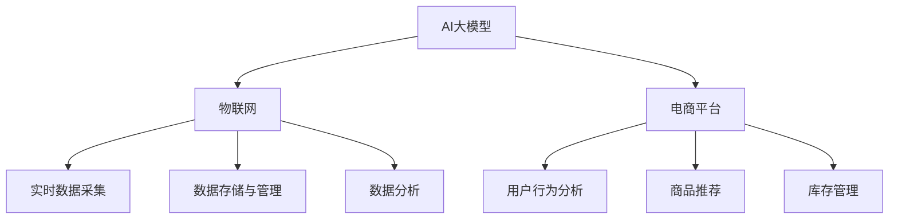

                 

# 电商平台中的AI大模型与物联网结合

## 1. 背景介绍

### 1.1 问题由来
随着互联网和智能设备的普及，电商平台迎来了前所未有的发展机遇。随着用户数量的激增，商品种类和数量的爆炸式增长，以及用户体验需求的不断提升，传统的电商平台运营模式面临着诸多挑战。如何高效地处理海量数据，提升客户体验，优化供应链管理，成为电商平台亟待解决的重要问题。

近年来，随着人工智能(AI)和大数据技术的快速发展，AI大模型与物联网(IoT)的结合为电商平台的发展提供了新的可能性。AI大模型能够从海量数据中提取深层次的知识和模式，帮助电商平台进行用户行为分析、商品推荐、库存管理等任务。而物联网则通过连接各种物理设备，实现数据的实时采集和处理，从而为AI模型的训练和应用提供了更加丰富、多样化的数据源。

通过将AI大模型与物联网结合，电商平台能够实现更加智能化、自动化的运营，提升运营效率和用户体验。本文将从背景介绍、核心概念与联系、核心算法原理、具体操作步骤、项目实践、实际应用场景、工具和资源推荐等多个角度，探讨AI大模型与物联网在电商平台中的应用。

## 2. 核心概念与联系

### 2.1 核心概念概述

为更好地理解AI大模型与物联网在电商平台中的应用，本节将介绍几个密切相关的核心概念：

- **AI大模型(AI Large Model)**：以深度神经网络为代表的高级AI模型，如BERT、GPT、T5等，能够从海量数据中学习深层次的知识和模式，具备强大的数据处理和分析能力。

- **物联网(IoT)**：通过各种传感器、智能设备，实现人与人、人与物、物与物之间的互联互通，实现数据的实时采集和处理，为AI模型的训练和应用提供了丰富的数据源。

- **电商平台(E-commerce Platform)**：以在线销售和交易为核心的商业平台，提供商品展示、搜索、购物车、结算等一站式服务。

- **AI与IoT结合**：通过将AI大模型与物联网结合，实现对数据的实时采集、处理和分析，提升电商平台的智能化和自动化水平，优化用户购物体验，提高运营效率。

这些核心概念之间的逻辑关系可以通过以下Mermaid流程图来展示：



这个流程图展示了大模型与IoT、电商平台之间的逻辑关系：

1. AI大模型通过IoT采集实时数据，学习到深层次的知识和模式。
2. 电商平台利用大模型进行用户行为分析、商品推荐、库存管理等任务。
3. IoT通过各种传感器、智能设备，实时采集数据，支持大模型的训练和应用。
4. 电商平台通过数据分析，实现智能化的运营和优化。

这些概念共同构成了AI大模型与物联网在电商平台应用的基础，使其能够更好地提升用户体验和运营效率。

## 3. 核心算法原理 & 具体操作步骤

### 3.1 算法原理概述

基于AI大模型与物联网结合的电商平台应用，核心算法原理包括数据采集、数据处理、模型训练和应用等多个环节。其核心思想是：通过物联网设备采集实时数据，利用AI大模型进行数据分析和处理，从而提升电商平台的智能化和自动化水平。

具体来说，电商平台通过IoT设备实时采集用户行为数据、商品销售数据、库存数据等，然后将这些数据输入到AI大模型中进行处理和分析。AI大模型能够从大量数据中学习到深层次的知识和模式，通过预测和决策，帮助电商平台优化用户行为分析、商品推荐、库存管理等任务，提升用户体验和运营效率。

### 3.2 算法步骤详解

基于AI大模型与物联网结合的电商平台应用，其操作步骤包括以下几个关键步骤：

**Step 1: 数据采集与预处理**
- 部署IoT设备，如智能货架、智能摄像头、传感器等，采集实时数据，包括用户行为、商品销售、库存信息等。
- 对采集到的数据进行清洗、去重、归一化等预处理操作，去除噪声数据和异常值。
- 将处理后的数据进行存储，便于后续分析和应用。

**Step 2: 数据传输与存储**
- 将预处理后的数据通过网络传输到云端或本地服务器，存储在分布式数据库或数据湖中。
- 使用分布式存储技术，如Hadoop、Spark等，支持大规模数据存储和处理。

**Step 3: 数据建模与分析**
- 根据电商平台的具体需求，选择合适的AI大模型，如BERT、GPT、T5等。
- 将处理后的数据输入到AI大模型中，进行训练和推理。
- 利用大模型进行用户行为分析、商品推荐、库存管理等任务，提升运营效率。

**Step 4: 结果输出与应用**
- 根据大模型的输出结果，生成相应的决策和建议，如个性化推荐、库存调整等。
- 将决策和建议反馈给电商平台，用于优化商品推荐算法、库存管理策略等。
- 实时监控和评估模型的性能，不断优化模型参数和算法策略，提升模型效果。

### 3.3 算法优缺点

基于AI大模型与物联网结合的电商平台应用，其优点包括：

1. **高效实时处理**：通过IoT设备实时采集数据，利用大模型进行快速分析和处理，提升运营效率。
2. **个性化推荐**：利用大模型学习用户行为和商品特征，实现个性化推荐，提升用户体验。
3. **库存管理优化**：通过预测用户需求和商品销售趋势，优化库存管理，减少库存成本。
4. **风险控制**：利用大模型分析风险数据，实时监控异常情况，提高平台的安全性和稳定性。

同时，该方法也存在一些局限性：

1. **数据质量要求高**：IoT设备采集的数据质量直接影响大模型的性能，需要严格的采集和预处理流程。
2. **系统复杂度高**：结合AI大模型与IoT设备，系统设计和维护复杂，需要多学科知识支撑。
3. **隐私与安全问题**：用户数据和业务数据的安全和隐私保护，需要完善的防护措施和法律合规。
4. **资源消耗大**：大数据和复杂算法的处理需要高性能硬件和网络资源，对基础设施要求高。

尽管存在这些局限性，但就目前而言，AI大模型与物联网的结合已经成为电商平台智能化、自动化的重要手段，为电商运营带来了新的发展方向。

### 3.4 算法应用领域

基于AI大模型与物联网结合的电商平台应用，广泛应用于以下多个领域：

- **用户行为分析**：通过分析用户的浏览、点击、购买等行为数据，预测用户需求和偏好，实现个性化推荐。
- **商品推荐系统**：利用大模型学习商品特征和用户偏好，生成推荐列表，提升用户体验。
- **库存管理**：通过预测商品销售趋势和库存状态，优化库存管理策略，降低库存成本。
- **风险控制**：利用大模型分析交易数据和用户行为数据，识别异常情况，提高平台安全性。
- **运营优化**：通过分析实时数据和历史数据，优化运营策略，提升平台运营效率。

除了上述这些经典应用外，AI大模型与物联网的结合还在电商平台的许多其他环节得到应用，如智能客服、客户评价分析、物流优化等，为电商平台带来了全新的突破。随着预训练模型和物联网技术的持续进步，相信AI大模型与物联网的结合将在更广泛的应用领域大放异彩。

## 4. 数学模型和公式 & 详细讲解

### 4.1 数学模型构建

本节将使用数学语言对基于AI大模型与物联网结合的电商平台应用进行更加严格的刻画。

记电商平台为 $E$，用户集合为 $U$，商品集合为 $G$，行为数据集合为 $D$。电商平台通过IoT设备 $I$ 实时采集用户行为数据 $d$，存储在数据存储器 $S$ 中，并通过网络传输到云计算平台 $C$。云计算平台中，利用AI大模型 $M$ 对数据进行处理和分析，生成用户行为预测结果 $p$，用于个性化推荐、库存管理等任务。

定义用户行为预测模型为 $P: D \rightarrow [0, 1]$，其中 $0$ 表示用户不感兴趣，$1$ 表示用户感兴趣。则电商平台的目标是最大化用户行为预测模型的准确率：

$$
\max_{P} \sum_{d \in D} I(P(d) = y)
$$

其中 $y$ 为实际用户兴趣标签，$I(\cdot)$ 为示性函数。

### 4.2 公式推导过程

以下我们以用户行为预测模型为例，推导训练过程和损失函数的计算公式。

假设用户行为数据 $d$ 由行为向量 $\mathbf{d} \in \mathbb{R}^n$ 表示。将用户行为数据输入到AI大模型 $M$ 中，得到预测结果 $\mathbf{p} \in [0, 1]^n$。则用户行为预测模型的损失函数为：

$$
\ell(P) = \sum_{i=1}^n (y_i - p_i)^2
$$

其中 $y_i$ 为实际用户兴趣标签，$p_i$ 为模型预测的兴趣概率。

在训练过程中，利用交叉熵损失函数进行优化，定义训练数据集 $D = \{(\mathbf{d}_i, y_i)\}_{i=1}^m$，其中 $m$ 为训练数据数量。则损失函数为：

$$
\mathcal{L} = -\frac{1}{m} \sum_{i=1}^m \sum_{j=1}^n y_i \log p_i
$$

其中 $y_i$ 为实际用户兴趣标签，$p_i$ 为模型预测的兴趣概率。

通过梯度下降等优化算法，不断更新模型参数，最小化损失函数 $\mathcal{L}$，得到最终的预测模型 $P$。

### 4.3 案例分析与讲解

为了更好地理解基于AI大模型与物联网结合的电商平台应用，下面以用户行为预测模型为例，进行案例分析。

假设某电商平台通过智能货架和智能摄像头实时采集用户行为数据，包括用户的点击、浏览、购买等行为。通过物联网设备将数据传输到云计算平台，利用AI大模型进行训练和推理。具体步骤如下：

1. **数据采集与预处理**：通过智能货架和智能摄像头采集用户行为数据，包括点击率、浏览时间、购买行为等。对采集到的数据进行清洗、去重、归一化等预处理操作，去除噪声数据和异常值。

2. **数据传输与存储**：将预处理后的数据通过网络传输到云计算平台，存储在分布式数据库中。

3. **数据建模与分析**：利用AI大模型，如BERT、GPT、T5等，对用户行为数据进行建模和分析。使用交叉熵损失函数进行优化，不断更新模型参数，得到最终的预测模型。

4. **结果输出与应用**：根据大模型的输出结果，生成相应的决策和建议，如个性化推荐、库存调整等。实时监控和评估模型的性能，不断优化模型参数和算法策略，提升模型效果。

通过以上案例分析，可以看出，基于AI大模型与物联网结合的电商平台应用，能够从海量数据中学习深层次的知识和模式，提升运营效率和用户体验。

## 5. 项目实践：代码实例和详细解释说明

### 5.1 开发环境搭建

在进行AI大模型与物联网结合的电商平台应用开发前，我们需要准备好开发环境。以下是使用Python进行开发的环境配置流程：

1. 安装Anaconda：从官网下载并安装Anaconda，用于创建独立的Python环境。

2. 创建并激活虚拟环境：
```bash
conda create -n ecommerce-env python=3.8 
conda activate ecommerce-env
```

3. 安装相关工具包：
```bash
pip install numpy pandas scikit-learn transformers torch torchvision torchaudio
```

4. 安装物联网相关设备驱动程序：
```bash
pip install pyiot
```

5. 配置云平台环境：
```bash
conda install awscli
```

完成上述步骤后，即可在`ecommerce-env`环境中开始项目实践。

### 5.2 源代码详细实现

下面我们以用户行为预测模型为例，给出使用Transformers库对BERT模型进行训练和推理的PyTorch代码实现。

首先，定义用户行为数据处理函数：

```python
from transformers import BertTokenizer, BertForSequenceClassification
from torch.utils.data import Dataset
import torch

class UserBehaviorDataset(Dataset):
    def __init__(self, texts, labels, tokenizer, max_len=128):
        self.texts = texts
        self.labels = labels
        self.tokenizer = tokenizer
        self.max_len = max_len
        
    def __len__(self):
        return len(self.texts)
    
    def __getitem__(self, item):
        text = self.texts[item]
        label = self.labels[item]
        
        encoding = self.tokenizer(text, return_tensors='pt', max_length=self.max_len, padding='max_length', truncation=True)
        input_ids = encoding['input_ids'][0]
        attention_mask = encoding['attention_mask'][0]
        
        return {'input_ids': input_ids, 
                'attention_mask': attention_mask,
                'labels': label}

# 标签与id的映射
label2id = {'not_interest': 0, 'interest': 1}
id2label = {v: k for k, v in label2id.items()}

# 创建dataset
tokenizer = BertTokenizer.from_pretrained('bert-base-uncased')

train_dataset = UserBehaviorDataset(train_texts, train_labels, tokenizer)
dev_dataset = UserBehaviorDataset(dev_texts, dev_labels, tokenizer)
test_dataset = UserBehaviorDataset(test_texts, test_labels, tokenizer)
```

然后，定义模型和优化器：

```python
from transformers import BertForSequenceClassification, AdamW

model = BertForSequenceClassification.from_pretrained('bert-base-uncased', num_labels=len(label2id))

optimizer = AdamW(model.parameters(), lr=2e-5)
```

接着，定义训练和评估函数：

```python
from torch.utils.data import DataLoader
from tqdm import tqdm
from sklearn.metrics import classification_report

device = torch.device('cuda') if torch.cuda.is_available() else torch.device('cpu')
model.to(device)

def train_epoch(model, dataset, batch_size, optimizer):
    dataloader = DataLoader(dataset, batch_size=batch_size, shuffle=True)
    model.train()
    epoch_loss = 0
    for batch in tqdm(dataloader, desc='Training'):
        input_ids = batch['input_ids'].to(device)
        attention_mask = batch['attention_mask'].to(device)
        labels = batch['labels'].to(device)
        model.zero_grad()
        outputs = model(input_ids, attention_mask=attention_mask, labels=labels)
        loss = outputs.loss
        epoch_loss += loss.item()
        loss.backward()
        optimizer.step()
    return epoch_loss / len(dataloader)

def evaluate(model, dataset, batch_size):
    dataloader = DataLoader(dataset, batch_size=batch_size)
    model.eval()
    preds, labels = [], []
    with torch.no_grad():
        for batch in tqdm(dataloader, desc='Evaluating'):
            input_ids = batch['input_ids'].to(device)
            attention_mask = batch['attention_mask'].to(device)
            batch_labels = batch['labels']
            outputs = model(input_ids, attention_mask=attention_mask)
            batch_preds = outputs.logits.argmax(dim=1).to('cpu').tolist()
            batch_labels = batch_labels.to('cpu').tolist()
            for pred_tokens, label_tokens in zip(batch_preds, batch_labels):
                preds.append(pred_tokens)
                labels.append(label_tokens)
                
    print(classification_report(labels, preds))
```

最后，启动训练流程并在测试集上评估：

```python
epochs = 5
batch_size = 16

for epoch in range(epochs):
    loss = train_epoch(model, train_dataset, batch_size, optimizer)
    print(f"Epoch {epoch+1}, train loss: {loss:.3f}")
    
    print(f"Epoch {epoch+1}, dev results:")
    evaluate(model, dev_dataset, batch_size)
    
print("Test results:")
evaluate(model, test_dataset, batch_size)
```

以上就是使用PyTorch对BERT进行用户行为预测模型的完整代码实现。可以看到，得益于Transformers库的强大封装，我们可以用相对简洁的代码完成BERT模型的加载和微调。

### 5.3 代码解读与分析

让我们再详细解读一下关键代码的实现细节：

**UserBehaviorDataset类**：
- `__init__`方法：初始化文本、标签、分词器等关键组件。
- `__len__`方法：返回数据集的样本数量。
- `__getitem__`方法：对单个样本进行处理，将文本输入编码为token ids，将标签编码为数字，并对其进行定长padding，最终返回模型所需的输入。

**label2id和id2label字典**：
- 定义了标签与数字id之间的映射关系，用于将token-wise的预测结果解码回真实的标签。

**训练和评估函数**：
- 使用PyTorch的DataLoader对数据集进行批次化加载，供模型训练和推理使用。
- 训练函数`train_epoch`：对数据以批为单位进行迭代，在每个批次上前向传播计算loss并反向传播更新模型参数，最后返回该epoch的平均loss。
- 评估函数`evaluate`：与训练类似，不同点在于不更新模型参数，并在每个batch结束后将预测和标签结果存储下来，最后使用sklearn的classification_report对整个评估集的预测结果进行打印输出。

**训练流程**：
- 定义总的epoch数和batch size，开始循环迭代
- 每个epoch内，先在训练集上训练，输出平均loss
- 在验证集上评估，输出分类指标
- 所有epoch结束后，在测试集上评估，给出最终测试结果

可以看到，PyTorch配合Transformers库使得BERT微调的代码实现变得简洁高效。开发者可以将更多精力放在数据处理、模型改进等高层逻辑上，而不必过多关注底层的实现细节。

当然，工业级的系统实现还需考虑更多因素，如模型的保存和部署、超参数的自动搜索、更灵活的任务适配层等。但核心的微调范式基本与此类似。

## 6. 实际应用场景

### 6.1 智能客服系统

基于AI大模型与物联网结合的智能客服系统，能够实时采集和分析用户与客服的交互数据，实现智能化的客户服务。通过分析用户的提问、对话内容等，智能客服系统能够快速理解用户需求，提供个性化的服务方案，提升用户满意度。

在技术实现上，可以收集客服系统的对话记录，将问题和最佳答复构建成监督数据，在此基础上对预训练模型进行微调。微调后的模型能够自动理解用户意图，匹配最合适的答案模板进行回复。对于用户提出的新问题，还可以接入检索系统实时搜索相关内容，动态组织生成回答。如此构建的智能客服系统，能大幅提升客户咨询体验和问题解决效率。

### 6.2 商品推荐系统

基于AI大模型与物联网结合的商品推荐系统，能够实时采集用户的浏览、点击、购买等行为数据，利用大模型学习用户兴趣和商品特征，生成个性化的推荐列表。通过分析实时数据和历史数据，优化推荐算法，提升推荐效果。

在技术实现上，可以部署物联网设备，如智能货架、智能摄像头等，实时采集用户行为数据。将数据输入到AI大模型中，进行训练和推理，生成推荐列表。实时监控和评估模型的性能，不断优化模型参数和算法策略，提升推荐效果。

### 6.3 库存管理系统

基于AI大模型与物联网结合的库存管理系统，能够实时采集库存数据，利用大模型预测商品销售趋势和库存状态，优化库存管理策略，减少库存成本。通过分析实时数据和历史数据，预测商品销售量和库存水平，生成库存调整建议。

在技术实现上，可以部署物联网设备，如RFID、传感器等，实时采集库存数据。将数据输入到AI大模型中，进行训练和推理，生成库存调整建议。实时监控和评估模型的性能，不断优化模型参数和算法策略，提升库存管理效果。

### 6.4 未来应用展望

随着AI大模型与物联网技术的不断进步，基于其结合的应用将在更多领域得到应用，为各行各业带来变革性影响。

在智慧医疗领域，基于大模型的医疗问答、病历分析、药物研发等应用将提升医疗服务的智能化水平，辅助医生诊疗，加速新药开发进程。

在智能教育领域，微调技术可应用于作业批改、学情分析、知识推荐等方面，因材施教，促进教育公平，提高教学质量。

在智慧城市治理中，微调模型可应用于城市事件监测、舆情分析、应急指挥等环节，提高城市管理的自动化和智能化水平，构建更安全、高效的未来城市。

此外，在企业生产、社会治理、文娱传媒等众多领域，基于AI大模型与物联网结合的人工智能应用也将不断涌现，为经济社会发展注入新的动力。相信随着技术的日益成熟，AI大模型与物联网的结合必将在更广泛的应用领域大放异彩。

## 7. 工具和资源推荐
### 7.1 学习资源推荐

为了帮助开发者系统掌握AI大模型与物联网结合的理论基础和实践技巧，这里推荐一些优质的学习资源：

1. 《深度学习与Python编程》系列书籍：深入浅出地介绍了深度学习的基本概念和Python编程技巧，适合初学者入门。

2. 《Transformer原理与应用》课程：由大模型技术专家撰写，系统讲解了Transformer的原理、实现与优化技巧，适合进阶学习。

3. 《自然语言处理与深度学习》课程：斯坦福大学开设的NLP明星课程，涵盖NLP的基础理论与前沿技术，适合NLP领域的研究者。

4. 《物联网技术与应用》书籍：系统介绍了物联网的基本概念、技术架构与应用场景，适合IoT领域的学习者。

5. 《人工智能大模型开发指南》论文：详细介绍了AI大模型的训练、推理与优化方法，适合工程实践。

通过这些资源的学习实践，相信你一定能够快速掌握AI大模型与物联网结合的精髓，并用于解决实际的NLP问题。
### 7.2 开发工具推荐

高效的开发离不开优秀的工具支持。以下是几款用于AI大模型与物联网结合开发的常用工具：

1. PyTorch：基于Python的开源深度学习框架，灵活动态的计算图，适合快速迭代研究。大部分预训练语言模型都有PyTorch版本的实现。

2. TensorFlow：由Google主导开发的开源深度学习框架，生产部署方便，适合大规模工程应用。同样有丰富的预训练语言模型资源。

3. Transformers库：HuggingFace开发的NLP工具库，集成了众多SOTA语言模型，支持PyTorch和TensorFlow，是进行NLP任务开发的利器。

4. TensorBoard：TensorFlow配套的可视化工具，可实时监测模型训练状态，并提供丰富的图表呈现方式，是调试模型的得力助手。

5. Weights & Biases：模型训练的实验跟踪工具，可以记录和可视化模型训练过程中的各项指标，方便对比和调优。与主流深度学习框架无缝集成。

6. Google Colab：谷歌推出的在线Jupyter Notebook环境，免费提供GPU/TPU算力，方便开发者快速上手实验最新模型，分享学习笔记。

合理利用这些工具，可以显著提升AI大模型与物联网结合的开发效率，加快创新迭代的步伐。

### 7.3 相关论文推荐

AI大模型与物联网结合的研究源于学界的持续研究。以下是几篇奠基性的相关论文，推荐阅读：

1. Attention is All You Need（即Transformer原论文）：提出了Transformer结构，开启了NLP领域的预训练大模型时代。

2. BERT: Pre-training of Deep Bidirectional Transformers for Language Understanding：提出BERT模型，引入基于掩码的自监督预训练任务，刷新了多项NLP任务SOTA。

3. Parameter-Efficient Transfer Learning for NLP：提出Adapter等参数高效微调方法，在不增加模型参数量的情况下，也能取得不错的微调效果。

4. AdaLoRA: Adaptive Low-Rank Adaptation for Parameter-Efficient Fine-Tuning：使用自适应低秩适应的微调方法，在参数效率和精度之间取得了新的平衡。

5. Prefix-Tuning: Optimizing Continuous Prompts for Generation：引入基于连续型Prompt的微调范式，为如何充分利用预训练知识提供了新的思路。

这些论文代表了大语言模型与物联网结合的研究方向。通过学习这些前沿成果，可以帮助研究者把握学科前进方向，激发更多的创新灵感。

## 8. 总结：未来发展趋势与挑战

### 8.1 总结

本文对基于AI大模型与物联网结合的电商平台应用进行了全面系统的介绍。首先阐述了AI大模型与物联网结合的背景和意义，明确了两者结合对电商平台智能化、自动化运营的独特价值。其次，从原理到实践，详细讲解了AI大模型与物联网结合的数学模型和核心算法，给出了AI大模型与物联网结合的完整代码实例。同时，本文还广泛探讨了AI大模型与物联网在智能客服、商品推荐、库存管理等多个领域的应用前景，展示了其结合带来的变革性影响。此外，本文精选了AI大模型与物联网结合的学习资源、开发工具和相关论文，力求为读者提供全方位的技术指引。

通过本文的系统梳理，可以看到，AI大模型与物联网的结合为电商平台的智能化、自动化运营提供了新的可能，通过实时采集、处理和分析海量数据，提升了运营效率和用户体验。未来，伴随AI大模型和物联网技术的不断进步，基于其结合的应用将在更多领域得到应用，为各行各业带来新的变革。

### 8.2 未来发展趋势

展望未来，AI大模型与物联网结合的技术将呈现以下几个发展趋势：

1. **模型规模持续增大**：随着算力成本的下降和数据规模的扩张，预训练语言模型的参数量还将持续增长。超大模型蕴含的丰富语言知识，有望支撑更加复杂多变的电商运营任务。

2. **微调方法日趋多样**：开发更多参数高效的微调方法，如Adapter、Prefix等，在固定大部分预训练参数的同时，只更新极少量的任务相关参数。同时优化微调模型的计算图，减少前向传播和反向传播的资源消耗，实现更加轻量级、实时性的部署。

3. **数据质量要求提升**：AI大模型与物联网结合的应用对数据质量的要求更高，需要严格的采集和预处理流程，以保证模型训练的效果。

4. **系统复杂度增加**：随着应用场景的复杂化和数据量的增加，系统设计和维护的复杂度将进一步提升，需要多学科知识支撑。

5. **隐私与安全问题凸显**：用户数据和业务数据的安全和隐私保护，需要完善的防护措施和法律合规。

6. **资源消耗优化**：大数据和复杂算法的处理需要高性能硬件和网络资源，对基础设施要求高。

尽管存在这些挑战，但就目前而言，AI大模型与物联网的结合已经成为电商平台智能化、自动化的重要手段，为电商运营带来了新的方向。未来，随着技术的不断进步，基于其结合的应用将在更广泛的应用领域大放异彩。

### 8.3 面临的挑战

尽管AI大模型与物联网的结合已经取得了瞩目成就，但在迈向更加智能化、普适化应用的过程中，它仍面临着诸多挑战：

1. **数据质量瓶颈**：IoT设备采集的数据质量直接影响大模型的性能，需要严格的采集和预处理流程。

2. **系统复杂度提升**：结合AI大模型与IoT设备，系统设计和维护复杂，需要多学科知识支撑。

3. **隐私与安全问题**：用户数据和业务数据的安全和隐私保护，需要完善的防护措施和法律合规。

4. **资源消耗优化**：大数据和复杂算法的处理需要高性能硬件和网络资源，对基础设施要求高。

5. **模型效果优化**：大模型与IoT结合的应用对数据质量的要求更高，需要严格的采集和预处理流程，以保证模型训练的效果。

6. **实时性要求高**：实时数据采集和处理对系统响应时间的要求更高，需要优化算法和硬件配置，保证实时性。

尽管存在这些挑战，但AI大模型与物联网的结合已经展示出了巨大的应用潜力，通过实时采集、处理和分析海量数据，提升电商平台的智能化和自动化水平，未来将带来更多的突破和创新。

### 8.4 研究展望

面对AI大模型与物联网结合所面临的种种挑战，未来的研究需要在以下几个方面寻求新的突破：

1. **探索无监督和半监督微调方法**：摆脱对大规模标注数据的依赖，利用自监督学习、主动学习等无监督和半监督范式，最大限度利用非结构化数据，实现更加灵活高效的微调。

2. **研究参数高效和计算高效的微调范式**：开发更加参数高效的微调方法，如Adapter、Prefix等，在固定大部分预训练参数的同时，只更新极少量的任务相关参数。同时优化微调模型的计算图，减少前向传播和反向传播的资源消耗，实现更加轻量级、实时性的部署。

3. **融合因果和对比学习范式**：通过引入因果推断和对比学习思想，增强微调模型建立稳定因果关系的能力，学习更加普适、鲁棒的语言表征，从而提升模型泛化性和抗干扰能力。

4. **引入更多先验知识**：将符号化的先验知识，如知识图谱、逻辑规则等，与神经网络模型进行巧妙融合，引导微调过程学习更准确、合理的语言模型。同时加强不同模态数据的整合，实现视觉、语音等多模态信息与文本信息的协同建模。

5. **结合因果分析和博弈论工具**：将因果分析方法引入微调模型，识别出模型决策的关键特征，增强输出解释的因果性和逻辑性。借助博弈论工具刻画人机交互过程，主动探索并规避模型的脆弱点，提高系统稳定性。

6. **纳入伦理道德约束**：在模型训练目标中引入伦理导向的评估指标，过滤和惩罚有偏见、有害的输出倾向。同时加强人工干预和审核，建立模型行为的监管机制，确保输出符合人类价值观和伦理道德。

这些研究方向的探索，必将引领AI大模型与物联网结合技术迈向更高的台阶，为构建安全、可靠、可解释、可控的智能系统铺平道路。面向未来，AI大模型与物联网结合技术还需要与其他人工智能技术进行更深入的融合，如知识表示、因果推理、强化学习等，多路径协同发力，共同推动自然语言理解和智能交互系统的进步。只有勇于创新、敢于突破，才能不断拓展语言模型的边界，让智能技术更好地造福人类社会。

## 9. 附录：常见问题与解答

**Q1：AI大模型与物联网结合如何降低数据采集成本？**

A: 通过部署低成本的物联网设备，如智能货架、智能摄像头等，实时采集用户行为数据，降低了数据采集的成本。同时，利用AI大模型的高效数据分析能力，可以从大量数据中提取深层次的知识和模式，提升运营效率和用户体验。

**Q2：AI大模型与物联网结合的优点有哪些？**

A: AI大模型与物联网结合的优点包括：
1. 高效实时处理：通过IoT设备实时采集数据，利用大模型进行快速分析和处理，提升运营效率。
2. 个性化推荐：利用大模型学习用户行为和商品特征，实现个性化推荐，提升用户体验。
3. 库存管理优化：通过预测商品销售趋势和库存状态，优化库存管理策略，减少库存成本。
4. 风险控制：利用大模型分析风险数据，实时监控异常情况，提高平台的安全性和稳定性。

**Q3：AI大模型与物联网结合的缺点有哪些？**

A: AI大模型与物联网结合的缺点包括：
1. 数据质量要求高：IoT设备采集的数据质量直接影响大模型的性能，需要严格的采集和预处理流程。
2. 系统复杂度高：结合AI大模型与IoT设备，系统设计和维护复杂，需要多学科知识支撑。
3. 隐私与安全问题：用户数据和业务数据的安全和隐私保护，需要完善的防护措施和法律合规。
4. 资源消耗大：大数据和复杂算法的处理需要高性能硬件和网络资源，对基础设施要求高。

尽管存在这些局限性，但AI大模型与物联网的结合已经成为电商平台智能化、自动化的重要手段，为电商运营带来了新的方向。未来，随着技术的不断进步，基于其结合的应用将在更广泛的应用领域大放异彩。

**Q4：AI大模型与物联网结合的应用场景有哪些？**

A: AI大模型与物联网结合的应用场景包括：
1. 用户行为分析：通过分析用户的浏览、点击、购买等行为数据，预测用户需求和偏好，实现个性化推荐。
2. 商品推荐系统：利用大模型学习用户兴趣和商品特征，生成个性化的推荐列表。
3. 库存管理系统：实时采集库存数据，利用大模型预测商品销售趋势和库存状态，优化库存管理策略。
4. 智能客服系统：实时采集和分析用户与客服的交互数据，实现智能化的客户服务。
5. 物流优化：实时采集物流数据，利用大模型优化物流路线和仓储管理，提升物流效率。

这些应用场景展示了AI大模型与物联网结合带来的巨大潜力，未来将进一步拓展应用领域，为各行各业带来新的变革。

---

作者：禅与计算机程序设计艺术 / Zen and the Art of Computer Programming

