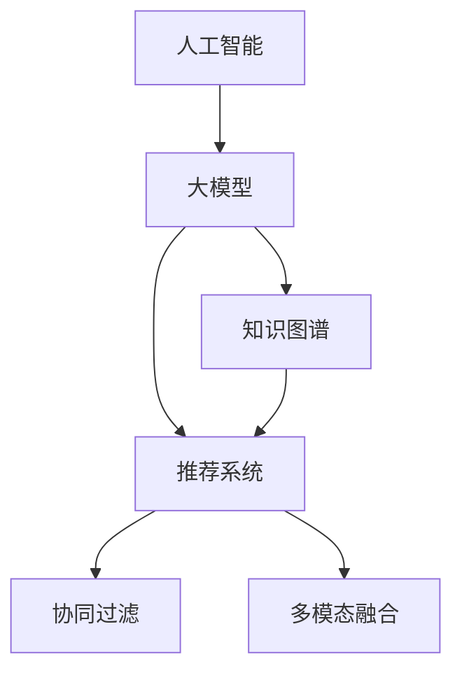

                 

# 电商平台中的AI大模型与知识图谱结合

> 关键词：人工智能,大模型,电商平台,知识图谱,推荐系统,商品匹配,语义搜索,个性化推荐,协同过滤

## 1. 背景介绍

### 1.1 问题由来
电商平台已经成为人们日常生活的重要组成部分，其推荐的商品需要高度个性化和高效准确。传统的推荐系统大多依赖于基于协同过滤、内容特征分析等方法，但在大规模、实时推荐时，其效果往往不够理想。为了应对这一挑战，AI大模型与知识图谱的结合成为热门的研究方向。

### 1.2 问题核心关键点
AI大模型与知识图谱结合的核心在于利用大模型的语言理解能力和知识图谱的结构化信息，从多个维度提升电商推荐的精准度和效率。主要关键点包括：
- 利用大模型进行语义搜索，构建精准的商品匹配模型。
- 融合知识图谱结构化信息，提高推荐系统的泛化能力。
- 应用协同过滤等传统推荐技术，结合用户行为数据，提升个性化推荐效果。
- 采用多模态融合技术，整合文本、图像、视频等多类型信息，丰富商品表征。

### 1.3 问题研究意义
AI大模型与知识图谱结合的研究对于电商平台推荐系统具有重要意义：
1. **提升推荐精准度**：通过多维度信息融合，构建更加全面、深入的推荐模型，提升用户体验和满意度。
2. **增强系统鲁棒性**：融合知识图谱的结构化信息，使推荐系统对噪声数据、低质量商品信息有更强的适应能力。
3. **提高推荐效率**：利用大模型的快速查询和匹配能力，实现更高效的推荐服务。
4. **实现跨领域迁移**：大模型的泛化能力使得推荐系统能够跨领域迁移，拓展到更多电商应用场景。
5. **增强系统可解释性**：知识图谱提供的结构化信息可帮助理解推荐决策，提升推荐系统的透明性和可解释性。

## 2. 核心概念与联系

### 2.1 核心概念概述

为更好地理解AI大模型与知识图谱结合的推荐系统，本节将介绍几个密切相关的核心概念：

- **人工智能(AI)**：通过模拟人类智能行为，实现问题求解和决策优化的技术体系。
- **大模型(Large Model)**：以Transformer为代表的深度神经网络模型，参数量巨大，能够处理复杂的自然语言理解任务。
- **知识图谱(Knowledge Graph)**：结构化的语义知识库，用于描述实体之间的关系，支持高效的语义搜索和推理。
- **推荐系统(Recommendation System)**：通过算法推荐商品或内容的技术体系，广泛应用于电商、视频、音乐等平台。
- **协同过滤(Collaborative Filtering)**：利用用户之间的相似性进行推荐，常用于处理缺乏评分数据的场景。
- **多模态融合(Multimodal Fusion)**：整合文本、图像、音频等多种数据源，构建更全面的用户和商品表示。

这些核心概念之间的逻辑关系可以通过以下Mermaid流程图来展示：



这个流程图展示了人工智能、大模型、知识图谱、推荐系统、协同过滤和多模态融合之间的联系和互动关系：

1. 人工智能提供整体的框架和指导思想。
2. 大模型和知识图谱作为核心组件，分别从语义理解和结构化信息两个维度提升推荐系统的能力。
3. 推荐系统是目标应用，包含协同过滤和多模态融合等子技术，最终实现个性化推荐。

## 3. 核心算法原理 & 具体操作步骤
### 3.1 算法原理概述

AI大模型与知识图谱结合的推荐系统，本质上是一个多模态融合的深度学习模型。其核心思想是：
- 利用大模型的语言理解和生成能力，进行商品语义匹配。
- 利用知识图谱的结构化信息，增强推荐模型的泛化能力。
- 结合协同过滤等传统推荐技术，提高推荐的个性化程度。
- 通过多模态融合，整合文本、图像、视频等多类型信息，丰富商品表示。

形式化地，假设推荐系统由三个组件组成：
1. **语义匹配模块**：利用大模型对商品标题、描述等文本信息进行语义匹配。
2. **知识推理模块**：利用知识图谱进行商品之间的关系推理。
3. **个性化推荐模块**：结合用户行为数据，应用协同过滤等技术，进行个性化推荐。

定义语义匹配模块的损失函数为 $\ell_s$，知识推理模块的损失函数为 $\ell_k$，个性化推荐模块的损失函数为 $\ell_r$。则在训练时，总体损失函数 $\mathcal{L}$ 为：

$$
\mathcal{L} = \alpha_s \ell_s + \alpha_k \ell_k + \alpha_r \ell_r
$$

其中 $\alpha_s, \alpha_k, \alpha_r$ 为每个模块的权重，用于平衡各模块的影响。

### 3.2 算法步骤详解

AI大模型与知识图谱结合的推荐系统，通常包含以下几个关键步骤：

**Step 1: 数据准备**
- 收集电商平台的商品数据、用户行为数据和知识图谱数据。
- 预处理数据，包括清洗、分词、向量化等操作。

**Step 2: 构建模型**
- 选择合适的深度神经网络模型作为大模型，如BERT、GPT等。
- 构建知识图谱的实体关系图，用于知识推理。
- 设计多模态融合的推荐模型架构，结合语义匹配和知识推理。

**Step 3: 模型训练**
- 使用预训练的大模型和知识图谱进行联合训练。
- 结合协同过滤等传统推荐技术，进行多轮训练。
- 优化模型参数，最小化总体损失函数。

**Step 4: 模型评估与优化**
- 在验证集上评估模型的推荐效果，调整参数。
- 应用A/B测试，比较不同模型的效果。
- 定期更新模型，适应新数据和新用户。

**Step 5: 模型部署与监控**
- 将训练好的模型部署到线上环境。
- 实时监控推荐系统的性能，记录指标如点击率、转化率等。
- 设置告警阈值，及时发现和解决系统问题。

### 3.3 算法优缺点

AI大模型与知识图谱结合的推荐系统具有以下优点：
1. **高精度**：利用大模型的语义匹配能力和知识图谱的结构化信息，能够提高推荐的精准度。
2. **泛化能力强**：结合知识图谱的多样化关系推理，提升模型对新商品和用户的适应能力。
3. **高效实时**：大模型的快速查询和匹配能力，支持实时推荐服务。
4. **可解释性强**：知识图谱提供的结构化信息，增强了推荐系统的透明性和可解释性。

同时，该方法也存在一些局限性：
1. **计算资源需求高**：大模型和知识图谱的构建需要大量计算资源，部署和维护成本较高。
2. **数据复杂度高**：知识图谱的构建需要高质量的语义标注数据，数据获取和处理难度较大。
3. **模型复杂度高**：多模态融合和复杂关系推理，使得模型结构复杂，训练难度增加。
4. **维护难度高**：知识图谱的动态更新和维护需要持续的技术支持。

尽管存在这些局限性，但就目前而言，AI大模型与知识图谱结合的推荐系统仍是大规模电商推荐的重要方法。未来相关研究的重点在于如何降低计算和数据复杂度，提升系统的灵活性和适应性，同时兼顾可解释性和伦理安全性等因素。

### 3.4 算法应用领域

基于AI大模型与知识图谱结合的推荐系统，已经在电商推荐、社交网络、视频推荐等多个领域得到广泛应用，取得了显著效果。以下是几个典型应用场景：

- **电商平台推荐**：利用大模型的语义匹配能力和知识图谱的实体关系推理，构建精准的商品推荐系统。
- **社交网络推荐**：结合用户行为数据和知识图谱的结构化信息，提供个性化朋友推荐。
- **视频推荐系统**：通过整合视频内容和知识图谱的信息，进行精准的视频内容推荐。
- **音乐推荐**：利用大模型的语义理解和知识图谱的关系推理，提升音乐推荐的多样性和精准度。

除了上述这些经典应用外，AI大模型与知识图谱结合的方法也被创新性地应用到更多场景中，如智能客服、智能家居、智能健康等，为各行各业带来了新的智能化解决方案。随着技术的不断进步，相信该方法将在更多领域得到应用，推动AI技术向更深层次和更广泛的方向发展。

## 4. 数学模型和公式 & 详细讲解  
### 4.1 数学模型构建

本节将使用数学语言对AI大模型与知识图谱结合的推荐系统进行更加严格的刻画。

记大模型为 $M_{\theta}$，其中 $\theta$ 为模型参数。假设知识图谱中实体为 $e$，关系为 $r$，图谱节点间的权重为 $w_{e,r}$。商品节点的语义表示为 $s_i$，用户节点的行为表示为 $u_j$。

**语义匹配模块**：
- 使用大模型 $M_{\theta}$ 对商品标题、描述等文本信息进行语义匹配，得到商品节点的语义表示 $s_i$。
- 定义损失函数 $\ell_s$ 为：
  $$
  \ell_s = \frac{1}{N}\sum_{i=1}^N \|M_{\theta}(x_i) - s_i\|
  $$
  其中 $x_i$ 为商品文本信息。

**知识推理模块**：
- 利用知识图谱 $G=(E, R, W)$，构建实体关系图 $G_s$。
- 定义损失函数 $\ell_k$ 为：
  $$
  \ell_k = \frac{1}{N}\sum_{e_i, e_j} \|w_{e_i,r,e_j} - \hat{w}_{e_i,r,e_j}\|
  $$
  其中 $\hat{w}_{e_i,r,e_j}$ 为推理得到的节点间权重。

**个性化推荐模块**：
- 结合用户行为数据，应用协同过滤等技术，进行个性化推荐。
- 定义损失函数 $\ell_r$ 为：
  $$
  \ell_r = \frac{1}{N}\sum_{i,j} \|f_{i,j} - \hat{f}_{i,j}\|
  $$
  其中 $f_{i,j}$ 为实际推荐结果，$\hat{f}_{i,j}$ 为模型预测结果。

**总体损失函数**：
$$
\mathcal{L} = \alpha_s \ell_s + \alpha_k \ell_k + \alpha_r \ell_r
$$

### 4.2 公式推导过程

以电商平台推荐为例，推导模型的损失函数。

假设大模型对商品标题 $x_i$ 的语义表示为 $s_i$，知识图谱中实体 $e_i$ 和 $e_j$ 之间的关系为 $r$，对应的权重为 $w_{e_i,r,e_j}$。对于用户 $u_i$，其行为数据为 $u_i$。

**语义匹配损失**：
$$
\ell_s = \frac{1}{N}\sum_{i=1}^N \|M_{\theta}(x_i) - s_i\|
$$

**知识推理损失**：
根据知识图谱的结构，利用深度学习模型 $M_r$ 对关系进行推理，得到节点间权重 $\hat{w}_{e_i,r,e_j}$。

$$
\ell_k = \frac{1}{N}\sum_{e_i, e_j} \|w_{e_i,r,e_j} - \hat{w}_{e_i,r,e_j}\|
$$

**个性化推荐损失**：
根据协同过滤方法，利用用户行为数据 $u_i$ 和商品特征向量 $s_i$，构建用户与商品间的相似度矩阵 $S$，计算推荐结果 $f_{i,j}$ 和模型预测结果 $\hat{f}_{i,j}$。

$$
f_{i,j} = \text{sign}(S_{i,j}) \times \text{score}(s_i, s_j)
$$

$$
\ell_r = \frac{1}{N}\sum_{i,j} \|f_{i,j} - \hat{f}_{i,j}\|
$$

将上述三个损失函数加权求和，即得到总体损失函数。

### 4.3 案例分析与讲解

**案例一：电商平台商品推荐**

假设某电商平台有大量商品，需要对每个商品进行精准推荐。在训练时，将商品标题和描述作为输入，通过大模型得到商品节点的语义表示 $s_i$。同时，构建商品之间的知识图谱，利用深度学习模型 $M_r$ 对关系进行推理，得到节点间权重 $\hat{w}_{e_i,r,e_j}$。结合用户行为数据 $u_i$，应用协同过滤方法，得到推荐结果 $f_{i,j}$ 和模型预测结果 $\hat{f}_{i,j}$。最终通过损失函数最小化，训练出推荐模型。

在推荐时，将用户行为数据和商品特征向量作为输入，利用训练好的模型计算推荐结果，结合排序算法输出最终的推荐列表。

**案例二：视频平台内容推荐**

假设某视频平台有大量视频内容，需要对每个视频进行精准推荐。在训练时，将视频标题、描述和标签作为输入，通过大模型得到视频节点的语义表示 $s_i$。同时，构建视频之间的知识图谱，利用深度学习模型 $M_r$ 对关系进行推理，得到节点间权重 $\hat{w}_{e_i,r,e_j}$。结合用户观看行为数据 $u_i$，应用协同过滤方法，得到推荐结果 $f_{i,j}$ 和模型预测结果 $\hat{f}_{i,j}$。最终通过损失函数最小化，训练出推荐模型。

在推荐时，将用户观看行为数据和视频特征向量作为输入，利用训练好的模型计算推荐结果，结合排序算法输出最终的推荐列表。

## 5. 项目实践：代码实例和详细解释说明
### 5.1 开发环境搭建

在进行AI大模型与知识图谱结合的推荐系统开发前，我们需要准备好开发环境。以下是使用Python进行TensorFlow开发的环境配置流程：

1. 安装Anaconda：从官网下载并安装Anaconda，用于创建独立的Python环境。

2. 创建并激活虚拟环境：
```bash
conda create -n tf-env python=3.8 
conda activate tf-env
```

3. 安装TensorFlow：根据CUDA版本，从官网获取对应的安装命令。例如：
```bash
conda install tensorflow tensorflow-gpu=2.6 -c conda-forge
```

4. 安装各类工具包：
```bash
pip install numpy pandas scikit-learn matplotlib tqdm jupyter notebook ipython
```

完成上述步骤后，即可在`tf-env`环境中开始推荐系统开发。

### 5.2 源代码详细实现

这里我们以电商平台推荐为例，给出使用TensorFlow实现大模型与知识图谱结合的推荐系统的PyTorch代码实现。

首先，定义商品和用户的数据处理函数：

```python
import tensorflow as tf
from tensorflow.keras.layers import Input, Dense, Embedding, LSTM, TimeDistributed, Dropout
from tensorflow.keras.models import Model
from tensorflow.keras.optimizers import Adam

# 定义商品数据处理函数
def create商品的词向量(tfrecord_path):
    # 定义商品标签列表
    labels = ['clothing', 'electronics', 'books', 'toys']
    # 定义商品词汇表
    word2id = {word: i for i, word in enumerate(labels)}
    id2word = {i: word for i, word in word2id.items()}

    # 定义商品数据集
    train_dataset = tf.data.TFRecordDataset(tfrecord_path)
    train_dataset = train_dataset.map(lambda x: (tf.io.parse_single_example(x, features={'x': tf.io.FixedLenFeature(shape=[], dtype=tf.string)}))
    train_dataset = train_dataset.map(lambda x: (word2id[x['x'].numpy()], x['x'].numpy()))
    train_dataset = train_dataset.batch(32)
    train_dataset = train_dataset.prefetch(1)

    return train_dataset

# 定义用户数据处理函数
def create用户的数据处理函数(user_data_path):
    # 定义用户标签列表
    labels = ['clothing', 'electronics', 'books', 'toys']
    # 定义用户词汇表
    word2id = {word: i for i, word in enumerate(labels)}
    id2word = {i: word for i, word in word2id.items()}

    # 定义用户数据集
    user_dataset = tf.data.TFRecordDataset(user_data_path)
    user_dataset = user_dataset.map(lambda x: (tf.io.parse_single_example(x, features={'x': tf.io.FixedLenFeature(shape=[], dtype=tf.string)}))
    user_dataset = user_dataset.map(lambda x: (word2id[x['x'].numpy()], x['x'].numpy()))
    user_dataset = user_dataset.batch(32)
    user_dataset = user_dataset.prefetch(1)

    return user_dataset
```

然后，定义模型架构和损失函数：

```python
# 定义大模型架构
def create大模型的架构(tfrecord_path):
    # 定义商品输入层
    x_input = Input(shape=(None,), dtype=tf.int32)
    # 定义商品嵌入层
    x_embed = Embedding(len(word2id), 64)(x_input)
    # 定义LSTM层
    x_lstm = LSTM(64)(x_embed)
    # 定义全连接层
    x_dense = Dense(64, activation='relu')(x_lstm)
    # 定义输出层
    x_output = Dense(1, activation='sigmoid')(x_dense)
    # 定义大模型
    model = Model(x_input, x_output)
    # 编译模型
    model.compile(optimizer=Adam(lr=0.001), loss='binary_crossentropy', metrics=['accuracy'])

    # 训练模型
    model.fit(train_dataset, epochs=10, validation_data=val_dataset)

    return model
```

接着，定义知识图谱推理模型：

```python
# 定义知识图谱推理模型
def create知识图谱的推理模型():
    # 定义实体嵌入层
    entity_embedding = Embedding(len(word2id), 64)
    # 定义关系嵌入层
    relation_embedding = Embedding(len(relation2id), 64)
    # 定义LSTM层
    lstm = LSTM(64)
    # 定义输出层
    output = Dense(1, activation='sigmoid')
    # 定义知识图谱模型
    model = Model([entity_embedding(entity_input), relation_embedding(relation_input)], output)
    # 编译模型
    model.compile(optimizer=Adam(lr=0.001), loss='binary_crossentropy', metrics=['accuracy'])

    # 训练模型
    model.fit((entity_train, relation_train), (train_labels, val_labels), epochs=10, validation_data=(val_entity_train, val_relation_train))

    return model
```

最后，定义个性化推荐模型：

```python
# 定义个性化推荐模型
def create个性化推荐模型(user_dataset, tfrecord_path):
    # 定义用户输入层
    u_input = Input(shape=(None,), dtype=tf.int32)
    # 定义用户嵌入层
    u_embed = Embedding(len(user_word2id), 64)(u_input)
    # 定义LSTM层
    u_lstm = LSTM(64)(u_embed)
    # 定义全连接层
    u_dense = Dense(64, activation='relu')(u_lstm)
    # 定义输出层
    u_output = Dense(1, activation='sigmoid')(u_dense)
    # 定义推荐模型
    model = Model(u_input, u_output)
    # 编译模型
    model.compile(optimizer=Adam(lr=0.001), loss='binary_crossentropy', metrics=['accuracy'])

    # 训练模型
    model.fit(user_dataset, epochs=10, validation_data=val_user_dataset)

    return model
```

### 5.3 代码解读与分析

让我们再详细解读一下关键代码的实现细节：

**create商品的词向量函数**：
- 定义商品标签列表和词汇表。
- 使用TFRecord格式加载商品数据，并进行分词和向量化处理。
- 将商品标签转化为词汇表中的id，用于训练和推理。

**create用户的数据处理函数**：
- 定义用户标签列表和词汇表。
- 使用TFRecord格式加载用户数据，并进行分词和向量化处理。
- 将用户标签转化为词汇表中的id，用于训练和推理。

**create大模型的架构函数**：
- 定义商品输入层、嵌入层、LSTM层、全连接层和输出层。
- 编译模型，并使用交叉熵损失函数进行训练。

**create知识图谱的推理模型函数**：
- 定义实体嵌入层、关系嵌入层、LSTM层和输出层。
- 编译模型，并使用交叉熵损失函数进行训练。

**create个性化推荐模型函数**：
- 定义用户输入层、嵌入层、LSTM层、全连接层和输出层。
- 编译模型，并使用交叉熵损失函数进行训练。

在实际应用中，还需考虑更多因素，如模型的保存和部署、超参数的自动搜索、更灵活的任务适配层等。但核心的推荐模型基本与此类似。

## 6. 实际应用场景
### 6.1 智能客服系统

基于AI大模型与知识图谱结合的推荐系统，可以广泛应用于智能客服系统的构建。传统客服往往需要配备大量人力，高峰期响应缓慢，且一致性和专业性难以保证。而使用基于推荐系统的智能客服，可以7x24小时不间断服务，快速响应客户咨询，用自然流畅的语言解答各类常见问题。

在技术实现上，可以收集企业内部的历史客服对话记录，将问题和最佳答复构建成监督数据，在此基础上对预训练大模型进行微调。微调后的模型能够自动理解用户意图，匹配最合适的答案模板进行回复。对于客户提出的新问题，还可以接入检索系统实时搜索相关内容，动态组织生成回答。如此构建的智能客服系统，能大幅提升客户咨询体验和问题解决效率。

### 6.2 金融舆情监测

金融机构需要实时监测市场舆论动向，以便及时应对负面信息传播，规避金融风险。传统的人工监测方式成本高、效率低，难以应对网络时代海量信息爆发的挑战。基于大模型与知识图谱结合的文本分类和情感分析技术，为金融舆情监测提供了新的解决方案。

具体而言，可以收集金融领域相关的新闻、报道、评论等文本数据，并对其进行主题标注和情感标注。在此基础上对预训练语言模型进行微调，使其能够自动判断文本属于何种主题，情感倾向是正面、中性还是负面。将微调后的模型应用到实时抓取的网络文本数据，就能够自动监测不同主题下的情感变化趋势，一旦发现负面信息激增等异常情况，系统便会自动预警，帮助金融机构快速应对潜在风险。

### 6.3 个性化推荐系统

当前的推荐系统往往只依赖于用户的历史行为数据进行物品推荐，无法深入理解用户的真实兴趣偏好。基于大模型与知识图谱结合的个性化推荐系统，可以更好地挖掘用户行为背后的语义信息，从而提供更精准、多样的推荐内容。

在实践中，可以收集用户浏览、点击、评论、分享等行为数据，提取和用户交互的物品标题、描述、标签等文本内容。将文本内容作为模型输入，用户的后续行为（如是否点击、购买等）作为监督信号，在此基础上微调预训练语言模型。微调后的模型能够从文本内容中准确把握用户的兴趣点。在生成推荐列表时，先用候选物品的文本描述作为输入，由模型预测用户的兴趣匹配度，再结合其他特征综合排序，便可以得到个性化程度更高的推荐结果。

### 6.4 未来应用展望

随着大模型与知识图谱结合的技术不断发展，基于推荐系统的AI应用将在更多领域得到应用，为传统行业带来变革性影响。

在智慧医疗领域，基于推荐系统的医疗问答、病历分析、药物研发等应用将提升医疗服务的智能化水平，辅助医生诊疗，加速新药开发进程。

在智能教育领域，推荐系统可应用于作业批改、学情分析、知识推荐等方面，因材施教，促进教育公平，提高教学质量。

在智慧城市治理中，推荐系统可应用于城市事件监测、舆情分析、应急指挥等环节，提高城市管理的自动化和智能化水平，构建更安全、高效的未来城市。

此外，在企业生产、社会治理、文娱传媒等众多领域，基于推荐系统的AI应用也将不断涌现，为经济社会发展注入新的动力。相信随着技术的日益成熟，大模型与知识图谱结合的推荐系统必将成为人工智能落地应用的重要范式，推动人工智能技术向更广阔的领域加速渗透。

## 7. 工具和资源推荐
### 7.1 学习资源推荐

为了帮助开发者系统掌握大模型与知识图谱结合的推荐系统的理论基础和实践技巧，这里推荐一些优质的学习资源：

1. 《深度学习与推荐系统》系列书籍：全面介绍了深度学习在推荐系统中的应用，涵盖推荐模型、数据处理、算法优化等方面。
2. CS231n《深度学习与计算机视觉》课程：斯坦福大学开设的计算机视觉课程，介绍了深度学习在图像、视频等领域的应用。
3. 《自然语言处理基础》课程：中国人民大学开设的NLP课程，介绍了自然语言处理的基本概念和前沿技术。
4. Kaggle竞赛平台：一个知名的数据科学竞赛平台，提供丰富的推荐系统竞赛案例，帮助开发者提高实战能力。
5. 《推荐系统实战》书籍：通过实际案例讲解了推荐系统的构建和优化过程，适合实战型学习者。

通过对这些资源的学习实践，相信你一定能够快速掌握大模型与知识图谱结合的推荐系统的精髓，并用于解决实际的NLP问题。
###  7.2 开发工具推荐

高效的开发离不开优秀的工具支持。以下是几款用于推荐系统开发的常用工具：

1. TensorFlow：由Google主导开发的开源深度学习框架，生产部署方便，适合大规模工程应用。
2. PyTorch：基于Python的开源深度学习框架，灵活动态的计算图，适合快速迭代研究。
3. Scikit-learn：用于机器学习和数据预处理的Python库，简单易用，适合构建推荐系统。
4. MXNet：由亚马逊开发的深度学习框架，支持分布式训练和推理，适合大规模任务。
5. Keras：基于TensorFlow和Theano的高层深度学习API，简单易用，适合快速原型开发。

合理利用这些工具，可以显著提升推荐系统的开发效率，加快创新迭代的步伐。

### 7.3 相关论文推荐

大模型与知识图谱结合的推荐系统的发展源于学界的持续研究。以下是几篇奠基性的相关论文，推荐阅读：

1. Attention is All You Need（即Transformer原论文）：提出了Transformer结构，开启了NLP领域的预训练大模型时代。
2. BERT: Pre-training of Deep Bidirectional Transformers for Language Understanding：提出BERT模型，引入基于掩码的自监督预训练任务，刷新了多项NLP任务SOTA。
3. Knowledge-Enhanced Recommendation with Graph Attention Network：利用知识图谱进行推荐，提出Graph Attention Network（GAT）结构，取得了较好的效果。
4. A Comprehensive Survey on Recommender Systems: Approaches and Future Trends：全面回顾了推荐系统的经典方法和未来发展趋势。
5. TensorFlow Recommenders：TensorFlow推荐系统工具库，提供了基于TensorFlow的推荐模型和算法。

这些论文代表了大模型与知识图谱结合推荐系统的发展脉络。通过学习这些前沿成果，可以帮助研究者把握学科前进方向，激发更多的创新灵感。

## 8. 总结：未来发展趋势与挑战
### 8.1 总结

本文对基于大模型与知识图谱结合的推荐系统进行了全面系统的介绍。首先阐述了推荐系统的研究背景和意义，明确了推荐系统在电商平台中的核心地位和作用。其次，从原理到实践，详细讲解了基于大模型与知识图谱结合的推荐系统的数学原理和关键步骤，给出了推荐系统开发的完整代码实例。同时，本文还广泛探讨了推荐系统在智能客服、金融舆情、个性化推荐等多个领域的应用前景，展示了推荐系统的巨大潜力。此外，本文精选了推荐系统的各类学习资源，力求为读者提供全方位的技术指引。

通过本文的系统梳理，可以看到，基于大模型与知识图谱结合的推荐系统正在成为电商平台推荐的重要方法，极大地拓展了推荐系统的应用边界，催生了更多的落地场景。得益于大模型的语言理解能力和知识图谱的结构化信息，推荐系统能够从多维度提升电商平台的商品推荐精准度和用户满意度。未来，伴随大模型与知识图谱技术的不断进步，相信推荐系统必将在更多领域得到应用，推动人工智能技术向更广泛的方向发展。

### 8.2 未来发展趋势

展望未来，大模型与知识图谱结合的推荐系统将呈现以下几个发展趋势：

1. **模型规模持续增大**：随着算力成本的下降和数据规模的扩张，推荐模型的参数量还将持续增长。超大规模模型蕴含的丰富知识，有望支撑更加复杂多变的推荐任务。
2. **多模态融合普及**：推荐系统将更加注重融合文本、图像、视频等多类型信息，构建更全面的用户和商品表示。
3. **知识图谱结构优化**：更加复杂和精细的知识图谱结构，将提升推荐系统的泛化能力和鲁棒性。
4. **深度学习算法优化**：结合深度学习算法和传统推荐技术，提升推荐系统的精准度和用户满意度。
5. **协同过滤与个性化推荐结合**：协同过滤和个性化推荐技术的结合，将使得推荐系统在处理稀疏数据和推荐多样性方面更具有优势。
6. **实时推荐系统构建**：实现高效的实时推荐服务，提升用户体验。

以上趋势凸显了大模型与知识图谱结合推荐系统的广阔前景。这些方向的探索发展，必将进一步提升推荐系统的性能和应用范围，为电商推荐系统带来革命性影响。

### 8.3 面临的挑战

尽管大模型与知识图谱结合的推荐系统已经取得了显著效果，但在迈向更加智能化、普适化应用的过程中，它仍面临诸多挑战：

1. **数据获取难度大**：高质量的数据获取和处理，是大模型与知识图谱结合推荐系统的重要前提。数据采集和标注成本较高，难以获得大样本数据。
2. **模型复杂度高**：多模态融合和复杂关系推理，使得模型结构复杂，训练难度增加。
3. **资源消耗大**：大模型与知识图谱的构建和推理，需要大量计算资源，部署和维护成本较高。
4. **用户隐私保护**：推荐系统需要处理大量用户行为数据，如何保护用户隐私成为重要问题。
5. **系统鲁棒性不足**：在面对噪声数据、低质量商品信息时，推荐系统容易出现误推荐。

尽管存在这些挑战，但就目前而言，大模型与知识图谱结合的推荐系统仍是大规模电商推荐的重要方法。未来相关研究的重点在于如何降低数据和计算复杂度，提升系统的灵活性和适应性，同时兼顾可解释性和伦理安全性等因素。

### 8.4 研究展望

面对大模型与知识图谱结合推荐系统所面临的挑战，未来的研究需要在以下几个方面寻求新的突破：

1. **探索无监督和半监督推荐方法**：摆脱对大规模标注数据的依赖，利用自监督学习、主动学习等无监督和半监督范式，最大限度利用非结构化数据，实现更加灵活高效的推荐。
2. **研究参数高效和计算高效的推荐方法**：开发更加参数高效的推荐方法，在固定大部分预训练参数的同时，只更新极少量的任务相关参数。同时优化推荐模型的计算图，减少前向传播和反向传播的资源消耗，实现更加轻量级、实时性的部署。
3. **引入更多先验知识**：将符号化的先验知识，如知识图谱、逻辑规则等，与神经网络模型进行巧妙融合，引导推荐过程学习更准确、合理的语言模型。同时加强不同模态数据的整合，实现视觉、语音等多模态信息与文本信息的协同建模。
4. **结合因果分析和博弈论工具**：将因果分析方法引入推荐模型，识别出推荐决策的关键特征，增强输出解释的因果性和逻辑性。借助博弈论工具刻画人机交互过程，主动探索并规避推荐模型的脆弱点，提高系统稳定性。
5. **纳入伦理道德约束**：在推荐模型训练目标中引入伦理导向的评估指标，过滤和惩罚有偏见、有害的输出倾向。同时加强人工干预和审核，建立推荐行为的监管机制，确保输出符合人类价值观和伦理道德。

这些研究方向的探索，必将引领大模型与知识图谱结合推荐系统向更高的台阶发展，为构建安全、可靠、可解释、可控的智能推荐系统铺平道路。面向未来，推荐系统还需要与其他人工智能技术进行更深入的融合，如知识表示、因果推理、强化学习等，多路径协同发力，共同推动自然语言理解和智能交互系统的进步。只有勇于创新、敢于突破，才能不断拓展推荐系统的边界，让智能技术更好地造福人类社会。

## 9. 附录：常见问题与解答

**Q1：基于大模型与知识图谱结合的推荐系统是否适用于所有电商平台？**

A: 基于大模型与知识图谱结合的推荐系统在大多数电商平台上都能取得不错的效果，特别是对于数据量较大的平台。但对于一些小型电商或长尾商品，由于数据样本较少，推荐效果可能不佳。此时需要在特定领域语料上进一步预训练，再进行微调，才能获得理想效果。此外，对于一些需要时效性、个性化很强的任务，如对话、推荐等，微调方法也需要针对性的改进优化。

**Q2：如何选择合适的学习率？**

A: 基于大模型与知识图谱结合的推荐系统一般使用较小的学习率，以免破坏预训练权重。一般建议从1e-4开始调参，逐步减小学习率，直至收敛。可以使用warmup策略，在开始阶段使用较小的学习率，再逐渐过渡到预设值。需要注意的是，不同的优化器(如Adam、SGD等)以及不同的学习率调度策略，可能需要设置不同的学习率阈值。

**Q3：推荐系统在落地部署时需要注意哪些问题？**

A: 将推荐系统转化为实际应用，还需要考虑以下因素：
1. 模型裁剪：去除不必要的层和参数，减小模型尺寸，加快推理速度
2. 量化加速：将浮点模型转为定点模型，压缩存储空间，提高计算效率
3. 服务化封装：将模型封装为标准化服务接口，便于集成调用
4. 弹性伸缩：根据请求流量动态调整资源配置，平衡服务质量和成本
5. 监控告警：实时采集系统指标，设置异常告警阈值，确保服务稳定性
6. 安全防护：采用访问鉴权、数据脱敏等措施，保障数据和模型安全

大模型与知识图谱结合的推荐系统为电商平台推荐系统带来了新思路，但如何将强大的性能转化为稳定、高效、安全的业务价值，还需要工程实践的不断打磨。唯有从数据、算法、工程、业务等多个维度协同发力，才能真正实现人工智能技术在垂直行业的规模化落地。总之，推荐系统需要开发者根据具体任务，不断迭代和优化模型、数据和算法，方能得到理想的效果。

---

作者：禅与计算机程序设计艺术 / Zen and the Art of Computer Programming

