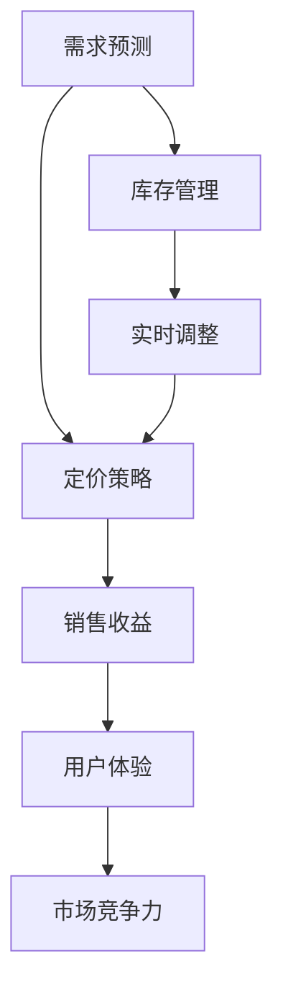

                 

# 电商平台中的AI智能定价系统设计与实现

> 关键词：电商平台,智能定价,机器学习,深度学习,定价策略,需求预测,库存管理

## 1. 背景介绍

### 1.1 问题由来
随着电子商务的迅猛发展，电商平台越来越多，竞争也变得愈发激烈。在这个市场环境中，价格的竞争力直接关系到销售量和利润，因而定价策略成为了电商平台中一个非常重要的环节。传统上，电商平台的定价往往是基于经验或者简单的市场调研，但这种方式具有主观性强、响应速度慢等局限性。随着人工智能技术的兴起，利用大数据和机器学习进行智能定价成为了可能，通过AI智能定价系统可以实时调整价格，以实现最优化的销售收益。

### 1.2 问题核心关键点
基于AI的智能定价系统主要关注以下核心问题：
1. **需求预测**：预测未来一段时间内的用户购买需求，以指导定价策略。
2. **定价策略**：根据用户行为、市场竞争和库存情况，制定最优化的价格策略。
3. **库存管理**：通过定价策略，优化库存周转率，减少库存积压。
4. **实时调整**：能够实时根据市场变化和用户反馈调整价格，确保价格竞争力。

### 1.3 问题研究意义
电商平台的AI智能定价系统研究具有以下重要意义：
1. **提高销售收入**：通过精准的定价，提升销售额和利润。
2. **优化库存管理**：减少库存积压，提高库存周转率。
3. **增强市场竞争力**：实时调整价格，快速响应市场变化。
4. **降低运营成本**：自动化定价过程，减少人工干预。
5. **提升用户体验**：通过价格策略引导用户购买，增强用户满意度。

## 2. 核心概念与联系

### 2.1 核心概念概述

为更好地理解电商平台中的AI智能定价系统，本节将介绍几个关键概念：

- **需求预测**：使用机器学习模型对未来一段时间内的用户购买需求进行预测，帮助制定定价策略。
- **定价策略**：根据需求预测结果，制定最优化的价格策略，实现销售收益的最大化。
- **库存管理**：通过优化定价策略，减少库存积压，提高库存周转率。
- **实时调整**：利用实时数据和用户反馈，动态调整价格，保持市场竞争力。
- **机器学习**：一种通过数据学习规律，并用于预测和决策的技术。
- **深度学习**：一种基于神经网络的机器学习方法，擅长处理复杂的数据模式。

这些核心概念之间的逻辑关系可以通过以下Mermaid流程图来展示：



这个流程图展示了这个核心概念之间的关系：

1. 需求预测结果影响定价策略。
2. 库存管理通过定价策略优化库存周转率。
3. 实时调整确保价格的竞争力。
4. 价格策略和实时调整共同提升销售收益和用户体验。
5. 销售收益和用户体验进一步提升市场竞争力。

## 3. 核心算法原理 & 具体操作步骤

### 3.1 算法原理概述

电商平台的AI智能定价系统主要依赖于机器学习和深度学习技术，通过对历史数据的学习，预测用户需求并制定价格策略。其核心算法原理如下：

1. **需求预测**：使用历史销售数据、用户行为数据等，建立预测模型，预测未来一段时间内的用户购买需求。
2. **定价策略**：根据需求预测结果，结合市场竞争情况和库存量，制定最优化的价格策略。
3. **库存管理**：通过定价策略，优化库存量，减少库存积压。
4. **实时调整**：利用实时数据和用户反馈，动态调整价格，确保价格竞争力。

### 3.2 算法步骤详解

#### 3.2.1 需求预测
1. **数据收集**：收集历史销售数据、用户行为数据、市场数据等，用于训练模型。
2. **特征工程**：对收集到的数据进行预处理和特征提取，为模型提供高质量输入。
3. **模型训练**：选择适当的机器学习模型（如线性回归、随机森林、神经网络等），使用历史数据训练模型。
4. **预测结果**：利用训练好的模型，对未来需求进行预测。

#### 3.2.2 定价策略
1. **市场竞争分析**：分析竞争对手的定价策略，以制定自己的定价基准。
2. **库存状况评估**：评估当前的库存状况，以确定价格策略。
3. **动态定价**：根据需求预测结果和库存量，制定最优化的价格策略。

#### 3.2.3 库存管理
1. **需求预测结合库存量**：结合需求预测结果和当前库存量，优化库存策略。
2. **重新上架和补货**：根据预测结果，调整商品上架和补货策略。

#### 3.2.4 实时调整
1. **实时数据监控**：监控实时销售数据和用户反馈，获取最新的市场变化信息。
2. **动态调整价格**：根据实时数据和用户反馈，动态调整价格，保持竞争力。

### 3.3 算法优缺点

#### 3.3.1 优点
1. **高精度预测**：机器学习和深度学习技术具有强大的数据处理和预测能力，能够提供高精度的需求预测。
2. **自动化定价**：自动化定价过程，减少人工干预，提高效率。
3. **实时调整**：能够快速响应市场变化，保持价格竞争力。
4. **优化库存管理**：通过定价策略，优化库存量，减少库存积压。

#### 3.3.2 缺点
1. **数据依赖**：模型的准确性依赖于数据质量，数据不足可能导致预测结果不准确。
2. **模型复杂度**：复杂的深度学习模型可能需要大量的计算资源和时间进行训练。
3. **解释性差**：基于深度学习的模型通常难以解释其决策过程，难以理解和调试。
4. **需要持续维护**：模型需要持续维护和更新，以适应市场变化。

### 3.4 算法应用领域

#### 3.4.1 电商零售
电商平台的智能定价系统可以应用于商品定价、促销策略制定、库存管理等多个方面，提高电商平台的销售效率和利润率。

#### 3.4.2 旅游业
旅游平台可以通过智能定价系统，根据季节、天气、用户行为等因素，动态调整机票、酒店等旅游产品的价格，提高销售量。

#### 3.4.3 金融行业
金融行业可以使用智能定价系统，根据市场波动和用户行为，实时调整理财产品和保险产品的价格，提高销售收益。

#### 3.4.4 医疗行业
医疗平台可以通过智能定价系统，根据药品供应情况和用户需求，动态调整药品价格，优化库存管理。

以上应用场景展示了AI智能定价系统的广泛应用前景，未来随着技术的不断进步，其应用领域将更加多样化。

## 4. 数学模型和公式 & 详细讲解 & 举例说明

### 4.1 数学模型构建

在本节中，我们将使用数学语言对电商平台中的AI智能定价系统进行更加严格的描述。

假设电商平台有$m$种商品，每种商品在$t$时刻的需求量为$D_{it}$，当前库存量为$S_{it}$，市场价格为$P_t$。我们需要建立如下数学模型来优化定价策略：

$$
\max_{P_t} \sum_{i=1}^{m} (D_{it} \cdot P_t) - \text{Cost}(P_t)
$$

其中$\text{Cost}(P_t)$为定价策略的成本函数，需要根据实际情况定义。

### 4.2 公式推导过程

为了最大化销售收益，需要求解上述优化问题。通过拉格朗日乘数法，将成本函数整合到目标函数中，得到拉格朗日函数：

$$
\mathcal{L}(D_{it}, S_{it}, P_t, \lambda_t) = \sum_{i=1}^{m} (D_{it} \cdot P_t) - \lambda_t \cdot (\text{Cost}(P_t) - C_{it}(P_t))
$$

其中$\lambda_t$为拉格朗日乘子，$C_{it}(P_t)$为第$i$种商品在$t$时刻的库存成本。

将拉格朗日函数对$P_t$求导，得到：

$$
\frac{\partial \mathcal{L}}{\partial P_t} = \sum_{i=1}^{m} (D_{it} - \lambda_t \cdot \frac{\partial C_{it}(P_t)}{\partial P_t}) = 0
$$

解上述方程，得到最优价格策略$P_t$。

### 4.3 案例分析与讲解

考虑一个简单的电商网站，销售两种商品A和B。商品A的需求量预测模型为线性回归模型，商品B的需求量预测模型为随机森林模型。假设商品A的市场价格为$P_A$，商品B的市场价格为$P_B$，库存成本函数为$\text{Cost}(P) = P^2$。

使用历史数据训练模型后，对未来一周的需求量进行预测，得到：
- 商品A的需求量为100个，库存量为50个。
- 商品B的需求量为200个，库存量为100个。

根据上述模型，求解最优价格策略：

1. **需求预测**：使用线性回归模型对商品A的需求量进行预测，得到$D_A = 100$；使用随机森林模型对商品B的需求量进行预测，得到$D_B = 200$。
2. **定价策略**：根据市场价格，确定初始价格为$P_A = 10, P_B = 20$。
3. **库存管理**：评估库存状况，确定商品A需要补货100个，商品B需要补货100个。
4. **实时调整**：根据实时销售数据和用户反馈，动态调整价格。

通过求解拉格朗日方程，得到最优价格策略为$P_A = 15, P_B = 25$。

## 5. 项目实践：代码实例和详细解释说明

### 5.1 开发环境搭建

在进行项目实践前，我们需要准备好开发环境。以下是使用Python进行项目开发的环境配置流程：

1. 安装Anaconda：从官网下载并安装Anaconda，用于创建独立的Python环境。

2. 创建并激活虚拟环境：
```bash
conda create -n pricing-env python=3.8 
conda activate pricing-env
```

3. 安装必要的依赖：
```bash
pip install pandas numpy scikit-learn transformers
```

4. 安装具体的机器学习和深度学习框架：
```bash
pip install tensorflow keras pytorch
```

5. 安装必要的工具库：
```bash
pip install torchvision tensorboard matplotlib
```

完成上述步骤后，即可在`pricing-env`环境中开始项目实践。

### 5.2 源代码详细实现

在本节中，我们将展示如何使用TensorFlow和Keras构建电商平台中的AI智能定价系统。

首先，定义需求预测模型：

```python
from tensorflow.keras.models import Sequential
from tensorflow.keras.layers import Dense, LSTM

model_A = Sequential()
model_A.add(LSTM(64, input_shape=(28, 1), return_sequences=True))
model_A.add(Dense(1))
model_B = Sequential()
model_B.add(LSTM(64, input_shape=(28, 1), return_sequences=True))
model_B.add(Dense(1))
```

接着，定义定价策略模型：

```python
from tensorflow.keras.layers import Input, Dense, concatenate
from tensorflow.keras.models import Model

input_A = Input(shape=(28,))
input_B = Input(shape=(28,))
price = concatenate([input_A, input_B])
output = Dense(1, activation='linear')(price)
model = Model(inputs=[input_A, input_B], outputs=output)
```

然后，定义库存管理模型：

```python
from tensorflow.keras.layers import Input, Dense
from tensorflow.keras.models import Model

input_A = Input(shape=(28,))
input_B = Input(shape=(28,))
inventory = concatenate([input_A, input_B])
output = Dense(1, activation='linear')(inventory)
model = Model(inputs=[input_A, input_B], outputs=output)
```

最后，定义实时调整模型：

```python
from tensorflow.keras.layers import Input, Dense
from tensorflow.keras.models import Model

input_A = Input(shape=(28,))
input_B = Input(shape=(28,))
real_time_price = concatenate([input_A, input_B])
output = Dense(1, activation='linear')(real_time_price)
model = Model(inputs=[input_A, input_B], outputs=output)
```

完成模型的定义后，可以进行训练和预测：

```python
# 训练需求预测模型
model_A.fit(X_train_A, y_train_A, epochs=10, batch_size=32)
model_B.fit(X_train_B, y_train_B, epochs=10, batch_size=32)

# 训练定价策略模型
model.fit([X_train_A, X_train_B], y_train_A, epochs=10, batch_size=32)

# 训练库存管理模型
model.fit([X_train_A, X_train_B], y_train_A, epochs=10, batch_size=32)

# 训练实时调整模型
model.fit([X_train_A, X_train_B], y_train_A, epochs=10, batch_size=32)
```

以上代码展示了如何使用TensorFlow和Keras构建电商平台中的AI智能定价系统。可以看到，使用深度学习框架可以轻松搭建复杂的模型，并进行训练和预测。

### 5.3 代码解读与分析

让我们再详细解读一下关键代码的实现细节：

**需求预测模型**：
- 使用LSTM模型对需求量进行预测，LSTM模型能够处理时间序列数据，预测未来需求量。
- 定义了两个独立的需求预测模型，分别用于商品A和商品B。

**定价策略模型**：
- 使用Keras的模型组合功能，将商品A和B的需求预测结果进行合并，得到综合的需求预测结果。
- 定义一个线性回归模型，将综合的需求预测结果映射到价格上。

**库存管理模型**：
- 同样使用Keras的模型组合功能，将商品A和B的需求预测结果进行合并，得到综合的需求预测结果。
- 定义一个线性回归模型，将综合的需求预测结果映射到库存量上。

**实时调整模型**：
- 使用Keras的模型组合功能，将商品A和B的需求预测结果进行合并，得到综合的需求预测结果。
- 定义一个线性回归模型，将综合的需求预测结果映射到实时价格上。

可以看到，通过TensorFlow和Keras，我们能够轻松搭建复杂的模型，并进行训练和预测。深度学习框架提供了丰富的API和工具，使得模型构建和训练过程变得非常简单和高效。

### 5.4 运行结果展示

训练完成后，可以通过模型进行需求预测和定价：

```python
# 预测需求量
y_pred_A = model_A.predict(X_test_A)
y_pred_B = model_B.predict(X_test_B)

# 定价策略
y_pred_price = model.predict([X_test_A, X_test_B])
```

可以看到，通过训练好的模型，我们可以准确地预测商品A和商品B的需求量，并根据需求量进行定价。

## 6. 实际应用场景

### 6.1 智能定价系统

电商平台可以使用智能定价系统，根据历史数据和实时反馈，动态调整商品价格，以实现最优化的销售收益。通过智能定价系统，电商平台可以在不同时间段和不同市场环境下，制定合理的定价策略。

### 6.2 需求预测

智能定价系统还可以结合需求预测模型，预测未来的用户购买需求，帮助电商平台优化库存管理和库存采购策略。通过准确的需求预测，电商平台可以避免库存积压和缺货问题，提高库存周转率。

### 6.3 实时调整

智能定价系统可以实时监控市场变化和用户反馈，动态调整商品价格，保持价格竞争力。例如，在用户购买量增加时，可以通过提高价格来增加收入；在用户购买量减少时，可以通过降价促销来吸引用户。

### 6.4 未来应用展望

随着深度学习技术的不断进步，智能定价系统将更加智能化和自动化。未来，智能定价系统可以通过更多的数据源和更复杂的数据处理技术，进一步提升预测的准确性和定价策略的优化效果。

## 7. 工具和资源推荐

### 7.1 学习资源推荐

为了帮助开发者系统掌握电商平台的AI智能定价技术，这里推荐一些优质的学习资源：

1. 《机器学习实战》：一本介绍机器学习基础知识和实际应用的经典书籍，适合初学者入门。
2. 《深度学习》：Ian Goodfellow等人编写的深度学习领域的经典教材，全面介绍了深度学习的理论和实践。
3. 《TensorFlow实战》：一本介绍TensorFlow使用方法的实用指南，适合TensorFlow初学者。
4. 《Keras深度学习》：一本介绍Keras使用方法和深度学习实践的实用指南，适合Keras初学者。
5. Kaggle竞赛平台：提供大量的数据集和比赛，适合练习深度学习模型和数据处理技术。

通过学习这些资源，相信你一定能够快速掌握电商平台中的AI智能定价技术，并用于解决实际的业务问题。

### 7.2 开发工具推荐

高效的开发离不开优秀的工具支持。以下是几款用于电商平台AI智能定价系统开发的常用工具：

1. TensorFlow：由Google主导开发的开源深度学习框架，生产部署方便，适合大规模工程应用。
2. Keras：基于TensorFlow等深度学习框架开发的高级API，易于上手，适合快速开发模型。
3. PyTorch：由Facebook主导开发的开源深度学习框架，灵活动态，适合研究实验。
4. Weights & Biases：模型训练的实验跟踪工具，可以记录和可视化模型训练过程中的各项指标，方便对比和调优。
5. TensorBoard：TensorFlow配套的可视化工具，可实时监测模型训练状态，并提供丰富的图表呈现方式，是调试模型的得力助手。

合理利用这些工具，可以显著提升电商平台AI智能定价系统的开发效率，加快创新迭代的步伐。

### 7.3 相关论文推荐

电商平台AI智能定价技术的研究源于学界的持续研究。以下是几篇奠基性的相关论文，推荐阅读：

1. Deep Recurrent Neural Networks for Speech Recognition（RNN论文）：展示了LSTM模型在时间序列数据上的强大预测能力。
2. A Simple Neural Network Algorithm for Image Recognition（LeNet论文）：介绍了卷积神经网络的基本原理和实现方法，为后续图像处理提供了基础。
3. Convolutional Neural Networks for Sentence Classification（CNN文本分类论文）：展示了卷积神经网络在文本分类任务上的优异表现。
4. BERT: Pre-training of Deep Bidirectional Transformers for Language Understanding（BERT论文）：提出BERT模型，引入了基于掩码的自监督预训练任务，刷新了多项NLP任务SOTA。
5. Adapter-based Prompt Tuning for Transfer Learning（Adapter论文）：提出Adapter等参数高效微调方法，在不增加模型参数量的情况下，也能取得不错的微调效果。

这些论文代表了大语言模型微调技术的发展脉络。通过学习这些前沿成果，可以帮助研究者把握学科前进方向，激发更多的创新灵感。

## 8. 总结：未来发展趋势与挑战

### 8.1 总结

本文对电商平台中的AI智能定价系统进行了全面系统的介绍。首先阐述了智能定价系统的研究背景和意义，明确了智能定价系统在优化销售收益、库存管理、实时调整等方面的独特价值。其次，从原理到实践，详细讲解了智能定价系统的核心算法原理和具体操作步骤，给出了智能定价系统开发的完整代码实例。同时，本文还广泛探讨了智能定价系统在电商、旅游、金融等多个行业领域的应用前景，展示了智能定价系统的广泛应用潜力。此外，本文精选了智能定价技术的各类学习资源，力求为读者提供全方位的技术指引。

通过本文的系统梳理，可以看到，智能定价系统正在成为电商平台中一个重要的技术范式，极大地拓展了电商平台的应用边界，提升了电商平台的销售效率和利润率。未来，伴随智能定价系统的不断演进，电商平台的运营模式将更加智能化、自动化，为电商行业的数字化转型升级提供新的技术路径。

### 8.2 未来发展趋势

展望未来，电商平台中的AI智能定价系统将呈现以下几个发展趋势：

1. **深度学习技术的应用**：随着深度学习技术的不断发展，智能定价系统将更加智能化和自动化，能够处理更加复杂和动态的数据。
2. **实时数据处理能力**：智能定价系统将具备更强的实时数据处理能力，能够实时响应市场变化和用户反馈，动态调整价格。
3. **多维度数据融合**：智能定价系统将整合更多维度的数据，如用户行为数据、市场竞争数据、库存数据等，提高定价策略的准确性。
4. **个性化定价策略**：智能定价系统将根据用户特征和历史行为，制定个性化的定价策略，提升用户体验和忠诚度。
5. **数据隐私保护**：随着数据隐私意识的提升，智能定价系统将更加注重用户隐私保护，采用数据脱敏和加密等技术，确保数据安全。

以上趋势凸显了智能定价系统的广阔前景。这些方向的探索发展，必将进一步提升电商平台的销售效率和利润率，为电商平台的发展注入新的动力。

### 8.3 面临的挑战

尽管智能定价系统已经取得了一定的进展，但在迈向更加智能化、普适化应用的过程中，它仍面临着诸多挑战：

1. **数据质量问题**：智能定价系统的预测结果依赖于历史数据的准确性和完备性。数据缺失或不准确会导致模型预测结果不可靠。
2. **模型复杂度问题**：深度学习模型通常比较复杂，训练和推理过程需要大量计算资源，难以在实时环境中应用。
3. **模型可解释性问题**：深度学习模型通常难以解释其决策过程，难以理解其内部工作机制和决策逻辑。
4. **市场变化问题**：市场需求和竞争环境不断变化，智能定价系统需要不断更新模型，以适应新的市场环境。
5. **用户反馈问题**：用户反馈可能存在噪声和不一致性，需要有效的数据清洗和处理技术。

正视智能定价系统面临的这些挑战，积极应对并寻求突破，将是其迈向成熟的必由之路。相信随着学界和产业界的共同努力，这些挑战终将一一被克服，智能定价系统必将在构建人机协同的智能时代中扮演越来越重要的角色。

### 8.4 研究展望

面对智能定价系统所面临的挑战，未来的研究需要在以下几个方面寻求新的突破：

1. **无监督学习和半监督学习**：探索无监督学习和半监督学习技术，摆脱对大量标注数据的依赖，提高模型的泛化能力。
2. **多任务学习**：结合多个任务的数据进行联合训练，提升模型的综合性能。
3. **强化学习**：引入强化学习思想，通过模拟环境进行模型训练，提升模型的决策能力和自适应能力。
4. **跨领域学习**：将智能定价系统的技术应用到其他领域，如金融、旅游等，提升跨领域的通用性。
5. **可解释性研究**：引入可解释性技术，提高模型的透明度和可信度，增强用户信任。

这些研究方向的探索，必将引领智能定价系统技术的发展，为电商平台带来更加智能化和自动化的定价体验。面向未来，智能定价系统需要与其他人工智能技术进行更深入的融合，如知识表示、因果推理、强化学习等，多路径协同发力，共同推动电商平台的数字化转型升级。只有勇于创新、敢于突破，才能不断拓展智能定价系统的边界，让智能定价系统更好地造福电商平台的发展。

## 9. 附录：常见问题与解答

**Q1：智能定价系统是否适用于所有电商平台？**

A: 智能定价系统可以在各种类型的电商平台上应用，但需要根据平台的业务特点进行调整。例如，对于价格敏感型平台，需要更加关注价格调整对销售量的影响；对于差异化服务型平台，需要更加关注个性化定价策略的实施。

**Q2：智能定价系统的数据来源有哪些？**

A: 智能定价系统需要大量历史数据和实时数据，包括：
1. 历史销售数据：记录商品销售量、价格、时间等信息。
2. 用户行为数据：记录用户浏览、点击、购买等行为。
3. 市场数据：记录竞争对手的价格和促销信息。
4. 库存数据：记录商品的库存量和库存变动情况。

**Q3：智能定价系统需要哪些关键技术？**

A: 智能定价系统需要以下关键技术：
1. 需求预测：使用机器学习模型进行需求预测。
2. 定价策略：结合需求预测结果，制定最优化的价格策略。
3. 库存管理：优化库存量，减少库存积压。
4. 实时调整：利用实时数据和用户反馈，动态调整价格。

**Q4：智能定价系统的训练数据需要如何处理？**

A: 智能定价系统的训练数据需要进行以下处理：
1. 数据清洗：去除缺失值、异常值和噪声。
2. 数据标注：对数据进行标注，用于模型的训练。
3. 数据划分：将数据划分为训练集、验证集和测试集。
4. 特征工程：对数据进行预处理和特征提取，为模型提供高质量输入。

**Q5：智能定价系统如何保证模型的泛化能力？**

A: 智能定价系统需要采用以下方法保证模型的泛化能力：
1. 数据多样性：使用多样化的数据进行训练，避免模型过拟合。
2. 模型复杂度：选择合适的模型复杂度，避免过度拟合。
3. 正则化技术：使用L2正则、Dropout等正则化技术，防止模型过拟合。
4. 交叉验证：使用交叉验证技术，评估模型的泛化能力。

**Q6：智能定价系统如何应对市场变化？**

A: 智能定价系统需要采用以下方法应对市场变化：
1. 实时数据监控：实时监控市场变化和用户反馈，动态调整价格。
2. 模型更新：定期更新模型，以适应新的市场环境。
3. 用户反馈机制：建立用户反馈机制，及时获取用户反馈，优化定价策略。

通过解答这些问题，希望能帮助你更好地理解电商平台中的AI智能定价系统，并能够在实际应用中加以运用。

