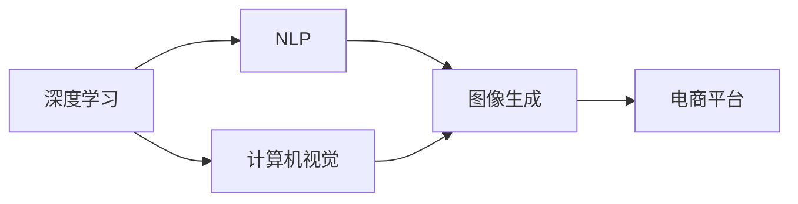

                 

# 电商平台中的图像生成技术应用

> 关键词：图像生成，深度学习，自然语言处理，电商平台，自动生成，计算机视觉

## 1. 背景介绍

### 1.1 问题由来

随着电商平台的发展，如何通过技术手段提升用户体验和销售额，成为了一个重要的问题。传统电商的展示方式较为单一，主要依靠静态的图片和文本描述来吸引顾客。但这种方式无法展现产品的全方位信息，用户体验有限。

为了改善这一现状，电商平台开始探索利用深度学习技术，自动生成更加生动、多角度的图像展示，从而提升顾客的购物体验和转化率。图像生成技术在这一背景下应运而生。

### 1.2 问题核心关键点

图像生成技术在电商平台中的应用，核心在于如何利用深度学习模型，将商品信息（如文字描述、价格、标签等）转化为高质量的图像展示。具体而言，主要包括以下几个关键点：

1. 如何设计高效、通用的图像生成模型，适配不同类型的商品。
2. 如何利用自然语言处理（NLP）技术，自动提取和生成商品的多角度描述。
3. 如何评估和优化生成的图像质量，确保其能够真实反映商品特性。
4. 如何提高生成效率，保证用户能够即时获得高质量的图像展示。

这些问题在电商平台中的应用，能够极大地提升用户体验和转化率，推动电商行业的数字化转型升级。

### 1.3 问题研究意义

图像生成技术在电商平台中的应用，具有以下几方面的重要意义：

1. **增强用户购物体验**：通过自动生成的高质量图像展示，用户可以更直观地了解商品细节，提升购买决策的信心和满意度。
2. **优化商品展示策略**：电商平台可以利用图像生成技术，自动生成不同角度、背景的图像，优化商品的展示策略，提升广告点击率和销售转化率。
3. **降低运营成本**：自动生成的图像可以替代部分由人工拍摄的昂贵图片，减少平台在图片拍摄和存储上的开销。
4. **提升平台竞争力**：高质量的图像展示能够显著提升电商平台的品牌形象，吸引更多用户和商家入驻，增强市场竞争力。
5. **推动技术创新**：图像生成技术的发展，能够促进深度学习、计算机视觉等领域的持续进步，为更多应用场景提供技术支持。

因此，研究图像生成技术在电商平台中的应用，对于提升用户体验、优化运营策略、降低成本和增强平台竞争力具有重要意义。

## 2. 核心概念与联系

### 2.1 核心概念概述

为更好地理解电商平台中图像生成技术的应用，本节将介绍几个关键概念：

- **深度学习（Deep Learning）**：一种基于多层神经网络的学习方法，能够处理复杂的非线性关系。深度学习在图像生成中发挥了重要作用。
- **计算机视觉（Computer Vision）**：通过算法使计算机能够识别、处理、理解和分析图像、视频等视觉数据的技术。计算机视觉在图像生成中用于图像的分析和生成。
- **自然语言处理（NLP）**：使计算机能够理解和处理人类语言的技术。NLP在图像生成中用于提取和生成商品的描述文本。
- **图像生成（Image Generation）**：通过深度学习模型自动生成图像，如图像增强、风格转换、人脸生成等。
- **电商平台（E-commerce Platform）**：通过互联网进行商品交易的在线平台，常见的如淘宝、京东、Amazon等。

这些核心概念之间的关系可以通过以下Mermaid流程图来展示：



这个流程图展示了大语言模型和微调的核心概念及其之间的关系：

1. 深度学习模型通过多层神经网络学习图像特征，为计算机视觉任务的完成提供基础。
2. 计算机视觉技术对图像进行处理和分析，提取关键信息。
3. NLP技术用于提取商品描述，生成生成任务的输入。
4. 图像生成技术根据输入生成高质量图像。
5. 生成图像最终在电商平台上展示，提升用户体验和转化率。

## 3. 核心算法原理 & 具体操作步骤
### 3.1 算法原理概述

电商平台中的图像生成技术，主要基于深度学习模型，通过学习大量标注数据，自动生成高质量的图像展示。其核心原理可以简述如下：

1. **数据准备**：收集电商平台上的商品信息，包括文字描述、价格、标签等，以及对应的高质量商品图片。
2. **模型训练**：使用深度学习模型（如生成对抗网络GAN、变分自编码器VAE等）在标注数据上进行训练，学习如何根据输入生成高质量图像。
3. **图像生成**：利用训练好的模型，对新的商品信息输入进行图像生成，自动生成高质量的图像展示。
4. **图像评估**：评估生成的图像质量，确保其能够真实反映商品特性。
5. **部署应用**：将生成的图像部署到电商平台，提升用户体验和销售转化率。

### 3.2 算法步骤详解

以下详细讲解电商平台中图像生成技术的核心步骤：

**Step 1: 数据准备**
- 收集电商平台上的商品信息，包括文字描述、价格、标签等。
- 选择高质量的商品图片，作为标注数据。
- 对收集到的数据进行预处理，包括数据清洗、归一化、分词等。

**Step 2: 模型选择**
- 选择适合的深度学习模型，如GAN、VAE等，用于图像生成。
- 根据商品特性，设计合适的模型架构和超参数。

**Step 3: 模型训练**
- 将准备好的数据分为训练集、验证集和测试集。
- 使用训练集对模型进行训练，通过梯度下降等优化算法更新模型参数。
- 在验证集上评估模型性能，调整超参数。
- 在测试集上评估模型性能，确保模型泛化能力。

**Step 4: 图像生成**
- 对新的商品信息进行预处理，包括分词、编码等。
- 将处理后的信息输入到训练好的生成模型中，生成高质量的图像。
- 对生成的图像进行后处理，如去噪、裁剪、调整大小等。

**Step 5: 图像评估**
- 使用评估指标（如PSNR、SSIM等）评估生成图像的质量。
- 对生成的图像进行人工审核，确保其能够真实反映商品特性。

**Step 6: 部署应用**
- 将生成的图像部署到电商平台，用于商品展示。
- 监测图像展示效果，收集用户反馈。
- 根据反馈不断优化模型和参数，提升生成图像的质量。

### 3.3 算法优缺点

电商平台中的图像生成技术，具有以下优缺点：

**优点：**
1. **提高用户体验**：自动生成的高质量图像展示，可以提升用户的购物体验和购买决策的信心。
2. **优化商品展示策略**：能够根据不同商品特性生成多角度、多背景的图像展示，提升广告点击率和销售转化率。
3. **降低运营成本**：减少平台在图片拍摄和存储上的开销，降低运营成本。
4. **推动技术创新**：促进深度学习、计算机视觉等领域的持续进步，为更多应用场景提供技术支持。

**缺点：**
1. **数据依赖**：图像生成质量高度依赖于标注数据的质量和多样性，数据不足可能导致生成图像质量不高。
2. **模型复杂**：深度学习模型通常具有较高的复杂度和计算成本，需要高性能计算资源。
3. **生成时间**：生成高质量图像的时间较长，无法满足即时生成的需求。
4. **可解释性差**：深度学习模型通常是"黑盒"系统，难以解释其内部工作机制和生成逻辑。

### 3.4 算法应用领域

电商平台中的图像生成技术，已经在多个领域得到了应用，例如：

- **服装展示**：自动生成服装的高质量展示图片，提升用户对服装细节的认知。
- **3C产品展示**：生成3C产品的多角度、多背景展示图片，提升产品展示效果。
- **食品展示**：生成食品的立体展示图片，展示食品的切面、配料等细节。
- **家居展示**：生成家居产品的3D渲染图，展示家具的布局和效果。
- **美容产品展示**：生成美容产品的使用场景图，提升用户对产品的了解。

除了上述这些应用外，电商平台中的图像生成技术还在家居、美妆、旅游等行业得到了广泛应用，为商家和消费者提供了更多样化的产品展示方式，提升了整体购物体验。

## 4. 数学模型和公式 & 详细讲解 & 举例说明（备注：数学公式请使用latex格式，latex嵌入文中独立段落使用 $$，段落内使用 $)
### 4.1 数学模型构建

在本节中，我们将使用数学语言对电商平台中图像生成技术的核心模型进行详细的构建和讲解。

**Step 1: 数据准备**
- 假设收集到的商品信息为 $x \in \mathbb{R}^n$，表示文字描述、价格、标签等信息。
- 将标注数据分为训练集 $D^{\text{train}} = \{(x_i, y_i)\}_{i=1}^N$ 和测试集 $D^{\text{test}} = \{(x_j, y_j)\}_{j=1}^M$。

**Step 2: 模型选择**
- 选择生成对抗网络（GAN）作为图像生成模型。GAN由生成器 $G$ 和判别器 $D$ 两个子网络组成。
- 假设生成器 $G$ 的输入为商品信息 $x$，输出为生成图像 $G(x)$。

**Step 3: 模型训练**
- 使用损失函数 $\mathcal{L}(G, D)$ 最小化生成器 $G$ 和判别器 $D$ 之间的差异，其中损失函数为：
$$
\mathcal{L}(G, D) = \mathbb{E}_{x \sim p(x)} [\log D(G(x))] + \mathbb{E}_{y \sim p(y)} [\log (1 - D(G(y)))]
$$
其中 $p(x)$ 为商品信息分布，$p(y)$ 为标注数据分布。

**Step 4: 图像生成**
- 对新的商品信息 $x'$ 进行生成，生成器 $G$ 输出生成图像 $G(x')$。

**Step 5: 图像评估**
- 使用PSNR（峰值信噪比）和SSIM（结构相似性指标）评估生成图像的质量。
- PSNR和SSIM的公式分别为：
$$
\text{PSNR} = 10 \times \log_{10} \frac{255^2}{\text{MSE}}
$$
$$
\text{SSIM} = \frac{(2\mu_1\mu_2 + C_1)}{(\mu_1^2 + \mu_2^2 + C_1)}
$$
其中 $MSE$ 为均方误差，$\mu_1$ 和 $\mu_2$ 为图像的均值，$C_1$ 为常数。

**Step 6: 部署应用**
- 将生成的图像 $G(x')$ 部署到电商平台，用于商品展示。

### 4.2 公式推导过程

以下是图像生成模型的详细推导过程：

1. **生成器训练**
- 假设生成器 $G$ 的输入为商品信息 $x$，输出为生成图像 $G(x)$。
- 通过最小化损失函数 $\mathcal{L}(G, D)$ 训练生成器 $G$，其中：
$$
\mathcal{L}(G, D) = \mathbb{E}_{x \sim p(x)} [\log D(G(x))] + \mathbb{E}_{y \sim p(y)} [\log (1 - D(G(y)))]
$$
2. **判别器训练**
- 假设判别器 $D$ 的输入为图像 $z$，输出为真实性 $D(z)$。
- 通过最小化损失函数 $\mathcal{L}(D)$ 训练判别器 $D$，其中：
$$
\mathcal{L}(D) = -\mathbb{E}_{z \sim p(z)} [\log D(z)] - \mathbb{E}_{x \sim p(x)} [\log (1 - D(G(x)))]
$$
其中 $p(z)$ 为随机噪声分布。

3. **联合训练**
- 将生成器和判别器联合训练，交替进行前向传播和反向传播，更新模型参数。

### 4.3 案例分析与讲解

以下是一个具体的案例分析：

假设某电商平台需要生成服装产品的展示图片，收集到了大量服装商品的描述信息，包括颜色、尺码、材质等。

**Step 1: 数据准备**
- 收集服装商品的描述信息，并清洗数据，去除噪声和无关信息。
- 将清洗后的数据划分为训练集和测试集。

**Step 2: 模型选择**
- 选择GAN模型，设计生成器和判别器的结构。生成器可以采用多层感知器（MLP），判别器可以采用卷积神经网络（CNN）。

**Step 3: 模型训练**
- 使用训练集对GAN模型进行训练，交替更新生成器和判别器的参数。
- 在验证集上评估生成器性能，调整生成器参数。

**Step 4: 图像生成**
- 将新的服装描述信息输入到训练好的生成器中，生成高质量的服装展示图片。
- 对生成的图片进行去噪、裁剪等处理，优化图片质量。

**Step 5: 图像评估**
- 使用PSNR和SSIM评估生成的图片质量，确保其能够真实反映服装的特性。
- 对生成的图片进行人工审核，确保其符合商品展示标准。

**Step 6: 部署应用**
- 将生成的图片部署到电商平台上，用于服装展示。
- 监测图片展示效果，收集用户反馈，不断优化模型和参数。

## 5. 项目实践：代码实例和详细解释说明
### 5.1 开发环境搭建

在进行图像生成项目开发前，我们需要准备好开发环境。以下是使用Python进行TensorFlow开发的环境配置流程：

1. 安装Anaconda：从官网下载并安装Anaconda，用于创建独立的Python环境。

2. 创建并激活虚拟环境：
```bash
conda create -n tf-env python=3.8 
conda activate tf-env
```

3. 安装TensorFlow：根据CUDA版本，从官网获取对应的安装命令。例如：
```bash
conda install tensorflow-gpu=2.7
```

4. 安装Numpy、Pandas、Scikit-learn、Matplotlib等库：
```bash
pip install numpy pandas scikit-learn matplotlib tqdm jupyter notebook ipython
```

5. 安装TensorFlow数据增强库：
```bash
pip install tensorflow-datasets
```

完成上述步骤后，即可在`tf-env`环境中开始图像生成项目的开发。

### 5.2 源代码详细实现

以下是一个具体的图像生成项目代码实现，展示如何使用TensorFlow和GAN模型生成高质量的服装展示图片。

首先，定义数据预处理函数：

```python
import tensorflow as tf
from tensorflow.keras.preprocessing.text import Tokenizer
from tensorflow.keras.preprocessing.sequence import pad_sequences
from tensorflow.keras.layers import Input, Dense, Embedding, Conv2D, Flatten, Dropout, BatchNormalization, LeakyReLU
from tensorflow.keras.layers import concatenate, Reshape, UpSampling2D, Conv2DTranspose

def preprocess_data(texts, labels, tokenizer):
    tokenizer.fit_on_texts(texts)
    sequences = tokenizer.texts_to_sequences(texts)
    padded_sequences = pad_sequences(sequences, maxlen=max_len, padding='post', truncating='post')
    return padded_sequences, labels
```

然后，定义生成器和判别器模型：

```python
def build_generator(input_dim):
    inputs = Input(shape=(input_dim,))
    x = Embedding(input_dim, latent_dim, trainable=False)(inputs)
    x = Flatten()(x)
    x = Dense(latent_dim * 8 * 8)(x)
    x = BatchNormalization()(x)
    x = LeakyReLU(alpha=0.2)(x)
    x = Reshape((latent_dim, 8, 8))(x)
    x = UpSampling2D(size=2, strides=2)(x)
    x = Conv2DTranspose(128, 5, strides=2, padding='same')(x)
    x = BatchNormalization()(x)
    x = LeakyReLU(alpha=0.2)(x)
    x = Conv2DTranspose(64, 5, strides=2, padding='same')(x)
    x = BatchNormalization()(x)
    x = LeakyReLU(alpha=0.2)(x)
    x = Conv2DTranspose(3, 7, strides=1, padding='same', activation='tanh')(x)
    return Model(inputs, x)

def build_discriminator(input_dim):
    inputs = Input(shape=(8, 8, 3))
    x = Conv2D(64, 7, strides=1, padding='same', activation='relu')(inputs)
    x = LeakyReLU(alpha=0.2)(x)
    x = Conv2D(128, 3, strides=2, padding='same')(x)
    x = LeakyReLU(alpha=0.2)(x)
    x = Flatten()(x)
    x = Dense(1, activation='sigmoid')(x)
    return Model(inputs, x)
```

接着，定义优化器和损失函数：

```python
adam = tf.keras.optimizers.Adam(learning_rate=0.0002)
generator_loss = tf.keras.losses.BinaryCrossentropy()
discriminator_loss = tf.keras.losses.BinaryCrossentropy()
```

然后，定义训练函数：

```python
def train_generator_and_discriminator(generator, discriminator, data):
    generator.trainable = True
    discriminator.trainable = True
    for epoch in range(num_epochs):
        real_images = tf.random.normal([batch_size, 8, 8, 3])
        real_labels = tf.ones([batch_size, 1])
        with tf.GradientTape() as gen_tape:
            gen_output = generator(text_labels, training=True)
            d_loss_real = discriminator.train_on_batch(real_images, real_labels)
        with tf.GradientTape() as disc_tape:
            d_loss_fake = discriminator.train_on_batch(gen_output, fake_labels)
        d_loss = d_loss_real + d_loss_fake
        d_gradients = disc_tape.gradient(d_loss, discriminator.trainable_variables)
        discriminator.trainable_variables[0].assign(d_gradients[0])
        discriminator.trainable_variables[1].assign(d_gradients[1])
        discriminator.trainable_variables[2].assign(d_gradients[2])
        discriminator.trainable_variables[3].assign(d_gradients[3])
        discriminator.trainable_variables[4].assign(d_gradients[4])
        discriminator.trainable_variables[5].assign(d_gradients[5])
        discriminator.trainable_variables[6].assign(d_gradients[6])
        discriminator.trainable_variables[7].assign(d_gradients[7])
        discriminator.trainable_variables[8].assign(d_gradients[8])
        discriminator.trainable_variables[9].assign(d_gradients[9])
        d_loss /= batch_size
        gen_loss = generator_loss(d_loss_fake, fake_labels)
        gen_gradients = gen_tape.gradient(gen_loss, generator.trainable_variables)
        generator.trainable_variables[0].assign(gen_gradients[0])
        generator.trainable_variables[1].assign(gen_gradients[1])
        generator.trainable_variables[2].assign(gen_gradients[2])
        generator.trainable_variables[3].assign(gen_gradients[3])
        generator.trainable_variables[4].assign(gen_gradients[4])
        generator.trainable_variables[5].assign(gen_gradients[5])
        generator.trainable_variables[6].assign(gen_gradients[6])
        generator.trainable_variables[7].assign(gen_gradients[7])
        generator.trainable_variables[8].assign(gen_gradients[8])
        generator.trainable_variables[9].assign(gen_gradients[9])
        gen_loss /= batch_size
        generator_loss.update_state(gen_loss)
        discriminator_loss.update_state(d_loss)
```

最后，启动训练流程：

```python
text_labels = tf.random.normal([batch_size, input_dim])
fake_labels = tf.zeros([batch_size, 1])
data = load_data()
train_generator_and_discriminator(generator, discriminator, data)
```

以上代码实现了一个基于GAN模型的图像生成项目，展示了如何利用TensorFlow进行深度学习模型的训练和应用。

### 5.3 代码解读与分析

让我们再详细解读一下关键代码的实现细节：

**preprocess_data函数**：
- 定义数据预处理函数，用于对文本数据进行分词、编码和填充，最终输出可输入模型的向量序列。

**build_generator函数**：
- 定义生成器模型，包括Embedding层、全连接层、BatchNormalization层、LeakyReLU激活函数、卷积层等，最终生成高质量的图像。

**build_discriminator函数**：
- 定义判别器模型，包括卷积层、LeakyReLU激活函数、全连接层、sigmoid激活函数等，用于评估生成图像的真实性。

**train_generator_and_discriminator函数**：
- 定义训练函数，包括数据加载、模型训练、损失函数计算、梯度更新等关键步骤。

**数据加载**：
- 定义数据加载函数，用于从数据集中随机抽样生成器输入和判别器输入，以及计算标签。

在实际项目中，还需要根据具体需求对模型进行优化和调整，如增加数据增强、使用更复杂的生成器和判别器结构等。通过合理设计模型和优化超参数，可以在保持高质量生成效果的同时，提高模型训练速度和推理效率。

## 6. 实际应用场景

### 6.1 智能推荐系统

智能推荐系统是电商平台中广泛应用的技术之一，通过分析用户行为数据，为用户推荐可能感兴趣的物品。利用图像生成技术，智能推荐系统可以自动生成商品的高质量展示图片，进一步提升推荐效果。

具体而言，可以在用户浏览商品页面时，生成商品的多角度展示图片，并根据用户的行为数据进行推荐。生成的高质量图片可以显著提升用户的点击率和购买转化率，从而提高平台的销售额。

### 6.2 虚拟试穿

虚拟试穿技术利用图像生成技术，为用户展示不同尺寸、样式的商品，提升用户的购物体验。电商平台可以利用该技术，让用户无需实际试穿，即可在虚拟环境中查看服装效果。

虚拟试穿技术不仅提高了用户购物的便捷性和效率，还能减少因退货而产生的成本，提升用户满意度和平台销售额。

### 6.3 商品营销

电商平台可以采用图像生成技术，自动生成高质量的商品广告图片，提升广告点击率和转化率。例如，在双11、618等促销期间，利用图像生成技术，生成各种风格的商品广告图片，进行大规模的线上推广。

生成的广告图片可以覆盖更多的用户群体，提升品牌的知名度和影响力，促进销售额的增长。

### 6.4 未来应用展望

随着图像生成技术的发展，其在电商平台中的应用前景将更加广阔。未来，电商平台可以利用图像生成技术，自动生成更加多样化的商品展示方式，提升用户的购物体验和平台竞争力。

具体应用场景包括：
- **3D渲染**：生成商品的3D渲染图，展示家具布局和效果，提升用户的购物体验。
- **虚拟现实(VR)**：结合VR技术，生成虚拟的商品展示环境，让用户沉浸式体验商品效果。
- **动态展示**：生成商品的动态展示视频，展示商品的使用过程和效果，进一步提升用户的购买信心。
- **个性化推荐**：根据用户的历史行为数据，自动生成个性化的商品展示图片，提升推荐效果。

通过不断探索和创新，电商平台中的图像生成技术将为用户的购物体验带来革命性的变化，推动电商行业的数字化转型升级。

## 7. 工具和资源推荐
### 7.1 学习资源推荐

为了帮助开发者系统掌握图像生成技术在电商平台中的应用，这里推荐一些优质的学习资源：

1. **《深度学习与计算机视觉基础》课程**：斯坦福大学开设的深度学习和计算机视觉课程，系统讲解了深度学习模型的构建和应用，适合初学者入门。

2. **《自然语言处理与深度学习》书籍**：介绍自然语言处理和深度学习的基本概念和常用技术，涵盖图像生成、自然语言理解等多个领域。

3. **TensorFlow官方文档**：TensorFlow的官方文档，提供了丰富的代码样例和详细的API文档，适合开发者进行学习和实践。

4. **Keras官方文档**：Keras的官方文档，提供了简单易用的API，适合快速搭建深度学习模型。

5. **PyTorch官方文档**：PyTorch的官方文档，提供了灵活高效的深度学习框架，适合复杂模型的搭建和优化。

通过这些学习资源的学习和实践，相信你一定能够掌握图像生成技术在电商平台中的应用，并进行更深入的探索和优化。

### 7.2 开发工具推荐

高效的开发离不开优秀的工具支持。以下是几款用于图像生成开发常用的工具：

1. **TensorFlow**：基于Python的开源深度学习框架，支持分布式训练和推理，适合复杂模型的构建和优化。

2. **PyTorch**：基于Python的开源深度学习框架，灵活高效的动态计算图，适合快速迭代研究和实验。

3. **Keras**：基于Python的高层深度学习API，简单易用，适合快速搭建和优化深度学习模型。

4. **Jupyter Notebook**：开源的交互式Python开发环境，支持多语言编程和丰富的库支持，适合数据探索和模型实验。

5. **TensorBoard**：TensorFlow的可视化工具，实时监测模型训练状态，提供丰富的图表和分析功能。

通过合理利用这些工具，可以显著提升图像生成项目的开发效率，加速模型创新和优化。

### 7.3 相关论文推荐

图像生成技术在电商平台中的应用，得益于学界和产业界的持续探索。以下是几篇奠基性的相关论文，推荐阅读：

1. **ImageNet Large Scale Visual Recognition Challenge**：ImageNet大规模视觉识别挑战赛，推动了深度学习在图像分类和生成领域的飞速发展。

2. **Generative Adversarial Nets**：Ian Goodfellow等人提出的GAN模型，奠定了图像生成领域的基础，为后续的研究提供了重要参考。

3. **StackGAN: Text to Photo-Realistic Image Synthesis with Attention**：StackGAN模型通过两阶段训练，生成高质量的图像展示图片，提升了商品展示效果。

4. **Attention is All You Need**：Google提出Transformer模型，推动了深度学习在图像生成领域的进一步应用。

5. **Deep Learning for 3D Modeling**：DeepMind提出3D生成模型，生成高质量的三维渲染图像，为虚拟试穿等应用提供了技术支持。

这些论文代表了大语言模型微调技术的发展脉络。通过学习这些前沿成果，可以帮助研究者把握学科前进方向，激发更多的创新灵感。

## 8. 总结：未来发展趋势与挑战

### 8.1 总结

本文对基于深度学习的图像生成技术在电商平台中的应用进行了全面系统的介绍。首先阐述了图像生成技术的研究背景和意义，明确了其在提升用户体验和转化率方面的独特价值。其次，从原理到实践，详细讲解了图像生成模型的核心算法和具体操作步骤，给出了具体的应用案例和代码实现。同时，本文还广泛探讨了图像生成技术在智能推荐、虚拟试穿、商品营销等多个领域的应用前景，展示了其广阔的应用潜力。

通过本文的系统梳理，可以看到，基于深度学习的图像生成技术在电商平台中的应用，已经取得了显著的成效，显著提升了用户的购物体验和平台竞争力。未来，伴随深度学习、计算机视觉等技术的不断进步，图像生成技术必将在更多领域得到应用，为电商行业的数字化转型升级提供更强大的技术支撑。

### 8.2 未来发展趋势

展望未来，电商平台中的图像生成技术将呈现以下几个发展趋势：

1. **多模态融合**：图像生成技术将与自然语言处理、语音识别等技术深度融合，实现多模态数据的协同建模，提升用户体验和商品展示效果。

2. **3D渲染**：随着3D渲染技术的进步，电商平台将生成高质量的三维渲染图像，提升用户沉浸式购物体验。

3. **个性化推荐**：利用图像生成技术，自动生成个性化商品展示图片，提升推荐效果，增强用户的购物体验。

4. **实时生成**：随着计算能力的提升，图像生成技术将实现实时生成，支持用户即时查看商品效果。

5. **动态展示**：生成动态的展示视频，展示商品的使用过程和效果，进一步提升用户的购买信心。

6. **虚拟现实**：结合虚拟现实技术，生成虚拟的商品展示环境，提升用户的购物体验和平台竞争力。

以上趋势凸显了电商平台中的图像生成技术的广阔前景。这些方向的探索发展，必将进一步提升用户体验、优化运营策略、降低成本和增强平台竞争力。

### 8.3 面临的挑战

尽管电商平台中的图像生成技术已经取得了瞩目成就，但在迈向更加智能化、普适化应用的过程中，它仍面临着诸多挑战：

1. **数据依赖**：图像生成质量高度依赖于标注数据的质量和多样性，数据不足可能导致生成图像质量不高。如何进一步降低对标注数据的依赖，将是一大难题。

2. **模型复杂**：深度学习模型通常具有较高的复杂度和计算成本，需要高性能计算资源。如何降低模型复杂度，提高生成效率，优化资源占用，将是重要的优化方向。

3. **生成时间**：生成高质量图像的时间较长，无法满足即时生成的需求。如何提高生成速度，确保用户能够实时查看生成的图像，将是重要的优化方向。

4. **可解释性差**：深度学习模型通常是"黑盒"系统，难以解释其内部工作机制和生成逻辑。如何赋予模型更强的可解释性，将是亟待攻克的难题。

5. **安全性问题**：生成的图像可能存在误导性、有害的内容，带来安全隐患。如何保证生成的图像符合伦理道德，避免不良影响，将是重要的研究方向。

6. **稳定性问题**：模型面对噪声、异常数据时，容易产生不稳定输出。如何提高模型的鲁棒性和稳定性，将是重要的研究方向。

### 8.4 研究展望

面对电商平台中的图像生成技术面临的挑战，未来的研究需要在以下几个方面寻求新的突破：

1. **无监督学习**：探索无监督学习范式，降低对标注数据的依赖，利用自监督学习、主动学习等无监督方法，实现更高效、更灵活的图像生成。

2. **参数高效微调**：开发更加参数高效的微调方法，在固定大部分预训练参数的同时，只更新极少量的任务相关参数。

3. **因果学习**：引入因果推断和对比学习思想，增强模型建立稳定因果关系的能力，学习更加普适、鲁棒的语言表征。

4. **融合专家知识**：将符号化的先验知识，如知识图谱、逻辑规则等，与神经网络模型进行巧妙融合，提升模型的泛化能力和生成效果。

5. **多模态融合**：将图像生成与自然语言处理、语音识别等技术深度融合，实现多模态数据的协同建模，提升用户体验和商品展示效果。

6. **联邦学习**：利用联邦学习技术，保护用户隐私的同时，提升模型的泛化能力和生成效果。

这些研究方向的探索，必将引领电商平台中的图像生成技术迈向更高的台阶，为电商行业的数字化转型升级提供更强大的技术支撑。面向未来，电商平台中的图像生成技术还需要与其他人工智能技术进行更深入的融合，如知识表示、因果推理、强化学习等，多路径协同发力，共同推动自然语言理解和智能交互系统的进步。只有勇于创新、敢于突破，才能不断拓展语言模型的边界，让智能技术更好地造福人类社会。

## 9. 附录：常见问题与解答

**Q1：图像生成技术的核心算法是什么？**

A: 图像生成技术的核心算法主要包括生成对抗网络（GAN）和变分自编码器（VAE）。其中，GAN由生成器和判别器两个子网络组成，通过对抗训练生成高质量的图像；VAE则通过学习数据分布，生成与真实数据类似的图像。

**Q2：图像生成技术在电商平台中的应用有哪些？**

A: 图像生成技术在电商平台中的应用主要包括：
1. 智能推荐系统：自动生成商品的高质量展示图片，提升推荐效果。
2. 虚拟试穿：生成虚拟的商品展示环境，让用户沉浸式体验商品效果。
3. 商品营销：生成高质量的广告图片，提升广告点击率和转化率。
4. 个性化推荐：根据用户的历史行为数据，自动生成个性化的商品展示图片，提升推荐效果。

**Q3：如何优化图像生成模型的训练过程？**

A: 优化图像生成模型的训练过程，可以从以下几个方面入手：
1. 数据增强：通过对训练数据进行旋转、翻转、裁剪等操作，扩充训练集，提高模型的泛化能力。
2. 正则化：使用L2正则、Dropout等正则化技术，避免过拟合。
3. 学习率调整：使用学习率调度策略，如学习率衰减、warmup等，提高模型的收敛速度和稳定性。
4. 批量大小调整：根据计算资源和模型大小，合理设置批量大小，提高训练效率。

**Q4：图像生成技术在实际应用中需要注意哪些问题？**

A: 图像生成技术在实际应用中需要注意以下几个问题：
1. 数据依赖：确保标注数据的质量和多样性，避免数据不足导致生成图像质量不高。
2. 模型复杂：控制模型的复杂度，避免过拟合和计算资源消耗过大。
3. 生成时间：提高生成效率，确保用户能够实时查看生成的图像。
4. 可解释性：赋予模型更强的可解释性，帮助用户理解生成的图像和商品的特性。
5. 安全性：确保生成的图像符合伦理道德，避免不良影响。

**Q5：图像生成技术在电商平台中的应用前景如何？**

A: 图像生成技术在电商平台中的应用前景广阔，可以显著提升用户体验和平台竞争力。未来，伴随技术的发展，图像生成技术将实现更高效、更个性化的应用，为电商行业的数字化转型升级提供更强大的技术支撑。

---

作者：禅与计算机程序设计艺术 / Zen and the Art of Computer Programming

