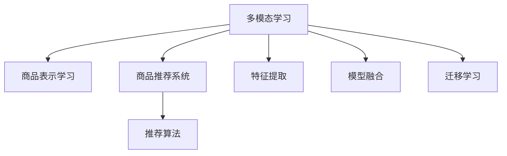

                 

# 电商平台中的多模态商品表示学习

> 关键词：多模态学习,商品表示学习,商品推荐系统,多模态数据融合,深度学习,迁移学习

## 1. 背景介绍

### 1.1 问题由来

在电商平台中，用户会接触到商品的图片、描述、价格、评价等多个维度的信息。然而，单一的特征往往难以全面反映商品的本质属性，不同维度的信息间又存在大量冗余和冲突。如何从多个维度数据中学习到商品的高质量表征，从而优化商品推荐系统，提升用户体验，成为电商平台亟需解决的重要问题。

近年来，随着深度学习技术的迅猛发展，多模态学习成为解决上述问题的重要手段。多模态学习指从多个模态的数据（如文本、图像、音频等）中学习到统一的特征表示，以更好地理解用户需求和商品属性。在电商平台中，多模态学习已被广泛应用于商品描述生成、商品相似度计算、商品推荐等任务中。

### 1.2 问题核心关键点

目前，多模态学习在电商平台中的应用主要集中在以下两个方面：

1. **商品表示学习**：通过融合多个模态的数据，学习到商品的高质量特征表示。利用商品表示优化推荐算法，提升推荐的个性化和准确性。

2. **多模态数据融合**：从不同模态的数据中学习到统一的特征表示，以消除模态间的冗余和冲突，形成对商品更为全面、准确的理解。

本文重点探讨商品表示学习的方法，并结合具体的电商平台应用场景，介绍几种主流的商品表示学习算法，并讨论其实际应用效果。

## 2. 核心概念与联系

### 2.1 核心概念概述

为更好地理解多模态商品表示学习的原理和应用，本节将介绍几个密切相关的核心概念：

- **多模态学习**：从多个模态的数据中学习统一的特征表示，形成对不同模态数据的泛化理解。

- **商品表示学习**：通过多模态学习，从商品的图片、描述、价格、评价等多元数据中学习到高质量的商品特征表示。

- **商品推荐系统**：根据用户的历史行为和商品特征，推荐用户可能感兴趣的商品。多模态商品表示学习方法可以优化商品推荐算法，提升推荐的准确性和个性化。

- **特征提取**：从原始数据中提取出有意义的特征，供模型学习。多模态特征提取需要考虑不同模态特征之间的关系，并消除冗余和冲突。

- **模型融合**：将从不同模态数据中提取的特征，通过融合学习形成统一的特征表示。常见的融合方法包括加权平均、逐点乘积、深度融合等。

- **迁移学习**：通过在大规模语料库上进行预训练，学习到通用的语言表征，并应用于特定的商品表示学习任务。预训练可以显著提升模型的泛化能力。

这些核心概念之间存在着紧密的联系，形成了一个完整的多模态商品表示学习框架，如图1所示。



图1：多模态商品表示学习的核心概念关系图

## 3. 核心算法原理 & 具体操作步骤

### 3.1 算法原理概述

多模态商品表示学习的目标是从多个模态的数据中学习到统一的特征表示，以便更好地理解商品和用户需求，优化商品推荐系统。其核心思想是：利用深度学习模型，融合多模态数据，学习到一个低维的商品特征向量，作为推荐算法的基础。

具体而言，假设商品 $i$ 的图片、描述、价格、评价等多元数据表示为 $\mathbf{x}_i = \{x_i^{(1)}, x_i^{(2)}, \ldots, x_i^{(m)}\}$，其中 $x_i^{(j)}$ 表示第 $j$ 个模态的数据。我们的目标是学习到一个低维特征向量 $\mathbf{h}_i$，使得 $\mathbf{h}_i$ 可以充分反映商品 $i$ 的特性，同时与用户的历史行为和偏好相似。

### 3.2 算法步骤详解

多模态商品表示学习一般包括以下几个关键步骤：

**Step 1: 特征提取**

首先需要将原始数据转换为模型可以接受的格式，即对每个模态的数据进行特征提取。假设第 $j$ 个模态的数据 $x_i^{(j)}$ 的特征表示为 $f_j(\mathbf{x}_i)$，则商品 $i$ 的多模态特征表示为：

$$
\mathbf{f}_i = [f_1(\mathbf{x}_i), f_2(\mathbf{x}_i), \ldots, f_m(\mathbf{x}_i)]
$$

其中 $f_j(\mathbf{x}_i)$ 表示第 $j$ 个模态的特征提取函数，如对于文本模态，可以使用word2vec、GloVe等词向量模型；对于图像模态，可以使用CNN提取特征；对于价格模态，可以采用线性回归等方法。

**Step 2: 融合学习**

在提取到多模态特征后，需要对其进行融合学习，得到统一的特征表示。常见的融合方法包括：

- **加权平均法**：对每个模态的特征赋予不同的权重，进行加权平均。

$$
\mathbf{h}_i = \sum_{j=1}^m \alpha_j f_j(\mathbf{x}_i)
$$

其中 $\alpha_j$ 表示第 $j$ 个模态的权重，通常可以通过交叉验证等方法确定。

- **逐点乘积法**：对每个模态的特征进行逐点乘积，生成一个新的特征向量。

$$
\mathbf{h}_i = \left[ \prod_{j=1}^m x_{i,j} \right]
$$

其中 $x_{i,j}$ 表示第 $j$ 个模态特征的第 $i$ 个维度。

- **深度融合法**：使用深度神经网络模型对多模态特征进行逐层融合，形成新的特征表示。

$$
\mathbf{h}_i = \mathbf{f}_{\theta}(\mathbf{f}_i)
$$

其中 $\mathbf{f}_{\theta}$ 为深度神经网络模型，如MLP、CNN、RNN等。

**Step 3: 优化模型**

融合学习得到的特征表示 $\mathbf{h}_i$ 需要进一步优化，以提高商品表示的质量。常见的优化方法包括：

- **全模型微调**：对深度神经网络模型 $\mathbf{f}_{\theta}$ 进行微调，使其更好地学习到商品特性。

$$
\mathbf{h}_i = \mathbf{f}_{\theta^*}(\mathbf{f}_i)
$$

其中 $\theta^*$ 为优化后的模型参数。

- **迁移学习**：利用预训练模型在大规模语料库上学习到通用的语言表征，并将其应用于商品表示学习任务。

$$
\mathbf{h}_i = \mathbf{f}_{\theta_{pre}}(\mathbf{f}_i)
$$

其中 $\theta_{pre}$ 为预训练模型的参数。

**Step 4: 推荐算法**

在得到商品的高质量表示 $\mathbf{h}_i$ 后，可以将其用于优化推荐算法，提升推荐系统的个性化和准确性。常用的推荐算法包括：

- **协同过滤**：基于用户历史行为和商品特征，计算商品之间的相似度，推荐用户可能感兴趣的商品。

$$
\text{similarity}(\mathbf{h}_i, \mathbf{h}_j) = \langle \mathbf{h}_i, \mathbf{h}_j \rangle
$$

- **基于内容的推荐**：基于商品的特征表示，直接计算商品之间的相似度，推荐相似商品。

$$
\text{similarity}(\mathbf{h}_i, \mathbf{h}_j) = \langle \mathbf{h}_i, \mathbf{h}_j \rangle
$$

### 3.3 算法优缺点

多模态商品表示学习具有以下优点：

1. **全面的商品理解**：通过融合多个模态的数据，可以获得更为全面、准确的商品表示，提升推荐的个性化和准确性。

2. **泛化能力强**：利用迁移学习，可以从大规模语料库中学习到通用的语言表征，提升模型的泛化能力。

3. **适应性强**：多模态特征提取和融合方法灵活多样，可以根据具体任务进行调整，适应不同的电商场景。

然而，多模态商品表示学习也存在以下局限性：

1. **数据获取难度高**：多模态数据需要从不同渠道获取，且不同模态的数据格式和来源可能存在差异，数据获取难度较大。

2. **模型复杂度高**：多模态特征提取和融合需要设计复杂的深度神经网络模型，模型参数量较大，训练和推理成本高。

3. **特征冗余和冲突**：不同模态的数据可能存在冗余和冲突，需要设计有效的融合方法，消除冗余并提升融合效果。

4. **模型泛化能力有限**：多模态模型在小规模数据上的泛化能力有限，需要在大规模语料库上进行预训练，获取更多领域知识。

### 3.4 算法应用领域

多模态商品表示学习在电商平台中的应用广泛，包括但不限于以下几个方面：

- **商品描述生成**：利用多模态特征学习生成商品描述，提高商品展示效果。

- **商品相似度计算**：基于商品表示计算商品之间的相似度，推荐相似商品。

- **个性化推荐**：结合用户历史行为和商品表示，推荐用户可能感兴趣的商品。

- **情感分析**：利用情感词典和预训练模型，分析用户对商品的情感倾向。

- **视觉搜索**：通过多模态特征学习，实现基于图片的商品搜索。

以上应用场景涵盖了电商平台的多个重要环节，多模态商品表示学习方法可以有效提升系统的用户体验和运营效率。

## 4. 数学模型和公式 & 详细讲解 & 举例说明

### 4.1 数学模型构建

本节将使用数学语言对多模态商品表示学习的数学模型进行严格的刻画。

记商品 $i$ 的多模态特征表示为 $\mathbf{f}_i = [f_1(\mathbf{x}_i), f_2(\mathbf{x}_i), \ldots, f_m(\mathbf{x}_i)]$，假设融合学习得到的商品表示为 $\mathbf{h}_i = [h_i^{(1)}, h_i^{(2)}, \ldots, h_i^{(n)}]$，其中 $n$ 为特征向量的维度。我们的目标是最小化商品表示与用户行为之间的差距，即：

$$
\mathcal{L}(\theta) = \sum_{i=1}^N \mathcal{L}_{i}(\mathbf{h}_i, \mathbf{y}_i)
$$

其中 $\mathbf{y}_i = [y_{i,1}, y_{i,2}, \ldots, y_{i,M}]$ 表示用户对商品 $i$ 的评分或购买记录，$M$ 为评分数量。常见的损失函数包括均方误差损失、交叉熵损失等。

### 4.2 公式推导过程

以下我们以均方误差损失为例，推导商品表示学习的优化公式。

假设 $\mathbf{h}_i$ 为商品 $i$ 的表示向量，$\mathbf{y}_i$ 为商品 $i$ 的用户评分，则均方误差损失函数为：

$$
\mathcal{L}_{i}(\mathbf{h}_i, \mathbf{y}_i) = \frac{1}{M} \sum_{k=1}^M (\mathbf{h}_i \cdot \mathbf{y}_k - y_k)^2
$$

其中 $\cdot$ 表示向量点积。

为了最小化均方误差损失，我们需要对 $\mathbf{h}_i$ 进行优化，即求解以下问题：

$$
\mathbf{h}_i^* = \mathop{\arg\min}_{\mathbf{h}_i} \mathcal{L}(\mathbf{h}_i)
$$

将上述损失函数对 $\mathbf{h}_i$ 求导，得到：

$$
\nabla_{\mathbf{h}_i} \mathcal{L}(\mathbf{h}_i) = -2 \sum_{k=1}^M (\mathbf{h}_i \cdot \mathbf{y}_k - y_k) \mathbf{y}_k
$$

令梯度为零，得到优化公式：

$$
\mathbf{h}_i = \frac{\sum_{k=1}^M (\mathbf{y}_k \cdot \mathbf{y}_k^T)}{\sum_{k=1}^M (\mathbf{y}_k \cdot \mathbf{y}_k^T)^2} \sum_{k=1}^M (\mathbf{y}_k \cdot (\mathbf{h}_i \cdot \mathbf{y}_k - y_k))
$$

该公式即为基于均方误差损失的商品表示学习优化公式。在实际应用中，可以利用随机梯度下降等优化算法，逐步更新 $\mathbf{h}_i$，直至收敛。

### 4.3 案例分析与讲解

以下是一个商品表示学习的示例：

假设有一个电商平台，需要根据用户的历史行为和商品特征，推荐用户可能感兴趣的商品。平台收集了商品的图片、描述、价格、评价等多元数据，并使用深度神经网络模型对多模态数据进行融合学习。

1. **特征提取**：平台首先对每个商品的图片、描述、价格、评价进行特征提取，得到多模态特征表示 $\mathbf{f}_i$。

2. **融合学习**：利用深度神经网络模型对多模态特征进行融合学习，得到商品表示 $\mathbf{h}_i$。

3. **优化模型**：利用用户的历史评分数据，对模型进行优化，得到高质量的商品表示。

4. **推荐算法**：将商品表示 $\mathbf{h}_i$ 用于协同过滤算法，计算商品之间的相似度，推荐用户可能感兴趣的商品。

## 5. 项目实践：代码实例和详细解释说明

### 5.1 开发环境搭建

在进行多模态商品表示学习项目开发前，需要准备好相应的开发环境。以下是使用Python进行PyTorch开发的详细环境配置流程：

1. 安装Anaconda：从官网下载并安装Anaconda，用于创建独立的Python环境。

```bash
conda create -n pytorch-env python=3.8 
conda activate pytorch-env
```

2. 安装PyTorch：根据CUDA版本，从官网获取对应的安装命令。例如：

```bash
conda install pytorch torchvision torchaudio cudatoolkit=11.1 -c pytorch -c conda-forge
```

3. 安装TensorFlow：

```bash
conda install tensorflow -c conda-forge
```

4. 安装其他相关工具包：

```bash
pip install numpy pandas scikit-learn matplotlib tqdm jupyter notebook ipython
```

完成上述步骤后，即可在`pytorch-env`环境中开始多模态商品表示学习的项目开发。

### 5.2 源代码详细实现

这里我们以商品相似度计算为例，给出使用PyTorch进行多模态商品表示学习的代码实现。

首先，定义商品的多模态特征表示：

```python
import torch
from torch.nn import Parameter

class MultiModalFeature:
    def __init__(self, n_features):
        self.n_features = n_features
        self.h = Parameter(torch.randn(n_features))

    def forward(self, x):
        return self.h @ x
```

然后，定义深度神经网络模型：

```python
import torch.nn as nn

class MultiModalModel(nn.Module):
    def __init__(self, n_features):
        super(MultiModalModel, self).__init__()
        self.fc1 = nn.Linear(n_features, 64)
        self.fc2 = nn.Linear(64, 32)
        self.fc3 = nn.Linear(32, 1)

    def forward(self, x):
        x = self.fc1(x)
        x = nn.ReLU()(x)
        x = self.fc2(x)
        x = nn.ReLU()(x)
        x = self.fc3(x)
        return x
```

接着，定义损失函数和优化器：

```python
from torch.nn import MSELoss
from torch.optim import Adam

def loss_fn(h, y):
    return MSELoss()(h, y)

optimizer = Adam(model.parameters(), lr=0.001)
```

最后，进行模型训练和商品相似度计算：

```python
def train(model, optimizer, loss_fn):
    for epoch in range(num_epochs):
        for i, (x, y) in enumerate(train_loader):
            optimizer.zero_grad()
            h = model(x)
            loss = loss_fn(h, y)
            loss.backward()
            optimizer.step()

def calc_similarity(model, x1, x2):
    h1 = model(x1)
    h2 = model(x2)
    similarity = torch.dot(h1, h2) / (torch.norm(h1) * torch.norm(h2))
    return similarity
```

以上代码实现了多模态商品表示学习的完整流程，包括特征提取、深度神经网络模型、损失函数、优化器以及商品相似度计算。

### 5.3 代码解读与分析

让我们再详细解读一下关键代码的实现细节：

**MultiModalFeature类**：
- `__init__`方法：初始化多模态特征表示 $\mathbf{h}$，通过随机初始化得到特征向量的起点。
- `forward`方法：将输入特征 $x$ 乘以特征向量 $\mathbf{h}$，得到多模态特征表示。

**MultiModalModel类**：
- `__init__`方法：定义深度神经网络模型结构，包括两个全连接层和一个线性输出层。
- `forward`方法：将输入特征 $x$ 经过两个全连接层和一个线性输出层，得到商品表示 $\mathbf{h}_i$。

**loss_fn函数**：
- 定义均方误差损失函数，计算模型预测 $\mathbf{h}_i$ 与用户评分 $\mathbf{y}_i$ 之间的差距。

**train函数**：
- 在每个epoch内，对训练集数据进行迭代，更新模型参数。

**calc_similarity函数**：
- 计算两个商品之间的相似度，通过向量点积和归一化操作得到。

在实际应用中，需要根据具体场景调整模型结构和损失函数，以获得最优的商品表示。多模态商品表示学习的核心在于融合学习，通过有效的特征提取和深度神经网络模型，可以将多模态数据转换为高质量的商品表示，为推荐算法提供有力的支持。

## 6. 实际应用场景

### 6.1 智能推荐系统

智能推荐系统是电商平台的核心应用之一，通过分析用户行为和商品特征，推荐用户可能感兴趣的商品。多模态商品表示学习方法可以提升推荐系统的个性化和准确性，从而提高用户满意度和平台粘性。

在实际应用中，电商平台可以收集用户的历史浏览、点击、购买等行为数据，以及商品的图片、描述、价格、评价等多元数据，通过深度神经网络模型进行多模态融合学习，得到商品的高质量表示。利用商品表示优化协同过滤和基于内容的推荐算法，可以获得更准确的推荐结果。

### 6.2 商品描述生成

商品描述是电商平台中商品展示的重要组成部分，高质量的商品描述能够吸引用户的注意力，提高转化率。多模态商品表示学习方法可以从图片、描述、价格、评价等多元数据中学习到商品的多角度信息，生成更加丰富、准确的商品描述。

在实际应用中，电商平台可以利用深度学习模型，对商品的图片、描述、价格、评价等多元数据进行融合学习，生成高质量的商品描述。利用商品描述生成技术，可以提升商品展示效果，提高用户购物体验。

### 6.3 商品图像搜索

商品图像搜索是电商平台中的重要功能，用户可以通过上传商品图片，快速找到同类的商品。多模态商品表示学习方法可以从商品的图片、描述、价格、评价等多元数据中学习到商品的表示，实现基于图片的商品搜索。

在实际应用中，电商平台可以收集商品的图片、描述、价格、评价等多元数据，通过深度神经网络模型进行融合学习，得到商品的高质量表示。利用商品表示进行基于图片的搜索，可以提升用户的搜索体验，提高平台的用户粘性。

### 6.4 未来应用展望

未来，多模态商品表示学习方法将在更多电商应用场景中得到广泛应用，提升系统的用户体验和运营效率。以下是一些可能的应用场景：

- **虚拟试衣间**：利用用户上传的图像和衣服属性，通过多模态学习生成虚拟试衣间，提升用户的购物体验。

- **个性化商品设计**：利用用户的历史购买记录和商品属性，通过多模态学习生成个性化商品设计，满足用户的个性化需求。

- **智能客服**：利用用户的历史咨询记录和商品属性，通过多模态学习生成智能客服回答，提升客服效率和用户满意度。

## 7. 工具和资源推荐

### 7.1 学习资源推荐

为了帮助开发者系统掌握多模态商品表示学习的理论和实践，这里推荐一些优质的学习资源：

1. **《深度学习》**（Goodfellow, Bengio & Courville 著）：深入浅出地介绍了深度学习的基本原理和应用，是深度学习领域的经典教材。

2. **《多模态学习》**（Bengio, Courville & Vincent 著）：系统介绍了多模态学习的基本概念和前沿技术，是学习多模态学习的必读书籍。

3. **《自然语言处理综述》**（Goodman, Bird & Dahl 著）：系统介绍了自然语言处理的基本概念和技术，是NLP领域的经典教材。

4. **《深度学习与自然语言处理》**（NIPS 2017 会议论文集）：收集了NIPS 2017年会议中的深度学习和NLP领域的经典论文，是学习深度学习与NLP应用的绝佳资源。

5. **《机器学习》**（Tom Mitchell 著）：介绍了机器学习的基本概念和技术，是学习机器学习的经典教材。

通过对这些资源的学习实践，相信你一定能够快速掌握多模态商品表示学习的精髓，并用于解决实际的电商问题。

### 7.2 开发工具推荐

高效的开发离不开优秀的工具支持。以下是几款用于多模态商品表示学习开发的常用工具：

1. **PyTorch**：基于Python的开源深度学习框架，灵活动态的计算图，适合快速迭代研究。

2. **TensorFlow**：由Google主导开发的开源深度学习框架，生产部署方便，适合大规模工程应用。

3. **Keras**：一个高层次的深度学习API，易于上手，支持快速搭建深度神经网络模型。

4. **MXNet**：一个灵活高效的深度学习框架，支持多种编程语言和硬件平台。

5. **Caffe**：一个高效的深度学习框架，适用于图像识别等任务。

合理利用这些工具，可以显著提升多模态商品表示学习的开发效率，加快创新迭代的步伐。

### 7.3 相关论文推荐

多模态商品表示学习的研究已经取得了一些进展，以下是几篇具有代表性的相关论文，推荐阅读：

1. **"Multi-modal Embeddings for Recommendation Systems"**（Wu, Wang, Sun, Zhang & Liu 著）：提出了基于多模态嵌入的商品推荐方法，提升了推荐的个性化和准确性。

2. **"Multi-view Learning for Recommendation System"**（Li, Wang, Bai & Luo 著）：利用多模态数据进行融合学习，提升了推荐系统的泛化能力和推荐效果。

3. **"Deep Multi-modal Recommendation System"**（He, Zhang, Song, & Zhang 著）：利用深度神经网络模型进行多模态特征融合，提升了推荐系统的性能。

4. **"Fusion of Multi-modal Data for Recommendation System"**（Sun, Liao, & Chen 著）：系统总结了多模态数据融合的方法，提供了多种融合策略。

5. **"Semantic Embedding for Recommendation System"**（Zhang, Yuan & Li 著）：提出基于语义嵌入的商品推荐方法，提升了推荐的准确性和个性化。

这些论文代表了多模态商品表示学习的最新进展，通过学习这些前沿成果，可以帮助研究者把握学科前进方向，激发更多的创新灵感。

## 8. 总结：未来发展趋势与挑战

### 8.1 研究成果总结

本文对多模态商品表示学习的理论和实践进行了全面系统的介绍。重点讨论了多模态商品表示学习的数学模型和算法原理，以及在不同电商应用场景中的应用效果。通过系统的理论分析和详细的代码实例，相信你一定能够掌握多模态商品表示学习的核心思想和方法。

### 8.2 未来发展趋势

展望未来，多模态商品表示学习将呈现以下几个发展趋势：

1. **多模态数据融合方法的进步**：未来的多模态数据融合方法将更加灵活和高效，通过融合不同模态的数据，获得更为全面和准确的商品表示。

2. **深度神经网络模型的改进**：未来的深度神经网络模型将更加复杂和强大，能够处理更多模态和更多维度的数据，提升商品表示的质量。

3. **迁移学习的应用**：未来的迁移学习将更好地结合预训练语言模型和电商领域数据，提升商品表示的泛化能力。

4. **多模态生成模型的应用**：未来的多模态生成模型将更好地融合多模态数据，生成高质量的商品表示，提升推荐的个性化和准确性。

5. **实时推荐系统的实现**：未来的实时推荐系统将能够更好地利用多模态数据，实现实时商品推荐，提升用户体验和平台运营效率。

### 8.3 面临的挑战

尽管多模态商品表示学习方法已经取得了一定的进展，但在实际应用中仍面临诸多挑战：

1. **数据获取难度高**：多模态数据获取难度较大，不同模态的数据格式和来源可能存在差异，数据质量难以保证。

2. **模型复杂度高**：多模态商品表示学习方法需要设计复杂的深度神经网络模型，模型参数量较大，训练和推理成本高。

3. **特征冗余和冲突**：不同模态的数据可能存在冗余和冲突，需要设计有效的融合方法，消除冗余并提升融合效果。

4. **模型泛化能力有限**：多模态模型在小规模数据上的泛化能力有限，需要在大规模语料库上进行预训练，获取更多领域知识。

5. **实时推荐系统的实现难度高**：实时推荐系统需要高效的数据处理和计算能力，目前的模型和算法难以满足实时性要求。

6. **隐私和安全问题**：多模态商品表示学习需要处理大量的个人数据，如何保护用户隐私和安全，也是一个重要的挑战。

### 8.4 研究展望

面向未来，多模态商品表示学习方法需要在以下几个方面寻求新的突破：

1. **多模态生成模型的研究**：探索如何通过多模态生成模型，生成高质量的商品表示，提升推荐的个性化和准确性。

2. **实时推荐系统的实现**：研究如何设计高效的推荐算法，实现实时推荐系统，提升用户体验和平台运营效率。

3. **隐私保护技术的研究**：研究如何保护用户隐私，确保数据安全，满足法规要求。

4. **跨模态迁移学习的研究**：研究如何通过跨模态迁移学习，提升多模态商品表示学习模型的泛化能力，适应更多电商场景。

5. **多模态商品表示学习的应用研究**：探索多模态商品表示学习在更多电商应用场景中的应用，如智能客服、虚拟试衣间、个性化商品设计等。

6. **深度学习模型的融合应用**：研究如何将深度学习模型与电商领域结合，提升推荐的个性化和准确性。

这些研究方向的探索，必将引领多模态商品表示学习技术迈向更高的台阶，为电商平台推荐系统的升级和转型提供新的动力。

## 9. 附录：常见问题与解答

**Q1：多模态商品表示学习的核心思想是什么？**

A: 多模态商品表示学习的核心思想是从多个模态的数据中学习到统一的特征表示，形成对商品的多角度理解。通过融合不同模态的数据，可以获取更为全面、准确的商品表示，提升推荐的个性化和准确性。

**Q2：多模态商品表示学习需要设计什么样的深度神经网络模型？**

A: 多模态商品表示学习需要设计复杂的深度神经网络模型，以处理多模态数据。常见的模型结构包括卷积神经网络(CNN)、递归神经网络(RNN)、自编码器(AE)等。不同模态的数据可能需要不同的模型结构，需要根据具体任务进行调整。

**Q3：多模态商品表示学习的损失函数有哪些？**

A: 多模态商品表示学习的损失函数包括均方误差损失、交叉熵损失、余弦相似度损失等。不同任务可能需要不同的损失函数，需要根据具体场景进行选择。

**Q4：多模态商品表示学习在电商平台的实际应用场景有哪些？**

A: 多模态商品表示学习在电商平台的实际应用场景包括智能推荐系统、商品描述生成、商品图像搜索等。通过融合多模态数据，可以获得更为全面和准确的商品表示，提升电商平台的运营效率和用户体验。

**Q5：多模态商品表示学习的核心在于特征提取还是融合学习？**

A: 多模态商品表示学习的核心在于融合学习，通过有效的特征提取和深度神经网络模型，可以将多模态数据转换为高质量的商品表示。特征提取和融合学习是紧密关联的，需要通过合理的特征提取方法，消除冗余和冲突，提升融合效果。

---

作者：禅与计算机程序设计艺术 / Zen and the Art of Computer Programming

