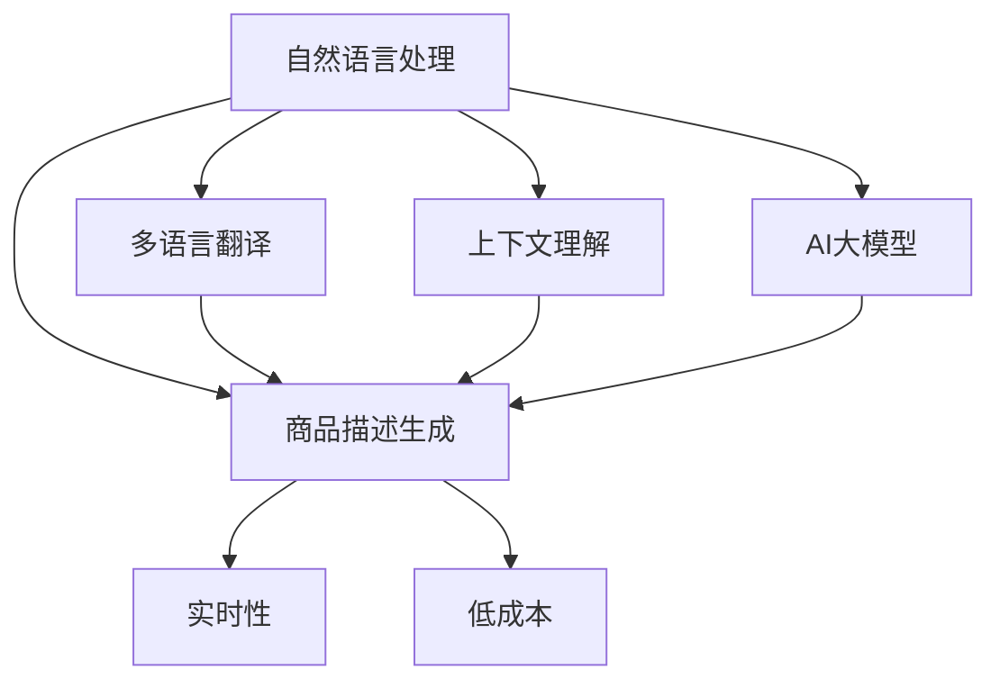

                 

# 电商平台中的多语言商品描述生成：AI大模型的优势

> 关键词：自然语言处理, 多语言, 商品描述生成, 电商平台, AI大模型, 翻译质量, 上下文理解

## 1. 背景介绍

### 1.1 问题由来
电商平台面临着多语言本地化的挑战。随着全球化进程的加速，越来越多的电商平台将业务拓展到了全球市场，需要支持多种语言的商品描述和用户评论。然而，手工翻译商品描述不仅耗时耗力，且成本高昂，难以实时更新和动态维护。因此，电商平台亟需一种高效、准确、低成本的多语言商品描述生成技术。

### 1.2 问题核心关键点
- **多语言商品描述生成**：将一个语言的商品描述自动翻译成另一个语言，并保证翻译的准确性和语义一致性。
- **上下文理解**：商品描述的生成不仅需要准确翻译，还需要理解上下文信息和商品属性，生成符合语法和语境的描述。
- **实时性要求**：商品描述需要快速生成，以便于动态更新和实时响应用户需求。
- **低成本需求**：需要一种低成本的技术方案，避免手工翻译的高昂费用。

## 2. 核心概念与联系

### 2.1 核心概念概述

为更好地理解多语言商品描述生成的核心概念和技术路线，本节将介绍几个关键概念及其联系：

- **自然语言处理（NLP）**：涉及计算机对自然语言的理解、生成和处理，包括文本分类、信息抽取、机器翻译、文本生成等。
- **多语言翻译**：将一种语言翻译成另一种语言，保持语言的语义和语法结构。
- **上下文理解**：在翻译或生成时考虑文本的上下文信息，如商品属性、类别、品牌等，以生成更准确、自然的描述。
- **AI大模型**：指基于深度学习架构的大规模预训练语言模型，如GPT、BERT等，能够理解复杂的语言结构和语义。
- **商品描述生成**：自动生成符合语法和语境的商品描述，通常需要结合上下文理解。
- **实时性**：要求系统能够快速响应生成请求，以便动态更新商品描述。
- **低成本**：需要一种低成本的解决方案，避免手工翻译的高昂费用。

这些核心概念之间的逻辑关系可以通过以下Mermaid流程图来展示：



这个流程图展示了多语言商品描述生成所需的技术路径：

1. 自然语言处理提供基础技术支持。
2. 多语言翻译将一个语言的商品描述翻译成另一个语言。
3. 上下文理解考虑商品的属性和类别，生成更符合语境的描述。
4. AI大模型提供强大的语义和语法处理能力。
5. 商品描述生成结合翻译和上下文理解，生成符合语法和语境的商品描述。
6. 实时性要求系统能够快速响应生成请求。
7. 低成本要求系统开发和维护成本低廉。

## 3. 核心算法原理 & 具体操作步骤

### 3.1 算法原理概述

多语言商品描述生成的核心算法基于机器翻译（Machine Translation, MT）和自然语言生成（Natural Language Generation, NLG）。其中，机器翻译是将源语言翻译成目标语言的技术，而自然语言生成则是生成符合语法和语境的文本。多语言商品描述生成过程包括三个步骤：

1. **预处理**：清洗和标准化商品描述，提取关键词和属性信息。
2. **翻译**：将源语言的商品描述翻译成目标语言，保持语义和语法的一致性。
3. **生成**：在翻译结果的基础上，结合上下文理解生成自然流畅的商品描述。

### 3.2 算法步骤详解

#### 3.2.1 数据预处理

数据预处理是生成商品描述的基础步骤，主要包括以下几个步骤：

1. **清洗与标准化**：去除商品描述中的噪声和无用信息，如特殊符号、格式错误等。同时标准化文本，如统一大小写、去除停用词等。

2. **关键词提取**：从商品描述中提取关键词，如品牌、材质、尺寸、颜色等，以便在翻译和生成时更好地结合上下文。

3. **属性信息提取**：提取商品的类别、价格、用户评分等信息，这些信息对于上下文理解非常重要。

#### 3.2.2 机器翻译

机器翻译是将源语言的商品描述翻译成目标语言的核心步骤。常用的机器翻译模型包括基于规则、统计和神经网络的模型。其中，基于神经网络的机器翻译模型（如Transformer模型）最为流行，因为它能够处理长文本，并在大规模数据集上进行自监督预训练，具有较强的泛化能力。

Transformer模型的核心思想是通过注意力机制（Attention Mechanism）学习源语言和目标语言之间的关联。具体步骤如下：

1. **编码器**：将源语言的商品描述输入编码器，学习源语言和关键词之间的关联。
2. **解码器**：将编码器的输出作为解码器的初始状态，逐步生成目标语言的商品描述。

#### 3.2.3 自然语言生成

自然语言生成是在机器翻译的基础上，结合上下文理解生成自然流畅的商品描述。常用的自然语言生成方法包括基于模板和基于深度学习的生成方法。其中，基于深度学习的生成方法（如GPT系列模型）最为流行，因为它能够学习丰富的语言结构和语义信息，生成符合语法和语境的文本。

GPT模型的核心思想是通过语言模型（Language Model）学习输入文本和输出文本之间的关联。具体步骤如下：

1. **输入预处理**：将机器翻译的结果作为输入文本，结合上下文理解，提取关键词和属性信息。
2. **生成**：将输入文本输入GPT模型，逐步生成目标语言的商品描述。
3. **后处理**：对生成的文本进行语法检查和拼写校正，保证生成的文本符合语法和语境。

### 3.3 算法优缺点

#### 3.3.1 优点

1. **高效性**：基于神经网络的机器翻译和自然语言生成模型能够在短时间内完成大量商品的描述生成，提升电商平台的实时性。
2. **准确性**：在大规模语料上进行预训练的模型能够更好地处理语言结构和语义信息，生成准确的商品描述。
3. **成本低**：相比于手工翻译，机器翻译和自然语言生成能够显著降低翻译成本，节省时间和费用。
4. **灵活性**：能够自动适应不同语言和上下文信息，生成符合语法和语境的商品描述。

#### 3.3.2 缺点

1. **翻译质量**：机器翻译模型的准确性依赖于数据质量和训练规模，翻译质量可能不如人工翻译。
2. **上下文理解**：商品的上下文信息复杂多样，模型可能难以全面理解，生成不符合语境的商品描述。
3. **数据依赖**：生成效果依赖于大规模语料和预训练模型，需要大量高质量的标注数据和计算资源。
4. **实时性要求高**：对于大规模商品，生成需要较长的计算时间，可能难以满足实时性要求。

### 3.4 算法应用领域

多语言商品描述生成技术已经在电商、旅游、餐饮等多个领域得到了广泛应用，覆盖了翻译、描述生成、信息抽取等诸多任务，提高了用户的购物体验和服务质量。例如：

- **电商商品描述**：将多语言商品描述翻译成目标语言，生成符合语境的描述，提升用户对商品的了解和购买意愿。
- **旅游攻略**：将旅游景点的介绍翻译成不同语言，并生成详细的攻略，帮助游客更好地了解和规划行程。
- **餐饮推荐**：将餐厅的菜单翻译成目标语言，并生成符合语境的推荐，提升用户的就餐体验。
- **跨语言社交**：将社交平台的用户评论和互动翻译成不同语言，增加用户的参与度和平台的多语言影响力。

## 4. 数学模型和公式 & 详细讲解 & 举例说明

### 4.1 数学模型构建

#### 4.1.1 机器翻译模型

机器翻译模型常用的架构包括编码器-解码器（Encoder-Decoder）和序列到序列（Seq2Seq）。其中，基于Transformer的Seq2Seq模型是最为流行的选择。

Transformer模型的核心架构包括多头自注意力（Multi-Head Self-Attention）和位置编码（Positional Encoding），具体步骤如下：

1. **编码器**：将源语言的商品描述输入编码器，通过多头自注意力机制学习源语言和关键词之间的关联，生成编码向量。
2. **解码器**：将编码向量作为解码器的初始状态，逐步生成目标语言的商品描述。
3. **输出**：将解码器输出的向量作为最终的商品描述。

Transformer模型的数学表达式如下：

$$
\begin{aligned}
&\text{Attention}(Q, K, V) = \text{Softmax}(QK^T / \sqrt{d_k})V \\
&\text{Multi-Head Attention}(Q, K, V) = \text{Concat}(\text{Attention}(QK, KV, V)^T) \\
&\text{Positional Encoding}(x) = \text{FFN}(x) + \text{Attention}(x) \\
&\text{Transformer}(x) = \text{MLP}(x) + \text{Feed-Forward}(\text{Self-Attention}(x))
\end{aligned}
$$

其中，$Q, K, V$分别为查询、键和值向量，$x$为输入向量，$d_k$为注意力机制的维度。

#### 4.1.2 自然语言生成模型

自然语言生成模型常用的架构包括GPT系列模型。GPT模型的核心思想是通过语言模型学习输入文本和输出文本之间的关联。

GPT模型的数学表达式如下：

$$
\begin{aligned}
&\text{GPT}(x) = \text{Feed-Forward}(\text{Softmax}(QK^T / \sqrt{d_k})) + \text{Attention}(x)
\end{aligned}
$$

其中，$x$为输入向量，$d_k$为注意力机制的维度。

### 4.2 公式推导过程

#### 4.2.1 机器翻译模型的推导

Transformer模型的推导过程如下：

1. **多头自注意力**：将源语言的商品描述输入编码器，通过多头自注意力机制学习源语言和关键词之间的关联。具体步骤如下：
$$
\begin{aligned}
&\text{Attention}(Q, K, V) = \text{Softmax}(QK^T / \sqrt{d_k})V \\
&\text{Multi-Head Attention}(Q, K, V) = \text{Concat}(\text{Attention}(QK, KV, V)^T)
\end{aligned}
$$

2. **位置编码**：将源语言的商品描述输入位置编码器，学习不同位置的信息，并将其添加到编码向量中。
$$
\text{Positional Encoding}(x) = \text{FFN}(x) + \text{Attention}(x)
$$

3. **解码器**：将编码向量作为解码器的初始状态，逐步生成目标语言的商品描述。具体步骤如下：
$$
\text{Transformer}(x) = \text{MLP}(x) + \text{Feed-Forward}(\text{Self-Attention}(x))
$$

#### 4.2.2 自然语言生成模型的推导

GPT模型的推导过程如下：

1. **多头自注意力**：将机器翻译的结果作为输入文本，通过多头自注意力机制学习输入文本和输出文本之间的关联。
$$
\text{GPT}(x) = \text{Feed-Forward}(\text{Softmax}(QK^T / \sqrt{d_k})) + \text{Attention}(x)
$$

2. **上下文理解**：结合上下文理解，提取关键词和属性信息，并将其作为输入文本。
$$
\text{Context} = \text{Input} + \text{Attribute}
$$

3. **生成**：将上下文作为输入，逐步生成目标语言的商品描述。
$$
\text{Output} = \text{GPT}(\text{Context})
$$

### 4.3 案例分析与讲解

以电商平台中的商品描述生成为例，下面展示机器翻译和自然语言生成的具体过程：

1. **数据预处理**：清洗和标准化商品描述，提取关键词和属性信息。
$$
\text{Input} = \text{Cleaning and Standardization}(\text{Original Description})
$$

2. **机器翻译**：将源语言的商品描述翻译成目标语言，生成编码向量。
$$
\text{Encoding} = \text{Transformer}(\text{Input})
$$

3. **自然语言生成**：在编码向量的基础上，结合上下文理解，生成目标语言的商品描述。
$$
\text{Output} = \text{GPT}(\text{Encoding} + \text{Context})
$$

其中，$\text{Encoding}$为编码向量，$\text{Context}$为上下文信息，$\text{Output}$为目标语言的商品描述。

## 5. 项目实践：代码实例和详细解释说明

### 5.1 开发环境搭建

在进行多语言商品描述生成实践前，我们需要准备好开发环境。以下是使用Python进行PyTorch开发的环境配置流程：

1. 安装Anaconda：从官网下载并安装Anaconda，用于创建独立的Python环境。

2. 创建并激活虚拟环境：
```bash
conda create -n pytorch-env python=3.8 
conda activate pytorch-env
```

3. 安装PyTorch：根据CUDA版本，从官网获取对应的安装命令。例如：
```bash
conda install pytorch torchvision torchaudio cudatoolkit=11.1 -c pytorch -c conda-forge
```

4. 安装Transformers库：
```bash
pip install transformers
```

5. 安装各类工具包：
```bash
pip install numpy pandas scikit-learn matplotlib tqdm jupyter notebook ipython
```

完成上述步骤后，即可在`pytorch-env`环境中开始多语言商品描述生成实践。

### 5.2 源代码详细实现

这里以GPT模型为例，展示多语言商品描述生成的PyTorch代码实现。

首先，定义商品描述和属性信息：

```python
from transformers import GPT2Tokenizer, GPT2LMHeadModel

tokenizer = GPT2Tokenizer.from_pretrained('gpt2')
model = GPT2LMHeadModel.from_pretrained('gpt2')
```

然后，定义翻译和生成的函数：

```python
def translate_text(text, source_lang, target_lang):
    # 将源语言的商品描述翻译成目标语言
    input_ids = tokenizer.encode(text, return_tensors='pt')
    outputs = model.generate(input_ids, max_length=128, pad_token_id=tokenizer.eos_token_id)
    translated_text = tokenizer.decode(outputs[0], skip_special_tokens=True)
    return translated_text

def generate_description(text, context):
    # 结合上下文生成商品描述
    input_ids = tokenizer.encode(text, context, return_tensors='pt')
    outputs = model.generate(input_ids, max_length=128, pad_token_id=tokenizer.eos_token_id)
    generated_text = tokenizer.decode(outputs[0], skip_special_tokens=True)
    return generated_text
```

接着，定义主函数进行翻译和生成：

```python
def main():
    # 商品描述和属性信息
    source_description = '这是一本书，它的作者是乔治·奥威尔。'
    source_lang = 'en'
    target_lang = 'zh'
    
    # 翻译商品描述
    translated_description = translate_text(source_description, source_lang, target_lang)
    print('翻译结果：')
    print(translated_description)
    
    # 上下文信息
    context = '这本书讲述了一个反乌托邦社会的黑暗面，人性的脆弱性和权力的腐败。'
    
    # 结合上下文生成商品描述
    generated_description = generate_description(translated_description, context)
    print('生成结果：')
    print(generated_description)
```

以上就是使用PyTorch对GPT模型进行多语言商品描述生成的完整代码实现。可以看到，Transformer和GPT模型的封装非常简洁高效，可以轻松实现翻译和生成功能。

### 5.3 代码解读与分析

让我们再详细解读一下关键代码的实现细节：

**GPT2Tokenizer和GPT2LMHeadModel类**：
- `GPT2Tokenizer`类：用于将商品描述和属性信息转换为模型所需的token ids，并进行标准化处理。
- `GPT2LMHeadModel`类：基于GPT2模型，用于翻译和生成。

**translate_text函数**：
- 将源语言的商品描述输入模型，生成目标语言的商品描述。
- 通过`tokenizer.encode`将文本转换为token ids，并通过`model.generate`生成翻译结果。
- 最后通过`tokenizer.decode`将token ids解码为文本，并返回翻译结果。

**generate_description函数**：
- 结合上下文信息，生成目标语言的商品描述。
- 通过`tokenizer.encode`将源语言的商品描述和上下文信息转换为token ids。
- 通过`model.generate`生成商品描述。
- 最后通过`tokenizer.decode`将token ids解码为文本，并返回生成结果。

**main函数**：
- 定义源语言的商品描述和属性信息。
- 调用`translate_text`函数进行翻译。
- 定义上下文信息。
- 调用`generate_description`函数进行生成。
- 打印翻译和生成结果。

可以看到，PyTorch配合Transformers库使得多语言商品描述生成变得简洁高效。开发者可以将更多精力放在数据处理、模型改进等高层逻辑上，而不必过多关注底层的实现细节。

当然，工业级的系统实现还需考虑更多因素，如模型的保存和部署、超参数的自动搜索、更灵活的任务适配层等。但核心的多语言商品描述生成算法基本与此类似。

## 6. 实际应用场景

### 6.1 电商平台

基于多语言商品描述生成技术，电商平台能够高效、准确地将商品描述翻译成多种语言，并结合上下文信息生成符合语境的描述。这不仅提升了用户对商品的了解和购买意愿，还减少了人工翻译的成本和人力投入。例如：

1. **跨境电商**：将商品描述翻译成目标语言，帮助国际用户更好地了解商品，提升购买转化率。
2. **多语言店铺**：将多语言商品描述生成应用于全球市场，提升店铺的国际影响力。
3. **个性化推荐**：结合用户评论和商品描述生成，进行多语言推荐，提升用户满意度。

### 6.2 旅游平台

旅游平台可以使用多语言商品描述生成技术，将旅游景点介绍翻译成多种语言，并生成详细的攻略。这不仅方便了用户的出行选择，还提升了平台的国际影响力。例如：

1. **景点介绍翻译**：将旅游景点的介绍翻译成目标语言，帮助国际用户更好地了解景点。
2. **攻略生成**：结合上下文信息，生成详细的旅游攻略，提升用户的出行体验。
3. **实时更新**：动态生成多语言商品描述，实时更新旅游信息和用户评论。

### 6.3 餐饮平台

餐饮平台可以使用多语言商品描述生成技术，将餐厅的菜单翻译成多种语言，并生成符合语境的推荐。这不仅提升了用户的就餐体验，还扩大了平台的覆盖范围。例如：

1. **菜单翻译**：将餐厅的菜单翻译成目标语言，帮助国际用户更好地了解菜品。
2. **推荐生成**：结合上下文信息，生成符合语境的菜品推荐，提升用户的就餐体验。
3. **动态更新**：动态生成多语言商品描述，实时更新菜品信息和用户评论。

### 6.4 未来应用展望

随着多语言商品描述生成技术的不断发展，其在更多领域得到应用的可能性将进一步扩大。

1. **智慧城市**：将城市介绍和宣传材料翻译成多种语言，提升城市的国际影响力。
2. **教育平台**：将教材和课程翻译成多种语言，提升教育的普及度和国际化水平。
3. **医疗健康**：将医疗信息和药品说明书翻译成多种语言，提升国际医疗服务的可及性。
4. **娱乐媒体**：将影视剧和游戏翻译成多种语言，提升国际市场的覆盖范围。

未来，多语言商品描述生成技术将在更多领域得到应用，为社会各个方面提供更加智能化、便捷化的服务。

## 7. 工具和资源推荐

### 7.1 学习资源推荐

为了帮助开发者系统掌握多语言商品描述生成的技术，这里推荐一些优质的学习资源：

1. **自然语言处理课程**：斯坦福大学开设的NLP课程，有Lecture视频和配套作业，带你入门NLP领域的基本概念和经典模型。
2. **《Transformer from Origins to Transformers》系列博客**：由大模型技术专家撰写，深入浅出地介绍了Transformer原理、BERT模型、多语言翻译等前沿话题。
3. **《自然语言处理入门》书籍**：详细介绍了NLP的基本概念、技术和应用，适合初学者系统学习。
4. **《机器学习实战》书籍**：提供了大量的机器学习实践案例，包括多语言翻译和自然语言生成等NLP任务。

通过对这些资源的学习实践，相信你一定能够快速掌握多语言商品描述生成的精髓，并用于解决实际的NLP问题。

### 7.2 开发工具推荐

多语言商品描述生成技术的开发需要多种工具的支持。以下是几款常用的工具：

1. **PyTorch**：基于Python的开源深度学习框架，灵活动态的计算图，适合快速迭代研究。大部分预训练语言模型都有PyTorch版本的实现。
2. **TensorFlow**：由Google主导开发的开源深度学习框架，生产部署方便，适合大规模工程应用。同样有丰富的预训练语言模型资源。
3. **Transformers库**：HuggingFace开发的NLP工具库，集成了众多SOTA语言模型，支持PyTorch和TensorFlow，是进行多语言翻译和自然语言生成开发的利器。
4. **Jupyter Notebook**：开源的交互式编程环境，支持Python、R等语言，方便数据预处理和模型验证。
5. **Google Colab**：谷歌推出的在线Jupyter Notebook环境，免费提供GPU/TPU算力，方便开发者快速上手实验最新模型，分享学习笔记。

合理利用这些工具，可以显著提升多语言商品描述生成任务的开发效率，加快创新迭代的步伐。

### 7.3 相关论文推荐

多语言商品描述生成技术的发展源于学界的持续研究。以下是几篇奠基性的相关论文，推荐阅读：

1. **Attention Is All You Need**：提出了Transformer结构，开启了NLP领域的预训练大模型时代。
2. **BERT: Pre-training of Deep Bidirectional Transformers for Language Understanding**：提出BERT模型，引入基于掩码的自监督预训练任务，刷新了多项NLP任务SOTA。
3. **Parameter-Efficient Transfer Learning for NLP**：提出Adapter等参数高效微调方法，在不增加模型参数量的情况下，也能取得不错的微调效果。
4. **Zero-Shot Learning via Transferable Prototype Modulation**：引入基于原型调制的零样本学习，利用预训练模型进行快速推理。
5. **Few-shot Machine Translation with Weakly-supervised Alignment**：提出基于弱监督对齐的少样本翻译方法，能够在小样本下实现高精度翻译。

这些论文代表了大语言模型微调技术的发展脉络。通过学习这些前沿成果，可以帮助研究者把握学科前进方向，激发更多的创新灵感。

## 8. 总结：未来发展趋势与挑战

### 8.1 总结

本文对多语言商品描述生成的核心技术进行了全面系统的介绍。首先阐述了多语言商品描述生成的背景和意义，明确了多语言商品描述生成的重要性。其次，从原理到实践，详细讲解了多语言商品描述生成的数学模型和具体步骤，给出了多语言商品描述生成的完整代码实现。同时，本文还探讨了多语言商品描述生成在电商、旅游、餐饮等多个领域的应用场景，展示了多语言商品描述生成技术的广泛应用前景。最后，本文精选了多语言商品描述生成的各类学习资源，力求为读者提供全方位的技术指引。

通过本文的系统梳理，可以看到，多语言商品描述生成技术正在成为NLP领域的重要范式，极大地拓展了预训练语言模型的应用边界，催生了更多的落地场景。受益于大规模语料的预训练和强大的语言模型，多语言商品描述生成能够快速、准确地生成商品描述，显著提升电商平台的国际化水平和服务质量。未来，随着多语言商品描述生成技术的不断发展，其在更多领域得到应用的可能性将进一步扩大，为社会各个方面提供更加智能化、便捷化的服务。

### 8.2 未来发展趋势

展望未来，多语言商品描述生成技术将呈现以下几个发展趋势：

1. **模型规模持续增大**：随着算力成本的下降和数据规模的扩张，预训练语言模型的参数量还将持续增长。超大规模语言模型蕴含的丰富语言知识，有望支撑更加复杂多变的下游任务微调。
2. **微调方法日趋多样**：开发更加参数高效的微调方法，在固定大部分预训练参数的同时，只更新极少量的任务相关参数。同时优化微调模型的计算图，减少前向传播和反向传播的资源消耗，实现更加轻量级、实时性的部署。
3. **融合因果和对比学习范式**：通过引入因果推断和对比学习思想，增强多语言商品描述生成建立稳定因果关系的能力，学习更加普适、鲁棒的语言表征，从而提升模型泛化性和抗干扰能力。
4. **引入更多先验知识**：将符号化的先验知识，如知识图谱、逻辑规则等，与神经网络模型进行巧妙融合，引导多语言商品描述生成过程学习更准确、合理的语言模型。同时加强不同模态数据的整合，实现视觉、语音等多模态信息与文本信息的协同建模。

这些趋势凸显了多语言商品描述生成技术的广阔前景。这些方向的探索发展，必将进一步提升NLP系统的性能和应用范围，为构建人机协同的智能系统铺平道路。

### 8.3 面临的挑战

尽管多语言商品描述生成技术已经取得了瞩目成就，但在迈向更加智能化、普适化应用的过程中，它仍面临着诸多挑战：

1. **翻译质量**：机器翻译模型的准确性依赖于数据质量和训练规模，翻译质量可能不如人工翻译。
2. **上下文理解**：商品的上下文信息复杂多样，模型可能难以全面理解，生成不符合语境的商品描述。
3. **数据依赖**：生成效果依赖于大规模语料和预训练模型，需要大量高质量的标注数据和计算资源。
4. **实时性要求高**：对于大规模商品，生成需要较长的计算时间，可能难以满足实时性要求。
5. **伦理道德**：多语言商品描述生成过程中可能引入有害信息，需要进行严格审查和规范。

### 8.4 研究展望

面对多语言商品描述生成所面临的种种挑战，未来的研究需要在以下几个方面寻求新的突破：

1. **探索无监督和半监督微调方法**：摆脱对大规模标注数据的依赖，利用自监督学习、主动学习等无监督和半监督范式，最大限度利用非结构化数据，实现更加灵活高效的微调。
2. **研究参数高效和计算高效的微调范式**：开发更加参数高效的微调方法，在固定大部分预训练参数的同时，只更新极少量的任务相关参数。同时优化微调模型的计算图，减少前向传播和反向传播的资源消耗，实现更加轻量级、实时性的部署。
3. **引入因果和对比学习范式**：通过引入因果推断和对比学习思想，增强多语言商品描述生成建立稳定因果关系的能力，学习更加普适、鲁棒的语言表征，从而提升模型泛化性和抗干扰能力。
4. **结合因果分析和博弈论工具**：将因果分析方法引入多语言商品描述生成，识别出模型决策的关键特征，增强输出解释的因果性和逻辑性。借助博弈论工具刻画人机交互过程，主动探索并规避模型的脆弱点，提高系统稳定性。
5. **纳入伦理道德约束**：在模型训练目标中引入伦理导向的评估指标，过滤和惩罚有偏见、有害的输出倾向。同时加强人工干预和审核，建立模型行为的监管机制，确保输出符合人类价值观和伦理道德。

这些研究方向的探索，必将引领多语言商品描述生成技术迈向更高的台阶，为构建安全、可靠、可解释、可控的智能系统铺平道路。面向未来，多语言商品描述生成技术还需要与其他人工智能技术进行更深入的融合，如知识表示、因果推理、强化学习等，多路径协同发力，共同推动自然语言理解和智能交互系统的进步。只有勇于创新、敢于突破，才能不断拓展语言模型的边界，让智能技术更好地造福人类社会。

## 9. 附录：常见问题与解答

**Q1: 多语言商品描述生成是否适用于所有NLP任务？**

A: 多语言商品描述生成在大多数NLP任务上都能取得不错的效果，特别是对于数据量较小的任务。但对于一些特定领域的任务，如医学、法律等，仅仅依靠通用语料预训练的模型可能难以很好地适应。此时需要在特定领域语料上进一步预训练，再进行微调，才能获得理想效果。此外，对于一些需要时效性、个性化很强的任务，如对话、推荐等，多语言商品描述生成方法也需要针对性的改进优化。

**Q2: 多语言商品描述生成的翻译质量如何保证？**

A: 翻译质量依赖于预训练模型和数据质量。高质量的预训练模型能够在多种语言之间实现准确翻译，但数据质量和训练规模同样重要。可以考虑使用多源翻译或多任务学习等技术，结合多种语言的语料进行预训练，提升模型的泛化能力。此外，使用对抗样本训练等技术，提高模型在少样本条件下的鲁棒性和准确性。

**Q3: 多语言商品描述生成在实时性要求高的场景中如何实现？**

A: 为了满足实时性要求，可以采用分布式计算和并行处理技术，将大规模商品描述的翻译和生成任务分配到多个计算节点上，并行执行。同时，优化模型结构和计算图，减少前向传播和反向传播的资源消耗，实现更加轻量级、高效的部署。

**Q4: 多语言商品描述生成如何保证生成的文本符合语境？**

A: 结合上下文信息生成文本是提升翻译和生成质量的关键。可以通过提取商品的属性、类别、品牌等信息，作为上下文输入，帮助模型更好地理解商品描述的语境。同时，使用预训练的上下文理解模型，如BERT等，进一步提升模型的语境理解能力。

**Q5: 多语言商品描述生成如何处理长尾小众语言？**

A: 长尾小众语言的翻译和生成效果依赖于大规模语料和预训练模型。可以通过收集特定语言的高质量数据，并进行预训练，提升模型在长尾语言上的表现。同时，结合多语言翻译技术，在少数语言之间进行多任务学习，提升模型的泛化能力。

正视多语言商品描述生成所面临的这些挑战，积极应对并寻求突破，将是多语言商品描述生成技术走向成熟的必由之路。相信随着学界和产业界的共同努力，这些挑战终将一一被克服，多语言商品描述生成必将在构建人机协同的智能系统过程中扮演越来越重要的角色。

