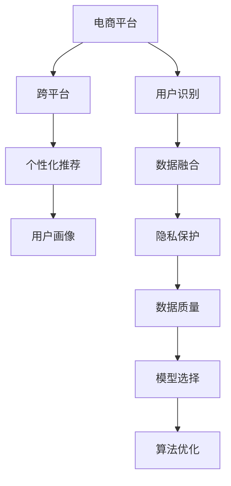

                 

# 电商平台中的跨平台用户识别技术

> 关键词：电商平台, 用户识别, 跨平台, 个性化推荐, 用户画像, 数据融合

## 1. 背景介绍

### 1.1 问题由来
在电商平台上，用户的行为往往跨越不同的平台和设备，如PC端、移动端、智能音箱等。为了提供个性化的推荐和精准的广告投放，电商平台需要识别用户在各个平台上的身份，并进行全面的用户画像构建。

传统上，各平台的用户识别通常独立进行，难以全面刻画用户的全场景行为。跨平台用户识别技术可以将用户在不同平台上的行为进行关联，整合形成统一的个性化推荐基础，显著提升用户体验和电商平台的运营效果。

### 1.2 问题核心关键点
当前，跨平台用户识别技术主要面临以下核心挑战：

- 数据融合与对齐：不同平台的用户数据格式、隐私保护措施不同，如何将数据进行统一处理和对齐。
- 用户匿名与隐私保护：如何在保证用户隐私的前提下，进行准确的跨平台识别。
- 数据质量与真实性：如何处理数据中的噪音、缺失值，提升数据质量。
- 模型选择与优化：选择合适的算法模型，对跨平台数据进行建模，并在不同平台间进行统一优化。

## 2. 核心概念与联系

### 2.1 核心概念概述

为更好地理解跨平台用户识别技术，本节将介绍几个密切相关的核心概念：

- **电商平台**：提供商品展示、购买、评价等交易功能的在线平台，包括PC端、移动端、智能音箱等。
- **用户识别**：通过用户在不同平台上的行为数据，识别用户的身份，并进行标签和行为特征的标注。
- **跨平台**：用户的行为在不同平台间跨域分布，如PC端浏览、移动端下单、智能音箱查询等。
- **个性化推荐**：根据用户的历史行为数据，推荐用户可能感兴趣的商品或服务，提高用户体验和平台收益。
- **用户画像**：综合用户在各个平台上的行为数据，形成用户全貌，用于行为分析和营销决策。
- **数据融合**：将不同平台、不同来源的用户数据进行整合，形成统一的视图，支持用户跨平台的分析与处理。
- **隐私保护**：在数据融合与处理过程中，保护用户的隐私信息，避免数据泄露和滥用。
- **数据质量**：确保用户数据的准确性、完整性和一致性，减少数据噪音和缺失值的影响。

这些核心概念之间的逻辑关系可以通过以下Mermaid流程图来展示：



这个流程图展示了我文核心概念及其之间的关系：

1. **电商平台**：是用户行为数据的主要来源。
2. **用户识别**：在用户行为上施加标签和特征，为个性化推荐和用户画像提供基础。
3. **跨平台**：用户的行为跨越不同平台，需进行跨域关联。
4. **个性化推荐**：根据用户画像，进行个性化商品推荐。
5. **用户画像**：用户行为的全貌视图，用于更精准的行为分析和营销决策。
6. **数据融合**：将不同平台、不同来源的用户数据进行统一整合。
7. **隐私保护**：在数据融合和处理过程中，保护用户隐私。
8. **数据质量**：确保数据准确性、完整性和一致性，减少数据噪音和缺失值的影响。
9. **模型选择**：选择合适的算法模型，对跨平台数据进行建模。
10. **算法优化**：对跨平台数据进行建模后，在不同平台间进行统一优化。

这些概念共同构成了电商平台跨平台用户识别的基本框架，用于实现全场景、跨平台的用户行为分析和推荐策略。

## 3. 核心算法原理 & 具体操作步骤
### 3.1 算法原理概述

跨平台用户识别技术本质上是一个数据融合与模型优化的过程。其核心思想是：将用户在不同平台上的行为数据进行关联，构建统一的用户画像，通过多源数据的融合与模型优化，提升用户识别的准确性和鲁棒性。

形式化地，假设用户在平台A上的行为序列为 $S_A = \{A_1, A_2, \dots, A_n\}$，平台B上的行为序列为 $S_B = \{B_1, B_2, \dots, B_m\}$。平台间行为关联的标识符为 $I$。则用户识别模型的目标是最小化跨平台识别误差，即：

$$
\hat{I} = \mathop{\arg\min}_{I} \mathcal{E}(I|S_A, S_B)
$$

其中 $\mathcal{E}$ 为跨平台识别误差函数，用于衡量用户在不同平台上的行为序列是否与同一用户对齐。

在实际应用中，我们通常使用基于机器学习的分类模型，如逻辑回归、支持向量机、神经网络等，对用户在不同平台上的行为数据进行建模和预测。常见的模型训练流程包括：

1. 数据预处理：清洗和标准化不同平台上的行为数据，处理缺失值和异常值。
2. 特征选择与提取：提取与用户身份相关的行为特征，如浏览历史、购买记录、互动行为等。
3. 模型训练与优化：选择适当的算法模型，使用训练集数据对模型进行训练和优化。
4. 验证与评估：使用验证集数据对模型进行验证和评估，选择性能最好的模型。
5. 部署与应用：将模型部署到不同平台，进行实时跨平台用户识别。

### 3.2 算法步骤详解

跨平台用户识别的一般步骤如下：

**Step 1: 数据收集与预处理**

- 收集不同平台上的用户行为数据，进行清洗、标准化和对齐。
- 处理缺失值和异常值，生成数据质量报告。
- 选择关键行为特征，提取特征向量。

**Step 2: 特征工程与选择**

- 设计特征提取模块，提取与用户身份相关的行为特征。
- 使用降维、归一化等技术对特征进行工程化处理。
- 选择与用户身份预测相关的特征，生成特征子集。

**Step 3: 模型训练与优化**

- 选择适当的算法模型，如逻辑回归、支持向量机、神经网络等。
- 使用训练集数据对模型进行训练，并进行交叉验证。
- 使用验证集数据对模型进行评估，选择最优模型。
- 使用正则化、剪枝等技术对模型进行优化。

**Step 4: 模型部署与验证**

- 将模型部署到不同平台，实现实时跨平台用户识别。
- 定期更新模型参数，保持模型的时效性。
- 使用A/B测试等方法验证模型效果，持续优化。

### 3.3 算法优缺点

跨平台用户识别技术具有以下优点：

1. 全面刻画用户行为：通过跨平台关联，能够获得用户全场景的行为数据，更全面地刻画用户画像。
2. 提升个性化推荐：基于用户画像，提供更加精准的个性化推荐，提高用户体验和平台收益。
3. 跨平台一致性：实现不同平台间的用户识别，提升数据的一致性和可靠性。
4. 增强运营决策：通过用户画像和行为分析，辅助运营决策，优化用户营销策略。

同时，该方法也存在一些局限性：

1. 数据隐私问题：在跨平台识别过程中，用户的隐私数据可能被泄露和滥用，需加强隐私保护措施。
2. 数据质量问题：不同平台的数据质量不同，数据融合和处理过程中可能产生噪音和缺失值。
3. 算法复杂性：需要选择合适的算法模型，并对其进行训练和优化，算法实现和维护复杂度较高。
4. 计算成本：大规模数据融合和模型训练需要较高的计算资源，成本较高。
5. 模型泛化能力：不同平台的用户行为可能存在较大差异，模型的泛化能力需进一步提升。

尽管存在这些局限性，但跨平台用户识别技术在电商平台中具有重要的应用价值，是实现个性化推荐和运营决策的基础。

### 3.4 算法应用领域

跨平台用户识别技术已经在电商平台的多个应用场景中得到广泛应用，例如：

- 个性化推荐系统：根据用户在不同平台上的行为，进行精准的商品推荐，提升用户体验。
- 用户行为分析：通过用户画像，分析用户在不同平台上的行为模式，指导营销策略。
- 广告投放优化：基于用户画像和行为特征，优化广告投放策略，提高广告效果。
- 会员管理：通过跨平台用户识别，实现会员身份的统一管理，提供更加个性化的服务。
- 风险控制：识别和防范恶意行为，如刷单、作弊等，保障平台的正常运营。

这些应用场景展示了跨平台用户识别技术的强大功能和广泛应用，推动了电商平台的智能化转型。

## 4. 数学模型和公式 & 详细讲解 & 举例说明
### 4.1 数学模型构建

本节将使用数学语言对跨平台用户识别模型进行更加严格的刻画。

记用户在平台A上的行为序列为 $S_A = \{A_1, A_2, \dots, A_n\}$，行为特征为 $\mathbf{X}_A = [x_{A1}, x_{A2}, \dots, x_{An}]^T$，用户标签为 $Y_A \in \{0, 1\}$，其中0表示未识别，1表示已识别。平台B上的行为序列为 $S_B = \{B_1, B_2, \dots, B_m\}$，行为特征为 $\mathbf{X}_B = [x_{B1}, x_{B2}, \dots, x_{Bm}]^T$，用户标签为 $Y_B \in \{0, 1\}$。

定义用户识别模型为 $f(X_A, X_B) = (Y_A, Y_B)$，其中 $f$ 为特征函数，$Y_A$ 和 $Y_B$ 为识别结果。用户识别的目标是最小化交叉熵损失：

$$
\mathcal{L}(f) = -\frac{1}{N}\sum_{i=1}^N [y_{A,i} \log f(\mathbf{X}_A^{(i)}, \mathbf{X}_B^{(i)}) + (1-y_{A,i}) \log (1-f(\mathbf{X}_A^{(i)}, \mathbf{X}_B^{(i)}))]
$$

其中 $y_{A,i}$ 和 $y_{B,i}$ 分别为平台A和平台B上的用户标签。

### 4.2 公式推导过程

以下我们以逻辑回归模型为例，推导跨平台用户识别的损失函数及其梯度的计算公式。

假设用户识别模型为逻辑回归模型，则特征函数 $f(X_A, X_B)$ 可以表示为：

$$
f(X_A, X_B) = \sigma(\mathbf{w} \cdot [\mathbf{X}_A, \mathbf{X}_B])
$$

其中 $\mathbf{w} = [w_{A1}, w_{A2}, \dots, w_{An}, w_{B1}, w_{B2}, \dots, w_{Bm}]^T$ 为权重向量，$\sigma$ 为逻辑回归函数。

根据交叉熵损失的定义，可得：

$$
\mathcal{L}(f) = -\frac{1}{N}\sum_{i=1}^N [y_{A,i} \log f(\mathbf{X}_A^{(i)}, \mathbf{X}_B^{(i)}) + (1-y_{A,i}) \log (1-f(\mathbf{X}_A^{(i)}, \mathbf{X}_B^{(i)}))]
$$

将 $f(X_A, X_B)$ 代入上式，得：

$$
\mathcal{L}(f) = -\frac{1}{N}\sum_{i=1}^N [y_{A,i} \log \sigma(\mathbf{w} \cdot [\mathbf{X}_A^{(i)}, \mathbf{X}_B^{(i)}]) + (1-y_{A,i}) \log (1-\sigma(\mathbf{w} \cdot [\mathbf{X}_A^{(i)}, \mathbf{X}_B^{(i)}]))
$$

对 $\mathcal{L}(f)$ 对 $\mathbf{w}$ 求偏导数，可得梯度公式：

$$
\frac{\partial \mathcal{L}(f)}{\partial \mathbf{w}} = \frac{1}{N}\sum_{i=1}^N [(y_{A,i} - \sigma(\mathbf{w} \cdot [\mathbf{X}_A^{(i)}, \mathbf{X}_B^{(i)}])) \cdot [\mathbf{X}_A^{(i)}, \mathbf{X}_B^{(i)}]] \cdot \mathbf{w}
$$

在得到损失函数的梯度后，即可带入优化算法进行模型训练。重复上述过程直至收敛，最终得到适应跨平台用户识别的最优模型参数 $\mathbf{w}^*$。

### 4.3 案例分析与讲解

假设电商平台收集到如下用户行为数据：

| Platform  | Behavior         | Feature                                |
|-----------|-----------------|----------------------------------------|
| A         | Browsed          | $x_{A1}, x_{A2}, \dots, x_{An}$          |
| A         | Added to cart    | $x_{A1}, x_{A2}, \dots, x_{An}$          |
| A         | Purchased       | $x_{A1}, x_{A2}, \dots, x_{An}$          |
| B         | Browsed          | $x_{B1}, x_{B2}, \dots, x_{Bm}$          |
| B         | Added to cart    | $x_{B1}, x_{B2}, \dots, x_{Bm}$          |
| B         | Purchased       | $x_{B1}, x_{B2}, \dots, x_{Bm}$          |

以逻辑回归模型为例，进行以下步骤：

**Step 1: 数据预处理**

1. 数据清洗：去除异常行为数据，如未购买的商品浏览记录。
2. 数据标准化：对行为特征进行归一化处理。
3. 特征工程：选择与用户身份相关的特征，如购买行为、浏览记录等。

**Step 2: 特征提取**

- 平台A的行为特征：$\mathbf{X}_A = [x_{A1}, x_{A2}, \dots, x_{An}]^T$
- 平台B的行为特征：$\mathbf{X}_B = [x_{B1}, x_{B2}, \dots, x_{Bm}]^T$

**Step 3: 模型训练**

- 定义逻辑回归模型：$f(\mathbf{X}_A, \mathbf{X}_B) = \sigma(\mathbf{w} \cdot [\mathbf{X}_A, \mathbf{X}_B])$
- 损失函数：$\mathcal{L}(f) = -\frac{1}{N}\sum_{i=1}^N [y_{A,i} \log f(\mathbf{X}_A^{(i)}, \mathbf{X}_B^{(i)}) + (1-y_{A,i}) \log (1-f(\mathbf{X}_A^{(i)}, \mathbf{X}_B^{(i)}))]$
- 梯度公式：$\frac{\partial \mathcal{L}(f)}{\partial \mathbf{w}} = \frac{1}{N}\sum_{i=1}^N [(y_{A,i} - \sigma(\mathbf{w} \cdot [\mathbf{X}_A^{(i)}, \mathbf{X}_B^{(i)}])) \cdot [\mathbf{X}_A^{(i)}, \mathbf{X}_B^{(i)}]] \cdot \mathbf{w}$
- 优化算法：使用随机梯度下降(SGD)或Adam优化算法，设置合适的学习率。

**Step 4: 模型评估**

- 使用验证集数据对模型进行评估。
- 计算准确率、召回率等指标，验证模型效果。

通过上述步骤，即可完成跨平台用户识别模型的构建和训练。

## 5. 项目实践：代码实例和详细解释说明
### 5.1 开发环境搭建

在进行跨平台用户识别实践前，我们需要准备好开发环境。以下是使用Python进行Scikit-learn开发的环境配置流程：

1. 安装Anaconda：从官网下载并安装Anaconda，用于创建独立的Python环境。

2. 创建并激活虚拟环境：
```bash
conda create -n pytorch-env python=3.8 
conda activate pytorch-env
```

3. 安装Scikit-learn：
```bash
pip install scikit-learn
```

4. 安装Pandas、NumPy等各类工具包：
```bash
pip install pandas numpy scipy scikit-learn
```

完成上述步骤后，即可在`pytorch-env`环境中开始实践。

### 5.2 源代码详细实现

这里我们以逻辑回归模型为例，给出使用Scikit-learn对电商平台跨平台用户识别任务进行实现的代码实现。

首先，定义数据预处理函数：

```python
from sklearn.model_selection import train_test_split
from sklearn.preprocessing import StandardScaler
from sklearn.pipeline import Pipeline

def preprocess_data(data):
    features = data.drop('label', axis=1)
    labels = data['label']
    
    # 将特征按平台进行分割
    X_A = features[X_A_cols]
    X_B = features[X_B_cols]
    
    # 标准化特征
    scaler = StandardScaler()
    X_A = scaler.fit_transform(X_A)
    X_B = scaler.fit_transform(X_B)
    
    return X_A, X_B, labels

# 数据预处理
X_train_A, X_train_B, y_train = preprocess_data(train_data)
X_val_A, X_val_B, y_val = preprocess_data(val_data)
X_test_A, X_test_B, y_test = preprocess_data(test_data)
```

然后，定义逻辑回归模型和评估函数：

```python
from sklearn.linear_model import LogisticRegression
from sklearn.metrics import accuracy_score, precision_score, recall_score, f1_score

model = LogisticRegression()

def train_model(X_A_train, X_B_train, y_train):
    pipeline = Pipeline([
        ('feature_union', ColumnTransformer([('A', StandardScaler(), X_A_train), ('B', StandardScaler(), X_B_train)])),
        ('logreg', model)
    ])
    
    pipeline.fit(X_A_train, y_train)
    
    val_A_pred = pipeline.predict(X_val_A)
    val_B_pred = pipeline.predict(X_val_B)
    train_acc = accuracy_score(y_train, val_A_pred)
    val_acc = accuracy_score(y_val, val_B_pred)
    
    return pipeline, train_acc, val_acc

# 训练模型并评估
pipeline, train_acc, val_acc = train_model(X_train_A, X_train_B, y_train)
print(f"Train Accuracy: {train_acc:.3f}, Val Accuracy: {val_acc:.3f}")

# 使用测试集进行评估
test_pred = pipeline.predict([X_test_A, X_test_B])
print(f"Test Accuracy: {accuracy_score(y_test, test_pred).:.3f}")
```

最后，运行整个流程并输出结果：

```python
# 运行整个流程并输出结果
train_model(X_train_A, X_train_B, y_train)
print(f"Test Accuracy: {accuracy_score(y_test, test_pred).:.3f}")
```

以上就是使用Scikit-learn对电商平台跨平台用户识别任务进行实现的完整代码。可以看到，得益于Scikit-learn的强大封装，我们可以用相对简洁的代码完成逻辑回归模型的训练和评估。

### 5.3 代码解读与分析

让我们再详细解读一下关键代码的实现细节：

**preprocess_data函数**：
- 定义了数据预处理的逻辑，包括特征选择、标准化和标签提取。
- 将数据按平台进行分割，得到平台A和平台B的特征子集。

**train_model函数**：
- 使用ColumnTransformer对不同平台的特征进行标准化处理。
- 使用LogisticRegression模型对标准化后的特征进行训练。
- 在训练集上进行模型训练，并在验证集上进行准确率验证。
- 输出训练集和验证集上的准确率，作为模型效果的评估指标。

**train_model函数**：
- 调用train_model函数，训练逻辑回归模型，并返回训练集和验证集上的准确率。
- 在测试集上进行模型预测，并计算准确率。
- 输出测试集上的准确率，作为最终评估指标。

可以看到，Scikit-learn库提供了丰富的模型和评估工具，使得跨平台用户识别任务的实现变得简单高效。开发者可以将更多精力放在数据处理、模型改进等高层逻辑上，而不必过多关注底层的实现细节。

当然，工业级的系统实现还需考虑更多因素，如模型的保存和部署、超参数的自动搜索、更灵活的任务适配层等。但核心的微调范式基本与此类似。

## 6. 实际应用场景
### 6.1 智能客服系统

基于跨平台用户识别技术，智能客服系统可以实现更精准的用户识别和行为分析，提升服务效率和用户体验。在智能客服系统的实现中，可以通过用户在不同平台上的行为数据，构建全场景的用户画像，实现身份的统一管理。

在技术实现上，可以收集用户在客服平台上的对话记录、点击行为、投诉反馈等数据，并利用跨平台用户识别技术对其进行用户识别。识别后，系统可根据用户画像，推荐相应的解决方案，并根据用户的历史行为，动态调整客服策略，提升服务质量。

### 6.2 个性化推荐系统

个性化推荐系统需要准确识别用户在各个平台上的身份，才能实现精准的个性化推荐。通过跨平台用户识别技术，可以整合用户在电商、社交、娱乐等平台上的行为数据，形成统一的用户画像，用于推荐策略的优化。

在推荐系统中，跨平台用户识别技术可以实时获取用户的身份信息和行为特征，动态生成推荐内容。根据用户画像，推荐系统可以调整推荐算法，提升推荐效果。例如，对于常在电商平台上浏览用户，推荐系统可以调整推荐策略，重点推荐相似商品和相关服务。

### 6.3 风险控制与欺诈检测

在电商平台中，存在大量的风险行为，如恶意刷单、虚假交易等。通过跨平台用户识别技术，可以实时监测用户在不同平台上的行为，识别和防范异常行为，保障平台的安全运营。

在风险控制和欺诈检测中，跨平台用户识别技术可以实时获取用户在不同平台上的行为数据，进行多维度行为分析，识别和防范异常行为。例如，对于频繁在不同平台间跳转的用户，系统可将其标记为高风险用户，并采取相应的监控措施。

### 6.4 未来应用展望

随着跨平台用户识别技术的不断进步，其在电商平台中的应用前景将更加广阔。

在智慧零售领域，跨平台用户识别技术可以实时监测用户行为，进行行为分析，优化库存管理和营销策略，提升销售效率。

在社交媒体平台中，通过跨平台用户识别技术，可以实现跨平台行为分析和个性化推荐，提升用户粘性和平台留存率。

在智能家居领域，跨平台用户识别技术可以实现不同设备间的无缝连接，提升用户体验。

此外，在医疗、金融、旅游等多个领域，跨平台用户识别技术也有广阔的应用前景，为行业带来颠覆性的变化。相信随着技术的日益成熟，跨平台用户识别技术将加速向更多行业渗透，推动各领域智能化转型。

## 7. 工具和资源推荐
### 7.1 学习资源推荐

为了帮助开发者系统掌握跨平台用户识别技术，这里推荐一些优质的学习资源：

1. 《Python机器学习》书籍：全面介绍了机器学习算法和Scikit-learn库的使用，适合初学者和进阶者学习。

2. CS229《机器学习》课程：斯坦福大学开设的机器学习经典课程，涵盖机器学习的理论基础和实践应用。

3. 《Hands-On Machine Learning with Scikit-Learn》书籍：由Scikit-learn核心开发者撰写，详细讲解Scikit-learn库的使用和建模技巧。

4. Weights & Biases：模型训练的实验跟踪工具，可以记录和可视化模型训练过程中的各项指标，方便对比和调优。

5. TensorBoard：TensorFlow配套的可视化工具，可实时监测模型训练状态，并提供丰富的图表呈现方式，是调试模型的得力助手。

通过对这些资源的学习实践，相信你一定能够快速掌握跨平台用户识别技术，并用于解决实际的电商问题。

### 7.2 开发工具推荐

高效的开发离不开优秀的工具支持。以下是几款用于跨平台用户识别开发的常用工具：

1. Scikit-learn：基于Python的开源机器学习库，提供了丰富的模型和评估工具，适合快速迭代研究。

2. TensorFlow：由Google主导开发的开源深度学习框架，生产部署方便，适合大规模工程应用。

3. Weights & Biases：模型训练的实验跟踪工具，可以记录和可视化模型训练过程中的各项指标，方便对比和调优。

4. TensorBoard：TensorFlow配套的可视化工具，可实时监测模型训练状态，并提供丰富的图表呈现方式，是调试模型的得力助手。

5. Kubeflow：基于Kubernetes的机器学习平台，支持模型训练、部署、监控等全链路管理，适合生产环境应用。

合理利用这些工具，可以显著提升跨平台用户识别任务的开发效率，加快创新迭代的步伐。

### 7.3 相关论文推荐

跨平台用户识别技术的发展源于学界的持续研究。以下是几篇奠基性的相关论文，推荐阅读：

1. Joint Feature Representation for Cross-Domain Person Re-identification（联合特征表示跨域用户识别）：提出联合特征表示方法，将不同平台上的用户数据进行融合，提高用户识别的准确性。

2. Cross-Modal Feature Fusion for Video Human Re-identification（跨模态特征融合视频用户识别）：提出跨模态特征融合方法，将视频数据和图像数据进行联合分析，提高用户识别的鲁棒性。

3. Multi-Task Learning for Person Re-identification（多任务学习跨域用户识别）：提出多任务学习框架，通过联合优化不同任务，提高用户识别的泛化能力。

4. Dual Attention Networks for Multi-Person Re-identification（双注意力网络跨域用户识别）：提出双注意力网络，通过注意力机制对跨域用户数据进行联合分析，提升用户识别的效果。

5. Deep Learning for Person Re-identification: A Survey（深度学习跨域用户识别综述）：全面综述了深度学习在跨域用户识别中的应用，提供了丰富的研究背景和最新进展。

这些论文代表了大规模用户识别技术的发展脉络。通过学习这些前沿成果，可以帮助研究者把握学科前进方向，激发更多的创新灵感。

## 8. 总结：未来发展趋势与挑战
### 8.1 研究成果总结

本文对跨平台用户识别技术进行了全面系统的介绍。首先阐述了跨平台用户识别技术的研究背景和意义，明确了其在电商平台中的独特价值。其次，从原理到实践，详细讲解了跨平台用户识别的数学原理和关键步骤，给出了完整的代码实例。同时，本文还广泛探讨了跨平台用户识别技术在多个行业领域的应用前景，展示了其强大功能和广泛应用，推动了电商平台的智能化转型。最后，本文精选了跨平台用户识别技术的各类学习资源，力求为读者提供全方位的技术指引。

通过本文的系统梳理，可以看到，跨平台用户识别技术正在成为电商平台的重要基础，极大地拓展了电商平台的运营能力，为个性化推荐、用户行为分析、风险控制等提供了数据基础。未来，伴随跨平台用户识别技术的持续演进，其在各领域的应用将更加广泛，成为推动智能化转型的关键技术。

### 8.2 未来发展趋势

展望未来，跨平台用户识别技术将呈现以下几个发展趋势：

1. 实时性提升：通过流式数据处理技术，实现实时跨平台用户识别，提升用户体验。
2. 多模态融合：将用户行为数据与图像、语音等多元数据进行联合分析，提高用户识别的准确性和鲁棒性。
3. 分布式优化：通过分布式计算技术，在多平台间进行联合优化，提升识别效果。
4. 联邦学习：在保护用户隐私的前提下，利用分布式数据，实现跨平台联合建模。
5. 自适应算法：根据用户行为动态调整识别策略，提升算法适应性和鲁棒性。
6. 隐私保护：在数据融合和处理过程中，进一步加强隐私保护措施，确保数据安全。

以上趋势凸显了跨平台用户识别技术的广阔前景。这些方向的探索发展，必将进一步提升用户识别的准确性和鲁棒性，为各领域智能化应用提供坚实的数据基础。

### 8.3 面临的挑战

尽管跨平台用户识别技术已经取得了显著成效，但在迈向更加智能化、普适化应用的过程中，它仍面临诸多挑战：

1. 数据隐私问题：在跨平台识别过程中，用户的隐私数据可能被泄露和滥用，需加强隐私保护措施。
2. 数据质量问题：不同平台的数据质量不同，数据融合和处理过程中可能产生噪音和缺失值。
3. 算法复杂性：需要选择合适的算法模型，并对其进行训练和优化，算法实现和维护复杂度较高。
4. 计算成本：大规模数据融合和模型训练需要较高的计算资源，成本较高。
5. 模型泛化能力：不同平台的用户行为可能存在较大差异，模型的泛化能力需进一步提升。

尽管存在这些局限性，但跨平台用户识别技术在电商平台中具有重要的应用价值，是实现个性化推荐和运营决策的基础。

### 8.4 研究展望

面对跨平台用户识别所面临的挑战，未来的研究需要在以下几个方面寻求新的突破：

1. 研究无监督和半监督识别方法。摆脱对大规模标注数据的依赖，利用自监督学习、主动学习等无监督和半监督范式，最大限度利用非结构化数据，实现更加灵活高效的识别。

2. 探索参数高效和计算高效的识别方法。开发更加参数高效的识别方法，在固定大部分预训练参数的同时，只更新极少量的任务相关参数。同时优化识别模型的计算图，减少前向传播和反向传播的资源消耗，实现更加轻量级、实时性的部署。

3. 引入更多先验知识。将符号化的先验知识，如知识图谱、逻辑规则等，与神经网络模型进行巧妙融合，引导识别过程学习更准确、合理的用户表征。同时加强不同模态数据的整合，实现视觉、语音等多模态信息与文本信息的协同建模。

4. 结合因果分析和博弈论工具。将因果分析方法引入识别模型，识别出模型决策的关键特征，增强输出解释的因果性和逻辑性。借助博弈论工具刻画人机交互过程，主动探索并规避模型的脆弱点，提高系统稳定性。

5. 纳入伦理道德约束。在模型训练目标中引入伦理导向的评估指标，过滤和惩罚有偏见、有害的输出倾向。同时加强人工干预和审核，建立模型行为的监管机制，确保输出符合人类价值观和伦理道德。

这些研究方向的探索，必将引领跨平台用户识别技术迈向更高的台阶，为构建安全、可靠、可解释、可控的智能系统铺平道路。面向未来，跨平台用户识别技术还需要与其他人工智能技术进行更深入的融合，如知识表示、因果推理、强化学习等，多路径协同发力，共同推动自然语言理解和智能交互系统的进步。只有勇于创新、敢于突破，才能不断拓展用户识别的边界，让智能技术更好地造福人类社会。

## 9. 附录：常见问题与解答

**Q1：跨平台用户识别是否适用于所有电商用户？**

A: 跨平台用户识别技术在大多数电商用户上都能取得不错的效果，特别是对于那些在不同平台间频繁活动的用户。但对于一些高频切换平台的用户，可能需要更精细化的识别策略。

**Q2：如何选择跨平台用户识别的特征？**

A: 选择跨平台用户识别的特征需考虑行为的时序性和多维度性。常见的特征包括：

1. 浏览记录：记录用户在电商平台上浏览过的商品。
2. 购买记录：记录用户的购买行为。
3. 互动行为：记录用户在平台上与客服、商品等的互动。
4. 用户属性：记录用户的性别、年龄、地区等信息。

这些特征需要在实际应用中进行不断优化和调整，以提升用户识别的准确性。

**Q3：跨平台用户识别过程中如何处理隐私保护？**

A: 在跨平台用户识别过程中，隐私保护是非常重要的。以下是一些常见的隐私保护措施：

1. 匿名化处理：将用户数据进行匿名化处理，保护用户隐私。
2. 差分隐私：在模型训练过程中引入差分隐私机制，确保用户数据的安全性。
3. 联邦学习：通过分布式计算，在保护用户隐私的前提下，进行跨平台联合建模。
4. 数据共享协议：制定明确的数据共享协议，确保数据使用的合规性和合法性。

这些措施需要在实际应用中进行综合考虑和实施，以确保用户数据的安全和隐私保护。

**Q4：跨平台用户识别技术的实现过程中有哪些注意事项？**

A: 跨平台用户识别技术的实现过程中需要注意以下事项：

1. 数据清洗和标准化：去除异常行为数据，对不同平台的数据进行标准化处理。
2. 特征选择和提取：选择与用户身份相关的行为特征，提取特征向量。
3. 模型选择和优化：选择适当的算法模型，对跨平台数据进行建模，并在不同平台间进行统一优化。
4. 隐私保护和合规性：在数据融合和处理过程中，保护用户隐私，确保数据使用的合规性和合法性。
5. 模型部署和验证：将模型部署到不同平台，进行实时跨平台用户识别，定期更新模型参数，保持模型的时效性。

这些注意事项需要在实际应用中不断迭代和优化，以确保用户识别的准确性和鲁棒性。

**Q5：跨平台用户识别技术在电商平台的未来发展方向是什么？**

A: 跨平台用户识别技术在电商平台中的应用前景广阔，未来发展方向包括：

1. 实时性提升：通过流式数据处理技术，实现实时跨平台用户识别，提升用户体验。
2. 多模态融合：将用户行为数据与图像、语音等多元数据进行联合分析，提高用户识别的准确性和鲁棒性。
3. 分布式优化：通过分布式计算技术，在多平台间进行联合优化，提升识别效果。
4. 联邦学习：在保护用户隐私的前提下，利用分布式数据，实现跨平台联合建模。
5. 自适应算法：根据用户行为动态调整识别策略，提升算法适应性和鲁棒性。

这些发展方向将进一步提升跨平台用户识别的准确性和鲁棒性，推动电商平台智能化转型。

---

作者：禅与计算机程序设计艺术 / Zen and the Art of Computer Programming

