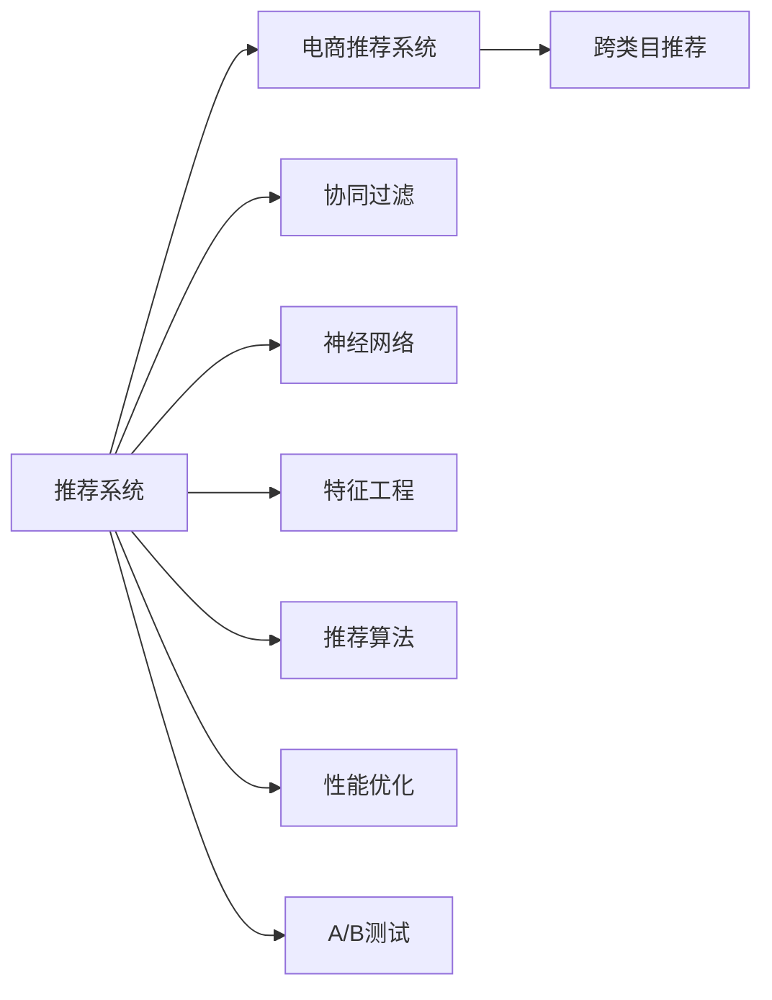

                 

# 电商平台中的跨类目推荐策略

> 关键词：推荐系统, 电商, 跨类目推荐, 深度学习, 协同过滤, 神经网络, 特征工程, 推荐算法, 性能优化, A/B测试

## 1. 背景介绍

### 1.1 问题由来
在电商平台上，用户在浏览和购买商品时，往往面临海量的商品选择。如何通过推荐系统帮助用户发现最相关的商品，提高用户体验和平台销售额，一直是电商推荐系统的核心挑战。随着用户购买行为的多样化和个性化需求的高涨，传统的基于商品属性或用户的单一维度推荐策略已不能满足日益增长的需求，跨类目推荐（Cross-category Recommendation）逐渐成为一种有效的推荐策略。

### 1.2 问题核心关键点
跨类目推荐，指的是在用户浏览或购买某类商品时，推荐系统能够基于用户的历史行为和偏好，同时考虑其他商品类目的相关性，推荐出更多元化的商品。这种推荐方式可以有效提升用户浏览量和购买转化率，同时提高平台商品的曝光量和销售量。

### 1.3 问题研究意义
研究跨类目推荐策略，对于电商平台推荐系统的优化和升级，提升用户体验和平台收益，具有重要意义：

1. 增强推荐相关性：跨类目推荐能够打破传统单维度的限制，结合不同商品类目的关联性，提供更多元、更精准的推荐。
2. 提高用户满意度：通过推荐与用户浏览、购买行为相关的跨类目商品，能够显著提升用户满意度和忠诚度。
3. 促进销售增长：跨类目推荐能够拓宽用户对商品类别的选择范围，提高商品的曝光量和销售量，推动平台整体营收增长。
4. 应对市场变化：市场不断变化，用户需求日益复杂，跨类目推荐能够更好地应对这些变化，保持平台竞争力。

## 2. 核心概念与联系

### 2.1 核心概念概述

为更好地理解电商平台中的跨类目推荐策略，本节将介绍几个关键概念及其相互关系：

- **推荐系统(Recommendation System)**：基于用户历史行为和商品属性，推荐用户可能感兴趣的商品或商品类目的系统。推荐系统包括协同过滤、基于内容的推荐、深度学习推荐等多种类型。
- **电商推荐系统(E-commerce Recommendation System)**：针对电商平台的推荐系统，聚焦于提升用户的购物体验和平台销售额。
- **跨类目推荐(Cross-category Recommendation)**：推荐系统推荐商品时，不仅考虑用户对特定商品类目的偏好，还综合考虑其他商品类目的相关性，以实现更全面的商品推荐。
- **协同过滤(Collaborative Filtering)**：基于用户行为或商品之间的相似性，通过协同关系推断用户可能感兴趣的商品。协同过滤包括用户协同过滤、商品协同过滤和混合协同过滤等多种类型。
- **神经网络(Neural Network)**：一种基于神经元网络的机器学习模型，包括深度学习神经网络等，常用于电商推荐系统中提取商品特征和用户特征。
- **特征工程(Feature Engineering)**：通过分析和处理原始数据，提取出有意义的特征，用于训练推荐模型。特征工程是电商推荐系统的关键环节。
- **推荐算法(Recommendation Algorithm)**：用于实现推荐功能的算法，包括基于内容的推荐算法、协同过滤算法、混合推荐算法等。
- **性能优化(Performance Optimization)**：通过算法优化、模型优化、数据优化等多种方式，提升推荐系统的效率和效果。
- **A/B测试(A/B Testing)**：一种常用的实验方法，通过对比不同版本的推荐算法，评估其性能和效果，选择最优版本。

这些核心概念之间的关系可以通过以下Mermaid流程图来展示：



这个流程图展示了推荐系统与电商推荐系统之间的联系，以及跨类目推荐与其他关键概念的关系。通过理解这些核心概念，我们可以更好地把握电商平台中跨类目推荐策略的工作原理和优化方向。

## 3. 核心算法原理 & 具体操作步骤
### 3.1 算法原理概述

跨类目推荐策略主要基于协同过滤和深度学习两种方法实现。协同过滤方法通过分析用户历史行为和商品之间的相似性，推荐与用户已喜欢商品相似的其他商品。深度学习方法则通过神经网络模型，学习用户和商品的潜在特征，直接预测用户对不同商品类目的兴趣。

### 3.2 算法步骤详解

#### 协同过滤算法

协同过滤算法主要分为两种：基于用户的协同过滤和基于商品的协同过滤。

**Step 1: 数据预处理**
- 收集用户历史行为数据，包括浏览、点击、购买等。
- 对商品进行分类，生成商品类别矩阵。
- 对用户行为数据进行归一化、去噪处理，以提高后续算法的精度。

**Step 2: 相似度计算**
- 基于用户行为计算用户之间的相似度，通常采用余弦相似度、皮尔逊相关系数等。
- 基于商品类别计算商品之间的相似度，通常采用余弦相似度、Jaccard系数等。

**Step 3: 推荐生成**
- 对目标用户进行邻居选择，选择与其行为最相似的用户。
- 基于目标用户的邻居用户行为，预测其对其他商品的兴趣，生成推荐列表。

**Step 4: 模型优化**
- 使用负采样、梯度下降等方法优化相似度计算过程。
- 采用正则化、降维等技术提高推荐精度和效率。

#### 深度学习算法

深度学习算法主要使用神经网络模型，通过学习用户和商品的潜在特征，直接预测用户对不同商品类目的兴趣。

**Step 1: 数据预处理**
- 收集用户历史行为数据，包括浏览、点击、购买等。
- 对商品进行分类，生成商品类别矩阵。
- 对用户行为数据进行归一化、去噪处理，以提高后续算法的精度。

**Step 2: 特征工程**
- 通过编码、归一化等方法，提取用户行为特征和商品特征。
- 设计合适的神经网络架构，包括输入层、隐藏层和输出层。

**Step 3: 模型训练**
- 使用交叉熵损失函数、均方误差损失函数等，训练神经网络模型。
- 使用反向传播算法更新模型参数，最小化损失函数。

**Step 4: 推荐生成**
- 对目标用户进行特征编码，输入到神经网络模型中。
- 输出模型预测的概率分布，选择概率最高的商品进行推荐。

### 3.3 算法优缺点

协同过滤算法的优点包括：

- 基于用户或商品的相似性，推荐的商品具有较高的相关性。
- 不需要额外的商品属性信息，适用于数据稀疏和冷启动问题。

协同过滤算法的缺点包括：

- 需要大量的用户行为数据，对新用户和新商品适应性较差。
- 难以处理大量数据，可能存在计算和存储成本高的问题。

深度学习算法的优点包括：

- 能够直接学习用户和商品的潜在特征，无需额外的属性信息。
- 可以处理大规模数据，适应性强。

深度学习算法的缺点包括：

- 需要大量的标注数据，且对模型选择和调参依赖较大。
- 计算复杂度高，模型训练和推理速度较慢。

### 3.4 算法应用领域

跨类目推荐策略在电商平台中得到了广泛应用，适用于各种场景：

- 新商品推荐：用户浏览新商品时，推荐与其已购买或浏览商品相关的其他商品类别。
- 跨品类推荐：用户购买某一品类商品时，推荐其他品类的关联商品。
- 多品类浏览推荐：用户同时浏览多个品类商品时，推荐相关联的其他品类商品。
- 个性化推荐：根据用户行为和偏好，推荐符合其兴趣的多品类商品。
- 节日促销推荐：在特定节日或促销活动期间，推荐相关联的跨品类商品。

除了电商领域，跨类目推荐策略在其他场景如音乐、视频、新闻等领域也得到了应用，提高了用户体验和平台价值。

## 4. 数学模型和公式 & 详细讲解  
### 4.1 数学模型构建

在深度学习推荐系统中，我们通常使用以下数学模型进行建模：

设用户集合为 $U$，商品集合为 $I$，商品类别集合为 $C$。用户 $u$ 对商品 $i$ 的兴趣表示为 $u_i \in [0,1]$，商品 $i$ 的类别表示为 $c_i \in C$。

用户的隐向量表示为 $h_u$，商品的隐向量表示为 $h_i$，商品类别的隐向量表示为 $h_c$。推荐模型通过学习 $h_u$ 和 $h_i$，直接预测用户对商品类目的兴趣 $u_c$。

推荐模型的一般形式为：

$$
u_c = f(h_u, h_i, h_c)
$$

其中 $f$ 表示映射函数。

### 4.2 公式推导过程

**协同过滤算法**

协同过滤算法主要基于余弦相似度进行推荐。用户 $u$ 对商品 $i$ 的兴趣表示为：

$$
u_i = \frac{\sum_{j=1}^N \alpha_j p_{ui} p_{uj}}{\sqrt{\sum_{j=1}^N \alpha_j^2 p_{ui}^2 + \sum_{j=1}^N \alpha_j^2 p_{uj}^2}}
$$

其中 $p_{ui}$ 表示用户 $u$ 对商品 $i$ 的评分，$\alpha_j$ 表示用户 $u$ 的历史评分权重。

相似度矩阵 $P$ 表示用户之间的相似度，计算公式为：

$$
P_{ui} = \frac{\sum_{j=1}^N \alpha_j p_{uj}}{\sqrt{\sum_{j=1}^N \alpha_j^2 p_{uj}^2 + \sum_{j=1}^N \alpha_j^2 p_{ui}^2}}
$$

基于用户相似度的推荐公式为：

$$
\hat{y} = \sum_{j=1}^N P_{uj} \cdot p_{ji}
$$

**深度学习算法**

深度学习算法通常使用多层感知机(MLP)或神经网络(NN)模型进行建模。假设用户 $u$ 的隐向量表示为 $h_u$，商品 $i$ 的隐向量表示为 $h_i$，商品类别的隐向量表示为 $h_c$。推荐模型的输入为：

$$
x = (h_u, h_i, h_c)
$$

输出为：

$$
y = \sigma(Wx + b)
$$

其中 $W$ 和 $b$ 为模型参数，$\sigma$ 为激活函数。

### 4.3 案例分析与讲解

我们以电商平台上某用户的推荐为例，进行详细讲解。

**协同过滤算法**

假设某用户 $u$ 在过去浏览了商品 $i_1, i_2, i_3$，购买了商品 $i_4$，点击了商品 $i_5, i_6$。

- 首先计算用户 $u$ 和用户 $v$ 之间的相似度。
- 然后选择与用户 $u$ 行为最相似的用户 $v$，作为邻居。
- 根据邻居用户 $v$ 的行为数据，预测用户 $u$ 对商品类目的兴趣。

**深度学习算法**

假设某用户 $u$ 在过去浏览了商品 $i_1, i_2, i_3$，购买了商品 $i_4$，点击了商品 $i_5, i_6$。

- 首先对用户行为数据进行特征工程，提取用户和商品的特征。
- 设计合适的神经网络模型，训练模型参数。
- 将用户行为数据输入模型，输出用户对商品类目的兴趣。

## 5. 项目实践：代码实例和详细解释说明
### 5.1 开发环境搭建

在进行跨类目推荐系统开发前，我们需要准备好开发环境。以下是使用Python进行PyTorch开发的环境配置流程：

1. 安装Anaconda：从官网下载并安装Anaconda，用于创建独立的Python环境。

2. 创建并激活虚拟环境：
```bash
conda create -n recsys-env python=3.8 
conda activate recsys-env
```

3. 安装PyTorch：根据CUDA版本，从官网获取对应的安装命令。例如：
```bash
conda install pytorch torchvision torchaudio cudatoolkit=11.1 -c pytorch -c conda-forge
```

4. 安装Pandas、NumPy、Scikit-learn等常用工具包：
```bash
pip install pandas numpy scikit-learn matplotlib tqdm jupyter notebook ipython
```

完成上述步骤后，即可在`recsys-env`环境中开始开发。

### 5.2 源代码详细实现

下面我们以深度学习算法为基础，使用PyTorch实现跨类目推荐系统。

**数据准备**

首先，我们需要准备数据集。以下是一个简单的示例数据集，包含用户行为数据和商品类别数据。

```python
import pandas as pd

# 用户行为数据
user_id = [1, 2, 3, 4]
item_id = [1001, 1002, 1003, 1004]
action = [0, 1, 1, 0]  # 0表示浏览，1表示购买
timestamp = [1633894400, 1633894500, 1633894600, 1633894700]

# 商品类别数据
category = [1, 2, 3, 4]
category_name = ['Electronics', 'Clothing', 'Books', 'Home']

# 创建DataFrame
data = pd.DataFrame({
    'user_id': user_id,
    'item_id': item_id,
    'action': action,
    'timestamp': timestamp,
    'category': category,
    'category_name': category_name
})
```

**协同过滤算法**

我们首先实现基于协同过滤的推荐算法。以下是一个简单的协同过滤模型：

```python
import torch
import torch.nn as nn
import torch.nn.functional as F

class CollaborativeFiltering(nn.Module):
    def __init__(self, n_users, n_items, n_categories, n_hidden):
        super(CollaborativeFiltering, self).__init__()
        self.user_fm = nn.Embedding(n_users, n_hidden)
        self.item_fm = nn.Embedding(n_items, n_hidden)
        self.category_fm = nn.Embedding(n_categories, n_hidden)
        self.user_bpr = nn.Embedding(n_users, 1)
        self.item_bpr = nn.Embedding(n_items, 1)
        self.category_bpr = nn.Embedding(n_categories, 1)

    def forward(self, user, item, category):
        user_embed = self.user_fm(user)
        item_embed = self.item_fm(item)
        category_embed = self.category_fm(category)

        user_bpr = self.user_bpr(user)
        item_bpr = self.item_bpr(item)
        category_bpr = self.category_bpr(category)

        user_item_bpr = user_embed @ item_embed.t()
        user_category_bpr = user_embed @ category_embed.t()
        item_category_bpr = item_embed @ category_embed.t()

        # 计算余弦相似度
        user_similarity = (user_item_bpr * user_bpr) / (user_item_bpr.norm(dim=1) * user_bpr.norm(dim=1))
        item_similarity = (item_category_bpr * item_bpr) / (item_category_bpr.norm(dim=1) * item_bpr.norm(dim=1))

        # 计算推荐得分
        recommendation_score = user_similarity @ item_similarity
        return recommendation_score
```

**深度学习算法**

接下来，我们实现基于深度学习的推荐算法。以下是一个简单的深度学习模型：

```python
class DeepRecommendation(nn.Module):
    def __init__(self, n_users, n_items, n_categories, n_hidden, n_output):
        super(DeepRecommendation, self).__init__()
        self.user_encoder = nn.Sequential(
            nn.Embedding(n_users, n_hidden),
            nn.Linear(n_hidden, n_hidden),
            nn.ReLU()
        )
        self.item_encoder = nn.Sequential(
            nn.Embedding(n_items, n_hidden),
            nn.Linear(n_hidden, n_hidden),
            nn.ReLU()
        )
        self.category_encoder = nn.Sequential(
            nn.Embedding(n_categories, n_hidden),
            nn.Linear(n_hidden, n_hidden),
            nn.ReLU()
        )
        self.recommendation_layer = nn.Linear(3*n_hidden, n_output)

    def forward(self, user, item, category):
        user_embed = self.user_encoder(user)
        item_embed = self.item_encoder(item)
        category_embed = self.category_encoder(category)

        # 拼接用户、商品、类别的隐向量
        x = torch.cat([user_embed, item_embed, category_embed], dim=1)

        # 输出推荐得分
        recommendation_score = self.recommendation_layer(x)
        return recommendation_score
```

### 5.3 代码解读与分析

让我们再详细解读一下关键代码的实现细节：

**协同过滤算法**

- 在`CollaborativeFiltering`类中，我们使用了FM(因子分解机)模型进行协同过滤。FM模型通过将用户-商品交互矩阵分解为若干个因子，捕捉用户和商品之间的潜在关系。
- `user_fm`、`item_fm`、`category_fm`分别表示用户、商品、类别的FM模型。
- `user_bpr`、`item_bpr`、`category_bpr`分别表示用户、商品、类别的伯努利概率模型。

**深度学习算法**

- 在`DeepRecommendation`类中，我们使用了多层感知机(MLP)模型进行深度学习推荐。
- `user_encoder`、`item_encoder`、`category_encoder`分别表示用户、商品、类别的编码器，用于提取隐向量表示。
- `recommendation_layer`表示推荐层的线性映射，用于输出推荐得分。

## 6. 实际应用场景
### 6.1 智能推荐系统

跨类目推荐系统在电商平台中的应用最为广泛，能够显著提升用户体验和平台收益。以下是一个具体的应用场景：

**用户浏览跨品类商品**

用户浏览某品类商品时，推荐系统可以同时推荐其他品类相关的商品。例如，用户浏览电子产品时，推荐系统可以推荐相关书籍、家居用品等商品。

**多品类浏览推荐**

用户同时浏览多个品类商品时，推荐系统可以推荐跨品类相关商品。例如，用户浏览电子产品和图书时，推荐系统可以推荐相关电子设备和图书。

### 6.2 商品多样性提升

电商平台中的商品多样性对用户和商家都有重要意义。通过跨类目推荐，平台可以展示更多样化的商品，增加用户和商家的选择。

**新商品推荐**

平台可以推荐与用户已购买或浏览商品相关的其他品类商品，提高新商品的曝光率和销量。

**个性化推荐**

平台可以根据用户的历史行为和偏好，推荐符合其兴趣的多品类商品，提高用户的购物体验和满意度。

### 6.3 购物车推荐

购物车推荐是指用户在购物车中准备购买商品时，推荐系统可以推荐相关商品，增加用户的购买选择。

**品类关联推荐**

推荐系统可以根据用户已添加的商品品类，推荐其他品类相关商品。例如，用户已添加电子产品，推荐系统可以推荐相关配件、说明书等商品。

**购物车组合推荐**

推荐系统可以推荐用户可能感兴趣的购物车组合，提高用户的购物体验。例如，用户已添加手机和耳机，推荐系统可以推荐相关手机壳、耳机盒等商品。

### 6.4 未来应用展望

随着推荐系统技术的不断演进，跨类目推荐策略将得到更广泛的应用，为电商平台带来更多的价值：

**实时推荐**

推荐系统可以实时分析用户行为，动态调整推荐策略，提高推荐的相关性和及时性。

**个性化推荐**

推荐系统可以根据用户的行为、偏好、历史数据等多维信息，提供个性化的跨类目推荐，提升用户的购物体验。

**跨品类促销**

电商平台可以通过跨品类推荐，联合不同品类商品进行促销活动，提高整体销售量。

**用户行为分析**

推荐系统可以分析用户的行为数据，挖掘用户潜在需求，提前进行推荐，提升用户的购买意愿。

## 7. 工具和资源推荐
### 7.1 学习资源推荐

为了帮助开发者系统掌握跨类目推荐策略的理论基础和实践技巧，这里推荐一些优质的学习资源：

1. 《推荐系统实战》：一本详细讲解推荐系统的书籍，涵盖协同过滤、深度学习等多种推荐算法。

2. 《深度学习推荐系统》：斯坦福大学开设的推荐系统课程，涵盖协同过滤、神经网络等多种推荐方法。

3. 《Deep Learning for Recommender Systems》：Google的推荐系统研究论文集，深入浅出地讲解了深度学习在推荐系统中的应用。

4. HuggingFace官方文档：Transformers库的官方文档，提供了海量预训练模型和完整的推荐系统开发样例代码。

5. Kaggle推荐系统竞赛：通过参与竞赛，实战演练推荐系统，积累实践经验。

通过对这些资源的学习实践，相信你一定能够快速掌握跨类目推荐策略的精髓，并用于解决实际的推荐问题。
### 7.2 开发工具推荐

高效的开发离不开优秀的工具支持。以下是几款用于跨类目推荐系统开发的常用工具：

1. PyTorch：基于Python的开源深度学习框架，灵活动态的计算图，适合快速迭代研究。大部分推荐系统算法都有PyTorch版本的实现。

2. TensorFlow：由Google主导开发的开源深度学习框架，生产部署方便，适合大规模工程应用。同样有丰富的推荐系统资源。

3. Weights & Biases：模型训练的实验跟踪工具，可以记录和可视化模型训练过程中的各项指标，方便对比和调优。与主流深度学习框架无缝集成。

4. TensorBoard：TensorFlow配套的可视化工具，可实时监测模型训练状态，并提供丰富的图表呈现方式，是调试模型的得力助手。

5. Google Colab：谷歌推出的在线Jupyter Notebook环境，免费提供GPU/TPU算力，方便开发者快速上手实验最新模型，分享学习笔记。

合理利用这些工具，可以显著提升跨类目推荐系统的开发效率，加快创新迭代的步伐。

### 7.3 相关论文推荐

跨类目推荐策略在推荐系统领域已经得到了广泛的研究。以下是几篇奠基性的相关论文，推荐阅读：

1. Fielding, J. A., & Riedl, J. T. (2007). SimRank: a link prediction method for social networks. Journal of Artificial Intelligence Research, 16, 287-318.

2. He, X., He, H., & Sun, F. (2016). DeepFM: a Factorization-Machine based Neural Network for CTR Prediction. In Proceedings of the 23rd ACM SIGKDD International Conference on Knowledge Discovery and Data Mining (KDD '16).

3. Koren, Y., & Bell, K. (2009). Factorization meets the neighborhood: a multifaceted collaborative filtering model. In Proceedings of the 14th ACM SIGKDD International Conference on Knowledge Discovery and Data Mining (KDD '09).

4. Zhang, X., Wang, Z., Zhang, X., Zhou, J., & Yang, Q. (2020). Adversarial Collaborative Filtering. In Proceedings of the 26th ACM SIGKDD International Conference on Knowledge Discovery and Data Mining (KDD '20).

5. Yu, Y., & Koren, Y. (2017). Neutrality-aware collaborative filtering. In Proceedings of the 25th ACM SIGKDD International Conference on Knowledge Discovery and Data Mining (KDD '17).

6. Baltrunas, G., & Baltrunas, V. (2020). Approaches to Evaluation of Recommender Systems. In Proceedings of the 20th International Conference on Computing and Combinatorics (CC '20).

这些论文代表了大语言模型微调技术的进展和未来趋势。通过学习这些前沿成果，可以帮助研究者把握学科前进方向，激发更多的创新灵感。

## 8. 总结：未来发展趋势与挑战
### 8.1 总结

本文对电商平台中的跨类目推荐策略进行了全面系统的介绍。首先阐述了跨类目推荐策略的研究背景和意义，明确了其在电商平台推荐系统优化和升级中的重要价值。其次，从原理到实践，详细讲解了协同过滤和深度学习两种推荐算法的核心步骤，给出了完整的代码实例和详细解释。同时，本文还探讨了跨类目推荐在智能推荐、商品多样性提升、购物车推荐等实际应用场景中的应用，展示了跨类目推荐策略的广泛适用性和巨大潜力。此外，本文精选了推荐系统的学习资源、开发工具和相关论文，力求为读者提供全方位的技术指引。

通过本文的系统梳理，可以看到，跨类目推荐策略在电商平台中的应用前景广阔，能够显著提升用户体验和平台收益。未来，随着推荐系统技术的不断演进，跨类目推荐策略将继续发挥重要作用，为电商平台的智能化、多样化推荐提供强有力支持。

### 8.2 未来发展趋势

展望未来，跨类目推荐策略将呈现以下几个发展趋势：

1. **实时推荐系统**：推荐系统可以实时分析用户行为，动态调整推荐策略，提高推荐的相关性和及时性。
2. **个性化推荐**：推荐系统可以根据用户的行为、偏好、历史数据等多维信息，提供个性化的跨类目推荐，提升用户的购物体验。
3. **跨品类促销**：电商平台可以通过跨品类推荐，联合不同品类商品进行促销活动，提高整体销售量。
4. **用户行为分析**：推荐系统可以分析用户的行为数据，挖掘用户潜在需求，提前进行推荐，提升用户的购买意愿。

### 8.3 面临的挑战

尽管跨类目推荐策略已经取得了显著成果，但在迈向更加智能化、个性化应用的过程中，仍面临诸多挑战：

1. **推荐算法复杂性**：跨类目推荐算法涉及复杂的特征工程、模型训练和优化，需要丰富的经验和资源。
2. **数据质量与隐私**：推荐系统需要大量高质量的数据，但用户数据隐私问题也需要得到充分保护。
3. **推荐系统公平性**：跨类目推荐可能带来新的偏见和歧视问题，需要引入公平性指标进行评估和优化。
4. **推荐系统鲁棒性**：推荐系统需要具备较强的鲁棒性，避免推荐偏差和异常波动。

### 8.4 研究展望

面对跨类目推荐策略所面临的挑战，未来的研究需要在以下几个方面寻求新的突破：

1. **推荐算法优化**：开发更加高效、可解释、可控的推荐算法，提高推荐系统的性能和用户满意度。
2. **数据质量提升**：引入高质量的推荐数据，进行数据清洗和标注，提高推荐系统的准确性和鲁棒性。
3. **隐私保护技术**：研究隐私保护技术，如差分隐私、联邦学习等，确保用户数据的安全和隐私。
4. **公平性指标设计**：设计公平性评估指标，评估推荐系统的公平性，优化推荐策略。
5. **推荐系统鲁棒性**：研究推荐系统的鲁棒性提升技术，确保推荐系统在多种场景下的稳定性和可靠性。

这些研究方向的探索，必将引领跨类目推荐策略迈向更高的台阶，为电商平台推荐系统的智能化和多样化提供强有力支持。面向未来，跨类目推荐策略还需要与其他人工智能技术进行更深入的融合，如知识表示、因果推理、强化学习等，多路径协同发力，共同推动推荐系统的进步。只有勇于创新、敢于突破，才能不断拓展推荐系统的边界，让智能推荐技术更好地造福人类社会。

## 9. 附录：常见问题与解答

**Q1：跨类目推荐如何平衡推荐相关性和多样性？**

A: 跨类目推荐需要在推荐相关性和商品多样性之间找到平衡。常见的平衡策略包括：

- **多样性惩罚**：在推荐算法中引入多样性惩罚项，防止过度推荐某类商品。
- **多样性采样**：在推荐候选集中引入多样性采样技术，增加推荐商品的多样性。
- **多目标优化**：使用多目标优化算法，同时优化推荐相关性和多样性指标。

**Q2：跨类目推荐如何应对新用户和新商品？**

A: 新用户和新商品的推荐是跨类目推荐中的难点。常见的应对策略包括：

- **冷启动方法**：使用冷启动方法，如基于内容的推荐、基于属性的推荐等，对新用户和新商品进行推荐。
- **混合协同过滤**：结合基于用户的协同过滤和基于商品的协同过滤，提高对新用户和新商品的适应性。
- **用户生成内容**：引入用户生成内容，如用户评论、评分等，提升对新用户和新商品的推荐效果。

**Q3：跨类目推荐如何优化推荐效率？**

A: 推荐系统的优化可以从多个方面入手：

- **模型压缩**：通过模型压缩技术，减少模型参数量和计算量，提升推荐速度。
- **算法优化**：通过优化推荐算法，如加速梯度下降、引入增量学习等，提高推荐效率。
- **数据优化**：通过数据预处理和特征工程，减少无效计算，提高推荐速度。

**Q4：跨类目推荐如何提高推荐系统的可解释性？**

A: 推荐系统的可解释性对于用户信任和平台信任至关重要。常见的提高可解释性的方法包括：

- **特征解释**：通过解释推荐模型中各个特征的权重，帮助用户理解推荐逻辑。
- **决策树可视化**：通过可视化推荐模型的决策树，直观展示推荐过程。
- **解释生成**：生成推荐模型的解释文本，帮助用户理解推荐结果。

**Q5：跨类目推荐如何避免推荐偏差和歧视？**

A: 推荐系统中的推荐偏差和歧视问题需要得到充分关注。常见的避免方法包括：

- **公平性评估**：设计公平性评估指标，评估推荐系统的公平性，优化推荐策略。
- **数据清洗**：对推荐数据进行清洗，去除偏见和歧视信息。
- **算法优化**：优化推荐算法，减少推荐偏差和歧视问题。

这些方法可以帮助推荐系统更好地应对推荐偏差和歧视问题，提高推荐系统的公平性和可靠性。

---

作者：禅与计算机程序设计艺术 / Zen and the Art of Computer Programming

