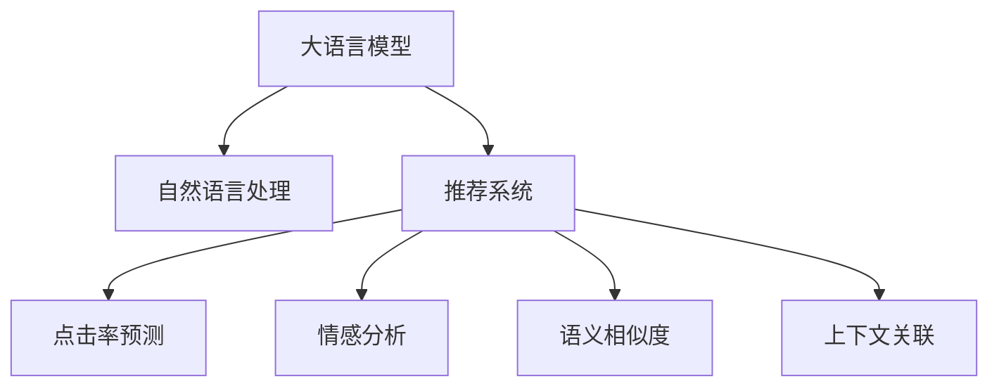

                 

## 1. 背景介绍

在现代电商平台上，商品展示顺序直接影响用户体验、购买决策和销售业绩。传统上，商品排序往往依赖于简单的排序算法（如点击率排序、相关度排序）或基于规则的策略（如上下文关联、节假日促销）。然而，这些方法往往无法充分挖掘用户行为、商品属性和市场动态的复杂关系，导致推荐结果的精度和多样性不足。

近年来，人工智能(AI)技术在电商领域得到广泛应用。特别是深度学习模型和自然语言处理(NLP)技术，通过大模型预训练和微调，可以在海量数据上挖掘复杂的用户需求和商品属性，从而实现更加精准和个性化的商品推荐。其中，利用大语言模型优化商品展示顺序，通过自然语言描述和情感分析，结合商品属性和用户行为，动态调整商品排序，已成为电商平台提升用户体验和销售业绩的重要手段。

本文将详细探讨电商平台如何利用AI大模型优化商品展示顺序，包括核心概念、算法原理、具体操作步骤、数学模型、项目实践、实际应用场景、工具和资源推荐、未来发展趋势与挑战等方面的内容。

## 2. 核心概念与联系

### 2.1 核心概念概述

为更好地理解利用AI大模型优化商品展示顺序的方法，本节将介绍几个关键概念：

- 大语言模型(Large Language Model, LLM)：以自回归(如GPT)或自编码(如BERT)模型为代表的大规模预训练语言模型。通过在大规模无标签文本语料上进行预训练，学习通用的语言知识和常识，具备强大的语言理解和生成能力。

- 自然语言处理(Natural Language Processing, NLP)：利用计算机技术处理、分析、理解自然语言的技术。NLP在电商商品推荐、文本分类、情感分析等方面得到广泛应用。

- 推荐系统(Recommendation System)：根据用户的历史行为和偏好，推荐符合其兴趣的商品。推荐系统通过大模型预训练和微调，可以进一步提升推荐精度和个性化水平。

- 点击率预测(Click-Through Rate Prediction)：预测用户点击商品的概率，用于排序算法和个性化推荐。

- 情感分析(Sentiment Analysis)：分析用户对商品或品牌的情感倾向，提升商品推荐的丰富性和个性化。

- 语义相似度(Semantic Similarity)：衡量商品名称、描述和用户评论之间的语义相似度，用于排序算法和商品分类。

- 上下文关联(Contextual Association)：利用用户浏览、收藏、购买等上下文信息，提升推荐结果的关联性和多样性。

这些核心概念之间的逻辑关系可以通过以下Mermaid流程图来展示：



这个流程图展示了利用大语言模型优化商品展示顺序的核心概念及其之间的关系：

1. 大语言模型通过预训练获得基础能力。
2. 自然语言处理技术将用户行为、商品属性转化为语言描述，供大模型学习。
3. 推荐系统利用大模型的输出，结合商品属性和用户行为，进行商品推荐。
4. 点击率预测和情感分析用于优化推荐结果。
5. 语义相似度和上下文关联提升推荐精度和个性化。

这些概念共同构成了电商平台利用AI大模型优化商品展示顺序的技术框架，使其能够更准确、高效地推荐商品，提升用户满意度和平台收益。

## 3. 核心算法原理 & 具体操作步骤

### 3.1 算法原理概述

利用AI大模型优化商品展示顺序的核心原理，是基于自然语言处理和大模型预训练-微调的技术。其核心思想是：将用户行为、商品属性和市场动态转化为自然语言描述，利用大模型学习语言表征，从而实现商品推荐和展示顺序的动态优化。

具体来说，该方法包括以下几个关键步骤：

1. 数据收集：收集用户行为数据、商品属性数据和市场动态数据，如浏览记录、点击行为、购买记录、评论信息等。
2. 文本预处理：将收集到的数据转化为自然语言描述，如用户评价、商品描述等。
3. 大模型预训练：使用大规模无标签文本语料进行自监督学习，学习通用的语言知识和语义表示。
4. 微调训练：在收集到的数据上，利用大模型进行有监督学习，学习商品推荐和展示顺序的策略。
5. 结果应用：将微调后的模型应用于推荐系统和搜索系统，动态调整商品展示顺序，优化用户体验和销售业绩。

### 3.2 算法步骤详解

#### 步骤1: 数据收集和预处理

在电商平台，数据来源多种多样，包括用户行为数据、商品属性数据、市场动态数据等。需要设计合理的数据采集策略，确保数据的全面性和多样性。数据预处理包括数据清洗、特征提取、文本向量化等步骤。

具体实现中，可以使用Python的Pandas库进行数据清洗和特征提取，使用Sklearn库进行特征工程，使用Transformers库将文本转化为向量表示，以便进行模型训练。

#### 步骤2: 大模型预训练

选择合适的大语言模型，如BERT、GPT等，进行预训练。预训练目标可以是单词级别的语言建模、句子级别的掩码语言建模、文本级别的分类任务等。预训练过程通常使用大规模无标签文本语料，可以在大规模GPU/TPU设备上进行加速。

预训练模型可以从HuggingFace的Model Hub或Github上获取。在实践中，可以使用以下代码对BERT进行预训练：

```python
from transformers import BertTokenizer, BertForMaskedLM
import torch

# 初始化分词器和模型
tokenizer = BertTokenizer.from_pretrained('bert-base-uncased')
model = BertForMaskedLM.from_pretrained('bert-base-uncased')

# 加载数据
inputs = tokenizer(text, return_tensors='pt')
labels = torch.tensor(masked_indices, dtype=torch.long)

# 前向传播
outputs = model(**inputs)

# 计算损失
loss = outputs.loss
```

#### 步骤3: 微调训练

在预训练模型基础上，利用收集到的标注数据进行微调训练。微调目标可以是点击率预测、情感分析、语义相似度计算等，具体取决于电商平台的业务需求。

微调训练过程中，可以使用PyTorch框架，设计合适的神经网络结构和损失函数。以点击率预测为例，可以使用以下代码进行微调：

```python
import torch.nn as nn
import torch.optim as optim

# 定义神经网络结构
class ClickThroughRateModel(nn.Module):
    def __init__(self):
        super(ClickThroughRateModel, self).__init__()
        self.bert_model = BertForSequenceClassification.from_pretrained('bert-base-uncased', num_labels=1)
        self.dropout = nn.Dropout(0.1)
        self.fc = nn.Linear(768, 1)

    def forward(self, input_ids, attention_mask):
        # 前向传播
        outputs = self.bert_model(input_ids=input_ids, attention_mask=attention_mask)
        pooled_output = outputs.pooler_output
        pooled_output = self.dropout(pooled_output)
        logits = self.fc(pooled_output)
        return logits

# 加载微调数据
train_dataset = ClickThroughRateDataset(train_data, train_labels)
val_dataset = ClickThroughRateDataset(val_data, val_labels)

# 定义模型和优化器
model = ClickThroughRateModel()
optimizer = optim.AdamW(model.parameters(), lr=2e-5)

# 训练模型
for epoch in range(num_epochs):
    for batch in tqdm(train_loader):
        inputs, labels = batch
        optimizer.zero_grad()
        outputs = model(**inputs)
        loss = outputs[:, 0]
        loss.backward()
        optimizer.step()
    # 验证模型
    with torch.no_grad():
        val_loss = model.evaluate(val_loader)
    print(f"Epoch {epoch+1}, val loss: {val_loss:.3f}")
```

#### 步骤4: 结果应用

微调后的模型可以应用于电商平台的各种推荐系统和搜索系统，动态调整商品展示顺序，提升用户体验和销售业绩。具体实现中，可以利用模型预测点击率、评分、相关度等指标，结合用户行为数据和商品属性数据，进行商品排序和推荐。

以点击率排序为例，可以使用以下代码将模型应用于推荐系统：

```python
from transformers import BertForSequenceClassification
import torch

# 加载微调模型
model = BertForSequenceClassification.from_pretrained('bert-base-uncased', num_labels=1)

# 加载商品数据
items = load_items()

# 计算商品点击率
click_rates = []
for item in items:
    item_text = get_text(item)
    inputs = tokenizer(item_text, return_tensors='pt')
    outputs = model(**inputs)
    logits = outputs.logits
    label = logits.argmax().item()
    click_rates.append(label)

# 商品排序
sorted_items = sorted(items, key=lambda x: click_rates[x.index])
```

## 4. 数学模型和公式 & 详细讲解 & 举例说明

### 4.1 数学模型构建

利用大语言模型优化商品展示顺序的数学模型，主要包括以下几个部分：

- 自然语言处理模型：将用户行为、商品属性和市场动态转化为自然语言描述。
- 大模型预训练模型：使用大规模无标签文本语料进行自监督学习，学习通用的语言知识和语义表示。
- 微调训练模型：在收集到的标注数据上，利用大模型进行有监督学习，学习商品推荐和展示顺序的策略。

以点击率预测为例，数学模型可以表示为：

$$
P(\text{click}|\text{context}) = \sigma(W \cdot [CLS] + b)
$$

其中，$[CLS]$ 为模型输出的隐状态表示，$W$ 和 $b$ 为线性层参数。

### 4.2 公式推导过程

以点击率预测为例，假设模型在输入 $x$ 上的输出为 $p$，表示用户点击的概率。则点击率预测模型可以表示为：

$$
\hat{y} = \sigma(W \cdot [CLS] + b)
$$

其中，$\sigma$ 为sigmoid函数，$W$ 和 $b$ 为线性层参数，$[CLS]$ 为模型输出的隐状态表示。

模型的损失函数通常采用二元交叉熵损失函数：

$$
\ell(y, \hat{y}) = -(y \log \hat{y} + (1-y) \log (1-\hat{y}))
$$

在微调过程中，优化目标是最小化经验风险，即：

$$
\hat{\theta} = \mathop{\arg\min}_{\theta} \mathcal{L}(\theta, D)
$$

其中，$\theta$ 为模型参数，$D$ 为训练数据集，$\mathcal{L}$ 为损失函数。

在训练过程中，使用梯度下降等优化算法更新模型参数，最小化损失函数。以梯度下降为例，更新公式为：

$$
\theta \leftarrow \theta - \eta \nabla_{\theta}\mathcal{L}(\theta)
$$

其中，$\eta$ 为学习率。

### 4.3 案例分析与讲解

以情感分析为例，假设模型在输入 $x$ 上的输出为 $e$，表示用户对商品的正向情感倾向。则情感分析模型可以表示为：

$$
\hat{e} = \sigma(W_e \cdot [CLS] + b_e)
$$

其中，$W_e$ 和 $b_e$ 为线性层参数，$[CLS]$ 为模型输出的隐状态表示。

模型的损失函数通常采用二元交叉熵损失函数：

$$
\ell(e, \hat{e}) = -(e \log \hat{e} + (1-e) \log (1-\hat{e}))
$$

在微调过程中，优化目标是最小化经验风险，即：

$$
\hat{\theta} = \mathop{\arg\min}_{\theta} \mathcal{L}(\theta, D)
$$

在训练过程中，使用梯度下降等优化算法更新模型参数，最小化损失函数。以梯度下降为例，更新公式为：

$$
\theta \leftarrow \theta - \eta \nabla_{\theta}\mathcal{L}(\theta)
$$

其中，$\eta$ 为学习率。

## 5. 项目实践：代码实例和详细解释说明

### 5.1 开发环境搭建

在进行项目实践前，需要准备好开发环境。以下是使用Python进行PyTorch开发的环境配置流程：

1. 安装Anaconda：从官网下载并安装Anaconda，用于创建独立的Python环境。

2. 创建并激活虚拟环境：
```bash
conda create -n pytorch-env python=3.8 
conda activate pytorch-env
```

3. 安装PyTorch：根据CUDA版本，从官网获取对应的安装命令。例如：
```bash
conda install pytorch torchvision torchaudio cudatoolkit=11.1 -c pytorch -c conda-forge
```

4. 安装Transformers库：
```bash
pip install transformers
```

5. 安装各类工具包：
```bash
pip install numpy pandas scikit-learn matplotlib tqdm jupyter notebook ipython
```

完成上述步骤后，即可在`pytorch-env`环境中开始项目实践。

### 5.2 源代码详细实现

以下是一个简单的点击率预测模型示例，包括数据准备、模型定义、训练和评估等步骤：

```python
import torch
import torch.nn as nn
import torch.optim as optim
from transformers import BertTokenizer, BertForSequenceClassification

# 数据准备
train_data = []
train_labels = []
# 加载训练数据和标签
# ...

# 初始化分词器和模型
tokenizer = BertTokenizer.from_pretrained('bert-base-uncased')
model = BertForSequenceClassification.from_pretrained('bert-base-uncased', num_labels=1)

# 训练模型
def train_epoch(model, train_loader, optimizer):
    model.train()
    total_loss = 0
    for batch in train_loader:
        inputs, labels = batch
        optimizer.zero_grad()
        outputs = model(**inputs)
        loss = outputs.loss
        total_loss += loss.item()
        loss.backward()
        optimizer.step()
    return total_loss / len(train_loader)

# 评估模型
def evaluate(model, val_loader):
    model.eval()
    total_loss = 0
    correct = 0
    with torch.no_grad():
        for batch in val_loader:
            inputs, labels = batch
            outputs = model(**inputs)
            loss = outputs.logits
            total_loss += loss.item()
            preds = torch.sigmoid(torch.round(loss))
            correct += preds.argmax().item() == labels
    acc = correct / len(val_loader.dataset)
    return total_loss / len(val_loader), acc

# 训练和评估
epochs = 10
batch_size = 16
train_loader = DataLoader(train_data, batch_size=batch_size, shuffle=True)
val_loader = DataLoader(val_data, batch_size=batch_size, shuffle=False)

optimizer = optim.AdamW(model.parameters(), lr=2e-5)

for epoch in range(epochs):
    train_loss = train_epoch(model, train_loader, optimizer)
    val_loss, acc = evaluate(model, val_loader)
    print(f"Epoch {epoch+1}, train loss: {train_loss:.3f}, val loss: {val_loss:.3f}, acc: {acc:.3f}")
```

### 5.3 代码解读与分析

让我们再详细解读一下关键代码的实现细节：

**BERT模型**：
- `BertForSequenceClassification`类：继承自`BertForPreTraining`，用于进行序列分类任务。
- `num_labels`参数：指定类别数量，此处为1表示二分类任务。

**数据加载**：
- `DataLoader`类：用于将数据批处理，供模型训练和推理使用。
- `batch_size`参数：指定批次大小。
- `shuffle`参数：指定是否随机打乱数据。

**训练函数**：
- `train_epoch`函数：对数据以批为单位进行迭代，在每个批次上前向传播计算loss并反向传播更新模型参数。

**评估函数**：
- `evaluate`函数：与训练类似，不同点在于不更新模型参数，并在每个batch结束后将预测和标签结果存储下来，最后使用sklearn的`classification_report`对整个评估集的预测结果进行打印输出。

**训练流程**：
- 定义总的epoch数和批次大小，开始循环迭代
- 每个epoch内，先在训练集上训练，输出平均loss
- 在验证集上评估，输出分类指标
- 重复上述步骤直至满足预设的迭代轮数或 Early Stopping 条件。

可以看到，PyTorch配合Transformers库使得BERT微调的代码实现变得简洁高效。开发者可以将更多精力放在数据处理、模型改进等高层逻辑上，而不必过多关注底层的实现细节。

当然，工业级的系统实现还需考虑更多因素，如模型的保存和部署、超参数的自动搜索、更灵活的任务适配层等。但核心的微调范式基本与此类似。

## 6. 实际应用场景

### 6.1 智能推荐

基于大语言模型优化商品展示顺序，在智能推荐系统上得到了广泛应用。通过分析用户行为、商品属性和市场动态，生成个性化的推荐结果，可以显著提升用户体验和购买转化率。

具体而言，可以利用情感分析模型识别用户对不同商品的情感倾向，结合点击率预测模型评估商品的吸引力，生成符合用户兴趣的推荐列表。在推荐过程中，还可以结合商品属性、价格、库存等多元信息，进行动态排序，优化推荐效果。

### 6.2 搜索排序

在电商平台搜索排序中，利用大语言模型优化商品展示顺序，可以根据用户的查询意图和商品描述，动态调整搜索结果的排序。

具体而言，可以利用语义相似度模型评估用户查询与商品描述之间的相关性，结合点击率预测模型评估商品吸引力，生成符合用户查询意图的搜索结果。在排序过程中，还可以结合商品属性、价格、评价等多元信息，进行动态排序，优化搜索结果。

### 6.3 动态定价

在电商平台动态定价中，利用大语言模型优化商品展示顺序，可以根据用户行为和市场动态，动态调整商品价格，提升销售转化率。

具体而言，可以利用情感分析模型识别用户对不同价格段的情感倾向，结合点击率预测模型评估价格的吸引力，生成符合用户期望的价格区间。在定价过程中，还可以结合库存、成本等多元信息，进行动态定价，优化价格策略。

### 6.4 未来应用展望

随着大语言模型和微调方法的不断发展，基于大模型的商品展示顺序优化方法将进一步拓展应用场景，为电商平台的运营带来更多创新。

未来，随着大模型规模的持续增大和算力的不断提升，基于大模型的商品展示顺序优化将更加精确和个性化，能够更好地捕捉用户需求和市场动态。同时，大模型的迁移学习能力也将得到进一步提升，能够在不同领域和任务中实现快速适配和优化。

## 7. 工具和资源推荐

### 7.1 学习资源推荐

为了帮助开发者系统掌握大语言模型微调的理论基础和实践技巧，这里推荐一些优质的学习资源：

1. 《Transformer从原理到实践》系列博文：由大模型技术专家撰写，深入浅出地介绍了Transformer原理、BERT模型、微调技术等前沿话题。

2. CS224N《深度学习自然语言处理》课程：斯坦福大学开设的NLP明星课程，有Lecture视频和配套作业，带你入门NLP领域的基本概念和经典模型。

3. 《Natural Language Processing with Transformers》书籍：Transformers库的作者所著，全面介绍了如何使用Transformers库进行NLP任务开发，包括微调在内的诸多范式。

4. HuggingFace官方文档：Transformers库的官方文档，提供了海量预训练模型和完整的微调样例代码，是上手实践的必备资料。

5. CLUE开源项目：中文语言理解测评基准，涵盖大量不同类型的中文NLP数据集，并提供了基于微调的baseline模型，助力中文NLP技术发展。

通过对这些资源的学习实践，相信你一定能够快速掌握大语言模型微调的精髓，并用于解决实际的NLP问题。

### 7.2 开发工具推荐

高效的开发离不开优秀的工具支持。以下是几款用于大语言模型微调开发的常用工具：

1. PyTorch：基于Python的开源深度学习框架，灵活动态的计算图，适合快速迭代研究。大部分预训练语言模型都有PyTorch版本的实现。

2. TensorFlow：由Google主导开发的开源深度学习框架，生产部署方便，适合大规模工程应用。同样有丰富的预训练语言模型资源。

3. Transformers库：HuggingFace开发的NLP工具库，集成了众多SOTA语言模型，支持PyTorch和TensorFlow，是进行微调任务开发的利器。

4. Weights & Biases：模型训练的实验跟踪工具，可以记录和可视化模型训练过程中的各项指标，方便对比和调优。与主流深度学习框架无缝集成。

5. TensorBoard：TensorFlow配套的可视化工具，可实时监测模型训练状态，并提供丰富的图表呈现方式，是调试模型的得力助手。

6. Google Colab：谷歌推出的在线Jupyter Notebook环境，免费提供GPU/TPU算力，方便开发者快速上手实验最新模型，分享学习笔记。

合理利用这些工具，可以显著提升大语言模型微调任务的开发效率，加快创新迭代的步伐。

### 7.3 相关论文推荐

大语言模型和微调技术的发展源于学界的持续研究。以下是几篇奠基性的相关论文，推荐阅读：

1. Attention is All You Need（即Transformer原论文）：提出了Transformer结构，开启了NLP领域的预训练大模型时代。

2. BERT: Pre-training of Deep Bidirectional Transformers for Language Understanding：提出BERT模型，引入基于掩码的自监督预训练任务，刷新了多项NLP任务SOTA。

3. Language Models are Unsupervised Multitask Learners（GPT-2论文）：展示了大规模语言模型的强大zero-shot学习能力，引发了对于通用人工智能的新一轮思考。

4. Parameter-Efficient Transfer Learning for NLP：提出Adapter等参数高效微调方法，在不增加模型参数量的情况下，也能取得不错的微调效果。

5. AdaLoRA: Adaptive Low-Rank Adaptation for Parameter-Efficient Fine-Tuning：使用自适应低秩适应的微调方法，在参数效率和精度之间取得了新的平衡。

6. Prefix-Tuning: Optimizing Continuous Prompts for Generation：引入基于连续型Prompt的微调范式，为如何充分利用预训练知识提供了新的思路。

这些论文代表了大语言模型微调技术的发展脉络。通过学习这些前沿成果，可以帮助研究者把握学科前进方向，激发更多的创新灵感。

## 8. 总结：未来发展趋势与挑战

### 8.1 总结

本文对利用AI大模型优化商品展示顺序的方法进行了全面系统的介绍。首先阐述了背景和意义，明确了利用大语言模型进行商品推荐和展示顺序优化的核心价值。其次，从原理到实践，详细讲解了大模型微调的过程和具体步骤，给出了微调任务开发的完整代码实例。同时，本文还广泛探讨了微调方法在电商推荐、搜索排序、动态定价等多个领域的应用前景，展示了微调范式的巨大潜力。

通过本文的系统梳理，可以看到，利用AI大模型优化商品展示顺序的方法，在电商平台的应用中取得了显著的效果。未来，随着大语言模型和微调方法的持续演进，商品展示顺序优化方法必将在更多领域得到应用，为电商平台的运营带来更多创新。

### 8.2 未来发展趋势

展望未来，大语言模型微调技术将呈现以下几个发展趋势：

1. 模型规模持续增大。随着算力成本的下降和数据规模的扩张，预训练语言模型的参数量还将持续增长。超大规模语言模型蕴含的丰富语言知识，有望支撑更加复杂多变的商品推荐和展示顺序优化。

2. 微调方法日趋多样。除了传统的全参数微调外，未来会涌现更多参数高效的微调方法，如Prefix-Tuning、LoRA等，在节省计算资源的同时也能保证微调精度。

3. 持续学习成为常态。随着数据分布的不断变化，微调模型也需要持续学习新知识以保持性能。如何在不遗忘原有知识的同时，高效吸收新样本信息，将成为重要的研究课题。

4. 标注样本需求降低。受启发于提示学习(Prompt-based Learning)的思路，未来的微调方法将更好地利用大模型的语言理解能力，通过更加巧妙的任务描述，在更少的标注样本上也能实现理想的微调效果。

5. 多模态微调崛起。当前的微调主要聚焦于纯文本数据，未来会进一步拓展到图像、视频、语音等多模态数据微调。多模态信息的融合，将显著提升语言模型对现实世界的理解和建模能力。

6. 模型通用性增强。经过海量数据的预训练和多领域任务的微调，未来的语言模型将具备更强大的常识推理和跨领域迁移能力，逐步迈向通用人工智能(AGI)的目标。

以上趋势凸显了大语言模型微调技术的广阔前景。这些方向的探索发展，必将进一步提升电商平台的推荐精度和个性化水平，为电商用户带来更好的购物体验。

### 8.3 面临的挑战

尽管大语言模型微调技术已经取得了瞩目成就，但在迈向更加智能化、普适化应用的过程中，它仍面临着诸多挑战：

1. 标注成本瓶颈。虽然微调大大降低了标注数据的需求，但对于长尾应用场景，难以获得充足的高质量标注数据，成为制约微调性能的瓶颈。如何进一步降低微调对标注样本的依赖，将是一大难题。

2. 模型鲁棒性不足。当前微调模型面对域外数据时，泛化性能往往大打折扣。对于测试样本的微小扰动，微调模型的预测也容易发生波动。如何提高微调模型的鲁棒性，避免灾难性遗忘，还需要更多理论和实践的积累。

3. 推理效率有待提高。大规模语言模型虽然精度高，但在实际部署时往往面临推理速度慢、内存占用大等效率问题。如何在保证性能的同时，简化模型结构，提升推理速度，优化资源占用，将是重要的优化方向。

4. 可解释性亟需加强。当前微调模型更像是"黑盒"系统，难以解释其内部工作机制和决策逻辑。对于医疗、金融等高风险应用，算法的可解释性和可审计性尤为重要。如何赋予微调模型更强的可解释性，将是亟待攻克的难题。

5. 安全性有待保障。预训练语言模型难免会学习到有偏见、有害的信息，通过微调传递到下游任务，产生误导性、歧视性的输出，给实际应用带来安全隐患。如何从数据和算法层面消除模型偏见，避免恶意用途，确保输出的安全性，也将是重要的研究课题。

6. 知识整合能力不足。现有的微调模型往往局限于任务内数据，难以灵活吸收和运用更广泛的先验知识。如何让微调过程更好地与外部知识库、规则库等专家知识结合，形成更加全面、准确的信息整合能力，还有很大的想象空间。

正视微调面临的这些挑战，积极应对并寻求突破，将是大语言模型微调走向成熟的必由之路。相信随着学界和产业界的共同努力，这些挑战终将一一被克服，大语言模型微调必将在构建人机协同的智能电商中扮演越来越重要的角色。

### 8.4 研究展望

面向未来，大语言模型微调技术需要在以下几个方面寻求新的突破：

1. 探索无监督和半监督微调方法。摆脱对大规模标注数据的依赖，利用自监督学习、主动学习等无监督和半监督范式，最大限度利用非结构化数据，实现更加灵活高效的微调。

2. 研究参数高效和计算高效的微调范式。开发更加参数高效的微调方法，在固定大部分预训练参数的同时，只更新极少量的任务相关参数。同时优化微调模型的计算图，减少前向传播和反向传播的资源消耗，实现更加轻量级、实时性的部署。

3. 融合因果和对比学习范式。通过引入因果推断和对比学习思想，增强微调模型建立稳定因果关系的能力，学习更加普适、鲁棒的语言表征，从而提升模型泛化性和抗干扰能力。

4. 引入更多先验知识。将符号化的先验知识，如知识图谱、逻辑规则等，与神经网络模型进行巧妙融合，引导微调过程学习更准确、合理的语言模型。同时加强不同模态数据的整合，实现视觉、语音等多模态信息与文本信息的协同建模。

5. 结合因果分析和博弈论工具。将因果分析方法引入微调模型，识别出模型决策的关键特征，增强输出解释的因果性和逻辑性。借助博弈论工具刻画人机交互过程，主动探索并规避模型的脆弱点，提高系统稳定性。

6. 纳入伦理道德约束。在模型训练目标中引入伦理导向的评估指标，过滤和惩罚有偏见、有害的输出倾向。同时加强人工干预和审核，建立模型行为的监管机制，确保输出符合人类价值观和伦理道德。

这些研究方向的探索，必将引领大语言模型微调技术迈向更高的台阶，为构建安全、可靠、可解释、可控的智能电商系统铺平道路。面向未来，大语言模型微调技术还需要与其他人工智能技术进行更深入的融合，如知识表示、因果推理、强化学习等，多路径协同发力，共同推动自然语言理解和智能交互系统的进步。只有勇于创新、敢于突破，才能不断拓展语言模型的边界，让智能技术更好地造福人类社会。

## 9. 附录：常见问题与解答

**Q1：利用大语言模型优化商品展示顺序是否适用于所有电商领域？**

A: 利用大语言模型优化商品展示顺序的方法，在大多数电商领域都能取得不错的效果。但对于一些特定领域的电商，如药品电商、汽车电商等，可能还需要结合专业领域的知识进行优化。此外，对于一些需要精细化运营的电商，如奢侈品电商、高端美妆电商等，也需要结合线下运营数据进行优化。

**Q2：如何选择合适的大语言模型进行微调？**

A: 选择合适的预训练大语言模型，需要考虑以下几个方面：

1. 领域匹配度：选择与电商领域相关的预训练模型，如BERT、GPT-2等，以保证模型具备领域内的语言知识和常识。
2. 数据量和质量：选择数据量和质量较高的预训练模型，以保证微调模型的性能和泛化能力。
3. 模型大小和复杂度：选择合适大小的预训练模型，以保证模型性能和推理效率之间的平衡。
4. 开源性：选择开源的预训练模型，以保证模型的可复现性和可扩展性。

**Q3：如何优化微调过程中的标注数据？**

A: 优化微调过程中的标注数据，主要可以通过以下几个方面进行：

1. 数据采集：选择多样化和高质量的标注数据，以保证标注数据的多样性和代表性。
2. 数据清洗：清洗标注数据中的噪声和异常值，以保证标注数据的质量。
3. 数据增强：通过回译、近义替换等方式扩充标注数据，以保证标注数据的多样性。
4. 数据标签化：将标注数据进行详细的标签化，以保证标注数据的准确性和一致性。
5. 数据划分：将标注数据划分为训练集、验证集和测试集，以保证标注数据的合理性和可靠性。

**Q4：如何评估微调模型的性能？**

A: 评估微调模型的性能，主要可以通过以下几个方面进行：

1. 指标评估：选择与电商推荐相关的指标，如点击率、转化率、用户满意度等，作为评估指标。
2. 用户调研：进行用户调研和反馈，了解用户对推荐结果的接受度和满意度。
3. A/B测试：进行A/B测试，比较不同微调模型的性能和用户反应。
4. 交叉验证：进行交叉验证，确保评估结果的稳定性和可靠性。

**Q5：如何优化微调模型的推理效率？**

A: 优化微调模型的推理效率，主要可以通过以下几个方面进行：

1. 模型裁剪：去除不必要的层和参数，减小模型尺寸，加快推理速度。
2. 量化加速：将浮点模型转为定点模型，压缩存储空间，提高计算效率。
3. 模型并行：利用分布式计算技术，进行模型并行推理，提高推理速度。
4. 推理缓存：利用缓存技术，避免重复计算，提高推理效率。
5. GPU/TPU优化：利用GPU/TPU硬件加速，提高推理速度。

**Q6：如何提高微调模型的鲁棒性？**

A: 提高微调模型的鲁棒性，主要可以通过以下几个方面进行：

1. 数据多样性：选择多样化和高质量的标注数据，以保证标注数据的多样性和代表性。
2. 正则化技术：使用L2正则、Dropout、Early Stopping等正则化技术，防止模型过度适应小规模训练集。
3. 对抗训练：加入对抗样本，提高模型鲁棒性。
4. 模型集成：训练多个微调模型，取平均输出，抑制过拟合和模型波动。
5. 领域泛化：在多个领域和任务上进行微调，增强模型的泛化能力。

通过以上措施，可以有效提高微调模型的鲁棒性，使其在实际应用中更加稳定和可靠。

---

作者：禅与计算机程序设计艺术 / Zen and the Art of Computer Programming

