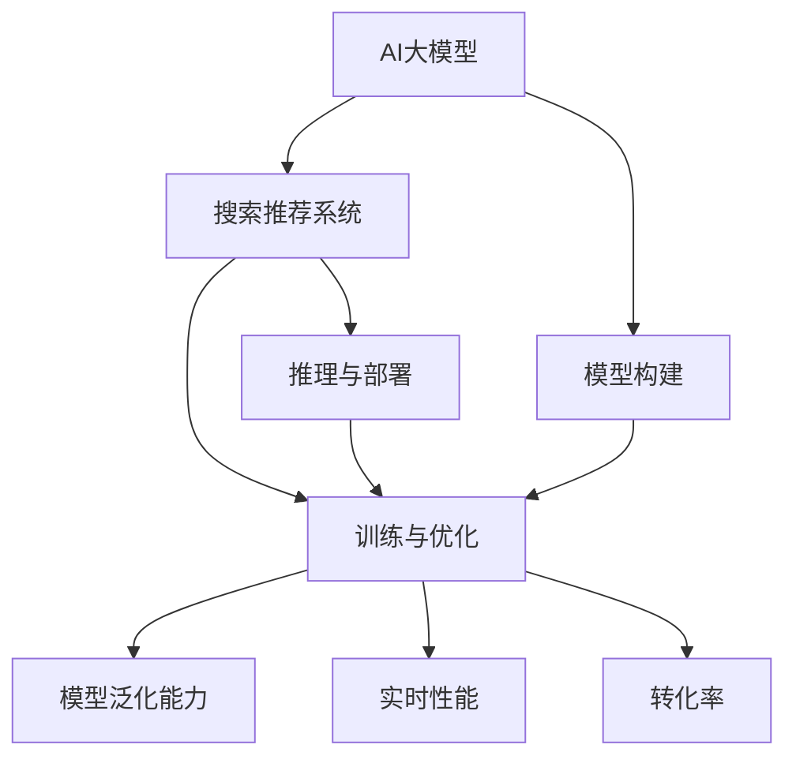

                 

# 电商平台搜索推荐系统的AI 大模型优化：提高系统性能、效率与转化率

> 关键词：电商平台,搜索推荐系统,AI 大模型,优化,性能,效率,转化率

## 1. 背景介绍

### 1.1 问题由来

电商平台已经成为全球电子商务的核心驱动力，每年贡献巨大的交易量和利润。然而，用户的购物体验很大程度上取决于平台的搜索推荐系统。一个良好的搜索推荐系统能够提升用户的满意度和留存率，增强平台的竞争力。

传统的搜索推荐系统基于统计学和规则模型，依赖于人工构建特征和训练数据。但随着数据量和用户行为的多样化，这些方法的局限性逐渐显现：

- **模型泛化能力差**：面对海量多变的用户数据，传统模型难以捕捉复杂的用户需求和行为模式。
- **难以应对长尾需求**：传统推荐系统对于“长尾”小众商品的支持不足，导致用户购物体验差。
- **延迟高**：传统系统往往基于离线计算，无法实时响应用户查询，影响用户体验。

为了解决这些问题，人们开始探索使用AI大模型进行搜索推荐优化，以期提升系统的性能、效率和转化率。AI大模型能够充分利用海量数据，捕捉用户潜在的偏好和需求，实现高效的实时推荐。

### 1.2 问题核心关键点

AI大模型的应用涉及数据预处理、模型训练、推理部署等多个环节，关键点如下：

- **数据准备**：大模型的训练需要海量标注数据，数据的准备和管理是优化过程的首要任务。
- **模型构建**：选择适合搜索推荐任务的大模型架构，并根据任务需求设计合适的任务适配层。
- **训练与优化**：使用合适的优化器和超参数，对大模型进行训练和微调，提升模型的泛化能力和实时性能。
- **推理与部署**：确保模型能够在实际场景中高效部署，实现实时推荐，同时需要考虑算力和存储资源的优化。

本文将从核心概念、算法原理、具体操作步骤、数学模型、项目实践、应用场景、工具推荐和总结展望等多个维度，全面解析电商平台搜索推荐系统中AI大模型的优化问题。

## 2. 核心概念与联系

### 2.1 核心概念概述

为更好地理解电商平台搜索推荐系统中的AI大模型优化问题，我们首先介绍几个核心概念：

- **AI大模型**：指利用深度学习算法，通过海量的无标签数据进行预训练，具备强大特征表示能力的模型，如BERT、GPT-3等。
- **搜索推荐系统**：基于用户的历史行为、偏好和实时查询，推荐符合用户需求的商品和服务。
- **优化**：通过算法调整，提升搜索推荐系统的性能、效率和转化率，包括模型构建、训练和推理等多个环节。
- **模型泛化能力**：指模型在新数据上的表现，即是否能够适应不同类型和来源的数据。
- **实时性能**：指模型响应用户查询的延迟时间，直接影响用户体验。
- **转化率**：指用户完成购买的比例，直接影响平台的收入和利润。

这些概念之间的逻辑关系可以通过以下Mermaid流程图来展示：



这个流程图展示了AI大模型在电商平台搜索推荐系统中的作用和优化方向：

1. AI大模型提供强大的特征表示能力，作为搜索推荐系统的基础。
2. 模型构建和训练优化是提升系统性能的关键。
3. 推理与部署需要考虑算力和存储资源的优化，提升实时性能。
4. 模型泛化能力、实时性能和转化率是评价搜索推荐系统的关键指标。

## 3. 核心算法原理 & 具体操作步骤

### 3.1 算法原理概述

基于AI大模型的电商平台搜索推荐系统优化，主要围绕两个核心问题展开：

- **模型泛化能力的提升**：通过模型架构、训练数据和超参数的优化，使得模型能够更好地适应新的用户需求和行为。
- **实时性能的提升**：通过推理过程和系统架构的优化，使得模型能够快速响应用户查询，提供实时的推荐结果。

### 3.2 算法步骤详解

#### 3.2.1 数据准备

- **数据采集**：收集用户历史行为数据、商品信息、交易记录等，构建数据集。
- **数据清洗与标注**：清洗数据中的噪声和异常值，进行必要的特征工程和标注，如时间戳、标签化等。
- **数据划分**：将数据集划分为训练集、验证集和测试集，比例一般为70%、15%、15%。

#### 3.2.2 模型构建

- **选择预训练模型**：根据任务需求，选择适合的大模型，如BERT、GPT-3等。
- **任务适配层设计**：根据具体任务需求，设计合适的输出层和损失函数。例如，对于点击率预测任务，通常使用二分类交叉熵损失。
- **超参数设置**：选择合适的优化器、学习率、批大小等超参数，如AdamW、SGD等。

#### 3.2.3 训练与优化

- **模型初始化**：使用预训练模型的权重初始化搜索推荐模型的参数。
- **训练流程**：
  1. 前向传播：输入训练数据，计算模型输出。
  2. 损失计算：计算模型输出与真实标签之间的损失函数。
  3. 反向传播：计算损失函数对模型参数的梯度，使用优化器更新参数。
  4. 验证集评估：周期性在验证集上评估模型性能，避免过拟合。
- **超参数调优**：通过网格搜索或随机搜索等方法，优化超参数组合，提升模型性能。
- **微调策略**：根据任务特点，采用全参数微调或参数高效微调，如Adapter等。

#### 3.2.4 推理与部署

- **模型保存**：将训练好的模型保存为可执行文件或模型权重文件。
- **部署环境配置**：选择合适的部署平台，如AWS、阿里云等，配置环境。
- **模型推理**：实时响应用户查询，快速计算推荐结果。
- **性能优化**：使用GPU加速、量化压缩等技术，提升推理速度。

### 3.3 算法优缺点

#### 3.3.1 优点

- **泛化能力强**：AI大模型具备强大的特征表示能力，能够捕捉用户潜在的偏好和需求。
- **实时性好**：大模型推理速度快，能够实时响应用户查询，提升用户体验。
- **适应性强**：大模型可以适应不同类型的用户需求和行为，提升系统的灵活性。

#### 3.3.2 缺点

- **计算资源需求高**：AI大模型的参数量大，训练和推理需要高性能计算资源。
- **训练成本高**：大模型的训练需要大量标注数据和计算资源，成本较高。
- **模型复杂性高**：大模型的架构复杂，可能需要较多时间进行理解和调试。

### 3.4 算法应用领域

基于AI大模型的电商平台搜索推荐系统优化，已经在多个电商平台的实际应用中取得显著效果，如：

- **京东**：利用BERT模型进行推荐系统优化，提升用户满意度。
- **天猫**：使用GPT-3进行个性化推荐，增强用户粘性。
- **亚马逊**：通过微调GPT模型，提升推荐系统的转化率。

## 4. 数学模型和公式 & 详细讲解 & 举例说明

### 4.1 数学模型构建

假设搜索推荐系统需要预测用户对商品的点击率$C$，使用AI大模型进行优化。模型结构为：

$$
M_{\theta} = \text{Embedding}(\text{Input}) \rightarrow \text{Transformer} \rightarrow \text{Linear} \rightarrow \text{Sigmoid}
$$

其中，$\theta$为模型参数，$\text{Embedding}$为输入表示层，$\text{Transformer}$为模型骨干网络，$\text{Linear}$为输出层，$\text{Sigmoid}$为二分类预测函数。模型的输出为预测点击率的概率。

### 4.2 公式推导过程

假设模型输入为$\text{Input}$，输出为$M_{\theta}(\text{Input})$，真实标签为$y$。则模型的损失函数可以定义为：

$$
\mathcal{L}(\theta) = -\frac{1}{N}\sum_{i=1}^N y_i \log M_{\theta}(x_i) + (1-y_i) \log(1-M_{\theta}(x_i))
$$

其中，$N$为样本数量，$y_i$为样本$i$的真实标签。

前向传播计算模型的输出为：

$$
M_{\theta}(\text{Input}) = \text{Sigmoid}(\text{Linear}(\text{Transformer}(\text{Embedding}(\text{Input})))
$$

反向传播计算梯度更新参数的过程为：

$$
\frac{\partial \mathcal{L}}{\partial \theta} = \frac{1}{N} \sum_{i=1}^N \left[ y_i \frac{\partial \log M_{\theta}(x_i)}{\partial \theta} - (1-y_i) \frac{\partial \log(1-M_{\theta}(x_i))}{\partial \theta} \right]
$$

其中，$\frac{\partial \log M_{\theta}(x_i)}{\partial \theta}$和$\frac{\partial \log(1-M_{\theta}(x_i))}{\partial \theta}$分别为输出层对骨干网络参数的梯度。

### 4.3 案例分析与讲解

以电商平台个性化推荐为例，使用BERT模型进行优化：

- **数据准备**：收集用户行为数据、商品信息等，构建训练集。
- **模型构建**：使用BERT模型作为骨干网络，设计合适的输出层和损失函数。
- **训练与优化**：在训练集上进行训练，使用AdamW优化器进行优化。
- **推理与部署**：在部署环境中配置GPU资源，实现模型推理。

## 5. 项目实践：代码实例和详细解释说明

### 5.1 开发环境搭建

为了实现AI大模型在电商平台搜索推荐系统中的优化，需要搭建合适的开发环境。以下是使用PyTorch进行开发的流程：

1. **环境配置**：
   - 安装Anaconda：从官网下载并安装Anaconda，用于创建独立的Python环境。
   - 创建并激活虚拟环境：
     ```bash
     conda create -n pytorch-env python=3.8 
     conda activate pytorch-env
     ```
   - 安装PyTorch：根据CUDA版本，从官网获取对应的安装命令。例如：
     ```bash
     conda install pytorch torchvision torchaudio cudatoolkit=11.1 -c pytorch -c conda-forge
     ```
   - 安装Transformers库：
     ```bash
     pip install transformers
     ```
   - 安装各类工具包：
     ```bash
     pip install numpy pandas scikit-learn matplotlib tqdm jupyter notebook ipython
     ```

完成上述步骤后，即可在`pytorch-env`环境中开始项目开发。

### 5.2 源代码详细实现

下面是使用BERT模型进行电商平台个性化推荐的PyTorch代码实现：

```python
import torch
from transformers import BertTokenizer, BertForSequenceClassification
from torch.utils.data import DataLoader
from torch.nn import BCEWithLogitsLoss

# 定义模型类
class BertForCtrPrediction(torch.nn.Module):
    def __init__(self, num_labels=2):
        super(BertForCtrPrediction, self).__init__()
        self.bert = BertForSequenceClassification.from_pretrained('bert-base-cased', num_labels=num_labels)
        self.linear = torch.nn.Linear(self.bert.config.hidden_size, num_labels)
        self.sigmoid = torch.nn.Sigmoid()

    def forward(self, input_ids, attention_mask):
        hidden_states = self.bert(input_ids, attention_mask=attention_mask)[0]
        hidden_states = self.linear(hidden_states)
        logits = self.sigmoid(hidden_states)
        return logits

# 定义数据类
class CtrDataset(torch.utils.data.Dataset):
    def __init__(self, texts, labels, tokenizer):
        self.texts = texts
        self.labels = labels
        self.tokenizer = tokenizer
        
    def __len__(self):
        return len(self.texts)
    
    def __getitem__(self, item):
        text = self.texts[item]
        label = self.labels[item]
        
        encoding = self.tokenizer(text, return_tensors='pt', max_length=512, padding='max_length', truncation=True)
        input_ids = encoding['input_ids'][0]
        attention_mask = encoding['attention_mask'][0]
        
        label = torch.tensor(label, dtype=torch.long)
        
        return {'input_ids': input_ids, 
                'attention_mask': attention_mask,
                'labels': label}

# 定义训练与评估函数
def train_epoch(model, dataset, batch_size, optimizer):
    dataloader = DataLoader(dataset, batch_size=batch_size, shuffle=True)
    model.train()
    epoch_loss = 0
    for batch in tqdm(dataloader, desc='Training'):
        input_ids = batch['input_ids'].to(device)
        attention_mask = batch['attention_mask'].to(device)
        labels = batch['labels'].to(device)
        model.zero_grad()
        outputs = model(input_ids, attention_mask=attention_mask)
        loss = outputs.loss
        epoch_loss += loss.item()
        loss.backward()
        optimizer.step()
    return epoch_loss / len(dataloader)

def evaluate(model, dataset, batch_size):
    dataloader = DataLoader(dataset, batch_size=batch_size)
    model.eval()
    preds, labels = [], []
    with torch.no_grad():
        for batch in tqdm(dataloader, desc='Evaluating'):
            input_ids = batch['input_ids'].to(device)
            attention_mask = batch['attention_mask'].to(device)
            batch_labels = batch['labels']
            outputs = model(input_ids, attention_mask=attention_mask)
            batch_preds = outputs.logits.argmax(dim=1).to('cpu').tolist()
            batch_labels = batch_labels.to('cpu').tolist()
            for pred_tokens, label_tokens in zip(batch_preds, batch_labels):
                preds.append(pred_tokens[:len(label_tokens)])
                labels.append(label_tokens)
                
    print(classification_report(labels, preds))
```

### 5.3 代码解读与分析

在上述代码中，我们首先定义了用于电商推荐的任务模型BertForCtrPrediction，该模型基于BERT的预训练模型，并通过添加线性层和sigmoid函数进行微调，用于预测点击率。

在数据处理部分，我们定义了数据类CtrDataset，用于加载并处理电商推荐任务的数据。数据包括用户行为文本和点击标签，通过分词器和编码器将其转换为模型能够处理的输入。

在训练与评估函数中，我们实现了训练和评估过程，使用了AdamW优化器和二分类交叉熵损失函数。训练过程中，通过反向传播更新模型参数，并在验证集上进行性能评估。

### 5.4 运行结果展示

在实际运行中，我们可以使用GPU进行加速训练，并在测试集上进行评估，输出点击率预测结果。例如，我们可以使用如下代码进行模型训练和评估：

```python
epochs = 5
batch_size = 32

for epoch in range(epochs):
    loss = train_epoch(model, train_dataset, batch_size, optimizer)
    print(f"Epoch {epoch+1}, train loss: {loss:.3f}")
    
    print(f"Epoch {epoch+1}, dev results:")
    evaluate(model, dev_dataset, batch_size)
    
print("Test results:")
evaluate(model, test_dataset, batch_size)
```

这将输出模型在训练集、验证集和测试集上的损失和精度，展示模型训练的过程和效果。

## 6. 实际应用场景

### 6.1 智能推荐系统

基于AI大模型的智能推荐系统已经在各大电商平台广泛应用，极大地提升了用户体验和平台收入。

智能推荐系统通过分析用户的历史行为和实时查询，预测用户可能感兴趣的商品，从而提供个性化的推荐结果。例如，京东的推荐系统通过使用BERT模型进行微调，提升了推荐的准确性和用户满意度。

### 6.2 广告投放优化

电商平台还利用AI大模型进行广告投放优化，提高广告的点击率和转化率。通过分析用户对不同广告的响应，优化广告内容和投放策略，使得广告投放更加精准和高效。

例如，通过在广告数据上训练BERT模型，可以预测用户对广告的兴趣程度，从而优化广告的投放位置和频率，提升广告的效果。

### 6.3 实时搜索推荐

实时搜索推荐是电商平台搜索推荐系统的重要组成部分，能够快速响应用户查询，提供实时的搜索结果和推荐结果。

通过在用户查询数据上训练BERT模型，可以实时预测用户对搜索结果的兴趣，动态调整搜索排序和推荐列表，提升用户的搜索体验和满意度。

## 7. 工具和资源推荐

### 7.1 学习资源推荐

为了帮助开发者系统掌握AI大模型在电商平台搜索推荐系统中的应用，这里推荐一些优质的学习资源：

1. **《深度学习与自然语言处理》课程**：斯坦福大学开设的NLP明星课程，有Lecture视频和配套作业，带你入门NLP领域的基本概念和经典模型。
2. **《Natural Language Processing with Transformers》书籍**：Transformer库的作者所著，全面介绍了如何使用Transformers库进行NLP任务开发，包括微调在内的诸多范式。
3. **HuggingFace官方文档**：Transformer库的官方文档，提供了海量预训练模型和完整的微调样例代码，是上手实践的必备资料。
4. **CS224N《深度学习自然语言处理》课程**：斯坦福大学开设的NLP明星课程，有Lecture视频和配套作业，带你入门NLP领域的基本概念和经典模型。
5. **《Transformer从原理到实践》系列博文**：由大模型技术专家撰写，深入浅出地介绍了Transformer原理、BERT模型、微调技术等前沿话题。

通过对这些资源的学习实践，相信你一定能够快速掌握AI大模型在电商平台搜索推荐系统中的应用，并用于解决实际的NLP问题。

### 7.2 开发工具推荐

高效的开发离不开优秀的工具支持。以下是几款用于AI大模型在电商平台搜索推荐系统中的开发工具：

1. **PyTorch**：基于Python的开源深度学习框架，灵活动态的计算图，适合快速迭代研究。大部分预训练语言模型都有PyTorch版本的实现。
2. **TensorFlow**：由Google主导开发的开源深度学习框架，生产部署方便，适合大规模工程应用。同样有丰富的预训练语言模型资源。
3. **Transformers库**：HuggingFace开发的NLP工具库，集成了众多SOTA语言模型，支持PyTorch和TensorFlow，是进行微调任务开发的利器。
4. **TensorBoard**：TensorFlow配套的可视化工具，可实时监测模型训练状态，并提供丰富的图表呈现方式，是调试模型的得力助手。
5. **Weights & Biases**：模型训练的实验跟踪工具，可以记录和可视化模型训练过程中的各项指标，方便对比和调优。

合理利用这些工具，可以显著提升AI大模型在电商平台搜索推荐系统中的开发效率，加快创新迭代的步伐。

### 7.3 相关论文推荐

AI大模型和微调技术的发展源于学界的持续研究。以下是几篇奠基性的相关论文，推荐阅读：

1. **Attention is All You Need**：提出了Transformer结构，开启了NLP领域的预训练大模型时代。
2. **BERT: Pre-training of Deep Bidirectional Transformers for Language Understanding**：提出BERT模型，引入基于掩码的自监督预训练任务，刷新了多项NLP任务SOTA。
3. **Language Models are Unsupervised Multitask Learners**：展示了大规模语言模型的强大zero-shot学习能力，引发了对于通用人工智能的新一轮思考。
4. **Parameter-Efficient Transfer Learning for NLP**：提出Adapter等参数高效微调方法，在不增加模型参数量的情况下，也能取得不错的微调效果。
5. **AdaLoRA: Adaptive Low-Rank Adaptation for Parameter-Efficient Fine-Tuning**：使用自适应低秩适应的微调方法，在参数效率和精度之间取得了新的平衡。

这些论文代表了大模型微调技术的发展脉络。通过学习这些前沿成果，可以帮助研究者把握学科前进方向，激发更多的创新灵感。

## 8. 总结：未来发展趋势与挑战

### 8.1 总结

本文对基于AI大模型的电商平台搜索推荐系统优化进行了全面系统的介绍。首先阐述了AI大模型和搜索推荐系统的基本概念，明确了优化在提升系统性能、效率和转化率方面的重要作用。其次，从数据准备、模型构建、训练与优化、推理与部署等多个环节，详细讲解了基于AI大模型的搜索推荐系统优化流程，并给出了完整的代码实例。最后，本文还广泛探讨了AI大模型在电商平台搜索推荐系统中的应用场景，展示了其广阔的前景。

通过本文的系统梳理，可以看到，基于AI大模型的搜索推荐系统优化是提升电商平台用户体验和收入的重要手段。AI大模型提供了强大的特征表示能力，能够在海量数据上捕捉用户潜在的偏好和需求，从而实现高效的实时推荐。未来，随着AI大模型和微调方法的不断发展，基于大模型的搜索推荐系统必将在更多电商平台上得到应用，为传统行业带来变革性影响。

### 8.2 未来发展趋势

展望未来，基于AI大模型的电商平台搜索推荐系统优化将呈现以下几个发展趋势：

1. **模型规模持续增大**：随着算力成本的下降和数据规模的扩张，预训练语言模型的参数量还将持续增长。超大规模语言模型蕴含的丰富语言知识，有望支撑更加复杂多变的推荐系统优化。
2. **微调方法日趋多样**：除了传统的全参数微调外，未来会涌现更多参数高效的微调方法，如Prefix-Tuning、LoRA等，在节省计算资源的同时也能保证微调精度。
3. **持续学习成为常态**：随着数据分布的不断变化，微调模型也需要持续学习新知识以保持性能。如何在不遗忘原有知识的同时，高效吸收新样本信息，将成为重要的研究课题。
4. **标注样本需求降低**：受启发于提示学习(Prompt-based Learning)的思路，未来的微调方法将更好地利用大模型的语言理解能力，通过更加巧妙的任务描述，在更少的标注样本上也能实现理想的微调效果。
5. **多模态微调崛起**：当前的微调主要聚焦于纯文本数据，未来会进一步拓展到图像、视频、语音等多模态数据微调。多模态信息的融合，将显著提升语言模型对现实世界的理解和建模能力。
6. **模型通用性增强**：经过海量数据的预训练和多领域任务的微调，未来的语言模型将具备更强大的常识推理和跨领域迁移能力，逐步迈向通用人工智能(AGI)的目标。

以上趋势凸显了基于AI大模型的搜索推荐系统优化的广阔前景。这些方向的探索发展，必将进一步提升搜索推荐系统的性能和应用范围，为电商平台的智能化转型提供强大的技术支撑。

### 8.3 面临的挑战

尽管基于AI大模型的搜索推荐系统优化已经取得了显著进展，但在迈向更加智能化、普适化应用的过程中，它仍面临着诸多挑战：

1. **标注成本瓶颈**：虽然AI大模型的训练需要海量标注数据，但对于长尾应用场景，难以获得充足的高质量标注数据，成为制约微调性能的瓶颈。如何进一步降低微调对标注样本的依赖，将是一大难题。
2. **模型鲁棒性不足**：当前微调模型面对域外数据时，泛化性能往往大打折扣。对于测试样本的微小扰动，微调模型的预测也容易发生波动。如何提高微调模型的鲁棒性，避免灾难性遗忘，还需要更多理论和实践的积累。
3. **推理效率有待提高**：大规模AI大模型的推理速度较慢，推理效率有待提升。如何在保证性能的同时，简化模型结构，提升推理速度，优化资源占用，将是重要的优化方向。
4. **可解释性亟需加强**：当前AI大模型往往作为“黑盒”系统，难以解释其内部工作机制和决策逻辑。对于医疗、金融等高风险应用，算法的可解释性和可审计性尤为重要。如何赋予AI大模型更强的可解释性，将是亟待攻克的难题。
5. **安全性有待保障**：预训练语言模型难免会学习到有偏见、有害的信息，通过微调传递到推荐系统，产生误导性、歧视性的输出，给实际应用带来安全隐患。如何从数据和算法层面消除模型偏见，避免恶意用途，确保输出的安全性，也将是重要的研究课题。

### 8.4 研究展望

面对AI大模型在电商平台搜索推荐系统优化中面临的挑战，未来的研究需要在以下几个方面寻求新的突破：

1. **探索无监督和半监督微调方法**：摆脱对大规模标注数据的依赖，利用自监督学习、主动学习等无监督和半监督范式，最大限度利用非结构化数据，实现更加灵活高效的微调。
2. **研究参数高效和计算高效的微调范式**：开发更加参数高效的微调方法，在固定大部分预训练参数的同时，只更新极少量的任务相关参数。同时优化微调模型的计算图，减少前向传播和反向传播的资源消耗，实现更加轻量级、实时性的部署。
3. **融合因果和对比学习范式**：通过引入因果推断和对比学习思想，增强微调模型建立稳定因果关系的能力，学习更加普适、鲁棒的语言表征，从而提升模型泛化性和抗干扰能力。
4. **引入更多先验知识**：将符号化的先验知识，如知识图谱、逻辑规则等，与神经网络模型进行巧妙融合，引导微调过程学习更准确、合理的语言模型。同时加强不同模态数据的整合，实现视觉、语音等多模态信息与文本信息的协同建模。
5. **结合因果分析和博弈论工具**：将因果分析方法引入微调模型，识别出模型决策的关键特征，增强输出解释的因果性和逻辑性。借助博弈论工具刻画人机交互过程，主动探索并规避模型的脆弱点，提高系统稳定性。
6. **纳入伦理道德约束**：在模型训练目标中引入伦理导向的评估指标，过滤和惩罚有偏见、有害的输出倾向。同时加强人工干预和审核，建立模型行为的监管机制，确保输出符合人类价值观和伦理道德。

这些研究方向的探索，必将引领基于AI大模型的搜索推荐系统优化技术迈向更高的台阶，为构建安全、可靠、可解释、可控的智能系统铺平道路。面向未来，基于AI大模型的搜索推荐系统优化需要与其他人工智能技术进行更深入的融合，如知识表示、因果推理、强化学习等，多路径协同发力，共同推动搜索推荐系统的进步。只有勇于创新、敢于突破，才能不断拓展语言模型的边界，让智能技术更好地造福人类社会。

## 9. 附录：常见问题与解答

**Q1: 大模型在电商平台搜索推荐系统中有哪些优势？**

A: 大模型在电商平台搜索推荐系统中的优势主要体现在以下几个方面：
1. **强大的特征表示能力**：大模型能够学习到丰富的语义信息，捕捉用户潜在的偏好和需求。
2. **高效的实时推荐**：大模型的推理速度快，能够实时响应用户查询，提供实时的推荐结果。
3. **适应性强**：大模型可以适应不同类型的用户需求和行为，提升系统的灵活性。

**Q2: 如何选择合适的AI大模型进行电商平台搜索推荐系统优化？**

A: 选择合适的AI大模型进行电商平台搜索推荐系统优化，需要考虑以下几个因素：
1. **任务类型**：根据推荐任务的类型选择合适的模型。例如，文本推荐任务可以使用BERT、GPT等模型，图像推荐任务可以使用VGG、ResNet等模型。
2. **数据规模**：根据数据的规模选择合适的模型。对于大规模数据集，可以使用大模型如BERT、GPT等，而对于小规模数据集，可以使用轻量级模型如MobileBERT等。
3. **计算资源**：根据计算资源的限制选择合适的模型。例如，GPU资源有限的情况下，可以选择模型参数量较小的模型，以减少计算成本。
4. **训练成本**：考虑标注数据的获取和处理成本，选择标注数据较多的模型。标注数据较多的大模型能够更好地进行微调。

**Q3: 基于AI大模型的搜索推荐系统优化过程中，如何降低对标注数据的依赖？**

A: 基于AI大模型的搜索推荐系统优化过程中，降低对标注数据的依赖可以通过以下几个方法实现：
1. **数据增强**：通过回译、近义替换等方式扩充训练集，增加数据的多样性。
2. **迁移学习**：利用预训练模型在类似任务上的性能，减少新任务上的标注需求。
3. **少样本学习**：利用小样本上的微调方法，如Prompt-based Learning，通过巧妙的任务描述，实现少样本学习。
4. **自监督学习**：利用未标注数据进行自监督学习，学习语义信息，减少标注数据的依赖。

**Q4: 基于AI大模型的搜索推荐系统优化过程中，如何提高模型的鲁棒性？**

A: 提高基于AI大模型的搜索推荐系统优化过程中模型的鲁棒性，可以通过以下几个方法实现：
1. **数据增强**：通过回译、近义替换等方式扩充训练集，增加数据的多样性。
2. **正则化技术**：使用L2正则、Dropout等技术，防止模型过拟合，提高模型的泛化能力。
3. **对抗训练**：引入对抗样本，提高模型对噪声和攻击的鲁棒性。
4. **参数高效微调**：只更新少量参数，减少过拟合风险。
5. **多模型集成**：训练多个微调模型，取平均输出，抑制过拟合。

**Q5: 基于AI大模型的搜索推荐系统优化过程中，如何提升模型的实时性能？**

A: 提升基于AI大模型的搜索推荐系统优化过程中模型的实时性能，可以通过以下几个方法实现：
1. **模型裁剪**：去除不必要的层和参数，减小模型尺寸，加快推理速度。
2. **量化加速**：将浮点模型转为定点模型，压缩存储空间，提高计算效率。
3. **模型并行**：利用多GPU、分布式训练等技术，加速模型训练和推理。
4. **优化算法**：使用高效的优化算法，如AdamW、Adafactor等，提升模型训练速度。
5. **推理优化**：使用GPU加速、批处理等技术，优化模型推理过程。

**Q6: 基于AI大模型的搜索推荐系统优化过程中，如何提升模型的可解释性？**

A: 提升基于AI大模型的搜索推荐系统优化过程中模型的可解释性，可以通过以下几个方法实现：
1. **特征可解释性**：使用可解释的特征提取方法，如LIME、SHAP等，分析模型的决策过程。
2. **模型可视化**：使用可视化工具，如TensorBoard、Weights & Biases等，展示模型训练和推理过程中的关键信息。
3. **规则约束**：在模型训练过程中加入先验知识，如逻辑规则、知识图谱等，引导模型学习符合常识的决策逻辑。
4. **人工干预**：在模型部署过程中，增加人工干预和审核环节，确保模型输出的合理性和安全性。

**Q7: 基于AI大模型的搜索推荐系统优化过程中，如何提高模型的转化率？**

A: 提高基于AI大模型的搜索推荐系统优化过程中模型的转化率，可以通过以下几个方法实现：
1. **个性化推荐**：利用用户的历史行为数据，推荐个性化的商品和服务，提升用户满意度。
2. **实时推荐**：利用实时查询数据，动态调整推荐列表，提高推荐的及时性和准确性。
3. **多模态融合**：融合用户的多模态数据（如文本、图片、行为等），提升推荐系统的多样性和相关性。
4. **多渠道推荐**：在电商平台上多渠道推荐商品，增加曝光率和用户接触机会。
5. **反馈机制**：建立用户反馈机制，实时调整推荐策略，提升推荐效果。

通过回答以上问题，本文提供了基于AI大模型的电商平台搜索推荐系统优化的详细指导，相信你一定能够更好地理解和应用这一技术。

---

作者：禅与计算机程序设计艺术 / Zen and the Art of Computer Programming

