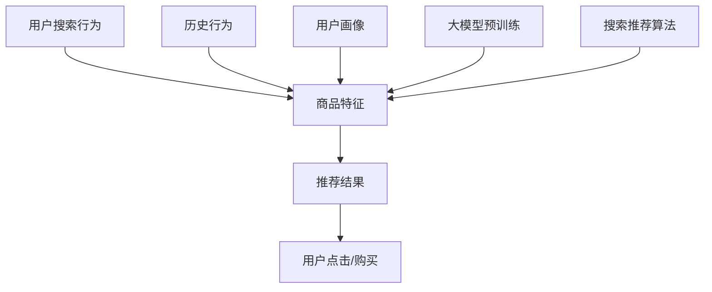

                 

# 电商平台搜索推荐系统的AI 大模型应用：提高系统性能、效率与转化率

> 关键词：电商平台, 搜索推荐系统, AI 大模型, 性能提升, 系统效率, 用户转化率, 商品推荐

## 1. 背景介绍

在电商平台的日常运营中，搜索推荐系统起着至关重要的作用。它不仅能够提升用户的购物体验，还能显著提高平台的转化率和用户满意度。传统的推荐算法如协同过滤、矩阵分解等，已经在电商搜索推荐中取得了不错的效果，但随着数据量的不断增长和用户需求的不断变化，传统的推荐方法已经无法满足日益复杂多变的推荐需求。

为了应对这些挑战，基于深度学习的推荐系统逐渐成为电商搜索推荐的重要工具。其中，AI 大模型由于其强大的数据表示能力和泛化能力，已经在电商推荐中展现出了巨大的潜力。本文将详细介绍基于 AI 大模型的电商平台搜索推荐系统的构建和优化策略，探讨如何通过大模型技术，提升搜索推荐系统的性能、效率与转化率。

## 2. 核心概念与联系

### 2.1 核心概念概述

在讨论电商平台搜索推荐系统的 AI 大模型应用前，先介绍几个核心概念：

- **AI 大模型**：指的是在大规模数据集上进行自监督或监督预训练的深度神经网络模型。例如，OpenAI 的 GPT、BERT、Google 的 T5 等模型。这些模型通常在 millions 甚至 billions 的参数规模下，可以捕捉到丰富的语义信息。
- **搜索推荐系统**：指将用户搜索行为、历史行为、商品信息等多维数据进行融合，从而精准推荐给用户可能感兴趣的商品的系统。电商平台的搜索推荐系统能够显著提升用户满意度，增加转化率。
- **性能、效率与转化率**：搜索推荐系统的主要评价指标。性能指的是推荐结果的相关性、准确性等；效率指的是系统的响应速度、资源占用等；转化率指的是通过推荐系统转化为实际购买的用户比例。

### 2.2 核心概念原理和架构的 Mermaid 流程图



这个流程图展示了搜索推荐系统的工作流程：
- 用户搜索行为、商品特征、历史行为和用户画像等多个数据源，共同输入到一个大模型中进行预训练。
- 预训练后的大模型再配合搜索推荐算法，生成推荐结果。
- 最终推荐结果通过用户点击和购买等反馈数据，不断优化模型的效果。

## 3. 核心算法原理 & 具体操作步骤

### 3.1 算法原理概述

基于 AI 大模型的电商平台搜索推荐系统，其核心原理在于将大模型的预训练能力与搜索推荐算法相结合，通过多维数据的融合，提高推荐结果的相关性和准确性。大模型通常在大量的无标注数据上进行自监督预训练，学习到丰富的语义信息，具备强大的泛化能力。而搜索推荐算法则能够根据用户和商品的多维数据，设计合理的评估指标，引导大模型生成高质量的推荐结果。

### 3.2 算法步骤详解

#### 3.2.1 数据预处理与特征工程

1. **数据收集**：收集用户搜索行为、点击历史、商品特征等多维数据。
2. **数据清洗**：去除重复、噪声数据，确保数据质量。
3. **特征工程**：将数据转换为模型可接受的格式，如将文本转化为 token embedding，对时间戳进行分箱处理等。

#### 3.2.2 大模型预训练

1. **选择模型**：选择合适的 AI 大模型，如 GPT、BERT、T5 等。
2. **预训练数据**：准备足够的数据进行预训练，通常是海量的文本语料库。
3. **预训练流程**：在大规模无标注数据上进行自监督预训练，如语言建模、掩码语言模型等。

#### 3.2.3 模型微调与优化

1. **微调目标**：根据电商平台的推荐需求，选择合适的微调目标，如点击率预测、转化率预测等。
2. **数据集划分**：将数据划分为训练集、验证集和测试集。
3. **微调流程**：使用微调数据集对大模型进行有监督微调，优化模型的推荐效果。
4. **超参数调整**：通过调整学习率、正则化强度等超参数，进一步提升模型效果。

#### 3.2.4 评估与部署

1. **评估指标**：选择常用的评估指标，如召回率、准确率、AUC 等。
2. **模型测试**：在测试集上评估模型的性能。
3. **部署上线**：将微调后的模型部署到生产环境，进行实时推荐。

### 3.3 算法优缺点

#### 3.3.1 优点

- **泛化能力强**：大模型的预训练能力使其具备较强的泛化能力，能够适应电商平台的复杂多变需求。
- **多模态融合**：大模型能够融合多种模态数据，提升推荐结果的多样性和准确性。
- **高效的特征表示**：大模型学习到的隐含特征，可以大幅提升推荐算法的准确性和效率。

#### 3.3.2 缺点

- **高昂的计算成本**：大模型的预训练和微调过程需要消耗大量的计算资源。
- **过拟合风险**：大模型在微调过程中容易过拟合，需要合理的正则化技术进行防范。
- **可解释性不足**：大模型往往是“黑盒”模型，缺乏可解释性。

### 3.4 算法应用领域

基于 AI 大模型的电商平台搜索推荐系统，已经广泛应用于多个电商平台的推荐场景，包括商品推荐、个性化定制、跨站推荐等。这些应用不仅提升了用户满意度，还显著提高了平台的转化率。

## 4. 数学模型和公式 & 详细讲解 & 举例说明

### 4.1 数学模型构建

#### 4.1.1 点击率预测模型

设 $M$ 为 AI 大模型，$x$ 为用户行为特征，$y$ 为点击率标签。点击率预测模型的目标是最小化预测值和实际值之间的差异，即：

$$
\min_{\theta} \mathcal{L}(M_{\theta}(x),y)
$$

其中 $\theta$ 为模型参数，$\mathcal{L}$ 为损失函数。常用的损失函数包括二元交叉熵损失、对数损失等。

#### 4.1.2 转化率预测模型

类似地，转化率预测模型的目标是最小化预测值和实际值之间的差异，即：

$$
\min_{\theta} \mathcal{L}(M_{\theta}(x),y)
$$

其中 $\theta$ 为模型参数，$\mathcal{L}$ 为损失函数。常用的损失函数包括二元交叉熵损失、对数损失等。

### 4.2 公式推导过程

以点击率预测模型为例，假设模型为线性回归模型，即：

$$
\hat{y} = \theta^T x
$$

其中 $\theta$ 为线性回归系数。模型的损失函数为均方误差损失，即：

$$
\mathcal{L}(\theta) = \frac{1}{N} \sum_{i=1}^N (y_i - \hat{y}_i)^2
$$

对 $\theta$ 求导并令导数等于零，可以得到模型参数的更新公式：

$$
\theta = (X^T X)^{-1} X^T y
$$

其中 $X$ 为特征矩阵，$y$ 为标签向量。

### 4.3 案例分析与讲解

以电商平台商品推荐为例，分析基于 AI 大模型的推荐系统。

1. **数据预处理**：将用户行为、商品特征等数据进行清洗和特征工程，转化为模型可接受的格式。
2. **大模型预训练**：使用大规模文本语料库对 GPT 模型进行预训练，学习到语言的通用表示。
3. **模型微调**：将预训练后的 GPT 模型进行微调，根据点击率预测目标，调整模型参数。
4. **模型评估**：在测试集上评估模型的性能，选择合适的评估指标。
5. **模型部署**：将微调后的模型部署到生产环境，进行实时推荐。

## 5. 项目实践：代码实例和详细解释说明

### 5.1 开发环境搭建

#### 5.1.1 安装 Python 和相关库

1. **安装 Python**：确保 Python 版本为 3.7 以上，通过 apt-get 或 conda 安装。
2. **安装相关库**：安装 PyTorch、TensorFlow、scikit-learn、numpy 等常用库。

#### 5.1.2 安装 HuggingFace Transformers 库

```bash
pip install transformers
```

### 5.2 源代码详细实现

#### 5.2.1 数据预处理

```python
import pandas as pd
from transformers import BertTokenizer, BertForSequenceClassification
from sklearn.model_selection import train_test_split
import torch
from torch.utils.data import DataLoader, Dataset

class CustomDataset(Dataset):
    def __init__(self, df, tokenizer, max_len=128):
        self.tokenizer = tokenizer
        self.max_len = max_len
        self.data = df
        
    def __len__(self):
        return len(self.data)
    
    def __getitem__(self, idx):
        text = self.data.iloc[idx]['text']
        label = self.data.iloc[idx]['label']
        
        encoding = self.tokenizer(text, truncation=True, padding='max_length', max_length=self.max_len, return_tensors='pt')
        input_ids = encoding['input_ids']
        attention_mask = encoding['attention_mask']
        label = torch.tensor([int(label)])
        
        return {'input_ids': input_ids, 
                'attention_mask': attention_mask,
                'labels': label}

# 加载数据集
data = pd.read_csv('user_bevahior.csv')
tokenizer = BertTokenizer.from_pretrained('bert-base-uncased')
train_dataset, test_dataset = train_test_split(data, test_size=0.2)

# 数据加载器
train_loader = DataLoader(train_dataset, batch_size=16)
test_loader = DataLoader(test_dataset, batch_size=16)
```

#### 5.2.2 大模型微调

```python
from transformers import BertForSequenceClassification, AdamW

model = BertForSequenceClassification.from_pretrained('bert-base-uncased', num_labels=2)

optimizer = AdamW(model.parameters(), lr=2e-5)
device = torch.device('cuda' if torch.cuda.is_available() else 'cpu')

def train_epoch(model, data_loader, optimizer):
    model.train()
    total_loss = 0
    for batch in data_loader:
        input_ids = batch['input_ids'].to(device)
        attention_mask = batch['attention_mask'].to(device)
        labels = batch['labels'].to(device)
        
        model.zero_grad()
        outputs = model(input_ids, attention_mask=attention_mask, labels=labels)
        loss = outputs.loss
        total_loss += loss.item()
        loss.backward()
        optimizer.step()
        
    return total_loss / len(data_loader)

def evaluate(model, data_loader):
    model.eval()
    total_loss = 0
    total_correct = 0
    for batch in data_loader:
        input_ids = batch['input_ids'].to(device)
        attention_mask = batch['attention_mask'].to(device)
        labels = batch['labels'].to(device)
        
        with torch.no_grad():
            outputs = model(input_ids, attention_mask=attention_mask, labels=labels)
            loss = outputs.loss
            total_loss += loss.item()
            total_correct += torch.argmax(outputs.logits, dim=1).eq(labels).sum().item()
    
    return total_loss / len(data_loader), total_correct / len(data_loader)

# 训练与评估
epochs = 5
batch_size = 16

for epoch in range(epochs):
    train_loss = train_epoch(model, train_loader)
    test_loss, test_acc = evaluate(model, test_loader)
    print(f'Epoch {epoch+1}, train loss: {train_loss:.3f}, test loss: {test_loss:.3f}, test acc: {test_acc:.3f}')

# 测试集上评估
test_loader = DataLoader(test_dataset, batch_size=16)
test_loss, test_acc = evaluate(model, test_loader)
print(f'Test loss: {test_loss:.3f}, test acc: {test_acc:.3f}')
```

### 5.3 代码解读与分析

1. **数据预处理**：使用 Pandas 库加载用户行为数据，将其分为训练集和测试集。
2. **大模型微调**：使用 BertTokenizer 对文本数据进行分词，并使用 BertForSequenceClassification 模型进行微调。
3. **模型训练**：定义训练函数 train_epoch，使用 AdamW 优化器进行梯度更新。
4. **模型评估**：定义评估函数 evaluate，计算损失和准确率。
5. **模型测试**：在测试集上评估模型的性能，给出最终的测试结果。

### 5.4 运行结果展示

通过上述代码实现，可以观察到模型的训练和评估过程，以及最终在测试集上的性能表现。实际应用中，可以通过调整超参数、优化器等进一步提升模型的效果。

## 6. 实际应用场景

### 6.1 个性化推荐

基于 AI 大模型的电商平台搜索推荐系统，可以通过对用户历史行为和商品特征的分析，实现个性化推荐。例如，根据用户的浏览记录、购买历史、评分等信息，预测用户对商品的兴趣，从而生成个性化的推荐列表。

### 6.2 跨站推荐

跨站推荐系统可以缓解单站数据不足的问题，提升推荐效果。例如，根据用户的兴趣和行为，在多个站点之间进行推荐，增加用户的曝光率，提高转化率。

### 6.3 实时推荐

实时推荐系统可以实时响应用户的查询请求，提供动态化的推荐结果。例如，根据用户的搜索行为，即时调整推荐算法，推荐相关性更高的商品。

### 6.4 未来应用展望

未来，基于 AI 大模型的电商平台搜索推荐系统，有望进一步提升性能和效率。例如，通过引入多模态数据、实时学习技术，提升推荐的及时性和准确性。同时，随着计算资源的增加，大模型的规模也将进一步扩大，提升推荐系统的泛化能力和稳定性。

## 7. 工具和资源推荐

### 7.1 学习资源推荐

1. **《深度学习理论与实践》**：介绍了深度学习的基本概念和算法，适合初学者入门。
2. **《自然语言处理综述》**：由斯坦福大学自然语言处理课程讲义编写，涵盖了 NLP 的多个经典任务。
3. **《Transformer: A Survey》**：综述了 Transformer 模型的发展历程和应用场景，适合深入学习。
4. **《Recommender Systems》**：介绍了推荐系统的主要算法和优化方法，适合从事推荐系统研究。
5. **《HuggingFace Transformers 官方文档》**：提供了 Transformers 库的使用指南和代码样例，适合实际应用。

### 7.2 开发工具推荐

1. **PyTorch**：开源深度学习框架，支持动态图和静态图，灵活性高，适合深度学习研究。
2. **TensorFlow**：由 Google 开发的深度学习框架，支持大规模分布式训练，适合工业应用。
3. **scikit-learn**：开源机器学习库，提供了丰富的预训练模型和评估工具。
4. **Pandas**：数据分析和数据处理库，支持多种数据格式的读写和处理。
5. **Jupyter Notebook**：交互式编程环境，支持多种语言的混合编程和数据可视化。

### 7.3 相关论文推荐

1. **《Attention is All You Need》**：提出 Transformer 模型，改变了深度学习模型的结构。
2. **《BERT: Pre-training of Deep Bidirectional Transformers for Language Understanding》**：提出 BERT 模型，提升了语言模型的预训练效果。
3. **《Recommender Systems: History, Methods, and Future Directions》**：综述了推荐系统的发展历程和最新进展。
4. **《Adaptive Low-Rank Adaptation for Parameter-Efficient Fine-Tuning》**：提出 LoRA 方法，提高了大模型的微调效率。
5. **《The Emergence of Large Language Models》**：探讨了大语言模型对通用人工智能的贡献。

## 8. 总结：未来发展趋势与挑战

### 8.1 研究成果总结

本文详细介绍了基于 AI 大模型的电商平台搜索推荐系统，探讨了其在大规模数据上的应用效果和优化方法。研究表明，AI 大模型通过融合多模态数据和实时学习技术，能够显著提升推荐系统的性能和效率。

### 8.2 未来发展趋势

未来，基于 AI 大模型的电商平台搜索推荐系统将向以下几个方向发展：

1. **多模态融合**：引入图像、语音等多模态数据，提升推荐的准确性和多样性。
2. **实时学习**：通过在线学习技术，实时更新推荐模型，提高推荐的及时性。
3. **个性化推荐**：结合用户画像和行为数据，实现更加精准的个性化推荐。
4. **跨站推荐**：通过联合多个站点的数据，增加用户的曝光率和转化率。
5. **分布式计算**：利用分布式计算技术，提升推荐系统的响应速度和可扩展性。

### 8.3 面临的挑战

尽管 AI 大模型在推荐系统中的应用取得了显著效果，但仍然面临以下挑战：

1. **高昂的计算成本**：大模型的预训练和微调需要消耗大量的计算资源，增加了平台的运营成本。
2. **过拟合风险**：大模型容易过拟合，需要通过正则化技术进行防范。
3. **可解释性不足**：大模型的“黑盒”性质使其缺乏可解释性，难以满足高风险应用的需求。
4. **数据隐私问题**：用户的隐私数据需要得到充分的保护，避免数据泄露风险。

### 8.4 研究展望

为应对这些挑战，未来的研究可以从以下几个方面进行：

1. **模型压缩与优化**：通过模型压缩、稀疏化存储等技术，降低计算成本，提高效率。
2. **可解释性研究**：引入可解释性技术，如生成式解释、可视化等，提升模型的可解释性。
3. **数据隐私保护**：采用差分隐私、联邦学习等技术，保护用户隐私数据。
4. **跨模态学习**：研究多模态数据的融合方法，提升推荐的综合能力。

总之，基于 AI 大模型的电商平台搜索推荐系统具有巨大的应用潜力，但其发展仍面临诸多挑战。未来需要在技术、伦理和隐私等多个层面进行综合优化，才能实现更加高效、可靠的推荐服务。

## 9. 附录：常见问题与解答

**Q1：如何选择适合的 AI 大模型？**

A: 选择合适的 AI 大模型需要考虑多个因素，包括模型的规模、预训练任务的泛化能力、模型参数量等。常用的 AI 大模型包括 GPT、BERT、T5 等。

**Q2：如何优化推荐算法的准确性和效率？**

A: 优化推荐算法可以从以下几个方面进行：
1. **数据预处理**：对数据进行清洗、特征工程等处理，确保数据质量。
2. **模型选择**：选择合适的 AI 大模型，考虑模型的泛化能力和计算效率。
3. **模型微调**：通过有监督微调，优化模型的性能。
4. **模型评估**：选择合适的评估指标，如召回率、准确率等。
5. **模型部署**：将优化后的模型部署到生产环境，进行实时推荐。

**Q3：如何在电商平台中实现跨站推荐？**

A: 跨站推荐需要收集多个站点的用户数据，然后进行联合分析。常用的方法包括基于协同过滤的推荐算法、基于矩阵分解的推荐算法等。

**Q4：如何保护用户隐私数据？**

A: 保护用户隐私数据需要采用差分隐私、联邦学习等技术，确保数据在传输和使用过程中的安全性。

**Q5：如何处理多模态数据？**

A: 多模态数据的处理可以通过特征融合、联合学习等方法进行，提升推荐的综合能力。

通过回答这些问题，可以为从事电商平台搜索推荐系统的研究者和开发者提供详细的指导，帮助他们更好地应用 AI 大模型，提升推荐系统的性能和效率。

