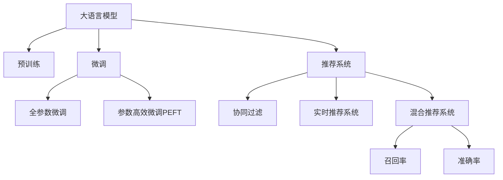

                 

# 电商平台搜索推荐系统的AI 大模型融合：应对数据质量与处理能力挑战

## 1. 背景介绍

### 1.1 问题由来
随着电子商务的迅速发展，电商平台如淘宝、京东、亚马逊等已经积累了海量的用户行为数据。如何利用这些数据进行智能推荐，提升用户体验和销售额，成为了电商平台亟需解决的问题。传统的推荐系统主要依赖基于规则和协同过滤的方法，难以适应个性化需求和动态变化的实时数据。

近年来，深度学习技术在推荐系统中的应用越来越广泛。尤其是基于大模型（如BERT、GPT等）的推荐系统，可以更好地利用大规模数据进行预训练，从而提升推荐精度和效果。然而，在实际应用中，数据质量问题和大模型的处理能力限制，成为了制约这些技术落地的一个重要因素。

### 1.2 问题核心关键点
在电商平台搜索推荐系统中，数据质量和处理能力是两大核心挑战：

1. **数据质量问题**：用户行为数据可能存在缺失、噪声、不一致等问题，影响推荐模型的准确性和鲁棒性。
2. **处理能力限制**：大模型的参数量和计算复杂度较高，难以在实时场景下高效处理大规模数据，特别是在边缘设备上。

本文旨在探讨如何在电商平台搜索推荐系统中，有效地融合大模型与推荐算法，以应对这些挑战。

## 2. 核心概念与联系

### 2.1 核心概念概述

为更好地理解大模型在电商平台推荐系统中的应用，本节将介绍几个密切相关的核心概念：

- **大语言模型(Large Language Model, LLM)**：以BERT、GPT为代表的大规模预训练语言模型。通过在大规模无标签文本语料上进行预训练，学习通用的语言表示，具备强大的语言理解和生成能力。

- **预训练(Pre-training)**：指在大规模无标签文本语料上，通过自监督学习任务训练通用语言模型的过程。常见的预训练任务包括言语建模、遮挡语言模型等。预训练使得模型学习到语言的通用表示。

- **微调(Fine-tuning)**：指在预训练模型的基础上，使用下游任务的少量标注数据，通过有监督地训练来优化模型在该任务上的性能。通常只需要调整顶层分类器或解码器，并以较小的学习率更新全部或部分的模型参数。

- **推荐系统(Recommendation System)**：通过分析用户行为和物品属性，预测用户可能感兴趣的物品，并进行推荐的技术。

- **协同过滤(Collaborative Filtering)**：基于用户和物品之间的相似性，预测用户可能感兴趣的物品。协同过滤包括基于用户的协同过滤和基于物品的协同过滤两种方式。

- **实时推荐系统(Real-time Recommendation System)**：要求在毫秒级别内完成推荐模型的推理和响应，对数据延迟和系统资源的要求较高。

- **混合推荐系统(Hybrid Recommendation System)**：结合多种推荐技术（如协同过滤、内容推荐、基于序列的推荐等），以提升推荐效果。

- **召回率(Recall Rate)**：衡量推荐系统是否能够覆盖所有用户可能感兴趣的物品。

- **准确率(Precision Rate)**：衡量推荐系统推荐的物品是否与用户兴趣匹配。

这些核心概念之间的逻辑关系可以通过以下Mermaid流程图来展示：



这个流程图展示了大语言模型在推荐系统中的应用，包括预训练、微调、协同过滤、实时推荐和混合推荐等多个环节，以及与召回率和准确率等关键指标的联系。

## 3. 核心算法原理 & 具体操作步骤
### 3.1 算法原理概述

在电商平台搜索推荐系统中，大模型的融合应用主要通过预训练-微调的方式来提高推荐精度。具体而言，可以分以下几步进行：

1. **数据预处理**：对原始用户行为数据进行清洗、归一化、特征工程等预处理，以提升数据质量和可用性。
2. **模型预训练**：在大规模无标签数据上进行预训练，学习通用的语言和物品表示。
3. **任务适配**：针对推荐系统中的特定任务（如文本检索、用户意图识别、物品相似度计算等），添加任务适配层，进行微调。
4. **实时推荐**：在推理阶段，使用微调后的模型快速计算用户兴趣和物品推荐。

### 3.2 算法步骤详解

以下详细讲解了电商平台推荐系统中大模型融合的具体步骤：

**Step 1: 数据预处理**
- 收集用户行为数据，如浏览历史、点击记录、评价反馈等，并进行去重、归一化等处理。
- 定义特征维度，如物品ID、用户ID、时间戳、类别等，用于后续模型训练。
- 处理缺失值和异常值，保证数据完整性和一致性。

**Step 2: 模型预训练**
- 选择合适的预训练语言模型，如BERT、GPT等，作为初始化参数。
- 在大规模无标签数据上进行预训练，学习语言的通用表示。
- 定义预训练任务，如掩码语言建模、句子分类等，增强模型的语言理解能力。

**Step 3: 任务适配与微调**
- 根据推荐系统任务的需求，选择适当的任务适配层，如上下文表示层、分类器等。
- 在微调阶段，使用推荐系统中的标注数据进行训练，调整适配层的参数。
- 设置合适的优化器、学习率、批大小等超参数，以提高微调效率。

**Step 4: 实时推荐**
- 在实时推荐场景下，快速调用微调后的模型，进行物品推荐。
- 根据用户行为数据和物品属性，实时计算用户兴趣向量。
- 通过余弦相似度、点积相似度等方式，计算物品与用户兴趣的匹配度。
- 根据匹配度排序，返回推荐结果。

### 3.3 算法优缺点

大模型在电商平台推荐系统中的应用，具有以下优点：
1. **强大的泛化能力**：通过大规模无标签数据预训练，学习到丰富的语言和物品表示，可以适应不同领域的推荐任务。
2. **高效的处理能力**：使用微调方法，可以保留大部分预训练权重，减少推理过程中的计算量和内存占用。
3. **鲁棒性增强**：通过学习大量的语言模式，大模型对噪声和异常数据的鲁棒性更强。
4. **灵活的业务适配**：可以根据具体推荐任务需求，选择不同的任务适配层，进行灵活调整。

然而，大模型在电商平台推荐系统中的应用也存在以下缺点：
1. **数据依赖性强**：预训练和微调过程对数据质量和数量有较高要求，数据的获取和处理成本较高。
2. **模型复杂度高**：大模型的参数量和计算复杂度较高，可能导致推理效率低下。
3. **隐私和安全问题**：在预训练和微调过程中，可能涉及用户隐私数据的处理，需要采取适当的隐私保护措施。

### 3.4 算法应用领域

大模型在电商平台推荐系统中的应用，已经涵盖了多种推荐场景，如：

- **文本检索推荐**：根据用户输入的文本查询，推荐相关的商品或信息。使用BERT、GPT等模型进行文本匹配。
- **用户意图识别**：分析用户的行为数据，识别用户的购买意图和兴趣。使用RNN、Transformer等模型进行序列建模。
- **物品相似度计算**：根据物品的属性和标签，计算物品之间的相似度。使用BERT等模型进行特征表示学习。
- **实时推荐**：根据用户实时行为数据，快速计算推荐结果。使用参数高效微调方法，减少计算资源消耗。

此外，大模型在电商平台推荐系统中还有广泛的应用，如商品标签生成、个性化广告推荐、社交媒体推荐等，为电商平台的运营和营销带来了显著的提升。

## 4. 数学模型和公式 & 详细讲解 & 举例说明（备注：数学公式请使用latex格式，latex嵌入文中独立段落使用 $$，段落内使用 $)
### 4.1 数学模型构建

在电商平台推荐系统中，可以使用大模型进行多个子任务的建模。以文本检索推荐为例，构建数学模型的步骤如下：

1. **文本表示**：将用户查询和商品描述转换为向量表示，通常使用BERT等预训练模型进行文本编码。
2. **相似度计算**：计算用户查询向量与商品向量之间的余弦相似度或点积相似度。
3. **推荐排序**：根据相似度分数进行排序，返回排名靠前的商品。

具体来说，设用户查询文本为 $q$，商品描述文本为 $d$，BERT模型将文本编码为向量表示 $q^*$ 和 $d^*$。则余弦相似度计算公式为：

$$
\text{similarity}(q, d) = \frac{\langle q^*, d^* \rangle}{\|q^*\| \cdot \|d^*\|}
$$

其中 $\langle \cdot, \cdot \rangle$ 表示向量的点积，$\|\cdot\|$ 表示向量的范数。

### 4.2 公式推导过程

对于点积相似度，公式如下：

$$
\text{similarity}(q, d) = \langle q^*, d^* \rangle
$$

在实际应用中，计算点积相似度的过程如下：

1. 将查询文本和商品文本输入BERT模型，得到向量表示 $q^*$ 和 $d^*$。
2. 计算向量点积 $\langle q^*, d^* \rangle$。
3. 将点积结果归一化，得到最终相似度分数。

### 4.3 案例分析与讲解

以“搜索推荐系统中的协同过滤”为例，介绍大模型与协同过滤的结合。协同过滤主要有基于用户的协同过滤和基于物品的协同过滤两种方式。

在基于用户的协同过滤中，模型先对用户进行聚类，然后基于聚类结果进行推荐。具体步骤如下：

1. **用户聚类**：使用K-means等聚类算法对用户进行聚类，得到用户簇。
2. **相似度计算**：计算用户簇之间的相似度，包括余弦相似度和皮尔逊相关系数等。
3. **推荐生成**：根据用户簇的相似度，计算推荐结果。

假设用户A和用户B的兴趣相似度为0.8，A喜欢商品A1和A2，B喜欢商品B1和B2。则B的推荐结果可能包括A1和A2。

## 5. 项目实践：代码实例和详细解释说明
### 5.1 开发环境搭建

在进行推荐系统开发前，需要准备相应的开发环境。以下是使用Python进行PyTorch开发的环境配置流程：

1. 安装Anaconda：从官网下载并安装Anaconda，用于创建独立的Python环境。

2. 创建并激活虚拟环境：
```bash
conda create -n recsys python=3.8 
conda activate recsys
```

3. 安装PyTorch：根据CUDA版本，从官网获取对应的安装命令。例如：
```bash
conda install pytorch torchvision torchaudio cudatoolkit=11.1 -c pytorch -c conda-forge
```

4. 安装TensorFlow：
```bash
conda install tensorflow
```

5. 安装相关库：
```bash
pip install numpy pandas scikit-learn scipy pytorch-lightning transformers sentencepiece
```

完成上述步骤后，即可在`recsys`环境中开始推荐系统开发。

### 5.2 源代码详细实现

以下是使用BERT进行文本检索推荐的具体代码实现：

```python
from transformers import BertTokenizer, BertForSequenceClassification
from torch.utils.data import DataLoader
from torch import nn, optim
from sklearn.metrics import accuracy_score, precision_recall_fscore_support
import torch.nn.functional as F

# 初始化模型和tokenizer
tokenizer = BertTokenizer.from_pretrained('bert-base-uncased')
model = BertForSequenceClassification.from_pretrained('bert-base-uncased', num_labels=2)

# 定义损失函数和优化器
criterion = nn.CrossEntropyLoss()
optimizer = optim.Adam(model.parameters(), lr=1e-5)

# 定义数据预处理函数
def preprocess(text):
    tokens = tokenizer.encode(text, add_special_tokens=True)
    tokens = [0] + tokens + [0]  # 添加[CLS]和[SEP]标记
    return tokens

# 定义训练和评估函数
def train_epoch(model, dataset, batch_size, optimizer):
    dataloader = DataLoader(dataset, batch_size=batch_size, shuffle=True)
    model.train()
    epoch_loss = 0
    for batch in dataloader:
        input_ids = batch['input_ids'].to(device)
        attention_mask = batch['attention_mask'].to(device)
        labels = batch['labels'].to(device)
        model.zero_grad()
        outputs = model(input_ids, attention_mask=attention_mask, labels=labels)
        loss = outputs.loss
        epoch_loss += loss.item()
        loss.backward()
        optimizer.step()
    return epoch_loss / len(dataloader)

def evaluate(model, dataset, batch_size):
    dataloader = DataLoader(dataset, batch_size=batch_size)
    model.eval()
    preds, labels = [], []
    with torch.no_grad():
        for batch in dataloader:
            input_ids = batch['input_ids'].to(device)
            attention_mask = batch['attention_mask'].to(device)
            labels = batch['labels'].to(device)
            outputs = model(input_ids, attention_mask=attention_mask)
            preds.append(outputs.logits.argmax(dim=1).tolist())
            labels.append(labels.to('cpu').tolist())
    return accuracy_score(labels, preds)

# 加载数据集
train_dataset = Dataset(preprocess(train_data), preprocess(train_labels))
dev_dataset = Dataset(preprocess(dev_data), preprocess(dev_labels))
test_dataset = Dataset(preprocess(test_data), preprocess(test_labels))

# 训练模型
device = torch.device('cuda') if torch.cuda.is_available() else torch.device('cpu')
model.to(device)
epochs = 10
for epoch in range(epochs):
    loss = train_epoch(model, train_dataset, batch_size, optimizer)
    print(f'Epoch {epoch+1}, train loss: {loss:.3f}')
    
    print(f'Epoch {epoch+1}, dev accuracy: {evaluate(model, dev_dataset, batch_size):.3f}')
    
# 评估模型
test_accuracy = evaluate(model, test_dataset, batch_size)
print(f'Test accuracy: {test_accuracy:.3f}')
```

在这个代码示例中，我们使用了BERT模型进行文本检索推荐。具体步骤如下：

1. 初始化模型和tokenizer，准备数据集。
2. 定义损失函数和优化器，进行模型训练。
3. 定义预处理函数，将文本转换为BERT模型所需的格式。
4. 定义训练和评估函数，计算模型的损失和准确率。
5. 加载数据集，进行模型训练和评估。

### 5.3 代码解读与分析

让我们再详细解读一下关键代码的实现细节：

**Dataset类**：
- `__init__`方法：初始化训练集、验证集和测试集的输入和标签。
- `__len__`方法：返回数据集的样本数量。
- `__getitem__`方法：对单个样本进行处理，将文本输入转换为模型所需的格式。

**预处理函数preprocess**：
- 将输入文本进行分词，并添加[CLS]和[SEP]标记，使其符合BERT模型的输入格式。

**训练和评估函数**：
- 使用PyTorch的DataLoader对数据集进行批次化加载，供模型训练和推理使用。
- 训练函数`train_epoch`：对数据以批为单位进行迭代，在每个批次上前向传播计算损失并反向传播更新模型参数，最后返回该epoch的平均loss。
- 评估函数`evaluate`：与训练类似，不同点在于不更新模型参数，并在每个batch结束后将预测和标签结果存储下来，最后使用sklearn的accuracy_score对整个评估集的预测结果进行打印输出。

**模型训练流程**：
- 定义总的epoch数和batch size，开始循环迭代
- 每个epoch内，先在训练集上训练，输出平均loss
- 在验证集上评估，输出模型准确率
- 重复上述步骤直至所有epoch结束
- 在测试集上评估模型，输出最终测试结果

可以看到，PyTorch配合BERT使得推荐系统微调的代码实现变得简洁高效。开发者可以将更多精力放在数据处理、模型改进等高层逻辑上，而不必过多关注底层的实现细节。

当然，工业级的系统实现还需考虑更多因素，如模型的保存和部署、超参数的自动搜索、更灵活的任务适配层等。但核心的推荐范式基本与此类似。

## 6. 实际应用场景
### 6.1 智能客服

基于大模型融合的推荐系统，可以应用于智能客服系统的构建。传统客服往往需要配备大量人力，高峰期响应缓慢，且一致性和专业性难以保证。而使用融合了BERT等大模型的推荐系统，可以7x24小时不间断服务，快速响应客户咨询，用自然流畅的语言解答各类常见问题。

在技术实现上，可以收集企业内部的历史客服对话记录，将问题和最佳答复构建成监督数据，在此基础上对BERT等模型进行微调。微调后的推荐系统能够自动理解用户意图，匹配最合适的答复模板进行回复。对于客户提出的新问题，还可以接入检索系统实时搜索相关内容，动态组织生成回答。如此构建的智能客服系统，能大幅提升客户咨询体验和问题解决效率。

### 6.2 个性化推荐

在电商平台的推荐系统中，基于大模型融合的推荐技术可以更好地挖掘用户行为背后的语义信息，从而提供更精准、多样的推荐内容。

在实践中，可以收集用户浏览、点击、评价、分享等行为数据，提取和用户交互的物品标题、描述、标签等文本内容。将文本内容作为模型输入，用户的后续行为（如是否点击、购买等）作为监督信号，在此基础上微调BERT等预训练语言模型。微调后的模型能够从文本内容中准确把握用户的兴趣点。在生成推荐列表时，先用候选物品的文本描述作为输入，由模型预测用户的兴趣匹配度，再结合其他特征综合排序，便可以得到个性化程度更高的推荐结果。

### 6.3 新闻推荐

在新闻媒体的推荐系统中，基于大模型的推荐技术可以有效提升推荐的精准度和时效性。新闻推荐系统要求在用户阅读过程中实时进行推荐，以捕捉用户的兴趣变化。

在实践中，可以使用大模型对新闻文章进行情感分析和主题分类，并将这些特征作为模型的输入。用户的新闻阅读行为（如点赞、评论、分享等）可以作为监督信号，微调大模型。微调后的模型可以预测用户的新闻兴趣，实时推荐相关文章。同时，新闻推荐系统还可以引入用户反馈机制，不断调整推荐策略，提升用户体验。

### 6.4 未来应用展望

随着大模型和推荐技术的不断发展，基于大模型融合的推荐系统将在更多领域得到应用，为各行各业带来变革性影响。

在智慧医疗领域，基于大模型的推荐系统可以用于医学文献的推荐、个性化诊疗方案的生成等，为医疗服务的智能化和精准化提供新的技术路径。

在智能教育领域，推荐系统可以用于个性化学习内容的推荐、学习路径的规划等，提升教育效果和效率。

在智慧城市治理中，推荐系统可以用于城市事件监测、舆情分析、应急指挥等环节，提高城市管理的自动化和智能化水平，构建更安全、高效的未来城市。

此外，在企业生产、社会治理、文娱传媒等众多领域，基于大模型融合的推荐系统也将不断涌现，为各行各业的发展注入新的动力。

## 7. 工具和资源推荐
### 7.1 学习资源推荐

为了帮助开发者系统掌握大模型融合的推荐技术，这里推荐一些优质的学习资源：

1. 《深度学习理论与实践》系列博文：由大模型技术专家撰写，深入浅出地介绍了深度学习的基础理论、前沿技术和实际应用，包括推荐系统在内。

2. CS229《机器学习》课程：斯坦福大学开设的机器学习经典课程，涵盖了从数据预处理、特征工程到模型训练、评估等全流程内容，是学习推荐系统的重要参考。

3. 《Recommender Systems: Advanced Practices》书籍：详细介绍了推荐系统的理论基础和实际应用，包括协同过滤、基于内容的推荐等方法。

4. 《Deep Learning for Recommendation Systems》在线课程：由DeepLearning.AI开设，涵盖了深度学习在推荐系统中的应用，包括自编码器、注意力机制等前沿技术。

5. RecSys开源项目：Recommender Systems的开源库，提供了丰富的推荐系统实现，包括协同过滤、序列推荐等算法，适合学习和实践。

通过对这些资源的学习实践，相信你一定能够快速掌握大模型融合推荐技术的精髓，并用于解决实际的推荐问题。

### 7.2 开发工具推荐

高效的开发离不开优秀的工具支持。以下是几款用于大模型融合推荐系统开发的常用工具：

1. PyTorch：基于Python的开源深度学习框架，灵活动态的计算图，适合快速迭代研究。大部分预训练语言模型都有PyTorch版本的实现。

2. TensorFlow：由Google主导开发的开源深度学习框架，生产部署方便，适合大规模工程应用。同样有丰富的预训练语言模型资源。

3. Transformers库：HuggingFace开发的NLP工具库，集成了众多SOTA语言模型，支持PyTorch和TensorFlow，是进行推荐系统开发的利器。

4. Weights & Biases：模型训练的实验跟踪工具，可以记录和可视化模型训练过程中的各项指标，方便对比和调优。与主流深度学习框架无缝集成。

5. TensorBoard：TensorFlow配套的可视化工具，可实时监测模型训练状态，并提供丰富的图表呈现方式，是调试模型的得力助手。

6. Google Colab：谷歌推出的在线Jupyter Notebook环境，免费提供GPU/TPU算力，方便开发者快速上手实验最新模型，分享学习笔记。

合理利用这些工具，可以显著提升大模型融合推荐系统的开发效率，加快创新迭代的步伐。

### 7.3 相关论文推荐

大模型融合推荐技术的发展源于学界的持续研究。以下是几篇奠基性的相关论文，推荐阅读：

1. Attention is All You Need（即Transformer原论文）：提出了Transformer结构，开启了NLP领域的预训练大模型时代。

2. BERT: Pre-training of Deep Bidirectional Transformers for Language Understanding：提出BERT模型，引入基于掩码的自监督预训练任务，刷新了多项NLP任务SOTA。

3. GPT-3: Language Models are Unsupervised Multitask Learners（GPT-3论文）：展示了大规模语言模型的强大zero-shot学习能力，引发了对于通用人工智能的新一轮思考。

4. Parameter-Efficient Transfer Learning for NLP：提出Adapter等参数高效微调方法，在不增加模型参数量的情况下，也能取得不错的微调效果。

5. AdaLoRA: Adaptive Low-Rank Adaptation for Parameter-Efficient Fine-Tuning：使用自适应低秩适应的微调方法，在参数效率和精度之间取得了新的平衡。

6. Transformer-XL: Attentive Language Models with Relatively Longer Context：提出了Transformer-XL模型，解决了传统Transformer在长序列上的计算效率问题。

这些论文代表了大模型融合推荐技术的发展脉络。通过学习这些前沿成果，可以帮助研究者把握学科前进方向，激发更多的创新灵感。

## 8. 总结：未来发展趋势与挑战

### 8.1 总结

本文对基于大模型融合的电商平台推荐系统进行了全面系统的介绍。首先阐述了推荐系统中的数据质量和处理能力问题，明确了大模型在推荐系统中的重要作用。其次，从原理到实践，详细讲解了大模型在推荐系统中的应用，包括数据预处理、模型预训练、任务适配与微调、实时推荐等多个环节，给出了具体的代码实现。同时，本文还广泛探讨了大模型在电商、智能客服、新闻推荐等实际应用场景中的潜力，展示了大模型融合推荐技术的广阔前景。此外，本文精选了推荐技术的各类学习资源，力求为读者提供全方位的技术指引。

通过本文的系统梳理，可以看到，基于大模型融合的推荐系统正在成为电商平台推荐技术的重要范式，极大地拓展了推荐系统的应用边界，为电商平台的运营和营销带来了显著的提升。未来，伴随大模型和推荐技术的不断发展，基于大模型融合的推荐系统必将在更广泛的领域得到应用，为各行各业的发展注入新的动力。

### 8.2 未来发展趋势

展望未来，基于大模型融合的推荐系统将呈现以下几个发展趋势：

1. **大模型的规模化应用**：随着算力成本的下降和数据规模的扩张，预训练语言模型的参数量还将持续增长。超大规模语言模型蕴含的丰富语言知识，有望支撑更加复杂多变的推荐任务。

2. **混合推荐技术的融合**：未来的推荐系统将不再局限于单一推荐技术，而是多种技术的有机结合，如协同过滤、内容推荐、基于序列的推荐等。通过混合推荐，可以提升推荐效果的全面性和鲁棒性。

3. **实时推荐系统的优化**：实时推荐系统对数据延迟和系统资源的要求较高，未来的推荐系统将更多地关注推理速度和内存占用。通过优化模型结构和算法，实现更加高效、轻量级的实时推荐。

4. **跨领域推荐能力的提升**：未来的推荐系统将不再局限于特定的领域，而是能够跨领域、跨模态地进行推荐。如将文本、图像、视频等多模态信息与推荐模型结合，提升推荐系统的多样性和适应性。

5. **隐私保护和数据安全**：在推荐系统的开发过程中，如何保护用户隐私数据的安全，避免数据泄露和滥用，将成为重要的研究方向。未来的推荐系统将引入隐私保护技术，确保数据安全。

6. **多任务学习和联合训练**：未来的推荐系统将更多地利用多任务学习和联合训练技术，提升模型的泛化能力和鲁棒性。通过在多个相关任务上进行联合训练，可以实现更好的知识共享和任务性能提升。

以上趋势凸显了大模型融合推荐技术的前景广阔，这些方向的探索发展，必将进一步提升推荐系统的性能和应用范围，为电商平台的运营和营销带来新的突破。

### 8.3 面临的挑战

尽管大模型融合推荐技术已经取得了显著的进展，但在迈向更加智能化、普适化应用的过程中，仍面临以下挑战：

1. **数据质量问题**：用户行为数据可能存在缺失、噪声、不一致等问题，影响推荐模型的准确性和鲁棒性。如何提升数据质量和处理能力，减少数据偏差，是推荐系统面临的重要挑战。

2. **计算资源限制**：大模型的参数量和计算复杂度较高，推理过程中可能遇到计算和存储瓶颈。如何在资源受限的情况下，优化模型结构和推理流程，实现高效的推荐，将是重要的优化方向。

3. **用户隐私保护**：在推荐系统的开发和应用过程中，如何保护用户隐私数据的安全，避免数据泄露和滥用，是需要考虑的重要问题。如何平衡用户隐私保护和推荐效果，将是未来的研究方向。

4. **算法鲁棒性**：推荐系统在处理异常数据和噪声数据时，可能会出现偏差或错误。如何增强推荐算法的鲁棒性，提升其在各种场景下的表现，将是重要的研究方向。

5. **推荐系统的公平性**：推荐系统可能存在偏见，影响某些群体的推荐效果。如何消除推荐系统的偏见，提升公平性和包容性，是未来的重要研究方向。

6. **跨领域的知识整合**：目前的推荐系统主要依赖数据和特征，缺乏对外部知识的整合能力。如何更好地整合跨领域的知识，提升推荐系统的智慧性，将是未来的研究方向。

### 8.4 研究展望

面对大模型融合推荐系统所面临的诸多挑战，未来的研究需要在以下几个方面寻求新的突破：

1. **数据增强技术**：通过数据增强技术，提升数据质量和处理能力，减少数据偏差，提高推荐模型的泛化能力。

2. **高效推理算法**：开发高效推理算法，优化模型结构和推理流程，减少计算和存储开销，实现更加轻量级的实时推荐。

3. **隐私保护技术**：引入隐私保护技术，如差分隐私、联邦学习等，确保用户隐私数据的安全，避免数据泄露和滥用。

4. **鲁棒性增强**：引入鲁棒性增强技术，如对抗训练、稀疏化表示等，提升推荐算法的鲁棒性，确保其在各种场景下的稳定性和准确性。

5. **公平性研究**：研究推荐系统的公平性问题，引入公平性评估指标，消除推荐系统的偏见，提升系统的包容性和公平性。

6. **跨领域知识整合**：将符号化的先验知识，如知识图谱、逻辑规则等，与神经网络模型进行融合，提升推荐系统的智慧性和跨领域适应能力。

这些研究方向的探索，必将引领大模型融合推荐系统技术迈向更高的台阶，为推荐系统的智能化和普适化应用提供新的思路和方法。面向未来，大模型融合推荐技术还需要与其他人工智能技术进行更深入的融合，如知识表示、因果推理、强化学习等，共同推动推荐系统的进步和发展。

## 9. 附录：常见问题与解答

**Q1：大模型融合推荐系统是否适用于所有推荐场景？**

A: 大模型融合推荐系统在大多数推荐场景上都能取得不错的效果，特别是对于数据量较小的任务。但对于一些特定领域的推荐任务，如医药、法律等，仅依赖通用语料预训练的模型可能难以很好地适应。此时需要在特定领域语料上进一步预训练，再进行微调，才能获得理想效果。此外，对于一些需要时效性、个性化很强的任务，如对话、推荐等，微调方法也需要针对性的改进优化。

**Q2：如何缓解大模型推荐系统的过拟合问题？**

A: 过拟合是推荐系统面临的主要挑战之一，特别是在标注数据较少的情况下。缓解过拟合问题的方法包括：

1. **数据增强**：通过回译、近义替换等方式扩充训练集。
2. **正则化技术**：使用L2正则、Dropout等技术避免过拟合。
3. **对抗训练**：引入对抗样本，提高模型的鲁棒性。
4. **参数高效微调**：只调整少量参数，保留大部分预训练权重不变，减小过拟合风险。
5. **多模型集成**：训练多个推荐模型，取平均输出，抑制过拟合。

这些方法需要根据具体任务和数据特点进行灵活组合。只有在数据、模型、训练、推理等各环节进行全面优化，才能最大限度地发挥大模型融合推荐系统的威力。

**Q3：如何在推荐系统中实现高效的实时推荐？**

A: 实现高效的实时推荐需要综合考虑以下几个因素：

1. **模型压缩**：通过剪枝、量化等技术，减小模型参数量和计算复杂度。
2. **模型并行**：利用GPU/TPU等硬件资源，进行模型并行计算。
3. **缓存优化**：使用缓存技术，加速模型的推理过程。
4. **轻量级推理**：开发轻量级的推理引擎，减少推理过程中的计算和内存占用。
5. **任务调度**：合理分配任务调度，避免瓶颈环节，提高推荐系统的响应速度。

通过优化以上环节，可以实现更加高效、实时化的推荐系统，满足用户的多样化需求。

**Q4：推荐系统中的大模型融合方法有哪些？**

A: 推荐系统中的大模型融合方法主要包括以下几种：

1. **微调**：在大模型上微调推荐任务所需的特定任务层，如上下文表示层、分类器等。
2. **半监督学习**：利用少量标注数据和大量无标签数据进行训练，提升模型的泛化能力。
3. **多任务学习**：在同一任务上同时进行多个目标的微调，提升模型在多个任务上的表现。
4. **联合训练**：在不同任务上进行联合训练，实现跨任务的知识共享和性能提升。
5. **零样本学习**：通过精心设计的输入模板，在未见过的数据上直接进行推荐，避免微调。

这些方法可以单独使用，也可以结合使用，以提升推荐系统的性能和效率。

**Q5：推荐系统中的大模型融合需要注意哪些问题？**

A: 在大模型融合推荐系统中，需要注意以下几个问题：

1. **数据质量和处理能力**：确保数据的质量和处理能力，提升推荐模型的准确性和鲁棒性。
2. **计算资源限制**：优化模型结构和推理流程，确保推荐系统在资源受限情况下仍能高效运行。
3. **隐私保护和数据安全**：确保用户隐私数据的安全，避免数据泄露和滥用。
4. **算法鲁棒性**：提升推荐算法的鲁棒性，确保其在各种场景下的稳定性和准确性。
5. **公平性研究**：消除推荐系统的偏见，提升公平性和包容性。
6. **跨领域知识整合**：将符号化的先验知识与神经网络模型进行融合，提升推荐系统的智慧性和跨领域适应能力。

这些问题需要在推荐系统的开发和应用过程中，持续关注和改进。

---

作者：禅与计算机程序设计艺术 / Zen and the Art of Computer Programming

