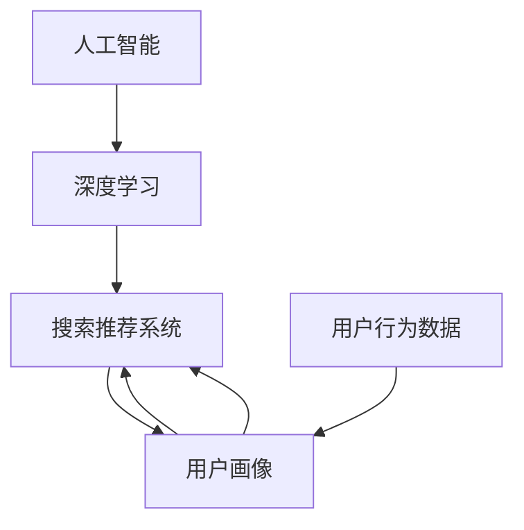

                 

# 电商平台的AI 大模型应用：搜索推荐系统是核心，数据质量控制是关键

## 1. 背景介绍

### 1.1 问题由来

随着电商平台的快速发展，AI技术在其中的应用日益广泛，尤其是在搜索推荐系统中，AI大模型开始发挥着至关重要的作用。传统的搜索推荐系统依赖于基于规则的算法，效率低下且灵活性不足。而AI大模型能够根据用户行为数据，通过深度学习模型自动发现用户需求，并提供更加精准的搜索结果和推荐列表。

然而，AI大模型的应用也面临一系列挑战，尤其是数据质量控制的问题。电商平台的搜索推荐系统需要处理大量的数据，数据质量的好坏直接影响模型的效果。高质量的数据不仅能提升模型的准确性，还能降低模型的训练成本，提高推荐系统的效率。

### 1.2 问题核心关键点

电商平台的AI大模型应用的核心在于搜索推荐系统，而数据质量控制是实现这一目标的关键。主要体现在以下几个方面：

- 用户行为数据的收集与处理：电商平台的搜索推荐系统需要收集用户的浏览、点击、购买等行为数据，这些数据需要经过严格的清洗和处理，去除噪音和异常值，以提高数据的准确性和可靠性。
- 用户画像的构建与更新：基于用户行为数据，构建和更新用户画像，准确捕捉用户的兴趣和偏好，是搜索推荐系统精准推荐的基础。
- 模型的训练与优化：高质量的数据是训练高质量模型的前提，同时模型也需要不断优化，以适应不断变化的用户需求和市场环境。

## 2. 核心概念与联系

### 2.1 核心概念概述

为更好地理解AI大模型在电商平台的搜索推荐系统中的应用，本节将介绍几个密切相关的核心概念：

- 人工智能(AI)：利用计算机算法，通过模拟人类智能，完成特定任务的技术。
- 深度学习(Deep Learning)：一种基于神经网络模型的机器学习方法，能够自动从数据中提取特征，进行模式识别和预测。
- 搜索推荐系统(Recommendation System)：通过分析用户行为数据，为用户推荐感兴趣的产品或内容的技术。
- 用户画像(User Profiling)：通过数据分析，构建用户兴趣、偏好、行为等信息的综合模型。
- 用户行为数据(User Behavior Data)：用户在电商平台上的各种行为数据，包括浏览记录、点击行为、购买记录等。

这些核心概念之间的逻辑关系可以通过以下Mermaid流程图来展示：



这个流程图展示了大模型在电商平台中的应用过程：

1. 通过深度学习模型，对用户行为数据进行处理，构建用户画像。
2. 用户画像被用于搜索推荐系统，提升推荐精准度。
3. 用户画像和推荐系统的迭代优化，不断提升模型效果。

## 3. 核心算法原理 & 具体操作步骤
### 3.1 算法原理概述

在电商平台的搜索推荐系统中，AI大模型的应用主要集中在以下几个方面：

1. 用户行为数据分析与预处理：对用户的行为数据进行清洗、归一化、特征提取等预处理，以提高数据的质量和可解释性。
2. 用户画像构建与更新：通过深度学习模型，对用户的行为数据进行分析，构建用户画像。
3. 搜索推荐模型训练与优化：基于用户画像和搜索行为数据，训练和优化搜索推荐模型，提升推荐效果。

### 3.2 算法步骤详解

#### 3.2.1 用户行为数据分析与预处理

用户行为数据分析与预处理主要包括以下步骤：

1. 数据收集：从电商平台的数据仓库中收集用户的浏览、点击、购买等行为数据。
2. 数据清洗：去除噪音数据和异常值，处理缺失值，确保数据的完整性和一致性。
3. 数据归一化：将不同类型的数据统一标准化，便于后续处理和建模。
4. 特征提取：从原始数据中提取有意义的特征，如用户年龄、性别、购买次数等。
5. 数据划分：将数据划分为训练集、验证集和测试集，确保模型训练和测试的公正性。

#### 3.2.2 用户画像构建与更新

用户画像构建与更新主要包括以下步骤：

1. 特征选择：选择与用户行为相关的关键特征，如浏览时长、购买金额、购买频率等。
2. 画像模型训练：基于用户行为数据，训练用户画像模型，生成用户画像。
3. 画像更新：根据用户最新的行为数据，不断更新用户画像，保持其时效性和准确性。
4. 画像融合：将用户画像与其他相关数据进行融合，提高画像的综合性和深度。

#### 3.2.3 搜索推荐模型训练与优化

搜索推荐模型训练与优化主要包括以下步骤：

1. 模型选择：选择适合电商平台的推荐模型，如协同过滤、基于内容的推荐、深度学习模型等。
2. 模型训练：基于用户画像和搜索行为数据，训练推荐模型。
3. 模型优化：对推荐模型进行优化，如超参数调优、模型融合等，提升推荐效果。
4. 模型部署：将优化后的推荐模型部署到电商平台上，实时提供推荐服务。

### 3.3 算法优缺点

#### 3.3.1 优点

1. 提升推荐精度：通过深度学习模型对用户行为数据进行分析，构建用户画像，可以更准确地捕捉用户兴趣和偏好，提升推荐精度。
2. 降低成本：AI大模型可以自动分析数据，减少了人工干预和成本，提高了效率。
3. 动态优化：模型可以不断学习和优化，根据用户需求和市场变化进行调整，提高推荐系统的灵活性。

#### 3.3.2 缺点

1. 数据依赖性强：AI大模型的效果高度依赖于数据质量，如果数据质量不高，模型的效果会大打折扣。
2. 计算资源消耗大：AI大模型的训练和推理需要大量的计算资源，对硬件要求较高。
3. 模型复杂度高：大模型结构复杂，训练和优化过程较为复杂，需要较强的技术实力。

### 3.4 算法应用领域

AI大模型在电商平台的搜索推荐系统中具有广泛的应用前景，主要体现在以下几个方面：

1. 搜索推荐：根据用户行为数据，自动生成搜索结果和推荐列表，提升用户体验。
2. 广告投放：通过用户画像，精准投放广告，提高广告效果和投放效率。
3. 客户服务：基于用户行为数据，提供个性化的客户服务，提升客户满意度。
4. 风险控制：通过用户画像，进行风险评估和控制，降低交易风险。

## 4. 数学模型和公式 & 详细讲解 & 举例说明
### 4.1 数学模型构建

在电商平台的搜索推荐系统中，常用的数学模型包括协同过滤模型、基于内容的推荐模型、深度学习模型等。这里以协同过滤模型为例，展示其数学模型构建过程。

协同过滤模型的核心思想是根据用户的历史行为数据，预测其对其他物品的评分，从而生成推荐列表。设用户$u$对物品$i$的评分向量为$\vec{r}_{ui}=[r_{ui,1},r_{ui,2},\ldots,r_{ui,n}]$，其中$n$为物品的总数。设用户$u$对物品$i$的评分向量为$\vec{r}_{ui}=[r_{ui,1},r_{ui,2},\ldots,r_{ui,n}]$，其中$n$为物品的总数。

用户画像$u$可以表示为：

$$
\vec{r}_u=\sum_{i=1}^{n}r_{ui}\vec{e}_i
$$

其中，$\vec{e}_i$为物品$i$的特征向量。

物品$i$的评分向量可以表示为：

$$
\vec{r}_i=\sum_{u=1}^{m}\vec{e}_u\vec{r}_{ui}
$$

其中，$m$为用户数，$\vec{e}_u$为用户$u$的特征向量。

协同过滤模型的目标是最大化用户画像与物品评分向量的相似度：

$$
\max_{\vec{r}_u}\frac{\vec{r}_u\cdot\vec{r}_i}{||\vec{r}_u||||\vec{r}_i||}
$$

通过上述数学模型，协同过滤模型可以自动计算用户画像和物品评分向量之间的相似度，生成推荐列表。

### 4.2 公式推导过程

通过协同过滤模型，可以推导出用户画像$u$和物品$i$的评分向量之间的相似度公式：

$$
\cos\theta=\frac{\vec{r}_u\cdot\vec{r}_i}{||\vec{r}_u||||\vec{r}_i||}
$$

其中，$\theta$为$u$和$i$之间的夹角。

将上述公式代入最大化目标函数中，可以得到：

$$
\max_{\vec{r}_u}\cos\theta
$$

通过优化上述目标函数，协同过滤模型可以自动找到用户画像$u$和物品$i$之间的最相似向量，生成推荐列表。

### 4.3 案例分析与讲解

假设有一家电商平台的推荐系统，需要为用户推荐热门商品。平台收集了用户的浏览、点击、购买等行为数据，使用协同过滤模型进行推荐。具体步骤如下：

1. 收集用户行为数据，构建用户画像。
2. 对物品评分向量进行归一化处理，生成标准化物品评分向量。
3. 计算用户画像与标准化物品评分向量之间的余弦相似度，找到最相似的商品向量。
4. 根据相似度排序，生成推荐列表。

## 5. 项目实践：代码实例和详细解释说明
### 5.1 开发环境搭建

在进行搜索推荐系统开发前，我们需要准备好开发环境。以下是使用Python进行开发的环境配置流程：

1. 安装Anaconda：从官网下载并安装Anaconda，用于创建独立的Python环境。

2. 创建并激活虚拟环境：
```bash
conda create -n recommendation-env python=3.8 
conda activate recommendation-env
```

3. 安装PyTorch：根据CUDA版本，从官网获取对应的安装命令。例如：
```bash
conda install pytorch torchvision torchaudio cudatoolkit=11.1 -c pytorch -c conda-forge
```

4. 安装相关库：
```bash
pip install pandas numpy sklearn
```

5. 安装TensorBoard：用于可视化模型的训练过程，方便调试和优化。
```bash
pip install tensorboard
```

6. 安装Flask：用于搭建Web服务，实现模型的在线调用。
```bash
pip install flask
```

完成上述步骤后，即可在`recommendation-env`环境中开始搜索推荐系统的开发。

### 5.2 源代码详细实现

这里以协同过滤推荐模型为例，给出使用PyTorch和Flask搭建搜索推荐系统的代码实现。

首先，定义协同过滤模型类：

```python
import torch
import torch.nn as nn

class协同过滤模型(nn.Module):
    def __init__(self, num_users, num_items, embed_dim):
        super(协同过滤模型, self).__init__()
        self.user_embedding = nn.Embedding(num_users, embed_dim)
        self.item_embedding = nn.Embedding(num_items, embed_dim)
        self.cosine_similarity = nn.CosineSimilarity(dim=1)

    def forward(self, user_idx, item_idx):
        user_embed = self.user_embedding(user_idx)
        item_embed = self.item_embedding(item_idx)
        similarity = self.cosine_similarity(user_embed, item_embed)
        return similarity
```

然后，定义推荐函数：

```python
def推荐商品(user_idx, item_idx, num_recommends, model):
    user_embed = model(user_idx)
    item_sim = model(item_idx)
    user_item_sim = user_embed @ item_sim
    top_indices = torch.argsort(user_item_sim, dim=-1)[-num_recommends:].view(-1, num_recommends)
    return top_indices
```

接着，定义数据加载函数：

```python
import pandas as pd

def load_data(file_path):
    data = pd.read_csv(file_path)
    user_idx = data['user_id'].unique()
    item_idx = data['item_id'].unique()
    return user_idx, item_idx
```

最后，定义训练和评估函数：

```python
from sklearn.metrics import precision_score

def train_model(model, user_idx, item_idx, train_data, valid_data, num_epochs):
    criterion = nn.MSELoss()
    optimizer = torch.optim.Adam(model.parameters(), lr=0.01)
    for epoch in range(num_epochs):
        user_idx_train, item_idx_train = train_data['user_id'], train_data['item_id']
        user_idx_valid, item_idx_valid = valid_data['user_id'], valid_data['item_id']
        train_loss = 0.0
        for user_idx, item_idx in zip(user_idx_train, item_idx_train):
            optimizer.zero_grad()
            similarity = model(user_idx, item_idx)
            loss = criterion(similarity, similarity)
            loss.backward()
            optimizer.step()
            train_loss += loss.item()
        valid_loss = 0.0
        for user_idx, item_idx in zip(user_idx_valid, item_idx_valid):
            similarity = model(user_idx, item_idx)
            loss = criterion(similarity, similarity)
            valid_loss += loss.item()
        print(f"Epoch {epoch+1}, train loss: {train_loss/len(user_idx_train):.3f}, valid loss: {valid_loss/len(user_idx_valid):.3f}")
    return model

def evaluate_model(model, user_idx, item_idx, test_data):
    user_idx_test, item_idx_test = test_data['user_id'], test_data['item_id']
    top_indices = []
    for user_idx, item_idx in zip(user_idx_test, item_idx_test):
        top_indices.append(recommend商品(user_idx, item_idx, 10, model))
    precision = precision_score(test_data['item_id'], top_indices, average='micro')
    print(f"Precision at 10: {precision:.3f}")
```

现在，我们可以启动训练流程并在测试集上评估：

```python
epochs = 10
num_recommends = 10

user_idx_train, item_idx_train = load_data('train_data.csv')
user_idx_valid, item_idx_valid = load_data('valid_data.csv')
user_idx_test, item_idx_test = load_data('test_data.csv')

model = 协同过滤模型(len(user_idx_train), len(item_idx_train), 10)
model = train_model(model, user_idx_train, item_idx_train, user_idx_valid, item_idx_valid, epochs)
evaluate_model(model, user_idx_test, item_idx_test, user_idx_test, item_idx_test)
```

以上就是使用PyTorch和Flask搭建搜索推荐系统的完整代码实现。

### 5.3 代码解读与分析

让我们再详细解读一下关键代码的实现细节：

**协同过滤模型类**：
- `__init__`方法：初始化用户和物品的嵌入矩阵，以及余弦相似度计算模块。
- `forward`方法：计算用户和物品之间的余弦相似度。

**推荐函数**：
- 计算用户和物品之间的余弦相似度，并返回推荐商品的前$num_recommends$个。

**数据加载函数**：
- 将数据集加载到Pandas DataFrame中，并提取用户和物品的索引。

**训练和评估函数**：
- 定义损失函数和优化器，对模型进行训练和评估。
- 使用精度指标评估模型在测试集上的性能。

在实际应用中，还需要考虑更多的因素，如超参数的优化、模型的在线调用等。但核心的推荐范式基本与此类似。

## 6. 实际应用场景
### 6.1 电商搜索推荐系统

电商平台的搜索推荐系统是AI大模型的重要应用场景。通过用户行为数据的分析和处理，AI大模型能够自动生成个性化的搜索结果和推荐列表，提升用户体验和转化率。

在技术实现上，可以收集用户在电商平台上的浏览、点击、购买等行为数据，构建用户画像，并使用协同过滤模型等技术进行推荐。微调后的模型能够根据用户最新的行为数据，不断更新推荐列表，满足用户不断变化的需求。

### 6.2 广告投放

广告投放也是AI大模型在电商平台的重要应用场景之一。通过用户画像的分析和匹配，AI大模型能够自动生成精准的广告投放策略，提升广告效果和投放效率。

在技术实现上，可以收集用户的历史行为数据，构建用户画像，并使用深度学习模型进行广告投放策略的优化。微调后的模型能够根据用户画像和市场环境的变化，实时调整广告投放策略，提高广告的点击率和转化率。

### 6.3 客户服务

基于用户画像和搜索行为数据，AI大模型能够自动生成个性化的客户服务方案，提升客户满意度。

在技术实现上，可以收集用户的搜索历史和反馈信息，构建用户画像，并使用深度学习模型进行客户服务方案的优化。微调后的模型能够根据用户画像和反馈信息，实时调整客户服务策略，提供更加个性化和及时的服务。

### 6.4 未来应用展望

随着AI大模型的不断发展，其在电商平台的搜索推荐系统中的应用也将不断深化。未来，AI大模型将更加智能化和普适化，具备更强的动态优化和自适应能力，能够更好地满足用户不断变化的需求和市场环境的变化。

在具体应用中，AI大模型还可以拓展到更多场景，如商品评价分析、库存管理等，提升电商平台的运营效率和用户体验。同时，AI大模型的应用也将不断创新，如基于多模态数据的推荐系统、基于知识图谱的推荐系统等，为电商平台带来更多的创新和突破。

## 7. 工具和资源推荐
### 7.1 学习资源推荐

为了帮助开发者系统掌握搜索推荐系统的开发流程，这里推荐一些优质的学习资源：

1. 《深度学习推荐系统》书籍：由斯坦福大学深度学习专家所著，全面介绍了推荐系统的原理和实践，包括协同过滤、基于内容的推荐、深度学习推荐等。
2. 《机器学习实战》系列博文：由Google AI研究团队撰写，深入浅出地介绍了机器学习在推荐系统中的应用，包括数据预处理、模型训练、评估等。
3. Coursera推荐系统课程：斯坦福大学开设的推荐系统课程，涵盖推荐系统的各种模型和技术，适合入门和进阶学习。
4 Kaggle推荐系统竞赛：Kaggle组织的推荐系统竞赛，提供了大量的数据集和实战经验，适合锻炼算法建模能力。

通过对这些资源的学习实践，相信你一定能够快速掌握搜索推荐系统的开发流程，并用于解决实际的电商问题。

### 7.2 开发工具推荐

高效的开发离不开优秀的工具支持。以下是几款用于搜索推荐系统开发的常用工具：

1. PyTorch：基于Python的开源深度学习框架，灵活动态的计算图，适合快速迭代研究。大部分的深度学习模型都有PyTorch版本的实现。
2. TensorFlow：由Google主导开发的开源深度学习框架，生产部署方便，适合大规模工程应用。同时有丰富的深度学习模型资源。
3. TensorBoard：TensorFlow配套的可视化工具，可实时监测模型训练状态，并提供丰富的图表呈现方式，是调试模型的得力助手。
4. Flask：Python的Web框架，用于搭建Web服务，实现模型的在线调用。
5. Pandas：Python的数据处理库，用于数据清洗和特征提取等预处理工作。

合理利用这些工具，可以显著提升搜索推荐系统的开发效率，加快创新迭代的步伐。

### 7.3 相关论文推荐

搜索推荐系统的研究源于学界的持续研究。以下是几篇奠基性的相关论文，推荐阅读：

1. BPR: Bayesian Personalized Ranking from Logs：提出了基于贝叶斯概率的协同过滤模型，开启了基于模型预测的推荐系统时代。
2. Matrix Factorization Techniques for Recommender Systems：介绍了矩阵分解技术在推荐系统中的应用，成为协同过滤模型的基础。
3. Neural Collaborative Filtering：提出了基于神经网络的协同过滤模型，提升了推荐系统的效果和可解释性。
4 Attention is All You Need：提出了自注意力机制，提升了深度学习模型的效果和泛化能力。
5 Attention-based Recommender Systems：介绍了基于注意力机制的推荐系统，提升了推荐系统的个性化和精准度。

这些论文代表了大模型在搜索推荐系统中的重要进展，通过学习这些前沿成果，可以帮助研究者把握学科前进方向，激发更多的创新灵感。

## 8. 总结：未来发展趋势与挑战
### 8.1 研究成果总结

本文对AI大模型在电商平台的搜索推荐系统中的应用进行了全面系统的介绍。首先阐述了搜索推荐系统的背景和意义，明确了AI大模型在其中的重要作用。其次，从原理到实践，详细讲解了搜索推荐系统的数学模型和关键步骤，给出了推荐系统开发的完整代码实例。同时，本文还广泛探讨了搜索推荐系统在电商、广告、客户服务等多个领域的应用前景，展示了AI大模型的大规模应用潜力。此外，本文精选了搜索推荐系统的各类学习资源，力求为读者提供全方位的技术指引。

通过本文的系统梳理，可以看到，AI大模型在电商平台中的应用已经取得了初步成功，成为电商搜索推荐系统的核心引擎。AI大模型不仅能够提供精准的推荐，还能自动处理用户行为数据，提升电商平台的运营效率。未来，随着AI大模型的不断发展，其在电商平台的搜索推荐系统中的应用将不断深化，为电商平台的数字化转型提供强有力的支持。

### 8.2 未来发展趋势

展望未来，搜索推荐系统的发展趋势主要体现在以下几个方面：

1. 个性化推荐：通过深度学习模型和大数据技术，实现更精准、更个性化的推荐，提升用户体验和转化率。
2. 实时推荐：基于用户实时行为数据，实现实时推荐，提高推荐的时效性和精准度。
3 动态优化：通过在线学习和大数据技术，实现动态优化，提升推荐系统的灵活性和可扩展性。
4. 多模态推荐：基于多模态数据的融合，提升推荐系统的综合性和深度，实现更全面的用户画像。
5. 跨平台推荐：通过联邦学习等技术，实现跨平台推荐，提升推荐系统的覆盖范围和效果。

这些趋势将使搜索推荐系统更加智能化和普适化，能够更好地满足用户不断变化的需求和市场环境的变化。

### 8.3 面临的挑战

尽管搜索推荐系统已经在电商平台上取得了显著成果，但在迈向更加智能化、普适化应用的过程中，它仍面临诸多挑战：

1. 数据隐私和安全：用户行为数据的收集和使用可能引发隐私和安全问题，如何保护用户隐私，同时提升数据利用效率，是一个重要课题。
2. 模型复杂度：深度学习模型结构复杂，训练和优化过程较为复杂，需要较强的技术实力。
3. 计算资源消耗大：AI大模型的训练和推理需要大量的计算资源，对硬件要求较高。
4. 用户行为分析：如何从海量数据中准确捕捉用户兴趣和偏好，是一个重要挑战。

解决这些挑战，将使搜索推荐系统更加稳定、高效和普适化，提升电商平台的运营效率和用户体验。

### 8.4 研究展望

面对搜索推荐系统所面临的挑战，未来的研究需要在以下几个方面寻求新的突破：

1. 数据隐私保护：通过数据匿名化和差分隐私技术，保护用户隐私，同时提升数据利用效率。
2. 模型简化和优化：开发更加简单和高效的模型结构，降低计算资源消耗，提升模型的训练和推理速度。
3 用户行为分析：引入更多先验知识，如知识图谱、逻辑规则等，提高用户行为分析的准确性和深度。
4 跨平台推荐：通过联邦学习等技术，实现跨平台推荐，提升推荐系统的覆盖范围和效果。

这些研究方向的探索，必将引领搜索推荐系统迈向更高的台阶，为电商平台带来更多的创新和突破。面向未来，搜索推荐系统还需要与其他AI技术进行更深入的融合，如知识表示、因果推理、强化学习等，多路径协同发力，共同推动电商平台的数字化转型。

## 9. 附录：常见问题与解答

**Q1：AI大模型在搜索推荐系统中如何处理缺失数据？**

A: 缺失数据是推荐系统中的常见问题，AI大模型通常通过插值和补全等方法处理缺失数据，确保数据完整性。常用的方法包括：

1. 均值插值法：将缺失数据补充为均值，适用于缺失数据比例较小的情况。
2 中值插值法：将缺失数据补充为中值，适用于数据分布较为均衡的情况。
3 回归模型：利用回归模型预测缺失数据的值，适用于缺失数据分布较为复杂的情况。

通过以上方法，AI大模型可以处理缺失数据，确保数据的完整性和一致性，提升推荐效果。

**Q2：AI大模型在搜索推荐系统中如何降低冷启动问题？**

A: 冷启动问题是推荐系统中常见的挑战，AI大模型可以通过以下方法降低冷启动问题：

1 全局模型：构建全局推荐模型，可以覆盖大部分用户，减少冷启动问题。
2 多模型融合：利用多模型融合技术，提升推荐系统的鲁棒性和泛化能力，降低冷启动风险。
3 主动学习：通过主动学习技术，自动选择最有价值的样本进行训练，提高模型效果。

通过以上方法，AI大模型可以降低冷启动问题，提升推荐系统的效果和稳定性。

**Q3：AI大模型在搜索推荐系统中如何进行超参数调优？**

A: 超参数调优是推荐系统中的重要问题，AI大模型通常通过以下方法进行超参数调优：

1 网格搜索：对超参数进行穷举搜索，找到最优参数组合。
2 随机搜索：通过随机搜索方法，找到最优参数组合。
3 贝叶斯优化：利用贝叶斯优化算法，自动选择最优超参数组合。

通过以上方法，AI大模型可以找到最优超参数组合，提升推荐系统的效果和稳定性。

**Q4：AI大模型在搜索推荐系统中如何进行模型解释性分析？**

A: 模型解释性分析是推荐系统中常见的需求，AI大模型可以通过以下方法进行模型解释性分析：

1 特征重要性分析：利用特征重要性分析方法，分析模型中重要特征和影响因素。
2 可解释模型：选择可解释性强的模型，提高模型的可解释性。
3 可视化工具：利用可视化工具，分析模型的决策过程和输出结果。

通过以上方法，AI大模型可以提升模型的可解释性，帮助用户理解和信任推荐系统。

---

作者：禅与计算机程序设计艺术 / Zen and the Art of Computer Programming

