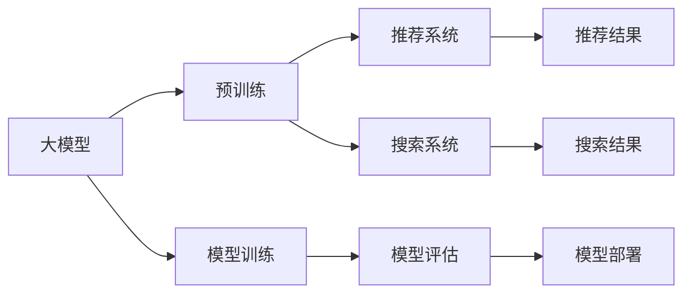

                 

# 电商平台的AI 大模型应用：搜索推荐系统是核心，数据质量是关键

## 1. 背景介绍

随着人工智能技术的快速发展，电商平台利用AI模型进行智能化决策和推荐，已成为提升用户体验、提高运营效率的重要手段。AI大模型的应用不仅包括传统的推荐系统，还扩展到智能搜索、广告投放、库存管理等多个环节。在这些应用场景中，搜索推荐系统无疑是核心。然而，要充分发挥大模型的效能，数据质量显得至关重要。本文将深入探讨AI大模型在电商平台搜索推荐系统中的应用，剖析数据质量在模型训练和应用中的关键作用。

## 2. 核心概念与联系

### 2.1 核心概念概述

为更好地理解大模型在电商平台搜索推荐系统中的应用，本节将介绍几个核心概念：

- **大模型**：以Transformer为基础的深度学习模型，如BERT、GPT、DALL·E等。通过在大规模无标签文本语料上预训练，学习丰富的语言表示，具备强大的自然语言理解与生成能力。

- **推荐系统**：利用用户的历史行为数据，为每个用户生成个性化推荐，提升用户满意度与平台收益。

- **搜索系统**：通过理解用户的查询意图，快速返回最相关的搜索结果，提升用户体验与平台流量。

- **数据质量**：指数据集在准确性、完整性、一致性、及时性等方面的优秀程度，是构建优质推荐与搜索系统的基础。

- **模型训练**：利用标注数据对预训练模型进行微调，使其适应特定的业务需求。

- **模型评估**：对训练好的模型进行性能评估，确保其有效性与可靠性。

- **模型部署**：将训练好的模型部署到线上环境，进行实时推荐与搜索。

这些核心概念通过以下Mermaid流程图呈现其联系：



从图中可以看出，大模型在预训练和微调后，能够应用于推荐系统和搜索系统，通过模型评估和部署实现实时推荐与搜索。数据质量作为模型训练的基础，直接影响模型的训练效果与最终应用的表现。

### 2.2 核心概念原理和架构

- **大模型原理**：大模型通过自监督学习在大规模无标签文本上预训练，学习到语言表示。预训练过程包括自回归、掩码语言模型、句子相似性任务等。预训练后的模型通过下游任务的微调，能够适应特定的业务需求，如图像描述生成、文本分类、命名实体识别等。

- **推荐系统原理**：推荐系统通常基于协同过滤、内容过滤、混合推荐等多种算法。协同过滤算法通过用户与物品的交互矩阵，利用相似性度量推荐物品；内容过滤算法基于物品特征与用户偏好的匹配，推荐相似物品；混合推荐则将多种算法组合使用，提升推荐效果。

- **搜索系统原理**：搜索系统通常采用倒排索引、向量空间模型、深度学习等技术。倒排索引将关键词与文档进行关联，快速返回相关文档；向量空间模型将文本表示为向量，利用余弦相似度计算相关性；深度学习模型通过语义表示学习，提升搜索相关性。

- **数据质量原理**：数据质量包括数据的准确性、完整性、一致性、及时性等。准确性指数据的正确性；完整性指数据的全面性；一致性指数据各维度的协调性；及时性指数据的更新频率。数据质量直接影响模型的训练效果，数据质量越高，模型的预测性能越好。

## 3. 核心算法原理 & 具体操作步骤

### 3.1 算法原理概述

在电商平台中，搜索推荐系统主要通过大模型进行个性化推荐和搜索结果排序。具体来说，推荐系统会根据用户的历史行为数据，对每个用户进行画像建模，通过模型预测用户对每个物品的评分，选择评分高的物品进行推荐。搜索系统则通过理解用户的查询意图，快速返回相关搜索结果。

算法原理包括以下几个关键步骤：

1. **数据预处理**：清洗并标准化原始数据，生成用于模型训练的样本。
2. **模型训练**：利用标注数据对大模型进行微调，训练出适应特定业务需求的推荐与搜索模型。
3. **模型评估**：在验证集上评估模型的预测效果，选择性能最佳的模型。
4. **模型部署**：将训练好的模型部署到线上环境，进行实时推荐与搜索。

### 3.2 算法步骤详解

#### 3.2.1 数据预处理

数据预处理是构建优质推荐与搜索系统的基础。主要包括以下步骤：

- **数据清洗**：去除重复数据、缺失值、异常值等，确保数据质量。
- **特征提取**：从原始数据中提取有意义的特征，如用户ID、物品ID、评分、评论等。
- **数据标准化**：对不同特征进行标准化处理，确保数据在同一尺度下进行比较。

#### 3.2.2 模型训练

模型训练是利用标注数据对大模型进行微调的过程。主要包括以下步骤：

- **选择模型**：选择适合电商平台推荐与搜索任务的大模型，如BERT、GPT、DALL·E等。
- **数据划分**：将数据集划分为训练集、验证集和测试集。
- **微调模型**：利用训练集对大模型进行微调，调整模型参数，使其适应特定业务需求。
- **学习率调整**：设置合适的学习率，避免模型过拟合或欠拟合。
- **正则化**：应用L2正则、Dropout等技术，防止模型过拟合。

#### 3.2.3 模型评估

模型评估是评估训练好的模型性能的过程。主要包括以下步骤：

- **选择评估指标**：选择适合推荐与搜索任务的评估指标，如准确率、召回率、F1分数等。
- **评估模型**：在验证集上评估模型的预测效果，选择性能最佳的模型。
- **调整参数**：根据评估结果调整模型参数，进一步提升模型性能。

#### 3.2.4 模型部署

模型部署是将训练好的模型应用到线上环境的过程。主要包括以下步骤：

- **模型封装**：将模型封装成标准化接口，便于线上调用。
- **性能优化**：对模型进行性能优化，提升推荐与搜索速度。
- **实时监控**：对模型进行实时监控，确保其稳定运行。

### 3.3 算法优缺点

大模型在电商平台搜索推荐系统中的应用具有以下优点：

- **泛化能力强**：大模型通过大规模预训练学习到丰富的语言表示，能够适应多种业务需求。
- **可解释性强**：大模型通过逐层解码，能够解释其预测过程，增强模型的可解释性。
- **实时推荐与搜索**：大模型能够实时响应用户查询，提供个性化推荐与搜索结果。

然而，大模型也存在一些缺点：

- **计算资源需求高**：大模型通常具有亿级参数，需要高性能计算资源进行训练和推理。
- **数据质量要求高**：大模型的泛化能力依赖于数据质量，数据质量差会导致模型性能下降。
- **模型复杂度高**：大模型的复杂度高，需要复杂的算法进行训练和优化。

### 3.4 算法应用领域

大模型在电商平台搜索推荐系统中的应用已经广泛应用于多个领域，例如：

- **个性化推荐**：利用用户历史行为数据，对用户进行画像建模，生成个性化推荐。
- **搜索结果排序**：利用大模型理解查询意图，对搜索结果进行排序，提升搜索相关性。
- **广告投放**：利用大模型对广告进行个性化投放，提高广告点击率与转化率。
- **库存管理**：利用大模型预测热门商品需求，优化库存管理。
- **情感分析**：利用大模型对用户评论进行情感分析，优化产品设计与客服服务。

## 4. 数学模型和公式 & 详细讲解 & 举例说明

### 4.1 数学模型构建

大模型在电商平台中的应用主要基于深度学习框架，如PyTorch、TensorFlow等。数学模型构建包括以下几个关键步骤：

- **数据表示**：将原始数据转换为模型可处理的张量形式。
- **模型定义**：定义模型的结构与参数，如编码器、解码器、注意力机制等。
- **损失函数**：定义模型训练的损失函数，如交叉熵损失、均方误差损失等。
- **优化器**：定义优化器的参数，如AdamW、SGD等。

### 4.2 公式推导过程

以下以推荐系统为例，推导大模型进行个性化推荐的基本公式。

假设用户-物品评分矩阵为 $R_{m \times n}$，用户嵌入矩阵为 $U_{m \times d}$，物品嵌入矩阵为 $V_{n \times d}$，模型预测用户对物品的评分矩阵为 $\hat{R}_{m \times n}$。推荐系统的目标是最小化预测评分与实际评分之间的误差，即：

$$
\min_{U,V} \frac{1}{m} \sum_{i=1}^{m} \sum_{j=1}^{n} (\hat{R}_{ij} - R_{ij})^2
$$

其中，$U$ 和 $V$ 为模型参数，$d$ 为嵌入维度。利用梯度下降优化算法，得到模型参数的更新公式：

$$
U \leftarrow U - \eta \nabla_{U} \frac{1}{m} \sum_{i=1}^{m} \sum_{j=1}^{n} (\hat{R}_{ij} - R_{ij})^2
$$
$$
V \leftarrow V - \eta \nabla_{V} \frac{1}{m} \sum_{i=1}^{m} \sum_{j=1}^{n} (\hat{R}_{ij} - R_{ij})^2
$$

其中，$\eta$ 为学习率，$\nabla_{U}$ 和 $\nabla_{V}$ 分别为 $U$ 和 $V$ 的梯度。

### 4.3 案例分析与讲解

#### 4.3.1 协同过滤推荐

协同过滤推荐是推荐系统中最基本的方法之一，分为用户-物品协同过滤和物品-物品协同过滤两种类型。

用户-物品协同过滤假设用户对物品的评分具有局部性，即相似用户对相似物品的评分相似。通过计算用户间的相似性，生成个性化推荐。例如，基于余弦相似度的推荐公式如下：

$$
\text{similarity}(u_i, u_j) = \frac{\sum_{k=1}^{d} u_{ik} \cdot u_{jk}}{\sqrt{\sum_{k=1}^{d} u_{ik}^2} \cdot \sqrt{\sum_{k=1}^{d} u_{jk}^2}}
$$

其中，$u_i$ 和 $u_j$ 为用户的嵌入向量。

物品-物品协同过滤假设物品间评分具有局部性，即相似物品对相似用户的评分相似。通过计算物品间的相似性，生成个性化推荐。例如，基于余弦相似度的推荐公式如下：

$$
\text{similarity}(i_j, i_k) = \frac{\sum_{k=1}^{d} v_{ik} \cdot v_{jk}}{\sqrt{\sum_{k=1}^{d} v_{ik}^2} \cdot \sqrt{\sum_{k=1}^{d} v_{jk}^2}}
$$

其中，$v_i$ 和 $v_j$ 为物品的嵌入向量。

#### 4.3.2 基于内容的推荐

基于内容的推荐是利用物品特征与用户偏好的匹配，生成个性化推荐。例如，基于向量空间模型的推荐公式如下：

$$
\text{similarity}(i_j, i_k) = \frac{\vec{i_j} \cdot \vec{i_k}}{\|\vec{i_j}\| \cdot \|\vec{i_k}\|}
$$

其中，$\vec{i_j}$ 为物品的特征向量。

## 5. 项目实践：代码实例和详细解释说明

### 5.1 开发环境搭建

在进行搜索推荐系统开发前，需要准备好开发环境。以下是使用Python进行TensorFlow开发的环境配置流程：

1. 安装Anaconda：从官网下载并安装Anaconda，用于创建独立的Python环境。

2. 创建并激活虚拟环境：
```bash
conda create -n tf-env python=3.8 
conda activate tf-env
```

3. 安装TensorFlow：从官网获取对应的安装命令。例如：
```bash
pip install tensorflow==2.7
```

4. 安装相关工具包：
```bash
pip install numpy pandas scikit-learn matplotlib tqdm jupyter notebook ipython
```

完成上述步骤后，即可在`tf-env`环境中开始搜索推荐系统的开发。

### 5.2 源代码详细实现

我们以基于协同过滤的推荐系统为例，给出使用TensorFlow进行推荐模型训练的代码实现。

```python
import tensorflow as tf
from tensorflow.keras.layers import Embedding, Dot, Dense, Flatten
from tensorflow.keras.models import Model

# 定义用户-物品评分矩阵
R = tf.random.normal([1000, 1000]) # 用户ID:1000, 物品ID:1000
R = tf.abs(R) # 将评分矩阵转变为非负值

# 定义用户嵌入矩阵
U = tf.random.normal([1000, 100]) # 用户ID:1000, 嵌入维度:100

# 定义物品嵌入矩阵
V = tf.random.normal([1000, 100]) # 物品ID:1000, 嵌入维度:100

# 定义模型结构
input_user = tf.keras.layers.Input(shape=(100,))
input_item = tf.keras.layers.Input(shape=(100,))
dot = Dot(axes=(1, 1))(input_user, input_item) # 计算用户与物品的相似度
dense = Dense(1, activation='sigmoid')(dot) # 将相似度转化为评分
model = Model(inputs=[input_user, input_item], outputs=dense)

# 定义优化器
optimizer = tf.keras.optimizers.Adam(learning_rate=0.001)

# 定义损失函数
loss_fn = tf.keras.losses.MeanSquaredError()

# 定义训练过程
def train(model, dataset):
    for epoch in range(10):
        for batch in dataset:
            input_user_batch = batch[:, 0:100]
            input_item_batch = batch[:, 100:200]
            target_batch = batch[:, 200:]
            with tf.GradientTape() as tape:
                y_pred = model([input_user_batch, input_item_batch])
                loss = loss_fn(target_batch, y_pred)
            grads = tape.gradient(loss, model.trainable_variables)
            optimizer.apply_gradients(zip(grads, model.trainable_variables))

# 数据集
dataset = tf.random.normal([1000, 300]) # 用户ID:1000, 物品ID:1000, 评分:300
dataset = tf.concat([dataset[:, :100], dataset[:, 100:200], dataset[:, 200:]], axis=1) # 拼接用户ID、物品ID和评分

# 训练模型
train(model, dataset)

# 预测推荐结果
test_user = tf.random.normal([100])
test_item = tf.random.normal([100])
y_pred = model([test_user, test_item])
print(y_pred)
```

### 5.3 代码解读与分析

让我们再详细解读一下关键代码的实现细节：

**推荐模型结构定义**：
- 使用`tf.keras.layers`定义用户和物品的嵌入层，其中`Embedding`层用于将用户ID和物品ID转换为向量表示。
- 使用`Dot`层计算用户和物品的相似度。
- 使用`Dense`层将相似度转化为评分。
- 使用`Model`层将输入和输出层连接起来，构建推荐模型。

**训练过程**：
- 使用`tf.keras.optimizers.Adam`定义优化器。
- 使用`tf.keras.losses.MeanSquaredError`定义损失函数。
- 在训练过程中，对于每个批次数据，先计算模型的预测评分，再计算损失函数，最后使用`tape.gradient`计算梯度，并使用`optimizer.apply_gradients`更新模型参数。

**数据集定义**：
- 定义用户ID、物品ID和评分矩阵。
- 将数据集拼接为用户ID、物品ID和评分，作为模型的输入。
- 定义训练过程，对模型进行10次迭代训练。

通过代码实现的推荐系统，可以帮助理解推荐模型构建的基本流程。实际应用中，还需要考虑更复杂的推荐算法和模型优化策略。

## 6. 实际应用场景

### 6.1 电商平台的个性化推荐

电商平台的个性化推荐系统通过大模型学习用户的历史行为数据，为用户生成个性化推荐。主要应用场景包括：

- **商品推荐**：根据用户的浏览、点击、购买等行为，推荐相关商品。
- **动态调整**：根据用户的行为变化，动态调整推荐策略，提升用户满意度。
- **实时更新**：实时更新推荐模型，适应新用户和商品的变化。

### 6.2 电商平台搜索系统的搜索结果排序

电商平台的搜索系统通过大模型理解用户查询意图，对搜索结果进行排序，提升搜索相关性。主要应用场景包括：

- **搜索排序**：根据查询意图的相似度，对搜索结果进行排序，提升搜索速度。
- **自动补全**：根据查询意图，自动补全搜索关键词，提高搜索效率。
- **搜索结果过滤**：根据用户偏好，过滤不相关搜索结果，提升用户体验。

### 6.3 电商平台广告投放

电商平台的广告投放系统通过大模型对广告进行个性化投放，提高广告点击率与转化率。主要应用场景包括：

- **广告推荐**：根据用户的行为和兴趣，推荐相关广告。
- **广告创意生成**：利用大模型生成高质量广告创意，提高广告效果。
- **广告效果评估**：利用大模型评估广告效果，优化广告投放策略。

## 7. 工具和资源推荐

### 7.1 学习资源推荐

为了帮助开发者系统掌握搜索推荐系统和大模型的相关知识，这里推荐一些优质的学习资源：

1. 《深度学习入门:基于Python的理论与实现》系列书籍：全面介绍了深度学习的基本概念和实现方法，包括推荐系统与搜索系统。

2. CS231n《深度学习计算机视觉》课程：斯坦福大学开设的计算机视觉课程，涵盖深度学习在推荐系统中的应用。

3. 《自然语言处理综论》书籍：全面介绍了自然语言处理的基本概念和实现方法，包括大模型的预训练与微调。

4. Google AI Blog：Google AI团队定期发布的博客，涵盖深度学习在电商、搜索、广告等领域的应用。

5. DeepLearning.ai：由Andrew Ng教授主导的深度学习课程，涵盖深度学习在推荐系统中的应用。

通过对这些资源的学习实践，相信你一定能够快速掌握搜索推荐系统和大模型的相关知识，并用于解决实际的NLP问题。

### 7.2 开发工具推荐

高效的开发离不开优秀的工具支持。以下是几款用于搜索推荐系统开发的常用工具：

1. TensorFlow：由Google主导开发的深度学习框架，生产部署方便，适合大规模工程应用。

2. PyTorch：基于Python的开源深度学习框架，灵活动态的计算图，适合快速迭代研究。

3. TensorFlow Serving：Google开源的模型部署框架，支持多种模型格式，便于模型服务化。

4. TensorBoard：TensorFlow配套的可视化工具，可实时监测模型训练状态，并提供丰富的图表呈现方式。

5. Weights & Biases：模型训练的实验跟踪工具，可以记录和可视化模型训练过程中的各项指标。

6. HuggingFace Transformers库：提供预训练大模型的封装和微调功能，支持多种NLP任务。

合理利用这些工具，可以显著提升搜索推荐系统的开发效率，加快创新迭代的步伐。

### 7.3 相关论文推荐

搜索推荐系统和大模型的发展源于学界的持续研究。以下是几篇奠基性的相关论文，推荐阅读：

1. Collaborative Filtering for Implicit Feedback Datasets（推荐系统基础）：提出了协同过滤推荐算法的基础原理和方法。

2. A Survey on Deep Learning Techniques for Recommender Systems（深度学习在推荐系统中的应用）：全面介绍了深度学习在推荐系统中的应用。

3. Attention Is All You Need（Transformer模型的提出）：提出了Transformer模型，开启了深度学习在大模型预训练中的应用。

4. BERT: Pre-training of Deep Bidirectional Transformers for Language Understanding（BERT模型的提出）：提出BERT模型，引入基于掩码的自监督预训练任务，刷新了多项NLP任务SOTA。

5. Deep Reinforcement Learning for Personalized Product Recommendation（强化学习在推荐系统中的应用）：提出强化学习推荐算法，利用用户反馈进行模型训练。

6. CTR: A Deep Neural Network Approach for Click-Through Rate Prediction（点击率预测）：提出了基于深度学习的点击率预测方法，提高了广告点击率。

这些论文代表了大模型搜索推荐系统的研究脉络，通过学习这些前沿成果，可以帮助研究者把握学科前进方向，激发更多的创新灵感。

## 8. 总结：未来发展趋势与挑战

### 8.1 总结

本文对基于大模型在电商平台搜索推荐系统中的应用进行了全面系统的介绍。首先阐述了大模型和推荐系统、搜索系统等核心概念的联系，明确了搜索推荐系统在大模型中的应用场景。其次，从原理到实践，详细讲解了大模型的构建、训练、评估和部署流程，给出了推荐模型构建的代码实例。同时，本文还广泛探讨了大模型在电商推荐和搜索系统中的应用前景，展示了其在电商平台中的应用价值。

通过本文的系统梳理，可以看到，大模型在电商平台搜索推荐系统中的应用已经取得了显著成效，为电商平台带来了更智能、更高效的服务体验。未来，伴随大模型和推荐系统的不断进步，电商平台将能够更好地满足用户的个性化需求，提升平台的竞争力和用户黏性。

### 8.2 未来发展趋势

展望未来，大模型在电商平台搜索推荐系统中的应用将呈现以下几个发展趋势：

1. **模型规模持续增大**：随着算力成本的下降和数据规模的扩张，预训练语言模型的参数量还将持续增长。超大规模语言模型蕴含的丰富语言知识，有望支撑更加复杂多变的推荐与搜索任务。

2. **模型泛化能力增强**：大模型的预训练与微调过程将更加智能和高效，能够更好地学习用户的行为与偏好，提升推荐与搜索的准确性。

3. **实时推荐与搜索**：基于大模型的实时推荐与搜索系统将成为主流，用户能够在极短时间内获得个性化推荐与搜索结果，提升用户体验。

4. **多模态信息融合**：利用大模型对多模态数据进行融合，如文本、图像、视频等，提升推荐与搜索的全面性和准确性。

5. **个性化推荐**：大模型能够更好地学习用户的兴趣与行为，提供更加个性化和精准的推荐。

6. **推荐与搜索优化**：利用大模型对推荐与搜索算法进行优化，提升系统性能和效率。

以上趋势凸显了大模型在电商平台搜索推荐系统中的巨大潜力。这些方向的探索发展，必将进一步提升搜索推荐系统的性能和应用范围，为电商平台带来更加智能和高效的推荐与搜索体验。

### 8.3 面临的挑战

尽管大模型在电商平台搜索推荐系统中的应用已经取得了显著成效，但在迈向更加智能化、普适化应用的过程中，它仍面临着诸多挑战：

1. **数据质量瓶颈**：尽管大模型通过大规模预训练学习到了丰富的语言知识，但数据质量直接影响模型的泛化能力和应用效果。如何获取高质量的数据，提高数据质量，是一大难题。

2. **计算资源需求高**：大模型的规模和复杂度较高，需要高性能计算资源进行训练和推理。如何在有限的计算资源下，实现高效的大模型训练与推理，是未来的研究方向。

3. **模型鲁棒性不足**：大模型在实际应用中，可能面临多种异常情况，如数据噪声、网络延迟等。如何增强模型的鲁棒性，确保模型在各种情况下都能稳定运行，是一大挑战。

4. **模型可解释性差**：大模型的复杂度高，难以解释其内部工作机制和决策逻辑。如何增强模型的可解释性，提升用户信任度，是未来的一大挑战。

5. **安全性和隐私保护**：大模型在实际应用中，可能面临数据泄露、模型滥用等风险。如何确保用户数据的安全和隐私保护，是一大挑战。

6. **跨领域适用性**：大模型在不同领域的泛化能力有限，如何增强模型在不同领域的应用效果，是一大挑战。

正视搜索推荐系统和大模型面临的这些挑战，积极应对并寻求突破，将是大模型在电商平台搜索推荐系统中的关键。相信随着学界和产业界的共同努力，这些挑战终将一一被克服，大模型将在构建人机协同的智能电商平台中扮演越来越重要的角色。

### 8.4 研究展望

面对搜索推荐系统和大模型面临的挑战，未来的研究需要在以下几个方面寻求新的突破：

1. **无监督和半监督学习**：探索无监督和半监督学习的方法，减少对标注数据的依赖，提高模型泛化能力。

2. **数据增强与数据清洗**：利用数据增强和数据清洗技术，提高数据质量，提升模型的泛化能力和准确性。

3. **多模态融合**：利用大模型对多模态数据进行融合，提高推荐与搜索的全面性和准确性。

4. **实时推荐与搜索优化**：利用实时推荐与搜索技术，提升用户体验，优化系统性能和效率。

5. **个性化推荐与搜索**：利用大模型进行个性化推荐与搜索，提升推荐与搜索的精准性和个性化程度。

6. **模型优化与加速**：利用优化算法和加速技术，提高大模型的训练和推理效率，降低计算资源需求。

7. **模型可解释性增强**：利用可解释性技术，增强模型的可解释性，提升用户信任度。

8. **安全性与隐私保护**：利用安全性和隐私保护技术，确保用户数据的安全和隐私保护。

这些研究方向的探索，必将引领搜索推荐系统和大模型技术的进一步发展，为构建智能化的电商平台提供坚实的基础。面向未来，搜索推荐系统和大模型需要与其他人工智能技术进行更深入的融合，如知识表示、因果推理、强化学习等，多路径协同发力，共同推动自然语言理解和智能交互系统的进步。只有勇于创新、敢于突破，才能不断拓展语言模型的边界，让智能技术更好地造福人类社会。

## 9. 附录：常见问题与解答

**Q1：什么是大模型？**

A: 大模型是指通过在大规模无标签文本语料上预训练学习到的深度学习模型，如BERT、GPT、DALL·E等。大模型通过大规模预训练学习到了丰富的语言表示，具备强大的自然语言理解与生成能力。

**Q2：推荐系统的主要算法有哪些？**

A: 推荐系统的主要算法包括协同过滤、内容过滤、混合推荐等。协同过滤算法通过用户与物品的相似性度量推荐物品；内容过滤算法基于物品特征与用户偏好的匹配，推荐相似物品；混合推荐则将多种算法组合使用，提升推荐效果。

**Q3：如何提高推荐系统的准确性？**

A: 提高推荐系统的准确性主要从以下几个方面入手：

1. 数据质量：提高数据的质量，确保数据的准确性和完整性。

2. 模型选择：选择合适的推荐算法，如协同过滤、内容过滤、混合推荐等。

3. 特征工程：提取有意义的特征，提升模型的表达能力。

4. 模型优化：使用优化算法和加速技术，提高模型的训练和推理效率。

5. 数据增强：利用数据增强技术，提高模型的泛化能力。

6. 模型集成：使用模型集成技术，提高模型的鲁棒性和准确性。

通过以上措施，可以有效提升推荐系统的准确性，为用户带来更好的推荐体验。

**Q4：搜索系统的主要算法有哪些？**

A: 搜索系统的主要算法包括倒排索引、向量空间模型、深度学习等。倒排索引将关键词与文档进行关联，快速返回相关文档；向量空间模型将文本表示为向量，利用余弦相似度计算相关性；深度学习模型通过语义表示学习，提升搜索相关性。

**Q5：如何优化搜索系统的性能？**

A: 优化搜索系统的性能主要从以下几个方面入手：

1. 数据质量：提高数据的质量，确保数据的准确性和完整性。

2. 算法选择：选择合适的搜索算法，如倒排索引、向量空间模型、深度学习等。

3. 特征工程：提取有意义的特征，提升模型的表达能力。

4. 模型优化：使用优化算法和加速技术，提高模型的训练和推理效率。

5. 数据增强：利用数据增强技术，提高模型的泛化能力。

6. 模型集成：使用模型集成技术，提高模型的鲁棒性和准确性。

通过以上措施，可以有效提升搜索系统的性能，提升搜索相关性和用户体验。

---

作者：禅与计算机程序设计艺术 / Zen and the Art of Computer Programming

