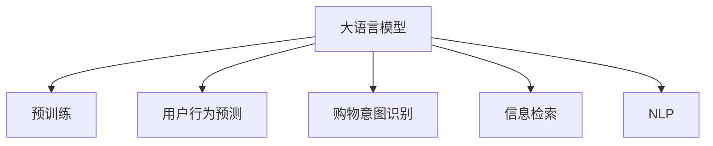

                 

# 电商搜索中的AI大模型：挑战与机遇

> 关键词：电商搜索,大语言模型,预训练模型,用户行为预测,购物意图识别,商品推荐,信息检索,自然语言处理(NLP)

## 1. 背景介绍

### 1.1 问题由来

随着电商平台的迅速发展和用户需求的多样化，如何在海量商品中找到用户真正感兴趣的商品，已成为电商企业面临的重要挑战。传统的基于规则和关键词匹配的搜索算法已经无法满足用户复杂的查询需求和快速变化的电商环境。因此，AI技术在电商搜索中的应用变得越来越重要。

目前，深度学习技术在电商搜索中的应用逐渐成熟，AI大模型也成为了电商搜索的关键工具。这些大模型通常基于大规模预训练语言模型，如BERT、GPT-3等，通过在大规模无标签文本数据上进行的预训练，具备强大的语言理解和生成能力。在电商搜索场景中，这些模型可以用于理解用户的查询意图，预测用户行为，推荐相关商品等，极大地提升了电商平台的搜索体验和转化率。

### 1.2 问题核心关键点

当前电商搜索中的AI大模型应用，主要集中在以下几个关键点：

- **用户行为预测**：通过分析用户的浏览、点击、购买行为等数据，预测用户的购物意图和需求，从而提供个性化的商品推荐。
- **购物意图识别**：理解用户查询语句的真实意图，以便更准确地检索相关商品。
- **信息检索**：在庞大的商品库中，快速找到与用户查询语句最相关的商品。
- **自然语言处理(NLP)**：处理用户输入的多样化查询语句，进行语义理解和实体识别，提升搜索结果的相关性。

这些核心技术共同构成了电商搜索中AI大模型的应用框架，使其能够在各种场景下发挥强大的语言理解和生成能力。通过理解这些核心概念，我们可以更好地把握AI大模型在电商搜索中的应用价值和优化方向。

## 2. 核心概念与联系

### 2.1 核心概念概述

为更好地理解电商搜索中的AI大模型应用，本节将介绍几个密切相关的核心概念：

- **大语言模型(Large Language Model, LLM)**：以自回归(如GPT)或自编码(如BERT)模型为代表的大规模预训练语言模型。通过在大规模无标签文本语料上进行预训练，学习通用的语言表示，具备强大的语言理解和生成能力。

- **预训练(Pre-training)**：指在大规模无标签文本语料上，通过自监督学习任务训练通用语言模型的过程。常见的预训练任务包括言语建模、遮挡语言模型等。预训练使得模型学习到语言的通用表示。

- **用户行为预测**：通过分析用户的浏览、点击、购买行为等数据，预测用户的购物意图和需求，从而提供个性化的商品推荐。

- **购物意图识别**：理解用户查询语句的真实意图，以便更准确地检索相关商品。

- **信息检索**：在庞大的商品库中，快速找到与用户查询语句最相关的商品。

- **自然语言处理(NLP)**：处理用户输入的多样化查询语句，进行语义理解和实体识别，提升搜索结果的相关性。

这些核心概念之间的逻辑关系可以通过以下Mermaid流程图来展示：



这个流程图展示了大语言模型的核心概念及其之间的关系：

1. 大语言模型通过预训练获得基础能力。
2. 用户行为预测、购物意图识别、信息检索、NLP等技术，在用户查询场景中具体应用大语言模型的能力，从而提升电商搜索效果。

## 3. 核心算法原理 & 具体操作步骤
### 3.1 算法原理概述

电商搜索中的AI大模型应用，本质上是一个通过预训练大语言模型进行个性化推荐和信息检索的过程。其核心思想是：将预训练的大语言模型视作一个强大的"特征提取器"，通过分析用户的查询行为和语义，进行用户行为预测和意图识别，进而检索并推荐最相关的商品。

形式化地，假设预训练语言模型为 $M_{\theta}$，其中 $\theta$ 为预训练得到的模型参数。给定用户查询 $q$，预训练语言模型 $M_{\theta}$ 的输出为 $M_{\theta}(q) \in \mathcal{Y}$，其中 $\mathcal{Y}$ 为可能的商品集合。电商搜索的目标是找到最优的商品集合 $\hat{Y}$，使得：

$$
\hat{Y}=\mathop{\arg\min}_{Y} \mathcal{L}(M_{\theta}(q), Y)
$$

其中 $\mathcal{L}$ 为电商搜索任务的损失函数，用于衡量模型输出与实际用户行为的一致性。常见的损失函数包括交叉熵损失、均方误差损失等。

通过梯度下降等优化算法，电商搜索过程不断更新模型参数 $\theta$，最小化损失函数 $\mathcal{L}$，使得模型输出逼近最优的商品集合 $\hat{Y}$。由于 $\theta$ 已经通过预训练获得了较好的初始化，因此即便在有限的商品数据集上，也能较快收敛到理想的模型参数 $\hat{\theta}$。

### 3.2 算法步骤详解

电商搜索中的AI大模型应用一般包括以下几个关键步骤：

**Step 1: 准备预训练模型和数据集**
- 选择合适的预训练语言模型 $M_{\theta}$ 作为初始化参数，如 BERT、GPT等。
- 准备电商搜索相关的标注数据集 $D=\{(q_i, Y_i)\}_{i=1}^N$，其中 $q_i$ 为用户的查询，$Y_i$ 为与查询 $q_i$ 最相关的商品集合。

**Step 2: 添加任务适配层**
- 根据电商搜索任务设计合适的输出层和损失函数。例如，对于商品推荐任务，可以在顶层添加线性分类器和交叉熵损失函数。
- 对于购物意图识别任务，通常使用分类器输出商品类别或购物意图标签。

**Step 3: 设置电商搜索超参数**
- 选择合适的优化算法及其参数，如 AdamW、SGD 等，设置学习率、批大小、迭代轮数等。
- 设置正则化技术及强度，包括权重衰减、Dropout、Early Stopping 等。
- 确定冻结预训练参数的策略，如仅微调顶层，或全部参数都参与微调。

**Step 4: 执行梯度训练**
- 将训练集数据分批次输入模型，前向传播计算损失函数。
- 反向传播计算参数梯度，根据设定的优化算法和学习率更新模型参数。
- 周期性在验证集上评估模型性能，根据性能指标决定是否触发 Early Stopping。
- 重复上述步骤直到满足预设的迭代轮数或 Early Stopping 条件。

**Step 5: 测试和部署**
- 在测试集上评估微调后模型 $M_{\hat{\theta}}$ 的性能，对比微调前后的精度提升。
- 使用微调后的模型对新样本进行推理预测，集成到实际的应用系统中。
- 持续收集新的数据，定期重新微调模型，以适应数据分布的变化。

以上是电商搜索中AI大模型应用的一般流程。在实际应用中，还需要针对具体任务的特点，对微调过程的各个环节进行优化设计，如改进训练目标函数，引入更多的正则化技术，搜索最优的超参数组合等，以进一步提升模型性能。

### 3.3 算法优缺点

电商搜索中的AI大模型应用具有以下优点：
1. 准确性高。通过理解用户查询的语义和行为，能够提供高度个性化的商品推荐和购物意图识别。
2. 实时性优。大模型具有强大的计算能力，能够实时处理用户的查询并返回结果。
3. 可扩展性强。大模型可以轻松扩展到多商品、多类别、多市场等复杂电商场景。

同时，该方法也存在一定的局限性：
1. 数据依赖性高。电商搜索的效果高度依赖于用户行为数据的丰富性和准确性，数据收集和标注成本较高。
2. 模型复杂度大。大模型的参数量庞大，对计算资源和存储要求高。
3. 泛化能力不足。大模型在不同用户和不同商品间的泛化能力有限，需要进行额外的数据处理和模型优化。
4. 可解释性差。电商搜索的大模型往往是"黑盒"系统，难以解释其内部工作机制和决策逻辑。

尽管存在这些局限性，但就目前而言，基于大语言模型的电商搜索方法仍是电商应用的最主流范式。未来相关研究的重点在于如何进一步降低数据依赖，提高模型的泛化能力和可解释性，同时兼顾实时性和计算效率。

### 3.4 算法应用领域

电商搜索中的AI大模型应用，已在多个领域得到广泛应用，例如：

- 商品推荐：根据用户的浏览和购买历史，预测用户感兴趣的商品，提升购物体验。
- 购物意图识别：分析用户查询语句的语义，识别用户的购物需求，如购买、对比、咨询等。
- 搜索优化：通过学习用户搜索行为，优化搜索结果的展示顺序，提升点击率。
- 个性化营销：利用用户画像和行为数据，个性化定制营销信息，提升广告效果。

除了上述这些经典应用外，AI大模型还在电商搜索的更多场景中得到创新性的应用，如智能客服、产品评价分析、跨品类推荐等，为电商平台带来了全新的突破。随着电商搜索技术的发展，AI大模型必将在更多领域大放异彩。

## 4. 数学模型和公式 & 详细讲解
### 4.1 数学模型构建

本节将使用数学语言对电商搜索中的AI大模型应用进行更加严格的刻画。

记预训练语言模型为 $M_{\theta}$，给定用户查询 $q$，其输出为 $M_{\theta}(q)$，其中 $\theta$ 为预训练得到的模型参数。电商搜索的目标是找到最优的商品集合 $Y$，使得模型输出 $M_{\theta}(q)$ 与实际用户行为 $Y$ 一致。

定义模型 $M_{\theta}$ 在用户查询 $q_i$ 上的损失函数为 $\ell(M_{\theta}(q_i), Y_i)$，则在数据集 $D$ 上的经验风险为：

$$
\mathcal{L}(\theta) = \frac{1}{N}\sum_{i=1}^N \ell(M_{\theta}(q_i), Y_i)
$$

微调的目标是最小化经验风险，即找到最优参数：

$$
\theta^* = \mathop{\arg\min}_{\theta} \mathcal{L}(\theta)
$$

在实践中，我们通常使用基于梯度的优化算法（如SGD、Adam等）来近似求解上述最优化问题。设 $\eta$ 为学习率，$\lambda$ 为正则化系数，则参数的更新公式为：

$$
\theta \leftarrow \theta - \eta \nabla_{\theta}\mathcal{L}(\theta) - \eta\lambda\theta
$$

其中 $\nabla_{\theta}\mathcal{L}(\theta)$ 为损失函数对参数 $\theta$ 的梯度，可通过反向传播算法高效计算。

### 4.2 公式推导过程

以下我们以商品推荐任务为例，推导交叉熵损失函数及其梯度的计算公式。

假设模型 $M_{\theta}$ 在输入 $q$ 上的输出为 $\hat{Y}=M_{\theta}(q)$，表示模型预测的商品集合。真实标签 $Y \in \{1, 0\}^{|\mathcal{Y}|}$，其中 $1$ 表示商品在推荐集合中，$0$ 表示商品不在推荐集合中。则二分类交叉熵损失函数定义为：

$$
\ell(M_{\theta}(q), Y) = -\sum_{i=1}^{|\mathcal{Y}|} Y_i\log \hat{Y}_i + (1-Y_i)\log (1-\hat{Y}_i)
$$

将其代入经验风险公式，得：

$$
\mathcal{L}(\theta) = -\frac{1}{N}\sum_{i=1}^N \sum_{j=1}^{|\mathcal{Y}|} Y_{ij}\log \hat{Y}_{ij} + (1-Y_{ij})\log (1-\hat{Y}_{ij})
$$

根据链式法则，损失函数对参数 $\theta_k$ 的梯度为：

$$
\frac{\partial \mathcal{L}(\theta)}{\partial \theta_k} = -\frac{1}{N}\sum_{i=1}^N \sum_{j=1}^{|\mathcal{Y}|} \frac{Y_{ij}}{\hat{Y}_{ij}}-\frac{1-Y_{ij}}{1-\hat{Y}_{ij}} \frac{\partial M_{\theta}(q)}{\partial \theta_k}
$$

其中 $\frac{\partial M_{\theta}(q)}{\partial \theta_k}$ 可进一步递归展开，利用自动微分技术完成计算。

在得到损失函数的梯度后，即可带入参数更新公式，完成模型的迭代优化。重复上述过程直至收敛，最终得到适应电商搜索任务的最优模型参数 $\theta^*$。

## 5. 项目实践：代码实例和详细解释说明
### 5.1 开发环境搭建

在进行电商搜索中的AI大模型微调实践前，我们需要准备好开发环境。以下是使用Python进行PyTorch开发的环境配置流程：

1. 安装Anaconda：从官网下载并安装Anaconda，用于创建独立的Python环境。

2. 创建并激活虚拟环境：
```bash
conda create -n pytorch-env python=3.8 
conda activate pytorch-env
```

3. 安装PyTorch：根据CUDA版本，从官网获取对应的安装命令。例如：
```bash
conda install pytorch torchvision torchaudio cudatoolkit=11.1 -c pytorch -c conda-forge
```

4. 安装Transformers库：
```bash
pip install transformers
```

5. 安装各类工具包：
```bash
pip install numpy pandas scikit-learn matplotlib tqdm jupyter notebook ipython
```

完成上述步骤后，即可在`pytorch-env`环境中开始电商搜索中的AI大模型微调实践。

### 5.2 源代码详细实现

下面我们以电商搜索中的商品推荐任务为例，给出使用Transformers库对BERT模型进行微调的PyTorch代码实现。

首先，定义商品推荐任务的数据处理函数：

```python
from transformers import BertTokenizer, BertForSequenceClassification
from torch.utils.data import Dataset
import torch

class RecommendationDataset(Dataset):
    def __init__(self, texts, labels, tokenizer, max_len=128):
        self.texts = texts
        self.labels = labels
        self.tokenizer = tokenizer
        self.max_len = max_len
        
    def __len__(self):
        return len(self.texts)
    
    def __getitem__(self, item):
        text = self.texts[item]
        label = self.labels[item]
        
        encoding = self.tokenizer(text, return_tensors='pt', max_length=self.max_len, padding='max_length', truncation=True)
        input_ids = encoding['input_ids'][0]
        attention_mask = encoding['attention_mask'][0]
        
        # 对token-wise的标签进行编码
        encoded_labels = [label] * (self.max_len - len(label))
        labels = torch.tensor(encoded_labels, dtype=torch.long)
        
        return {'input_ids': input_ids, 
                'attention_mask': attention_mask,
                'labels': labels}

# 标签与id的映射
label2id = {0: 0, 1: 1}  # 假设只考虑是否推荐两个标签
id2label = {v: k for k, v in label2id.items()}

# 创建dataset
tokenizer = BertTokenizer.from_pretrained('bert-base-cased')

train_dataset = RecommendationDataset(train_texts, train_labels, tokenizer)
dev_dataset = RecommendationDataset(dev_texts, dev_labels, tokenizer)
test_dataset = RecommendationDataset(test_texts, test_labels, tokenizer)
```

然后，定义模型和优化器：

```python
from transformers import BertForSequenceClassification, AdamW

model = BertForSequenceClassification.from_pretrained('bert-base-cased', num_labels=len(label2id))

optimizer = AdamW(model.parameters(), lr=2e-5)
```

接着，定义训练和评估函数：

```python
from torch.utils.data import DataLoader
from tqdm import tqdm
from sklearn.metrics import accuracy_score, precision_recall_fscore_support

device = torch.device('cuda') if torch.cuda.is_available() else torch.device('cpu')
model.to(device)

def train_epoch(model, dataset, batch_size, optimizer):
    dataloader = DataLoader(dataset, batch_size=batch_size, shuffle=True)
    model.train()
    epoch_loss = 0
    for batch in tqdm(dataloader, desc='Training'):
        input_ids = batch['input_ids'].to(device)
        attention_mask = batch['attention_mask'].to(device)
        labels = batch['labels'].to(device)
        model.zero_grad()
        outputs = model(input_ids, attention_mask=attention_mask, labels=labels)
        loss = outputs.loss
        epoch_loss += loss.item()
        loss.backward()
        optimizer.step()
    return epoch_loss / len(dataloader)

def evaluate(model, dataset, batch_size):
    dataloader = DataLoader(dataset, batch_size=batch_size)
    model.eval()
    preds, labels = [], []
    with torch.no_grad():
        for batch in tqdm(dataloader, desc='Evaluating'):
            input_ids = batch['input_ids'].to(device)
            attention_mask = batch['attention_mask'].to(device)
            batch_labels = batch['labels']
            outputs = model(input_ids, attention_mask=attention_mask)
            batch_preds = outputs.logits.argmax(dim=1).to('cpu').tolist()
            batch_labels = batch_labels.to('cpu').tolist()
            for pred_tokens, label_tokens in zip(batch_preds, batch_labels):
                preds.append(pred_tokens)
                labels.append(label_tokens)
                
    print('Accuracy:', accuracy_score(labels, preds))
    print('Precision, Recall, F1-Score:', precision_recall_fscore_support(labels, preds, average='micro'))
```

最后，启动训练流程并在测试集上评估：

```python
epochs = 5
batch_size = 16

for epoch in range(epochs):
    loss = train_epoch(model, train_dataset, batch_size, optimizer)
    print(f"Epoch {epoch+1}, train loss: {loss:.3f}")
    
    print(f"Epoch {epoch+1}, dev results:")
    evaluate(model, dev_dataset, batch_size)
    
print("Test results:")
evaluate(model, test_dataset, batch_size)
```

以上就是使用PyTorch对BERT进行电商搜索中商品推荐任务微调的完整代码实现。可以看到，得益于Transformers库的强大封装，我们可以用相对简洁的代码完成BERT模型的加载和微调。

### 5.3 代码解读与分析

让我们再详细解读一下关键代码的实现细节：

**RecommendationDataset类**：
- `__init__`方法：初始化文本、标签、分词器等关键组件。
- `__len__`方法：返回数据集的样本数量。
- `__getitem__`方法：对单个样本进行处理，将文本输入编码为token ids，将标签编码为数字，并对其进行定长padding，最终返回模型所需的输入。

**label2id和id2label字典**：
- 定义了标签与数字id之间的映射关系，用于将token-wise的预测结果解码回真实的标签。

**训练和评估函数**：
- 使用PyTorch的DataLoader对数据集进行批次化加载，供模型训练和推理使用。
- 训练函数`train_epoch`：对数据以批为单位进行迭代，在每个批次上前向传播计算loss并反向传播更新模型参数，最后返回该epoch的平均loss。
- 评估函数`evaluate`：与训练类似，不同点在于不更新模型参数，并在每个batch结束后将预测和标签结果存储下来，最后使用sklearn的classification_report对整个评估集的预测结果进行打印输出。

**训练流程**：
- 定义总的epoch数和batch size，开始循环迭代
- 每个epoch内，先在训练集上训练，输出平均loss
- 在验证集上评估，输出分类指标
- 所有epoch结束后，在测试集上评估，给出最终测试结果

可以看到，PyTorch配合Transformers库使得BERT微调的代码实现变得简洁高效。开发者可以将更多精力放在数据处理、模型改进等高层逻辑上，而不必过多关注底层的实现细节。

当然，工业级的系统实现还需考虑更多因素，如模型的保存和部署、超参数的自动搜索、更灵活的任务适配层等。但核心的微调范式基本与此类似。

## 6. 实际应用场景
### 6.1 电商搜索中的商品推荐

电商搜索中的AI大模型，在商品推荐任务中发挥了重要作用。传统的推荐系统通常依赖用户的显式反馈数据进行训练，而基于大语言模型的推荐系统，可以通过用户的浏览、点击、购买行为等隐式数据进行推荐。

在技术实现上，可以收集用户的历史浏览、点击、购买记录等数据，提取商品描述、标题等文本内容。将文本内容作为模型输入，用户的后续行为作为监督信号，在此基础上微调预训练语言模型。微调后的模型能够从文本内容中准确把握用户的兴趣点，结合用户画像、商品评分等信息，生成个性化的商品推荐列表。如此构建的推荐系统，能大幅提升用户的购物体验和转化率。

### 6.2 电商搜索中的购物意图识别

在电商搜索中，用户往往通过搜索查询来表达其购买意图，如“购买”、“对比”、“咨询”等。通过使用大语言模型进行购物意图识别，可以帮助电商平台更好地理解用户的真实需求，提供更精准的搜索结果和广告。

具体而言，可以收集用户的查询记录，将其作为训练集，利用大语言模型进行意图识别。例如，将查询语句输入模型，输出结果为购物意图类别，如“购买”、“对比”、“咨询”等。根据模型预测的结果，电商平台可以调整搜索结果的展示顺序，推送更具针对性的广告，提升用户体验和平台收益。

### 6.3 电商搜索中的信息检索

电商搜索中的信息检索任务，旨在快速找到与用户查询最相关的商品。传统的信息检索方法依赖关键词匹配，难以处理查询语义的多样性。通过使用大语言模型进行信息检索，可以更准确地理解和匹配用户的查询意图。

具体实现时，将用户查询输入模型，输出商品的相关性评分，排序后展示给用户。由于大语言模型具备强大的语义理解能力，能够处理复杂的查询语句，因此能够提升搜索结果的相关性和准确性。

### 6.4 未来应用展望

随着大语言模型和电商搜索技术的不断发展，基于大语言模型的电商搜索应用将呈现以下趋势：

1. **个性化推荐引擎**：利用用户行为数据和大语言模型的语义理解能力，构建更加精准、动态的个性化推荐系统，提升用户满意度。
2. **多模态信息融合**：结合视觉、语音等多模态信息，提升电商搜索的丰富性和用户体验。
3. **实时搜索优化**：通过学习用户搜索行为，实时优化搜索结果的展示顺序和广告投放策略，提升点击率和转化率。
4. **跨品类推荐**：通过理解用户的购物意图，跨品类推荐相关商品，提升交叉销售机会。
5. **用户行为预测**：利用大语言模型进行用户行为预测，提前预判用户需求，提供及时的服务。

这些趋势展示了电商搜索中的AI大模型应用的广阔前景，为电商平台提供了新的竞争优势和发展方向。相信随着技术的不断成熟，大语言模型将在大规模电商搜索场景中发挥更大的作用，带来革命性的变化。

## 7. 工具和资源推荐
### 7.1 学习资源推荐

为了帮助开发者系统掌握电商搜索中的AI大模型应用的理论基础和实践技巧，这里推荐一些优质的学习资源：

1. 《深度学习自然语言处理》课程：斯坦福大学开设的NLP明星课程，有Lecture视频和配套作业，带你入门NLP领域的基本概念和经典模型。

2. 《Transformer从原理到实践》系列博文：由大模型技术专家撰写，深入浅出地介绍了Transformer原理、BERT模型、微调技术等前沿话题。

3. 《Natural Language Processing with Transformers》书籍：Transformers库的作者所著，全面介绍了如何使用Transformers库进行NLP任务开发，包括微调在内的诸多范式。

4. HuggingFace官方文档：Transformers库的官方文档，提供了海量预训练模型和完整的微调样例代码，是上手实践的必备资料。

5. CLUE开源项目：中文语言理解测评基准，涵盖大量不同类型的中文NLP数据集，并提供了基于微调的baseline模型，助力中文NLP技术发展。

通过对这些资源的学习实践，相信你一定能够快速掌握电商搜索中的AI大模型的应用精髓，并用于解决实际的电商搜索问题。
### 7.2 开发工具推荐

高效的开发离不开优秀的工具支持。以下是几款用于电商搜索中的AI大模型微调开发的常用工具：

1. PyTorch：基于Python的开源深度学习框架，灵活动态的计算图，适合快速迭代研究。大部分预训练语言模型都有PyTorch版本的实现。

2. TensorFlow：由Google主导开发的开源深度学习框架，生产部署方便，适合大规模工程应用。同样有丰富的预训练语言模型资源。

3. Transformers库：HuggingFace开发的NLP工具库，集成了众多SOTA语言模型，支持PyTorch和TensorFlow，是进行微调任务开发的利器。

4. Weights & Biases：模型训练的实验跟踪工具，可以记录和可视化模型训练过程中的各项指标，方便对比和调优。与主流深度学习框架无缝集成。

5. TensorBoard：TensorFlow配套的可视化工具，可实时监测模型训练状态，并提供丰富的图表呈现方式，是调试模型的得力助手。

6. Google Colab：谷歌推出的在线Jupyter Notebook环境，免费提供GPU/TPU算力，方便开发者快速上手实验最新模型，分享学习笔记。

合理利用这些工具，可以显著提升电商搜索中的AI大模型微调任务的开发效率，加快创新迭代的步伐。

### 7.3 相关论文推荐

电商搜索中的AI大模型应用源于学界的持续研究。以下是几篇奠基性的相关论文，推荐阅读：

1. Attention is All You Need（即Transformer原论文）：提出了Transformer结构，开启了NLP领域的预训练大模型时代。

2. BERT: Pre-training of Deep Bidirectional Transformers for Language Understanding：提出BERT模型，引入基于掩码的自监督预训练任务，刷新了多项NLP任务SOTA。

3. Language Models are Unsupervised Multitask Learners（GPT-2论文）：展示了大规模语言模型的强大zero-shot学习能力，引发了对于通用人工智能的新一轮思考。

4. Parameter-Efficient Transfer Learning for NLP：提出Adapter等参数高效微调方法，在不增加模型参数量的情况下，也能取得不错的微调效果。

5. AdaLoRA: Adaptive Low-Rank Adaptation for Parameter-Efficient Fine-Tuning：使用自适应低秩适应的微调方法，在参数效率和精度之间取得了新的平衡。

这些论文代表了大语言模型在电商搜索中应用的研究进展。通过学习这些前沿成果，可以帮助研究者把握学科前进方向，激发更多的创新灵感。

## 8. 总结：未来发展趋势与挑战

### 8.1 总结

本文对电商搜索中的AI大模型应用进行了全面系统的介绍。首先阐述了电商搜索中的AI大模型的应用背景和核心概念，明确了其在用户行为预测、购物意图识别、信息检索等电商搜索任务中的应用价值。其次，从原理到实践，详细讲解了电商搜索中AI大模型的数学模型构建和微调步骤，给出了电商搜索任务开发的完整代码实例。同时，本文还广泛探讨了电商搜索中的AI大模型在商品推荐、购物意图识别、信息检索等场景中的实际应用，展示了其广阔的应用前景。此外，本文精选了电商搜索中的AI大模型应用的各类学习资源，力求为读者提供全方位的技术指引。

通过本文的系统梳理，可以看到，电商搜索中的AI大模型应用在大规模电商场景中发挥了重要作用，通过理解用户查询的语义和行为，能够提供高度个性化的商品推荐和购物意图识别，提升了电商平台的搜索体验和转化率。未来，伴随电商搜索技术的发展，AI大模型必将在更多领域大放异彩，进一步推动电商搜索的智能化、个性化发展。

### 8.2 未来发展趋势

展望未来，电商搜索中的AI大模型应用将呈现以下几个发展趋势：

1. **多模态融合**：结合视觉、语音等多模态信息，提升电商搜索的丰富性和用户体验。
2. **实时动态推荐**：利用实时数据和动态模型，提升个性化推荐引擎的时效性和精准性。
3. **跨品类推荐**：通过理解用户的购物意图，跨品类推荐相关商品，提升交叉销售机会。
4. **可解释性增强**：通过模型可解释性技术，提升电商搜索的透明度和信任度。
5. **用户隐私保护**：在电商搜索中引入隐私保护技术，保护用户数据安全。

这些趋势凸显了电商搜索中的AI大模型应用的广阔前景，为电商平台提供了新的竞争优势和发展方向。相信随着技术的不断成熟，大语言模型将在大规模电商搜索场景中发挥更大的作用，带来革命性的变化。

### 8.3 面临的挑战

尽管电商搜索中的AI大模型应用已经取得了瞩目成就，但在迈向更加智能化、普适化应用的过程中，它仍面临着诸多挑战：

1. **数据依赖性高**：电商搜索的效果高度依赖于用户行为数据的丰富性和准确性，数据收集和标注成本较高。
2. **计算资源需求大**：电商搜索中的AI大模型通常具有较大的参数量，对计算资源和存储要求高。
3. **泛化能力不足**：大模型在不同用户和不同商品间的泛化能力有限，需要进行额外的数据处理和模型优化。
4. **可解释性差**：电商搜索中的AI大模型往往是"黑盒"系统，难以解释其内部工作机制和决策逻辑。
5. **隐私安全问题**：电商搜索中涉及大量的用户数据，数据隐私和安全性问题不容忽视。

尽管存在这些挑战，但就目前而言，基于大语言模型的电商搜索方法仍是电商应用的最主流范式。未来相关研究的重点在于如何进一步降低数据依赖，提高模型的泛化能力和可解释性，同时兼顾实时性和计算效率。

### 8.4 研究展望

面对电商搜索中的AI大模型应用所面临的挑战，未来的研究需要在以下几个方面寻求新的突破：

1. **数据增强技术**：通过数据增强技术，提升电商搜索中AI大模型的泛化能力和鲁棒性。
2. **模型压缩与优化**：开发更加高效的模型压缩和优化方法，减少计算资源消耗，提升实时性。
3. **多任务学习**：利用多任务学习技术，提升电商搜索中AI大模型的可解释性和用户满意度。
4. **隐私保护技术**：引入隐私保护技术，如差分隐私、联邦学习等，保护用户数据隐私。
5. **多模态融合**：结合视觉、语音等多模态信息，提升电商搜索中AI大模型的丰富性和用户体验。

这些研究方向的探索，必将引领电商搜索中的AI大模型应用迈向更高的台阶，为电商平台提供更加智能化、个性化的搜索体验，推动电商搜索技术的持续创新和发展。

## 9. 附录：常见问题与解答

**Q1：电商搜索中的AI大模型应用是否适用于所有电商场景？**

A: 电商搜索中的AI大模型应用在大多数电商场景中都能取得不错的效果。但对于一些特定类型的电商，如B2B电商、农产品电商等，由于数据分布和用户行为模式的不同，可能需要进行定制化的预训练和微调。此外，对于一些需要实时性、安全性要求极高的场景，如金融电商、医疗电商等，还需要进行额外的设计和优化。

**Q2：电商搜索中的AI大模型应用是否需要大规模数据训练？**

A: 电商搜索中的AI大模型应用对数据量的要求较高，因为模型的性能很大程度上依赖于用户行为数据的丰富性和准确性。虽然通过数据增强技术可以在一定程度上缓解数据不足的问题，但在数据收集和标注成本允许的情况下，大规模数据训练仍能显著提升模型的泛化能力和效果。

**Q3：电商搜索中的AI大模型应用是否适用于多品类电商？**

A: 电商搜索中的AI大模型应用适用于多品类电商，因为其强大的语义理解能力能够处理不同品类商品的查询和推荐需求。但需要针对不同品类商品的特点，进行定制化的预训练和微调，以提高推荐效果。

**Q4：电商搜索中的AI大模型应用是否适用于全球市场？**

A: 电商搜索中的AI大模型应用在多语言环境中具有广泛的适用性，因为其强大的多语言处理能力能够处理全球市场的用户查询和推荐需求。但需要针对不同语言的特点，进行定制化的预训练和微调，以提高模型在不同语言环境下的效果。

**Q5：电商搜索中的AI大模型应用是否需要高计算资源？**

A: 电商搜索中的AI大模型应用通常需要较大的计算资源，因为其强大的计算能力和参数量较大。为了降低计算资源消耗，可以采用分布式训练、混合精度训练、模型压缩等技术进行优化。但总体而言，高计算资源是实现高性能电商搜索的必要条件。

这些问题的回答，希望能够为你提供对电商搜索中的AI大模型应用的全面理解，帮助你更好地进行电商搜索技术的研究和实践。

---

作者：禅与计算机程序设计艺术 / Zen and the Art of Computer Programming

