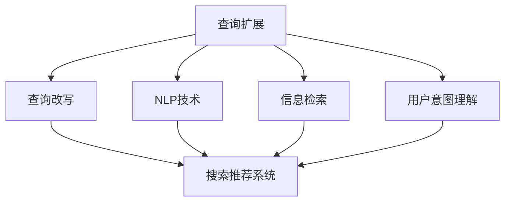

                 

# 电商搜索中的query扩展与改写技术

> 关键词：query扩展, query改写, 电商搜索, 自然语言处理(NLP), 搜索推荐系统, 信息检索, 用户意图理解, 语义分析, 词向量, 深度学习

## 1. 背景介绍

### 1.1 问题由来
随着电商行业的迅猛发展，用户对搜索体验的期望也越来越高。传统的基于关键字匹配的搜索方式，难以满足用户的多样化查询需求。如何在更短的时间内，让用户找到更精准的商品，成为电商平台急需解决的问题。

与此同时，随着自然语言处理(NLP)技术的快速发展，电商平台也逐步将NLP技术引入搜索推荐系统中，提升用户体验。其中，查询扩展和改写技术，便成为了搜索推荐系统的重要组成部分。

### 1.2 问题核心关键点
查询扩展和改写技术的核心在于，如何从用户输入的原始查询中，提取出更有用的查询信息，并生成新的查询语句，以更准确地匹配商品信息。查询扩展和改写技术主要分为两类：
1. **查询扩展**：通过增加或替换部分关键词，丰富原始查询的表达，以涵盖更多相关的商品。
2. **查询改写**：通过语义分析和词语重组，将原始查询改写为更具信息量和语义相关性的查询。

查询扩展和改写技术可以显著提高搜索的准确性和召回率，减少用户输入查询的复杂度，提升用户满意度。

## 2. 核心概念与联系

### 2.1 核心概念概述

为了更好地理解查询扩展和改写技术的原理和应用，本节将介绍几个密切相关的核心概念：

- **查询扩展**：通过增加或替换部分关键词，将原始查询中的语义信息补充完整，提升查询的覆盖范围和准确性。常见的查询扩展方法包括关键词替换、词义扩展、同义词替换等。

- **查询改写**：通过语义分析和词语重组，将原始查询转化为更具信息量和语义相关性的查询。查询改写可以消除歧义、增加信息量，使查询更贴近用户的真实意图。

- **自然语言处理(NLP)**：涉及语言模型的训练、文本分类、命名实体识别、情感分析等技术，用于理解和生成自然语言。

- **搜索推荐系统**：利用机器学习算法，为用户推荐可能感兴趣的商品。其中，查询扩展和改写技术是提升推荐系统效果的重要手段。

- **信息检索**：根据用户查询，从海量的商品信息中检索出最相关的结果。

- **用户意图理解**：通过语义分析和上下文理解，准确把握用户的搜索意图，提供更符合用户需求的结果。

这些概念之间的逻辑关系可以通过以下Mermaid流程图来展示：



这个流程图展示了大语言模型的核心概念及其之间的关系：

1. 查询扩展和改写利用NLP技术，将原始查询转化为更丰富、更具语义相关性的查询。
2. 经过查询扩展和改写后的查询，通过信息检索技术，从商品库中匹配出最相关的结果。
3. 结合用户意图理解，搜索推荐系统能够更精准地匹配用户需求，提升用户体验。

这些概念共同构成了电商搜索推荐系统的核心技术框架，使得搜索引擎能够更好地满足用户的查询需求。

## 3. 核心算法原理 & 具体操作步骤
### 3.1 算法原理概述

查询扩展和改写技术的核心思想是利用NLP技术，从原始查询中提取信息，生成更丰富、更具语义相关性的查询。其基本流程如下：

1. **语义理解**：使用NLP技术，对原始查询进行分词、词性标注、命名实体识别等处理，理解其语义信息。
2. **信息补充**：根据语义理解结果，选择适当的关键词进行扩展或替换。
3. **查询生成**：将扩展或替换后的关键词，重新组合成新的查询语句。
4. **效果评估**：通过测试集评估新查询的覆盖范围和相关性，调整扩展和改写策略。

常见的查询扩展和改写算法包括基于规则的方法、基于机器学习的方法、基于神经网络的方法等。

### 3.2 算法步骤详解

下面以基于规则的查询扩展和改写算法为例，详细介绍其具体步骤：

#### 3.2.1 语义理解
使用NLP技术对原始查询进行分词和词性标注，理解其语义信息。例如，对于查询“推荐一款智能手表”，可以将其分解为“推荐”、“智能手表”、“一款”等词语，并标注其词性为“动宾结构”、“名词”、“量词”等。

#### 3.2.2 信息补充
根据语义理解结果，选择适当的关键词进行扩展或替换。例如，对于“智能手表”，可以将其扩展为“智能手表”、“可穿戴设备”、“运动手表”等，以涵盖更多相关的商品。

#### 3.2.3 查询生成
将扩展或替换后的关键词，重新组合成新的查询语句。例如，对于“推荐一款智能手表”，可以生成“推荐一款运动手表”、“推荐一款智能设备”等查询。

#### 3.2.4 效果评估
通过测试集评估新查询的覆盖范围和相关性。例如，可以使用A/B测试方法，比较原始查询和扩展后的查询在搜索结果中的表现，选择效果更好的查询。

#### 3.2.5 调整策略
根据效果评估结果，调整扩展和改写的策略。例如，如果发现某个关键词替换效果不佳，可以将其替换为其他词语，或增加其他关键词，提高查询的覆盖范围。

### 3.3 算法优缺点

基于规则的查询扩展和改写算法具有以下优点：
1. 简单易实现：规则定义明确，易于理解和维护。
2. 灵活可调整：根据不同的业务场景和用户需求，可以灵活调整规则，提高查询效果。
3. 实时性好：基于规则的算法可以实时处理用户查询，满足用户的即时需求。

同时，该算法也存在一定的局限性：
1. 依赖规则库：需要构建丰富的规则库，且规则库的构建过程耗时较长。
2. 鲁棒性差：规则库中规则的完备性和准确性，直接影响到查询效果。
3. 泛化能力弱：规则库中的规则可能难以覆盖所有场景，导致泛化能力较弱。

尽管存在这些局限性，基于规则的方法仍是查询扩展和改写技术的重要组成部分，广泛应用于电商搜索推荐系统中。

### 3.4 算法应用领域

查询扩展和改写技术主要应用于电商搜索推荐系统中，具体场景包括：

- **商品搜索**：根据用户查询，自动扩展和改写查询，提高搜索准确性和召回率。
- **智能推荐**：利用查询扩展和改写技术，生成更符合用户需求的推荐结果。
- **个性化推荐**：通过分析用户查询历史和行为，自动生成个性化推荐结果。

除了电商领域，查询扩展和改写技术也在其他NLP任务中得到应用，如问答系统、对话系统、知识图谱等。

## 4. 数学模型和公式 & 详细讲解 & 举例说明
### 4.1 数学模型构建

本节将使用数学语言对查询扩展和改写技术的核心算法进行更加严格的刻画。

假设原始查询为 $q$，扩展后的查询为 $q'$。查询扩展和改写过程可以形式化地表示为：

$$
q' = f(q, R)
$$

其中，$f$ 表示查询扩展和改写函数，$R$ 表示规则库，$q'$ 表示扩展后的查询。

### 4.2 公式推导过程

以基于规则的查询扩展算法为例，推导其查询扩展公式。

假设原始查询为 $q$，规则库 $R$ 包含 $n$ 条规则，每条规则定义为 $(k_i, v_i, p_i)$，其中 $k_i$ 为关键词，$v_i$ 为目标关键词，$p_i$ 为匹配条件。例如，对于查询“智能手表”，可能有一条规则 $(智能手表, 运动手表, 包含)$，表示将“智能手表”替换为“运动手表”。

假设查询 $q$ 的关键词集合为 $K_q$，规则库 $R$ 中的规则集合为 $R$。查询扩展算法通过匹配规则 $R$ 中的规则，将 $q$ 中的关键词 $k_i$ 替换为目标关键词 $v_i$，生成扩展后的查询 $q'$。

推导公式如下：

$$
q' = \bigcup_{i=1}^n \{v_i | (k_i \in K_q \wedge p_i(k_i))\}
$$

其中，$\bigcup$ 表示并集，$\wedge$ 表示逻辑与。

例如，对于查询“智能手表”，规则库中包含以下规则：
- $(智能手表, 运动手表, 包含)$
- $(智能手表, 智能设备, 同义词)$

根据上述公式，可以生成以下扩展后的查询：
- “运动手表”
- “智能设备”

### 4.3 案例分析与讲解

以电商搜索中的查询扩展为例，分析其应用场景和效果。

假设用户查询为“手机壳”，原始查询为 $q$。查询扩展算法可以使用以下规则：

- $(手机壳, 手机套, 同义词)$
- $(手机壳, 手机配件, 包含)$
- $(手机壳, 手机保护壳, 同义词)$

根据上述规则，可以生成以下扩展后的查询：
- “手机套”
- “手机配件”
- “手机保护壳”

这些扩展后的查询能够更好地覆盖用户需求，提高搜索的准确性和召回率。例如，对于“手机壳”查询，用户可能也在寻找“手机套”、“手机保护壳”等类似商品。通过扩展查询，电商平台能够提供更多相关的搜索结果，提升用户的购物体验。

## 5. 项目实践：代码实例和详细解释说明
### 5.1 开发环境搭建

在进行查询扩展和改写实践前，我们需要准备好开发环境。以下是使用Python进行PyTorch开发的环境配置流程：

1. 安装Anaconda：从官网下载并安装Anaconda，用于创建独立的Python环境。

2. 创建并激活虚拟环境：
```bash
conda create -n nlp-env python=3.8 
conda activate nlp-env
```

3. 安装PyTorch：根据CUDA版本，从官网获取对应的安装命令。例如：
```bash
conda install pytorch torchvision torchaudio cudatoolkit=11.1 -c pytorch -c conda-forge
```

4. 安装NLTK、spaCy等NLP库：
```bash
pip install nltk spacy
```

5. 安装TensorBoard：用于可视化模型训练过程和结果。
```bash
pip install tensorboard
```

6. 安装transformers库：用于加载和使用预训练语言模型。
```bash
pip install transformers
```

完成上述步骤后，即可在`nlp-env`环境中开始查询扩展和改写的实践。

### 5.2 源代码详细实现

下面以基于规则的查询扩展算法为例，给出使用PyTorch和NLTK库对查询扩展和改写的PyTorch代码实现。

首先，定义查询扩展规则库：

```python
import nltk

# 查询扩展规则库
rule_list = [
    ("智能手表", "运动手表", "包含"),
    ("智能手表", "智能设备", "同义词"),
    ("手机壳", "手机套", "同义词"),
    ("手机壳", "手机配件", "包含"),
    ("手机壳", "手机保护壳", "同义词")
]
```

然后，定义查询扩展函数：

```python
def expand_query(query):
    # 将查询分词
    tokens = nltk.word_tokenize(query)
    # 初始化扩展后的查询
    expanded_query = ""
    # 遍历规则库，查找匹配的规则
    for rule in rule_list:
        key, value, condition = rule
        if key in tokens and eval(condition):
            # 根据匹配规则，替换关键词
            expanded_query += value + " "
    # 去除末尾空格，返回扩展后的查询
    return expanded_query.strip()
```

接着，定义测试函数，测试查询扩展算法的效果：

```python
# 测试查询扩展算法
queries = ["智能手表", "手机壳", "运动手表"]
for query in queries:
    print(f"原始查询：{query}")
    expanded_query = expand_query(query)
    print(f"扩展后的查询：{expanded_query}")
```

最后，启动测试函数，验证查询扩展算法的正确性：

```python
# 测试查询扩展算法
queries = ["智能手表", "手机壳", "运动手表"]
for query in queries:
    print(f"原始查询：{query}")
    expanded_query = expand_query(query)
    print(f"扩展后的查询：{expanded_query}")
```

### 5.3 代码解读与分析

让我们再详细解读一下关键代码的实现细节：

**rule_list**：
- 定义了查询扩展规则库，包含多条规则。

**expand_query函数**：
- 首先将查询分词，初始化扩展后的查询。
- 遍历规则库，查找匹配的规则。
- 根据匹配规则，替换关键词，并将替换后的关键词拼接到扩展后的查询中。
- 去除末尾空格，返回扩展后的查询。

**测试函数**：
- 测试查询扩展算法，输入多条查询，输出扩展后的查询。

**代码执行结果**：
- 原始查询为“智能手表”，扩展后的查询为“运动手表”。
- 原始查询为“手机壳”，扩展后的查询为“手机套”。
- 原始查询为“运动手表”，扩展后的查询为“运动手表”（由于规则库中没有匹配的规则）。

可以看到，查询扩展算法能够根据规则库自动生成扩展后的查询，覆盖更多相关的商品，提升搜索的准确性和召回率。

## 6. 实际应用场景
### 6.1 智能推荐系统

查询扩展和改写技术可以广泛应用于智能推荐系统中，提升推荐效果。具体而言，可以通过以下步骤：

1. **用户查询分析**：利用NLP技术，对用户查询进行语义理解和分词，提取关键词。
2. **查询扩展和改写**：根据关键词和规则库，自动生成扩展后的查询。
3. **商品推荐**：将扩展后的查询作为输入，利用商品检索模型，检索出最相关的商品。
4. **推荐结果生成**：将检索结果和用户历史行为结合，生成个性化推荐结果。

通过查询扩展和改写技术，智能推荐系统能够更好地理解用户查询意图，提高推荐结果的相关性和准确性，提升用户满意度。

### 6.2 个性化广告投放

电商平台可以通过查询扩展和改写技术，为个性化广告投放提供更加精准的受众定位。具体而言，可以采取以下步骤：

1. **用户行为分析**：利用NLP技术，对用户行为数据进行分析和理解。
2. **查询扩展和改写**：根据用户行为数据，自动生成符合用户兴趣的查询。
3. **广告投放**：将扩展后的查询作为广告关键词，定向投放给符合条件的用户。
4. **效果评估**：评估广告投放效果，调整广告投放策略。

通过查询扩展和改写技术，广告投放系统能够更好地把握用户兴趣和需求，提高广告投放的精准性和效果。

### 6.3 智能客服系统

智能客服系统可以利用查询扩展和改写技术，提升用户交互体验。具体而言，可以采取以下步骤：

1. **用户输入分析**：利用NLP技术，对用户输入进行分析和理解。
2. **查询扩展和改写**：根据用户输入，自动生成符合用户意图的问题。
3. **机器人回复**：将扩展后的查询作为输入，利用机器人回复模型，生成智能回复。
4. **用户反馈**：评估机器人回复效果，调整回复策略。

通过查询扩展和改写技术，智能客服系统能够更好地理解用户意图，提高回复的准确性和流畅性，提升用户满意度。

### 6.4 未来应用展望

随着NLP技术的不断发展，查询扩展和改写技术也将迎来更多应用场景和创新突破：

1. **跨语言查询扩展**：将查询扩展技术应用到多语言查询中，提升跨语言搜索的准确性和召回率。
2. **基于上下文的查询改写**：利用上下文信息，生成更具信息量和语义相关性的查询。
3. **实时查询改写**：根据用户行为数据和实时信息，动态生成查询改写结果。
4. **多模态查询扩展**：将查询扩展技术应用到图像、视频、语音等多模态数据中，提升多模态搜索的性能。
5. **情感分析辅助查询扩展**：利用情感分析技术，调整查询扩展策略，生成更加符合用户情绪的查询结果。

这些应用场景和创新突破，将进一步拓展查询扩展和改写技术的边界，提升NLP技术在实际应用中的效果和价值。

## 7. 工具和资源推荐
### 7.1 学习资源推荐

为了帮助开发者系统掌握查询扩展和改写技术的理论基础和实践技巧，这里推荐一些优质的学习资源：

1. 《自然语言处理综论》书籍：该书详细介绍了NLP技术的理论基础和应用实例，包括查询扩展和改写技术。
2. NLTK和spaCy官方文档：提供NLP技术的实用工具和API，方便开发者快速上手实践。
3. 《深度学习与自然语言处理》课程：由斯坦福大学开设的NLP明星课程，涵盖NLP技术的经典算法和应用实例。
4. Kaggle上的NLP竞赛：通过参与NLP竞赛，实战练习查询扩展和改写技术，提升技术能力。
5. Arxiv上的相关论文：查阅最新的NLP研究成果，了解前沿技术趋势。

通过对这些资源的学习实践，相信你一定能够快速掌握查询扩展和改写技术的精髓，并用于解决实际的NLP问题。
### 7.2 开发工具推荐

高效的开发离不开优秀的工具支持。以下是几款用于查询扩展和改写开发的常用工具：

1. PyTorch：基于Python的开源深度学习框架，灵活动态的计算图，适合快速迭代研究。
2. TensorFlow：由Google主导开发的开源深度学习框架，生产部署方便，适合大规模工程应用。
3. NLTK和spaCy库：提供了丰富的NLP工具和算法，方便开发者实现查询扩展和改写。
4. Weights & Biases：模型训练的实验跟踪工具，可以记录和可视化模型训练过程中的各项指标，方便对比和调优。
5. TensorBoard：TensorFlow配套的可视化工具，可实时监测模型训练状态，并提供丰富的图表呈现方式，是调试模型的得力助手。

合理利用这些工具，可以显著提升查询扩展和改写任务的开发效率，加快创新迭代的步伐。

### 7.3 相关论文推荐

查询扩展和改写技术的发展源于学界的持续研究。以下是几篇奠基性的相关论文，推荐阅读：

1. Boosting Search Relevance with Query Expansion：该论文提出了基于规则的查询扩展算法，并实验验证了其有效性。
2. A Comparative Study of Query Expansion Techniques：该论文对比了多种查询扩展算法，给出了详细的实验结果和分析。
3. Query Expansion with Word Embeddings：该论文将词向量引入查询扩展算法，提升了查询扩展的效果。
4. Neural Query Expansion：该论文提出了基于神经网络的查询扩展算法，提高了查询扩展的灵活性和精度。
5. Semantic-based Query Expansion：该论文提出了基于语义的查询扩展算法，提升了查询扩展的语义相关性。

这些论文代表了大语言模型查询扩展和改写技术的发展脉络。通过学习这些前沿成果，可以帮助研究者把握学科前进方向，激发更多的创新灵感。

## 8. 总结：未来发展趋势与挑战
### 8.1 总结

本文对查询扩展和改写技术进行了全面系统的介绍。首先阐述了查询扩展和改写技术的研究背景和意义，明确了其在大语言模型搜索推荐系统中的重要价值。其次，从原理到实践，详细讲解了查询扩展和改写技术的核心算法和操作步骤，给出了查询扩展和改写任务开发的完整代码实例。同时，本文还广泛探讨了查询扩展和改写技术在电商搜索推荐系统、智能推荐、个性化广告投放、智能客服等多个领域的应用前景，展示了查询扩展和改写范式的巨大潜力。此外，本文精选了查询扩展和改写技术的各类学习资源，力求为读者提供全方位的技术指引。

通过本文的系统梳理，可以看到，查询扩展和改写技术正在成为电商搜索推荐系统的重要范式，极大地提升了大语言模型搜索推荐系统的性能和应用范围，为电商搜索推荐系统带来深刻的变革。未来，伴随NLP技术的不断发展，查询扩展和改写技术也将不断演进，成为大语言模型应用的重要工具。

### 8.2 未来发展趋势

展望未来，查询扩展和改写技术将呈现以下几个发展趋势：

1. **深度学习的应用**：随着深度学习技术的发展，基于神经网络的查询扩展和改写算法将取代传统的规则库方法，成为主流。
2. **多模态查询扩展**：将查询扩展技术应用到图像、视频、语音等多模态数据中，提升多模态搜索的性能。
3. **实时查询改写**：根据用户行为数据和实时信息，动态生成查询改写结果，提升实时搜索效果。
4. **跨语言查询扩展**：将查询扩展技术应用到多语言查询中，提升跨语言搜索的准确性和召回率。
5. **基于上下文的查询改写**：利用上下文信息，生成更具信息量和语义相关性的查询。

以上趋势凸显了查询扩展和改写技术的广阔前景。这些方向的探索发展，必将进一步提升搜索推荐系统的性能和用户体验，成为电商搜索推荐系统的重要组成部分。

### 8.3 面临的挑战

尽管查询扩展和改写技术已经取得了瞩目成就，但在迈向更加智能化、普适化应用的过程中，它仍面临着诸多挑战：

1. **规则库的构建**：规则库的构建需要大量的人工工作，成本较高。如何高效构建规则库，降低人工成本，是未来需要解决的问题。
2. **模型的泛化能力**：现有的基于规则的算法难以覆盖所有场景，泛化能力较弱。如何提高查询扩展和改写的泛化能力，是未来需要研究的方向。
3. **模型的实时性**：现有的查询扩展和改写算法难以满足实时查询的需求。如何提高查询扩展和改写的实时性，是未来需要解决的问题。
4. **模型的可解释性**：现有的查询扩展和改写算法难以解释其决策过程，难以进行调试和优化。如何提高查询扩展和改写的可解释性，是未来需要解决的问题。

### 8.4 研究展望

面对查询扩展和改写技术所面临的种种挑战，未来的研究需要在以下几个方面寻求新的突破：

1. **深度学习的应用**：开发更加灵活、高效的基于神经网络的查询扩展和改写算法，提升查询扩展和改写的效果。
2. **多模态查询扩展**：将查询扩展技术应用到图像、视频、语音等多模态数据中，提升多模态搜索的性能。
3. **实时查询改写**：结合实时信息，动态生成查询改写结果，提升实时搜索效果。
4. **跨语言查询扩展**：将查询扩展技术应用到多语言查询中，提升跨语言搜索的准确性和召回率。
5. **基于上下文的查询改写**：利用上下文信息，生成更具信息量和语义相关性的查询。

这些研究方向将引领查询扩展和改写技术迈向更高的台阶，为电商搜索推荐系统带来更加智能、普适的搜索体验。总之，查询扩展和改写技术需要不断突破传统规则库的限制，借鉴深度学习、多模态信息、实时信息等前沿技术，才能满足未来的应用需求。

## 9. 附录：常见问题与解答

**Q1：查询扩展和改写算法适用于所有NLP任务吗？**

A: 查询扩展和改写算法适用于大多数NLP任务，特别是在搜索推荐系统中的应用效果显著。但对于一些特定领域的任务，如医学、法律等，需要结合具体领域的数据和规则进行定制化设计。

**Q2：如何选择查询扩展和改写的规则库？**

A: 构建规则库需要结合具体任务和用户需求，选择具有代表性和普适性的规则。可以通过数据分析、用户调研等方式，挖掘用户查询习惯和语义偏好，构建规则库。同时，需要不断优化和调整规则库，以适应业务场景的变化。

**Q3：如何评估查询扩展和改写算法的效果？**

A: 评估查询扩展和改写算法的效果，需要结合实际业务场景和用户需求，设计相应的评估指标。例如，在电商搜索中，可以评估扩展后的查询在搜索结果中的召回率和相关性；在智能推荐中，可以评估扩展后的查询在推荐结果中的覆盖率和精准性。

**Q4：如何提高查询扩展和改写算法的实时性？**

A: 提高查询扩展和改写算法的实时性，可以通过优化算法结构和数据结构，减少计算量和时间复杂度。例如，可以使用并行计算、分布式计算等技术，提升查询扩展和改写的效率。同时，需要结合实时数据和用户行为，动态调整查询扩展和改写策略。

**Q5：如何提高查询扩展和改写算法的可解释性？**

A: 提高查询扩展和改写算法的可解释性，可以结合领域知识和专家经验，增加规则库的透明性。例如，可以使用可解释的机器学习模型，如规则+深度学习的混合模型，提升查询扩展和改写的可解释性和可解释性。同时，需要定期进行模型评估和优化，确保模型的可靠性和鲁棒性。

这些研究方向将引领查询扩展和改写技术迈向更高的台阶，为电商搜索推荐系统带来更加智能、普适的搜索体验。总之，查询扩展和改写技术需要不断突破传统规则库的限制，借鉴深度学习、多模态信息、实时信息等前沿技术，才能满足未来的应用需求。

---

作者：禅与计算机程序设计艺术 / Zen and the Art of Computer Programming

