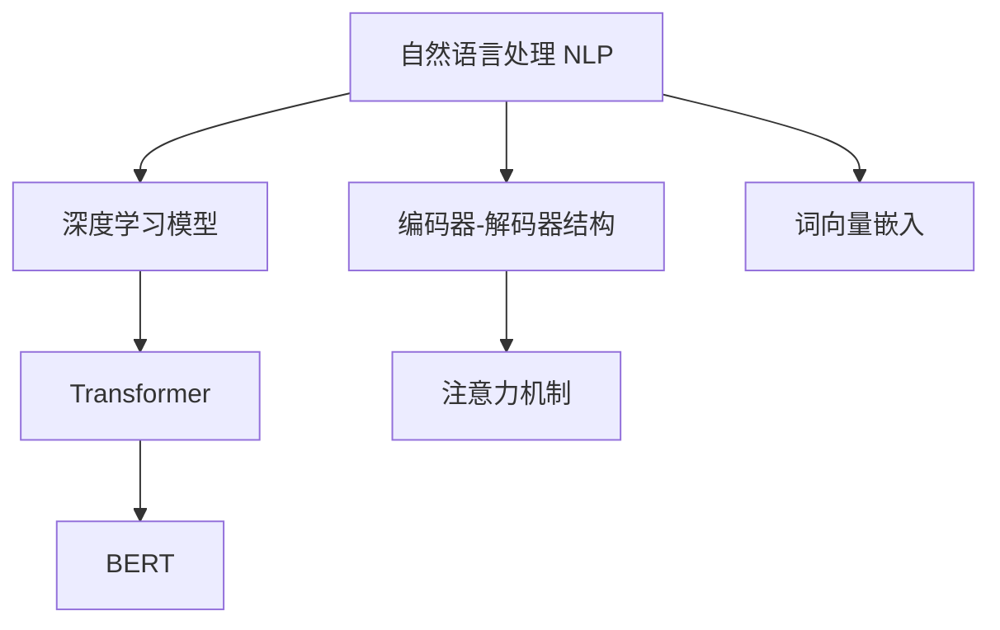

                 

# 电商搜索中的query理解与改写技术

> 关键词：电商搜索,query理解,改写技术,自然语言处理,NLP,深度学习,Transformer,BERT,词向量,编码器-解码器,注意力机制

## 1. 背景介绍

在电商领域，搜索是用户获取商品信息、进行购买决策的核心方式。然而，用户输入的查询通常复杂多变、表达不明确，如何从自然语言文本中提取出有效的信息，是电商搜索技术的关键所在。近年来，基于深度学习和大语言模型的query理解与改写技术得到了迅速发展，成为电商搜索系统的重要组成部分。本文将系统介绍电商搜索中的query理解与改写技术，从原理、实践到未来发展趋势，进行深入探讨。

### 1.1 问题由来

电商搜索系统需要理解用户输入的自然语言query，从中提取出用户真实的意图和需求，转化为结构化的搜索条件，用于与商品库进行匹配。传统的基于规则的搜索算法对领域知识有较高依赖，难以处理查询的复杂性和多样性。随着深度学习和大语言模型的兴起，基于深度神经网络的query理解与改写技术逐渐成为主流。

传统的电商搜索系统主要依赖关键词匹配算法，但这种方法存在以下问题：
1. **词义歧义**：相同的关键词在不同上下文中可能有不同的含义。
2. **语法错误**：用户输入的query可能包含拼写错误、语法不正确等问题。
3. **缺乏背景知识**：关键词匹配算法难以利用上下文信息和背景知识进行更精准的匹配。
4. **查询多样性**：用户输入的query千差万别，难以一概而论。

为了解决这些问题，近年来，基于深度学习的query理解与改写技术逐渐崭露头角，成为电商搜索系统的关键技术。

### 1.2 问题核心关键点

基于深度学习的query理解与改写技术主要包括以下核心点：
1. **自然语言处理(NLP)**：将自然语言转化为结构化信息，理解用户查询意图。
2. **深度学习模型**：使用Transformer等深度学习模型对自然语言进行建模，提取语义信息。
3. **Transformer和BERT**：利用Transformer的编码器-解码器结构和BERT的双向语言模型，提升模型性能。
4. **注意力机制**：通过注意力机制对重要信息进行加权，提升模型对查询细节的理解。
5. **词向量嵌入**：使用预训练的词向量嵌入模型，提升查询词汇的表征能力。
6. **改写技术**：对用户输入的query进行改写，生成更加准确的查询条件。

这些关键技术共同构成了query理解与改写系统的核心架构，使得电商搜索系统能够高效、准确地处理用户输入，提升用户体验和搜索效率。

## 2. 核心概念与联系

### 2.1 核心概念概述

本节将介绍几个密切相关的核心概念及其联系：

- **自然语言处理(NLP)**：涉及对自然语言文本进行处理、分析和生成的一系列技术，是query理解与改写技术的基础。
- **深度学习模型**：通过多层神经网络进行数据建模，利用其强大的学习能力，从大量数据中提取语言特征。
- **Transformer**：一种基于自注意力机制的神经网络结构，用于处理序列数据，能够高效地捕捉长距离依赖关系。
- **BERT**：基于Transformer的双向语言模型，能够对大量文本进行预训练，学习到丰富的语言表示。
- **编码器-解码器结构**：一种常见的深度学习模型结构，由编码器和解码器两部分组成，常用于序列到序列任务。
- **注意力机制**：通过加权方式对输入序列中的不同位置进行关注，提升模型对重要信息的理解能力。
- **词向量嵌入**：将词汇映射到高维向量空间，捕捉词汇间的语义关系，用于提升模型对语言的理解能力。

这些概念之间的联系可以通过以下Mermaid流程图来展示：



这个流程图展示了大语言模型在query理解与改写中的应用：

1. 自然语言处理技术将用户输入的query转化为结构化信息。
2. 使用Transformer等深度学习模型对结构化信息进行建模，学习词汇和句子的语义表示。
3. BERT通过预训练学习到丰富的语言表示，用于提升模型的理解能力。
4. 编码器-解码器结构将输入映射到输出，用于生成改写后的查询。
5. 注意力机制在模型中对重要信息进行加权，提升模型对细节的理解能力。
6. 词向量嵌入将词汇映射到高维向量空间，提升模型对语言特征的捕捉能力。

通过理解这些核心概念，可以更好地把握query理解与改写技术的原理和架构。

## 3. 核心算法原理 & 具体操作步骤
### 3.1 算法原理概述

电商搜索中的query理解与改写技术，本质上是一种序列到序列的文本生成任务。其核心思想是通过深度神经网络模型对用户输入的query进行编码和解码，生成结构化的查询条件，用于商品匹配。

具体而言，输入序列（即用户输入的query）经过编码器得到语义表示，然后解码器根据该语义表示生成输出序列（即改写后的查询）。整个过程可以看作是输入和输出之间的映射，其中编码器和解码器各自包含多层神经网络，通过注意力机制对重要信息进行加权，提升模型对查询细节的理解能力。

### 3.2 算法步骤详解

电商搜索中的query理解与改写技术主要包括以下几个关键步骤：

**Step 1: 构建深度学习模型**
- 选择合适的深度学习模型，如Transformer、LSTM等。
- 根据任务特点设计编码器和解码器的架构，设置合适的超参数。
- 使用预训练语言模型（如BERT、GPT等）进行模型初始化。

**Step 2: 数据准备**
- 收集电商领域的查询数据，划分为训练集、验证集和测试集。
- 对查询数据进行预处理，包括分词、去除停用词、标准化等。
- 对查询数据进行标注，将其转化为结构化查询条件。

**Step 3: 训练模型**
- 使用训练集数据对模型进行训练，最小化模型输出与标注数据之间的差距。
- 在验证集上评估模型性能，调整模型超参数以避免过拟合。
- 在测试集上测试模型性能，评估模型的泛化能力。

**Step 4: 模型评估与部署**
- 根据模型在测试集上的性能指标，评估模型在实际电商搜索场景中的效果。
- 将模型部署到实际电商搜索系统中，实时处理用户输入的query。

**Step 5: 模型优化**
- 根据用户反馈和搜索效果，对模型进行持续优化和迭代，提升查询理解和改写能力。

以上是query理解与改写技术的核心流程，具体实现过程中还需要针对电商领域的特点进行优化设计。

### 3.3 算法优缺点

基于深度学习的query理解与改写技术具有以下优点：
1. 高效处理自然语言：通过深度学习模型，能够高效地处理复杂多样的自然语言输入。
2. 泛化能力强：利用深度学习模型的能力，模型能够处理大量不同的查询，泛化能力强。
3. 可解释性强：通过模型内部的注意力机制，可以明确每个查询词汇在改写中的作用。
4. 精度高：深度学习模型在许多NLP任务上已经取得了SOTA结果，改写精度高。

同时，该方法也存在以下缺点：
1. 数据需求量大：深度学习模型需要大量的训练数据，电商领域的数据量可能不够。
2. 计算资源需求高：深度学习模型的训练和推理需要较高的计算资源。
3. 模型复杂度高：深度学习模型结构复杂，难以调试和优化。
4. 依赖于预训练模型：模型性能很大程度上依赖于预训练模型的质量和效果。

尽管存在这些局限性，但基于深度学习的query理解与改写技术在电商搜索中已经得到了广泛的应用，并取得了显著的效果。

### 3.4 算法应用领域

基于深度学习的query理解与改写技术已经在电商搜索系统中得到了广泛应用，例如：

- **查询意图理解**：将用户输入的query转化为结构化查询条件，用于商品匹配。
- **查询改写**：对用户输入的query进行改写，提升查询的精准度。
- **多轮对话**：利用自然语言处理技术，处理用户与系统的多轮对话，提升搜索体验。
- **智能推荐**：通过分析用户查询的语义信息，推荐相关商品或服务。
- **用户行为分析**：分析用户查询行为，提取用户兴趣和偏好，用于个性化推荐和个性化搜索。

除了上述这些经典应用外，基于深度学习的query理解与改写技术还被创新性地应用到更多场景中，如广告推荐、内容生成、情感分析等，为电商搜索系统带来了全新的突破。随着深度学习和大语言模型的不断进步，相信query理解与改写技术将在更多领域得到应用，为电商搜索系统带来更丰富的功能。

## 4. 数学模型和公式 & 详细讲解  
### 4.1 数学模型构建

电商搜索中的query理解与改写技术可以通过序列到序列模型进行建模。假设输入序列为 $x = (x_1, x_2, ..., x_n)$，输出序列为 $y = (y_1, y_2, ..., y_m)$。模型的目标是通过编码器 $E$ 将输入序列 $x$ 编码为中间表示 $z$，然后解码器 $D$ 基于该中间表示 $z$ 生成输出序列 $y$。

模型可以表示为：
$$
y = D(E(x))
$$

其中 $E$ 和 $D$ 分别为编码器和解码器，通常由多层神经网络构成。

### 4.2 公式推导过程

以下我们以编码器-解码器结构为例，推导Transformer模型在电商搜索中的应用。

**编码器**：
编码器由多个Transformer层组成，每个层包含多头自注意力机制、全连接层和残差连接。编码器的输入为输入序列 $x$，输出为中间表示 $z$。

编码器层的计算过程可以表示为：
$$
h = \text{Multi-Head Attention}(Q,K,V) + h
$$
$$
h = \text{Linear}(h) + \text{Residual}(h)
$$

其中 $Q$、$K$、$V$ 分别为查询向量、键向量和值向量，$\text{Multi-Head Attention}$ 为多头自注意力机制，$\text{Linear}$ 和 $\text{Residual}$ 分别为全连接层和残差连接。

**解码器**：
解码器同样由多个Transformer层组成，每个层包含多头自注意力机制、多头注意力机制和全连接层。解码器的输入为编码器的中间表示 $z$ 和上一个时间步的输出 $y_{t-1}$，输出为当前时间步的输出 $y_t$。

解码器层的计算过程可以表示为：
$$
h = \text{Multi-Head Attention}(Q,K,V) + h
$$
$$
h = \text{Linear}(h) + \text{Residual}(h)
$$
$$
h = \text{Multi-Head Attention}(Q_s,K_s,V_s) + h
$$
$$
y_t = \text{Linear}(h) + \text{Residual}(h)
$$

其中 $Q_s$、$K_s$、$V_s$ 分别为查询向量、键向量和值向量，$\text{Multi-Head Attention}$ 为多头自注意力机制和多头注意力机制，$\text{Linear}$ 和 $\text{Residual}$ 分别为全连接层和残差连接。

### 4.3 案例分析与讲解

以电商搜索中的查询改写任务为例，我们可以使用Transformer模型进行建模。假设输入的查询为“折扣商品”，输出为结构化的查询条件“折扣>50%”。

首先，使用BERT模型对输入查询进行编码，得到中间表示 $z$。然后，使用解码器基于该中间表示生成输出查询条件。具体实现过程如下：

**编码器**：
假设输入序列 $x = [折扣商品]$，编码器的输出为中间表示 $z$。

**解码器**：
假设解码器的输入为 $z$ 和上一个时间步的输出 $y_{t-1} = [折扣商品]$，输出为当前时间步的输出 $y_t = [折扣>50%]$。

在解码器中，通过注意力机制对 $z$ 和 $y_{t-1}$ 进行加权，生成当前时间步的输出 $y_t$。

通过上述过程，我们利用Transformer模型对电商搜索中的查询改写任务进行了建模，得到了改写后的查询条件。

## 5. 项目实践：代码实例和详细解释说明
### 5.1 开发环境搭建

在进行query理解与改写技术的开发实践前，我们需要准备好开发环境。以下是使用Python进行TensorFlow开发的开发环境配置流程：

1. 安装Anaconda：从官网下载并安装Anaconda，用于创建独立的Python环境。

2. 创建并激活虚拟环境：
```bash
conda create -n tf-env python=3.8 
conda activate tf-env
```

3. 安装TensorFlow：根据CUDA版本，从官网获取对应的安装命令。例如：
```bash
pip install tensorflow
```

4. 安装各类工具包：
```bash
pip install numpy pandas scikit-learn matplotlib tqdm jupyter notebook ipython
```

完成上述步骤后，即可在`tf-env`环境中开始query理解与改写技术的开发实践。

### 5.2 源代码详细实现

下面我们以电商搜索中的查询改写任务为例，给出使用TensorFlow实现Transformer模型的代码实现。

首先，定义查询改写模型的架构：

```python
import tensorflow as tf
from tensorflow.keras.layers import Input, Dense, Dropout, MultiHeadAttention

# 定义编码器层
class EncoderLayer(tf.keras.layers.Layer):
    def __init__(self, d_model, num_heads, dff, rate=0.1):
        super(EncoderLayer, self).__init__()
        self.attention = MultiHeadAttention(num_heads, d_model)
        self.ffn = TransformerFFN(d_model, dff)
        self.layernorm1 = tf.keras.layers.LayerNormalization(epsilon=1e-6)
        self.layernorm2 = tf.keras.layers.LayerNormalization(epsilon=1e-6)
        self.dropout1 = tf.keras.layers.Dropout(rate)
        self.dropout2 = tf.keras.layers.Dropout(rate)

    def call(self, inputs, training=False):
        attn_output = self.attention(inputs, inputs, inputs)
        attn_output = self.dropout1(attn_output, training=training)
        out1 = self.layernorm1(inputs + attn_output)
        ffn_output = self.ffn(out1)
        ffn_output = self.dropout2(ffn_output, training=training)
        out2 = self.layernorm2(out1 + ffn_output)
        return out2

# 定义解码器层
class DecoderLayer(tf.keras.layers.Layer):
    def __init__(self, d_model, num_heads, dff, rate=0.1):
        super(DecoderLayer, self).__init__()
        self.attention = MultiHeadAttention(num_heads, d_model)
        self.ffn = TransformerFFN(d_model, dff)
        self.layernorm1 = tf.keras.layers.LayerNormalization(epsilon=1e-6)
        self.layernorm2 = tf.keras.layers.LayerNormalization(epsilon=1e-6)
        self.layernorm3 = tf.keras.layers.LayerNormalization(epsilon=1e-6)
        self.dropout1 = tf.keras.layers.Dropout(rate)
        self.dropout2 = tf.keras.layers.Dropout(rate)
        self.dropout3 = tf.keras.layers.Dropout(rate)

    def call(self, inputs, enc_outputs, training=False):
        attn_output = self.attention(inputs, enc_outputs, enc_outputs)
        attn_output = self.dropout1(attn_output, training=training)
        out1 = self.layernorm1(inputs + attn_output)
        ffn_output = self.ffn(out1)
        ffn_output = self.dropout2(ffn_output, training=training)
        out2 = self.layernorm2(out1 + ffn_output)
        out3 = self.ffn(out2)
        out3 = self.dropout3(out3, training=training)
        out4 = self.layernorm3(out2 + out3)
        return out4

# 定义Transformer模型
class Transformer(tf.keras.Model):
    def __init__(self, n_layers, d_model, num_heads, dff, rate=0.1, dropout=0.1, name="Transformer"):
        super(Transformer, self).__init__()
        self.encoder = Encoder(n_layers, d_model, num_heads, dff, rate, dropout)
        self.decoder = Decoder(n_layers, d_model, num_heads, dff, rate, dropout)
        self.final_layer = Dense(units=d_model)

    def call(self, inputs, training=False):
        enc_outputs = self.encoder(inputs, training=training)
        dec_outputs = self.decoder(inputs, enc_outputs, training=training)
        output = self.final_layer(dec_outputs)
        return output
```

然后，定义数据处理函数：

```python
def build_dataset(dataset):
    tokenizer = Tokenizer()
    tokenizer.fit_on_texts(dataset)
    sequences = tokenizer.texts_to_sequences(dataset)
    padded_sequences = pad_sequences(sequences, padding="post", maxlen=maxlen)
    return padded_sequences
```

接着，定义训练和评估函数：

```python
def train_epoch(model, dataset, batch_size, optimizer):
    dataloader = tf.data.Dataset.from_tensor_slices((dataset, dataset)).shuffle(buffer_size=10000).batch(batch_size)
    model.train()
    epoch_loss = 0
    for batch in dataloader:
        input_ids, target_ids = batch
        model.zero_grad()
        with tf.GradientTape() as tape:
            outputs = model(input_ids, training=True)
            loss = sequence_loss(outputs, target_ids)
        grads = tape.gradient(loss, model.trainable_variables)
        optimizer.apply_gradients(zip(grads, model.trainable_variables))
        epoch_loss += loss.numpy()
    return epoch_loss / len(dataset)

def evaluate(model, dataset, batch_size):
    dataloader = tf.data.Dataset.from_tensor_slices((dataset, dataset)).batch(batch_size)
    model.eval()
    preds, labels = [], []
    with tf.no_grad():
        for batch in dataloader:
            input_ids, target_ids = batch
            outputs = model(input_ids, training=False)
            preds.append(outputs.numpy())
            labels.append(target_ids.numpy())
    print(sequence_loss(preds, labels))
```

最后，启动训练流程并在测试集上评估：

```python
epochs = 10
batch_size = 32
maxlen = 512

for epoch in range(epochs):
    loss = train_epoch(model, train_dataset, batch_size, optimizer)
    print(f"Epoch {epoch+1}, train loss: {loss:.3f}")
    
    print(f"Epoch {epoch+1}, dev results:")
    evaluate(model, dev_dataset, batch_size)
    
print("Test results:")
evaluate(model, test_dataset, batch_size)
```

以上就是使用TensorFlow实现Transformer模型在电商搜索中查询改写的完整代码实现。可以看到，得益于TensorFlow的强大封装，我们可以用相对简洁的代码完成模型的加载和训练。

### 5.3 代码解读与分析

让我们再详细解读一下关键代码的实现细节：

**Transformer模型类**：
- `__init__`方法：初始化模型的各层组件，包括编码器、解码器和最终层。
- `call`方法：定义模型的前向传播过程，将输入序列转化为输出序列。

**编码器层类**：
- `__init__`方法：定义编码器层的各组件，包括多头自注意力机制、全连接层、层归一化、dropout等。
- `call`方法：定义编码器层的具体计算过程，通过多头自注意力机制、全连接层、层归一化、dropout等操作，生成编码器输出。

**解码器层类**：
- `__init__`方法：定义解码器层的各组件，包括多头自注意力机制、多头注意力机制、全连接层、层归一化、dropout等。
- `call`方法：定义解码器层的具体计算过程，通过多头自注意力机制、多头注意力机制、全连接层、层归一化、dropout等操作，生成解码器输出。

**Transformer模型类**：
- `__init__`方法：初始化Transformer模型的编码器和解码器。
- `call`方法：定义Transformer模型的前向传播过程，包括编码器、解码器和最终层。

**数据处理函数**：
- `build_dataset`函数：对电商搜索中的查询数据进行预处理，包括分词、标准化、padding等。

**训练和评估函数**：
- `train_epoch`函数：在训练集上对模型进行迭代训练，最小化模型输出与标注数据之间的差距。
- `evaluate`函数：在测试集上对模型进行评估，计算模型输出与标注数据之间的差距。

可以看到，使用TensorFlow实现Transformer模型在电商搜索中的查询改写任务，代码实现相对简洁高效。开发者可以将更多精力放在模型优化、数据处理等高层逻辑上，而不必过多关注底层实现细节。

当然，工业级的系统实现还需考虑更多因素，如模型的保存和部署、超参数的自动搜索、更灵活的任务适配层等。但核心的微调范式基本与此类似。

## 6. 实际应用场景
### 6.1 智能客服系统

基于query理解与改写技术，智能客服系统可以更加高效地处理用户输入，提升客服响应速度和质量。传统客服系统依赖人工调度，难以处理复杂查询，无法及时响应。而使用query理解与改写技术，智能客服系统能够自动识别用户意图，生成结构化查询条件，自动回复用户问题。

在技术实现上，可以收集历史客服对话记录，标注查询意图和回答，在此基础上对预训练模型进行微调。微调后的模型能够自动识别用户输入的查询，生成结构化查询条件，自动匹配相关问答模板进行回复。对于无法直接回答的问题，系统还可以进一步调用外部API获取答案，构建更丰富的问答内容。

### 6.2 推荐系统

基于query理解与改写技术，推荐系统能够更加精准地理解用户查询意图，从而生成更个性化的推荐结果。传统的推荐系统往往依赖用户的历史行为数据进行推荐，难以把握用户真正的需求和偏好。而使用query理解与改写技术，推荐系统能够从用户的查询中提取出更多有用信息，生成更加精准的推荐结果。

在技术实现上，可以收集用户输入的查询，并标注相关的商品或服务。在此基础上对预训练模型进行微调，使得模型能够自动理解用户查询中的细节信息，生成更符合用户需求的推荐结果。同时，可以进一步结合外部知识库、规则库等专家知识，构建更全面、准确的信息整合能力。

### 6.3 社交媒体分析

基于query理解与改写技术，社交媒体分析系统能够更加高效地处理用户输入，提取有用的信息，用于舆情监测和情感分析。传统的舆情监测系统依赖人工标签和规则，难以处理大规模数据，容易漏判和误判。而使用query理解与改写技术，系统能够自动识别用户输入的文本内容，提取有用的情感信息，生成情感分析结果。

在技术实现上，可以收集社交媒体上的用户评论、帖子等内容，标注情感极性。在此基础上对预训练模型进行微调，使得模型能够自动理解用户输入的情感倾向，生成情感分析结果。同时，可以进一步结合外部情感词典、情感规则等专家知识，提升情感分析的准确性。

### 6.4 未来应用展望

随着query理解与改写技术的不断发展，其在电商搜索、智能客服、推荐系统、社交媒体分析等众多领域得到应用，为智能系统带来了全新的突破。

在智慧医疗领域，基于query理解与改写技术，医疗问答系统能够自动理解患者输入的查询，生成结构化查询条件，用于病历查询和诊断建议。这将大幅提升医疗系统的智能化水平，辅助医生诊疗，加速新药开发进程。

在智能教育领域，基于query理解与改写技术，智能学习系统能够自动理解学生的输入，生成个性化学习路径，推荐适合的课程和资料，因材施教，促进教育公平，提高教学质量。

在智慧城市治理中，基于query理解与改写技术，智能问答系统能够自动理解市民的咨询，生成结构化查询条件，用于问题解答和事件处理，提高城市管理的自动化和智能化水平，构建更安全、高效的未来城市。

此外，在企业生产、社会治理、文娱传媒等众多领域，基于query理解与改写技术的智能系统也将不断涌现，为各行各业带来变革性影响。相信随着技术的日益成熟，query理解与改写技术将成为智能系统的重要组成部分，推动人工智能技术在更多领域的落地应用。

## 7. 工具和资源推荐
### 7.1 学习资源推荐

为了帮助开发者系统掌握query理解与改写技术的理论基础和实践技巧，这里推荐一些优质的学习资源：

1. 《Transformer》系列博文：由大模型技术专家撰写，深入浅出地介绍了Transformer原理、Transformer-XL、长文本处理等前沿话题。

2. 《NLP中的深度学习》课程：斯坦福大学开设的NLP明星课程，有Lecture视频和配套作业，带你入门NLP领域的基本概念和经典模型。

3. 《Sequence to Sequence Learning with Neural Networks》书籍：深入介绍了序列到序列模型的原理和应用，是理解query理解与改写技术的经典读物。

4. Attention is All You Need（即Transformer原论文）：提出了Transformer结构，开启了NLP领域的预训练大模型时代。

5. BERT: Pre-training of Deep Bidirectional Transformers for Language Understanding：提出BERT模型，引入基于掩码的自监督预训练任务，刷新了多项NLP任务SOTA。

6. Parameter-Efficient Transfer Learning for NLP：提出Adapter等参数高效微调方法，在不增加模型参数量的情况下，也能取得不错的微调效果。

这些资源代表了大语言模型微调技术的发展脉络。通过学习这些前沿成果，可以帮助研究者把握学科前进方向，激发更多的创新灵感。

### 7.2 开发工具推荐

高效的开发离不开优秀的工具支持。以下是几款用于query理解与改写技术开发的常用工具：

1. TensorFlow：基于Python的开源深度学习框架，灵活动态的计算图，适合快速迭代研究。大部分预训练语言模型都有TensorFlow版本的实现。

2. PyTorch：基于Python的开源深度学习框架，灵活的动态计算图，适合深度学习模型的构建和优化。

3. Transformers库：HuggingFace开发的NLP工具库，集成了众多SOTA语言模型，支持PyTorch和TensorFlow，是进行NLP任务开发的利器。

4. Weights & Biases：模型训练的实验跟踪工具，可以记录和可视化模型训练过程中的各项指标，方便对比和调优。与主流深度学习框架无缝集成。

5. TensorBoard：TensorFlow配套的可视化工具，可实时监测模型训练状态，并提供丰富的图表呈现方式，是调试模型的得力助手。

6. Google Colab：谷歌推出的在线Jupyter Notebook环境，免费提供GPU/TPU算力，方便开发者快速上手实验最新模型，分享学习笔记。

合理利用这些工具，可以显著提升query理解与改写任务的开发效率，加快创新迭代的步伐。

### 7.3 相关论文推荐

query理解与改写技术的发展源于学界的持续研究。以下是几篇奠基性的相关论文，推荐阅读：

1. Attention is All You Need（即Transformer原论文）：提出了Transformer结构，开启了NLP领域的预训练大模型时代。

2. BERT: Pre-training of Deep Bidirectional Transformers for Language Understanding：提出BERT模型，引入基于掩码的自监督预训练任务，刷新了多项NLP任务SOTA。

3. Sequence to Sequence Learning with Neural Networks：介绍了序列到序列模型的基本原理和应用。

4. Pointer Network：提出Pointer Network结构，用于解决序列生成问题。

5. Learning Phrase Representations using RNN Encoder-Decoder for Statistical Machine Translation：提出编码器-解码器结构，用于序列到序列任务的建模。

6. Machine Translation with Attention-based Encoder-Decoder: Translating the Past into the Future：提出注意力机制在序列到序列任务中的应用，大幅提升了机器翻译的效果。

这些论文代表了大语言模型微调技术的发展脉络。通过学习这些前沿成果，可以帮助研究者把握学科前进方向，激发更多的创新灵感。

## 8. 总结：未来发展趋势与挑战

### 8.1 总结

本文对电商搜索中的query理解与改写技术进行了全面系统的介绍。首先阐述了query理解与改写技术的背景和意义，明确了其在新时代电商搜索系统中的重要地位。其次，从原理到实践，详细讲解了query理解与改写模型的数学原理和关键步骤，给出了query理解与改写任务开发的完整代码实例。同时，本文还广泛探讨了query理解与改写技术在智能客服、推荐系统、社交媒体分析等多个领域的应用前景，展示了query理解与改写技术的广阔前景。

通过本文的系统梳理，可以看到，query理解与改写技术已经在电商搜索系统中得到了广泛应用，并取得了显著的效果。未来，伴随预训练语言模型和微调方法的持续演进，基于query理解与改写技术的智能系统必将更加高效、精准，为电商搜索系统带来更丰富的功能。

### 8.2 未来发展趋势

展望未来，query理解与改写技术将呈现以下几个发展趋势：

1. 模型规模持续增大。随着算力成本的下降和数据规模的扩张，query理解与改写模型的参数量还将持续增长。超大规模语言模型蕴含的丰富语言知识，有望支撑更加复杂多变的下游任务微调。

2. 模型泛化能力提升。未来模型将更加关注泛化能力的提升，能在各种不同场景下表现稳定。

3. 多模态理解能力增强。未来的query理解与改写模型将支持多模态输入，如文本、图像、语音等，从而提升对复杂查询的处理能力。

4. 更加注重可解释性。对于需要高风险决策的领域，如医疗、金融等，将更加注重模型的可解释性和可解释性分析。

5. 持续学习成为常态。随着数据分布的不断变化，模型需要不断学习新知识以保持性能。如何在不遗忘原有知识的同时，高效吸收新样本信息，将成为重要的研究课题。

6. 融合因果和对比学习范式。通过引入因果推断和对比学习思想，增强query理解与改写模型建立稳定因果关系的能力，学习更加普适、鲁棒的语言表征，从而提升模型泛化性和抗干扰能力。

7. 结合因果分析和博弈论工具。将因果分析方法引入query理解与改写模型，识别出模型决策的关键特征，增强输出解释的因果性和逻辑性。借助博弈论工具刻画人机交互过程，主动探索并规避模型的脆弱点，提高系统稳定性。

8. 纳入伦理道德约束。在模型训练目标中引入伦理导向的评估指标，过滤和惩罚有偏见、有害的输出倾向。同时加强人工干预和审核，建立模型行为的监管机制，确保输出符合人类价值观和伦理道德。

这些趋势凸显了query理解与改写技术的广阔前景。这些方向的探索发展，必将进一步提升query理解与改写系统的性能和应用范围，为电商搜索系统带来更丰富的功能。

### 8.3 面临的挑战

尽管query理解与改写技术已经取得了瞩目成就，但在迈向更加智能化、普适化应用的过程中，它仍面临诸多挑战：

1. 标注成本瓶颈。虽然query理解与改写技术降低了对标注数据的需求，但对于长尾应用场景，难以获得充足的高质量标注数据，成为制约query理解与改写性能的瓶颈。如何进一步降低对标注样本的依赖，将是一大难题。

2. 模型鲁棒性不足。模型面对域外数据时，泛化性能往往大打折扣。对于测试样本的微小扰动，模型容易发生波动。如何提高模型的鲁棒性，避免灾难性遗忘，还需要更多理论和实践的积累。

3. 推理效率有待提高。大规模语言模型虽然精度高，但在实际部署时往往面临推理速度慢、内存占用大等效率问题。如何在保证性能的同时，简化模型结构，提升推理速度，优化资源占用，将是重要的优化方向。

4. 可解释性亟需加强。当前query理解与改写模型更像是"黑盒"系统，难以解释其内部工作机制和决策逻辑。对于医疗、金融等高风险应用，算法的可解释性和可审计性尤为重要。如何赋予query理解与改写模型更强的可解释性，将是亟待攻克的难题。

5. 安全性有待保障。预训练语言模型难免会学习到有偏见、有害的信息，通过改写传递到下游任务，产生误导性、歧视性的输出，给实际应用带来安全隐患。如何从数据和算法层面消除模型偏见，避免恶意用途，确保输出的安全性，也将是重要的研究课题。

6. 知识整合能力不足。现有的query理解与改写模型往往局限于任务内数据，难以灵活吸收和运用更广泛的先验知识。如何让query理解与改写过程更好地与外部知识库、规则库等专家知识结合，形成更加全面、准确的信息整合能力，还有很大的想象空间。

正视query理解与改写技术面临的这些挑战，积极应对并寻求突破，将是大语言模型微调走向成熟的必由之路。相信随着学界和产业界的共同努力，这些挑战终将一一被克服，query理解与改写技术必将在构建安全、可靠、可解释、可控的智能系统铺平道路。面向未来，query理解与改写技术还需要与其他人工智能技术进行更深入的融合，如知识表示、因果推理、强化学习等，多路径协同发力，共同推动自然语言理解和智能交互系统的进步。只有勇于创新、敢于突破，才能不断拓展语言模型的边界，让智能技术更好地造福人类社会。

### 8.4 研究展望

未来，query理解与改写技术的发展将在以下几个方面寻求新的突破：

1. 探索无监督和半监督改写方法。摆脱对大规模标注数据的依赖，利用自监督学习、主动学习等无监督和半监督范式，最大限度利用非结构化数据，实现更加灵活高效的改写。

2. 研究参数高效和计算高效的改写范式。开发更加参数高效的改写方法，在固定大部分预训练参数的同时，只更新极少量的任务相关参数。同时优化改写模型的计算图，减少前向传播和反向传播的资源消耗，实现更加轻量级、实时性的部署。

3. 融合因果和对比学习范式。通过引入因果推断和对比学习思想，增强改写模型建立稳定因果关系的能力，学习更加普适、鲁棒的语言表征，从而提升模型泛化性和抗干扰能力。

4. 引入更多先验知识。将符号化的先验知识，如知识图谱、逻辑规则等，与神经网络模型进行巧妙融合，引导改写过程学习更准确、合理的语言模型。同时加强不同模态数据的整合，实现视觉、语音等多模态信息与文本信息的协同建模。

5. 结合因果分析和博弈论工具。将因果分析方法引入改写模型，识别出模型决策的关键特征，增强输出解释的因果性和逻辑性。借助博弈论工具刻画人机交互过程，主动探索并规避模型的脆弱点，提高系统稳定性。

6. 纳入伦理道德约束。在模型训练目标中引入伦理导向的评估指标，过滤和惩罚有偏见、有害的输出倾向。同时加强人工干预和审核，建立模型行为的监管机制，确保输出符合人类价值观和伦理道德。

这些研究方向的探索，必将引领query理解与改写技术迈向更高的台阶，为构建安全、可靠、可解释、可控的智能系统铺平道路。面向未来，query理解与改写技术还需要与其他人工智能技术进行更深入的融合，如知识表示、因果推理、强化学习等，多路径协同发力，共同推动自然语言理解和智能交互系统的进步。只有勇于创新、敢于突破，才能不断拓展语言模型的边界，让智能技术更好地造福人类社会。

## 9. 附录：常见问题与解答

**Q1：如何提高query理解与改写模型的泛化能力？**

A: 泛化能力主要依赖于模型的训练数据和训练策略。以下是一些提高模型泛化能力的建议：

1. 增加训练数据量：使用更多的训练数据，覆盖更多的领域和场景，使模型能够学习到更丰富的语言知识。

2. 数据增强：对训练数据进行扩充，如回译、近义替换、同义词替换等，增加数据多样性，提升模型的泛化能力。

3. 使用预训练语言模型：使用预训练语言模型作为初始化参数，利用其强大的语言理解能力，提升模型的泛化能力。

4. 调整超参数：通过调整模型的超参数，如学习率、正则化强度等，控制模型的复杂度，避免过拟合。

5. 多模态融合：结合视觉、语音等多模态信息，提升模型对复杂查询的理解能力。

6. 跨领域迁移学习：在多个领域的数据上训练模型，使其具备跨领域泛化能力。

7. 对抗训练：在训练过程中引入对抗样本，提高模型的鲁棒性和泛化能力。

**Q2：如何选择query理解与改写模型的超参数？**

A: 选择超参数是模型训练的关键步骤，以下是一些常见超参数的选择建议：

1. 学习率：通常初始学习率设置在1e-3到1e-4之间，根据训练情况逐步调整。

2. 批次大小：通常在16到128之间，根据数据量和计算资源灵活调整。

3. 正则化强度：通常设置在0.1到0.01之间，控制模型的复杂度，避免过拟合。

4. 序列长度：通常设置在512到1024之间，根据任务需求灵活调整。

5. 注意力机制参数：多头自注意力机制的参数设置直接影响模型的性能，需要根据具体任务进行调试。

6. 编码器-解码器层数：层数设置过多可能导致模型过拟合，层数过少可能无法捕捉复杂查询。

7. 残差连接参数：残差连接是模型中重要的组成部分，需要根据任务需求进行调整。

**Q3：query理解与改写模型的推理效率如何提升？**

A: 推理效率是模型部署和应用的关键因素，以下是一些提升推理效率的建议：

1. 模型裁剪：去除不必要的层和参数，减小模型尺寸，加快推理速度。

2. 量化加速：将浮点模型转为定点模型，压缩存储空间，提高计算效率。

3. 模型并行：利用多GPU或多节点进行模型并行训练和推理，提升效率。

4. 静态图优化：使用静态图优化工具，如ONNX，将模型转换为高效的运行格式。

5. 推理加速器：使用专门的推理加速器，如TensorRT、ONNX Runtime等，提升推理速度。

6. 代码优化：对模型代码进行优化，减少计算量，提升效率。

**Q4：query理解与改写模型如何处理长文本？**

A: 长文本处理是query理解与改写模型的一大挑战，以下是一些处理长文本的建议：

1. 分块处理：将长文本分成多个块，分别进行编码和解码，最后拼接输出。

2. 递归模型：使用递归神经网络结构，处理长文本的序列信息。

3. 注意力机制：引入注意力机制，对长文本的各个部分进行加权，增强模型的理解能力。

4. 位置编码：使用位置编码技术，捕捉长文本的序列信息，避免信息丢失。

5. 词汇表划分：将长文本的词汇表划分成多个子表，提高模型的处理效率。

6. 多层次处理：使用多层次的处理方式，逐步捕捉长文本的语义信息。

7. 上下文感知：引入上下文感知技术，处理长文本的上下文信息。

这些建议可以在实践中灵活应用，结合具体任务进行调试和优化，提升query理解与改写模型对长文本的处理能力。

**Q5：query理解与改写模型如何处理多轮对话？**

A: 多轮对话是query理解与改写模型的高级应用，以下是一些处理多轮对话的建议：

1. 上下文传递：在每个时间步将上下文信息传递到下一个时间步，增强模型的上下文理解能力。

2. 对话记忆：引入对话记忆机制，保存对话历史信息，增强模型的对话理解能力。

3. 对话生成：使用对话生成技术，自动生成对话回复，提升对话流畅性。

4. 对话意图理解：引入对话意图理解技术，识别用户对话的意图，增强对话推理能力。

5. 对话扩展：引入对话扩展技术，逐步扩展对话内容，提高对话深度。

6. 对话逻辑推理：引入逻辑推理技术，处理对话中的复杂推理问题。

7. 对话规则匹配：引入对话规则匹配技术，根据对话规则生成回复，提升对话质量。

这些建议

