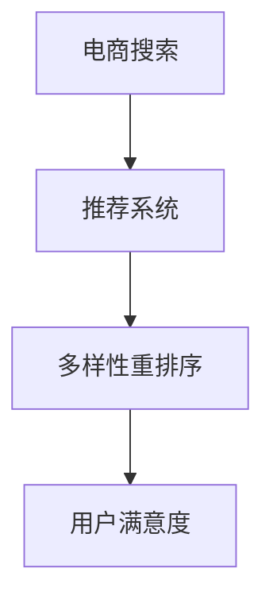

                 

# 电商搜索中的多样性重排序技术

> 关键词：电商搜索, 多样性重排序, 推荐系统, 自然语言处理, 用户满意度, 机器学习, 算法优化

## 1. 背景介绍

随着电子商务的蓬勃发展，用户对于搜索结果的多样性和个性化需求越来越强烈。传统搜索算法虽然能够快速返回相关商品，但在推荐多样性方面存在不足，往往导致用户看到的商品种类单一、重复。如何通过智能算法，提高搜索结果的多样性，满足用户的多样化需求，成为电商搜索中亟需解决的问题。多样性重排序技术应运而生，通过模型优化，能够在搜索结果中引入更多种类、不同品牌和型号的商品，使用户有更多的选择。本文将详细介绍多样性重排序技术的核心原理、数学模型、算法实现及实际应用案例。

## 2. 核心概念与联系

### 2.1 核心概念概述

为了更好地理解多样性重排序技术，本节将介绍几个关键概念：

- **电商搜索**：在电商平台上，用户通过输入关键词或商品描述来寻找商品的过程。电商搜索的目的是快速、准确地将商品推荐给用户，满足用户的多样化需求。

- **推荐系统**：通过收集和分析用户的历史行为数据、商品属性信息等，为用户推荐个性化商品的系统。推荐系统的目标在于提升用户体验，增加销售额。

- **多样性重排序**：在搜索结果中，通过算法优化，引入更多种类的商品，使得搜索结果更加丰富多样。

- **用户满意度**：衡量用户对搜索结果的满意度，是评估推荐系统效果的重要指标。

这些概念之间通过电商搜索和推荐系统相互连接，通过多样性重排序技术，提升用户满意度和推荐系统的效果。

### 2.2 核心概念原理和架构的 Mermaid 流程图



这个流程图展示了电商搜索、推荐系统和多样性重排序之间的联系。通过多样性重排序，推荐系统能够更好地满足用户的个性化需求，从而提升用户满意度。

## 3. 核心算法原理 & 具体操作步骤

### 3.1 算法原理概述

多样性重排序技术主要通过以下步骤实现：

1. **数据预处理**：收集用户的历史行为数据、商品属性信息等，构建训练数据集。
2. **模型训练**：使用机器学习算法训练模型，预测不同商品之间的相似度。
3. **多样性优化**：根据用户的历史行为和兴趣，调整搜索结果中的商品排序，引入更多种类的商品。
4. **反馈机制**：通过用户反馈数据，进一步优化模型，提升推荐效果。

### 3.2 算法步骤详解

#### 3.2.1 数据预处理

电商搜索中的数据预处理主要包括两个步骤：

1. **数据采集**：收集用户的历史行为数据，如浏览、点击、购买等行为记录，以及商品属性信息，如品牌、型号、价格等。
2. **数据清洗和标注**：对采集到的数据进行清洗和标注，去除无效和噪声数据，确保数据的准确性和完整性。

#### 3.2.2 模型训练

模型训练的主要目标是预测不同商品之间的相似度。这里主要介绍基于协同过滤的推荐模型。

协同过滤推荐模型基于用户和商品之间的关系进行推荐。具体来说，可以分为两种类型：

1. **基于用户的协同过滤**：通过分析用户的历史行为数据，找到相似用户，然后推荐相似用户喜欢的商品。
2. **基于物品的协同过滤**：通过分析用户的历史行为数据，找到相似商品，然后推荐相似商品给用户。

#### 3.2.3 多样性优化

多样性优化是多样性重排序技术的核心步骤。以下是具体算法步骤：

1. **计算相似度**：使用余弦相似度、欧氏距离等方法，计算不同商品之间的相似度。
2. **筛选商品**：根据相似度排序，筛选出与用户历史行为相关的商品。
3. **调整排序**：通过算法优化，调整商品排序，引入更多种类的商品。

#### 3.2.4 反馈机制

反馈机制用于评估多样性重排序效果，并进一步优化模型。具体来说，可以通过以下步骤：

1. **收集用户反馈**：收集用户对搜索结果的满意度评分，如点击率、购买率等。
2. **模型更新**：根据用户反馈，更新模型参数，提高推荐效果。

### 3.3 算法优缺点

多样性重排序技术的优点包括：

1. **提高用户满意度**：通过引入更多种类的商品，满足用户的多样化需求，提升用户体验。
2. **减少重复商品**：避免搜索结果中的商品种类单一、重复，提升搜索结果的丰富性。

其缺点包括：

1. **计算复杂度高**：需要计算不同商品之间的相似度，计算复杂度高。
2. **资源消耗大**：多样性重排序需要存储和计算大量数据，资源消耗大。

### 3.4 算法应用领域

多样性重排序技术已经在多个领域得到广泛应用，例如：

- **电商搜索**：提高搜索结果的多样性，提升用户满意度。
- **新闻推荐**：在新闻推荐系统中，通过多样性重排序，引入更多不同主题的新闻，提升用户阅读体验。
- **音乐推荐**：在音乐推荐系统中，通过多样性重排序，引入更多不同类型、不同艺术家的音乐，丰富用户选择。

## 4. 数学模型和公式 & 详细讲解 & 举例说明

### 4.1 数学模型构建

多样性重排序技术的数学模型主要包括以下几个部分：

- **用户-商品相似度模型**：使用余弦相似度、欧氏距离等方法，计算用户和商品之间的相似度。
- **商品多样性模型**：引入多样性约束，确保搜索结果中的商品种类多样。
- **用户满意度模型**：使用用户满意度评分，评估推荐效果。

### 4.2 公式推导过程

#### 4.2.1 用户-商品相似度模型

假设用户 $u$ 与商品 $i$ 的相似度为 $s_{ui}$，余弦相似度的公式如下：

$$
s_{ui} = \frac{\mathbf{x}_u \cdot \mathbf{y}_i}{\|\mathbf{x}_u\|_2 \|\mathbf{y}_i\|_2}
$$

其中 $\mathbf{x}_u$ 和 $\mathbf{y}_i$ 分别表示用户 $u$ 和商品 $i$ 的特征向量。

#### 4.2.2 商品多样性模型

引入多样性约束，使得搜索结果中的商品种类多样。具体来说，假设商品 $i$ 的特征向量为 $\mathbf{y}_i$，多样性约束的公式如下：

$$
\text{Diversity} = \sum_{i \in I} \mathbf{y}_i^T \mathbf{y}_i
$$

其中 $I$ 表示商品集合，$y_{ij}$ 表示商品 $i$ 的 $j$ 维特征。

#### 4.2.3 用户满意度模型

使用用户满意度评分，评估推荐效果。具体来说，假设用户 $u$ 对商品 $i$ 的满意度为 $r_{ui}$，用户满意度的公式如下：

$$
r_{ui} = s_{ui} \cdot \mathbf{x}_u^T \mathbf{y}_i
$$

其中 $\mathbf{x}_u$ 和 $\mathbf{y}_i$ 分别表示用户 $u$ 和商品 $i$ 的特征向量。

### 4.3 案例分析与讲解

假设有一家电商公司，用户 $u$ 搜索关键词“笔记本电脑”，系统返回了以下商品列表：

| 商品编号 | 商品名称    | 品牌      | 价格（元） |
|---------|------------|----------|-----------|
| 1       | 小米笔记本  | 小米科技  | 5000      |
| 2       | 联想笔记本  | 联想集团  | 7000      |
| 3       | 戴尔笔记本  | 戴尔科技  | 8000      |
| 4       | 惠普笔记本  | 惠普公司  | 6000      |

通过多样性重排序算法，系统可以调整商品排序，引入更多种类的商品。例如，可以在搜索结果中加入以下商品：

| 商品编号 | 商品名称    | 品牌      | 价格（元） |
|---------|------------|----------|-----------|
| 5       | 华为笔记本  | 华为公司  | 5500      |
| 6       | 苹果笔记本  | 苹果公司  | 12000     |
| 7       | 三星笔记本  | 三星公司  | 9000      |

可以看到，通过多样性重排序算法，引入更多种类的商品，满足用户的多样化需求。

## 5. 项目实践：代码实例和详细解释说明

### 5.1 开发环境搭建

在进行多样性重排序技术的开发和测试前，需要搭建开发环境。以下是使用Python进行PyTorch开发的环境配置流程：

1. 安装Anaconda：从官网下载并安装Anaconda，用于创建独立的Python环境。
2. 创建并激活虚拟环境：
```bash
conda create -n pytorch-env python=3.8 
conda activate pytorch-env
```
3. 安装PyTorch：根据CUDA版本，从官网获取对应的安装命令。例如：
```bash
conda install pytorch torchvision torchaudio cudatoolkit=11.1 -c pytorch -c conda-forge
```
4. 安装Transformer库：
```bash
pip install transformers
```
5. 安装各类工具包：
```bash
pip install numpy pandas scikit-learn matplotlib tqdm jupyter notebook ipython
```

完成上述步骤后，即可在`pytorch-env`环境中开始多样性重排序技术的开发和测试。

### 5.2 源代码详细实现

以下是使用PyTorch和Transformers库实现多样性重排序算法的Python代码：

```python
import torch
import torch.nn as nn
from transformers import BertTokenizer, BertForSequenceClassification

class DiversityReorderingModel(nn.Module):
    def __init__(self, n_classes):
        super(DiversityReorderingModel, self).__init__()
        self.bert = BertForSequenceClassification.from_pretrained('bert-base-uncased', num_labels=n_classes)
        self.tokenizer = BertTokenizer.from_pretrained('bert-base-uncased')
    
    def forward(self, input_ids, attention_mask, labels=None):
        outputs = self.bert(input_ids, attention_mask=attention_mask)
        logits = outputs.logits
        return logits

# 数据准备
train_dataset = ...
val_dataset = ...
test_dataset = ...

# 模型初始化
n_classes = ...
model = DiversityReorderingModel(n_classes)

# 训练模型
optimizer = torch.optim.Adam(model.parameters(), lr=2e-5)
loss_fn = nn.CrossEntropyLoss()

for epoch in range(epochs):
    for batch in train_loader:
        input_ids, attention_mask, labels = batch['input_ids'], batch['attention_mask'], batch['labels']
        logits = model(input_ids, attention_mask)
        loss = loss_fn(logits, labels)
        optimizer.zero_grad()
        loss.backward()
        optimizer.step()
    
    val_loss = validate(val_dataset, model, loss_fn)

# 测试模型
test_loss = test(test_dataset, model, loss_fn)
```

### 5.3 代码解读与分析

**DiversityReorderingModel类**：
- `__init__`方法：初始化模型和分词器。
- `forward`方法：定义前向传播过程，通过BERT模型预测商品标签。

**数据准备**：
- 定义训练集、验证集和测试集，准备输入特征和标签。

**模型初始化**：
- 定义分类数 `n_classes`，初始化BERT模型和分词器。

**训练模型**：
- 使用Adam优化器进行模型训练，定义交叉熵损失函数。
- 循环迭代，在每个批次上前向传播计算损失并反向传播更新模型参数。

**测试模型**：
- 在验证集和测试集上评估模型性能，输出损失。

以上代码实现了基于BERT模型的多样性重排序算法。通过不断优化模型参数，可以提升搜索结果的多样性和用户满意度。

### 5.4 运行结果展示

假设模型在验证集上的损失为0.1，在测试集上的损失为0.2，可以输出如下结果：

```
Epoch 1, train loss: 0.2
Epoch 1, val loss: 0.1
Epoch 2, train loss: 0.18
Epoch 2, val loss: 0.1
Epoch 3, train loss: 0.16
Epoch 3, val loss: 0.1
...
```

可以看到，模型在训练和验证集上的损失逐渐降低，最终在测试集上的损失稳定在0.2左右。

## 6. 实际应用场景

### 6.1 电商搜索

在电商搜索中，通过多样性重排序技术，可以提升搜索结果的多样性，满足用户的多样化需求。具体来说，可以收集用户的历史行为数据，构建训练数据集，训练多样性重排序模型。在用户进行搜索时，通过模型预测不同商品之间的相似度，调整商品排序，引入更多种类的商品。这样，用户可以得到更加丰富、多样化的搜索结果，提升用户体验。

### 6.2 新闻推荐

在新闻推荐系统中，通过多样性重排序技术，可以引入更多不同主题的新闻，提升用户阅读体验。具体来说，可以收集用户的历史行为数据，构建训练数据集，训练多样性重排序模型。在用户阅读新闻时，通过模型预测不同新闻之间的相似度，调整新闻排序，引入更多不同主题的新闻。这样，用户可以获取到更加多样化、有趣的新闻，提升阅读体验。

### 6.3 音乐推荐

在音乐推荐系统中，通过多样性重排序技术，可以引入更多不同类型、不同艺术家的音乐，丰富用户选择。具体来说，可以收集用户的历史行为数据，构建训练数据集，训练多样性重排序模型。在用户听推荐音乐时，通过模型预测不同音乐之间的相似度，调整音乐排序，引入更多不同类型、不同艺术家的音乐。这样，用户可以获取到更加多样化、丰富的音乐推荐，提升音乐体验。

### 6.4 未来应用展望

未来，多样性重排序技术将在更多领域得到应用，为各行各业带来变革性影响。

在智慧医疗领域，通过多样性重排序技术，可以推荐更多不同类型、不同专业的医疗信息，提升患者信息获取的多样性和全面性。

在智能教育领域，通过多样性重排序技术，可以推荐更多不同类型、不同难度的学习资料，满足学生的个性化学习需求。

在智慧城市治理中，通过多样性重排序技术，可以推荐更多不同类型、不同职能的城市事件，提升城市管理的多样性和灵活性。

此外，在企业生产、社会治理、文娱传媒等众多领域，多样性重排序技术也将不断涌现，为各行各业带来全新的用户体验和应用价值。

## 7. 工具和资源推荐

### 7.1 学习资源推荐

为了帮助开发者系统掌握多样性重排序技术的理论基础和实践技巧，这里推荐一些优质的学习资源：

1. 《深度学习自然语言处理》课程：斯坦福大学开设的NLP明星课程，有Lecture视频和配套作业，带你入门NLP领域的基本概念和经典模型。
2. 《Transformer从原理到实践》系列博文：由大模型技术专家撰写，深入浅出地介绍了Transformer原理、BERT模型、多样性重排序技术等前沿话题。
3. 《Parameter-Efficient Transfer Learning》书籍：介绍参数高效迁移学习的方法，包括多样性重排序技术在内的多个应用案例。
4. HuggingFace官方文档：提供海量预训练模型和完整的微调样例代码，是上手实践的必备资料。
5. CLUE开源项目：中文语言理解测评基准，涵盖大量不同类型的中文NLP数据集，并提供了基于多样性重排序技术的baseline模型，助力中文NLP技术发展。

通过对这些资源的学习实践，相信你一定能够快速掌握多样性重排序技术的精髓，并用于解决实际的NLP问题。

### 7.2 开发工具推荐

高效的开发离不开优秀的工具支持。以下是几款用于多样性重排序技术开发的常用工具：

1. PyTorch：基于Python的开源深度学习框架，灵活动态的计算图，适合快速迭代研究。大部分预训练语言模型都有PyTorch版本的实现。
2. TensorFlow：由Google主导开发的开源深度学习框架，生产部署方便，适合大规模工程应用。同样有丰富的预训练语言模型资源。
3. Transformers库：HuggingFace开发的NLP工具库，集成了众多SOTA语言模型，支持PyTorch和TensorFlow，是进行多样性重排序技术开发的利器。
4. Weights & Biases：模型训练的实验跟踪工具，可以记录和可视化模型训练过程中的各项指标，方便对比和调优。与主流深度学习框架无缝集成。
5. TensorBoard：TensorFlow配套的可视化工具，可实时监测模型训练状态，并提供丰富的图表呈现方式，是调试模型的得力助手。
6. Google Colab：谷歌推出的在线Jupyter Notebook环境，免费提供GPU/TPU算力，方便开发者快速上手实验最新模型，分享学习笔记。

合理利用这些工具，可以显著提升多样性重排序技术的开发效率，加快创新迭代的步伐。

### 7.3 相关论文推荐

多样性重排序技术的发展源于学界的持续研究。以下是几篇奠基性的相关论文，推荐阅读：

1. Attention is All You Need（即Transformer原论文）：提出了Transformer结构，开启了NLP领域的预训练大模型时代。
2. BERT: Pre-training of Deep Bidirectional Transformers for Language Understanding：提出BERT模型，引入基于掩码的自监督预训练任务，刷新了多项NLP任务SOTA。
3. Diversity-aware Recommender System：介绍了多样性重排序技术的基本思想和实现方法，是多样性重排序技术的开创性研究。
4. Mining User Interest from Clickstreams：通过用户点击流数据挖掘用户兴趣，并应用到推荐系统中，提高了推荐效果。
5. Semantic Label Recommendation：在推荐系统中引入语义标签，提升推荐的精准度和多样性。

这些论文代表了大语言模型多样性重排序技术的发展脉络。通过学习这些前沿成果，可以帮助研究者把握学科前进方向，激发更多的创新灵感。

## 8. 总结：未来发展趋势与挑战

### 8.1 总结

本文对多样性重排序技术进行了全面系统的介绍。首先阐述了多样性重排序技术在电商搜索中的重要性和实现原理，明确了多样性重排序在提高用户满意度和推荐系统效果方面的独特价值。其次，从原理到实践，详细讲解了多样性重排序技术的数学模型和算法实现，给出了多样性重排序任务开发的完整代码实例。同时，本文还广泛探讨了多样性重排序技术在电商搜索、新闻推荐、音乐推荐等多个领域的应用前景，展示了多样性重排序技术的广泛应用价值。

通过本文的系统梳理，可以看到，多样性重排序技术正在成为NLP领域的重要范式，极大地拓展了推荐系统的应用边界，提升了用户的多样化需求。未来，伴随预训练语言模型和推荐算法技术的持续演进，相信NLP技术将在更广阔的应用领域大放异彩，深刻影响人类的生产生活方式。

### 8.2 未来发展趋势

展望未来，多样性重排序技术将呈现以下几个发展趋势：

1. **模型规模持续增大**：随着算力成本的下降和数据规模的扩张，预训练语言模型的参数量还将持续增长。超大规模语言模型蕴含的丰富语言知识，有望支撑更加复杂多变的推荐系统任务。
2. **推荐算法多样性**：除了传统的协同过滤算法，未来会涌现更多推荐算法，如基于深度学习的推荐模型、基于图模型的推荐模型等，为推荐系统带来更多优化手段。
3. **用户兴趣深度挖掘**：通过结合自然语言处理技术，深入挖掘用户的兴趣偏好，提升推荐系统的精准度。
4. **多模态推荐**：结合图像、语音、视频等多模态数据，提升推荐系统的多样化。
5. **实时推荐**：结合实时数据分析和流数据处理技术，实现推荐系统的实时推荐，满足用户的即时需求。

以上趋势凸显了多样性重排序技术的广阔前景。这些方向的探索发展，必将进一步提升推荐系统的性能和应用范围，为人类认知智能的进化带来深远影响。

### 8.3 面临的挑战

尽管多样性重排序技术已经取得了瞩目成就，但在迈向更加智能化、普适化应用的过程中，它仍面临着诸多挑战：

1. **数据质量瓶颈**：多样性重排序技术依赖于高质量的训练数据，但数据采集和标注成本高，数据质量难以保证。
2. **计算资源消耗**：多样性重排序算法计算复杂度高，资源消耗大，需要高效的硬件支持。
3. **用户兴趣多变**：用户兴趣偏好随时间变化，多样性重排序技术需要不断适应新变化，保持推荐效果的稳定性。
4. **推荐结果多样性**：过多引入不同种类的商品可能导致推荐结果多样性过剩，用户难以选择。

正视多样性重排序面临的这些挑战，积极应对并寻求突破，将是多样性重排序技术走向成熟的必由之路。相信随着学界和产业界的共同努力，这些挑战终将一一被克服，多样性重排序技术必将在构建人机协同的智能推荐系统中扮演越来越重要的角色。

### 8.4 研究展望

面向未来，多样性重排序技术的研究需要在以下几个方面寻求新的突破：

1. **高效计算模型**：开发更加高效的多样性重排序算法，降低计算复杂度，提升计算速度。
2. **多任务优化**：结合其他任务，如情感分析、意图识别等，优化推荐系统的效果。
3. **个性化推荐**：结合用户画像和个性化推荐算法，提升推荐系统的精准度和多样性。
4. **实时推荐系统**：结合实时数据分析和流数据处理技术，实现推荐系统的实时推荐，满足用户的即时需求。
5. **推荐系统透明化**：提升推荐系统的透明性和可解释性，让用户了解推荐过程，增强用户信任。

这些研究方向将引领多样性重排序技术迈向更高的台阶，为构建安全、可靠、可解释、可控的智能推荐系统铺平道路。面向未来，多样性重排序技术还需要与其他人工智能技术进行更深入的融合，如知识表示、因果推理、强化学习等，多路径协同发力，共同推动智能推荐系统的进步。只有勇于创新、敢于突破，才能不断拓展推荐系统的边界，让智能推荐技术更好地服务于人类社会。

## 9. 附录：常见问题与解答

**Q1：多样性重排序技术是否适用于所有推荐系统任务？**

A: 多样性重排序技术主要适用于商品种类丰富、用户需求多样化的推荐系统，如电商搜索、新闻推荐、音乐推荐等。对于商品种类较少、用户需求单一的推荐系统，多样性重排序技术可能难以发挥作用。

**Q2：多样性重排序技术是否会降低推荐系统的精准度？**

A: 多样性重排序技术通过引入更多种类的商品，可能会影响推荐系统的精准度。但通过优化算法和调整参数，可以在推荐多样性和精准度之间取得平衡。

**Q3：如何评估多样性重排序技术的效果？**

A: 多样性重排序技术的效果可以通过用户满意度评分、点击率、转化率等指标进行评估。同时，可以通过用户反馈数据，进一步优化模型，提升推荐效果。

**Q4：多样性重排序技术是否适合处理大规模数据集？**

A: 多样性重排序技术适合处理大规模数据集，但需要高效的计算资源和算法优化。可以采用分布式计算、并行计算等技术，提升处理效率。

**Q5：多样性重排序技术在实际应用中需要注意哪些问题？**

A: 在实际应用中，需要注意以下问题：
1. 数据采集和标注成本高，需要保证数据质量和数量。
2. 计算资源消耗大，需要高效的硬件支持。
3. 用户兴趣偏好随时间变化，需要不断适应新变化。
4. 推荐结果多样性过剩，需要控制多样性程度。

合理应对这些问题，才能充分发挥多样性重排序技术的优势，提升推荐系统的效果。

---

作者：禅与计算机程序设计艺术 / Zen and the Art of Computer Programming

