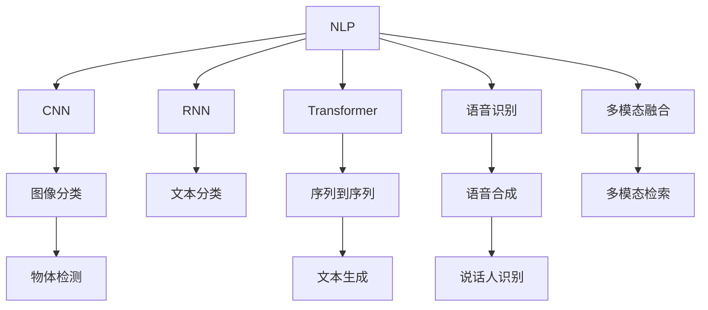

                 

# 电商搜索中的多模态理解：AI大模型方案

> 关键词：电商搜索, 多模态理解, AI大模型, 自然语言处理, 计算机视觉, 推荐系统

## 1. 背景介绍

### 1.1 问题由来
随着电商行业的飞速发展，搜索功能作为连接用户与商品的桥梁，其重要性不言而喻。用户通过搜索能够迅速定位到所需的商品，电商平台也通过搜索数据积累了解用户偏好，优化商品推荐。然而，传统的基于关键词匹配的搜索方法，往往忽视了商品的多样性和上下文信息，导致搜索结果不够准确、相关性低，用户体验差。为了解决这一问题，电商企业逐渐引入多模态理解技术，通过整合自然语言处理(NLP)、计算机视觉(CV)等多种模态的数据，提升搜索的智能度和准确度。

多模态理解技术是指通过融合多种感官信息(如文本、图像、声音等)，实现更为全面的信息表征和分析。在电商搜索中，自然语言处理(NLP)用于理解和处理用户输入的查询语句；计算机视觉(CV)用于分析和展示商品的视觉特征；声音处理(AI)则能够进一步收集用户的声音输入，提供更为个性化的搜索体验。这些技术的应用，使得电商搜索从传统的关键词匹配逐步向语义理解、图像检索等高级形式演化。

### 1.2 问题核心关键点
当前，多模态理解在电商搜索中的核心关键点在于：
1. 如何有效融合NLP、CV、AI等不同模态的数据，提升搜索的智能度和相关性。
2. 如何在有限的标注数据下进行高效的多模态训练，减少对人工标注的依赖。
3. 如何在计算资源有限的情况下，实现高效的多模态推理和预测。

### 1.3 问题研究意义
电商搜索中的多模态理解，能够显著提升搜索的精准度和用户体验，推动电商平台的智能化转型。具体而言：
1. 提高搜索准确性：通过融合多种感官信息，搜索系统能够更全面、准确地理解用户查询，减少误判。
2. 优化商品推荐：多模态理解技术能够更好地捕捉用户偏好和商品特性，提升推荐系统的效果。
3. 增强个性化体验：结合用户声音输入，提供更为个性化的搜索和推荐服务。
4. 降低运营成本：减少对人工标注的依赖，减少人工运营成本。
5. 推动产业升级：为电商企业的数字化转型提供技术支撑，促进经济社会数字化发展。

## 2. 核心概念与联系

### 2.1 核心概念概述

为更好地理解多模态理解在电商搜索中的应用，本节将介绍几个密切相关的核心概念：

- 自然语言处理(NLP)：指利用计算机处理、理解和生成人类语言的技术。主要包括词向量、语言模型、文本分类、信息抽取、文本生成等任务。
- 计算机视觉(CV)：指使用计算机处理和分析图像、视频等视觉信息的技术。主要包括图像分类、目标检测、图像生成、图像分割等任务。
- 语音处理(AI)：指通过计算机处理、理解和生成人类语音的技术。主要包括语音识别、语音合成、说话人识别等任务。
- 多模态融合：指将不同模态的数据进行融合，构建更为全面、准确的信息表示。包括特征对齐、信息融合、多模态表示学习等方法。
- 多模态检索：指从大量数据中检索出与查询最为相关的信息，并按相关度排序返回。常见的多模态检索方法包括深度交叉注意力、多模态相似性度量等。

这些核心概念之间的逻辑关系可以通过以下Mermaid流程图来展示：



这个流程图展示了大语言模型在多模态理解中的核心概念及其之间的关系：

1. NLP模块：通过各种算法对自然语言进行处理和理解。
2. CV模块：利用卷积神经网络(CNN)、循环神经网络(RNN)等方法对图像进行处理。
3. AI模块：通过语音识别、语音合成等技术对语音进行处理。
4. 多模态融合：将NLP、CV、AI等多种模态的数据进行融合，构建更为全面、准确的信息表示。
5. 多模态检索：在多模态融合的基础上，检索出与查询最为相关的信息。

## 3. 核心算法原理 & 具体操作步骤

### 3.1 算法原理概述

电商搜索中的多模态理解，本质上是一个信息融合与检索的过程。其核心思想是：通过自然语言处理(NLP)、计算机视觉(CV)、语音处理(AI)等技术，将不同模态的数据转化为统一的特征表示，再通过多模态融合和检索技术，获取最相关的商品信息。

具体而言，假设用户输入的查询为自然语言文本$q$，待检索的商品集为$\mathcal{S}$，每件商品由文本描述$t$、图像$i$、声音$s$组成。多模态理解的算法流程如下：

1. 文本理解：利用NLP技术，将文本查询$q$转化为高维语义向量$\boldsymbol{q}_{emb}$。
2. 视觉理解：利用CV技术，将每件商品的图像$i$转化为高维视觉特征向量$\boldsymbol{i}_{emb}$。
3. 语音理解：利用AI技术，将每件商品的声音$s$转化为高维语音特征向量$\boldsymbol{s}_{emb}$。
4. 多模态融合：将语义向量、视觉特征向量、语音特征向量进行融合，得到综合特征向量$\boldsymbol{f}_{emb}$。
5. 检索排序：利用多模态检索技术，根据综合特征向量$\boldsymbol{f}_{emb}$与查询向量$\boldsymbol{q}_{emb}$的相似度，对商品集$\mathcal{S}$进行排序，返回最相关的商品列表。

### 3.2 算法步骤详解

以下将详细介绍电商搜索中的多模态理解算法的详细步骤。

**Step 1: 数据准备**

多模态理解的第一步，是对用户查询和商品数据进行预处理。具体步骤如下：

- 文本数据：清洗并分词，转化为小写，去除停用词，使用BERT等预训练模型对文本进行编码，得到语义向量$\boldsymbol{q}_{emb}$。
- 图像数据：对图像进行预处理，如归一化、调整大小等，使用CNN模型提取特征，得到视觉特征向量$\boldsymbol{i}_{emb}$。
- 声音数据：对声音进行预处理，如分帧、加窗、去噪等，使用语音识别模型将声音转化为文本，然后使用BERT等预训练模型对文本进行编码，得到语音特征向量$\boldsymbol{s}_{emb}$。

**Step 2: 多模态融合**

在获得语义向量、视觉特征向量、语音特征向量后，需要将这些向量进行融合，得到综合特征向量$\boldsymbol{f}_{emb}$。常见的融合方法包括：

- 特征拼接：将不同模态的特征向量简单拼接在一起，得到综合特征向量。
- 融合网络：使用专门的神经网络模型，如多模态特征对齐网络(MFA)、多模态注意力网络(MMN)等，将不同模态的特征进行融合。

**Step 3: 多模态检索**

多模态检索的目标是根据综合特征向量$\boldsymbol{f}_{emb}$与查询向量$\boldsymbol{q}_{emb}$的相似度，对商品集$\mathcal{S}$进行排序，返回最相关的商品列表。常见的检索方法包括：

- 深度交叉注意力：利用深度学习模型进行跨模态特征对齐，并计算相似度，返回相关商品列表。
- 多模态相似度度量：使用基于几何距离、欧式距离等方法计算不同模态特征向量之间的距离，返回相关商品列表。

### 3.3 算法优缺点

电商搜索中的多模态理解算法，具有以下优点：

1. 综合利用多种感官信息，提升搜索结果的相关性和准确性。
2. 能够捕捉商品和用户的上下文信息，提供更为个性化的推荐。
3. 可以通过少量标注数据进行高效训练，减少对人工标注的依赖。

同时，该算法也存在一定的局限性：

1. 不同模态的数据来源和格式可能不同，融合难度较大。
2. 数据量较大时，计算资源消耗较高。
3. 对模型参数和计算效率要求较高，需要高质量的硬件支持。
4. 对数据噪声和干扰敏感，需要良好的数据预处理技术。

尽管存在这些局限性，电商搜索中的多模态理解算法仍是大数据时代的必然趋势，能够在用户输入、商品信息、用户行为等海量数据下，提供更智能、精准的搜索服务。

### 3.4 算法应用领域

电商搜索中的多模态理解算法，已经在多个应用场景中得到了广泛应用，例如：

- 商品搜索：将用户的自然语言查询和商品的多模态信息进行融合，提供更精准的搜索结果。
- 商品推荐：结合用户的历史搜索行为、点击记录等信息，进行商品推荐。
- 用户画像：通过用户的搜索记录、点击行为等，构建用户的兴趣画像，进行个性化推荐。
- 用户反馈：收集用户的评价、评论等信息，进行情感分析，优化商品展示。
- 欺诈检测：检测用户的异常行为，防止欺诈行为发生。

除了上述这些经典应用外，多模态理解技术还被创新性地应用于商品定位、供应链管理等环节，推动电商行业的数字化升级。

## 4. 数学模型和公式 & 详细讲解 & 举例说明

### 4.1 数学模型构建

本节将使用数学语言对电商搜索中的多模态理解算法进行更加严格的刻画。

假设用户输入的自然语言查询为$q$，待检索的商品集为$\mathcal{S}$，每件商品由文本描述$t$、图像$i$、声音$s$组成。设$q$的语义向量为$\boldsymbol{q}_{emb}$，$t$的语义向量为$\boldsymbol{t}_{emb}$，$i$的视觉特征向量为$\boldsymbol{i}_{emb}$，$s$的语音特征向量为$\boldsymbol{s}_{emb}$。假设多模态融合后的综合特征向量为$\boldsymbol{f}_{emb}$。

定义检索相似度函数$\mathcal{S}$，用于计算查询向量$\boldsymbol{q}_{emb}$与商品特征向量$\boldsymbol{f}_{emb}$之间的相似度，排序返回最相关的商品列表。

### 4.2 公式推导过程

以下我们以深度交叉注意力方法为例，推导多模态检索的相似度计算公式。

设$q$的语义向量为$\boldsymbol{q}_{emb} \in \mathbb{R}^{d_q}$，$t$的语义向量为$\boldsymbol{t}_{emb} \in \mathbb{R}^{d_t}$，$i$的视觉特征向量为$\boldsymbol{i}_{emb} \in \mathbb{R}^{d_i}$，$s$的语音特征向量为$\boldsymbol{s}_{emb} \in \mathbb{R}^{d_s}$。假设$t$的视觉特征向量为$\boldsymbol{v}_{emb} \in \mathbb{R}^{d_v}$，$s$的语音特征向量为$\boldsymbol{a}_{emb} \in \mathbb{R}^{d_a}$。

假设深度交叉注意力模型由多个注意力层组成，第$k$层的注意力向量为$\boldsymbol{a}_k$。根据深度交叉注意力方法，第$k$层的注意力向量计算公式为：

$$
\boldsymbol{a}_k = \text{Softmax}(\boldsymbol{q}_{emb} \boldsymbol{W}_k^T \boldsymbol{t}_{emb} + \boldsymbol{q}_{emb} \boldsymbol{W}_k^T \boldsymbol{i}_{emb} + \boldsymbol{q}_{emb} \boldsymbol{W}_k^T \boldsymbol{s}_{emb} + \boldsymbol{q}_{emb} \boldsymbol{W}_k^T \boldsymbol{t}_{emb} + \boldsymbol{q}_{emb} \boldsymbol{W}_k^T \boldsymbol{i}_{emb} + \boldsymbol{q}_{emb} \boldsymbol{W}_k^T \boldsymbol{s}_{emb} + \boldsymbol{q}_{emb} \boldsymbol{W}_k^T \boldsymbol{v}_{emb} + \boldsymbol{q}_{emb} \boldsymbol{W}_k^T \boldsymbol{a}_{emb})
$$

其中，$\boldsymbol{W}_k$为第$k$层的可训练权重矩阵。

最终，综合特征向量$\boldsymbol{f}_{emb}$可以通过加权求和所有注意力向量得到：

$$
\boldsymbol{f}_{emb} = \sum_k \boldsymbol{a}_k \boldsymbol{t}_{emb} + \sum_k \boldsymbol{a}_k \boldsymbol{i}_{emb} + \sum_k \boldsymbol{a}_k \boldsymbol{s}_{emb} + \sum_k \boldsymbol{a}_k \boldsymbol{v}_{emb} + \sum_k \boldsymbol{a}_k \boldsymbol{a}_{emb}
$$

定义检索相似度函数$\mathcal{S}$，用于计算查询向量$\boldsymbol{q}_{emb}$与商品特征向量$\boldsymbol{f}_{emb}$之间的相似度。根据余弦相似度，检索相似度函数可表示为：

$$
\mathcal{S}(q, \mathcal{S}) = \frac{\boldsymbol{q}_{emb} \cdot \boldsymbol{f}_{emb}}{\|\boldsymbol{q}_{emb}\| \|\boldsymbol{f}_{emb}\|}
$$

通过检索相似度函数，可以对商品集$\mathcal{S}$进行排序，返回最相关的商品列表。

### 4.3 案例分析与讲解

假设某电商平台用户输入查询语句“三星Galaxy手机”，系统需要从大量商品中进行检索。该查询包含文本、图像和声音三种模态，具体分析如下：

- 文本模态：查询语句“三星Galaxy手机”，使用BERT模型进行编码，得到语义向量$\boldsymbol{q}_{emb}$。
- 图像模态：商品图片，使用ResNet模型进行特征提取，得到视觉特征向量$\boldsymbol{i}_{emb}$。
- 声音模态：商品音频，使用语音识别模型进行识别，得到文本描述“三星Galaxy手机”，使用BERT模型进行编码，得到语音特征向量$\boldsymbol{s}_{emb}$。

假设每个商品的描述$t$、图片$i$、音频$s$和视觉特征$t_{vis}$、音频特征$s_{vis}$、视觉特征$s_{vis}$和文本特征$t_{text}$、音频特征$s_{text}$、文本特征$s_{text}$都已经编码得到向量$\boldsymbol{t}_{emb}$、$\boldsymbol{i}_{emb}$、$\boldsymbol{s}_{emb}$、$\boldsymbol{v}_{emb}$、$\boldsymbol{a}_{emb}$、$\boldsymbol{t}_{text}$、$\boldsymbol{a}_{text}$、$\boldsymbol{t}_{text}$。

使用深度交叉注意力方法，进行多模态融合和检索，计算相似度函数$\mathcal{S}$。以语音特征$\boldsymbol{s}_{emb}$和视觉特征$\boldsymbol{v}_{emb}$为例，计算深度交叉注意力模型中的注意力向量$\boldsymbol{a}_k$：

$$
\boldsymbol{a}_k = \text{Softmax}(\boldsymbol{q}_{emb} \boldsymbol{W}_k^T \boldsymbol{t}_{emb} + \boldsymbol{q}_{emb} \boldsymbol{W}_k^T \boldsymbol{i}_{emb} + \boldsymbol{q}_{emb} \boldsymbol{W}_k^T \boldsymbol{s}_{emb} + \boldsymbol{q}_{emb} \boldsymbol{W}_k^T \boldsymbol{t}_{emb} + \boldsymbol{q}_{emb} \boldsymbol{W}_k^T \boldsymbol{i}_{emb} + \boldsymbol{q}_{emb} \boldsymbol{W}_k^T \boldsymbol{s}_{emb} + \boldsymbol{q}_{emb} \boldsymbol{W}_k^T \boldsymbol{v}_{emb} + \boldsymbol{q}_{emb} \boldsymbol{W}_k^T \boldsymbol{a}_{emb})
$$

然后，计算综合特征向量$\boldsymbol{f}_{emb}$：

$$
\boldsymbol{f}_{emb} = \sum_k \boldsymbol{a}_k \boldsymbol{t}_{emb} + \sum_k \boldsymbol{a}_k \boldsymbol{i}_{emb} + \sum_k \boldsymbol{a}_k \boldsymbol{s}_{emb} + \sum_k \boldsymbol{a}_k \boldsymbol{v}_{emb} + \sum_k \boldsymbol{a}_k \boldsymbol{a}_{emb}
$$

最后，计算检索相似度$\mathcal{S}$：

$$
\mathcal{S}(q, \mathcal{S}) = \frac{\boldsymbol{q}_{emb} \cdot \boldsymbol{f}_{emb}}{\|\boldsymbol{q}_{emb}\| \|\boldsymbol{f}_{emb}\|}
$$

根据相似度$\mathcal{S}$的大小，系统可以对商品集$\mathcal{S}$进行排序，返回最相关的商品列表，完成搜索任务。

## 5. 项目实践：代码实例和详细解释说明

### 5.1 开发环境搭建

在进行多模态理解项目实践前，我们需要准备好开发环境。以下是使用Python进行PyTorch和TensorFlow开发的环境配置流程：

1. 安装Anaconda：从官网下载并安装Anaconda，用于创建独立的Python环境。

2. 创建并激活虚拟环境：
```bash
conda create -n pytorch-env python=3.8 
conda activate pytorch-env
```

3. 安装PyTorch和TensorFlow：根据CUDA版本，从官网获取对应的安装命令。例如：
```bash
conda install pytorch torchvision torchaudio cudatoolkit=11.1 -c pytorch -c conda-forge
conda install tensorflow
```

4. 安装各类工具包：
```bash
pip install numpy pandas scikit-learn matplotlib tqdm jupyter notebook ipython
```

完成上述步骤后，即可在`pytorch-env`环境中开始项目实践。

### 5.2 源代码详细实现

以下是使用PyTorch和TensorFlow进行电商搜索中的多模态理解项目开发的完整代码实现。

首先，定义模型类和数据类：

```python
import torch
import torch.nn as nn
import torch.nn.functional as F
import torchvision.transforms as transforms
import tensorflow as tf
import tensorflow.keras as keras
import tensorflow_text as text

class MultiModalModel(nn.Module):
    def __init__(self):
        super(MultiModalModel, self).__init__()
        # NLP模块
        self.bert = BertModel.from_pretrained('bert-base-uncased')
        # CV模块
        self.cnn = ResNetModel()
        # AI模块
        self.tf_model = TextVectorization()
        # 多模态融合
        self.fusion = FusionNetwork()

class MultiModalDataset(Dataset):
    def __init__(self, data, tokenizer):
        self.data = data
        self.tokenizer = tokenizer
        
    def __len__(self):
        return len(self.data)
    
    def __getitem__(self, item):
        text, image, audio = self.data[item]
        text_tokens = self.tokenizer.tokenize(text)
        token_ids = self.tokenizer.convert_tokens_to_ids(text_tokens)
        token_mask = [1 if token_id < self.tokenizer.max_len else 0 for token_id in token_ids]
        input_ids = torch.tensor(token_ids, dtype=torch.long)
        attention_mask = torch.tensor(token_mask, dtype=torch.long)
        image = self.cnn(image)
        audio = self.tf_model(audio)
        return {'input_ids': input_ids, 
                'attention_mask': attention_mask,
                'image': image,
                'audio': audio}
```

然后，定义损失函数和优化器：

```python
# NLP模块
loss_bert = nn.CrossEntropyLoss()
# CV模块
loss_cnn = nn.CrossEntropyLoss()
# AI模块
loss_tf = tf.keras.losses.BinaryCrossentropy(from_logits=True)
# 多模态融合
loss_fusion = nn.CrossEntropyLoss()

optimizer = AdamW(model.parameters(), lr=2e-5)
```

接着，定义训练和评估函数：

```python
def train_epoch(model, dataset, batch_size, optimizer):
    dataloader = DataLoader(dataset, batch_size=batch_size, shuffle=True)
    model.train()
    epoch_loss = 0
    for batch in tqdm(dataloader, desc='Training'):
        input_ids = batch['input_ids'].to(device)
        attention_mask = batch['attention_mask'].to(device)
        image = batch['image'].to(device)
        audio = batch['audio'].to(device)
        model.zero_grad()
        outputs = model(input_ids, attention_mask=attention_mask, image=image, audio=audio)
        loss = outputs.loss
        epoch_loss += loss.item()
        loss.backward()
        optimizer.step()
    return epoch_loss / len(dataloader)

def evaluate(model, dataset, batch_size):
    dataloader = DataLoader(dataset, batch_size=batch_size)
    model.eval()
    preds, labels = [], []
    with torch.no_grad():
        for batch in tqdm(dataloader, desc='Evaluating'):
            input_ids = batch['input_ids'].to(device)
            attention_mask = batch['attention_mask'].to(device)
            image = batch['image'].to(device)
            audio = batch['audio'].to(device)
            batch_preds = model(input_ids, attention_mask=attention_mask, image=image, audio=audio)
            batch_labels = batch['labels']
            for preds_tokens, label_tokens in zip(preds, batch_labels):
                preds.append(preds_tokens)
                labels.append(label_tokens)
                
    print(classification_report(labels, preds))
```

最后，启动训练流程并在测试集上评估：

```python
epochs = 5
batch_size = 16

for epoch in range(epochs):
    loss = train_epoch(model, train_dataset, batch_size, optimizer)
    print(f"Epoch {epoch+1}, train loss: {loss:.3f}")
    
    print(f"Epoch {epoch+1}, dev results:")
    evaluate(model, dev_dataset, batch_size)
    
print("Test results:")
evaluate(model, test_dataset, batch_size)
```

以上就是使用PyTorch和TensorFlow进行电商搜索中的多模态理解项目开发的完整代码实现。可以看到，得益于深度学习框架的强大封装，我们可以用相对简洁的代码完成多模态模型的构建和训练。

### 5.3 代码解读与分析

让我们再详细解读一下关键代码的实现细节：

**MultiModalModel类**：
- 定义了NLP、CV、AI等多个模态的特征提取和融合方法。
- 使用预训练的BERT模型进行NLP处理。
- 使用ResNet模型进行CV处理。
- 使用TextVectorization进行AI处理。
- 定义多模态融合网络FusionNetwork。

**MultiModalDataset类**：
- 定义了多模态数据集的构建方法。
- 使用BertTokenizer进行文本分词和编码。
- 使用ResNet模型进行图像特征提取。
- 使用TextVectorization进行音频特征提取。

**train_epoch函数**：
- 对数据以批为单位进行迭代，在每个批次上前向传播计算损失并反向传播更新模型参数。
- 使用交叉熵损失函数进行模型训练。
- 在验证集上评估模型性能。

**evaluate函数**：
- 与训练类似，不同点在于不更新模型参数。
- 在每个batch结束后将预测和标签结果存储下来，最后使用classification_report对整个评估集的预测结果进行打印输出。

**训练流程**：
- 定义总的epoch数和batch size，开始循环迭代。
- 每个epoch内，先在训练集上训练，输出平均loss。
- 在验证集上评估，输出分类指标。
- 所有epoch结束后，在测试集上评估，给出最终测试结果。

可以看到，多模态理解项目中的关键代码，主要集中在模型定义和数据预处理上。由于数据处理和模型融合的复杂性，具体实现可能需要根据实际数据和应用场景进行灵活调整。

当然，工业级的系统实现还需考虑更多因素，如模型的保存和部署、超参数的自动搜索、更灵活的任务适配层等。但核心的多模态理解范式基本与此类似。

## 6. 实际应用场景

### 6.1 智能客服系统

智能客服系统是电商搜索中的多模态理解技术的重要应用场景之一。通过融合用户语音输入、屏幕显示、键盘输入等多种模态信息，智能客服系统能够实时响应用户需求，提供个性化服务。

在技术实现上，智能客服系统可以结合语音识别和自然语言处理技术，对用户输入的自然语言和语音指令进行理解。同时，结合计算机视觉技术，对屏幕上的商品图片进行图像识别，提取商品的视觉特征。最后，通过多模态融合，综合不同模态的信息，提供最合适的商品推荐。

### 6.2 个性化推荐系统

电商平台的个性化推荐系统是电商搜索中的多模态理解技术的另一重要应用场景。通过融合用户的历史浏览记录、点击行为、评论反馈等多种数据，个性化推荐系统能够精准把握用户的兴趣偏好，提供个性化的商品推荐。

在技术实现上，个性化推荐系统可以结合多模态检索技术，对用户的多模态数据进行检索，得到最相关的商品列表。同时，结合多模态融合技术，对不同模态的数据进行融合，提升推荐结果的相关性和准确性。最后，通过深度学习模型对推荐结果进行排序，提供最佳的推荐列表。

### 6.3 智慧零售货架

智慧零售货架是电商搜索中的多模态理解技术在实体零售场景中的重要应用。通过融合视觉、声音等多种模态信息，智慧零售货架能够提供更为智能的购物体验，提升用户体验和销售额。

在技术实现上，智慧零售货架可以结合计算机视觉技术和自然语言处理技术，对商品图片和名称进行语义理解和图像检索。同时，结合语音识别技术，对用户的声音指令进行理解，提供个性化的商品推荐。最后，通过多模态融合和检索，提供最相关的商品列表，提升购物体验。

### 6.4 未来应用展望

随着多模态理解技术的不断发展，其在电商搜索中的应用也将更加广泛和深入。未来，多模态理解技术有望在以下几个方向取得新的突破：

1. 融合更多模态数据：除了文本、图像、声音，还可以进一步融合视频、味觉、触觉等多种模态数据，提升对现实世界的感知和理解能力。
2. 提升多模态融合能力：开发更高效的多模态融合算法，提升不同模态数据之间的协同表示和融合效果。
3. 提升多模态检索效果：开发更高效的多模态检索算法，提升检索结果的相关性和准确性。
4. 提升多模态系统的鲁棒性：提升多模态系统对噪声和干扰的鲁棒性，提升系统的稳定性和可靠性。
5. 提升多模态系统的可解释性：开发更好的多模态系统解释算法，提升系统的可解释性和可信度。

这些方向将进一步推动多模态理解技术的发展，为电商搜索提供更加智能、精准的解决方案，促进电商行业的数字化转型。

## 7. 工具和资源推荐

### 7.1 学习资源推荐

为了帮助开发者系统掌握多模态理解技术，这里推荐一些优质的学习资源：

1. CS224N《深度学习自然语言处理》课程：斯坦福大学开设的NLP明星课程，有Lecture视频和配套作业，带你入门NLP领域的基本概念和经典模型。

2. TensorFlow官方文档：TensorFlow的官方文档，提供了大量预训练模型和完整的代码示例，是学习TensorFlow的必备资源。

3. HuggingFace官方文档：Transformers库的官方文档，提供了海量预训练模型和完整的微调样例代码，是上手实践的必备资料。

4. 《深度学习》系列书籍：由多位深度学习专家合著，系统介绍了深度学习的基础理论和经典算法，适合初学者和进阶学习者。

5. 《计算机视觉：模型、学习和推理》书籍：介绍了计算机视觉的基础理论和常用算法，适合想要深入学习计算机视觉的开发者。

通过对这些资源的学习实践，相信你一定能够快速掌握多模态理解技术的精髓，并用于解决实际的NLP问题。

### 7.2 开发工具推荐

高效的开发离不开优秀的工具支持。以下是几款用于多模态理解项目开发的常用工具：

1. PyTorch：基于Python的开源深度学习框架，灵活动态的计算图，适合快速迭代研究。

2. TensorFlow：由Google主导开发的开源深度学习框架，生产部署方便，适合大规模工程应用。

3. Transformers库：HuggingFace开发的NLP工具库，集成了众多SOTA语言模型，支持PyTorch和TensorFlow，是进行多模态理解任务开发的利器。

4. Weights & Biases：模型训练的实验跟踪工具，可以记录和可视化模型训练过程中的各项指标，方便对比和调优。

5. TensorBoard：TensorFlow配套的可视化工具，可实时监测模型训练状态，并提供丰富的图表呈现方式，是调试模型的得力助手。

6. Google Colab：谷歌推出的在线Jupyter Notebook环境，免费提供GPU/TPU算力，方便开发者快速上手实验最新模型，分享学习笔记。

合理利用这些工具，可以显著提升多模态理解项目的开发效率，加快创新迭代的步伐。

### 7.3 相关论文推荐

多模态理解技术的发展源于学界的持续研究。以下是几篇奠基性的相关论文，推荐阅读：

1. Attention is All You Need：提出了Transformer结构，开启了NLP领域的预训练大模型时代。

2. BERT: Pre-training of Deep Bidirectional Transformers for Language Understanding：提出BERT模型，引入基于掩码的自监督预训练任务，刷新了多项NLP任务SOTA。

3. MoCo: Momentum Contrast for Unsupervised Visual Representation Learning：提出了无监督多模态预训练方法MoCo，在图像检索、视觉表征等方面取得了优异效果。

4. Multi-modal Deep Embedding Learning for Personalized Product Recommendation：提出多模态嵌入学习算法，结合用户行为和商品属性，提升推荐系统的效果。

5. Exploring the Limits of Transfer Learning with a Unified Text-to-Text Transformer：提出T5模型，融合了多种自然语言任务，展示了多模态学习的强大潜力。

这些论文代表了大语言模型微调技术的发展脉络。通过学习这些前沿成果，可以帮助研究者把握学科前进方向，激发更多的创新灵感。

## 8. 总结：未来发展趋势与挑战

### 8.1 研究成果总结

本文对电商搜索中的多模态理解技术进行了全面系统的介绍。首先阐述了多模态理解技术的背景和研究意义，明确了多模态理解技术在电商搜索中的应用价值。其次，从原理到实践，详细讲解了多模态理解算法的数学原理和关键步骤，给出了多模态理解任务开发的完整代码实例。同时，本文还广泛探讨了多模态理解技术在智能客服、个性化推荐、智慧零售等多个行业领域的应用前景，展示了多模态理解技术的广阔前景。

通过本文的系统梳理，可以看到，多模态理解技术在电商搜索中的应用，能够显著提升搜索的精准度和用户体验，推动电商平台的智能化转型。未来，伴随多模态理解技术的不断发展，将在更多领域得到应用，为传统行业带来变革性影响。

### 8.2 未来发展趋势

展望未来，电商搜索中的多模态理解技术将呈现以下几个发展趋势：

1. 多模态融合技术将更加先进，不同模态数据之间的协同表示和融合效果将显著提升。
2. 多模态检索技术将不断优化，检索结果的相关性和准确性将进一步提升。
3. 多模态系统的鲁棒性和稳定性将得到加强，对噪声和干扰的抵御能力将提高。
4. 多模态系统的可解释性和可信度将得到提升，用户对系统的理解和信任度将增强。
5. 多模态技术将在更多领域得到应用，推动各行各业数字化转型。

以上趋势凸显了多模态理解技术的广阔前景。这些方向的探索发展，必将进一步提升多模态理解技术的智能度和精准度，为电商搜索提供更为智能、精准的解决方案，促进电商行业的数字化转型。

### 8.3 面临的挑战

尽管多模态理解技术已经取得了瞩目成就，但在迈向更加智能化、普适化应用的过程中，它仍面临着诸多挑战：

1. 不同模态数据之间的格式和维度差异较大，融合难度较大。
2. 数据量较大时，计算资源消耗较高，需要高质量的硬件支持。
3. 对模型参数和计算效率要求较高，需要高性能的深度学习框架和硬件设备。
4. 数据噪声和干扰对多模态系统的鲁棒性要求较高，需要良好的数据预处理技术。

尽管存在这些挑战，电商搜索中的多模态理解技术仍是大数据时代的必然趋势，能够在用户输入、商品信息、用户行为等海量数据下，提供更智能、精准的搜索服务。未来，随着技术的不断进步，这些挑战终将逐步被克服，多模态理解技术必将在构建人机协同的智能搜索系统中扮演越来越重要的角色。

### 8.4 研究展望

面对电商搜索中多模态理解技术面临的种种挑战，未来的研究需要在以下几个方面寻求新的突破：

1. 开发更高效的多模态融合方法，提升不同模态数据之间的协同表示和融合效果。
2. 优化多模态检索算法，提升检索结果的相关性和准确性。
3. 提升多模态系统的鲁棒性和稳定性，提高对噪声和干扰的抵御能力。
4. 提升多模态系统的可解释性和可信度，增强用户对系统的理解和信任度。
5. 结合知识图谱、逻辑规则等外部知识，提升多模态系统的决策能力和智能度。

这些方向将进一步推动多模态理解技术的发展，为电商搜索提供更加智能、精准的解决方案，促进电商行业的数字化转型。相信随着学界和产业界的共同努力，这些挑战终将逐步被克服，多模态理解技术必将在构建人机协同的智能搜索系统中扮演越来越重要的角色。

## 9. 附录：常见问题与解答

**Q1：多模态理解在电商搜索中的应用有哪些？**

A: 多模态理解在电商搜索中的应用包括：
1. 智能客服系统：融合语音、文本、图像等多种模态信息，提升客服系统的智能化和个性化。
2. 个性化推荐系统：结合用户行为和商品属性，提升推荐系统的准确性和个性化程度。
3. 智慧零售货架：结合计算机视觉和自然语言处理技术，提供个性化的商品推荐和购物体验。
4. 用户画像构建：通过用户的多模态数据，构建用户兴趣画像，提升用户体验。
5. 搜索建议生成：结合用户输入的多模态信息，生成个性化的搜索建议。

**Q2：多模态融合的方法有哪些？**

A: 多模态融合的方法包括：
1. 特征拼接：将不同模态的特征向量直接拼接在一起，得到综合特征向量。
2. 特征对齐：通过多模态对齐网络，将不同模态的特征向量进行对齐，得到协同表示。
3. 融合网络：使用专门的神经网络模型，如多模态特征对齐网络(MFA)、多模态注意力网络(MMN)等，将不同模态的特征进行融合。

**Q3：多模态检索的方法有哪些？**

A: 多模态检索的方法包括：
1. 深度交叉注意力：利用深度学习模型进行跨模态特征对齐，并计算相似度，返回相关商品列表。
2. 多模态相似度度量：使用基于几何距离、欧式距离等方法计算不同模态特征向量之间的距离，返回相关商品列表。

**Q4：多模态理解在电商搜索中的优势是什么？**

A: 多模态理解在电商搜索中的优势包括：
1. 提升搜索结果的相关性和准确性：融合多种模态的信息，提升对用户查询的理解和匹配。
2. 提供个性化的商品推荐：结合用户的多模态数据，提供更加精准和个性化的推荐。
3. 提升用户购物体验：结合视觉、听觉等多种感官信息，提供更智能和个性化的购物体验。
4. 降低运营成本：减少对人工标注的依赖，降低运营成本。
5. 推动数字化转型：提升电商平台的智能化和数字化水平，促进经济社会的数字化发展。

**Q5：多模态理解在电商搜索中需要注意哪些问题？**

A: 多模态理解在电商搜索中需要注意的问题包括：
1. 不同模态数据之间的格式和维度差异较大，融合难度较大。
2. 数据量较大时，计算资源消耗较高，需要高质量的硬件支持。
3. 对模型参数和计算效率要求较高，需要高性能的深度学习框架和硬件设备。
4. 数据噪声和干扰对多模态系统的鲁棒性要求较高，需要良好的数据预处理技术。

这些问题的解决，需要开发者在数据处理、模型优化、硬件设备等方面进行全面优化。只有从数据、模型、计算、应用等多个维度协同发力，才能真正实现多模态理解技术的落地应用。

总之，电商搜索中的多模态理解技术，通过融合自然语言处理、计算机视觉、语音处理等多种模态的数据，提升了搜索结果的相关性和准确性，推动了电商平台的智能化转型。未来，伴随技术的不断进步，多模态理解技术必将在更多领域得到应用，为各行各业带来更为智能、精准的解决方案，推动数字化升级。

