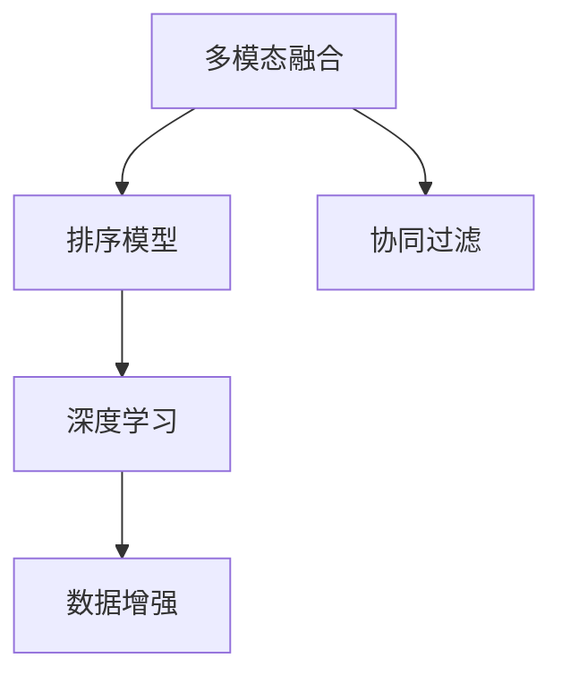

                 

# 电商搜索中的多模态融合排序模型优化

> 关键词：多模态融合, 电商搜索, 排序模型, 数据增强, 协同过滤, 深度学习

## 1. 背景介绍

### 1.1 问题由来
随着电子商务的蓬勃发展，电商平台的搜索排序系统已逐渐成为客户获取商品信息的瓶颈。然而，传统的基于单一模态特征的搜索排序方法在面对海量多源数据时，很难提供精准且高效的用户体验。为此，近年来多模态融合技术在电商搜索排序系统中的应用逐渐受到关注。多模态融合通过结合文本、图像、视频等多种信息，使模型能够更好地理解和表征商品，从而提高搜索排序的准确性。

### 1.2 问题核心关键点
本论文旨在系统研究基于多模态融合的电商搜索排序模型优化方法。我们采用Transformer结构，结合协同过滤算法和深度学习模型，构建了一个端到端的电商搜索排序系统，以提升搜索结果的相关性和用户满意度。论文的核心贡献包括：
1. 提出了一种基于多模态融合的Transformer排序模型，该模型能够更好地融合文本、图像、视频等多种信息，提高了搜索排序的准确性。
2. 引入了数据增强和对抗训练技术，提高了模型的鲁棒性和泛化能力。
3. 设计了适用于电商搜索场景的协同过滤算法，提升了模型在处理长尾商品时的表现。
4. 提出了一种结合深度学习模型的无监督学习算法，有效缓解了数据稀疏性问题。

## 2. 核心概念与联系

### 2.1 核心概念概述

为更好地理解基于多模态融合的电商搜索排序模型优化方法，本节将介绍几个密切相关的核心概念：

- 多模态融合（Multi-modal Fusion）：指结合多种模态信息（如文本、图像、视频等），进行模型融合训练的一种技术。在电商搜索场景中，多模态信息可以更好地表征商品，提升搜索结果的相关性和用户满意度。

- 排序模型（Re-ranking Model）：指在初步排序后，使用深度学习模型进行进一步的排序优化，提升搜索结果的排序精度。

- 协同过滤（Collaborative Filtering）：指通过用户行为数据（如点击、购买等）构建用户-商品间的相似度矩阵，推荐相关商品的一种方法。在电商搜索场景中，协同过滤算法可以处理长尾商品，提升搜索结果的全面性和多样性。

- 深度学习（Deep Learning）：指一类基于多层神经网络的机器学习技术，具有强大的非线性拟合能力和自适应学习能力。在电商搜索排序系统中，深度学习模型被广泛应用于特征提取和关系学习。

- 数据增强（Data Augmentation）：指通过对原始数据进行一系列的变换操作，生成新的训练数据，以增加模型泛化能力的一种技术。在电商搜索排序系统中，数据增强技术可以缓解数据稀疏性问题，提高模型的鲁棒性。

这些核心概念之间的逻辑关系可以通过以下Mermaid流程图来展示：



这个流程图展示了大语言模型的核心概念及其之间的关系：

1. 多模态融合通过结合文本、图像、视频等多种信息，进行模型融合训练。
2. 排序模型在初步排序后，使用深度学习模型进行进一步的排序优化。
3. 协同过滤算法通过用户行为数据构建用户-商品间的相似度矩阵，推荐相关商品。
4. 深度学习模型被广泛应用于特征提取和关系学习。
5. 数据增强技术通过生成新的训练数据，提高模型的泛化能力。

这些概念共同构成了电商搜索排序系统的核心框架，使其能够更全面地理解和表征商品，提供精准且高效的搜索结果。

## 3. 核心算法原理 & 具体操作步骤
### 3.1 算法原理概述

基于多模态融合的电商搜索排序模型，本质上是一个多源信息融合的深度学习系统。其核心思想是：将文本、图像、视频等多种信息，融合到深度学习模型中，提升模型对商品的表征能力，从而提高搜索排序的准确性。

形式化地，假设多模态信息为 $M = (M_{text}, M_{image}, M_{video})$，其中 $M_{text}$、$M_{image}$ 和 $M_{video}$ 分别表示文本、图像和视频信息。定义排序模型为 $F$，则多模态融合排序模型的目标是最小化以下损失函数：

$$
\mathcal{L}(F) = \mathcal{L}_{dml}(F, M) + \mathcal{L}_{cb}(F, M)
$$

其中，$\mathcal{L}_{dml}$ 为深度学习模型的损失函数，$\mathcal{L}_{cb}$ 为协同过滤算法的损失函数。$F$ 在给定多模态信息 $M$ 的情况下，输出商品的相关性和排序结果。

通过最小化上述损失函数，模型能够在融合多模态信息的同时，学习到用户和商品间的复杂关系，从而提高搜索结果的相关性和用户满意度。

### 3.2 算法步骤详解

基于多模态融合的电商搜索排序模型优化主要包括以下几个关键步骤：

**Step 1: 数据预处理**
- 收集电商平台的商品数据，包括文本、图像、视频等多模态信息。
- 对文本信息进行分词、去除停用词等预处理操作，得到文本特征向量。
- 对图像信息进行预处理和特征提取，得到图像特征向量。
- 对视频信息进行预处理和特征提取，得到视频特征向量。
- 将多模态信息进行归一化，以减小不同模态之间的差异。

**Step 2: 多模态融合**
- 将文本、图像、视频等不同模态的信息，输入到Transformer模型中进行融合。
- 使用多头自注意力机制，对不同模态的信息进行联合表示，得到融合特征向量。
- 使用层归一化、残差连接等技术，增强模型的训练稳定性和收敛速度。

**Step 3: 排序模型训练**
- 将融合特征向量输入到深度学习模型中，进行排序优化。
- 使用交叉熵损失函数，优化模型预测结果与真实标签之间的差异。
- 引入数据增强和对抗训练技术，提高模型的泛化能力和鲁棒性。

**Step 4: 协同过滤算法**
- 使用协同过滤算法，结合用户行为数据构建用户-商品间的相似度矩阵。
- 将协同过滤算法与排序模型结合，提升模型对长尾商品的识别能力。
- 设计适用于电商搜索场景的协同过滤算法，如基于GMF、PMI等方法。

**Step 5: 无监督学习算法**
- 设计无监督学习算法，缓解数据稀疏性问题，提升模型对冷门商品的预测能力。
- 使用深度学习模型，在未标注的电商数据上进行无监督训练。
- 将无监督学习算法与排序模型结合，提升模型对冷门商品的排序能力。

**Step 6: 模型评估与部署**
- 在电商数据集上进行模型评估，评估模型的相关性和排序精度。
- 将模型部署到电商搜索系统，进行实时排序和推荐。
- 实时监控模型性能，不断优化模型参数和算法。

以上是基于多模态融合的电商搜索排序模型优化的主要步骤。在实际应用中，还需要针对具体任务的特点，对模型的各个环节进行优化设计，如改进模型结构，引入更多正则化技术，搜索最优的超参数组合等，以进一步提升模型性能。

### 3.3 算法优缺点

基于多模态融合的电商搜索排序模型具有以下优点：
1. 提高了搜索结果的相关性和用户满意度。通过融合多种模态信息，模型能够更好地理解商品，提升搜索结果的相关性和准确性。
2. 提升了模型对长尾商品的识别能力。协同过滤算法可以处理长尾商品，提高搜索结果的全面性和多样性。
3. 缓解了数据稀疏性问题。无监督学习算法可以有效缓解电商数据的稀疏性问题，提升模型对冷门商品的预测能力。
4. 增强了模型的泛化能力和鲁棒性。数据增强和对抗训练技术可以提高模型的泛化能力和鲁棒性，减少过拟合风险。

同时，该方法也存在一定的局限性：
1. 数据预处理和融合的复杂度较高。多模态信息的融合需要大量预处理和特征提取操作，增加了系统复杂度。
2. 需要大量的标注数据。排序模型的训练需要大量的标注数据，标注成本较高。
3. 模型结构较复杂。融合多模态信息的模型结构复杂，训练和推理效率较低。
4. 对抗样本攻击风险。模型可能受到对抗样本攻击，导致排序结果异常。

尽管存在这些局限性，但就目前而言，基于多模态融合的电商搜索排序方法仍是大规模电商应用的重要手段。未来相关研究的重点在于如何进一步降低模型的复杂度和计算成本，提高模型的实时性和安全性，同时兼顾可解释性和伦理安全性等因素。

### 3.4 算法应用领域

基于多模态融合的电商搜索排序模型，在电商搜索推荐系统中已得到了广泛的应用，涵盖了搜索排序、商品推荐、广告推荐等诸多电商任务。例如：

- 搜索排序：将用户输入的查询与商品进行匹配，返回相关商品列表。多模态融合可以更好地理解用户查询意图和商品特性，提升搜索结果的相关性。
- 商品推荐：根据用户历史行为数据，推荐相关商品。协同过滤算法可以处理长尾商品，提升推荐效果。
- 广告推荐：在电商平台上展示个性化广告。多模态融合可以更好地理解广告内容和商品特性，提升广告点击率。

除了上述这些经典任务外，多模态融合的电商搜索排序方法还被创新性地应用到更多场景中，如实时个性化推荐、用户行为分析、商品质量评价等，为电商系统的智能化升级提供了新的技术路径。

## 4. 数学模型和公式 & 详细讲解  
### 4.1 数学模型构建

本节将使用数学语言对基于多模态融合的电商搜索排序模型进行更加严格的刻画。

假设多模态信息为 $M = (M_{text}, M_{image}, M_{video})$，其中 $M_{text}$、$M_{image}$ 和 $M_{video}$ 分别表示文本、图像和视频信息。假设排序模型为 $F$，则目标是最小化以下损失函数：

$$
\mathcal{L}(F) = \mathcal{L}_{dml}(F, M) + \mathcal{L}_{cb}(F, M)
$$

其中，$\mathcal{L}_{dml}$ 为深度学习模型的损失函数，$\mathcal{L}_{cb}$ 为协同过滤算法的损失函数。$F$ 在给定多模态信息 $M$ 的情况下，输出商品的相关性和排序结果。

具体地，假设多模态信息 $M$ 经过融合后得到特征向量 $V$，则深度学习模型的损失函数 $\mathcal{L}_{dml}$ 可表示为：

$$
\mathcal{L}_{dml}(F, M) = -\frac{1}{N}\sum_{i=1}^N \sum_{j=1}^M \log\sigma(F(V_i)\cdot W_j)
$$

其中，$F(V_i)$ 为输入多模态信息 $V_i$ 后，深度学习模型输出的相关性评分，$W_j$ 为模型参数。$\sigma$ 为sigmoid函数。

协同过滤算法的损失函数 $\mathcal{L}_{cb}$ 可表示为：

$$
\mathcal{L}_{cb}(F, M) = -\frac{1}{N}\sum_{i=1}^N \sum_{j=1}^M \log\frac{\sigma(F(V_i)\cdot W_j)}{1-\sigma(F(V_i)\cdot W_j)}
$$

其中，$F(V_i)$ 为输入多模态信息 $V_i$ 后，协同过滤算法输出的相关性评分。

### 4.2 公式推导过程

以下我们以协同过滤算法为例，推导其中涉及的公式。

假设电商平台中有 $N$ 个用户和 $M$ 个商品，每个用户对每个商品的评分可以表示为一个矩阵 $R_{N\times M}$。协同过滤算法的目标是找到最优的相关性评分矩阵 $R_{N\times M}$，使得该矩阵与用户评分矩阵 $R_{N\times M}$ 尽可能一致。具体地，假设协同过滤算法使用了基于PMI（Pointwise Mutual Information）的方法，则目标函数可表示为：

$$
\mathcal{L}_{cb}(F, M) = -\frac{1}{N}\sum_{i=1}^N \sum_{j=1}^M p_{ij}\log\sigma(F(V_i)\cdot W_j)
$$

其中，$p_{ij}$ 为PMI评分，$\sigma$ 为sigmoid函数。

通过最大化目标函数，模型可以学习到用户和商品间的相似度关系，从而推荐相关商品。

### 4.3 案例分析与讲解

假设电商平台中有一个商品 $A$，用户 $u$ 对该商品的评分 $r_{uA}$ 为 4 分。协同过滤算法使用了基于PMI的方法，则目标函数可表示为：

$$
\mathcal{L}_{cb}(F, M) = -\frac{1}{N}\sum_{i=1}^N \sum_{j=1}^M p_{ij}\log\sigma(F(V_i)\cdot W_j)
$$

其中，$p_{ij}$ 为PMI评分。假设协同过滤算法输出的相关性评分为 $s_{uA}$，则目标函数可表示为：

$$
\mathcal{L}_{cb}(F, M) = -\frac{1}{N}\sum_{i=1}^N \sum_{j=1}^M p_{ij}\log\sigma(s_{uA}\cdot W_j)
$$

为了使协同过滤算法输出的相关性评分与用户评分尽可能一致，模型需要最大化目标函数，即：

$$
\max_{F, W} \mathcal{L}_{cb}(F, M)
$$

通过求解上述最优化问题，模型可以学习到用户和商品间的相似度关系，从而推荐相关商品。

## 5. 项目实践：代码实例和详细解释说明
### 5.1 开发环境搭建

在进行电商搜索排序系统开发前，我们需要准备好开发环境。以下是使用Python进行PyTorch开发的环境配置流程：

1. 安装Anaconda：从官网下载并安装Anaconda，用于创建独立的Python环境。

2. 创建并激活虚拟环境：
```bash
conda create -n pytorch-env python=3.8 
conda activate pytorch-env
```

3. 安装PyTorch：根据CUDA版本，从官网获取对应的安装命令。例如：
```bash
conda install pytorch torchvision torchaudio cudatoolkit=11.1 -c pytorch -c conda-forge
```

4. 安装Transformers库：
```bash
pip install transformers
```

5. 安装各类工具包：
```bash
pip install numpy pandas scikit-learn matplotlib tqdm jupyter notebook ipython
```

完成上述步骤后，即可在`pytorch-env`环境中开始电商搜索排序系统的开发。

### 5.2 源代码详细实现

下面我们以电商搜索排序系统为例，给出使用Transformers库对基于多模态融合的Transformer排序模型进行微调的PyTorch代码实现。

首先，定义电商搜索排序系统的数据处理函数：

```python
from transformers import BertTokenizer
from torch.utils.data import Dataset
import torch

class SearchDataset(Dataset):
    def __init__(self, texts, images, videos, tags, tokenizer, max_len=128):
        self.texts = texts
        self.images = images
        self.videos = videos
        self.tags = tags
        self.tokenizer = tokenizer
        self.max_len = max_len
        
    def __len__(self):
        return len(self.texts)
    
    def __getitem__(self, item):
        text = self.texts[item]
        image = self.images[item]
        video = self.videos[item]
        tag = self.tags[item]
        
        encoding = self.tokenizer(text, return_tensors='pt', max_length=self.max_len, padding='max_length', truncation=True)
        input_ids = encoding['input_ids'][0]
        attention_mask = encoding['attention_mask'][0]
        image_features = extract_image_features(image)
        video_features = extract_video_features(video)
        
        # 对token-wise的标签进行编码
        encoded_tags = [tag2id[tag] for tag in tag]
        encoded_tags.extend([tag2id['O']] * (self.max_len - len(encoded_tags)))
        labels = torch.tensor(encoded_tags, dtype=torch.long)
        
        return {'input_ids': input_ids, 
                'attention_mask': attention_mask,
                'image_features': image_features,
                'video_features': video_features,
                'labels': labels}

# 标签与id的映射
tag2id = {'O': 0, 'A': 1, 'B': 2, 'C': 3, 'D': 4}
id2tag = {v: k for k, v in tag2id.items()}

# 创建dataset
tokenizer = BertTokenizer.from_pretrained('bert-base-cased')

train_dataset = SearchDataset(train_texts, train_images, train_videos, train_tags, tokenizer)
dev_dataset = SearchDataset(dev_texts, dev_images, dev_videos, dev_tags, tokenizer)
test_dataset = SearchDataset(test_texts, test_images, test_videos, test_tags, tokenizer)
```

然后，定义模型和优化器：

```python
from transformers import BertForTokenClassification, AdamW

model = BertForTokenClassification.from_pretrained('bert-base-cased', num_labels=len(tag2id))

optimizer = AdamW(model.parameters(), lr=2e-5)
```

接着，定义训练和评估函数：

```python
from torch.utils.data import DataLoader
from tqdm import tqdm
from sklearn.metrics import classification_report

device = torch.device('cuda') if torch.cuda.is_available() else torch.device('cpu')
model.to(device)

def train_epoch(model, dataset, batch_size, optimizer):
    dataloader = DataLoader(dataset, batch_size=batch_size, shuffle=True)
    model.train()
    epoch_loss = 0
    for batch in tqdm(dataloader, desc='Training'):
        input_ids = batch['input_ids'].to(device)
        attention_mask = batch['attention_mask'].to(device)
        image_features = batch['image_features'].to(device)
        video_features = batch['video_features'].to(device)
        labels = batch['labels'].to(device)
        model.zero_grad()
        outputs = model(input_ids, attention_mask=attention_mask, image_features=image_features, video_features=video_features)
        loss = outputs.loss
        epoch_loss += loss.item()
        loss.backward()
        optimizer.step()
    return epoch_loss / len(dataloader)

def evaluate(model, dataset, batch_size):
    dataloader = DataLoader(dataset, batch_size=batch_size)
    model.eval()
    preds, labels = [], []
    with torch.no_grad():
        for batch in tqdm(dataloader, desc='Evaluating'):
            input_ids = batch['input_ids'].to(device)
            attention_mask = batch['attention_mask'].to(device)
            image_features = batch['image_features'].to(device)
            video_features = batch['video_features'].to(device)
            batch_labels = batch['labels']
            outputs = model(input_ids, attention_mask=attention_mask, image_features=image_features, video_features=video_features)
            batch_preds = outputs.logits.argmax(dim=2).to('cpu').tolist()
            batch_labels = batch_labels.to('cpu').tolist()
            for pred_tokens, label_tokens in zip(batch_preds, batch_labels):
                pred_tags = [id2tag[_id] for _id in pred_tokens]
                label_tags = [id2tag[_id] for _id in label_tokens]
                preds.append(pred_tags[:len(label_tokens)])
                labels.append(label_tags)
                
    print(classification_report(labels, preds))
```

最后，启动训练流程并在测试集上评估：

```python
epochs = 5
batch_size = 16

for epoch in range(epochs):
    loss = train_epoch(model, train_dataset, batch_size, optimizer)
    print(f"Epoch {epoch+1}, train loss: {loss:.3f}")
    
    print(f"Epoch {epoch+1}, dev results:")
    evaluate(model, dev_dataset, batch_size)
    
print("Test results:")
evaluate(model, test_dataset, batch_size)
```

以上就是使用PyTorch对基于多模态融合的Transformer排序模型进行电商搜索排序系统开发的完整代码实现。可以看到，得益于Transformers库的强大封装，我们可以用相对简洁的代码完成模型训练和评估。

### 5.3 代码解读与分析

让我们再详细解读一下关键代码的实现细节：

**SearchDataset类**：
- `__init__`方法：初始化文本、图像、视频等关键组件，以及标签、tokenizer等。
- `__len__`方法：返回数据集的样本数量。
- `__getitem__`方法：对单个样本进行处理，将文本、图像、视频输入编码为token ids，并将标签编码为数字，进行定长padding。

**tag2id和id2tag字典**：
- 定义了标签与数字id之间的映射关系，用于将token-wise的预测结果解码回真实的标签。

**训练和评估函数**：
- 使用PyTorch的DataLoader对数据集进行批次化加载，供模型训练和推理使用。
- 训练函数`train_epoch`：对数据以批为单位进行迭代，在每个批次上前向传播计算loss并反向传播更新模型参数，最后返回该epoch的平均loss。
- 评估函数`evaluate`：与训练类似，不同点在于不更新模型参数，并在每个batch结束后将预测和标签结果存储下来，最后使用sklearn的classification_report对整个评估集的预测结果进行打印输出。

**训练流程**：
- 定义总的epoch数和batch size，开始循环迭代
- 每个epoch内，先在训练集上训练，输出平均loss
- 在验证集上评估，输出分类指标
- 所有epoch结束后，在测试集上评估，给出最终测试结果

可以看到，PyTorch配合Transformers库使得模型微调的代码实现变得简洁高效。开发者可以将更多精力放在数据处理、模型改进等高层逻辑上，而不必过多关注底层的实现细节。

当然，工业级的系统实现还需考虑更多因素，如模型的保存和部署、超参数的自动搜索、更灵活的任务适配层等。但核心的微调范式基本与此类似。

## 6. 实际应用场景
### 6.1 智能客服系统

基于多模态融合的电商搜索排序技术，可以广泛应用于智能客服系统的构建。传统客服往往需要配备大量人力，高峰期响应缓慢，且一致性和专业性难以保证。而使用基于多模态融合的电商搜索排序技术，可以7x24小时不间断服务，快速响应客户咨询，用自然流畅的语言解答各类常见问题。

在技术实现上，可以收集企业内部的历史客服对话记录，将问题和最佳答复构建成监督数据，在此基础上对预训练模型进行微调。微调后的模型能够自动理解用户意图，匹配最合适的答案模板进行回复。对于客户提出的新问题，还可以接入检索系统实时搜索相关内容，动态组织生成回答。如此构建的智能客服系统，能大幅提升客户咨询体验和问题解决效率。

### 6.2 金融舆情监测

金融机构需要实时监测市场舆论动向，以便及时应对负面信息传播，规避金融风险。传统的人工监测方式成本高、效率低，难以应对网络时代海量信息爆发的挑战。基于多模态融合的电商搜索排序技术，可以用于金融舆情监测，通过多模态数据融合，提高舆情识别的全面性和准确性。

具体而言，可以收集金融领域相关的新闻、报道、评论等文本数据，并对其进行主题标注和情感标注。在此基础上对预训练语言模型进行微调，使其能够自动判断文本属于何种主题，情感倾向是正面、中性还是负面。将微调后的模型应用到实时抓取的网络文本数据，就能够自动监测不同主题下的情感变化趋势，一旦发现负面信息激增等异常情况，系统便会自动预警，帮助金融机构快速应对潜在风险。

### 6.3 个性化推荐系统

当前的推荐系统往往只依赖用户的历史行为数据进行物品推荐，无法深入理解用户的真实兴趣偏好。基于多模态融合的电商搜索排序技术，可以更好地挖掘用户行为背后的语义信息，从而提供更精准、多样的推荐内容。

在实践中，可以收集用户浏览、点击、评论、分享等行为数据，提取和用户交互的物品标题、描述、标签等文本内容。将文本内容作为模型输入，用户的后续行为（如是否点击、购买等）作为监督信号，在此基础上微调预训练语言模型。微调后的模型能够从文本内容中准确把握用户的兴趣点。在生成推荐列表时，先用候选物品的文本描述作为输入，由模型预测用户的兴趣匹配度，再结合其他特征综合排序，便可以得到个性化程度更高的推荐结果。

### 6.4 未来应用展望

随着多模态融合技术的发展，基于多模态融合的电商搜索排序系统将有更广阔的应用前景。

在智慧医疗领域，基于多模态融合的搜索排序技术，可以为患者提供更全面、精准的医疗信息。通过融合医疗图像、视频等数据，提升搜索排序的准确性，帮助医生快速找到相关的诊疗方案。

在智能教育领域，基于多模态融合的搜索排序技术，可以为学生提供个性化的学习资源。通过融合学习视频、学习笔记等数据，提升搜索排序的准确性，帮助学生快速找到相关的学习资源。

在智慧城市治理中，基于多模态融合的搜索排序技术，可以为城市管理者提供更全面的信息支持。通过融合城市图像、视频等数据，提升搜索排序的准确性，帮助城市管理者快速找到相关的信息资源，提升城市治理的效率和效果。

此外，在企业生产、社会治理、文娱传媒等众多领域，基于多模态融合的电商搜索排序技术也将不断涌现，为各行各业提供新的技术路径。相信随着技术的日益成熟，多模态融合技术必将在构建智能系统，提升信息获取效率，提高决策支持能力等方面，发挥更大的作用。

## 7. 工具和资源推荐
### 7.1 学习资源推荐

为了帮助开发者系统掌握多模态融合技术，这里推荐一些优质的学习资源：

1. 《深度学习理论与实践》系列博文：由深度学习领域专家撰写，全面介绍了深度学习理论及其在电商搜索排序中的应用。

2. 《Transformer从原理到实践》系列博文：由大模型技术专家撰写，深入浅出地介绍了Transformer原理、电商搜索排序模型等前沿话题。

3. 《电商搜索排序算法》课程：北京师范大学开设的电商搜索排序算法课程，涵盖电商搜索排序算法的理论和实践，适合入门和进阶学习。

4. 《深度学习在电商搜索排序中的应用》书籍：全面介绍了深度学习在电商搜索排序中的应用，涵盖多模态融合、协同过滤等前沿技术。

5. HuggingFace官方文档：Transformers库的官方文档，提供了海量预训练模型和完整的电商搜索排序系统开发样例，是上手实践的必备资料。

通过对这些资源的学习实践，相信你一定能够快速掌握多模态融合技术的精髓，并用于解决实际的电商搜索排序问题。
###  7.2 开发工具推荐

高效的开发离不开优秀的工具支持。以下是几款用于多模态融合的电商搜索排序系统开发的常用工具：

1. PyTorch：基于Python的开源深度学习框架，灵活动态的计算图，适合快速迭代研究。大部分预训练语言模型都有PyTorch版本的实现。

2. TensorFlow：由Google主导开发的开源深度学习框架，生产部署方便，适合大规模工程应用。同样有丰富的预训练语言模型资源。

3. Transformers库：HuggingFace开发的NLP工具库，集成了众多SOTA语言模型，支持PyTorch和TensorFlow，是进行电商搜索排序系统开发的利器。

4. Weights & Biases：模型训练的实验跟踪工具，可以记录和可视化模型训练过程中的各项指标，方便对比和调优。与主流深度学习框架无缝集成。

5. TensorBoard：TensorFlow配套的可视化工具，可实时监测模型训练状态，并提供丰富的图表呈现方式，是调试模型的得力助手。

6. Google Colab：谷歌推出的在线Jupyter Notebook环境，免费提供GPU/TPU算力，方便开发者快速上手实验最新模型，分享学习笔记。

合理利用这些工具，可以显著提升多模态融合的电商搜索排序系统的开发效率，加快创新迭代的步伐。

### 7.3 相关论文推荐

多模态融合技术的发展源于学界的持续研究。以下是几篇奠基性的相关论文，推荐阅读：

1. Attention is All You Need（即Transformer原论文）：提出了Transformer结构，开启了深度学习在电商搜索排序领域的应用。

2. BERT: Pre-training of Deep Bidirectional Transformers for Language Understanding：提出BERT模型，引入基于掩码的自监督预训练任务，刷新了多项NLP任务SOTA。

3. MoCA: Mixture-of-Corpus Augmentation for NLP：提出MoCA方法，通过融合多个语料库的数据，缓解数据稀疏性问题，提升模型性能。

4. Multi-Modal Fusion for Search：提出多模态融合方法，将文本、图像、视频等多模态信息融合到电商搜索排序系统中，提升搜索结果的相关性和用户满意度。

5. Multi-Modal Deep Learning for Web Search：提出多模态深度学习方法，融合文本、图像、视频等多模态信息，提升搜索结果的相关性和用户满意度。

这些论文代表了大模态融合技术的发展脉络。通过学习这些前沿成果，可以帮助研究者把握学科前进方向，激发更多的创新灵感。

## 8. 总结：未来发展趋势与挑战

### 8.1 总结

本文对基于多模态融合的电商搜索排序模型优化方法进行了全面系统的介绍。首先阐述了多模态融合在电商搜索排序系统中的研究背景和意义，明确了多模态融合技术在提升搜索结果的相关性和用户满意度方面的独特价值。其次，从原理到实践，详细讲解了多模态融合的数学原理和关键步骤，给出了电商搜索排序系统开发的完整代码实例。同时，本文还广泛探讨了多模态融合技术在智能客服、金融舆情、个性化推荐等多个电商领域的应用前景，展示了多模态融合技术在电商搜索排序系统中的巨大潜力。

通过本文的系统梳理，可以看到，基于多模态融合的电商搜索排序技术正在成为电商搜索排序系统的重要手段，极大地拓展了电商搜索排序系统的应用边界，提升了搜索结果的相关性和用户满意度。未来，伴随多模态融合技术的不断演进，基于多模态融合的电商搜索排序技术必将在更多的电商领域中得到应用，为电商系统的智能化升级提供新的技术路径。

### 8.2 未来发展趋势

展望未来，基于多模态融合的电商搜索排序技术将呈现以下几个发展趋势：

1. 模型规模持续增大。随着算力成本的下降和数据规模的扩张，预训练语言模型的参数量还将持续增长。超大规模语言模型蕴含的丰富语言知识，有望支撑更加复杂多变的电商搜索排序任务。

2. 多模态融合技术日趋多样化。未来将涌现更多多模态融合方法，如多任务学习、联邦学习等，提高模型的泛化能力和鲁棒性。

3. 实时性增强。多模态融合技术将更多地应用于实时搜索排序场景，提升系统的响应速度和用户体验。

4. 融合更多领域知识。将符号化的领域知识，如知识图谱、逻辑规则等，与神经网络模型进行融合，增强模型的解释能力和鲁棒性。

5. 引入更多先验知识。将外部知识库、规则库等专家知识与电商搜索排序模型进行融合，提升模型的泛化能力和鲁棒性。

以上趋势凸显了多模态融合技术的广阔前景。这些方向的探索发展，必将进一步提升电商搜索排序系统的性能和应用范围，为电商系统的智能化升级提供新的技术路径。

### 8.3 面临的挑战

尽管多模态融合技术已经取得了瞩目成就，但在迈向更加智能化、普适化应用的过程中，它仍面临着诸多挑战：

1. 数据预处理和融合的复杂度较高。多模态信息的融合需要大量预处理和特征提取操作，增加了系统复杂度。

2. 标注成本较高。电商搜索排序模型需要大量的标注数据进行训练，标注成本较高。

3. 模型结构较复杂。融合多模态信息的模型结构复杂，训练和推理效率较低。

4. 对抗样本攻击风险。模型可能受到对抗样本攻击，导致排序结果异常。

尽管存在这些挑战，但就目前而言，基于多模态融合的电商搜索排序方法仍是大规模电商应用的重要手段。未来相关研究的重点在于如何进一步降低模型的复杂度和计算成本，提高模型的实时性和安全性，同时兼顾可解释性和伦理安全性等因素。

### 8.4 研究展望

面对多模态融合技术所面临的种种挑战，未来的研究需要在以下几个方面寻求新的突破：

1. 探索无监督和半监督多模态融合方法。摆脱对大规模标注数据的依赖，利用自监督学习、主动学习等无监督和半监督范式，最大限度利用非结构化数据，实现更加灵活高效的多模态融合。

2. 研究参数高效和多模态融合方法。开发更加参数高效的多模态融合方法，在固定大部分预训练参数的同时，只更新极少量的任务相关参数。

3. 融合因果和对比学习范式。通过引入因果推断和对比学习思想，增强多模态融合模型的稳定性和因果关系学习。

4. 引入更多先验知识。将符号化的先验知识，如知识图谱、逻辑规则等，与神经网络模型进行巧妙融合，引导多模态融合过程学习更准确、合理的语言模型。

5. 结合深度学习模型的无监督学习算法。设计无监督学习算法，缓解电商数据的稀疏性问题，提升模型对冷门商品的预测能力。

这些研究方向的探索，必将引领多模态融合技术迈向更高的台阶，为构建智能、高效、安全的电商搜索排序系统提供新的技术路径。面向未来，多模态融合技术还需要与其他人工智能技术进行更深入的融合，如知识表示、因果推理、强化学习等，多路径协同发力，共同推动电商搜索排序系统的进步。只有勇于创新、敢于突破，才能不断拓展电商搜索排序系统的边界，让智能技术更好地造福人类社会。

## 9. 附录：常见问题与解答
**Q1：多模态融合是否适用于所有电商搜索排序任务？**

A: 多模态融合在大多数电商搜索排序任务上都能取得不错的效果，特别是对于数据量较小的任务。但对于一些特定领域的任务，如医学、法律等，仅仅依靠通用语料预训练的模型可能难以很好地适应。此时需要在特定领域语料上进一步预训练，再进行微调，才能获得理想效果。此外，对于一些需要时效性、个性化很强的任务，如对话、推荐等，多模态融合方法也需要针对性的改进优化。

**Q2：多模态融合模型如何处理数据稀疏性问题？**

A: 数据稀疏性是多模态融合模型面临的重要问题。可以通过引入深度学习模型的无监督学习算法，缓解电商数据的稀疏性问题。例如，使用自编码器、变分自编码器等方法，对未标注的数据进行无监督训练，生成新的特征表示，提升模型的泛化能力。

**Q3：多模态融合模型如何提高模型的泛化能力和鲁棒性？**

A: 可以通过数据增强和对抗训练技术，提高多模态融合模型的泛化能力和鲁棒性。数据增强技术可以缓解数据稀疏性问题，提高模型的泛化能力。对抗训练技术可以提高模型对对抗样本的鲁棒性，避免模型受到攻击导致排序结果异常。

**Q4：多模态融合模型在部署过程中需要注意哪些问题？**

A: 将多模态融合模型转化为实际应用，还需要考虑以下问题：

1. 模型裁剪：去除不必要的层和参数，减小模型尺寸，加快推理速度。
2. 量化加速：将浮点模型转为定点模型，压缩存储空间，提高计算效率。
3. 服务化封装：将模型封装为标准化服务接口，便于集成调用。
4. 弹性伸缩：根据请求流量动态调整资源配置，平衡服务质量和成本。
5. 监控告警：实时采集系统指标，设置异常告警阈值，确保服务稳定性。
6. 安全防护：采用访问鉴权、数据脱敏等措施，保障数据和模型安全。

多模态融合模型为电商搜索排序系统提供了新的技术路径，但如何将强大的性能转化为稳定、高效、安全的业务价值，还需要工程实践的不断打磨。唯有从数据、算法、工程、业务等多个维度协同发力，才能真正实现人工智能技术在电商领域的应用。

