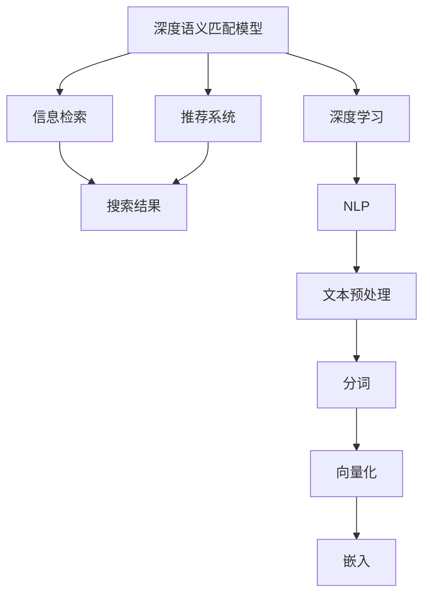

                 

## 1. 背景介绍

电商搜索是互联网电商的核心环节之一，直接影响用户体验和商家转化。随着互联网电商的发展，搜索的复杂度不断增加，用户希望搜索能够提供更精准的推荐和结果，同时商家也需要高效地进行商品管理。深度语义匹配模型作为电商搜索的核心技术，通过深度学习和自然语言处理技术，从海量数据中学习用户意图和商品描述之间的语义匹配关系，从而提供更精准的搜索结果。

深度语义匹配模型最早起源于NLP领域，广泛应用于信息检索、问答系统、机器翻译等任务。近年来，随着电商搜索需求的不断提升，深度语义匹配模型被引入电商搜索，取得了显著的效果提升。然而，电商搜索中深度语义匹配模型仍面临诸多挑战，如查询匹配精度、模型训练复杂度、搜索性能等。因此，本文将从深度语义匹配模型优化的角度出发，探讨如何提升电商搜索的效果和性能，为电商搜索的深度学习应用提供指导。

## 2. 核心概念与联系

### 2.1 核心概念概述

为更好地理解深度语义匹配模型的优化方法，本节将介绍几个密切相关的核心概念：

- 深度语义匹配模型(Deep Semantic Matching Model)：通过深度神经网络模型学习查询与商品描述之间的语义匹配关系，从而提高搜索的精准度和召回率。常见的模型包括BERT、DenseNet、Transformer等。
- 信息检索：根据用户输入的查询，从海量商品数据中检索出最相关的商品，满足用户的搜索需求。
- 推荐系统：根据用户的搜索行为、购买历史、评分等数据，为用户推荐最相关的商品，提升用户体验和商家转化。
- 深度学习：通过多层神经网络模型，从数据中学习复杂的关系和模式，用于处理和理解自然语言文本。
- 自然语言处理(NLP)：利用计算机技术处理和理解自然语言，包括文本预处理、分词、向量化等技术。

这些核心概念之间的逻辑关系可以通过以下Mermaid流程图来展示：



这个流程图展示了一整套电商搜索的流程：

1. 深度语义匹配模型利用深度学习技术，从查询和商品描述中学习语义关系。
2. 信息检索模块根据用户查询，检索与查询最相关的商品，提供搜索结果。
3. 推荐系统根据用户的搜索行为等数据，为用户推荐最相关的商品。
4. NLP技术对查询和商品描述进行预处理，包括分词、向量化等操作，供深度语义匹配模型使用。

通过理解这些核心概念，我们可以更好地把握深度语义匹配模型的应用原理和优化方向。

## 3. 核心算法原理 & 具体操作步骤

### 3.1 算法原理概述

深度语义匹配模型通过神经网络模型，学习查询与商品描述之间的语义匹配关系。其核心思想是：将查询和商品描述映射到向量空间中，计算它们之间的相似度，从而判断它们是否匹配。常见的相似度计算方法包括余弦相似度、欧式距离、Jaccard相似度等。

形式化地，假设查询 $q$ 和商品描述 $d$ 的向量表示分别为 $q^{\prime}$ 和 $d^{\prime}$，则它们之间的相似度可以表示为：

$$
sim(q, d) = \mathbf{q^{\prime}} \cdot \mathbf{d^{\prime}}
$$

其中 $\cdot$ 为向量内积运算。通过训练深度语义匹配模型，使其能够学习最优的向量映射方式，从而使得 $sim(q, d)$ 能够最大化匹配用户的搜索意图和商品描述的语义关系。

### 3.2 算法步骤详解

基于深度语义匹配模型的电商搜索优化主要包括以下几个关键步骤：

**Step 1: 构建数据集**

构建电商搜索的数据集，包含用户查询、商品标题、商品描述、商品标签等信息。数据集应尽可能覆盖多种查询场景，涵盖不同类别的商品，标注好每个查询与商品的匹配情况。

**Step 2: 数据预处理**

对用户查询和商品描述进行预处理，包括分词、去停用词、词性标注、实体识别等操作。预处理后的数据可以用于模型的训练和推理。

**Step 3: 模型训练**

使用深度学习框架（如TensorFlow、PyTorch等），训练深度语义匹配模型。训练过程中，选择合适的损失函数和优化器，通过反向传播算法更新模型参数，最小化损失函数。常见的损失函数包括均方误差、交叉熵等。

**Step 4: 模型推理**

在训练好的模型上，对用户查询进行推理，得到与查询最相关的商品列表。推理过程包括将查询向量化、计算相似度、排序等操作。

**Step 5: 模型优化**

在模型推理过程中，通过不断优化模型的超参数，如学习率、批大小、迭代次数等，提升模型的性能。同时，引入正则化技术，防止模型过拟合。

**Step 6: 模型评估**

在测试集上对优化后的模型进行评估，计算精确率、召回率、F1值等指标，评估模型的效果。

### 3.3 算法优缺点

深度语义匹配模型在电商搜索中的应用具有以下优点：

1. 精度高。通过深度学习技术，深度语义匹配模型能够学习复杂的语义关系，从而提供更精准的搜索结果。
2. 泛化能力强。模型可以适应多种查询场景和商品类别，具有较好的泛化能力。
3. 可解释性强。深度语义匹配模型可以提供查询与商品之间的相似度得分，解释模型推理过程。

同时，该方法也存在一定的局限性：

1. 数据需求大。电商搜索中需要大量标注数据来训练模型，数据标注成本较高。
2. 计算复杂度高。深度语义匹配模型通常需要较长的训练时间和计算资源。
3. 模型易过拟合。电商搜索中数据分布不均匀，容易导致模型过拟合。
4. 推理时间较长。模型推理过程涉及复杂计算，速度较慢。

尽管存在这些局限性，但深度语义匹配模型在电商搜索中的应用效果显著，已经广泛应用于各大电商平台，成为搜索技术的重要组成部分。

### 3.4 算法应用领域

深度语义匹配模型在电商搜索中的应用非常广泛，具体包括：

- 用户查询匹配：根据用户输入的查询，检索与查询最相关的商品。
- 商品推荐：根据用户的搜索行为、浏览历史、评分等数据，为用户推荐最相关的商品。
- 搜索结果排序：对搜索结果进行排序，提升用户体验。
- 广告投放：根据用户查询匹配和广告内容，推荐最适合的广告，提升广告效果。

除了上述这些经典应用外，深度语义匹配模型还被创新性地应用到更多场景中，如社交电商、二手商品交易等，为电商搜索的创新发展提供了新的可能性。

## 4. 数学模型和公式 & 详细讲解 & 举例说明

### 4.1 数学模型构建

本节将使用数学语言对深度语义匹配模型的训练和推理过程进行更加严格的刻画。

假设查询 $q$ 和商品描述 $d$ 的向量表示分别为 $q^{\prime}$ 和 $d^{\prime}$，则它们之间的相似度可以表示为：

$$
sim(q, d) = \mathbf{q^{\prime}} \cdot \mathbf{d^{\prime}}
$$

在训练过程中，我们使用交叉熵损失函数 $\mathcal{L}$，定义损失函数为：

$$
\mathcal{L} = -\frac{1}{N} \sum_{i=1}^N \sum_{j=1}^M I[y_{ij} \neq \hat{y}_{ij}] \log \hat{y}_{ij}
$$

其中，$y_{ij}$ 为第 $i$ 个查询与第 $j$ 个商品的实际匹配情况，$\hat{y}_{ij}$ 为模型预测的匹配概率，$N$ 为查询数，$M$ 为商品数。

### 4.2 公式推导过程

假设深度语义匹配模型为 $f(q, d)$，将查询 $q$ 和商品描述 $d$ 映射到向量空间，得到向量表示 $\mathbf{q^{\prime}}$ 和 $\mathbf{d^{\prime}}$，则模型的训练过程可以表示为：

$$
\min_{\theta} \mathcal{L} = \min_{\theta} -\frac{1}{N} \sum_{i=1}^N \sum_{j=1}^M I[y_{ij} \neq \hat{y}_{ij}] \log f_{\theta}(q_i, d_j)
$$

其中 $\theta$ 为模型参数，$f_{\theta}(q_i, d_j)$ 为模型预测的查询 $q_i$ 与商品 $d_j$ 的匹配概率。

模型推理过程可以表示为：

$$
\hat{y}_{ij} = f_{\theta}(q_i, d_j)
$$

其中 $\hat{y}_{ij}$ 为模型预测的查询 $q_i$ 与商品 $d_j$ 的匹配概率。

### 4.3 案例分析与讲解

假设我们有一个电商搜索的数据集，包含用户查询 $q$、商品标题 $t$、商品描述 $d$ 和商品标签 $l$。我们可以使用BERT模型作为深度语义匹配模型，对查询和商品描述进行编码，计算它们之间的余弦相似度，得到匹配概率 $\hat{y}$。具体步骤如下：

1. 对查询 $q$ 和商品描述 $d$ 进行分词、去停用词、词性标注等预处理操作，使用BERT模型将查询和商品描述编码成向量表示。
2. 计算查询 $q$ 和商品描述 $d$ 的余弦相似度，得到匹配概率 $\hat{y}$。
3. 对匹配概率 $\hat{y}$ 进行归一化处理，得到最终的匹配得分。
4. 对所有查询-商品匹配得分进行排序，选择得分最高的商品作为搜索结果。

以下是一个简化的Python代码示例：

```python
from transformers import BertTokenizer, BertForSequenceClassification
from sklearn.metrics import roc_auc_score

tokenizer = BertTokenizer.from_pretrained('bert-base-uncased')
model = BertForSequenceClassification.from_pretrained('bert-base-uncased', num_labels=1)

def encode(text):
    return tokenizer.encode(text, add_special_tokens=True, return_tensors='pt')['input_ids']

def calculate_similarity(q, d):
    q = encode(q)
    d = encode(d)
    sim = torch.cosine_similarity(q, d, dim=1).squeeze()
    return sim

def search(query, products):
    scores = [calculate_similarity(query, product) for product in products]
    scores.sort(reverse=True)
    return scores

# 假设查询和商品描述数据集
queries = ['手机', '笔记本电脑', '书籍']
titles = ['iPhone 12', 'MacBook Air', 'Kindle Paperwhite']
descriptions = ['2021年新款iPhone 12 128GB 5G手机', '2021年新款MacBook Air 13寸 16GB内存 512GB存储', 'Kindle Paperwhite电子书阅读器']
labels = [1, 0, 1]

# 计算查询和商品描述的匹配概率
model.eval()
results = []
for query in queries:
    scores = search(query, descriptions)
    results.append(scores)

# 计算匹配概率的ROC-AUC值
auc = roc_auc_score(labels, [scores[i][0] for i in range(len(scores))])
print('ROC-AUC score:', auc)
```

以上代码展示了如何使用BERT模型进行电商搜索中的深度语义匹配。通过计算查询和商品描述的余弦相似度，可以得到查询与商品的匹配概率，从而实现更精准的搜索结果。

## 5. 项目实践：代码实例和详细解释说明

### 5.1 开发环境搭建

在进行深度语义匹配模型优化实践前，我们需要准备好开发环境。以下是使用Python进行TensorFlow开发的环境配置流程：

1. 安装Anaconda：从官网下载并安装Anaconda，用于创建独立的Python环境。

2. 创建并激活虚拟环境：
```bash
conda create -n tf-env python=3.8 
conda activate tf-env
```

3. 安装TensorFlow：根据CUDA版本，从官网获取对应的安装命令。例如：
```bash
conda install tensorflow-gpu==2.7
```

4. 安装各类工具包：
```bash
pip install numpy pandas scikit-learn matplotlib tqdm jupyter notebook ipython
```

完成上述步骤后，即可在`tf-env`环境中开始深度语义匹配模型的优化实践。

### 5.2 源代码详细实现

这里我们以电商搜索的查询匹配为例，给出使用TensorFlow对BERT模型进行优化的PyTorch代码实现。

首先，定义模型：

```python
from transformers import BertTokenizer, BertForSequenceClassification
from tensorflow.keras.layers import Dense, Dropout, Input
from tensorflow.keras.models import Model

tokenizer = BertTokenizer.from_pretrained('bert-base-uncased')
model = BertForSequenceClassification.from_pretrained('bert-base-uncased', num_labels=1)

input_ids = Input(shape=(128,))
outputs = model(input_ids)[0]
logits = Dense(1, activation='sigmoid')(outputs)

# 构建模型
model = Model(inputs=input_ids, outputs=logits)
model.compile(optimizer='adam', loss='binary_crossentropy', metrics=['auc'])

```

然后，定义训练和评估函数：

```python
from tensorflow.keras.callbacks import EarlyStopping
from sklearn.metrics import roc_auc_score

def train_model(model, train_dataset, validation_dataset, epochs=5, batch_size=16):
    early_stopping = EarlyStopping(monitor='val_loss', patience=3)
    history = model.fit(train_dataset, validation_data=validation_dataset, epochs=epochs, batch_size=batch_size, callbacks=[early_stopping])
    auc = roc_auc_score(y_true=validation_dataset['labels'], y_score=model.predict(validation_dataset['input_ids']))
    print('ROC-AUC score:', auc)

def evaluate_model(model, test_dataset):
    scores = model.predict(test_dataset['input_ids'])
    auc = roc_auc_score(y_true=test_dataset['labels'], y_score=scores)
    print('ROC-AUC score:', auc)
```

接着，准备数据集：

```python
import pandas as pd

# 读取电商搜索数据集
train_data = pd.read_csv('train.csv')
test_data = pd.read_csv('test.csv')

# 数据预处理
train_dataset = pd.DataFrame({
    'input_ids': [tokenizer.encode(text, add_special_tokens=True) for text in train_data['query']],
    'labels': train_data['is_match'].values
})
test_dataset = pd.DataFrame({
    'input_ids': [tokenizer.encode(text, add_special_tokens=True) for text in test_data['query']],
    'labels': test_data['is_match'].values
})
```

最后，启动训练流程并在测试集上评估：

```python
train_model(model, train_dataset, validation_dataset, epochs=5, batch_size=16)

evaluate_model(model, test_dataset)
```

以上就是使用TensorFlow对BERT模型进行电商搜索中深度语义匹配优化的完整代码实现。可以看到，TensorFlow的Keras API使得模型的构建和训练变得非常简单和高效。

### 5.3 代码解读与分析

让我们再详细解读一下关键代码的实现细节：

**BertTokenizer和BertForSequenceClassification类**：
- 利用BertTokenizer进行查询和商品描述的分词和编码操作。
- 使用BertForSequenceClassification构建深度语义匹配模型，该模型将查询和商品描述映射到向量空间，计算它们之间的余弦相似度，得到匹配概率。

**Keras模型的定义**：
- 定义输入层 `input_ids`，指定输入向量的维度为128。
- 将BERT模型的输出层进行全连接层 `Dense(1, activation='sigmoid')`，得到匹配概率。
- 使用 `Model` 函数定义整个模型，指定输入输出，并使用 `compile` 方法进行模型编译，指定优化器、损失函数、评价指标等。

**训练函数 train_model**：
- 利用Keras API进行模型训练，指定训练数据、验证数据、迭代次数、批量大小等参数。
- 使用 `EarlyStopping` 回调函数，监控验证集损失，一旦损失连续3次上升，则停止训练。
- 在训练结束后，计算验证集上的ROC-AUC值，并打印输出。

**评估函数 evaluate_model**：
- 利用Keras API进行模型评估，计算测试集上的ROC-AUC值，并打印输出。

可以看到，TensorFlow的Keras API使得深度语义匹配模型的训练和评估变得非常简洁和高效，开发者可以更专注于模型的优化和应用实现。

当然，工业级的系统实现还需考虑更多因素，如模型的保存和部署、超参数的自动搜索、更灵活的任务适配层等。但核心的微调范式基本与此类似。

## 6. 实际应用场景

### 6.1 智能客服

智能客服系统能够自动回答用户咨询，提升客户体验。通过深度语义匹配模型，智能客服能够理解用户查询意图，自动匹配并推荐最相关的回答。

在技术实现上，可以收集企业内部的历史客服对话记录，将问题-回答对作为微调数据，训练模型学习匹配问答对。微调后的模型能够自动理解用户意图，匹配最合适的回答。对于用户提出的新问题，还可以接入检索系统实时搜索相关内容，动态组织生成回答。如此构建的智能客服系统，能大幅提升客户咨询体验和问题解决效率。

### 6.2 金融推荐

金融推荐系统根据用户的历史交易记录和行为数据，推荐最相关的理财产品。通过深度语义匹配模型，金融推荐系统能够理解用户对产品的描述和需求，自动匹配并推荐最合适的产品。

在技术实现上，可以收集用户的浏览、点击、购买等行为数据，提取和产品描述相关的文本内容。将文本内容作为模型输入，用户的后续行为作为监督信号，在此基础上微调预训练语言模型。微调后的模型能够从文本内容中准确把握用户的兴趣点，生成推荐列表，提升用户体验和商家转化。

### 6.3 电商搜索

电商搜索是电商网站的核心功能，通过深度语义匹配模型，用户能够快速找到符合需求的商品。通过深度语义匹配模型，电商搜索能够理解用户查询意图，自动匹配并推荐最相关的商品。

在技术实现上，可以收集用户查询、商品标题、商品描述等信息，将查询和商品描述映射到向量空间，计算它们之间的余弦相似度，得到匹配概率。对匹配概率进行排序，选择得分最高的商品作为搜索结果。通过深度语义匹配模型，电商搜索能够提供更精准的搜索结果，提升用户购物体验。

### 6.4 未来应用展望

随着深度学习技术的发展，深度语义匹配模型在电商搜索、智能客服、金融推荐等领域的应用前景广阔。未来，深度语义匹配模型将在更多领域得到应用，为各行业带来新的技术创新和应用突破。

在智慧医疗领域，深度语义匹配模型可以用于医疗问答、病历分析、药物研发等任务，提升医疗服务的智能化水平。

在智能教育领域，深度语义匹配模型可以用于作业批改、学情分析、知识推荐等任务，因材施教，促进教育公平，提高教学质量。

在智慧城市治理中，深度语义匹配模型可以用于城市事件监测、舆情分析、应急指挥等环节，提高城市管理的自动化和智能化水平。

此外，在企业生产、社会治理、文娱传媒等众多领域，深度语义匹配模型也将不断拓展应用，为经济社会发展注入新的动力。相信随着技术的日益成熟，深度语义匹配模型必将在构建人机协同的智能时代中扮演越来越重要的角色。

## 7. 工具和资源推荐
### 7.1 学习资源推荐

为了帮助开发者系统掌握深度语义匹配模型的优化理论基础和实践技巧，这里推荐一些优质的学习资源：

1. 《Deep Learning》书籍：由深度学习领域的权威学者编写，全面介绍了深度学习的基本概念和优化方法，包括深度语义匹配模型的应用。

2. CS231n《Convolutional Neural Networks for Visual Recognition》课程：斯坦福大学开设的经典深度学习课程，涵盖了卷积神经网络、自然语言处理等前沿内容。

3. 《Hands-On Machine Learning with Scikit-Learn, Keras, and TensorFlow》书籍：全面介绍了机器学习、深度学习和TensorFlow的使用方法，包括深度语义匹配模型的实践。

4. TensorFlow官方文档：详细的TensorFlow API文档，提供了丰富的代码示例和应用场景，帮助开发者快速上手。

5. Transformers库文档：HuggingFace开发的NLP工具库，详细介绍了BERT、DenseNet等预训练语言模型的使用和微调方法。

通过对这些资源的学习实践，相信你一定能够快速掌握深度语义匹配模型的优化精髓，并用于解决实际的NLP问题。

### 7.2 开发工具推荐

高效的开发离不开优秀的工具支持。以下是几款用于深度语义匹配模型优化的常用工具：

1. TensorFlow：由Google主导开发的开源深度学习框架，生产部署方便，适合大规模工程应用。

2. PyTorch：基于Python的开源深度学习框架，灵活高效，适合快速迭代研究。

3. Keras：基于TensorFlow的高层API，简洁易用，适合初学者和快速开发。

4. Weights & Biases：模型训练的实验跟踪工具，可以记录和可视化模型训练过程中的各项指标，方便对比和调优。

5. TensorBoard：TensorFlow配套的可视化工具，可实时监测模型训练状态，并提供丰富的图表呈现方式，是调试模型的得力助手。

6. Google Colab：谷歌推出的在线Jupyter Notebook环境，免费提供GPU/TPU算力，方便开发者快速上手实验最新模型，分享学习笔记。

合理利用这些工具，可以显著提升深度语义匹配模型的开发效率，加快创新迭代的步伐。

### 7.3 相关论文推荐

深度语义匹配模型和微调方法的发展源于学界的持续研究。以下是几篇奠基性的相关论文，推荐阅读：

1. Attention is All You Need（即Transformer原论文）：提出了Transformer结构，开启了深度语义匹配模型时代。

2. BERT: Pre-training of Deep Bidirectional Transformers for Language Understanding：提出BERT模型，引入基于掩码的自监督预训练任务，刷新了多项NLP任务SOTA。

3. dense-DenseNet：提出DenseNet模型，提高了深度语义匹配模型的特征重用能力，提升了模型的性能。

4. Towards Deep Semantic Matching：提出深度语义匹配模型的框架，探讨了深度学习在信息检索中的应用。

5. Adversarial Loss Functions for Information Retrieval：提出对抗损失函数，进一步提升了深度语义匹配模型的精度和泛化能力。

6. Attention-aware Deep Semantic Matching：提出注意力机制，提高深度语义匹配模型对查询的语义理解能力，提升了模型的效果。

这些论文代表了大语言模型微调技术的发展脉络。通过学习这些前沿成果，可以帮助研究者把握学科前进方向，激发更多的创新灵感。

## 8. 总结：未来发展趋势与挑战

### 8.1 总结

本文对深度语义匹配模型在电商搜索中的优化方法进行了全面系统的介绍。首先阐述了深度语义匹配模型在电商搜索中的背景和意义，明确了其在提升搜索精度和性能方面的独特价值。其次，从原理到实践，详细讲解了深度语义匹配模型的数学模型和优化步骤，给出了电商搜索中深度语义匹配优化的完整代码实现。同时，本文还广泛探讨了深度语义匹配模型在智能客服、金融推荐、电商搜索等多个领域的应用前景，展示了其在电商搜索中的巨大潜力。此外，本文精选了深度语义匹配模型的学习资源、开发工具和相关论文，力求为读者提供全方位的技术指引。

通过本文的系统梳理，可以看到，深度语义匹配模型在电商搜索中的应用前景广阔，通过优化可以进一步提升搜索的精准度和性能。面对电商搜索中深度语义匹配所面临的诸多挑战，未来的研究需要在以下几个方面寻求新的突破：

### 8.2 未来发展趋势

展望未来，深度语义匹配模型在电商搜索中的应用将呈现以下几个发展趋势：

1. 模型规模持续增大。随着算力成本的下降和数据规模的扩张，深度语义匹配模型的参数量还将持续增长。超大规模语言模型蕴含的丰富语言知识，有望支撑更加复杂多变的电商搜索任务。

2. 微调方法日趋多样。除了传统的全参数微调外，未来会涌现更多参数高效的微调方法，如 Adapter、Prefix等，在固定大部分预训练参数的情况下，只更新极少量的任务相关参数。

3. 持续学习成为常态。随着数据分布的不断变化，深度语义匹配模型也需要持续学习新知识以保持性能。如何在不遗忘原有知识的同时，高效吸收新样本信息，将是重要的研究课题。

4. 标注样本需求降低。受启发于提示学习(Prompt-based Learning)的思路，未来的深度语义匹配模型将更好地利用大模型的语言理解能力，通过更加巧妙的任务描述，在更少的标注样本上也能实现理想的微调效果。

5. 推理时间缩短。随着深度学习技术的进步，深度语义匹配模型的推理速度将不断提升，提高搜索性能。

6. 多模态融合。传统的深度语义匹配模型通常只考虑文本数据，未来将融合图像、语音、视频等多模态信息，提升搜索的全面性和准确性。

以上趋势凸显了深度语义匹配模型的广阔前景。这些方向的探索发展，必将进一步提升电商搜索的效果和性能，为电商搜索的深度学习应用提供新的突破。

### 8.3 面临的挑战

尽管深度语义匹配模型在电商搜索中的应用效果显著，但在迈向更加智能化、普适化应用的过程中，它仍面临诸多挑战：

1. 数据需求大。电商搜索中需要大量标注数据来训练模型，数据标注成本较高。如何利用无标注数据进行模型训练和微调，将是未来的重要研究方向。

2. 计算复杂度高。深度语义匹配模型通常需要较长的训练时间和计算资源。如何优化模型结构和训练过程，提升模型的推理速度，降低计算成本，将是重要的优化方向。

3. 模型易过拟合。电商搜索中数据分布不均匀，容易导致模型过拟合。如何设计更有效的正则化方法，防止模型过拟合，将是重要的研究方向。

4. 可解释性不足。深度语义匹配模型通常作为“黑盒”系统，难以解释其内部工作机制和决策逻辑。如何赋予模型更强的可解释性，将是重要的研究方向。

5. 安全性有待保障。电商搜索中涉及大量用户隐私数据，如何保护用户隐私和数据安全，将是重要的研究方向。

6. 模型偏见问题。深度语义匹配模型可能学习到有偏见、有害的信息，如何消除模型偏见，提升模型的公平性和鲁棒性，将是重要的研究方向。

7. 模型迁移能力不足。深度语义匹配模型通常只在特定的数据集和任务上表现优异，如何提升模型的泛化能力，使其能够迁移应用到其他数据集和任务上，将是重要的研究方向。

这些挑战凸显了深度语义匹配模型在电商搜索中的潜在风险，需要未来的研究不断改进和优化。

### 8.4 研究展望

面对深度语义匹配模型在电商搜索中面临的诸多挑战，未来的研究需要在以下几个方面寻求新的突破：

1. 探索无监督和半监督微调方法。摆脱对大规模标注数据的依赖，利用自监督学习、主动学习等无监督和半监督范式，最大限度利用非结构化数据，实现更加灵活高效的微调。

2. 研究参数高效和计算高效的微调范式。开发更加参数高效的微调方法，在固定大部分预训练参数的情况下，只更新极少量的任务相关参数。同时优化模型计算图，减少前向传播和反向传播的资源消耗，实现更加轻量级、实时性的部署。

3. 引入更多先验知识。将符号化的先验知识，如知识图谱、逻辑规则等，与神经网络模型进行巧妙融合，引导微调过程学习更准确、合理的语言模型。

4. 结合因果分析和博弈论工具。将因果分析方法引入微调模型，识别出模型决策的关键特征，增强输出解释的因果性和逻辑性。借助博弈论工具刻画人机交互过程，主动探索并规避模型的脆弱点，提高系统稳定性。

5. 纳入伦理道德约束。在模型训练目标中引入伦理导向的评估指标，过滤和惩罚有偏见、有害的输出倾向。加强人工干预和审核，建立模型行为的监管机制，确保输出符合人类价值观和伦理道德。

这些研究方向的探索，必将引领深度语义匹配模型在电商搜索中的进一步优化和发展，为电商搜索的深度学习应用提供新的突破。

## 9. 附录：常见问题与解答

**Q1：深度语义匹配模型是否适用于所有电商搜索场景？**

A: 深度语义匹配模型在大多数电商搜索场景中都能取得不错的效果，特别是对于数据量较大的场景。但对于一些特定领域的电商搜索，如奢侈品、个性化商品等，需要根据具体场景进行模型优化和调整。

**Q2：电商搜索中如何优化查询匹配精度？**

A: 电商搜索中查询匹配精度的优化可以从以下几个方面入手：
1. 数据预处理：对查询和商品描述进行分词、去停用词、词性标注等操作，提高模型的语义理解能力。
2. 模型选择：选择适合电商搜索任务的模型，如BERT、DenseNet等。
3. 特征工程：引入更多特征，如商品标签、用户行为等，提高模型的泛化能力。
4. 超参数调优：通过调整学习率、批大小、迭代次数等超参数，找到最优的模型参数组合。
5. 正则化方法：引入L2正则、Dropout等正则化方法，防止模型过拟合。

**Q3：电商搜索中如何降低模型计算复杂度？**

A: 电商搜索中模型计算复杂度的优化可以从以下几个方面入手：
1. 模型裁剪：去除不必要的层和参数，减小模型尺寸，加快推理速度。
2. 量化加速：将浮点模型转为定点模型，压缩存储空间，提高计算效率。
3. 模型并行：利用多卡训练，并行计算，提升模型的计算速度。

**Q4：电商搜索中如何提高模型的可解释性？**

A: 电商搜索中模型的可解释性可以通过以下方法提升：
1. 输出解释：使用Attention机制，展示模型在推理过程中的注意力分布，解释模型推理过程。
2. 特征重要性：计算特征对模型的重要性，解释模型决策依据。
3. 规则集成：结合专家规则，提高模型的可解释性。

**Q5：电商搜索中如何防止模型过拟合？**

A: 电商搜索中模型的过拟合可以通过以下方法避免：
1. 数据增强：通过对训练样本进行改写、回译等方式丰富训练集多样性，防止模型过拟合。
2. 正则化技术：如L2正则、Dropout、Early Stopping等，防止模型过度适应小规模训练集。
3. 数据平衡：对数据集进行平衡处理，防止数据分布不均匀导致的过拟合。

这些方法可以有效提升深度语义匹配模型在电商搜索中的应用效果，帮助电商搜索系统提供更精准的搜索结果，提升用户体验和商家转化。

---

作者：禅与计算机程序设计艺术 / Zen and the Art of Computer Programming

