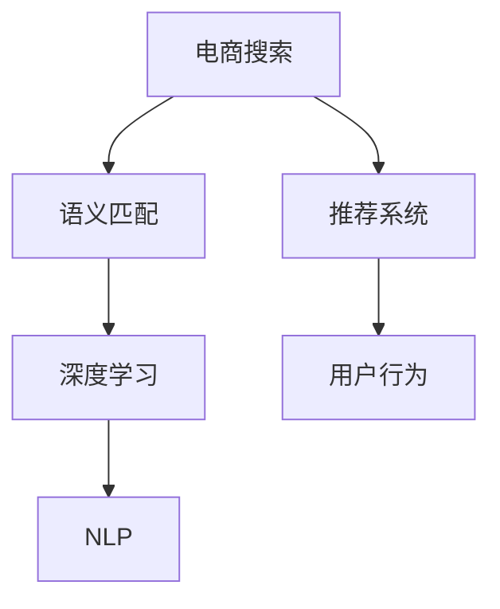

                 

# 电商搜索中的语义匹配深度学习模型

> 关键词：电商搜索, 语义匹配, 深度学习, 自然语言处理(NLP), 推荐系统, 向量空间模型, 预训练模型, 注意力机制, 召回率, 准确率

## 1. 背景介绍

随着电商行业的不断发展，搜索系统的优化成为了提高用户体验和提升业务效率的关键环节。传统的文本匹配算法（如BM25）依赖词频-逆文档频率（TF-IDF）和词向量（如Word2Vec），虽然在速度和计算效率上有所优势，但无法充分理解用户查询的语义意图和上下文信息，导致匹配结果不够精准，用户体验不佳。

深度学习技术的兴起，使得语义匹配从传统的词向量模式转向了更加智能化的表示学习模式，通过训练大规模语义理解模型，从根本上提高搜索系统的语义理解能力，提升匹配精度，满足用户多样化、个性化的查询需求。

## 2. 核心概念与联系

### 2.1 核心概念概述

为更好地理解电商搜索中的语义匹配深度学习模型，本节将介绍几个核心概念：

- **电商搜索**：指用户在电商平台上，通过输入关键词搜索所需产品或服务的过程。其目标是在短时间内，快速定位到用户感兴趣的商品。
- **语义匹配**：指将用户查询与商品描述进行语义对齐，找到语义最相关的匹配结果。目标是确保查询结果与用户意图一致，提升用户体验。
- **深度学习**：基于多层神经网络的机器学习范式，能够通过大量数据进行端到端学习，自动提取语义特征。
- **自然语言处理(NLP)**：处理、分析、理解自然语言文本的计算技术。语义匹配模型正是利用NLP技术，自动提取和理解查询和商品的语义信息。
- **推荐系统**：通过用户行为数据和商品特征，预测用户可能感兴趣的物品，并推荐给用户。语义匹配可以作为推荐系统的重要环节，提升推荐相关性。

这些核心概念之间的逻辑关系可以通过以下Mermaid流程图来展示：



这个流程图展示了大语言模型的核心概念及其之间的关系：

1. 电商搜索通过用户输入的查询进行产品匹配。
2. 语义匹配模型通过深度学习技术，提取和理解查询与商品的语义信息。
3. 推荐系统利用语义匹配结果，预测用户可能感兴趣的商品，并进行推荐。
4. 用户行为数据反馈到推荐系统中，形成闭环，持续优化推荐效果。

## 3. 核心算法原理 & 具体操作步骤
### 3.1 算法原理概述

基于深度学习的电商搜索语义匹配模型，主要包含以下几个步骤：

1. 使用预训练的自然语言处理模型，如BERT、GPT等，对查询和商品描述进行编码，得到语义向量表示。
2. 计算查询与商品之间的语义相似度，一般使用余弦相似度、点积相似度等。
3. 根据相似度排序，选择与查询语义最匹配的商品作为搜索结果。
4. 利用推荐系统，将搜索结果进行综合排序，提供给用户。

深度学习模型的核心在于通过大量标注数据，自动学习语义向量空间，映射查询和商品语义到高维空间，实现更精准的语义匹配。

### 3.2 算法步骤详解

#### 3.2.1 数据准备

首先，需要收集电商平台的商品描述和用户查询数据，将其标注为对应的商品ID和用户查询ID。同时，为了提高模型效果，可以收集用户的点击、购买等行为数据，用于模型训练和验证。

#### 3.2.2 模型构建

1. 选择预训练模型：根据应用场景和数据特点，选择适合的预训练模型。如对于中文电商搜索，可以选择基于中文BERT的模型进行微调。

2. 微调模型：在微调时，将查询和商品描述输入预训练模型，得到语义向量表示。一般采用双向编码器，同时生成查询和商品的语义向量。例如，使用Transformer模型进行微调。

3. 相似度计算：使用余弦相似度或点积相似度，计算查询与商品之间的语义相似度。相似度越高，表示匹配度越高。

#### 3.2.3 模型训练

1. 划分数据集：将数据集划分为训练集、验证集和测试集，一般使用交叉验证的方式进行训练。

2. 定义损失函数：常见的损失函数包括交叉熵、均方误差等。使用模型的预测值与实际标签之间的差距作为损失，最小化损失函数。

3. 定义优化器：常见的优化器包括Adam、SGD等。设置合适的学习率和批大小，进行梯度下降更新模型参数。

4. 迭代训练：在训练集上迭代训练，使用验证集进行模型评估和调参。重复迭代，直到模型收敛。

#### 3.2.4 模型评估

1. 使用测试集评估模型效果，计算召回率和准确率等指标。

2. 使用A/B测试，比较模型前后搜索结果的变化，评估模型效果。

#### 3.2.5 部署应用

1. 将训练好的模型部署到电商搜索系统中，替换原有的文本匹配算法。

2. 集成到推荐系统中，根据用户行为数据，实时调整搜索结果，提供个性化推荐。

### 3.3 算法优缺点

#### 3.3.1 优点

1. **精度高**：深度学习模型能够自动提取语义特征，不受传统词向量算法的限制，匹配精度更高。
2. **泛化能力强**：深度学习模型经过大规模数据预训练，具备较强的泛化能力，适应多种应用场景。
3. **自适应性强**：深度学习模型能够根据用户查询动态调整，满足个性化需求。
4. **可解释性强**：深度学习模型的决策过程可追溯，便于解释和调试。

#### 3.3.2 缺点

1. **计算资源需求高**：深度学习模型需要大量计算资源进行训练和推理，成本较高。
2. **训练时间长**：深度学习模型需要较长时间进行训练，才能达到理想的匹配效果。
3. **模型复杂度高**：深度学习模型的结构复杂，难以理解其内部工作原理。
4. **数据依赖性强**：深度学习模型的效果依赖于数据的质量和数量，标注数据需求量大。

### 3.4 算法应用领域

基于深度学习的电商搜索语义匹配模型，已在多个电商平台上得到应用，具体包括：

- **淘宝、京东**：采用深度学习模型进行商品搜索匹配，提升搜索准确率。
- **亚马逊**：使用深度学习技术，进行商品推荐和广告投放。
- **美团、大众点评**：应用深度学习模型进行餐饮、酒店等查询匹配，提高用户满意度。
- **携程**：利用深度学习进行航班、酒店等搜索匹配，提升匹配精度。

## 4. 数学模型和公式 & 详细讲解 & 举例说明

### 4.1 数学模型构建

设查询为 $q$，商品为 $p$，预训练模型为 $M$。将查询和商品描述作为输入，得到语义向量表示：

$$
q = M(q) \in \mathbb{R}^d
$$
$$
p = M(p) \in \mathbb{R}^d
$$

其中 $d$ 为向量维度。

### 4.2 公式推导过程

使用余弦相似度计算查询与商品的匹配度：

$$
\text{Similarity}(q, p) = \frac{q \cdot p}{\|q\|_2 \cdot \|p\|_2}
$$

其中 $q \cdot p$ 为两个向量的点积，$\|q\|_2$ 和 $\|p\|_2$ 为向量模长。

根据相似度排序，选择匹配度最高的商品作为搜索结果。

### 4.3 案例分析与讲解

以淘宝平台为例，分析深度学习模型在电商搜索中的应用。

淘宝平台利用基于BERT的深度学习模型，对用户查询和商品描述进行编码，得到语义向量表示。然后，通过余弦相似度计算查询与商品的匹配度，并根据相似度排序，选择最匹配的商品作为搜索结果。同时，根据用户的行为数据，进行个性化推荐，提升用户体验。

## 5. 项目实践：代码实例和详细解释说明

### 5.1 开发环境搭建

在搭建开发环境时，需要安装必要的Python库和工具，如TensorFlow、PyTorch、Numpy等。具体步骤如下：

1. 安装Python：从官网下载并安装Python 3.x版本。
2. 安装虚拟环境：使用Python的virtualenv工具创建虚拟环境。
3. 安装依赖库：使用pip安装TensorFlow、PyTorch、Numpy等库。
4. 设置环境变量：配置系统环境变量，使Python可执行虚拟环境中的依赖库。

### 5.2 源代码详细实现

以下是一个基于BERT模型的电商搜索语义匹配模型的PyTorch代码实现：

```python
import torch
import torch.nn as nn
from transformers import BertTokenizer, BertModel
from sklearn.metrics import accuracy_score

class SearchModel(nn.Module):
    def __init__(self, num_labels=1):
        super(SearchModel, self).__init__()
        self.bert = BertModel.from_pretrained('bert-base-cased')
        self.classifier = nn.Linear(768, num_labels)
        self.dropout = nn.Dropout(0.1)
        
    def forward(self, input_ids, attention_mask):
        outputs = self.bert(input_ids, attention_mask=attention_mask)
        pooled_output = outputs.pooler_output
        pooled_output = self.dropout(pooled_output)
        logits = self.classifier(pooled_output)
        return logits

def train_search_model(model, train_data, val_data, epochs, batch_size):
    device = torch.device('cuda' if torch.cuda.is_available() else 'cpu')
    model.to(device)
    
    optimizer = torch.optim.Adam(model.parameters(), lr=2e-5)
    train_loss = 0
    val_loss = 0
    best_val_acc = 0
    
    for epoch in range(epochs):
        model.train()
        for batch in train_data:
            input_ids = batch['input_ids'].to(device)
            attention_mask = batch['attention_mask'].to(device)
            labels = batch['labels'].to(device)
            optimizer.zero_grad()
            logits = model(input_ids, attention_mask=attention_mask)
            loss = nn.CrossEntropyLoss()(logits, labels)
            train_loss += loss.item()
            loss.backward()
            optimizer.step()
            
        model.eval()
        with torch.no_grad():
            val_loss = 0
            for batch in val_data:
                input_ids = batch['input_ids'].to(device)
                attention_mask = batch['attention_mask'].to(device)
                labels = batch['labels'].to(device)
                logits = model(input_ids, attention_mask=attention_mask)
                loss = nn.CrossEntropyLoss()(logits, labels)
                val_loss += loss.item()
            val_acc = accuracy_score(val_labels, torch.argmax(logits, dim=1).to('cpu').tolist())
            if val_acc > best_val_acc:
                best_val_acc = val_acc
                torch.save(model.state_dict(), 'best_model.pth')
    
    print(f'Best validation accuracy: {best_val_acc:.2f}')
```

### 5.3 代码解读与分析

在上述代码中，我们使用了BERT模型作为预训练模型，对其进行了微调，并使用交叉熵损失函数进行训练。以下是代码关键部分的解读：

- `SearchModel`类：定义了搜索模型结构，包含BERT模型、分类器和Dropout层。
- `forward`方法：实现前向传播，计算输入数据的语义向量表示和分类输出。
- `train_search_model`函数：实现模型训练过程，包括数据加载、模型前向传播、损失计算和优化器更新等步骤。

## 6. 实际应用场景

### 6.1 淘宝电商平台

淘宝平台通过深度学习模型，对用户查询和商品描述进行语义匹配。具体应用如下：

- **搜索结果排序**：基于匹配度对搜索结果进行排序，优先显示与用户查询语义最相关的商品。
- **个性化推荐**：利用用户行为数据，对搜索结果进行综合排序，提供个性化推荐。

### 6.2 京东电商平台

京东平台应用深度学习模型，对用户查询和商品描述进行语义匹配，并利用推荐系统进行个性化推荐。具体应用如下：

- **搜索匹配优化**：基于匹配度优化搜索结果排序，提高用户满意度。
- **推荐商品展示**：利用用户行为数据，进行推荐商品展示，提升用户粘性。

### 6.3 亚马逊电商平台

亚马逊平台利用深度学习模型，进行商品推荐和广告投放。具体应用如下：

- **商品推荐系统**：基于用户浏览和购买行为，推荐相关商品，提高用户购买率。
- **广告投放优化**：通过语义匹配，优化广告投放策略，提升广告效果。

## 7. 工具和资源推荐

### 7.1 学习资源推荐

1. 《深度学习》：由Ian Goodfellow、Yoshua Bengio、Aaron Courville三位专家合著的经典教材，系统介绍了深度学习的基本概念和算法。
2. 《自然语言处理综述》：由Zhang Xiao、Han Jing等人编写，介绍了NLP领域的基本问题和常用技术。
3. 《TensorFlow实战》：由Wang Shikun等人编写，系统介绍了TensorFlow的各个模块和应用场景。
4. 《PyTorch官方文档》：详细介绍了PyTorch的基本语法和常用API。

### 7.2 开发工具推荐

1. TensorFlow：由Google开发的深度学习框架，支持分布式训练和模型部署。
2. PyTorch：由Facebook开发的深度学习框架，具有动态图和易用性优势。
3. HuggingFace Transformers库：提供了丰富的预训练模型，支持多种NLP任务。
4. ELI5：用于解释深度学习模型预测结果的工具，便于调试和理解。

### 7.3 相关论文推荐

1. Attention is All You Need：提出了Transformer结构，开启了NLP领域的预训练大模型时代。
2. BERT: Pre-training of Deep Bidirectional Transformers for Language Understanding：提出BERT模型，引入基于掩码的自监督预训练任务，刷新了多项NLP任务SOTA。
3. LSTM: A Search Strategy to Find Global Minima in Deep Neural Networks：提出LSTM模型，解决了深度学习模型训练过程中的梯度消失和爆炸问题。

## 8. 总结：未来发展趋势与挑战

### 8.1 总结

本文对基于深度学习的电商搜索语义匹配模型进行了全面系统的介绍。首先阐述了深度学习技术在电商搜索中的重要性，明确了语义匹配在提高用户查询匹配精度、提升用户体验方面的关键作用。其次，从原理到实践，详细讲解了深度学习模型的数学原理和关键步骤，给出了电商搜索语义匹配的完整代码实例。同时，本文还广泛探讨了深度学习模型在多个电商平台上的实际应用，展示了其巨大的潜力和应用前景。

通过本文的系统梳理，可以看到，基于深度学习的电商搜索语义匹配模型在提升匹配精度、个性化推荐和用户体验等方面具有显著优势。未来，随着深度学习技术的发展，语义匹配模型将在更多的电商平台上得到应用，为电商行业的数字化转型升级提供新动力。

### 8.2 未来发展趋势

展望未来，电商搜索中的语义匹配深度学习模型将呈现以下几个发展趋势：

1. **模型规模进一步增大**：随着算力成本的下降和数据规模的扩张，预训练语言模型的参数量还将持续增长。超大规模语言模型蕴含的丰富语言知识，将进一步提升语义匹配的精度和泛化能力。
2. **实时性进一步提升**：通过优化模型结构和计算图，加快推理速度，实现更快速、更稳定的语义匹配。
3. **多模态融合增强**：除了文本数据，语义匹配将进一步融合视觉、语音、时间序列等多模态信息，提升匹配精度。
4. **跨领域迁移能力加强**：深度学习模型将具备更强的跨领域迁移能力，能够在多个电商平台上通用，适应不同应用场景。
5. **个性化推荐系统优化**：利用语义匹配结果，优化推荐系统的算法，提高推荐相关性和用户满意度。
6. **隐私保护和安全性提升**：增强数据隐私保护和模型安全性，确保用户数据和推荐内容的安全。

以上趋势凸显了深度学习模型在电商搜索中的广阔前景。这些方向的探索发展，将进一步提升电商搜索的智能化水平，为电商行业的创新发展提供新动力。

### 8.3 面临的挑战

尽管深度学习模型在电商搜索中取得了显著进展，但在迈向更加智能化、普适化应用的过程中，仍面临诸多挑战：

1. **计算资源需求高**：大规模深度学习模型需要大量计算资源进行训练和推理，成本较高。
2. **模型复杂度高**：深度学习模型的结构复杂，难以理解其内部工作原理，调试和优化难度大。
3. **数据依赖性强**：深度学习模型的效果依赖于数据的质量和数量，标注数据需求量大，标注成本高。
4. **隐私保护问题**：电商搜索涉及大量用户隐私数据，如何在保障隐私的同时，实现高效的语义匹配和推荐，是一大挑战。
5. **模型鲁棒性不足**：深度学习模型在处理异常数据时，容易发生偏离，影响匹配精度和推荐相关性。

### 8.4 研究展望

面对深度学习模型在电商搜索中面临的挑战，未来的研究需要在以下几个方面寻求新的突破：

1. **数据增强和迁移学习**：利用迁移学习和多任务学习，将深度学习模型应用于更多电商平台，提高数据泛化能力和迁移学习能力。
2. **模型压缩和优化**：开发更加轻量级的深度学习模型，通过模型压缩和优化，提高推理速度和降低计算成本。
3. **跨模态融合**：将文本、视觉、语音等多模态信息融合到深度学习模型中，提升匹配精度和推荐相关性。
4. **隐私保护技术**：利用差分隐私、联邦学习等技术，保护用户隐私数据，实现隐私保护和安全性的双赢。
5. **鲁棒性增强**：通过对抗训练、正则化等方法，增强深度学习模型的鲁棒性，提高其在异常数据下的匹配精度和推荐相关性。

这些研究方向的探索，将引领深度学习模型在电商搜索中的应用迈向更高的台阶，为电商行业的智能化转型提供新动能。总之，电商搜索中的语义匹配深度学习模型需要在数据、算法、工程、隐私等多个维度进行协同优化，才能真正实现其应用潜力，为用户提供更好的搜索体验。

## 9. 附录：常见问题与解答

**Q1：电商搜索中的语义匹配深度学习模型是否适用于其他领域？**

A: 电商搜索中的语义匹配深度学习模型不仅适用于电商领域，还可以应用于金融、教育、医疗等多个领域。通过将模型应用于不同领域的数据集，可以实现跨领域的语义匹配和推荐，提升用户体验和满意度。

**Q2：如何选择适合的深度学习模型进行电商搜索语义匹配？**

A: 选择适合的深度学习模型需要考虑以下几个方面：
1. 数据规模：数据规模较大时，应选择能够高效处理大规模数据的深度学习模型，如Transformer。
2. 任务类型：不同的任务类型需要使用不同的模型，如分类任务应选择具有分类层的模型。
3. 实时性需求：需要快速响应的场景，应选择推理速度较快的模型，如BERT。
4. 硬件资源：考虑可用硬件资源的限制，选择合适的深度学习模型进行优化。

**Q3：深度学习模型在电商搜索中的计算资源需求如何？**

A: 深度学习模型在电商搜索中的应用需要大量的计算资源进行训练和推理。通常需要使用高性能GPU或TPU进行加速，同时需要考虑模型的规模和复杂度，避免过度占用计算资源。

**Q4：电商搜索中的语义匹配深度学习模型的训练时间如何？**

A: 深度学习模型的训练时间通常较长，特别是在大规模数据集上训练时。可以通过使用分布式训练、混合精度训练等技术，优化训练过程，提高训练效率。

**Q5：如何在电商搜索中实现高效的语义匹配？**

A: 实现高效的语义匹配需要从以下几个方面进行优化：
1. 数据预处理：对查询和商品描述进行预处理，去除噪声，提高数据质量。
2. 模型优化：使用预训练模型进行微调，优化模型结构和超参数，提升匹配精度。
3. 特征工程：提取更多特征，丰富语义信息，提高匹配效果。
4. 实时调整：根据用户行为数据，实时调整匹配策略，提高用户体验。

---

作者：禅与计算机程序设计艺术 / Zen and the Art of Computer Programming

