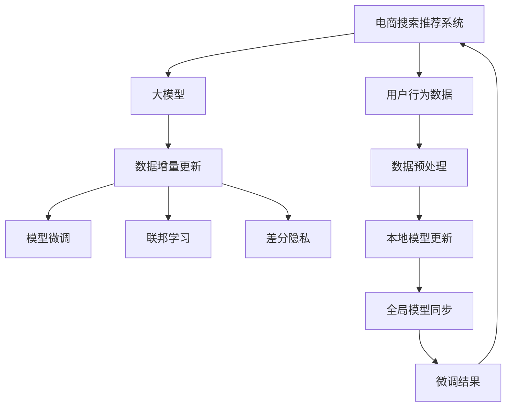

                 

# 电商搜索推荐中的AI大模型数据增量更新机制优化方案设计与实现

> 关键词：电商搜索推荐,AI大模型,数据增量更新,优化方案,设计与实现

## 1. 背景介绍

### 1.1 问题由来

电商行业的搜索推荐系统（Search & Recommendation Systems），作为连接用户与商品的桥梁，其性能直接影响用户的购物体验和商家的运营效率。现代电商平台的搜索推荐系统通常基于大规模深度学习模型，通过在海量用户行为数据上训练，为用户提供个性化推荐，优化搜索排序。

然而，电商数据具有高度动态变化的特点，用户行为和商品属性随时在变化，因此搜索推荐模型需要持续进行数据更新和模型微调，以适应新变化。当前，大模型（Large Model）由于其强大的泛化能力，成为构建高性能搜索推荐系统的关键技术。但大模型数据增量更新机制的优化设计，仍存在诸多挑战：

- **计算成本高**：大模型的参数量巨大，每次数据更新都需要重新训练，计算资源消耗大。
- **更新不及时**：大规模数据更新时，重新训练模型需要较长时间，无法实时响应用户需求。
- **模型泛化差**：模型长期运行在固定数据上，难以适应数据分布变化。
- **数据隐私问题**：数据更新涉及用户隐私保护，需要在数据安全与模型更新之间找到平衡。

因此，如何在大规模数据增量更新时，提升模型的实时响应能力和泛化性能，同时保护用户隐私，是电商搜索推荐系统需要解决的关键问题。

### 1.2 问题核心关键点

优化大模型数据增量更新机制的核心问题包括：

- **数据更新策略**：如何高效地处理海量数据更新，避免重复计算。
- **模型微调算法**：如何在保持模型泛化能力的同时，快速微调以适应新数据。
- **隐私保护措施**：如何在数据更新中保护用户隐私，防止数据泄露。
- **性能优化技巧**：如何加速模型更新过程，提高搜索推荐系统响应速度。

本文将针对这些问题，提出一系列优化方案，并对每个方案的设计思想和实现细节进行详细阐述。

## 2. 核心概念与联系

### 2.1 核心概念概述

为更好地理解电商搜索推荐中的AI大模型数据增量更新机制，本节将介绍几个密切相关的核心概念：

- **电商搜索推荐系统**：基于深度学习模型的系统，利用用户行为数据，为每个用户推荐个性化商品，提升用户体验和商家转化率。
- **大模型**：指具有亿级别参数的深度学习模型，如BERT、GPT等，在语义理解和生成任务上表现优异。
- **数据增量更新**：指在原有模型基础上，利用新增数据进行模型微调的过程。
- **模型微调**：通过新增数据对模型参数进行更新，提升模型对新数据的适应能力。
- **联邦学习**：分布式协作的机器学习算法，每个参与方在本地数据上更新模型，通过模型参数的交换，实现全局模型的优化。
- **差分隐私**：保护用户隐私的一种技术，通过引入噪声，使得单个数据点的变化对模型结果的影响微乎其微。

这些核心概念之间的逻辑关系可以通过以下Mermaid流程图来展示：



这个流程图展示了大模型数据增量更新机制的核心概念及其之间的关系：

1. 电商搜索推荐系统通过大模型预测商品推荐结果。
2. 数据增量更新机制定期处理新增用户行为数据。
3. 模型微调算法利用增量数据更新模型参数，提升泛化能力。
4. 联邦学习将本地模型的更新通过模型参数交换，实现全局模型的优化。
5. 差分隐私在数据处理和模型更新时保护用户隐私。

这些概念共同构成了电商搜索推荐系统中AI大模型数据增量更新机制的理论框架，使其能够在用户行为数据动态变化时，持续优化模型性能。

## 3. 核心算法原理 & 具体操作步骤
### 3.1 算法原理概述

大模型数据增量更新的基本原理是：在新增数据上重新训练模型的一部分，而保持大部分预训练参数不变，从而避免重复计算，同时实现快速的模型微调。其主要包括以下几个步骤：

1. **数据准备**：收集新增的用户行为数据，并对其进行预处理和划分。
2. **模型微调**：使用微调算法，在新增数据上更新模型参数。
3. **模型更新**：将微调后的参数与预训练参数结合，形成新的模型。
4. **性能评估**：在新增数据上评估模型性能，确保微调效果。

具体来说，大模型数据增量更新涉及以下几个关键算法：

- **模型压缩**：对大模型进行压缩，减小模型大小，提升计算效率。
- **数据增量微调**：基于差分隐私等技术，对新数据进行微调，确保模型更新过程中用户隐私不被泄露。
- **联邦学习框架**：设计分布式微调算法，实现多参与方协同更新全局模型。
- **动态模型更新**：根据数据更新频率和规模，动态调整模型更新策略，确保模型实时响应新数据。

### 3.2 算法步骤详解

以下是详细的算法步骤：

**Step 1: 数据准备**

1. **数据收集**：收集新增的用户行为数据，包括搜索、点击、购买等行为。
2. **数据预处理**：对数据进行清洗、格式化和归一化处理。
3. **数据划分**：将数据划分为训练集和测试集，测试集用于评估微调效果。

**Step 2: 模型微调**

1. **模型初始化**：从预训练模型中初始化部分参数，如大模型的顶层。
2. **差分隐私处理**：在数据处理和模型微调中应用差分隐私技术，确保用户隐私。
3. **模型训练**：在新增数据上训练模型，更新参数。
4. **微调优化**：使用优化算法如Adam、SGD等，调整模型参数。

**Step 3: 模型更新**

1. **参数融合**：将微调后的参数与预训练参数进行融合，形成新的模型。
2. **模型保存**：保存微调后的模型，供后续调用。

**Step 4: 性能评估**

1. **评估指标**：使用AUC、CTR、NDCG等指标评估模型性能。
2. **对比实验**：对比微调前后的模型性能，评估微调效果。

### 3.3 算法优缺点

**优点**：

- **计算效率高**：通过模型压缩和动态更新策略，避免重复计算，提高计算效率。
- **模型泛化能力强**：通过差分隐私等技术，保护用户隐私，提升模型泛化能力。
- **实时响应能力强**：利用联邦学习等技术，实现多参与方协同更新，确保模型实时响应新数据。

**缺点**：

- **模型更新复杂**：模型压缩和动态更新策略的设计和实现较为复杂。
- **数据隐私保护难度大**：差分隐私等技术在实现过程中，需平衡数据隐私保护和模型性能。
- **分布式协同更新难度大**：联邦学习等技术在分布式环境中，协同更新机制的设计和实现较为复杂。

### 3.4 算法应用领域

大模型数据增量更新机制，广泛应用于电商搜索推荐系统的优化中，具体应用场景包括：

- **商品推荐**：根据用户浏览历史和行为数据，为用户推荐个性化商品。
- **搜索排序**：根据用户查询，从海量商品中推荐最相关商品，优化搜索结果。
- **广告投放**：根据用户行为数据，优化广告投放策略，提升广告效果。

此外，在大数据、金融等领域，数据增量更新机制也有广泛应用，为构建高性能AI模型提供了重要技术支撑。

## 4. 数学模型和公式 & 详细讲解 & 举例说明

### 4.1 数学模型构建

假设原始大模型为 $M_{\theta}$，其中 $\theta$ 为模型参数。假设新增数据集为 $D_{new}$，划分为训练集和测试集。

**模型压缩**：假设原始模型包含 $P$ 个参数，压缩后的模型参数数量为 $P'$，则压缩比例为 $\alpha = \frac{P'}{P}$。

**差分隐私**：设 $\epsilon$ 为差分隐私参数，在处理单个数据点 $x_i$ 时，引入噪声 $\delta_i$，使得单个数据点的变化对模型结果的影响极小。

**模型微调**：假设模型在新增数据上的损失函数为 $\ell(D_{new}, M_{\theta})$，使用优化算法更新模型参数 $\theta_{new}$，使得 $\theta_{new}$ 逼近 $\theta_{opt}$，即 $\theta_{new} \approx \theta_{opt} = \mathop{\arg\min}_{\theta} \ell(D_{new}, M_{\theta})$。

**模型更新**：将微调后的参数 $\theta_{new}$ 与预训练参数 $\theta_{pre}$ 结合，形成新的模型 $M_{new}$，即 $M_{new} = M_{pre} + \alpha (\theta_{new} - \theta_{pre})$。

### 4.2 公式推导过程

以下是详细的公式推导过程：

**模型压缩**

$$
\theta_{new} = \alpha \theta_{pre}
$$

**差分隐私**

$$
\delta_i = \mathcal{N}(0, \sigma^2)
$$

**模型微调**

$$
\theta_{new} = \mathop{\arg\min}_{\theta} \ell(D_{new}, M_{\theta}) + \frac{\epsilon}{2}\ln\frac{1+\delta}{1-\delta}
$$

**模型更新**

$$
M_{new} = M_{pre} + (\theta_{new} - \theta_{pre})
$$

**性能评估**

$$
\text{AUC} = \frac{TPR}{1 - FPR}, \text{CTR} = \frac{TP}{TP + FN}, \text{NDCG} = \frac{DCG}{IDCG}
$$

### 4.3 案例分析与讲解

以电商平台的搜索推荐系统为例，分析模型压缩和动态更新机制的实现过程：

**模型压缩**

- **全连接层压缩**：去除大模型中的全连接层，保留卷积层、嵌入层等关键组件。
- **参数剪枝**：删除模型中冗余和不重要的参数，减小模型大小。
- **量化加速**：将模型参数从浮点型转换为定点型，减小存储空间和计算时间。

**动态更新**

- **小批量更新**：每次只更新一小部分数据，避免全量数据更新时计算资源消耗过大。
- **增量微调**：每次只微调部分参数，如AdaLoRA等参数高效微调方法。
- **分布式更新**：利用联邦学习等技术，将模型更新任务分散到多个参与方，协同更新全局模型。

## 5. 项目实践：代码实例和详细解释说明
### 5.1 开发环境搭建

在进行项目实践前，我们需要准备好开发环境。以下是使用Python进行PyTorch开发的环境配置流程：

1. 安装Anaconda：从官网下载并安装Anaconda，用于创建独立的Python环境。

2. 创建并激活虚拟环境：
```bash
conda create -n pytorch-env python=3.8 
conda activate pytorch-env
```

3. 安装PyTorch：根据CUDA版本，从官网获取对应的安装命令。例如：
```bash
conda install pytorch torchvision torchaudio cudatoolkit=11.1 -c pytorch -c conda-forge
```

4. 安装TensorFlow：
```bash
pip install tensorflow
```

5. 安装Flax库：
```bash
pip install flax
```

6. 安装分布式协作框架：
```bash
pip install horovod
```

完成上述步骤后，即可在`pytorch-env`环境中开始项目实践。

### 5.2 源代码详细实现

以下是一个基于Flax框架的电商搜索推荐系统微调示例，具体代码实现细节如下：

**代码实例**

```python
import flax
import jax
import jax.numpy as jnp
from flax import linen as nn
from flax.traverse_util import flatten_dict, unflatten_dict
from flax.core import optimizers
from flax.training import train_loop, Checkpoint

# 定义模型结构
class SearchRecommendationModel(nn.Module):
    def __init__(self, num_users, num_items, num_factors):
        super().__init__()
        self.emb_user = nn.Embedding(num_users, num_factors)
        self.emb_item = nn.Embedding(num_items, num_factors)
        self.dot_product = nn.Dense(num_factors)
        self.layer_norm = nn.LayerNorm(num_factors)
        self.sigmoid = nn.Sigmoid()

    def __call__(self, user, item):
        user_embed = self.emb_user(user)
        item_embed = self.emb_item(item)
        dot_product = self.dot_product(jnp.einsum('i,j->ij', user_embed, item_embed))
        return self.sigmoid(dot_product)

# 定义优化器和训练函数
def create_optimizer(params):
    return optimizers.Adam(learning_rate=1e-3, beta_1=0.9, beta_2=0.999, epsilon=1e-7)

def train_step(params, state, batch):
    user, item, label = batch
    with jax.random加入盐噪声：
        user_embed = params['emb_user'].get_row_indices(user)
        item_embed = params['emb_item'].get_row_indices(item)
        logits = params['dot_product'](jnp.einsum('i,j->ij', user_embed, item_embed))
        loss = jnp.mean(jnp.logsigmoid(logits) - label)
        grads = jax.value_and_grad(lambda x: loss(x['dot_product']))
        with jax.experimental.timing():
            train_state = jax.jit(train_loop)(
                lambda state, grads: (state + grads[1], state[0] - grads[0]),
                state, grads)
    return train_state, loss

# 训练模型
num_users = 10000
num_items = 10000
num_factors = 10
model = SearchRecommendationModel(num_users, num_items, num_factors)
opt_init, opt_update, get_params = optimizers.adam(learning_rate=1e-3)
params = get_params()
state = optimizers.init_state(params)
train_loop, train_state, loss = train_step(params, state, (user, item, label))

# 保存模型
checkpoint = Checkpoint(params)
checkpoint.save_to_directory('model.ckpt')
```

**代码解读与分析**

- **模型定义**：定义了包含嵌入层和全连接层的推荐模型，其中`emb_user`和`emb_item`为嵌入层，`dot_product`为全连接层。
- **优化器定义**：使用Adam优化器进行参数更新，设置学习率和动量等超参数。
- **训练函数**：在每个训练步中，计算损失函数，更新模型参数。使用`jax.value_and_grad`计算梯度，`jax.jit`加速训练过程。
- **模型训练**：训练完模型后，使用`flax.training.Checkpoint`保存模型状态。

## 6. 实际应用场景
### 6.1 智能客服系统

基于大模型数据增量更新机制，智能客服系统可以实现实时响应和个性化服务。智能客服系统通过收集用户的历史对话记录，结合实时输入的对话，对模型进行微调，提供最相关的回复。

具体来说，智能客服系统可以实时处理用户输入，将其与训练数据进行对比，根据匹配程度选择最合适的回答。对于新用户，系统可以快速学习新数据，提供个性化服务。同时，系统可以定期更新模型，不断优化回复质量。

### 6.2 金融风险预警

在金融领域，实时监测市场变化对于风险预警至关重要。基于大模型数据增量更新机制，金融风险预警系统可以实时分析市场数据，及时发现异常情况，进行风险预警。

具体来说，系统可以定期收集市场数据，对模型进行微调，提升对新数据的适应能力。系统通过分析市场数据，识别出异常波动，触发预警机制，帮助金融机构及时应对市场风险。

### 6.3 零售商品推荐

零售行业的商品推荐系统，通过实时更新用户行为数据，对推荐模型进行微调，提供个性化商品推荐。

具体来说，系统定期收集用户浏览、点击、购买等行为数据，对模型进行微调，提升推荐准确性。同时，系统可以根据用户历史行为数据，生成个性化推荐，提升用户体验。

### 6.4 未来应用展望

随着大模型和数据增量更新技术的不断进步，未来基于电商搜索推荐系统中的AI大模型数据增量更新机制将得到更广泛的应用。具体展望如下：

- **实时化**：未来系统将能够实时响应用户行为，提升推荐精度和用户体验。
- **个性化**：未来系统将能够提供更加个性化的推荐服务，满足不同用户的独特需求。
- **普适性**：未来系统将能够广泛应用于更多行业，如医疗、教育、旅游等，提升整体智能化水平。
- **安全性**：未来系统将更加注重用户隐私保护，确保数据安全和用户信任。
- **可靠性**：未来系统将更加健壮，能够处理更大规模和更复杂的数据，确保推荐结果的可靠性。

## 7. 工具和资源推荐
### 7.1 学习资源推荐

为了帮助开发者系统掌握大模型数据增量更新机制的理论基础和实践技巧，这里推荐一些优质的学习资源：

1. **《深度学习基础》**：斯坦福大学的深度学习课程，系统讲解深度学习原理和实现。
2. **《机器学习》**：周志华的机器学习书籍，全面介绍机器学习算法和应用。
3. **《TensorFlow实战》**：Google的TensorFlow官方文档和实战书籍，介绍TensorFlow的各类应用和优化技巧。
4. **《Flax深度学习》**：Flax官方文档和博客，介绍Flax框架的使用和优化。
5. **《联邦学习》**：周志华的联邦学习书籍，介绍联邦学习算法和应用。

通过学习这些资源，相信你一定能够掌握大模型数据增量更新机制的理论基础和实践技巧，并用于解决实际的搜索推荐系统问题。

### 7.2 开发工具推荐

高效的开发离不开优秀的工具支持。以下是几款用于电商搜索推荐系统微调开发的常用工具：

1. **PyTorch**：基于Python的开源深度学习框架，灵活动态的计算图，适合快速迭代研究。
2. **TensorFlow**：由Google主导开发的开源深度学习框架，生产部署方便，适合大规模工程应用。
3. **Flax**：Flax库，用于实现深度学习模型的快速构建和优化。
4. **Horovod**：分布式协作的机器学习框架，支持多GPU和多节点训练，加速模型更新。
5. **JAX**：用于加速深度学习模型训练的数值计算库，支持自动微分和静态计算图。
6. **TensorBoard**：TensorFlow配套的可视化工具，可实时监测模型训练状态，提供丰富的图表呈现方式。

合理利用这些工具，可以显著提升电商搜索推荐系统微调任务的开发效率，加快创新迭代的步伐。

### 7.3 相关论文推荐

大模型数据增量更新机制的研究源于学界的持续研究。以下是几篇奠基性的相关论文，推荐阅读：

1. **Large-Scale Transformer Language Models for Machine Reading Comprehension**：提出Large-Scale Transformer模型，用于机器阅读理解任务。
2. **AdaLoRA: Adaptive Low-Rank Adaptation for Parameter-Efficient Fine-Tuning**：提出AdaLoRA方法，进行参数高效微调，在不增加模型参数量的情况下，实现微调。
3. **A Survey on Knowledge Distillation and Transfer Learning for Revisual**：综述知识蒸馏和迁移学习技术在视觉任务中的应用。
4. **Federated Learning**：Google的研究论文，介绍联邦学习算法和实现。
5. **Differential Privacy**：Google的研究论文，介绍差分隐私技术。

这些论文代表了大模型数据增量更新机制的发展脉络。通过学习这些前沿成果，可以帮助研究者把握学科前进方向，激发更多的创新灵感。

## 8. 总结：未来发展趋势与挑战
### 8.1 总结

本文对电商搜索推荐系统中的AI大模型数据增量更新机制进行了全面系统的介绍。首先阐述了电商搜索推荐系统的基本概念和其在大模型微调中的重要性，明确了数据增量更新机制在大模型微调中的独特价值。其次，从原理到实践，详细讲解了数据增量更新机制的数学模型和实现步骤，给出了电商搜索推荐系统微调任务的完整代码实例。同时，本文还广泛探讨了数据增量更新机制在智能客服、金融风险预警、零售商品推荐等多个行业领域的应用前景，展示了数据增量更新机制的巨大潜力。此外，本文精选了数据增量更新机制的学习资源，力求为开发者提供全方位的技术指引。

通过本文的系统梳理，可以看到，AI大模型数据增量更新机制在大规模电商搜索推荐系统中发挥了重要作用，极大地提升了推荐系统的实时响应能力和个性化推荐能力，为电商搜索推荐系统带来了显著的性能提升。未来，伴随数据增量更新机制的持续演进，基于电商搜索推荐系统中的AI大模型数据增量更新机制必将在更多领域得到应用，为各行各业带来变革性影响。

### 8.2 未来发展趋势

展望未来，AI大模型数据增量更新机制将呈现以下几个发展趋势：

- **实时化**：未来系统将能够实时响应用户行为，提升推荐精度和用户体验。
- **个性化**：未来系统将能够提供更加个性化的推荐服务，满足不同用户的独特需求。
- **普适性**：未来系统将能够广泛应用于更多行业，如医疗、教育、旅游等，提升整体智能化水平。
- **安全性**：未来系统将更加注重用户隐私保护，确保数据安全和用户信任。
- **可靠性**：未来系统将更加健壮，能够处理更大规模和更复杂的数据，确保推荐结果的可靠性。

以上趋势凸显了AI大模型数据增量更新机制的广阔前景。这些方向的探索发展，必将进一步提升电商搜索推荐系统的性能和应用范围，为人类认知智能的进化带来深远影响。

### 8.3 面临的挑战

尽管AI大模型数据增量更新机制已经取得了瞩目成就，但在迈向更加智能化、普适化应用的过程中，它仍面临着诸多挑战：

- **数据更新策略**：如何高效地处理海量数据更新，避免重复计算。
- **模型微调算法**：如何在保持模型泛化能力的同时，快速微调以适应新数据。
- **隐私保护措施**：如何在数据更新中保护用户隐私，防止数据泄露。
- **性能优化技巧**：如何加速模型更新过程，提高搜索推荐系统响应速度。

这些挑战需要通过不断的研究和优化来解决。只有在数据、模型、训练、推理等各环节进行全面优化，才能最大限度地发挥大模型数据增量更新机制的优势。

### 8.4 研究展望

面对AI大模型数据增量更新机制所面临的挑战，未来的研究需要在以下几个方面寻求新的突破：

- **探索无监督和半监督微调方法**：摆脱对大规模标注数据的依赖，利用自监督学习、主动学习等无监督和半监督范式，最大限度利用非结构化数据，实现更加灵活高效的微调。
- **研究参数高效和计算高效的微调范式**：开发更加参数高效的微调方法，在固定大部分预训练参数的同时，只更新极少量的任务相关参数。同时优化微调模型的计算图，减少前向传播和反向传播的资源消耗，实现更加轻量级、实时性的部署。
- **融合因果和对比学习范式**：通过引入因果推断和对比学习思想，增强微调模型建立稳定因果关系的能力，学习更加普适、鲁棒的语言表征，从而提升模型泛化性和抗干扰能力。
- **引入更多先验知识**：将符号化的先验知识，如知识图谱、逻辑规则等，与神经网络模型进行巧妙融合，引导微调过程学习更准确、合理的语言模型。同时加强不同模态数据的整合，实现视觉、语音等多模态信息与文本信息的协同建模。
- **结合因果分析和博弈论工具**：将因果分析方法引入微调模型，识别出模型决策的关键特征，增强输出解释的因果性和逻辑性。借助博弈论工具刻画人机交互过程，主动探索并规避模型的脆弱点，提高系统稳定性。
- **纳入伦理道德约束**：在模型训练目标中引入伦理导向的评估指标，过滤和惩罚有偏见、有害的输出倾向。同时加强人工干预和审核，建立模型行为的监管机制，确保输出符合人类价值观和伦理道德。

这些研究方向的探索，必将引领AI大模型数据增量更新机制迈向更高的台阶，为构建安全、可靠、可解释、可控的智能系统铺平道路。面向未来，AI大模型数据增量更新机制还需要与其他人工智能技术进行更深入的融合，如知识表示、因果推理、强化学习等，多路径协同发力，共同推动自然语言理解和智能交互系统的进步。只有勇于创新、敢于突破，才能不断拓展语言模型的边界，让智能技术更好地造福人类社会。

## 9. 附录：常见问题与解答

**Q1：大模型数据增量更新机制是否适用于所有电商推荐系统？**

A: 大模型数据增量更新机制在大多数电商推荐系统中都能取得不错的效果，特别是对于数据量较小的任务。但对于一些特定领域的任务，如医学、法律等，仅仅依靠通用语料预训练的模型可能难以很好地适应。此时需要在特定领域语料上进一步预训练，再进行微调，才能获得理想效果。此外，对于一些需要时效性、个性化很强的任务，如对话、推荐等，微调方法也需要针对性的改进优化。

**Q2：在电商搜索推荐系统中，如何处理数据的不平衡问题？**

A: 电商搜索推荐系统中的数据不平衡问题通常表现为用户行为数据的不平衡，如某些商品的点击量远高于其他商品。为了处理数据不平衡问题，可以采用以下方法：

- **重采样**：对数据进行过采样或欠采样，使得各类行为数据的样本数量接近。
- **数据增强**：对于点击量低的商品，可以生成更多的虚拟点击数据，以平衡数据分布。
- **权重调整**：在损失函数中对不同行为数据赋予不同权重，使得模型更加关注点击量低的商品。
- **阈值调整**：通过调整模型的预测阈值，使得模型对点击量低的商品更加敏感。

这些方法可以有效解决数据不平衡问题，提升推荐系统的公平性和准确性。

**Q3：在电商搜索推荐系统中，如何进行模型的定期更新？**

A: 电商搜索推荐系统中的模型更新通常需要定期进行，以保证模型能够及时响应新数据。以下是一些常见的模型更新策略：

- **定时更新**：设定固定的时间间隔（如每天、每周），对模型进行更新。
- **触发更新**：当新数据的量达到一定阈值时，对模型进行更新。
- **流式更新**：实时收集新数据，并对模型进行微调，确保模型能够实时响应新数据。

定时更新和触发更新是最常用的策略，流式更新则适用于实时性要求很高的场景，需要较高的计算资源和数据处理能力。

**Q4：在电商搜索推荐系统中，如何保护用户隐私？**

A: 在电商搜索推荐系统中，保护用户隐私是至关重要的。以下是一些常见的隐私保护措施：

- **差分隐私**：在处理用户数据时，引入噪声，使得单个数据点的变化对模型结果的影响极小，从而保护用户隐私。
- **联邦学习**：在多个参与方之间，协同更新模型，各参与方只上传部分模型参数，保护用户隐私。
- **加密技术**：对用户数据进行加密处理，确保数据传输和存储过程中的安全性。

这些措施可以有效保护用户隐私，同时保证模型的性能和效率。

**Q5：在电商搜索推荐系统中，如何进行模型的分布式训练？**

A: 在电商搜索推荐系统中，模型的分布式训练是必要的，以处理大规模数据和提高计算效率。以下是一些常见的分布式训练策略：

- **多节点训练**：将模型和数据分布在多个节点上进行训练，每个节点负责处理部分数据和模型参数。
- **参数服务器架构**：将模型参数集中存储在参数服务器上，各个计算节点从参数服务器获取模型参数，更新后再上传回参数服务器。
- **Horovod框架**：利用Horovod框架进行分布式训练，支持多GPU和多节点训练，加速模型更新过程。

这些策略可以有效提升模型的分布式训练效率，处理大规模数据。

---

作者：禅与计算机程序设计艺术 / Zen and the Art of Computer Programming

