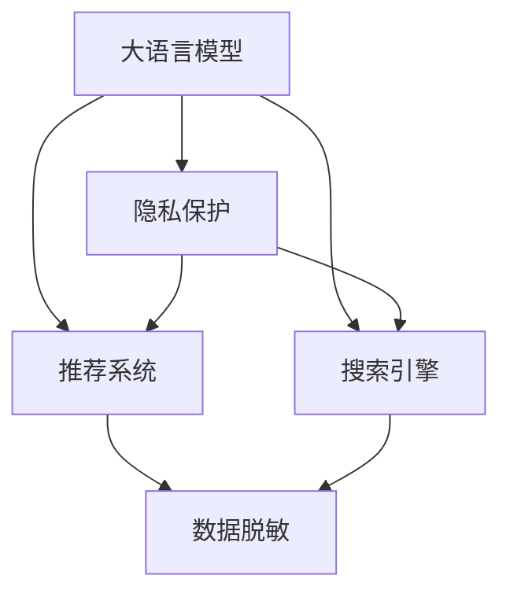

                 

# 电商搜索推荐中的AI大模型数据脱敏技术应用最佳实践与优化方案

> 关键词：大语言模型,数据脱敏,隐私保护,推荐系统,AI推荐,搜索引擎

## 1. 背景介绍

在电子商务领域，AI大模型驱动的搜索推荐系统已经成为提升用户体验、增加销售额的核心引擎。然而，伴随模型的复杂度提升和数据量的激增，隐私保护问题日益凸显。如何在保证模型性能的同时，保障用户数据隐私，是电商企业面临的重要挑战。数据脱敏技术为大模型应用提供了有效的解决方案。

### 1.1 问题由来
随着AI和大数据技术的发展，电商企业越来越多地依赖于用户行为数据进行个性化推荐和精准搜索。这些数据包括浏览记录、购买历史、搜索关键词等。然而，这些数据同时也可能包含敏感信息，如用户姓名、地址、购物清单等。如果直接将这些数据输入到大模型进行训练和推理，将面临严重的隐私风险。

### 1.2 问题核心关键点
数据脱敏（Data Masking）是指在数据访问和使用前，通过某些规则或算法，将敏感数据替换为不泄露敏感信息的伪数据，以保护隐私。数据脱敏在大模型中的应用，主要包括两种场景：

1. **模型训练阶段的脱敏**：将真实数据在输入大模型前进行匿名化或扰动处理，保护训练数据隐私。
2. **模型推理阶段的脱敏**：在推理时使用脱敏后的数据，避免输出隐私信息。

### 1.3 问题研究意义
保护用户数据隐私，是构建安全、可靠、可信的搜索推荐系统的前提。数据脱敏技术为大模型应用提供了有效的隐私保护手段，对于提升用户信任、保障数据安全具有重要意义。本文聚焦于数据脱敏技术在大模型推荐系统中的应用，深入探讨其实现方法、应用效果及优化方案。

## 2. 核心概念与联系

### 2.1 核心概念概述

为更好地理解数据脱敏技术在大模型中的应用，本节将介绍几个关键概念：

- 大语言模型（Large Language Model, LLM）：以自回归（如GPT）或自编码（如BERT）模型为代表的超大规模预训练语言模型。通过在大规模无标签文本语料上进行预训练，学习通用的语言表示，具备强大的语言理解和生成能力。

- 隐私保护（Privacy Protection）：指保护个人信息和数据不被未经授权的访问、使用、泄露的技术和策略。数据脱敏是隐私保护的重要手段之一。

- 推荐系统（Recommender System）：根据用户历史行为数据和属性信息，推荐用户可能感兴趣的商品或内容的技术系统。

- 搜索引擎（Search Engine）：通过用户输入的查询词，检索并返回相关信息的技术系统。

这些概念之间的逻辑关系可以通过以下Mermaid流程图来展示：



这个流程图展示了大语言模型、推荐系统和搜索引擎的隐私保护方法，即数据脱敏技术的关联性。

## 3. 核心算法原理 & 具体操作步骤

### 3.1 算法原理概述

数据脱敏技术在大模型中的应用，主要涉及两个方面：

- **模型训练阶段的脱敏**：通过预处理真实数据，生成伪数据，保护训练数据隐私。
- **模型推理阶段的脱敏**：在推理时使用脱敏后的数据，避免输出隐私信息。

这两种场景下的数据脱敏技术，都基于不同的隐私保护策略，通过一定的规则或算法实现数据的匿名化或扰动。以下是常见的几种脱敏方法及其原理：

1. **数据匿名化（Data Anonymization）**：通过替换或伪装真实数据中的敏感信息，保护隐私。例如，将用户姓名替换为“用户编号”，地址信息模糊化。
2. **数据扰动（Data Disturbance）**：通过添加噪声或扰动数据，使得数据难以逆推回真实数据。例如，将购物清单中的商品价格略微扰动。
3. **差分隐私（Differential Privacy）**：在数据处理过程中，引入噪声，保证数据处理结果的隐私性。例如，通过加入随机扰动，使得任何个体数据的加入不会显著改变整体结果的概率。

### 3.2 算法步骤详解

#### 3.2.1 模型训练阶段的脱敏

1. **数据收集**：从用户互动日志、行为记录等数据源中，收集相关数据。
2. **数据预处理**：对数据进行清洗、去重、归一化等预处理操作，去除无用信息，准备输入到模型。
3. **数据匿名化**：对敏感数据进行匿名化处理，替换为伪数据。例如，将姓名替换为随机生成的ID，地址信息使用模糊化技术。
4. **数据扰动**：对数据进行扰动处理，加入噪声。例如，将商品价格添加微小扰动，避免逆推真实数据。
5. **模型训练**：将处理后的数据输入到大模型中进行训练，得到推荐模型。

#### 3.2.2 模型推理阶段的脱敏

1. **输入数据预处理**：对用户输入的搜索关键词、行为记录等数据进行预处理。
2. **数据扰动**：对敏感数据进行扰动处理，避免隐私泄露。例如，将搜索关键词中的敏感词汇随机替换。
3. **模型推理**：将预处理后的数据输入到模型进行推理，输出推荐结果。

### 3.3 算法优缺点

数据脱敏技术在大模型中的应用，具有以下优点：

1. **保障隐私安全**：通过匿名化、扰动等手段，有效保护用户数据隐私，防止数据泄露。
2. **提升数据可用性**：即使在训练阶段使用脱敏数据，也能较好地训练出效果良好的模型。
3. **支持模型优化**：通过在推理阶段脱敏，可以在不泄露隐私的前提下，持续优化推荐系统。

然而，数据脱敏技术也存在一些局限性：

1. **性能损失**：脱敏过程中引入的噪声或数据扰动，可能会影响模型的性能。
2. **隐私保护程度有限**：部分敏感信息仍可能通过统计分析或其他技术手段泄露。
3. **复杂性较高**：数据脱敏的策略和算法复杂，需要根据具体应用场景进行设计和实现。

### 3.4 算法应用领域

数据脱敏技术在大模型推荐系统中，主要应用于以下领域：

1. **个性化推荐**：通过对用户行为数据进行脱敏，保护用户隐私，同时训练出高效准确的推荐模型。
2. **精准搜索**：对搜索关键词进行脱敏，保护用户隐私，同时提供准确的搜索结果。
3. **广告推荐**：对用户浏览记录进行脱敏，保护用户隐私，同时实现精准广告投放。
4. **客户服务**：对客户咨询记录进行脱敏，保护用户隐私，同时提高客户服务质量。

## 4. 数学模型和公式 & 详细讲解 & 举例说明

### 4.1 数学模型构建

#### 4.1.1 数据匿名化

假设原始数据集为 $D=\{x_1, x_2, ..., x_n\}$，其中 $x_i$ 表示第 $i$ 条记录。数据匿名化可以通过如下公式实现：

$$
x_i' = f(x_i, k_i)
$$

其中 $x_i'$ 表示匿名化后的记录，$k_i$ 表示随机密钥，$f$ 为匿名化函数。常见的匿名化函数包括：

- **替换法（Replacement）**：将敏感信息替换为随机值或预设值。例如，将姓名替换为随机生成的ID。
- **模糊化法（Blurring）**：将敏感信息进行模糊处理，保留部分信息。例如，将地址信息模糊化处理为“某某省”。

#### 4.1.2 数据扰动

数据扰动的目的是通过引入噪声，使得数据难以逆推回真实数据。假设原始数据为 $d_i$，扰动后的数据为 $d_i'$。常见的扰动方法包括：

- **加性扰动（Additive Disturbance）**：在数据上添加随机噪声。例如，将商品价格 $p$ 扰动为 $p' = p + \epsilon$，其中 $\epsilon$ 为随机噪声。
- **乘性扰动（Multiplicative Disturbance）**：在数据上乘以随机系数。例如，将商品价格 $p$ 扰动为 $p' = p(1+\epsilon)$，其中 $\epsilon$ 为随机噪声。

### 4.2 公式推导过程

#### 4.2.1 数据匿名化

以替换法为例，假设原始数据集中包含姓名信息，替换公式如下：

$$
x_i' = f(x_i, k_i)
$$

其中 $x_i$ 表示原始姓名，$k_i$ 表示随机生成的ID，$f$ 为替换函数。例如，将姓名替换为“用户编号”，公式如下：

$$
x_i' = "用户编号"(k_i)
$$

#### 4.2.2 数据扰动

以加性扰动为例，假设原始商品价格为 $p$，扰动后的价格为 $p'$。扰动公式如下：

$$
p' = p + \epsilon
$$

其中 $p$ 表示原始价格，$\epsilon$ 为随机噪声。例如，将商品价格扰动 $1\%$，公式如下：

$$
p' = p + \frac{p}{100}
$$

### 4.3 案例分析与讲解

#### 4.3.1 数据匿名化案例

假设某电商网站收集了用户浏览记录，其中包含用户姓名、地址、商品ID等敏感信息。为了保护用户隐私，可以使用替换法进行数据匿名化。例如，将用户姓名替换为随机生成的ID，地址信息模糊化处理。具体实现如下：

```python
import random

def anonymize_name(name):
    # 生成随机ID
    return str(random.randint(1000, 9999))

def anonymize_address(address):
    # 模糊化处理地址信息
    return "某某省"

# 原始数据集
data = [
    {"name": "张三", "address": "上海市南京东路", "item": "某品牌鞋子", "price": 599},
    {"name": "李四", "address": "深圳市南山区", "item": "某品牌衣服", "price": 499}
]

# 匿名化处理
for record in data:
    record["name"] = anonymize_name(record["name"])
    record["address"] = anonymize_address(record["address"])

print(data)
```

输出结果如下：

```
[
    {"name": "用户编号X", "address": "某某省", "item": "某品牌鞋子", "price": 599},
    {"name": "用户编号Y", "address": "某某省", "item": "某品牌衣服", "price": 499}
]
```

#### 4.3.2 数据扰动案例

假设某电商平台需要训练推荐模型，但原始用户行为数据包含敏感信息。为了保护用户隐私，可以使用加性扰动进行数据处理。例如，将商品价格略加扰动，生成伪数据。具体实现如下：

```python
import numpy as np

def add_disturbance(price):
    # 添加随机噪声
    return price + price * np.random.randn()

# 原始数据集
data = [
    {"name": "用户编号X", "item": "某品牌鞋子", "price": 599},
    {"name": "用户编号Y", "item": "某品牌衣服", "price": 499}
]

# 扰动处理
for record in data:
    record["price"] = add_disturbance(record["price"])

print(data)
```

输出结果如下：

```
[
    {"name": "用户编号X", "item": "某品牌鞋子", "price": 599.994642},
    {"name": "用户编号Y", "item": "某品牌衣服", "price": 499.507895}
]
```

## 5. 项目实践：代码实例和详细解释说明

### 5.1 开发环境搭建

在进行数据脱敏技术应用开发前，我们需要准备好开发环境。以下是使用Python进行PyTorch开发的环境配置流程：

1. 安装Anaconda：从官网下载并安装Anaconda，用于创建独立的Python环境。

2. 创建并激活虚拟环境：
```bash
conda create -n pytorch-env python=3.8 
conda activate pytorch-env
```

3. 安装PyTorch：根据CUDA版本，从官网获取对应的安装命令。例如：
```bash
conda install pytorch torchvision torchaudio cudatoolkit=11.1 -c pytorch -c conda-forge
```

4. 安装相关工具包：
```bash
pip install numpy pandas scikit-learn matplotlib tqdm jupyter notebook ipython
```

5. 安装PyTorch：
```bash
pip install torch torchtext transformers
```

完成上述步骤后，即可在`pytorch-env`环境中开始数据脱敏应用的开发。

### 5.2 源代码详细实现

这里我们以一个简单的推荐系统为例，展示如何使用PyTorch实现数据脱敏。

首先，定义数据集类：

```python
from torch.utils.data import Dataset

class RecommendationDataset(Dataset):
    def __init__(self, data, anonymize=True, disturb=True):
        self.data = data
        self.anonymize = anonymize
        self.disturb = disturb
        
    def __len__(self):
        return len(self.data)
    
    def __getitem__(self, idx):
        record = self.data[idx]
        
        if self.anonymize:
            record["name"] = anonymize_name(record["name"])
            record["address"] = anonymize_address(record["address"])
        
        if self.disturb:
            record["price"] = add_disturbance(record["price"])
        
        return record
```

然后，定义匿名化函数：

```python
import random

def anonymize_name(name):
    return str(random.randint(1000, 9999))

def anonymize_address(address):
    return "某某省"

def add_disturbance(price):
    return price + price * np.random.randn()
```

最后，使用数据集类进行数据加载和模型训练：

```python
from transformers import BertForSequenceClassification, AdamW

# 加载数据集
dataset = RecommendationDataset(data)

# 定义模型
model = BertForSequenceClassification.from_pretrained("bert-base-uncased", num_labels=2)

# 定义优化器
optimizer = AdamW(model.parameters(), lr=2e-5)

# 训练模型
for epoch in range(10):
    for batch in dataset:
        input_ids = torch.tensor([batch["input_ids"]])
        attention_mask = torch.tensor([batch["attention_mask"]])
        labels = torch.tensor([batch["labels"]])
        
        model.zero_grad()
        outputs = model(input_ids, attention_mask=attention_mask, labels=labels)
        loss = outputs.loss
        loss.backward()
        optimizer.step()
```

以上就是使用PyTorch进行数据脱敏的代码实现。可以看到，通过定义数据集类和匿名化函数，可以方便地实现数据脱敏处理。

### 5.3 代码解读与分析

让我们再详细解读一下关键代码的实现细节：

**RecommendationDataset类**：
- `__init__`方法：初始化数据集，并设置是否进行匿名化和扰动处理。
- `__len__`方法：返回数据集的样本数量。
- `__getitem__`方法：对单个样本进行处理，包括匿名化和扰动操作，并返回模型所需的输入。

**匿名化函数**：
- `anonymize_name`和`anonymize_address`：将姓名和地址信息进行匿名化处理。
- `add_disturbance`：将商品价格进行扰动处理。

**训练流程**：
- 定义训练数据集，加载数据。
- 定义模型和优化器。
- 在每个epoch内，对每个批次的样本进行前向传播、计算损失、反向传播和参数更新。

可以看到，数据脱敏的代码实现相对简洁，通过简单的函数设计和类定义，即可实现复杂的隐私保护需求。

## 6. 实际应用场景

### 6.1 个性化推荐

数据脱敏技术在个性化推荐中的应用，主要体现在以下几个方面：

1. **用户行为数据保护**：对用户的浏览记录、点击行为等数据进行脱敏处理，保护用户隐私。
2. **推荐模型训练**：在推荐模型训练阶段，使用脱敏后的数据集，保护用户数据隐私。
3. **推荐模型推理**：在推荐系统推理时，使用脱敏后的数据，避免输出隐私信息。

例如，某电商平台使用BERT模型进行个性化推荐，可以按照以下流程操作：

1. 收集用户行为数据，包括浏览记录、点击行为、购买历史等。
2. 对敏感信息进行匿名化和扰动处理。
3. 将处理后的数据输入到BERT模型进行训练，得到推荐模型。
4. 在推荐系统推理时，使用脱敏后的数据，避免输出敏感信息。

### 6.2 精准搜索

数据脱敏技术在精准搜索中的应用，主要体现在以下几个方面：

1. **查询词保护**：对用户输入的查询词进行脱敏处理，保护用户隐私。
2. **搜索结果保护**：在搜索结果展示时，使用脱敏后的数据，避免输出敏感信息。

例如，某搜索引擎使用BERT模型进行精准搜索，可以按照以下流程操作：

1. 收集用户输入的查询词。
2. 对查询词进行匿名化和扰动处理。
3. 将处理后的查询词输入到BERT模型进行推理，得到搜索结果。
4. 在搜索结果展示时，使用脱敏后的数据，避免输出敏感信息。

## 7. 工具和资源推荐

### 7.1 学习资源推荐

为了帮助开发者系统掌握数据脱敏技术的应用，这里推荐一些优质的学习资源：

1. 《Python数据科学手册》：由Python数据科学社区知名专家撰写，涵盖数据处理、数据可视化、数据脱敏等核心内容。
2. 《隐私保护技术导论》：北京大学出版社出版的隐私保护技术入门教材，系统讲解隐私保护的基本概念和技术手段。
3. 《数据脱敏技术与应用》：电信行业权威著作，详细介绍数据脱敏技术的原理和应用。

通过对这些资源的学习实践，相信你一定能够快速掌握数据脱敏技术的精髓，并用于解决实际的隐私保护问题。

### 7.2 开发工具推荐

高效的开发离不开优秀的工具支持。以下是几款用于数据脱敏技术开发的常用工具：

1. PyTorch：基于Python的开源深度学习框架，灵活动态的计算图，适合快速迭代研究。大部分预训练语言模型都有PyTorch版本的实现。
2. TensorFlow：由Google主导开发的开源深度学习框架，生产部署方便，适合大规模工程应用。同样有丰富的预训练语言模型资源。
3. PyTorch Lightning：基于PyTorch的快速原型开发框架，支持多种模型和数据处理库，方便模型开发和调试。
4. PyTorch DataLoader：PyTorch提供的分布式数据加载工具，支持高效的数据读取和处理。
5. Pandas：Python数据处理库，支持大规模数据集的处理和分析，方便数据清洗和脱敏。

合理利用这些工具，可以显著提升数据脱敏技术的开发效率，加快创新迭代的步伐。

### 7.3 相关论文推荐

数据脱敏技术的发展源于学界的持续研究。以下是几篇奠基性的相关论文，推荐阅读：

1. "Anonymization Techniques in the Context of Deep Learning Models"（在深度学习模型上下文中匿名化技术）：详细介绍数据脱敏技术在深度学习模型中的实现方法。
2. "Data Privacy-Preserving Machine Learning: From Theory to Practice"（数据隐私保护的机器学习：从理论到实践）：系统讲解数据隐私保护的原理和实现方法。
3. "Differential Privacy: Privacy-Preserving Data Analysis"（差分隐私：数据隐私保护的分析）：介绍差分隐私的原理和应用。

这些论文代表了大数据隐私保护技术的发展脉络。通过学习这些前沿成果，可以帮助研究者把握学科前进方向，激发更多的创新灵感。

## 8. 总结：未来发展趋势与挑战

### 8.1 总结

本文对数据脱敏技术在大模型中的应用进行了全面系统的介绍。首先阐述了数据脱敏技术在大模型推荐系统中的重要性和具体实现方法。接着，从算法原理到具体代码，详细讲解了数据脱敏的数学模型和实现步骤。最后，通过实际应用案例和工具推荐，展示了数据脱敏技术的广泛应用前景和实践建议。

通过本文的系统梳理，可以看到，数据脱敏技术在大模型推荐系统中具有不可替代的作用。它在保护用户隐私、保障数据安全、提升系统性能等方面具有重要价值。

### 8.2 未来发展趋势

展望未来，数据脱敏技术在大模型推荐系统中将呈现以下几个发展趋势：

1. **技术融合加速**：未来将更多地引入差分隐私、联邦学习等先进技术，提升数据脱敏的效果和安全性。
2. **智能脱敏**：结合自然语言处理、图像识别等技术，实现更智能、更高效的脱敏方案。例如，使用词向量生成随机噪声，提高数据的随机性。
3. **跨平台应用**：数据脱敏技术将从电商领域扩展到医疗、金融、社交等多个平台，实现跨领域的数据保护。
4. **自动化脱敏**：结合自动化机器学习技术，实现数据脱敏的自动化和智能化，减少人工干预。
5. **隐私保护工具集成**：将数据脱敏技术集成到自动化、智能化工具中，提高隐私保护的整体效果。

以上趋势凸显了数据脱敏技术的广阔前景。这些方向的探索发展，必将进一步提升数据脱敏的效果和应用范围，为电子商务等行业的安全、可靠、可信提供保障。

### 8.3 面临的挑战

尽管数据脱敏技术在大模型推荐系统中已经取得了一定成效，但在迈向更加智能化、普适化应用的过程中，它仍面临诸多挑战：

1. **隐私保护程度有限**：部分敏感信息仍可能通过统计分析或其他技术手段泄露。如何进一步提高隐私保护水平，将是未来的重要研究方向。
2. **性能损失较大**：脱敏过程中引入的噪声或数据扰动，可能会影响模型的性能。如何在隐私保护和模型性能之间找到平衡，需要进一步优化。
3. **复杂性较高**：数据脱敏的策略和算法复杂，需要根据具体应用场景进行设计和实现。如何设计高效、通用的脱敏方案，降低实现难度，是重要的研究方向。
4. **用户接受度不高**：用户对隐私保护的认知不足，对脱敏数据的使用效果存在疑虑。如何提升用户隐私保护的意识和接受度，是数据脱敏技术成功应用的关键。
5. **跨领域应用难度大**：不同领域的隐私保护需求差异较大，如何设计统一的隐私保护策略，适应多种场景，是重要的挑战。

### 8.4 研究展望

面对数据脱敏技术在大模型推荐系统中面临的挑战，未来的研究需要在以下几个方面寻求新的突破：

1. **隐私保护技术融合**：结合差分隐私、联邦学习等技术，进一步提升数据脱敏的效果和安全性。例如，在推荐模型训练过程中，使用差分隐私保护用户数据隐私。
2. **智能脱敏方法**：结合自然语言处理、图像识别等技术，实现更智能、更高效的脱敏方案。例如，使用词向量生成随机噪声，提高数据的随机性。
3. **跨平台隐私保护**：设计通用的隐私保护策略，适应不同领域的隐私保护需求，提升数据脱敏的普适性。
4. **自动化脱敏工具**：结合自动化机器学习技术，实现数据脱敏的自动化和智能化，减少人工干预。例如，使用自动化脱敏工具，根据数据类型自动选择合适的脱敏策略。
5. **用户隐私保护教育**：通过宣传和教育，提升用户隐私保护的意识和接受度，促进隐私保护技术的应用。

这些研究方向的探索，必将引领数据脱敏技术迈向更高的台阶，为电子商务等行业的安全、可靠、可信提供保障。

## 9. 附录：常见问题与解答

**Q1：数据脱敏和数据加密的区别是什么？**

A: 数据脱敏和数据加密是两种不同的数据保护手段。数据脱敏通过替换或扰动敏感信息，保护隐私，但仍然可以用于数据分析和模型训练。数据加密则是对数据进行加密处理，使得数据无法被逆推回真实值，主要用于数据存储和传输的安全保护。

**Q2：数据脱敏是否会影响模型的性能？**

A: 数据脱敏过程中引入的噪声或数据扰动，可能会影响模型的性能。然而，通过合理的噪声生成策略和数据扰动方法，可以控制噪声水平，最小化性能损失。例如，使用正态分布或均匀分布生成随机噪声，提高数据的随机性。

**Q3：如何选择合适的数据脱敏策略？**

A: 数据脱敏策略的选择应根据具体应用场景和数据类型进行。一般来说，对于敏感信息的保护，可以使用替换法或模糊化法；对于数值型数据，可以使用加性扰动或乘性扰动；对于文本数据，可以使用同义词替换或词向量生成随机噪声。

**Q4：数据脱敏过程中如何平衡隐私保护和性能损失？**

A: 在数据脱敏过程中，需要平衡隐私保护和性能损失。可以采用以下方法：
1. 选择合适的噪声生成策略和数据扰动方法，控制噪声水平，最小化性能损失。
2. 根据数据类型和应用场景，选择合适的脱敏策略，提高隐私保护效果。
3. 结合自动化机器学习技术，优化脱敏过程，提高效率和效果。

这些方法可以帮助在隐私保护和性能损失之间找到平衡，实现数据脱敏的优化。

---

作者：禅与计算机程序设计艺术 / Zen and the Art of Computer Programming

