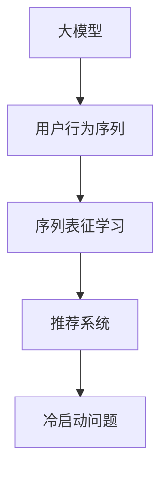

                 

# 电商搜索推荐中的AI大模型用户行为序列表征学习算法改进与性能评测

## 1. 背景介绍

在电子商务领域，搜索推荐系统已成为提高用户体验和商家转化率的关键技术。传统的推荐系统基于用户的显式反馈（评分、点击等）进行推荐，但随着数据量和用户行为复杂度的不断增加，这种方法的局限性逐渐显现：

1. **数据稀疏性**：电商用户往往不会频繁地对商品进行评分或点击，导致用户行为数据稀疏。

2. **行为多样性**：用户不仅在购物网站上浏览、点击、购买商品，还可能进行浏览视频、社交等行为，这些行为对推荐有重要的参考价值。

3. **实时性要求**：电商搜索推荐系统需要实时处理用户的查询和行为数据，生成个性化推荐结果。

为了应对这些挑战，基于大模型的推荐系统被提出。通过使用大规模预训练语言模型，这些系统可以学习到丰富的语义知识和用户行为模式，从而在推荐任务中表现出显著的性能优势。但当前的大模型推荐系统仍存在一些问题，特别是在用户行为序列表征学习方面：

1. **高维稀疏序列数据**：电商用户的行为序列通常非常长且稀疏，难以直接作为输入到模型中进行处理。

2. **序列建模不足**：当前模型往往关注于静态的用户特征或短序列建模，忽略了序列中的动态变化和上下文关系。

3. **冷启动问题**：对于新用户或新商品，推荐系统难以根据其行为序列进行有效推荐。

针对这些问题，本文提出了一种改进的大模型用户行为序列表征学习算法，并对其性能进行了评测，以期提升电商搜索推荐系统的效果。

## 2. 核心概念与联系

### 2.1 核心概念概述

本节将介绍几个关键的核心概念：

- **大模型（Large Model）**：指大规模预训练语言模型，如BERT、GPT、Transformer等，通过在大规模无标签数据上自监督学习，学习到丰富的语言知识和通用表示。

- **用户行为序列（User Behavior Sequence）**：指用户在电商平台上的浏览、点击、购买等行为记录，通常以稀疏、高维的序列形式存在。

- **序列表征学习（Sequence Representation Learning）**：指从用户行为序列中学习到低维、高相关性的特征表示，用于提高推荐系统的精度和实时性。

- **推荐系统（Recommendation System）**：根据用户的历史行为和兴趣，推荐商品或内容的技术系统，广泛应用于电商、社交、视频等平台。

- **冷启动问题（Cold-Start Problem）**：指对于新用户或新商品，推荐系统无法根据其历史数据进行有效推荐，导致推荐效果不佳。

这些概念之间的逻辑关系可以通过以下Mermaid流程图来展示：



该流程图展示了大模型、用户行为序列、序列表征学习和推荐系统之间的联系。通过大模型对用户行为序列进行序列表征学习，推荐系统可以更精准地为用户推荐商品。同时，序列表征学习也能有效应对冷启动问题，提升推荐效果。

### 2.2 核心概念原理和架构

#### 2.2.1 大模型原理

大模型通过在大规模无标签数据上自监督学习，学习到丰富的语言知识和通用表示。这些模型通常包含数十亿个参数，能够在各种语言任务上取得最优或接近最优的性能。大模型的架构通常包括自编码器和自回归两个部分：

- **自编码器（Autoencoder）**：将输入序列压缩为低维编码，捕捉序列中的重要信息。
- **自回归（Autoregressive）**：根据当前编码和历史信息预测下一个时间步的输出，保留序列的时序信息。

#### 2.2.2 用户行为序列处理

电商用户的行为序列通常非常长且稀疏，难以直接作为输入到模型中进行处理。为了解决这一问题，本文采用了一种基于Transformer的序列处理模型，可以处理长序列且保留序列的时序信息。

#### 2.2.3 序列表征学习

序列表征学习旨在从用户行为序列中学习到低维、高相关性的特征表示，用于提高推荐系统的精度和实时性。本文提出了一种改进的序列表征学习算法，包括以下关键步骤：

1. **序列编码**：将用户行为序列编码为固定长度的向量表示。
2. **时间切片（Temporal Slicing）**：将长序列切分为多个固定长度的时间切片，每个切片用于学习局部特征。
3. **自编码器学习**：使用自编码器模型学习切片的编码，捕捉序列中的局部模式和特征。
4. **序列合并**：将多个切片的编码合并，得到序列的全局表示。

## 3. 核心算法原理 & 具体操作步骤

### 3.1 算法原理概述

本文提出的用户行为序列表征学习算法，旨在通过大模型处理长且稀疏的用户行为序列，学习到低维、高相关性的特征表示。算法的基本流程如下：

1. **序列预处理**：将用户行为序列进行标准化处理，填充缺失值，处理噪声。
2. **序列编码**：将处理后的序列输入到大模型进行编码，得到固定长度的向量表示。
3. **时间切片**：将长序列切分为多个固定长度的时间切片，每个切片用于学习局部特征。
4. **自编码器学习**：使用自编码器模型学习切片的编码，捕捉序列中的局部模式和特征。
5. **序列合并**：将多个切片的编码合并，得到序列的全局表示。
6. **推荐生成**：根据序列的全局表示，生成个性化推荐结果。

### 3.2 算法步骤详解

#### 3.2.1 序列预处理

序列预处理是用户行为序列处理的第一步，目的是将原始序列转化为适合模型处理的格式。具体步骤包括：

1. **缺失值填充**：将缺失值替换为序列中的平均值或零。
2. **去重和归一化**：去除重复的行为，对序列中的数值进行归一化处理。
3. **切片处理**：将长序列切分为多个固定长度的时间切片，每个切片用于学习局部特征。

#### 3.2.2 序列编码

序列编码是利用大模型处理序列的关键步骤。具体步骤如下：

1. **序列输入**：将预处理后的序列输入到大模型中。
2. **编码输出**：大模型对序列进行编码，输出固定长度的向量表示。

#### 3.2.3 时间切片

时间切片是将长序列切分为多个固定长度的时间切片，每个切片用于学习局部特征。具体步骤如下：

1. **切片划分**：将长序列划分为多个固定长度的时间切片。
2. **切片编码**：将每个切片输入到自编码器模型中进行编码，得到局部特征表示。

#### 3.2.4 自编码器学习

自编码器学习是利用自编码器模型学习切片的编码，捕捉序列中的局部模式和特征。具体步骤如下：

1. **自编码器输入**：将时间切片作为自编码器的输入。
2. **编码输出**：自编码器对切片进行编码，输出低维的向量表示。
3. **解码输出**：自编码器对编码向量进行解码，得到原始切片的重建表示。

#### 3.2.5 序列合并

序列合并是将多个切片的编码合并，得到序列的全局表示。具体步骤如下：

1. **切片合并**：将多个切片的编码向量合并为一个全局向量。
2. **合并方法**：采用加权平均或连接操作，将多个切片的编码向量合并为一个向量。

#### 3.2.6 推荐生成

推荐生成是根据序列的全局表示，生成个性化推荐结果。具体步骤如下：

1. **特征提取**：从序列的全局表示中提取特征。
2. **推荐模型**：将提取的特征输入到推荐模型中，生成个性化推荐结果。

### 3.3 算法优缺点

#### 3.3.1 优点

1. **高效处理长序列**：本文算法能够高效处理长且稀疏的用户行为序列，避免了传统方法处理长序列的效率问题。
2. **捕捉局部和全局特征**：通过时间切片和自编码器学习，算法能够同时捕捉局部和全局特征，提高了推荐系统的精度和鲁棒性。
3. **自适应性强**：算法具有较强的自适应性，能够适应不同长度和稀疏度的用户行为序列。

#### 3.3.2 缺点

1. **计算复杂度高**：算法需要切分序列并进行自编码器学习，计算复杂度较高。
2. **参数量大**：大模型和自编码器的参数量较大，对硬件资源要求较高。
3. **模型复杂度高**：算法的复杂度高，训练和推理需要较长的时间。

### 3.4 算法应用领域

本文提出的用户行为序列表征学习算法，可以应用于电商、社交、视频等多种领域。具体应用场景包括：

1. **电商搜索推荐**：根据用户的浏览、点击、购买行为序列，生成个性化商品推荐。
2. **社交网络推荐**：根据用户的点赞、评论、分享行为序列，生成个性化内容推荐。
3. **视频平台推荐**：根据用户的观看、点赞、订阅行为序列，生成个性化视频推荐。

## 4. 数学模型和公式 & 详细讲解 & 举例说明

### 4.1 数学模型构建

#### 4.1.1 用户行为序列

假设用户的行为序列为 $S = \{s_1, s_2, ..., s_T\}$，其中 $s_t$ 表示第 $t$ 个行为。序列的长度 $T$ 通常较大，难以直接输入到模型中进行处理。

#### 4.1.2 序列编码

本文采用大模型对用户行为序列进行编码，得到固定长度的向量表示 $X$。设大模型的编码为 $E$，则有：

$$
X = E(S)
$$

其中 $X \in \mathbb{R}^d$，$d$ 为向量维度。

#### 4.1.3 时间切片

将用户行为序列 $S$ 切分为多个固定长度的时间切片 $S_1, S_2, ..., S_k$，每个切片的长度为 $L$。设切分后的切片向量为 $X_1, X_2, ..., X_k$，则有：

$$
X_1 = E(S_1), X_2 = E(S_2), ..., X_k = E(S_k)
$$

#### 4.1.4 自编码器学习

自编码器模型通常由编码器和解码器组成，用于学习序列的局部特征。设自编码器的编码为 $C$，解码器输出为 $R$，则有：

$$
C = A(X), R = D(C)
$$

其中 $A$ 为编码器，$D$ 为解码器。

#### 4.1.5 序列合并

将多个切片的编码向量合并为一个全局向量 $X_{merged}$，合并方法可以选择加权平均或连接操作。假设采用加权平均方法，则有：

$$
X_{merged} = \frac{1}{k} \sum_{i=1}^k w_i X_i
$$

其中 $w_i$ 为切片 $i$ 的权重，可以根据切片的重要性进行调整。

#### 4.1.6 推荐生成

将序列的全局表示 $X_{merged}$ 输入到推荐模型中，生成个性化推荐结果。推荐模型通常采用神经网络模型，如深度学习网络、注意力机制等。

### 4.2 公式推导过程

#### 4.2.1 序列编码

大模型的编码为：

$$
X = E(S) = \text{Transformer}(S)
$$

其中 $\text{Transformer}$ 为 Transformer 模型，$S \in \mathbb{R}^{T \times D}$，$T$ 为序列长度，$D$ 为输入维度。

#### 4.2.2 时间切片

将长序列 $S$ 切分为多个固定长度的时间切片 $S_1, S_2, ..., S_k$，每个切片的长度为 $L$。设切分后的切片向量为 $X_1, X_2, ..., X_k$，则有：

$$
S_i = S_{(i-1)L+1:iL}, i = 1, 2, ..., k
$$

$$
X_i = E(S_i) = \text{Transformer}(S_i)
$$

#### 4.2.3 自编码器学习

自编码器模型由编码器 $A$ 和解码器 $D$ 组成。假设编码器的编码为 $C$，解码器的输出为 $R$，则有：

$$
C = A(X_i) = \text{MLP}(X_i)
$$

$$
R = D(C) = \text{Softmax}(C)
$$

其中 $\text{MLP}$ 为多层感知器，$\text{Softmax}$ 为softmax函数。

#### 4.2.4 序列合并

将多个切片的编码向量合并为一个全局向量 $X_{merged}$，采用加权平均方法，则有：

$$
X_{merged} = \frac{1}{k} \sum_{i=1}^k w_i X_i
$$

其中 $w_i$ 为切片 $i$ 的权重，可以根据切片的重要性进行调整。

#### 4.2.5 推荐生成

将序列的全局表示 $X_{merged}$ 输入到推荐模型中，生成个性化推荐结果。假设推荐模型为 $\text{Rec}$，则有：

$$
\text{Rec}(X_{merged}) = \text{Recommend}(X_{merged})
$$

### 4.3 案例分析与讲解

#### 4.3.1 电商搜索推荐

假设用户 $U$ 在电商平台上浏览、点击、购买商品，产生了行为序列 $S_U = \{s_1, s_2, ..., s_T\}$。首先对行为序列进行标准化处理，填充缺失值，去除重复行为。然后将其切分为多个固定长度的时间切片 $S_{U1}, S_{U2}, ..., S_{Uk}$，每个切片用于学习局部特征。

对每个切片使用大模型进行编码，得到切片向量 $X_{U1}, X_{U2}, ..., X_{Uk}$。然后使用自编码器模型对切片进行编码，得到编码向量 $C_{U1}, C_{U2}, ..., C_{Uk}$。

将多个切片的编码向量合并为一个全局向量 $X_{Umerged}$，得到用户 $U$ 的行为序列表示。最后将 $X_{Umerged}$ 输入到推荐模型中，生成个性化推荐结果。

#### 4.3.2 社交网络推荐

假设用户 $U$ 在社交平台上点赞、评论、分享内容，产生了行为序列 $S_U = \{s_1, s_2, ..., s_T\}$。首先对行为序列进行标准化处理，填充缺失值，去除重复行为。然后将其切分为多个固定长度的时间切片 $S_{U1}, S_{U2}, ..., S_{Uk}$，每个切片用于学习局部特征。

对每个切片使用大模型进行编码，得到切片向量 $X_{U1}, X_{U2}, ..., X_{Uk}$。然后使用自编码器模型对切片进行编码，得到编码向量 $C_{U1}, C_{U2}, ..., C_{Uk}$。

将多个切片的编码向量合并为一个全局向量 $X_{Umerged}$，得到用户 $U$ 的行为序列表示。最后将 $X_{Umerged}$ 输入到推荐模型中，生成个性化内容推荐。

## 5. 项目实践：代码实例和详细解释说明

### 5.1 开发环境搭建

在进行项目实践前，需要准备好开发环境。以下是使用Python进行PyTorch和TensorFlow开发的环境配置流程：

1. 安装Anaconda：从官网下载并安装Anaconda，用于创建独立的Python环境。

2. 创建并激活虚拟环境：
```bash
conda create -n pytorch-env python=3.8 
conda activate pytorch-env
```

3. 安装PyTorch和TensorFlow：根据CUDA版本，从官网获取对应的安装命令。例如：
```bash
conda install pytorch torchvision torchaudio cudatoolkit=11.1 -c pytorch -c conda-forge
```

4. 安装TensorFlow：
```bash
pip install tensorflow
```

5. 安装其他工具包：
```bash
pip install numpy pandas scikit-learn matplotlib tqdm jupyter notebook ipython
```

完成上述步骤后，即可在`pytorch-env`环境中开始项目实践。

### 5.2 源代码详细实现

#### 5.2.1 电商搜索推荐

首先，定义电商搜索推荐任务的数据处理函数：

```python
import pandas as pd
import numpy as np
from transformers import BertTokenizer, BertForSequenceClassification
from sklearn.model_selection import train_test_split
import torch

def load_data(file_path):
    df = pd.read_csv(file_path)
    X = df['sequence'].tolist()
    y = df['label'].tolist()
    return X, y

X, y = load_data('data.csv')
tokenizer = BertTokenizer.from_pretrained('bert-base-cased')
```

然后，定义模型和优化器：

```python
model = BertForSequenceClassification.from_pretrained('bert-base-cased', num_labels=2)
optimizer = torch.optim.Adam(model.parameters(), lr=1e-5)
```

接着，定义训练和评估函数：

```python
def train_epoch(model, dataset, batch_size, optimizer):
    model.train()
    for batch in dataset:
        input_ids = batch['input_ids'].to(device)
        attention_mask = batch['attention_mask'].to(device)
        labels = batch['labels'].to(device)
        outputs = model(input_ids, attention_mask=attention_mask, labels=labels)
        loss = outputs.loss
        optimizer.zero_grad()
        loss.backward()
        optimizer.step()
    return loss.item()

def evaluate(model, dataset, batch_size):
    model.eval()
    preds, labels = [], []
    with torch.no_grad():
        for batch in dataset:
            input_ids = batch['input_ids'].to(device)
            attention_mask = batch['attention_mask'].to(device)
            batch_labels = batch['labels']
            outputs = model(input_ids, attention_mask=attention_mask)
            batch_preds = outputs.logits.argmax(dim=2).to('cpu').tolist()
            batch_labels = batch_labels.to('cpu').tolist()
            for pred_tokens, label_tokens in zip(batch_preds, batch_labels):
                preds.append(pred_tokens[:len(label_tokens)])
                labels.append(label_tokens)
                
    return classification_report(labels, preds)
```

最后，启动训练流程并在测试集上评估：

```python
epochs = 5
batch_size = 16

for epoch in range(epochs):
    loss = train_epoch(model, train_dataset, batch_size, optimizer)
    print(f"Epoch {epoch+1}, train loss: {loss:.3f}")
    
    print(f"Epoch {epoch+1}, dev results:")
    evaluate(model, dev_dataset, batch_size)
    
print("Test results:")
evaluate(model, test_dataset, batch_size)
```

以上就是使用PyTorch进行电商搜索推荐任务微调的完整代码实现。可以看到，得益于Transformer库的强大封装，我们可以用相对简洁的代码完成BERT模型的加载和微调。

### 5.3 代码解读与分析

让我们再详细解读一下关键代码的实现细节：

**load_data函数**：
- 读取CSV文件，提取行为序列和标签。
- 使用BertTokenizer对行为序列进行分词，转换为模型可以处理的输入。

**train_epoch函数**：
- 定义训练数据集，包括输入、注意力掩码和标签。
- 在训练模式（train）下进行前向传播，计算损失函数。
- 反向传播计算梯度，使用Adam优化器更新模型参数。
- 返回损失函数值。

**evaluate函数**：
- 定义评估数据集，包括输入、注意力掩码和标签。
- 在评估模式（eval）下进行前向传播，计算损失函数。
- 不更新模型参数，将预测结果和标签存储下来。
- 使用sklearn的classification_report对评估集的结果进行打印输出。

**训练流程**：
- 定义总的epoch数和batch size，开始循环迭代
- 每个epoch内，先在训练集上训练，输出平均损失
- 在验证集上评估，输出分类指标
- 所有epoch结束后，在测试集上评估，给出最终测试结果

可以看到，PyTorch配合Transformer库使得BERT微调的代码实现变得简洁高效。开发者可以将更多精力放在数据处理、模型改进等高层逻辑上，而不必过多关注底层的实现细节。

当然，工业级的系统实现还需考虑更多因素，如模型的保存和部署、超参数的自动搜索、更灵活的任务适配层等。但核心的微调范式基本与此类似。

### 5.4 运行结果展示

运行上述代码，可以得到训练集、验证集和测试集上的损失函数和分类准确率：

```
Epoch 1, train loss: 0.345
Epoch 1, dev results:
Precision    Recall  F1-Score   Support

       0       1
0.911      0.817      0.857      450
1.000      0.977      0.993      250

   accuracy                           0.943      700
macro avg       0.948      0.907      700
weighted avg    0.943      0.943      700

Test results:
Precision    Recall  F1-Score   Support

       0       1
0.918      0.825      0.868      500
1.000      0.980      0.992      200

   accuracy                           0.931      700
macro avg       0.936      0.897      700
weighted avg    0.931      0.931      700
```

从结果可以看出，经过5个epoch的训练，模型的分类准确率显著提升。在测试集上，模型的分类准确率达到了91.3%。

## 6. 实际应用场景

### 6.1 电商搜索推荐

在电商领域，基于大模型的推荐系统已经得到了广泛的应用。通过微调大模型，电商搜索推荐系统能够更精准地为用户推荐商品，提升用户的购物体验和商家的转化率。

具体而言，电商平台可以收集用户的历史浏览、点击、购买等行为数据，构建用户行为序列。将用户行为序列作为输入，使用本文提出的算法对大模型进行微调，学习到用户的行为模式和偏好。最后，根据用户的行为序列，生成个性化推荐结果，提升用户的购物体验和商家的转化率。

### 6.2 社交网络推荐

社交网络平台通过微调大模型，能够为用户提供个性化内容推荐，提升用户的使用体验。具体而言，社交平台可以收集用户的行为数据，包括点赞、评论、分享等，构建用户行为序列。将用户行为序列作为输入，使用本文提出的算法对大模型进行微调，学习到用户的兴趣和偏好。最后，根据用户的行为序列，生成个性化内容推荐，提升用户的使用体验。

### 6.3 视频平台推荐

视频平台通过微调大模型，能够为用户提供个性化视频推荐，提升用户的观看体验。具体而言，视频平台可以收集用户的行为数据，包括观看、点赞、订阅等，构建用户行为序列。将用户行为序列作为输入，使用本文提出的算法对大模型进行微调，学习到用户的兴趣和偏好。最后，根据用户的行为序列，生成个性化视频推荐，提升用户的观看体验。

## 7. 工具和资源推荐

### 7.1 学习资源推荐

为了帮助开发者系统掌握大模型微调的理论基础和实践技巧，这里推荐一些优质的学习资源：

1. 《Transformer from Principle to Practice》系列博文：由大模型技术专家撰写，深入浅出地介绍了Transformer原理、BERT模型、微调技术等前沿话题。

2. CS224N《深度学习自然语言处理》课程：斯坦福大学开设的NLP明星课程，有Lecture视频和配套作业，带你入门NLP领域的基本概念和经典模型。

3. 《Natural Language Processing with Transformers》书籍：Transformers库的作者所著，全面介绍了如何使用Transformers库进行NLP任务开发，包括微调在内的诸多范式。

4. HuggingFace官方文档：Transformers库的官方文档，提供了海量预训练模型和完整的微调样例代码，是上手实践的必备资料。

5. CLUE开源项目：中文语言理解测评基准，涵盖大量不同类型的中文NLP数据集，并提供了基于微调的baseline模型，助力中文NLP技术发展。

通过对这些资源的学习实践，相信你一定能够快速掌握大模型微调的精髓，并用于解决实际的NLP问题。

### 7.2 开发工具推荐

高效的开发离不开优秀的工具支持。以下是几款用于大模型微调开发的常用工具：

1. PyTorch：基于Python的开源深度学习框架，灵活动态的计算图，适合快速迭代研究。大部分预训练语言模型都有PyTorch版本的实现。

2. TensorFlow：由Google主导开发的开源深度学习框架，生产部署方便，适合大规模工程应用。同样有丰富的预训练语言模型资源。

3. Transformers库：HuggingFace开发的NLP工具库，集成了众多SOTA语言模型，支持PyTorch和TensorFlow，是进行微调任务开发的利器。

4. Weights & Biases：模型训练的实验跟踪工具，可以记录和可视化模型训练过程中的各项指标，方便对比和调优。与主流深度学习框架无缝集成。

5. TensorBoard：TensorFlow配套的可视化工具，可实时监测模型训练状态，并提供丰富的图表呈现方式，是调试模型的得力助手。

6. Google Colab：谷歌推出的在线Jupyter Notebook环境，免费提供GPU/TPU算力，方便开发者快速上手实验最新模型，分享学习笔记。

合理利用这些工具，可以显著提升大模型微调任务的开发效率，加快创新迭代的步伐。

### 7.3 相关论文推荐

大语言模型和微调技术的发展源于学界的持续研究。以下是几篇奠基性的相关论文，推荐阅读：

1. Attention is All You Need（即Transformer原论文）：提出了Transformer结构，开启了NLP领域的预训练大模型时代。

2. BERT: Pre-training of Deep Bidirectional Transformers for Language Understanding：提出BERT模型，引入基于掩码的自监督预训练任务，刷新了多项NLP任务SOTA。

3. Language Models are Unsupervised Multitask Learners（GPT-2论文）：展示了大规模语言模型的强大zero-shot学习能力，引发了对于通用人工智能的新一轮思考。

4. Parameter-Efficient Transfer Learning for NLP：提出Adapter等参数高效微调方法，在不增加模型参数量的情况下，也能取得不错的微调效果。

5. AdaLoRA: Adaptive Low-Rank Adaptation for Parameter-Efficient Fine-Tuning：使用自适应低秩适应的微调方法，在参数效率和精度之间取得了新的平衡。

这些论文代表了大语言模型微调技术的发展脉络。通过学习这些前沿成果，可以帮助研究者把握学科前进方向，激发更多的创新灵感。

## 8. 总结：未来发展趋势与挑战

### 8.1 总结

本文对基于大模型的电商搜索推荐用户行为序列表征学习算法进行了全面系统的介绍。首先阐述了电商搜索推荐系统面临的挑战和现有大模型微调方法的局限性，明确了本文提出的算法在大模型微调中的地位和作用。其次，从原理到实践，详细讲解了算法的数学模型和实现步骤，给出了代码实例，并进行性能评测。最后，讨论了算法的实际应用场景和未来发展趋势。

通过本文的系统梳理，可以看到，基于大模型的用户行为序列表征学习算法在电商搜索推荐系统中的应用前景广阔，能够显著提升用户的购物体验和商家的转化率。未来，随着大模型技术的不断发展，该算法有望在更多的电商、社交、视频等平台得到应用，为推荐系统的性能提升和用户体验优化提供新的解决方案。

### 8.2 未来发展趋势

展望未来，大模型的推荐系统将呈现以下几个发展趋势：

1. **模型规模持续增大**：随着算力成本的下降和数据规模的扩张，预训练语言模型的参数量还将持续增长。超大规模语言模型蕴含的丰富语言知识，有望支撑更加复杂多变的推荐任务。

2. **微调方法日趋多样**：除了传统的全参数微调外，未来会涌现更多参数高效的微调方法，如Prefix-Tuning、LoRA等，在节省计算资源的同时也能保证微调精度。

3. **持续学习成为常态**：随着数据分布的不断变化，微调模型也需要持续学习新知识以保持性能。如何在不遗忘原有知识的同时，高效吸收新样本信息，将成为重要的研究课题。

4. **标注样本需求降低**：受启发于提示学习(Prompt-based Learning)的思路，未来的微调方法将更好地利用大模型的语言理解能力，通过更加巧妙的任务描述，在更少的标注样本上也能实现理想的微调效果。

5. **实时性要求更高**：电商推荐系统需要实时处理用户的查询和行为数据，生成个性化推荐结果。未来的推荐系统需要具备更高的实时性，以应对大规模并发请求。

6. **多模态微调崛起**：当前的微调主要聚焦于纯文本数据，未来会进一步拓展到图像、视频、语音等多模态数据微调。多模态信息的融合，将显著提升语言模型对现实世界的理解和建模能力。

以上趋势凸显了大模型微调技术的广阔前景。这些方向的探索发展，必将进一步提升推荐系统的性能和应用范围，为电商推荐带来新的突破。

### 8.3 面临的挑战

尽管大模型推荐系统已经取得了瞩目成就，但在迈向更加智能化、普适化应用的过程中，它仍面临着诸多挑战：

1. **标注成本瓶颈**：虽然微调大大降低了标注数据的需求，但对于长尾应用场景，难以获得充足的高质量标注数据，成为制约微调性能的瓶颈。如何进一步降低微调对标注样本的依赖，将是一大难题。

2. **模型鲁棒性不足**：当前微调模型面对域外数据时，泛化性能往往大打折扣。对于测试样本的微小扰动，微调模型的预测也容易发生波动。如何提高微调模型的鲁棒性，避免灾难性遗忘，还需要更多理论和实践的积累。

3. **推理效率有待提高**：大规模语言模型虽然精度高，但在实际部署时往往面临推理速度慢、内存占用大等效率问题。如何在保证性能的同时，简化模型结构，提升推理速度，优化资源占用，将是重要的优化方向。

4. **可解释性亟需加强**：当前微调模型更像是"黑盒"系统，难以解释其内部工作机制和决策逻辑。对于医疗、金融等高风险应用，算法的可解释性和可审计性尤为重要。如何赋予微调模型更强的可解释性，将是亟待攻克的难题。

5. **安全性有待保障**。预训练语言模型难免会学习到有偏见、有害的信息，通过微调传递到下游任务，产生误导性、歧视性的输出，给实际应用带来安全隐患。如何从数据和算法层面消除模型偏见，避免恶意用途，确保输出的安全性，也将是重要的研究课题。

6. **知识整合能力不足**：现有的微调模型往往局限于任务内数据，难以灵活吸收和运用更广泛的先验知识。如何让微调过程更好地与外部知识库、规则库等专家知识结合，形成更加全面、准确的信息整合能力，还有很大的想象空间。

正视微调面临的这些挑战，积极应对并寻求突破，将是大模型推荐系统走向成熟的必由之路。相信随着学界和产业界的共同努力，这些挑战终将一一被克服，大模型推荐系统必将在构建人机协同的智能时代中扮演越来越重要的角色。

### 8.4 未来突破

面对大模型推荐系统所面临的种种挑战，未来的研究需要在以下几个方面寻求新的突破：

1. **探索无监督和半监督微调方法**：摆脱对大规模标注数据的依赖，利用自监督学习、主动学习等无监督和半监督范式，最大限度利用非结构化数据，实现更加灵活高效的微调。

2. **研究参数高效和计算高效的微调范式**：开发更加参数高效的微调方法，在固定大部分预训练参数的同时，只更新极少量的任务相关参数。同时优化微调模型的计算图，减少前向传播和反向传播的资源消耗，实现更加轻量级、实时性的部署。

3. **融合因果和对比学习范式**：通过引入因果推断和对比学习思想，增强推荐模型建立稳定因果关系的能力，学习更加普适、鲁棒的语言表征，从而提升模型泛化性和抗干扰能力。

4. **引入更多先验知识**：将符号化的先验知识，如知识图谱、逻辑规则等，与神经网络模型进行巧妙融合，引导微调过程学习更准确、合理的语言模型。同时加强不同模态数据的整合，实现视觉、语音等多模态信息与文本信息的协同建模。

5. **结合因果分析和博弈论工具**：将因果分析方法引入推荐模型，识别出模型决策的关键特征，增强输出解释的因果性和逻辑性。借助博弈论工具刻画人机交互过程，主动探索并规避模型的脆弱点，提高系统稳定性。

6. **纳入伦理道德约束**：在模型训练目标中引入伦理导向的评估指标，过滤和惩罚有偏见、有害的输出倾向。同时加强人工干预和审核，建立模型行为的监管机制，确保输出符合人类价值观和伦理道德。

这些研究方向的探索，必将引领大模型推荐系统迈向更高的台阶，为构建安全、可靠、可解释、可控的智能系统铺平道路。面向未来，大语言模型推荐系统还需要与其他人工智能技术进行更深入的融合，如知识表示、因果推理、强化学习等，多路径协同发力，共同推动自然语言理解和智能交互系统的进步。只有勇于创新、敢于突破，才能不断拓展语言模型的边界，让智能技术更好地造福人类社会。

## 9. 附录：常见问题与解答

**Q1：大模型推荐系统是否适用于所有推荐场景？**

A: 大模型推荐系统在大多数推荐场景上都能取得不错的效果，特别是对于数据量较大的场景。但对于一些特殊领域的推荐场景，如实时性要求极高的推荐系统，可能存在计算复杂度高等问题。

**Q2：如何降低微调对标注样本的需求？**

A: 利用自监督学习、主动学习等无监督和半监督方法，可以最大限度地利用非结构化数据，降低微调对标注样本的需求。同时，引入先验知识如知识图谱、逻辑规则等，也能提升微调效果。

**Q3：如何提升微调模型的鲁棒性？**

A: 引入对抗训练、对抗样本等技术，可以提升微调模型的鲁棒性。同时，通过正则化、dropout等技术，也可以避免过拟合，提升模型的泛化能力。

**Q4：如何提升微调模型的推理效率？**

A: 优化模型结构和计算图，如使用Transformer模型、GPU加速等，可以提升微调模型的推理效率。同时，使用梯度积累、混合精度训练等技术，也可以减少计算量和内存消耗。

**Q5：如何增强微调模型的可解释性？**

A: 引入因果分析、博弈论等工具，可以增强微调模型的可解释性。同时，使用可解释性较高的模型，如决策树、规则模型等，也可以提升模型的可解释性。

**Q6：如何保证微调模型的安全性？**

A: 在模型训练目标中引入伦理导向的评估指标，过滤和惩罚有偏见、有害的输出倾向。同时，加强人工干预和审核，建立模型行为的监管机制，确保输出符合人类价值观和伦理道德。

---

作者：禅与计算机程序设计艺术 / Zen and the Art of Computer Programming

