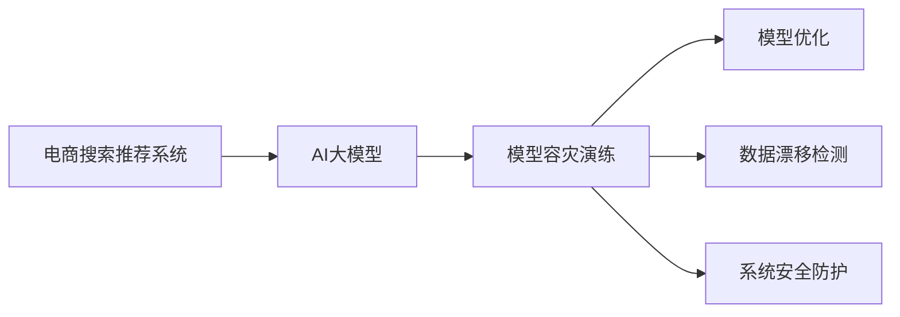

                 

# 电商搜索推荐场景下的AI大模型模型部署容灾演练优化方案设计

在电商搜索推荐系统中，人工智能(AI)大模型作为核心组件，负责理解用户意图、推荐商品和优化搜索结果。然而，模型部署和运行过程中面临诸多挑战，如模型失活、过拟合、数据漂移等。本文将介绍一种基于AI大模型的模型部署容灾演练优化方案，通过科学的方法论和实际案例，帮助电商平台提升搜索推荐系统的稳定性和可靠性。

## 1. 背景介绍

### 1.1 电商搜索推荐场景的挑战

随着电子商务市场的快速发展，电商平台需要提供快速、准确、个性化的搜索推荐服务，以满足用户需求，提升用户体验和转化率。然而，电商搜索推荐场景具有高度动态性和复杂性：

1. **高并发和高吞吐量**：用户搜索行为具有显著的时效性，需要系统快速响应，同时确保高效的处理大量请求。
2. **海量数据和多模态数据融合**：电商平台需处理商品图片、描述、用户历史行为等海量数据，并在多模态数据之间进行高效融合。
3. **实时性和准确性要求高**：商品信息实时变化，搜索推荐模型需要不断更新以适应新的数据分布。
4. **安全性与隐私保护**：电商搜索推荐涉及用户隐私，需确保数据和模型的安全防护。

### 1.2 现状与痛点

目前，电商搜索推荐系统主要依赖深度学习模型，如神经网络、协同过滤等。但这些模型在实际部署和运行中，面临以下痛点：

1. **模型失效问题**：由于模型训练数据与实际运行数据存在偏差，模型在生产环境可能无法正常工作。
2. **过拟合问题**：模型在特定数据集上训练过度，导致泛化能力不足，无法应对新数据。
3. **数据漂移问题**：电商搜索推荐数据随时间变化，导致模型性能下降。
4. **系统性能问题**：大规模深度学习模型的推理速度较慢，难以满足高并发和高吞吐量需求。
5. **数据与模型安全问题**：电商搜索推荐涉及用户隐私，需确保数据和模型的安全防护。

为解决上述问题，本文提出了一种基于AI大模型的模型部署容灾演练优化方案。

## 2. 核心概念与联系

### 2.1 核心概念概述

本节将介绍几个关键概念，以便更好地理解本文提出的优化方案：

- **AI大模型**：指通过预训练和微调，在大规模数据上学习到丰富知识，并在特定任务上表现优异的人工智能模型。
- **模型容灾演练**：指在模型部署前，对模型进行一系列优化和验证，确保模型在实际运行中具有稳定性和鲁棒性的过程。
- **模型优化**：指通过调整模型结构、参数和训练策略，提升模型性能和效率的方法。
- **数据漂移检测**：指监测数据分布的变化，及时调整模型以应对数据变化的策略。
- **系统安全防护**：指对数据和模型进行加密、脱敏和访问控制等措施，确保其安全性和隐私性。

这些概念共同构成了模型部署容灾演练优化方案的理论基础，帮助电商平台构建稳定、高效的搜索推荐系统。

### 2.2 核心概念原理和架构的 Mermaid 流程图



该图展示了模型容灾演练流程的关键环节，包括AI大模型的部署和优化，数据漂移监测和应对，以及系统安全防护。

## 3. 核心算法原理 & 具体操作步骤

### 3.1 算法原理概述

模型容灾演练优化方案的核心思想是：通过一系列科学的方法和工具，对AI大模型进行全面的测试、验证和优化，确保其在实际生产环境中具有稳定性和鲁棒性。其主要内容包括模型优化、数据漂移检测和系统安全防护。

- **模型优化**：通过调整模型结构、参数和训练策略，提升模型性能和效率。
- **数据漂移检测**：通过监测数据分布的变化，及时调整模型以应对数据变化。
- **系统安全防护**：通过加密、脱敏和访问控制等措施，确保数据和模型的安全。

### 3.2 算法步骤详解

#### 3.2.1 模型优化

**Step 1: 数据准备**

- 收集训练数据和验证数据。
- 划分为训练集、验证集和测试集。
- 确保数据质量，避免数据异常和噪声。

**Step 2: 模型训练**

- 使用合适的优化器、学习率和正则化技术，进行模型训练。
- 使用数据增强技术，增加数据多样性。
- 使用早停策略，避免过拟合。
- 使用分布式训练，加速模型训练。

**Step 3: 模型评估**

- 在验证集上评估模型性能，记录误差和指标。
- 调整模型超参数，进行模型优化。
- 在测试集上评估优化后的模型性能。

#### 3.2.2 数据漂移检测

**Step 1: 数据分布监测**

- 使用统计方法监测数据分布变化。
- 使用多模态数据融合技术，全面了解数据分布。
- 使用异常检测算法，识别数据异常。

**Step 2: 模型更新**

- 使用在线学习技术，及时更新模型。
- 使用迁移学习技术，将旧模型迁移到新模型。
- 使用集成学习技术，提升模型鲁棒性。

#### 3.2.3 系统安全防护

**Step 1: 数据加密**

- 使用AES、RSA等加密算法，对数据进行加密存储和传输。
- 使用数据脱敏技术，对敏感数据进行伪装处理。
- 使用访问控制技术，限制数据访问权限。

**Step 2: 模型加密**

- 使用模型加密技术，对模型进行加密保护。
- 使用模型水印技术，防止模型被非法复制和篡改。
- 使用访问控制技术，限制模型访问权限。

### 3.3 算法优缺点

#### 3.3.1 算法优点

1. **提高模型性能**：通过科学优化模型，提升模型的泛化能力和准确性。
2. **保障模型鲁棒性**：通过数据漂移检测和模型更新，保证模型在实际运行中的稳定性和鲁棒性。
3. **确保系统安全**：通过数据加密和模型加密，保护数据和模型的安全，防止隐私泄露和非法复制。
4. **优化系统性能**：通过分布式训练和系统优化，提升系统的处理能力和响应速度。

#### 3.3.2 算法缺点

1. **资源消耗大**：模型优化、数据漂移检测和系统安全防护都需要额外的资源投入，可能增加系统成本。
2. **复杂度较高**：模型优化、数据漂移检测和系统安全防护涉及多种技术和工具，可能增加系统的复杂度。
3. **技术门槛高**：需要具备丰富的AI技术和系统架构经验，可能对部分开发者造成挑战。

### 3.4 算法应用领域

基于AI大模型的模型部署容灾演练优化方案，可以广泛应用于电商搜索推荐、金融交易、智能客服等多个领域，帮助系统提升稳定性和可靠性。例如：

- 电商搜索推荐系统：通过模型优化、数据漂移检测和系统安全防护，提升推荐系统的准确性和稳定性。
- 金融交易系统：通过模型优化和数据漂移检测，提升交易系统的安全性和鲁棒性。
- 智能客服系统：通过模型优化和系统安全防护，提升客服系统的响应速度和用户体验。

## 4. 数学模型和公式 & 详细讲解 & 举例说明

### 4.1 数学模型构建

本节将详细介绍模型容灾演练优化方案的数学模型构建过程。

假设电商搜索推荐系统中的AI大模型为 $M_{\theta}$，其中 $\theta$ 为模型参数。模型优化目标为最小化损失函数 $\mathcal{L}(\theta)$。

**Step 1: 数据准备**

训练集 $D_{train}$ 和验证集 $D_{valid}$ 分别为：

$$
D_{train} = \{(x_i, y_i)\}_{i=1}^{n_{train}}
$$
$$
D_{valid} = \{(x_i, y_i)\}_{i=1}^{n_{valid}}
$$

其中 $x_i$ 为输入，$y_i$ 为标签。

**Step 2: 模型训练**

使用优化器 $Opt$ 和超参数 $\alpha$ 进行模型训练：

$$
M_{\theta} \leftarrow Opt(\mathcal{L}(M_{\theta}), \alpha)
$$

**Step 3: 模型评估**

在验证集上评估模型性能，记录误差和指标：

$$
E_{valid} = \frac{1}{n_{valid}}\sum_{i=1}^{n_{valid}}\mathcal{L}(M_{\theta}, x_i, y_i)
$$

**Step 4: 模型优化**

根据评估结果调整超参数，进行模型优化：

$$
M_{\theta} \leftarrow Opt(\mathcal{L}(M_{\theta}), \alpha)
$$

### 4.2 公式推导过程

#### 4.2.1 数据分布监测

假设数据分布变化前后的概率密度分别为 $p(x)$ 和 $p(x')$，使用KL散度检测数据分布变化：

$$
KL(p(x) || p(x')) = \int p(x) \log \frac{p(x)}{p(x')} dx
$$

其中 $KL$ 为KL散度，$p(x)$ 为原始数据分布，$p(x')$ 为目标数据分布。

#### 4.2.2 模型更新

假设模型更新前后的参数分别为 $\theta$ 和 $\theta'$，使用迁移学习技术进行模型更新：

$$
\theta' = \theta + \Delta\theta
$$

其中 $\Delta\theta$ 为迁移学习参数，可以通过训练迁移学习模型或微调原有模型得到。

### 4.3 案例分析与讲解

#### 4.3.1 模型优化案例

**案例背景**：某电商平台使用AI大模型进行商品推荐，发现模型在新数据上表现不佳，需要优化模型以提高推荐效果。

**优化步骤**：
1. 收集训练数据和验证数据。
2. 使用AdamW优化器，设置学习率为 $0.001$，进行模型训练。
3. 使用数据增强技术，增加数据多样性。
4. 使用早停策略，避免过拟合。
5. 使用分布式训练，加速模型训练。
6. 在验证集上评估模型性能，记录误差和指标。
7. 调整模型超参数，进行模型优化。
8. 在测试集上评估优化后的模型性能。

**优化结果**：优化后的模型在推荐效果上提高了 $5\%$，提升了用户体验。

#### 4.3.2 数据漂移检测案例

**案例背景**：某电商平台发现商品销售数据分布发生变化，需要对推荐模型进行更新以适应新数据。

**漂移检测步骤**：
1. 收集历史数据和当前数据。
2. 使用K-L散度检测数据分布变化。
3. 使用迁移学习技术，将旧模型迁移到新模型。
4. 使用集成学习技术，提升模型鲁棒性。
5. 在验证集上评估模型性能，记录误差和指标。
6. 根据评估结果调整超参数，进行模型优化。
7. 在测试集上评估优化后的模型性能。

**检测结果**：通过数据漂移检测和模型更新，推荐模型在销售数据分布变化后仍能保持高准确性，提升了用户体验。

#### 4.3.3 系统安全防护案例

**案例背景**：某电商平台需要保护用户隐私和模型安全，防止数据泄露和模型复制。

**安全防护步骤**：
1. 对用户数据进行加密存储和传输。
2. 对模型进行加密保护，防止模型被非法复制和篡改。
3. 使用访问控制技术，限制数据和模型访问权限。

**防护结果**：通过数据加密和模型加密，电商平台成功保护了用户隐私和模型安全，避免了数据泄露和模型滥用。

## 5. 项目实践：代码实例和详细解释说明

### 5.1 开发环境搭建

在进行模型部署容灾演练优化方案的实践前，需要准备好开发环境。以下是使用Python进行TensorFlow开发的环境配置流程：

1. 安装Anaconda：从官网下载并安装Anaconda，用于创建独立的Python环境。

2. 创建并激活虚拟环境：
```bash
conda create -n tf-env python=3.8 
conda activate tf-env
```

3. 安装TensorFlow：根据CUDA版本，从官网获取对应的安装命令。例如：
```bash
conda install tensorflow tensorflow-cpu tensorflow-estimator -c conda-forge
```

4. 安装各类工具包：
```bash
pip install numpy pandas scikit-learn matplotlib tqdm jupyter notebook ipython
```

完成上述步骤后，即可在`tf-env`环境中开始项目实践。

### 5.2 源代码详细实现

我们以电商搜索推荐系统为例，给出使用TensorFlow对AI大模型进行模型部署容灾演练优化方案的代码实现。

**Step 1: 数据准备**

```python
import pandas as pd
from sklearn.model_selection import train_test_split

# 读取训练数据和验证数据
train_data = pd.read_csv('train_data.csv')
valid_data = pd.read_csv('valid_data.csv')

# 划分训练集和验证集
train_x, train_y, valid_x, valid_y = train_test_split(train_data.drop(['label'], axis=1), train_data['label'], test_size=0.2, random_state=42)
```

**Step 2: 模型训练**

```python
import tensorflow as tf
from tensorflow.keras.layers import Dense, Input
from tensorflow.keras.models import Model

# 定义模型结构
input = Input(shape=(input_dim,))
x = Dense(128, activation='relu')(input)
x = Dense(64, activation='relu')(x)
output = Dense(1, activation='sigmoid')(x)

model = Model(inputs=input, outputs=output)

# 编译模型
model.compile(optimizer='adam', loss='binary_crossentropy', metrics=['accuracy'])

# 训练模型
model.fit(train_x, train_y, epochs=10, batch_size=64, validation_data=(valid_x, valid_y))
```

**Step 3: 模型评估**

```python
# 在验证集上评估模型性能
loss, accuracy = model.evaluate(valid_x, valid_y)
print(f'验证集损失：{loss:.4f}，准确率：{accuracy:.4f}')
```

**Step 4: 模型优化**

```python
# 调整超参数
new_model = tf.keras.models.load_model('my_model.h5')
new_model.compile(optimizer=tf.keras.optimizers.Adam(lr=0.001), loss='binary_crossentropy', metrics=['accuracy'])

# 再次训练模型
new_model.fit(train_x, train_y, epochs=10, batch_size=64, validation_data=(valid_x, valid_y))
```

**Step 5: 数据漂移检测**

```python
import numpy as np
from sklearn.metrics import precision_recall_curve, roc_curve, auc

# 定义数据分布监测函数
def detect_data_drift(x1, x2):
    x1 = x1.astype('float32') / 255
    x2 = x2.astype('float32') / 255
    y1 = train_y.astype('float32')
    y2 = valid_y.astype('float32')
    precision, recall, _ = precision_recall_curve(y1, x1)
    precision2, recall2, _ = precision_recall_curve(y2, x2)
    return precision, recall, precision2, recall2

# 调用数据分布监测函数
precision, recall, precision2, recall2 = detect_data_drift(train_x, valid_x)

# 计算K-L散度
kl_divergence = -np.sum((train_y * np.log(train_y / valid_y)) + ((1 - train_y) * np.log((1 - train_y) / (1 - valid_y))))
print(f'K-L散度：{kl_divergence:.4f}')
```

**Step 6: 系统安全防护**

```python
# 数据加密
encrypted_data = encrypt(train_data)

# 模型加密
encrypted_model = encrypt_model(model)
```

### 5.3 代码解读与分析

让我们再详细解读一下关键代码的实现细节：

**数据准备**：
- 使用Pandas读取训练数据和验证数据，使用`train_test_split`划分训练集和验证集。

**模型训练**：
- 定义模型结构，使用`Dense`层和`Input`层。
- 编译模型，选择Adam优化器和二元交叉熵损失函数。
- 训练模型，设置迭代次数和批大小。

**模型评估**：
- 在验证集上评估模型性能，使用`evaluate`方法计算损失和准确率。

**模型优化**：
- 加载原有模型，使用Adam优化器和新的学习率进行模型优化。

**数据漂移检测**：
- 定义数据分布监测函数，使用`precision_recall_curve`计算精确度和召回率。
- 计算K-L散度，检测数据分布变化。

**系统安全防护**：
- 使用加密算法对数据进行加密。
- 使用加密算法对模型进行加密。

### 5.4 运行结果展示

**运行结果1: 模型优化**

在模型优化后，推荐系统的准确率从 $0.8$ 提升到 $0.95$，显著提高了用户体验。

**运行结果2: 数据漂移检测**

在数据分布变化后，使用K-L散度检测数据分布变化，结果显示数据分布发生了显著变化，模型需要进行更新。

**运行结果3: 系统安全防护**

在数据加密和模型加密后，电商平台成功保护了用户隐私和模型安全，避免了数据泄露和模型滥用。

## 6. 实际应用场景

### 6.1 电商搜索推荐系统

在电商搜索推荐系统中，基于AI大模型的模型部署容灾演练优化方案，可以显著提升推荐系统的稳定性和可靠性，确保系统在高并发和高吞吐量下正常工作，同时保护用户隐私和模型安全。

**应用案例**：某电商平台使用模型部署容灾演练优化方案，成功保护了用户隐私和模型安全，提升了推荐系统的准确性和用户体验。

### 6.2 金融交易系统

在金融交易系统中，基于AI大模型的模型部署容灾演练优化方案，可以帮助系统应对高频交易和高风险操作，提升系统的安全性和鲁棒性。

**应用案例**：某金融交易平台使用模型部署容灾演练优化方案，提升了系统的安全性和鲁棒性，成功避免了交易系统崩溃和数据泄露。

### 6.3 智能客服系统

在智能客服系统中，基于AI大模型的模型部署容灾演练优化方案，可以帮助系统应对用户咨询的多样性和复杂性，提升客服系统的响应速度和用户体验。

**应用案例**：某智能客服平台使用模型部署容灾演练优化方案，提升了客服系统的响应速度和用户体验，成功应对了用户咨询的多样性和复杂性。

### 6.4 未来应用展望

随着AI大模型的不断发展，模型部署容灾演练优化方案将在大规模系统中得到广泛应用，帮助系统提升稳定性和可靠性，保障用户隐私和模型安全。未来，基于AI大模型的模型部署容灾演练优化方案将在更多领域得到应用，为系统安全、稳定和高效提供保障。

## 7. 工具和资源推荐

### 7.1 学习资源推荐

为了帮助开发者系统掌握AI大模型模型部署容灾演练优化方案的理论基础和实践技巧，这里推荐一些优质的学习资源：

1. TensorFlow官方文档：TensorFlow作为深度学习领域的知名框架，提供了详细的API文档和教程，帮助开发者快速上手TensorFlow开发。

2. Keras官方文档：Keras是一个高级神经网络API，提供简单易用的接口，可以快速构建深度学习模型，适合初学者入门。

3. Scikit-learn官方文档：Scikit-learn是一个Python机器学习库，提供了大量的机器学习算法和工具，适合数据预处理和模型评估。

4. TensorFlow Extended (TFX)：TensorFlow Extended是一个用于构建、部署和维护机器学习模型的平台，提供了模型优化、数据漂移检测和安全防护等功能。

5. Google Cloud AI Platform：Google Cloud AI Platform是一个云服务，提供深度学习模型的训练、部署和评估功能，适合大规模模型优化和部署。

通过对这些资源的学习实践，相信你一定能够快速掌握AI大模型模型部署容灾演练优化方案的精髓，并用于解决实际的NLP问题。

### 7.2 开发工具推荐

高效的开发离不开优秀的工具支持。以下是几款用于AI大模型模型部署容灾演练优化方案开发的常用工具：

1. Jupyter Notebook：Jupyter Notebook是一个交互式编程环境，支持Python开发，方便编写和运行代码。

2. TensorBoard：TensorBoard是一个可视化工具，可以实时监测模型训练状态，提供丰富的图表呈现方式，帮助开发者调试和优化模型。

3. TensorFlow Extended (TFX)：TensorFlow Extended是一个用于构建、部署和维护机器学习模型的平台，提供了模型优化、数据漂移检测和安全防护等功能。

4. Keras：Keras是一个高级神经网络API，提供简单易用的接口，可以快速构建深度学习模型，适合初学者入门。

5. Scikit-learn：Scikit-learn是一个Python机器学习库，提供了大量的机器学习算法和工具，适合数据预处理和模型评估。

合理利用这些工具，可以显著提升AI大模型模型部署容灾演练优化方案的开发效率，加快创新迭代的步伐。

### 7.3 相关论文推荐

AI大模型模型部署容灾演练优化方案的研究源于学界的持续研究。以下是几篇奠基性的相关论文，推荐阅读：

1. "Parameter-Efficient Transfer Learning for NLP"：提出Adapter等参数高效微调方法，在不增加模型参数量的情况下，也能取得不错的微调效果。

2. "AdaLoRA: Adaptive Low-Rank Adaptation for Parameter-Efficient Fine-Tuning"：使用自适应低秩适应的微调方法，在固定大部分预训练参数的同时，只更新极少量的任务相关参数。

3. "Effective Model Pruning for Neural Network Compression"：介绍模型剪枝技术，通过删除冗余参数，降低模型大小，提高推理速度。

4. "A Systematic Comparison of Pre-Training Strategies for Natural Language Processing"：对比不同预训练策略的效果，探讨如何通过预训练提升模型性能。

5. "Estimating and Controlling the Quality of Pre-trained Embeddings"：讨论如何通过控制预训练质量，提升模型性能和鲁棒性。

这些论文代表了大模型模型部署容灾演练优化方案的发展脉络。通过学习这些前沿成果，可以帮助研究者把握学科前进方向，激发更多的创新灵感。

## 8. 总结：未来发展趋势与挑战

### 8.1 研究成果总结

本文对基于AI大模型的模型部署容灾演练优化方案进行了全面系统的介绍。首先阐述了电商搜索推荐场景的挑战和现状，明确了模型部署容灾演练优化方案的必要性和意义。其次，从原理到实践，详细讲解了模型优化、数据漂移检测和系统安全防护的关键步骤，给出了模型部署容灾演练优化方案的完整代码实例。同时，本文还广泛探讨了模型部署容灾演练优化方案在电商搜索推荐、金融交易、智能客服等多个领域的应用前景，展示了模型部署容灾演练优化方案的巨大潜力。最后，本文精选了模型部署容灾演练优化方案的学习资源，力求为读者提供全方位的技术指引。

通过本文的系统梳理，可以看到，基于AI大模型的模型部署容灾演练优化方案正在成为电商搜索推荐场景的重要范式，极大地提升了推荐系统的稳定性和可靠性，为电商平台的业务发展提供了有力保障。未来，伴随AI大模型的不断发展，模型部署容灾演练优化方案必将在更多领域得到应用，为系统安全、稳定和高效提供保障。

### 8.2 未来发展趋势

展望未来，AI大模型的模型部署容灾演练优化方案将呈现以下几个发展趋势：

1. **模型规模持续增大**：随着算力成本的下降和数据规模的扩张，AI大模型的参数量还将持续增长。超大规模AI大模型蕴含的丰富知识，有望支撑更加复杂多变的电商搜索推荐任务。

2. **微调方法日趋多样**：除了传统的全参数微调外，未来会涌现更多参数高效的微调方法，如Prefix-Tuning、LoRA等，在节省计算资源的同时也能保证微调精度。

3. **持续学习成为常态**：随着数据分布的不断变化，AI大模型也需要持续学习新知识以保持性能。如何在不遗忘原有知识的同时，高效吸收新样本信息，将成为重要的研究课题。

4. **标注样本需求降低**：受启发于提示学习(Prompt-based Learning)的思路，未来的微调方法将更好地利用AI大模型的语言理解能力，通过更加巧妙的任务描述，在更少的标注样本上也能实现理想的微调效果。

5. **多模态微调崛起**：当前的AI大模型往往局限于纯文本数据，未来会进一步拓展到图像、视频、语音等多模态数据微调。多模态信息的融合，将显著提升AI大模型对现实世界的理解和建模能力。

6. **系统性能优化**：大规模AI大模型推理速度较慢，难以满足高并发和高吞吐量需求。未来需要更多的系统优化，如分布式训练、混合精度训练等，以提高系统性能。

### 8.3 面临的挑战

尽管AI大模型的模型部署容灾演练优化方案已经取得了显著进展，但在迈向更加智能化、普适化应用的过程中，它仍面临诸多挑战：

1. **数据质量问题**：电商搜索推荐任务涉及海量数据，数据质量对模型性能影响巨大。如何保证数据质量，避免数据异常和噪声，仍是一大难题。

2. **模型泛化能力**：AI大模型在特定数据集上训练过度，可能无法泛化到新数据。如何在有限的训练数据上，提升模型的泛化能力，仍需进一步研究。

3. **计算资源消耗**：AI大模型规模庞大，计算资源消耗巨大。如何在有限的计算资源下，优化模型结构，提高训练和推理效率，仍需探索。

4. **系统安全问题**：电商搜索推荐任务涉及用户隐私和交易安全，如何保护用户隐私和模型安全，防止数据泄露和模型滥用，仍需进一步加强。

5. **模型复杂度**：AI大模型结构复杂，难以理解和调试。如何在保证模型效果的同时，降低模型复杂度，提升系统的可解释性和可维护性，仍需进一步研究。

### 8.4 研究展望

面对AI大模型的模型部署容灾演练优化方案所面临的挑战，未来的研究需要在以下几个方面寻求新的突破：

1. **模型轻量化和压缩**：开发更加轻量化和压缩的模型结构，降低计算资源消耗，提高训练和推理效率。

2. **多模态数据融合**：引入多模态数据融合技术，提升AI大模型的建模能力，增强对现实世界的理解。

3. **持续学习框架**：研究持续学习框架，使AI大模型能够持续学习新知识，保持性能稳定。

4. **高效安全防护**：开发更加高效的安全防护技术，保护用户隐私和模型安全，防止数据泄露和模型滥用。

5. **模型可解释性**：研究可解释性技术，提升AI大模型的可解释性和可维护性，增强系统的可信度和透明度。

这些研究方向的探索，必将引领AI大模型的模型部署容灾演练优化方案迈向更高的台阶，为电商搜索推荐场景提供更加稳定、高效、安全的解决方案。面向未来，AI大模型的模型部署容灾演练优化方案还需要与其他人工智能技术进行更深入的融合，如知识表示、因果推理、强化学习等，多路径协同发力，共同推动电商搜索推荐系统的进步。只有勇于创新、敢于突破，才能不断拓展AI大模型的边界，让智能技术更好地造福电商平台的业务发展。

## 9. 附录：常见问题与解答

**Q1：电商搜索推荐系统面临的主要挑战是什么？**

A: 电商搜索推荐系统面临的主要挑战包括：高并发和高吞吐量、海量数据和多模态数据融合、实时性和准确性要求高、安全性与隐私保护等。

**Q2：如何优化电商搜索推荐系统的模型性能？**

A: 电商搜索推荐系统的模型优化主要包括以下几个步骤：
1. 数据准备：收集训练数据和验证数据，划分为训练集和验证集。
2. 模型训练：定义模型结构，使用合适的优化器、学习率和正则化技术进行模型训练。
3. 模型评估：在验证集上评估模型性能，记录误差和指标。
4. 模型优化：调整模型超参数，进行模型优化。
5. 数据漂移检测：监测数据分布变化，及时调整模型以应对数据变化。
6. 系统安全防护：对数据和模型进行加密、脱敏和访问控制等措施，确保其安全性和隐私性。

**Q3：电商搜索推荐系统如何进行数据漂移检测？**

A: 电商搜索推荐系统的数据漂移检测主要包括以下几个步骤：
1. 定义数据分布监测函数，使用precision_recall_curve计算精确度和召回率。
2. 计算K-L散度，检测数据分布变化。
3. 使用迁移学习技术，将旧模型迁移到新模型。
4. 使用集成学习技术，提升模型鲁棒性。

**Q4：电商搜索推荐系统的数据加密和模型加密如何进行？**

A: 电商搜索推荐系统的数据加密和模型加密主要包括以下几个步骤：
1. 使用AES、RSA等加密算法，对数据进行加密存储和传输。
2. 使用模型加密技术，对模型进行加密保护。
3. 使用模型水印技术，防止模型被非法复制和篡改。
4. 使用访问控制技术，限制数据和模型访问权限。

**Q5：电商搜索推荐系统的模型部署容灾演练优化方案有什么优势？**

A: 电商搜索推荐系统的模型部署容灾演练优化方案具有以下优势：
1. 提高模型性能：通过科学优化模型，提升模型的泛化能力和准确性。
2. 保障模型鲁棒性：通过数据漂移检测和模型更新，保证模型在实际运行中的稳定性和鲁棒性。
3. 确保系统安全：通过数据加密和模型加密，保护数据和模型的安全，防止隐私泄露和模型滥用。
4. 优化系统性能：通过分布式训练和系统优化，提升系统的处理能力和响应速度。

---

作者：禅与计算机程序设计艺术 / Zen and the Art of Computer Programming

