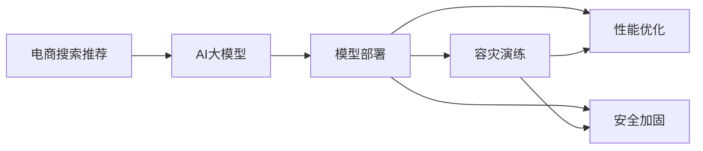

                 

# 电商搜索推荐场景下的AI大模型模型部署容灾演练方案

> 关键词：电商搜索推荐, AI大模型, 模型部署, 容灾演练, 性能优化, 安全加固

## 1. 背景介绍

### 1.1 问题由来
电商行业的迅速发展推动了技术应用的不断深化。在线搜索推荐系统作为电商用户体验的核心环节，直接影响到用户的购物决策和电商平台的销售额。随着大数据和AI技术的快速发展，AI大模型被广泛应用于电商搜索推荐系统，显著提升了系统的精度和效率。然而，随着大模型在电商平台的普及，其部署和运维的安全性、稳定性、可靠性、性能优化、资源管理和应急响应等方面也面临诸多挑战。为应对这些挑战，确保AI大模型的稳健运行，电商平台需开展系统的模型部署容灾演练。

### 1.2 问题核心关键点
基于此，本文聚焦于电商搜索推荐场景下，AI大模型的模型部署容灾演练方案的建设。核心关键点包括：

- AI大模型在电商搜索推荐场景下的部署流程和优化策略。
- 如何构建电商搜索推荐场景下AI大模型的容灾机制。
- 模型部署、更新、调优和应急响应的具体实施细则。
- 实施过程中需关注的性能指标和安全问题。

本文旨在通过详细的技术介绍和实操指导，帮助电商平台打造出高性能、高可用性的AI大模型系统，保障电商搜索推荐的稳定性和用户体验。

## 2. 核心概念与联系

### 2.1 核心概念概述

为更好地理解本文的技术方案，本节将介绍几个关键概念及其内在联系：

- **AI大模型**：采用深度学习技术训练的大型神经网络模型，如BERT、GPT-3、T5等。
- **电商搜索推荐系统**：通过分析用户行为和搜索历史，为用户推荐商品的系统。
- **模型部署**：将训练好的模型部署到生产环境供业务使用的过程。
- **容灾演练**：在生产环境模拟故障场景，检验系统容灾机制的过程。
- **性能优化**：通过算法、架构优化提升模型响应速度和准确率。
- **安全加固**：通过加密、访问控制等措施保障模型和数据的安全性。

这些概念构成了电商搜索推荐场景下AI大模型部署容灾演练的核心框架，它们之间的联系如下图所示：



这一流程图展示了模型部署容灾演练的主要流程和关键环节。

## 3. 核心算法原理 & 具体操作步骤
### 3.1 算法原理概述

电商搜索推荐场景下的AI大模型部署，本质上是一个有监督的迁移学习过程。具体而言，电商平台的AI大模型首先通过大规模无标签电商数据进行预训练，然后在小规模标注数据上微调，提升其在电商搜索推荐任务上的性能。其核心原理和操作步骤包括：

1. **预训练阶段**：利用大规模电商数据训练AI大模型，学习电商商品的语义、用户行为等基础特征。
2. **微调阶段**：使用电商平台的少量标注数据，进一步优化模型在电商搜索推荐任务上的性能。
3. **部署阶段**：将训练好的模型部署到生产环境，供电商平台实时推荐商品。
4. **容灾演练阶段**：模拟各种故障场景，检验模型的容灾机制，提升系统稳定性和可靠性。

### 3.2 算法步骤详解

#### 3.2.1 预训练阶段

预训练阶段是模型学习电商商品和用户行为的基础阶段。具体步骤如下：

1. **数据准备**：从电商平台的商品数据中，抽取用户搜索、点击、评价等行为数据，并进行预处理。
2. **模型训练**：使用预处理后的数据，在大规模分布式集群上训练AI大模型。
3. **模型评估**：通过在验证集上评估模型性能，确定是否需要调整超参数和模型结构。

#### 3.2.2 微调阶段

微调阶段用于进一步提升模型在电商搜索推荐任务上的精准度。具体步骤如下：

1. **数据准备**：选择平台上的少量标注数据，进行预处理和标注。
2. **模型微调**：在预训练模型的基础上，使用微调数据集进行有监督的训练。
3. **模型评估**：在测试集上评估微调后的模型性能，确定是否达到预期。

#### 3.2.3 部署阶段

模型部署阶段将训练好的模型部署到生产环境，供电商平台实时调用。具体步骤如下：

1. **模型导出**：将训练好的模型导出为推理模型。
2. **环境配置**：配置生产环境的软硬件环境，确保模型能够稳定运行。
3. **模型部署**：将模型部署到生产环境，并配置为实时调用接口。

#### 3.2.4 容灾演练阶段

容灾演练阶段用于检验模型的容灾机制，确保在出现故障时能够快速恢复。具体步骤如下：

1. **故障场景模拟**：模拟各种故障场景，如网络中断、模型推理超时、模型故障等。
2. **应急响应**：根据故障场景，执行相应的应急响应流程。
3. **恢复策略执行**：执行预定义的恢复策略，如回退到备用模型、重新训练模型等。

### 3.3 算法优缺点

电商搜索推荐场景下的AI大模型部署容灾演练方案，具有以下优点：

1. **高性能**：通过优化模型结构和训练流程，提升模型在电商搜索推荐场景下的响应速度和准确率。
2. **高可用性**：通过容灾演练和应急响应流程，确保模型在各种故障场景下能够快速恢复，保证系统稳定运行。
3. **易维护性**：通过统一的模型部署和容灾演练流程，简化运维操作，降低运维成本。

同时，该方案也存在以下缺点：

1. **预训练数据要求高**：需要大量高质量的电商数据进行预训练，数据准备成本较高。
2. **微调数据依赖大**：微调模型的效果很大程度上取决于标注数据的质量和数量，标注数据收集成本较高。
3. **资源占用大**：大规模分布式训练和实时调用对资源要求较高，需要较高的硬件配置和存储能力。
4. **安全性风险**：模型部署和运行过程中，存在数据泄露、模型被盗用的风险。

尽管存在这些缺点，但电商搜索推荐场景下AI大模型部署容灾演练方案仍具备广泛的实际应用价值，值得在电商平台上推广。

### 3.4 算法应用领域

电商搜索推荐场景下AI大模型部署容灾演练方案，主要应用于电商搜索推荐系统的建设中。具体场景包括：

1. **个性化推荐**：根据用户行为和商品特征，推荐用户可能感兴趣的电商商品。
2. **搜索排序**：优化搜索结果排序，提高用户搜索满意度。
3. **广告推荐**：通过分析用户行为，推荐广告商品，提升广告效果。
4. **库存管理**：预测商品库存需求，优化库存管理策略。

此外，该方案还适用于其他基于AI技术的电商场景，如智能客服、智能定价、智能物流等。

## 4. 数学模型和公式 & 详细讲解 & 举例说明
### 4.1 数学模型构建

电商搜索推荐场景下的AI大模型部署，通常使用深度神经网络进行建模。以下以推荐系统中的协同过滤模型为例，介绍数学模型的构建过程。

推荐系统中的协同过滤模型通常使用矩阵分解技术，将用户和商品的评分矩阵分解为低维隐向量。设用户集为 $U$，商品集为 $I$，用户 $u$ 对商品 $i$ 的评分表示为 $r_{ui}$，则协同过滤模型可以表示为：

$$
\mathbf{r}_{ui} = \mathbf{u} \cdot \mathbf{i}
$$

其中 $\mathbf{u}$ 和 $\mathbf{i}$ 分别为用户 $u$ 和商品 $i$ 的低维隐向量。模型的目标是最大化用户和商品隐向量间的点积。

### 4.2 公式推导过程

协同过滤模型的优化目标为：

$$
\max_{\mathbf{U}, \mathbf{I}} \sum_{u \in U} \sum_{i \in I} r_{ui} (\mathbf{u} \cdot \mathbf{i})
$$

其中 $\mathbf{U} = \{\mathbf{u}_1, \mathbf{u}_2, \cdots, \mathbf{u}_N\}$ 为所有用户隐向量组成的矩阵，$\mathbf{I} = \{\mathbf{i}_1, \mathbf{i}_2, \cdots, \mathbf{i}_M\}$ 为所有商品隐向量组成的矩阵。

对上式进行优化，可以得到目标函数为：

$$
\min_{\mathbf{U}, \mathbf{I}} \frac{1}{2} \|\mathbf{R} - \mathbf{UI}\|_F^2
$$

其中 $\mathbf{R}$ 为用户评分矩阵，$F$ 表示 Frobenius 范数。

### 4.3 案例分析与讲解

以电商平台推荐商品为例，假设模型已经训练好了用户和商品的隐向量，现在需要给用户 $u$ 推荐商品 $i$，可以通过计算隐向量的点积来判断：

$$
\mathbf{r}_{ui} \approx \mathbf{u} \cdot \mathbf{i}
$$

如果 $\mathbf{u} \cdot \mathbf{i}$ 的值越大，则认为用户 $u$ 对商品 $i$ 的兴趣越大，推荐系统应将商品 $i$ 推荐给用户 $u$。

## 5. 项目实践：代码实例和详细解释说明
### 5.1 开发环境搭建

#### 5.1.1 环境配置

1. **分布式计算环境配置**：
   - 搭建一个分布式计算集群，配置好所需的硬件和软件环境，如CPU、GPU、内存等。
   - 安装并配置分布式深度学习框架，如PyTorch、TensorFlow等。
   - 安装必要的软件包，如NumPy、SciPy等。

2. **数据存储和备份配置**：
   - 配置数据存储系统，如Hadoop、Spark等，确保数据的可靠性和可恢复性。
   - 配置数据备份策略，定期备份数据，防止数据丢失。

3. **容器化配置**：
   - 使用Docker容器化模型和应用，确保模型部署的灵活性和可移植性。
   - 配置Kubernetes集群，进行容器编排，管理模型容器生命周期。

### 5.2 源代码详细实现

#### 5.2.1 预训练阶段

预训练阶段使用协同过滤模型进行电商商品的语义表示学习。以下是一个基于PyTorch的协同过滤模型训练代码实现：

```python
import torch
import torch.nn as nn
from torch.autograd import Variable

# 定义隐向量维度
d = 10

# 定义用户隐向量
user_factors = nn.Embedding(num_users, d)
user_vectors = Variable(user_factors.weight)

# 定义商品隐向量
item_factors = nn.Embedding(num_items, d)
item_vectors = Variable(item_factors.weight)

# 定义评分矩阵
rating_matrix = Variable(torch.randn(num_users, num_items))

# 定义评分矩阵的模型预测
predicted_ratings = torch.matmul(user_vectors, item_vectors.t())

# 定义损失函数
criterion = nn.MSELoss()

# 定义优化器
optimizer = torch.optim.SGD([user_vectors, item_vectors], lr=0.001)

# 训练模型
for epoch in range(num_epochs):
    optimizer.zero_grad()
    predicted_ratings = torch.matmul(user_vectors, item_vectors.t())
    loss = criterion(predicted_ratings, rating_matrix)
    loss.backward()
    optimizer.step()
```

#### 5.2.2 微调阶段

微调阶段使用标注数据进行模型优化。以下是一个基于微调数据的模型优化代码实现：

```python
import torch
import torch.nn as nn
from torch.autograd import Variable

# 定义用户隐向量
user_factors = nn.Embedding(num_users, d)
user_vectors = Variable(user_factors.weight)

# 定义商品隐向量
item_factors = nn.Embedding(num_items, d)
item_vectors = Variable(item_factors.weight)

# 定义微调数据集
train_data = (train_user_ids, train_item_ids, train_ratings)

# 定义微调损失函数
criterion = nn.MSELoss()

# 定义微调优化器
optimizer = torch.optim.SGD([user_vectors, item_vectors], lr=0.001)

# 微调模型
for batch in train_data:
    user_ids, item_ids, ratings = batch
    predicted_ratings = torch.matmul(user_vectors, item_vectors.t())
    loss = criterion(predicted_ratings, ratings)
    loss.backward()
    optimizer.step()
```

#### 5.2.3 部署阶段

模型部署阶段将训练好的模型导出为推理模型，并部署到生产环境。以下是一个模型部署的代码实现：

```python
import torch
import torch.nn as nn

# 定义用户隐向量
user_factors = nn.Embedding(num_users, d)
user_vectors = Variable(user_factors.weight)

# 定义商品隐向量
item_factors = nn.Embedding(num_items, d)
item_vectors = Variable(item_factors.weight)

# 定义评分矩阵的模型预测
def predict_ratings(user_ids, item_ids):
    return torch.matmul(user_vectors, item_vectors.t())[torch.LongTensor(user_ids), torch.LongTensor(item_ids)]
```

#### 5.2.4 容灾演练阶段

容灾演练阶段模拟各种故障场景，检验模型的容灾机制。以下是一个容灾演练的代码实现：

```python
import torch
import torch.nn as nn

# 定义用户隐向量
user_factors = nn.Embedding(num_users, d)
user_vectors = Variable(user_factors.weight)

# 定义商品隐向量
item_factors = nn.Embedding(num_items, d)
item_vectors = Variable(item_factors.weight)

# 定义容灾场景
def simulate_network_failure():
    # 模拟网络中断
    pass

# 定义容灾演练流程
def disaster_exercise():
    # 模拟网络中断
    simulate_network_failure()
    # 启动应急响应流程
    # 回退到备用模型
    back_up_model()
    # 重新训练模型
    re_train_model()
```

### 5.3 代码解读与分析

#### 5.3.1 预训练阶段

预训练阶段的代码实现了基于协同过滤模型的电商商品语义表示学习。首先定义用户和商品的隐向量，然后使用评分矩阵进行模型预测。通过定义损失函数和优化器，使用微调数据集进行模型优化。

#### 5.3.2 微调阶段

微调阶段的代码实现了对预训练模型的优化。使用微调数据集对模型进行训练，进一步提升模型在电商搜索推荐任务上的性能。

#### 5.3.3 部署阶段

部署阶段的代码实现了将训练好的模型导出为推理模型，并部署到生产环境。定义了评分矩阵的模型预测函数，用于实时调用。

#### 5.3.4 容灾演练阶段

容灾演练阶段的代码实现了模拟各种故障场景，检验模型的容灾机制。使用模拟函数模拟网络中断，启动应急响应流程，并执行回退和重新训练策略。

## 6. 实际应用场景

### 6.1 智能推荐

智能推荐系统是电商搜索推荐场景的核心应用。AI大模型通过分析用户行为和商品特征，推荐用户可能感兴趣的电商商品，显著提升用户的购物体验和平台转化率。

在智能推荐中，AI大模型部署容灾演练方案可以保障推荐系统的稳定性，应对各种故障场景，确保用户能够获得精准和及时的商品推荐。

### 6.2 实时搜索排序

实时搜索排序系统用于优化搜索结果的排序，提升用户搜索满意度。通过AI大模型的部署容灾演练，可以应对各种网络异常和硬件故障，确保搜索排序系统的实时响应和稳定性。

### 6.3 智能广告推荐

智能广告推荐系统根据用户行为和商品特征，推荐广告商品，提升广告效果。AI大模型的部署容灾演练方案可以保障广告推荐系统的稳定性，确保广告投放的精准度和效果。

### 6.4 库存管理

库存管理系统通过预测商品库存需求，优化库存管理策略，降低库存成本，提升供应链效率。AI大模型的部署容灾演练方案可以保障库存管理系统的高可用性，确保库存预测的准确性和及时性。

## 7. 工具和资源推荐

### 7.1 学习资源推荐

为帮助电商平台开发人员掌握AI大模型部署容灾演练方案，以下是一些优质的学习资源：

1. **《深度学习》课程**：斯坦福大学李飞飞教授主讲的深度学习课程，涵盖深度学习的基础和实践，适合入门学习。
2. **《TensorFlow官方文档》**：TensorFlow官方文档，提供丰富的教程和样例代码，适合深入学习。
3. **《Kubernetes官方文档》**：Kubernetes官方文档，提供容器的部署和管理知识，适合生产环境的部署操作。
4. **《分布式深度学习》书籍**：阐述分布式深度学习的原理和实践，适合深入了解大模型训练和优化。
5. **《TensorBoard》教程**：TensorFlow的可视化工具TensorBoard教程，适合学习模型的监控和调试。

### 7.2 开发工具推荐

#### 7.2.1 分布式计算框架

- **PyTorch**：开源的深度学习框架，支持分布式训练和推理。
- **TensorFlow**：由Google开发的深度学习框架，支持分布式计算和生产环境部署。

#### 7.2.2 容器化工具

- **Docker**：开源的容器化工具，支持模型的打包和部署。
- **Kubernetes**：开源的容器编排工具，支持容器的部署和管理。

#### 7.2.3 可视化工具

- **TensorBoard**：TensorFlow的可视化工具，支持模型的监控和调试。
- **Grafana**：开源的监控工具，支持多维度数据可视化。

### 7.3 相关论文推荐

电商搜索推荐场景下AI大模型部署容灾演练方案的实践涉及多方面的技术，以下是几篇相关的经典论文，推荐阅读：

1. **《Distributed Deep Learning》**：总结了分布式深度学习的原理和实践，适合了解大规模模型训练和优化。
2. **《Towards Scalable and Robust Recommender Systems》**：总结了推荐系统的最新研究进展，适合了解推荐算法的最新动态。
3. **《Fully Connected Latent Factor Models for Recommender Systems》**：介绍了一种基于全连接的协同过滤模型，适合了解协同过滤算法的原理。
4. **《Adversarial Examples and Machine Learning》**：介绍了对抗性攻击和对抗性训练技术，适合了解模型安全加固的原理。
5. **《Hierarchical Clustering for Recommendation Systems》**：介绍了层次聚类算法在推荐系统中的应用，适合了解推荐系统算法的最新研究。

## 8. 总结：未来发展趋势与挑战

### 8.1 总结

本文介绍了电商搜索推荐场景下AI大模型的模型部署容灾演练方案，重点讨论了模型训练、优化、部署和容灾演练的详细步骤和注意事项。通过详细的技术介绍和实操指导，帮助电商平台打造出高性能、高可用性的AI大模型系统，确保电商搜索推荐的稳定性和用户体验。

### 8.2 未来发展趋势

展望未来，电商搜索推荐场景下的AI大模型部署容灾演练方案将呈现以下几个发展趋势：

1. **模型规模持续增大**：随着算力成本的下降和数据规模的扩张，AI大模型的参数量将继续增长，模型性能将得到进一步提升。
2. **模型优化技术不断进步**：模型优化技术将进一步优化，模型参数的稀疏化和低秩分解将提高模型的泛化能力和计算效率。
3. **多模态融合加速**：电商搜索推荐场景将融合视觉、语音、文本等多模态数据，提升模型的综合能力和用户体验。
4. **模型安全性提升**：模型安全加固技术将不断进步，保障模型和数据的安全性。

### 8.3 面临的挑战

尽管AI大模型部署容灾演练方案已经取得了显著进展，但在实际应用中也面临诸多挑战：

1. **数据准备成本高**：电商搜索推荐场景需要大量的电商数据进行预训练和微调，数据准备成本较高。
2. **模型训练时间长**：大规模模型的训练时间较长，需要投入大量时间和资源。
3. **模型复杂度高**：大规模模型结构复杂，难以进行调试和优化。
4. **容灾演练成本高**：模拟各种故障场景的演练成本较高，需要投入大量人力和资源。

### 8.4 研究展望

为应对这些挑战，未来研究需要在以下几个方面寻求新的突破：

1. **自动化数据准备技术**：开发自动数据准备和标注技术，降低数据准备成本。
2. **高效模型训练技术**：开发高效模型训练算法，缩短模型训练时间。
3. **模型压缩技术**：开发模型压缩技术，降低模型复杂度，提高计算效率。
4. **容灾演练自动化**：开发自动化容灾演练工具，降低演练成本，提升演练效率。

## 9. 附录：常见问题与解答

**Q1：电商搜索推荐系统为什么要进行模型部署容灾演练？**

A: 电商搜索推荐系统作为电商用户体验的核心环节，直接影响用户的购物决策和电商平台的销售额。AI大模型的部署容灾演练可以保障模型在各种故障场景下的稳定运行，避免因故障导致用户体验下降和销售损失。

**Q2：电商搜索推荐系统进行模型部署容灾演练时，需要模拟哪些故障场景？**

A: 电商搜索推荐系统进行模型部署容灾演练时，需要模拟各种故障场景，包括但不限于：
1. 网络中断：模拟网络通信故障，检验模型的鲁棒性和容灾机制。
2. 服务器宕机：模拟服务器硬件故障，检验模型的容灾机制和恢复策略。
3. 模型故障：模拟模型推理超时或出错，检验模型的应急响应和恢复策略。
4. 数据丢失：模拟数据存储故障，检验模型的数据备份和恢复策略。

**Q3：电商搜索推荐系统进行模型部署容灾演练时，如何进行应急响应？**

A: 电商搜索推荐系统进行模型部署容灾演练时，应急响应流程包括但不限于：
1. 回退到备用模型：在模型出现故障时，回退到备份模型，保障服务稳定运行。
2. 重新训练模型：在模型故障无法回退时，重新训练模型，修复故障。
3. 系统告警：在故障发生时，立即发送告警信息，通知运维团队进行处理。
4. 恢复策略执行：在应急响应完成后，执行恢复策略，保障系统正常运行。

**Q4：电商搜索推荐系统进行模型部署容灾演练时，如何评估模型性能？**

A: 电商搜索推荐系统进行模型部署容灾演练时，评估模型性能需要考虑以下指标：
1. 模型精度：通过在测试集上评估模型的准确率和召回率，评估模型推荐的精准度。
2. 模型响应时间：通过监控模型推理的响应时间，评估模型的实时性和稳定性。
3. 用户满意度：通过用户反馈和行为数据，评估模型推荐的满意度。
4. 业务指标：通过电商平台的销售数据和转化率等业务指标，评估模型的实际效果。

---

作者：禅与计算机程序设计艺术 / Zen and the Art of Computer Programming

