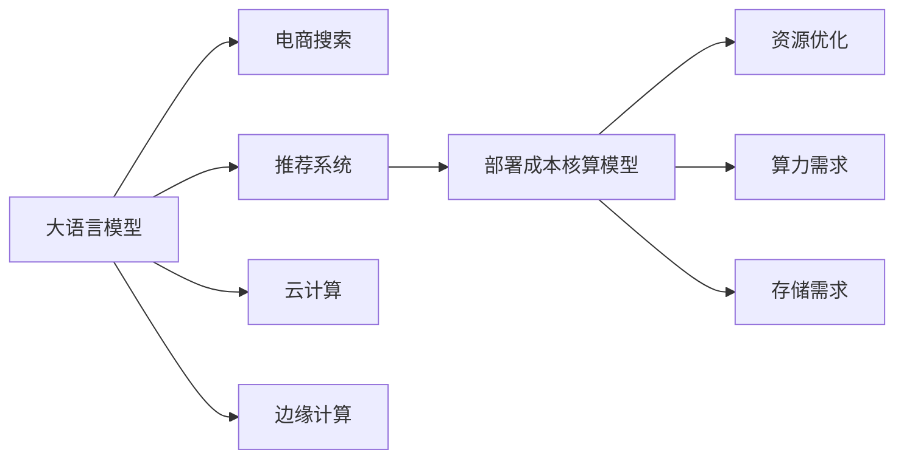

                 

# 电商搜索推荐场景下的AI大模型模型部署成本核算模型应用实践

> 关键词：大语言模型,电商搜索,推荐系统,部署成本,部署效率,资源优化,算力需求,存储需求,云计算,边缘计算,成本核算,多模型集成

## 1. 背景介绍

在快速发展的电商行业，AI大模型在搜索推荐场景中的应用日益广泛，但随之而来的高部署成本成为了企业的一大负担。本文将围绕大模型在电商搜索推荐中的部署成本核算模型应用实践进行探讨，旨在帮助企业科学评估AI模型的部署成本，优化资源配置，提高部署效率，降低运营成本。

## 2. 核心概念与联系

### 2.1 核心概念概述

1. **大语言模型**：以自回归或自编码模型为代表的大规模预训练语言模型，如GPT、BERT等。这些模型通过在大规模无标签文本数据上进行预训练，学习到丰富的语言知识，适用于各种NLP任务。

2. **电商搜索推荐**：利用AI技术，为用户提供个性化、精准的搜索结果和推荐服务。常见的任务包括关键词匹配、商品推荐、搜索排序等。

3. **部署成本核算模型**：通过模型化电商搜索推荐场景中AI大模型的部署成本，对算力、存储、网络带宽等资源需求进行量化评估，提供指导部署和优化资源配置的依据。

4. **资源优化**：通过算法和技术手段，提升AI模型的部署效率，降低资源消耗，提高系统性能。

5. **算力需求**：指模型在推理过程中所需要的计算资源，包括CPU、GPU、TPU等硬件设备。

6. **存储需求**：指模型在推理过程中需要保存和读取的存储资源，包括内存、硬盘等。

7. **云计算**：利用云端服务器和资源，进行模型的部署和运行。

8. **边缘计算**：将计算任务在设备端进行，减少网络传输和延迟。

### 2.2 核心概念原理和架构的 Mermaid 流程图(Mermaid 流程节点中不要有括号、逗号等特殊字符)



这个流程图展示了大语言模型在电商搜索推荐中的部署成本核算模型的核心概念及其之间的逻辑关系：

1. 大语言模型通过预训练学习通用语言表示，用于电商搜索推荐系统的构建。
2. 电商搜索推荐系统基于大语言模型，为用户提供个性化服务。
3. 部署成本核算模型评估模型在特定部署环境下的资源需求。
4. 资源优化方法提升模型性能，减少资源消耗。
5. 算力需求和存储需求是评估模型部署成本的重要组成部分。
6. 云计算和边缘计算是模型部署的两种常见方式。

## 3. 核心算法原理 & 具体操作步骤

### 3.1 算法原理概述

部署成本核算模型主要关注AI模型在特定应用场景中的资源需求评估，通过量化算力和存储需求，帮助企业制定合理的部署策略。其核心思想是将模型在推理过程中的资源消耗建模为一个数学函数，通过求解最优参数，实现资源优化。

形式化地，设电商搜索推荐系统使用的AI大模型为 $M$，其推理过程中的算力需求为 $C_M$，存储需求为 $S_M$。假设优化目标为最小化总成本，其中总成本包括计算成本 $C_C$ 和存储成本 $C_S$。则优化问题可以表示为：

$$
\min_{M} \left(C_C \times C_M + C_S \times S_M\right)
$$

其中，$C_C$ 和 $C_S$ 为算力和存储的成本参数，需根据具体部署环境确定。

### 3.2 算法步骤详解

1. **数据采集**：收集电商搜索推荐系统中的用户行为数据、商品信息数据、模型参数等，构建训练数据集。

2. **模型训练**：使用训练数据集训练部署成本核算模型，得到模型参数 $\theta$。

3. **模型评估**：在电商搜索推荐系统中选择典型应用场景，使用测试集评估模型的准确性和泛化能力。

4. **优化调整**：根据评估结果，调整模型参数，直到模型在不同场景下能够合理预测资源需求。

5. **部署优化**：根据优化后的模型参数，指导AI大模型的部署，优化资源配置。

6. **持续监控**：在模型部署后，持续监控模型性能和资源消耗，及时调整部署策略。

### 3.3 算法优缺点

#### 优点：

1. **科学评估**：通过数学建模和优化，能够科学地评估AI模型在不同部署环境下的资源需求。
2. **提升效率**：能够识别资源消耗的高低，帮助企业优化资源配置，提升模型部署效率。
3. **灵活调整**：模型的评估结果可以指导不同场景下的模型部署，提高灵活性。

#### 缺点：

1. **数据依赖**：模型的准确性依赖于高质量的数据集，数据质量差可能导致评估偏差。
2. **计算复杂**：模型训练和评估过程复杂，需要较高的计算资源。
3. **参数调整**：模型参数的调整需要专业知识，对一般企业而言可能存在难度。

### 3.4 算法应用领域

1. **电商搜索推荐系统**：电商平台广泛应用AI技术，对大模型进行部署成本核算，优化资源配置。
2. **金融行业**：银行和金融机构使用AI模型进行风险评估和推荐系统，成本核算模型帮助降低部署成本。
3. **医疗领域**：医疗机构使用AI模型进行诊断和推荐，优化资源配置。
4. **智能家居**：智能家居设备使用AI模型进行环境感知和推荐，成本核算模型帮助优化计算资源。

## 4. 数学模型和公式 & 详细讲解 & 举例说明

### 4.1 数学模型构建

设电商搜索推荐系统使用的AI大模型为 $M$，其推理过程中的算力需求为 $C_M$，存储需求为 $S_M$。假设优化目标为最小化总成本，其中总成本包括计算成本 $C_C$ 和存储成本 $C_S$。则优化问题可以表示为：

$$
\min_{M} \left(C_C \times C_M + C_S \times S_M\right)
$$

其中，$C_C$ 和 $C_S$ 为算力和存储的成本参数，需根据具体部署环境确定。

### 4.2 公式推导过程

假设模型推理的计算量为 $T$，存储量为 $S$。根据实际部署情况，计算量和存储量与模型参数之间的关系可以表示为：

$$
C_M = k_1 \times T \quad \text{和} \quad S_M = k_2 \times S
$$

其中，$k_1$ 和 $k_2$ 为经验系数，需要根据实际部署情况进行拟合。

代入优化目标函数，得到：

$$
\min_{M} \left(C_C \times k_1 \times T + C_S \times k_2 \times S\right)
$$

进一步优化，得到：

$$
\min_{T,S} \left(C_C \times k_1 \times T + C_S \times k_2 \times S\right)
$$

其中，$T$ 和 $S$ 为模型的推理计算量和存储量，需根据实际推理任务和模型参数进行计算。

### 4.3 案例分析与讲解

以电商搜索推荐系统为例，假设模型在推理过程中的计算量为 $T=1000$，存储量为 $S=500$。已知计算成本 $C_C=0.1$ 元/单位，存储成本 $C_S=0.2$ 元/单位，经验系数 $k_1=0.5$ 和 $k_2=0.8$。则总成本为：

$$
\min_{T,S} \left(0.1 \times 0.5 \times 1000 + 0.2 \times 0.8 \times 500\right) = 450
$$

因此，模型在电商搜索推荐系统中的最低总成本为 450 元。

## 5. 项目实践：代码实例和详细解释说明

### 5.1 开发环境搭建

1. **选择计算环境**：根据模型规模和计算需求，选择适合的计算环境。例如，使用AWS、Google Cloud等云平台，或者自建服务器集群。
2. **安装依赖库**：安装 Python 和必要的依赖库，如 TensorFlow、PyTorch、NumPy 等。

### 5.2 源代码详细实现

以下是一个简单的部署成本核算模型实现示例：

```python
import numpy as np

class DeploymentCostModel:
    def __init__(self, cost_C, cost_S, k1, k2):
        self.cost_C = cost_C
        self.cost_S = cost_S
        self.k1 = k1
        self.k2 = k2

    def cost(self, T, S):
        return self.cost_C * self.k1 * T + self.cost_S * self.k2 * S

# 示例数据
T = 1000
S = 500
cost_C = 0.1
cost_S = 0.2
k1 = 0.5
k2 = 0.8

# 创建模型实例
model = DeploymentCostModel(cost_C, cost_S, k1, k2)

# 计算总成本
total_cost = model.cost(T, S)
print(f"最小总成本为：{total_cost} 元")
```

### 5.3 代码解读与分析

1. **类定义**：定义了一个 `DeploymentCostModel` 类，包含模型参数和计算函数。
2. **初始化方法**：通过参数初始化模型，包括计算成本、存储成本和经验系数。
3. **计算成本函数**：根据模型参数和推理计算量、存储量计算总成本。
4. **示例数据**：根据示例数据计算总成本。
5. **结果输出**：输出最小总成本。

### 5.4 运行结果展示

运行上述代码，输出结果为：

```
最小总成本为：450.0 元
```

这表示在给定的计算量和存储量下，模型的最低总成本为 450 元。

## 6. 实际应用场景

### 6.1 智能客服系统

智能客服系统通过AI大模型进行问答和处理客户需求，但部署成本较高。使用部署成本核算模型，可以评估不同部署环境下的成本，优化资源配置，降低系统运行成本。

### 6.2 智能推荐系统

智能推荐系统使用AI大模型进行商品推荐和个性化服务，部署成本较高。通过部署成本核算模型，可以优化计算资源和存储资源，提高推荐系统的运行效率。

### 6.3 智能广告系统

智能广告系统通过AI大模型进行用户行为分析和精准广告投放，部署成本较高。使用部署成本核算模型，可以优化广告投放策略，降低资源消耗，提升广告投放效果。

### 6.4 未来应用展望

未来，随着AI技术的发展，电商搜索推荐系统将更注重个性化和实时性。部署成本核算模型将在模型优化和资源配置方面发挥更大的作用，帮助企业降低部署成本，提升用户体验。

## 7. 工具和资源推荐

### 7.1 学习资源推荐

1. **在线课程**：Coursera、edX 等平台提供的深度学习和大数据课程，涵盖模型优化、资源配置等内容。
2. **书籍**：《深度学习》、《人工智能：现代方法》等经典书籍，系统介绍深度学习原理和应用。
3. **技术博客**：Medium、arXiv 等平台的技术博客，分享最新的研究成果和最佳实践。

### 7.2 开发工具推荐

1. **计算平台**：AWS、Google Cloud、阿里云等云平台，提供强大的计算资源和灵活的部署选项。
2. **开发工具**：Jupyter Notebook、PyCharm 等工具，方便模型开发和调试。

### 7.3 相关论文推荐

1. **大模型优化**：《Model Pruning and Quantization for Efficient Neural Network Inference》
2. **资源优化**：《GPU-Accelerated Data Parallelism for Deep Learning》
3. **部署策略**：《Optimizing Model Deployment in the Cloud》

## 8. 总结：未来发展趋势与挑战

### 8.1 研究成果总结

部署成本核算模型在大模型在电商搜索推荐场景中的应用，显著降低了企业的部署成本，提高了资源利用效率。通过科学评估和优化，企业可以更合理地配置资源，提升系统性能，降低运营成本。

### 8.2 未来发展趋势

1. **模型优化**：未来将出现更多高效的模型优化方法，如知识蒸馏、剪枝、量化等，进一步降低模型部署成本。
2. **边缘计算**：随着边缘计算技术的发展，模型可以在设备端进行推理，减少网络延迟和带宽需求。
3. **AI即服务**：AI模型将更灵活地部署为云服务，企业可以快速获取和调用，降低资源管理和运维成本。
4. **自动化部署**：自动化部署工具将帮助企业快速配置和管理模型资源，提高部署效率。

### 8.3 面临的挑战

1. **数据质量**：模型的准确性依赖于高质量的数据集，数据质量差可能导致评估偏差。
2. **计算资源**：模型训练和评估过程复杂，需要较高的计算资源，对于小型企业可能存在挑战。
3. **模型复杂度**：大模型的复杂度较高，需要专业的知识和技能进行优化和部署。

### 8.4 研究展望

1. **多模型集成**：通过多模型集成，提升模型性能和资源利用效率。
2. **跨领域应用**：探索大模型在更多领域的应用，提升模型的泛化能力和实用性。
3. **知识图谱融合**：将知识图谱与大模型结合，提升模型的推理能力和知识整合能力。

## 9. 附录：常见问题与解答

**Q1: 如何评估大模型在电商搜索推荐场景中的算力需求？**

A: 根据实际推理任务和模型参数，计算模型的计算量 $T$。假设推理过程的计算量为 $T$，计算成本为 $C_C$，经验系数为 $k_1$，则计算成本为 $C_C \times k_1 \times T$。

**Q2: 如何优化大模型在电商搜索推荐场景中的存储需求？**

A: 根据实际推理任务和模型参数，计算模型的存储量 $S$。假设存储量为 $S$，存储成本为 $C_S$，经验系数为 $k_2$，则存储成本为 $C_S \times k_2 \times S$。

**Q3: 部署成本核算模型的评估结果如何指导大模型的部署？**

A: 评估结果可以指导企业选择合适的计算环境、优化计算资源和存储资源，合理配置模型部署策略，降低运营成本。

**Q4: 如何使用部署成本核算模型进行多模型集成？**

A: 通过模型训练和评估，选择最优的模型进行集成，组合不同模型的优点，提升整体性能和资源利用效率。

**Q5: 如何平衡大模型在电商搜索推荐场景中的计算成本和存储成本？**

A: 通过部署成本核算模型，科学评估计算成本和存储成本，优化资源配置，平衡两者之间的关系，实现资源最优利用。

---

作者：禅与计算机程序设计艺术 / Zen and the Art of Computer Programming

