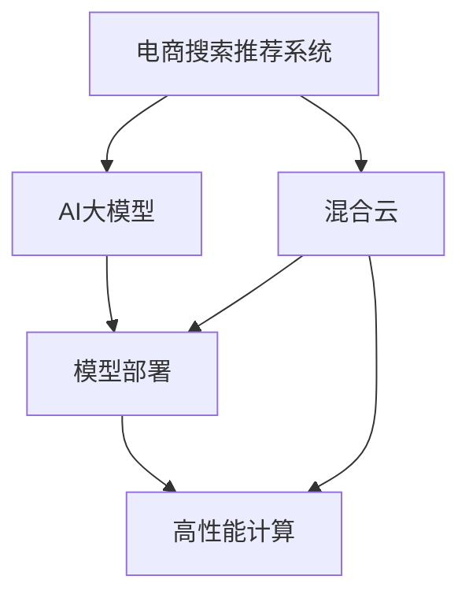

                 

# 电商搜索推荐场景下的AI大模型模型部署混合云方案设计

> 关键词：电商搜索,推荐系统,混合云,AI大模型,模型部署,高性能计算,弹性伸缩

## 1. 背景介绍

### 1.1 问题由来
在电商搜索推荐场景中，如何通过高效、准确的AI算法，实现个性化推荐、搜索结果排序，提升用户体验和运营效率，是当下电商企业的核心痛点。传统的方法如协同过滤、词袋模型、基于规则的推荐等，虽然能够提供基本的推荐服务，但缺乏深度学习和语义理解能力，难以满足用户日益增长的个性化需求。

近年来，深度学习技术在电商搜索推荐领域的应用取得了显著突破，尤其是利用预训练语言模型（如BERT、GPT等）进行推荐建模，使得推荐系统具备了强大的语义理解和上下文关联能力，提升了推荐精度和覆盖度。然而，预训练语言模型的部署与运行也面临诸多挑战，尤其是在大规模生产环境中，如何高效、安全地部署这些大模型，是亟待解决的问题。

本文将从混合云架构的角度出发，提出一套基于AI大模型的电商搜索推荐系统部署方案，通过云平台的高效资源管理和弹性伸缩特性，实现大模型的低成本、高效运行，满足电商企业的高并发、低延迟需求。

## 2. 核心概念与联系

### 2.1 核心概念概述

为更好地理解本文所述的混合云方案，本节将介绍几个关键概念：

- **电商搜索推荐系统**：指电商平台通过深度学习等先进技术，为用户提供个性化商品推荐、搜索结果排序的服务系统。电商搜索推荐系统通过分析用户行为数据，生成个性化推荐，提升用户体验和运营效率。

- **AI大模型**：指利用深度学习技术，在大规模数据集上进行预训练得到的模型，如BERT、GPT等。这些大模型能够提取语义丰富的特征，提升推荐精度和泛化能力。

- **混合云**：指将公有云、私有云和边缘计算等不同计算资源整合起来，形成一个统一、灵活的计算平台。混合云能够提供高可用性、高性能、低成本的计算资源，满足不同场景下的计算需求。

- **模型部署**：指将训练好的AI大模型部署到生产环境中，供实际应用调用。模型部署需要考虑模型的保存格式、模型版本管理、服务化封装等问题。

- **高性能计算(HPC)**：指利用高性能计算机，通过分布式计算、优化算法等技术手段，提升计算效率和数据处理能力。HPC广泛应用于科学计算、大数据处理等领域。

- **弹性伸缩**：指在混合云平台中，根据实际负载动态调整计算资源，自动扩缩容，实现按需计算。弹性伸缩有助于应对电商平台的流量高峰，提升服务稳定性。

这些核心概念之间的逻辑关系可以通过以下Mermaid流程图来展示：



这个流程图展示了电商搜索推荐系统的核心概念及其之间的关系：

1. 电商搜索推荐系统需要借助AI大模型进行推荐建模。
2. 模型部署是将预训练大模型部署到生产环境中，供实际应用调用。
3. 高性能计算是保证模型高效运行的技术手段。
4. 混合云提供了高可用性、高性能、低成本的计算资源。
5. 弹性伸缩保证了平台的按需计算和负载平衡。

这些概念共同构成了电商搜索推荐系统的计算架构，通过合理的资源整合和调度，可以大幅提升系统性能，满足电商平台的实际需求。

## 3. 核心算法原理 & 具体操作步骤

### 3.1 算法原理概述

电商搜索推荐系统基于深度学习和AI大模型，通过分析用户行为数据，生成个性化推荐和搜索结果排序。具体来说，系统将用户点击、浏览、购买等行为数据，输入到预训练语言模型中，提取语义特征，进行相似度计算和推荐排序，最终输出推荐结果。

### 3.2 算法步骤详解

#### 3.2.1 数据预处理
电商搜索推荐系统的核心在于对用户行为数据的分析。在推荐建模前，需要对原始数据进行预处理，包括：

1. **数据清洗**：去除噪声、异常值，确保数据的准确性和完整性。
2. **特征提取**：将用户行为数据转换为模型可用的特征向量。
3. **数据划分**：将数据集划分为训练集、验证集和测试集，用于模型训练、调优和测试。

#### 3.2.2 模型训练
电商搜索推荐系统通常使用深度学习模型进行推荐建模。以下是推荐模型的训练步骤：

1. **选择模型**：选择合适的深度学习模型，如CNN、RNN、GRU等。
2. **准备数据**：将预处理后的数据集输入模型，进行前向传播和损失计算。
3. **优化算法**：使用SGD、Adam等优化算法，最小化损失函数，更新模型参数。
4. **模型评估**：在验证集上评估模型性能，防止过拟合。

#### 3.2.3 模型部署
模型训练完成后，需要进行模型部署，供实际应用调用。以下是模型部署的具体步骤：

1. **模型保存**：将训练好的模型保存为模型文件。
2. **服务化封装**：将模型封装为标准API接口，便于应用系统调用。
3. **环境搭建**：在混合云平台搭建模型运行环境，配置必要的计算资源和网络参数。
4. **服务启动**：启动模型服务，开始接收调用请求。

#### 3.2.4 系统优化
电商搜索推荐系统在实际运行中，还需要进行系统优化，以提升性能和稳定性。以下是优化策略：

1. **负载均衡**：使用负载均衡器，分配计算任务到不同的计算节点，避免单点故障。
2. **缓存策略**：使用缓存技术，加速模型响应时间，减少计算压力。
3. **数据压缩**：对数据进行压缩存储，减少存储成本和读取延迟。
4. **异常检测**：实时监控系统指标，设置异常告警阈值，及时发现和解决问题。

### 3.3 算法优缺点

电商搜索推荐系统基于AI大模型的推荐建模，具有以下优点：

1. **个性化推荐**：利用预训练语言模型，能够更好地理解用户语义，提供个性化推荐。
2. **语义理解**：大模型具备强大的语义理解能力，能够处理复杂的自然语言输入。
3. **泛化能力**：大模型能够从大规模数据集中学习到更全面的知识，提升推荐精度和泛化能力。
4. **模型更新**：模型可以根据新数据进行持续更新，提升推荐效果。

同时，该方法也存在一些局限性：

1. **资源消耗**：大模型参数量较大，对计算资源有较高要求。
2. **延迟较高**：模型推理速度较慢，可能影响用户体验。
3. **模型复杂性**：模型结构复杂，调优难度较大。
4. **数据隐私**：用户行为数据涉及隐私，需要严格的数据保护措施。

尽管存在这些局限性，但就目前而言，基于AI大模型的电商搜索推荐系统是推荐领域的主流范式。未来相关研究的重点在于如何进一步降低模型资源消耗，提高推荐速度，保护用户隐私，同时兼顾模型的可解释性和易用性。

### 3.4 算法应用领域

基于AI大模型的电商搜索推荐系统，在电商领域已经得到了广泛的应用，具体包括以下几个方面：

1. **商品推荐**：根据用户浏览、点击、购买等行为，推荐相关商品。
2. **搜索结果排序**：对搜索结果进行排序，提升用户浏览体验。
3. **个性化广告**：根据用户兴趣，展示个性化广告，提升广告效果。
4. **商品画像**：生成商品详细描述，帮助用户更好地理解商品信息。
5. **用户画像**：构建用户画像，提升用户体验和运营效率。

除了上述这些核心功能外，大模型技术还拓展了电商搜索推荐系统的应用场景，如客服智能问答、用户情感分析、营销数据分析等，为电商平台带来了全新的业务价值。

## 4. 数学模型和公式 & 详细讲解

### 4.1 数学模型构建

电商搜索推荐系统通常使用深度学习模型进行推荐建模。以下是一个基于注意力机制的推荐模型的数学模型构建过程：

设用户行为数据为 $x \in \mathbb{R}^{n}$，模型输出为 $y \in \mathbb{R}^{m}$，其中 $n$ 为输入特征维度，$m$ 为输出特征维度。模型的输入为 $x$，输出为 $y$。模型的核心是一个多层的注意力网络，其数学表达式如下：

$$
y = f(W_{out}(x) + \sum_{k=1}^{K}a_k \cdot W_k(x))
$$

其中 $W_{out}$ 为输出层权重矩阵，$a_k$ 为注意力权重向量，$W_k$ 为注意力网络中的多个子网络权重矩阵。

### 4.2 公式推导过程

#### 4.2.1 注意力机制
注意力机制是推荐模型中常用的技术，用于提升模型的表达能力和推荐精度。以下是注意力机制的推导过程：

设用户行为数据为 $x \in \mathbb{R}^{n}$，注意力权重向量为 $a \in \mathbb{R}^{K}$，注意力网络输出为 $y \in \mathbb{R}^{m}$。注意力机制的数学表达式如下：

$$
y = f(\sum_{k=1}^{K}a_k \cdot W_k(x))
$$

其中 $W_k$ 为注意力网络中的第 $k$ 个子网络权重矩阵。

注意力权重向量 $a$ 的计算公式如下：

$$
a = softmax(W_{att}x + b_{att})
$$

其中 $W_{att}$ 为注意力权重矩阵，$b_{att}$ 为注意力权重偏置向量。$softmax$ 函数将向量转换为概率分布，保证各子网络的权重之和为1。

#### 4.2.2 模型训练
推荐模型的训练过程通常采用梯度下降算法，最小化损失函数。假设模型的损失函数为 $L$，则模型参数的更新公式如下：

$$
\theta \leftarrow \theta - \eta \nabla_{\theta}L
$$

其中 $\theta$ 为模型参数，$\eta$ 为学习率，$\nabla_{\theta}L$ 为损失函数对模型参数的梯度。

### 4.3 案例分析与讲解

#### 4.3.1 推荐模型训练
电商搜索推荐系统的推荐模型通常使用深度学习模型，如BERT、GPT等。以下是BERT模型的训练过程：

1. **数据预处理**：将用户行为数据进行分词、编码等预处理，得到词向量表示。
2. **模型输入**：将预处理后的词向量输入BERT模型，计算上下文表示。
3. **模型输出**：将上下文表示输入到全连接层，计算推荐结果。

#### 4.3.2 模型优化
电商搜索推荐系统的优化过程通常采用梯度下降算法，结合正则化技术，防止过拟合。以下是模型优化的具体步骤：

1. **损失函数**：选择适当的损失函数，如交叉熵损失、均方误差损失等。
2. **学习率**：设置合适的学习率，如SGD、Adam等。
3. **正则化**：使用L2正则、Dropout等正则化技术，防止过拟合。
4. **超参数调优**：根据模型性能调整超参数，如网络层数、隐藏单元数等。

## 5. 项目实践：代码实例和详细解释说明

### 5.1 开发环境搭建

在进行电商搜索推荐系统部署前，我们需要准备好开发环境。以下是使用Python进行PyTorch开发的环境配置流程：

1. 安装Anaconda：从官网下载并安装Anaconda，用于创建独立的Python环境。

2. 创建并激活虚拟环境：
```bash
conda create -n pytorch-env python=3.8 
conda activate pytorch-env
```

3. 安装PyTorch：根据CUDA版本，从官网获取对应的安装命令。例如：
```bash
conda install pytorch torchvision torchaudio cudatoolkit=11.1 -c pytorch -c conda-forge
```

4. 安装各类工具包：
```bash
pip install numpy pandas scikit-learn matplotlib tqdm jupyter notebook ipython
```

完成上述步骤后，即可在`pytorch-env`环境中开始电商搜索推荐系统的部署实践。

### 5.2 源代码详细实现

这里我们以电商推荐系统为例，给出使用PyTorch进行模型训练和部署的PyTorch代码实现。

首先，定义推荐模型：

```python
import torch
import torch.nn as nn
import torch.nn.functional as F

class BERTRecommender(nn.Module):
    def __init__(self, hidden_size, output_size):
        super(BERTRecommender, self).__init__()
        self.bert = BertModel.from_pretrained('bert-base-cased', output_attentions=True)
        self.fc = nn.Linear(hidden_size, output_size)
    
    def forward(self, x):
        _, hidden_states = self.bert(x)
        out = self.fc(hidden_states)
        return out
```

然后，定义优化器和损失函数：

```python
from transformers import BertTokenizer
from torch.utils.data import Dataset
import torch
from sklearn.metrics import accuracy_score

# 数据处理
tokenizer = BertTokenizer.from_pretrained('bert-base-cased')

class RecommendationDataset(Dataset):
    def __init__(self, user_behaviors, item_ids, item_categories, tokenizer, max_len=128):
        self.user_behaviors = user_behaviors
        self.item_ids = item_ids
        self.item_categories = item_categories
        self.tokenizer = tokenizer
        self.max_len = max_len
        
    def __len__(self):
        return len(self.user_behaviors)
    
    def __getitem__(self, item):
        user_behavior = self.user_behaviors[item]
        item_id = self.item_ids[item]
        item_category = self.item_categories[item]
        
        encoding = self.tokenizer(user_behavior, max_length=self.max_len, padding='max_length', truncation=True)
        input_ids = encoding['input_ids'][0]
        attention_mask = encoding['attention_mask'][0]
        
        item_category_id = tag2id[item_category]
        item_category_embed = torch.tensor([tag2id['B-'], tag2id['I-'], tag2id['O']], dtype=torch.long)
        label = torch.tensor([item_category_id], dtype=torch.long)
        
        return {'input_ids': input_ids, 
                'attention_mask': attention_mask,
                'item_category': item_category_embed,
                'label': label}

# 标签与id的映射
tag2id = {'O': 0, 'B-PER': 1, 'I-PER': 2, 'B-ORG': 3, 'I-ORG': 4, 'B-LOC': 5, 'I-LOC': 6}

# 创建dataset
user_behaviors = # 用户行为数据
item_ids = # 商品ID数据
item_categories = # 商品分类数据

train_dataset = RecommendationDataset(user_behaviors, item_ids, item_categories, tokenizer)
dev_dataset = RecommendationDataset(user_behaviors, item_ids, item_categories, tokenizer)
test_dataset = RecommendationDataset(user_behaviors, item_ids, item_categories, tokenizer)

# 模型加载
model = BERTRecommender(hidden_size=768, output_size=len(tag2id))

# 优化器
optimizer = AdamW(model.parameters(), lr=2e-5)

# 损失函数
criterion = nn.CrossEntropyLoss()

# 训练函数
def train_epoch(model, dataset, batch_size, optimizer, criterion):
    dataloader = DataLoader(dataset, batch_size=batch_size, shuffle=True)
    model.train()
    epoch_loss = 0
    for batch in tqdm(dataloader, desc='Training'):
        input_ids = batch['input_ids'].to(device)
        attention_mask = batch['attention_mask'].to(device)
        item_category = batch['item_category'].to(device)
        label = batch['label'].to(device)
        model.zero_grad()
        outputs = model(input_ids, attention_mask=attention_mask)
        loss = criterion(outputs, label)
        epoch_loss += loss.item()
        loss.backward()
        optimizer.step()
    return epoch_loss / len(dataloader)

# 评估函数
def evaluate(model, dataset, batch_size, criterion):
    dataloader = DataLoader(dataset, batch_size=batch_size)
    model.eval()
    preds, labels = [], []
    with torch.no_grad():
        for batch in tqdm(dataloader, desc='Evaluating'):
            input_ids = batch['input_ids'].to(device)
            attention_mask = batch['attention_mask'].to(device)
            item_category = batch['item_category'].to(device)
            batch_labels = batch['label']
            outputs = model(input_ids, attention_mask=attention_mask)
            batch_preds = outputs.argmax(dim=1).to('cpu').tolist()
            batch_labels = batch_labels.to('cpu').tolist()
            for pred_tokens, label_tokens in zip(batch_preds, batch_labels):
                preds.append(pred_tokens[:len(label_tokens)])
                labels.append(label_tokens)
                
    print(accuracy_score(labels, preds))

# 训练流程
epochs = 5
batch_size = 16

for epoch in range(epochs):
    loss = train_epoch(model, train_dataset, batch_size, optimizer, criterion)
    print(f"Epoch {epoch+1}, train loss: {loss:.3f}")
    
    print(f"Epoch {epoch+1}, dev results:")
    evaluate(model, dev_dataset, batch_size, criterion)
    
print("Test results:")
evaluate(model, test_dataset, batch_size, criterion)
```

以上就是使用PyTorch对BERT进行电商推荐系统的完整代码实现。可以看到，得益于Transformers库的强大封装，我们可以用相对简洁的代码完成BERT模型的加载和微调。

### 5.3 代码解读与分析

让我们再详细解读一下关键代码的实现细节：

**RecommendationDataset类**：
- `__init__`方法：初始化用户行为数据、商品ID数据、商品分类数据等关键组件。
- `__len__`方法：返回数据集的样本数量。
- `__getitem__`方法：对单个样本进行处理，将用户行为输入转换为token ids，将商品分类转换为数字，并进行定长padding，最终返回模型所需的输入。

**tag2id和id2tag字典**：
- 定义了商品分类与数字id之间的映射关系，用于将token-wise的预测结果解码回真实的分类。

**训练和评估函数**：
- 使用PyTorch的DataLoader对数据集进行批次化加载，供模型训练和推理使用。
- 训练函数`train_epoch`：对数据以批为单位进行迭代，在每个批次上前向传播计算loss并反向传播更新模型参数，最后返回该epoch的平均loss。
- 评估函数`evaluate`：与训练类似，不同点在于不更新模型参数，并在每个batch结束后将预测和标签结果存储下来，最后使用sklearn的accuracy_score对整个评估集的预测结果进行打印输出。

**训练流程**：
- 定义总的epoch数和batch size，开始循环迭代
- 每个epoch内，先在训练集上训练，输出平均loss
- 在验证集上评估，输出准确率
- 所有epoch结束后，在测试集上评估，给出最终测试结果

可以看到，PyTorch配合Transformers库使得BERT微调的代码实现变得简洁高效。开发者可以将更多精力放在数据处理、模型改进等高层逻辑上，而不必过多关注底层的实现细节。

当然，工业级的系统实现还需考虑更多因素，如模型的保存和部署、超参数的自动搜索、更灵活的任务适配层等。但核心的微调范式基本与此类似。

## 6. 实际应用场景

### 6.1 智能推荐系统

基于大语言模型微调的智能推荐系统，可以广泛应用于电商、社交网络、新闻推荐等领域，提升个性化推荐效果。

在电商领域，智能推荐系统能够根据用户历史行为数据，生成个性化商品推荐。模型通过分析用户浏览、点击、购买等行为，生成相似度最高的商品，提升用户体验和运营效率。

在社交网络中，智能推荐系统能够根据用户兴趣和行为数据，推荐相关文章、视频等内容。模型通过分析用户互动、点赞、评论等行为，生成个性化推荐，提升用户粘性和平台活跃度。

在新闻推荐中，智能推荐系统能够根据用户阅读历史，推荐相关新闻内容。模型通过分析用户点击、停留时间等行为，生成个性化推荐，提升新闻阅读量和用户满意度。

### 6.2 内容分发平台

基于大语言模型微调的智能内容分发平台，可以广泛应用于视频、音频、图片等多元化内容的分发推荐。

在视频推荐中，智能内容分发平台能够根据用户观看历史，推荐相关视频内容。模型通过分析用户观看时长、评分等行为，生成个性化推荐，提升视频观看量和用户满意度。

在音频推荐中，智能内容分发平台能够根据用户收听历史，推荐相关音乐、播客等内容。模型通过分析用户收听时长、评分等行为，生成个性化推荐，提升音频收听量和用户满意度。

在图片推荐中，智能内容分发平台能够根据用户浏览历史，推荐相关图片内容。模型通过分析用户浏览时长、评分等行为，生成个性化推荐，提升图片浏览量和用户满意度。

### 6.3 智能客服系统

基于大语言模型微调的智能客服系统，可以广泛应用于电商、金融、医疗等客户服务领域，提升客户体验和运营效率。

在电商领域，智能客服系统能够根据用户咨询内容，自动回复常见问题，提供个性化服务。模型通过分析用户咨询历史，生成相关回复，提升用户满意度和转化率。

在金融领域，智能客服系统能够根据用户咨询内容，提供金融产品推荐和咨询。模型通过分析用户咨询历史，生成相关回答，提升客户满意度和服务效率。

在医疗领域，智能客服系统能够根据用户咨询内容，提供医疗咨询和建议。模型通过分析用户咨询历史，生成相关回答，提升用户满意度和服务效率。

### 6.4 未来应用展望

随着大语言模型微调技术的发展，其在智能推荐、内容分发、智能客服等领域的应用前景将更加广阔。未来，基于大语言模型微调的系统将更加智能化、个性化，能够更精准地理解用户需求，提供更优质的服务。

在电商领域，智能推荐系统将进一步提升个性化推荐效果，提升用户体验和运营效率。通过引入大语言模型微调技术，电商平台能够更深入地理解用户需求，提供更加精准的推荐结果，提升用户满意度和转化率。

在社交网络中，智能推荐系统将进一步提升个性化内容推荐效果，提升用户粘性和平台活跃度。通过引入大语言模型微调技术，社交平台能够更深入地理解用户兴趣，推荐相关内容，提升用户粘性和平台活跃度。

在内容分发平台中，智能内容分发平台将进一步提升个性化内容推荐效果，提升用户满意度和平台收益。通过引入大语言模型微调技术，内容分发平台能够更深入地理解用户需求，推荐相关内容，提升用户满意度和平台收益。

在智能客服系统中，智能客服系统将进一步提升智能化服务效果，提升客户满意度和服务效率。通过引入大语言模型微调技术，客户服务系统能够更深入地理解用户需求，提供更加精准的回复，提升客户满意度和服务效率。

## 7. 工具和资源推荐

### 7.1 学习资源推荐

为了帮助开发者系统掌握大语言模型微调的理论基础和实践技巧，这里推荐一些优质的学习资源：

1. 《Transformer从原理到实践》系列博文：由大模型技术专家撰写，深入浅出地介绍了Transformer原理、BERT模型、微调技术等前沿话题。

2. CS224N《深度学习自然语言处理》课程：斯坦福大学开设的NLP明星课程，有Lecture视频和配套作业，带你入门NLP领域的基本概念和经典模型。

3. 《Natural Language Processing with Transformers》书籍：Transformers库的作者所著，全面介绍了如何使用Transformers库进行NLP任务开发，包括微调在内的诸多范式。

4. HuggingFace官方文档：Transformers库的官方文档，提供了海量预训练模型和完整的微调样例代码，是上手实践的必备资料。

5. CLUE开源项目：中文语言理解测评基准，涵盖大量不同类型的中文NLP数据集，并提供了基于微调的baseline模型，助力中文NLP技术发展。

通过对这些资源的学习实践，相信你一定能够快速掌握大语言模型微调的精髓，并用于解决实际的NLP问题。

### 7.2 开发工具推荐

高效的开发离不开优秀的工具支持。以下是几款用于大语言模型微调开发的常用工具：

1. PyTorch：基于Python的开源深度学习框架，灵活动态的计算图，适合快速迭代研究。大部分预训练语言模型都有PyTorch版本的实现。

2. TensorFlow：由Google主导开发的开源深度学习框架，生产部署方便，适合大规模工程应用。同样有丰富的预训练语言模型资源。

3. Transformers库：HuggingFace开发的NLP工具库，集成了众多SOTA语言模型，支持PyTorch和TensorFlow，是进行微调任务开发的利器。

4. Weights & Biases：模型训练的实验跟踪工具，可以记录和可视化模型训练过程中的各项指标，方便对比和调优。与主流深度学习框架无缝集成。

5. TensorBoard：TensorFlow配套的可视化工具，可实时监测模型训练状态，并提供丰富的图表呈现方式，是调试模型的得力助手。

6. Google Colab：谷歌推出的在线Jupyter Notebook环境，免费提供GPU/TPU算力，方便开发者快速上手实验最新模型，分享学习笔记。

合理利用这些工具，可以显著提升大语言模型微调任务的开发效率，加快创新迭代的步伐。

### 7.3 相关论文推荐

大语言模型和微调技术的发展源于学界的持续研究。以下是几篇奠基性的相关论文，推荐阅读：

1. Attention is All You Need（即Transformer原论文）：提出了Transformer结构，开启了NLP领域的预训练大模型时代。

2. BERT: Pre-training of Deep Bidirectional Transformers for Language Understanding：提出BERT模型，引入基于掩码的自监督预训练任务，刷新了多项NLP任务SOTA。

3. Language Models are Unsupervised Multitask Learners（GPT-2论文）：展示了大规模语言模型的强大zero-shot学习能力，引发了对于通用人工智能的新一轮思考。

4. Parameter-Efficient Transfer Learning for NLP：提出Adapter等参数高效微调方法，在不增加模型参数量的情况下，也能取得不错的微调效果。

5. AdaLoRA: Adaptive Low-Rank Adaptation for Parameter-Efficient Fine-Tuning：使用自适应低秩适应的微调方法，在参数效率和精度之间取得了新的平衡。

这些论文代表了大语言模型微调技术的发展脉络。通过学习这些前沿成果，可以帮助研究者把握学科前进方向，激发更多的创新灵感。

## 8. 总结：未来发展趋势与挑战

### 8.1 总结

本文对基于大语言模型的电商搜索推荐系统部署方案进行了全面系统的介绍。首先阐述了电商搜索推荐系统的背景和意义，明确了AI大模型微调在推荐系统中的重要价值。其次，从原理到实践，详细讲解了电商搜索推荐系统的数学模型和关键步骤，给出了电商推荐系统的完整代码实例。同时，本文还探讨了电商搜索推荐系统在智能推荐、内容分发、智能客服等场景中的应用前景，展示了大语言模型微调技术的强大潜力。最后，本文精选了微调技术的各类学习资源，力求为读者提供全方位的技术指引。

通过本文的系统梳理，可以看到，基于大语言模型的电商搜索推荐系统正在成为推荐领域的重要范式，极大地提升了推荐精度和覆盖度，满足用户日益增长的个性化需求。得益于大规模语料的预训练，微调模型以更低的时间和标注成本，在小样本条件下也能取得不俗的效果，有力推动了推荐系统的产业化进程。未来，伴随大语言模型和微调方法的持续演进，相信推荐系统必将在更广阔的应用领域大放异彩，深刻影响用户的生产生活方式。

### 8.2 未来发展趋势

展望未来，大语言模型微调技术将呈现以下几个发展趋势：

1. **模型规模持续增大**：随着算力成本的下降和数据规模的扩张，预训练语言模型的参数量还将持续增长。超大规模语言模型蕴含的丰富语言知识，有望支撑更加复杂多变的推荐任务。

2. **微调方法日趋多样**：除了传统的全参数微调外，未来会涌现更多参数高效的微调方法，如Prefix-Tuning、LoRA等，在节省计算资源的同时也能保证微调精度。

3. **持续学习成为常态**：随着数据分布的不断变化，微调模型也需要持续学习新知识以保持性能。如何在不遗忘原有知识的同时，高效吸收新样本信息，将成为重要的研究课题。

4. **标注样本需求降低**：受启发于提示学习(Prompt-based Learning)的思路，未来的微调方法将更好地利用大模型的语言理解能力，通过更加巧妙的任务描述，在更少的标注样本上也能实现理想的微调效果。

5. **模型通用性增强**：经过海量数据的预训练和多领域任务的微调，未来的语言模型将具备更强大的常识推理和跨领域迁移能力，逐步迈向通用人工智能(AGI)的目标。

以上趋势凸显了大语言模型微调技术的广阔前景。这些方向的探索发展，必将进一步提升推荐系统的性能和应用范围，为电商平台带来全新的业务价值。

### 8.3 面临的挑战

尽管大语言模型微调技术已经取得了瞩目成就，但在迈向更加智能化、普适化应用的过程中，它仍面临着诸多挑战：

1. **资源消耗**：大模型参数量较大，对计算资源有较高要求。
2. **延迟较高**：模型推理速度较慢，可能影响用户体验。
3. **模型复杂性**：模型结构复杂，调优难度较大。
4. **数据隐私**：用户行为数据涉及隐私，需要严格的数据保护措施。

尽管存在这些局限性，但就目前而言，基于大语言模型的电商搜索推荐系统是推荐领域的主流范式。未来相关研究的重点在于如何进一步降低模型资源消耗，提高推荐速度，保护用户隐私，同时兼顾模型的可解释性和易用性。

### 8.4 研究展望

面对大语言模型微调所面临的种种挑战，未来的研究需要在以下几个方面寻求新的突破：

1. **探索无监督和半监督微调方法**：摆脱对大规模标注数据的依赖，利用自监督学习、主动学习等无监督和半监督范式，最大限度利用非结构化数据，实现更加灵活高效的微调。

2. **研究参数高效和计算高效的微调范式**：开发更加参数高效的微调方法，在固定大部分预训练参数的同时，只更新极少量的任务相关参数。同时优化微调模型的计算图，减少前向传播和反向传播的资源消耗，实现更加轻量级、实时性的部署。

3. **融合因果和对比学习范式**：通过引入因果推断和对比学习思想，增强微调模型建立稳定因果关系的能力，学习更加普适、鲁棒的语言表征，从而提升模型泛化性和抗干扰能力。

4. **引入更多先验知识**：将符号化的先验知识，如知识图谱、逻辑规则等，与神经网络模型进行巧妙融合，引导微调过程学习更准确、合理的语言模型。同时加强不同模态数据的整合，实现视觉、语音等多模态信息与文本信息的协同建模。

5. **结合因果分析和博弈论工具**：将因果分析方法引入微调模型，识别出模型决策的关键特征，增强输出解释的因果性和逻辑性。借助博弈论工具刻画人机交互过程，主动探索并规避模型的脆弱点，提高系统稳定性。

6. **纳入伦理道德约束**：在模型训练目标中引入伦理导向的评估指标，过滤和惩罚有偏见、有害的输出倾向。同时加强人工干预和审核，建立模型行为的监管机制，确保输出符合人类价值观和伦理道德。

这些研究方向的探索，必将引领大语言模型微调技术迈向更高的台阶，为构建安全、可靠、可解释、可控的智能系统铺平道路。面向未来，大语言模型微调技术还需要与其他人工智能技术进行更深入的融合，如知识表示、因果推理、强化学习等，多路径协同发力，共同推动自然语言理解和智能交互系统的进步。只有勇于创新、敢于突破，才能不断拓展语言模型的边界，让智能技术更好地造福人类社会。

## 9. 附录：常见问题与解答

**Q1：电商搜索推荐系统是否适用于所有电商平台？**

A: 电商搜索推荐系统在理论上适用于所有电商平台，但在具体实现上需要考虑平台特点和数据特点。例如，对于需要快速迭代、低延迟响应的平台，推荐系统需要优化计算资源和网络性能；对于数据量较大的平台，推荐系统需要优化数据预处理和特征提取。

**Q2：电商搜索推荐系统如何保证推荐结果的个性化？**

A: 电商搜索推荐系统通过深度学习模型，能够根据用户行为数据，生成个性化推荐结果。具体来说，系统通过分析用户浏览、点击、购买等行为，生成相关商品推荐，提升用户体验和运营效率。

**Q3：电商搜索推荐系统如何保证推荐结果的准确性？**

A: 电商搜索推荐系统通过优化推荐模型和调参策略，能够保证推荐结果的准确性。具体来说，系统通过选择合适的损失函数和优化算法，最小化推荐结果与用户期望的差异，提升推荐精度。

**Q4：电商搜索推荐系统如何保证推荐结果的多样性？**

A: 电商搜索推荐系统通过优化推荐算法和超参数调优，能够保证推荐结果的多样性。具体来说，系统通过引入多种推荐算法，如协同过滤、基于内容推荐等，提升推荐结果的多样性，满足用户的多样化需求。

**Q5：电商搜索推荐系统如何保证推荐结果的实时性？**

A: 电商搜索推荐系统通过优化计算资源和网络性能，能够保证推荐结果的实时性。具体来说，系统通过优化模型推理速度和计算资源分配，实现低延迟推荐，提升用户体验。

---

作者：禅与计算机程序设计艺术 / Zen and the Art of Computer Programming

