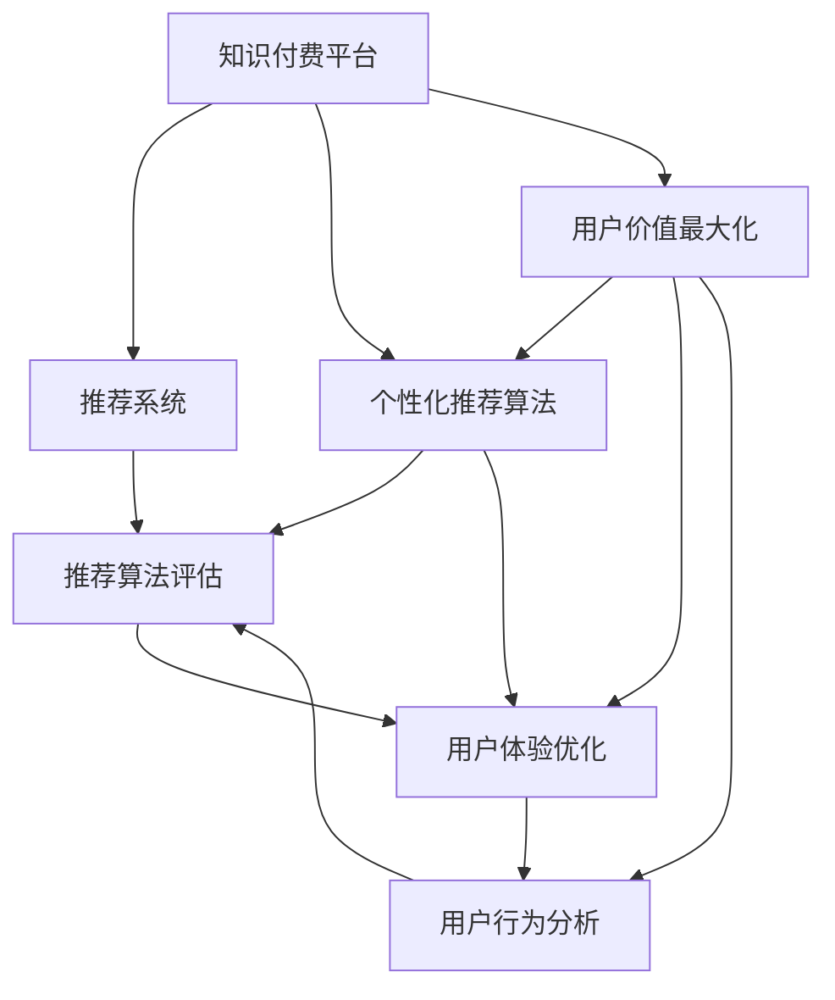

                 

# 知识 付费创业的用户价值 Maximization

> 关键词：知识付费,创业,用户体验,用户价值,个性化推荐,推荐系统,数据挖掘,用户行为分析

## 1. 背景介绍

### 1.1 问题由来
随着知识经济的兴起，越来越多的用户开始通过付费订阅的方式获取有价值的学习资源，以提升自我认知能力和职业竞争力。据统计，全球知识付费市场规模已达数百亿美元，包括在线课程、专业培训、学术论文等在内的各类付费内容，吸引着数亿用户的关注和投入。然而，尽管市场上知识付费产品日渐丰富，但如何精准识别用户的知识需求，提供个性化推荐，优化用户体验，最大化用户价值，依然是知识付费平台亟待解决的重要问题。

### 1.2 问题核心关键点
面对如此庞大的用户需求，知识付费平台必须具备出色的推荐系统，才能在激烈的市场竞争中脱颖而出。推荐系统的核心在于识别用户兴趣并实时推荐相关内容，从而提升用户满意度和留存率。具体而言，关键点包括：

- 个性化推荐算法：如何高效准确地识别用户个性化的知识需求。
- 推荐算法评估：如何评估推荐系统的准确性和用户满意度。
- 用户体验优化：如何在推荐系统基础上提升用户体验，降低流失率。
- 用户行为分析：如何通过用户行为数据指导推荐系统优化，提升推荐效果。

本文旨在全面探讨知识付费创业中推荐系统的用户价值最大化问题，提出了一套完整的推荐系统优化方案，帮助知识付费平台提升用户价值，加速业务发展。

## 2. 核心概念与联系

### 2.1 核心概念概述

为更好地理解知识付费创业中推荐系统的用户价值最大化，本节将介绍几个密切相关的核心概念：

- 知识付费平台(Knowledge-Paid Platform)：指通过付费订阅方式提供有价值学习资源，促进用户学习和成长的平台。
- 推荐系统(Recommendation System)：指利用算法技术，根据用户历史行为和兴趣，实时推荐相关内容的技术系统。
- 个性化推荐算法(Personalized Recommendation Algorithm)：指根据用户个性化需求，实时推荐相关内容的算法。
- 用户价值最大化(User Value Maximization)：指通过优化推荐系统，最大化用户满意度和留存率，提升平台的商业价值。
- 用户体验(User Experience)：指用户在平台上的整体使用感受和满意度。
- 用户行为分析(User Behavior Analysis)：指通过对用户行为数据的分析，指导推荐系统优化，提升推荐效果。

这些核心概念之间的逻辑关系可以通过以下Mermaid流程图来展示：



这个流程图展示了几者的核心概念及其之间的关系：

1. 知识付费平台利用推荐系统，通过个性化推荐算法识别用户需求，实时推荐相关内容。
2. 推荐系统的效果需要通过推荐算法评估和用户体验优化不断改进。
3. 用户行为分析的数据反馈，又指导个性化推荐算法和用户体验优化，形成闭环。
4. 最终目标是实现用户价值最大化，通过提升用户满意度和留存率，提升平台的商业价值。

## 3. 核心算法原理 & 具体操作步骤
### 3.1 算法原理概述

知识付费平台推荐系统的核心算法原理，是利用用户行为数据和历史数据，结合个性化推荐算法，实时推荐相关内容，从而提升用户满意度和留存率。推荐系统的总体流程包括以下几个步骤：

1. 数据收集与清洗：收集用户浏览历史、点击行为、支付记录等数据，并清洗、去噪。
2. 用户画像构建：基于用户行为数据，构建用户兴趣画像，识别用户个性化需求。
3. 内容标签设计：为知识内容添加标签，并映射到知识图谱中。
4. 推荐模型训练：训练推荐模型，识别用户需求和内容匹配度。
5. 实时推荐生成：根据实时数据，生成个性化推荐内容。
6. 推荐效果评估：通过用户反馈、行为数据等指标，评估推荐系统效果，指导模型优化。

### 3.2 算法步骤详解

基于上述算法原理，推荐系统的主要操作步骤如下：

**Step 1: 数据收集与清洗**

- 收集用户行为数据，包括点击次数、浏览时间、点击路径等。
- 收集内容数据，包括课程名称、标签、简介、时长等。
- 清洗数据，去除无效数据、噪声等。

**Step 2: 用户画像构建**

- 基于用户行为数据，计算每个用户的兴趣特征。
- 利用聚类算法、协同过滤等技术，构建用户兴趣画像。
- 通过相似度度量，计算用户画像相似度。

**Step 3: 内容标签设计**

- 为课程、文章等知识内容添加标签，如“编程”、“营销”、“心理学”等。
- 将标签映射到知识图谱中，构建知识图谱结构。

**Step 4: 推荐模型训练**

- 选择适合的推荐算法，如基于协同过滤的CF算法、基于内容的CB算法、混合算法等。
- 根据用户画像和内容标签，训练推荐模型。
- 优化模型参数，提高推荐准确性。

**Step 5: 实时推荐生成**

- 根据用户实时行为数据，生成个性化推荐列表。
- 实时更新推荐模型，适应新的用户行为变化。
- 提供不同形式的推荐展示，如横幅广告、视频推荐等。

**Step 6: 推荐效果评估**

- 收集用户反馈数据，包括评分、评论等。
- 分析用户行为数据，计算点击率、留存率等指标。
- 定期评估推荐系统效果，优化推荐算法。

### 3.3 算法优缺点

知识付费平台的推荐系统具有以下优点：

1. 个性化推荐：通过用户画像和行为数据分析，能够精准推荐用户感兴趣的课程内容。
2. 用户留存率提升：通过个性化推荐，提升用户满意度和留存率，增加平台粘性。
3. 商业价值增长：高质量推荐能够吸引更多用户订阅，增加平台收入。

同时，该系统也存在以下局限性：

1. 数据依赖性高：推荐系统依赖用户行为数据，数据量不足时效果可能不佳。
2. 模型复杂度：复杂的推荐模型可能带来过拟合和计算成本高的问题。
3. 冷启动问题：新用户缺乏足够的历史数据，难以准确推荐。
4. 推荐质量波动：推荐效果受用户行为变化影响较大。
5. 用户隐私保护：用户行为数据隐私保护问题需要关注。

尽管存在这些局限性，但就目前而言，推荐系统仍是知识付费平台推荐用户感兴趣内容的核心手段。未来相关研究的重点在于如何进一步降低推荐系统对用户数据量的依赖，提高模型鲁棒性和计算效率，同时兼顾用户隐私保护，确保数据安全。

### 3.4 算法应用领域

知识付费平台的推荐系统在多个领域得到应用，包括但不限于：

- 在线课程推荐：根据用户历史学习行为，推荐适合的课程内容。
- 文章推荐：根据用户浏览偏好，推荐相关领域的专业文章。
- 论文推荐：根据用户研究方向，推荐前沿研究论文。
- 书籍推荐：根据用户阅读习惯，推荐合适的书籍和出版社。
- 视频推荐：根据用户观看记录，推荐相关主题的视频内容。
- 个性化学习路径推荐：根据用户学习进度和兴趣，推荐学习路径和课程推荐。

## 4. 数学模型和公式 & 详细讲解  
### 4.1 数学模型构建

在知识付费平台的推荐系统中，我们通常使用协同过滤(CF)算法和基于内容的推荐(CB)算法进行推荐。CF算法利用用户行为数据，构建用户兴趣和物品相似度，进行推荐；CB算法利用物品特征和用户特征，进行内容匹配推荐。

假设用户-物品评分矩阵为 $\mathbf{R} \in \mathbb{R}^{N \times M}$，其中 $N$ 为物品数量，$M$ 为用户数量。设用户 $i$ 对物品 $j$ 的评分（或评分缺失情况）为 $r_{ij}$。

定义物品 $j$ 的特征向量 $\mathbf{p_j} \in \mathbb{R}^D$，用户 $i$ 的特征向量 $\mathbf{q_i} \in \mathbb{R}^D$，其中 $D$ 为特征维度。

**协同过滤算法**

协同过滤算法的目标是最小化用户-物品评分矩阵与推荐矩阵 $\mathbf{\hat{R}}$ 的均方误差，即：

$$
\min_{\mathbf{\hat{R}}} ||\mathbf{R} - \mathbf{\hat{R}}||_F^2 = \min_{\mathbf{\hat{R}}} \sum_{i,j}(r_{ij} - \hat{r}_{ij})^2
$$

其中 $\hat{r}_{ij}$ 表示用户 $i$ 对物品 $j$ 的预测评分。

**基于内容的推荐算法**

基于内容的推荐算法可以表示为：

$$
\mathbf{\hat{R}} = \mathbf{q}_i \mathbf{p}_j^T
$$

其中 $\mathbf{q}_i$ 和 $\mathbf{p}_j$ 分别为用户和物品的特征向量，$\mathbf{\hat{R}}$ 为推荐矩阵。

### 4.2 公式推导过程

**协同过滤算法**

假设 $\mathbf{R}$ 中每个元素 $r_{ij}$ 可以表示为用户 $i$ 对物品 $j$ 的评分 $r_{ij} = u_i \cdot v_j$，其中 $u_i$ 为用户特征向量，$v_j$ 为物品特征向量。

推荐矩阵 $\mathbf{\hat{R}}$ 的元素可以表示为：

$$
\hat{r}_{ij} = u_i \cdot v_j
$$

最小化均方误差：

$$
\min_{u_i, v_j} \sum_{i,j}(r_{ij} - u_i \cdot v_j)^2
$$

使用梯度下降方法更新 $u_i$ 和 $v_j$：

$$
\begin{aligned}
u_i & \leftarrow u_i - \eta \sum_j (r_{ij} - u_i \cdot v_j) v_j \\
v_j & \leftarrow v_j - \eta \sum_i (r_{ij} - u_i \cdot v_j) u_i
\end{aligned}
$$

**基于内容的推荐算法**

假设物品 $j$ 的特征向量为 $\mathbf{p_j}$，用户 $i$ 的特征向量为 $\mathbf{q_i}$。

推荐矩阵 $\mathbf{\hat{R}}$ 可以表示为：

$$
\mathbf{\hat{R}} = \mathbf{q}_i \mathbf{p}_j^T
$$

最小化预测评分与真实评分的误差：

$$
\min_{\mathbf{\hat{R}}} \sum_{i,j}(r_{ij} - \mathbf{q}_i \mathbf{p}_j^T)^2
$$

**特征向量计算**

利用奇异值分解(SVD)，可以将 $\mathbf{R}$ 表示为：

$$
\mathbf{R} = \mathbf{U} \mathbf{\Sigma} \mathbf{V}^T
$$

其中 $\mathbf{U} \in \mathbb{R}^{N \times K}$ 为左奇异矩阵，$\mathbf{V} \in \mathbb{R}^{M \times K}$ 为右奇异矩阵，$\mathbf{\Sigma} \in \mathbb{R}^{K \times K}$ 为奇异值矩阵，$K$ 为奇异值个数。

用户特征向量 $\mathbf{q_i}$ 可以表示为：

$$
\mathbf{q_i} = \mathbf{U}^T \mathbf{u_i}
$$

物品特征向量 $\mathbf{p_j}$ 可以表示为：

$$
\mathbf{p_j} = \mathbf{V} \mathbf{v_j}
$$

### 4.3 案例分析与讲解

以在线课程推荐为例，我们可以将每门课程看作一个物品，用户的浏览、点击、购买行为看作对物品的评分。基于协同过滤算法，我们可以通过用户行为数据，构建用户和课程的相似度矩阵，从而推荐用户可能感兴趣的课程。基于内容的推荐算法，则可以根据课程内容和用户兴趣，推荐匹配度高的课程。

具体而言，假设某用户 $i$ 对课程 $j$ 的评分数据为 $\{r_{ij}\}_{j=1}^{J}$，其中 $J$ 为课程数量。通过协同过滤算法，我们可以计算用户 $i$ 和课程 $j$ 的相似度：

$$
s_{ij} = \frac{\sum_k u_{ik} v_{kj}}{\sqrt{\sum_k u_{ik}^2} \sqrt{\sum_k v_{kj}^2}}
$$

推荐相似度排名前 $K$ 的课程 $j$，作为用户 $i$ 的推荐列表：

$$
\text{rank}(j) = \{s_{ij}\}_{j=1}^{J} \text{ (s.t. } \sum_{j=1}^{J} s_{ij} = 1)
$$

**基于内容的推荐算法**

假设每门课程的特征向量 $\mathbf{p_j} \in \mathbb{R}^D$，用户 $i$ 的特征向量 $\mathbf{q_i} \in \mathbb{R}^D$。

推荐列表可以表示为：

$$
\text{rank}(j) = \mathbf{q}_i \mathbf{p}_j^T
$$

## 5. 项目实践：代码实例和详细解释说明
### 5.1 开发环境搭建

在进行推荐系统开发前，我们需要准备好开发环境。以下是使用Python进行Scikit-learn开发的环境配置流程：

1. 安装Anaconda：从官网下载并安装Anaconda，用于创建独立的Python环境。

2. 创建并激活虚拟环境：
```bash
conda create -n pytorch-env python=3.8 
conda activate pytorch-env
```

3. 安装Scikit-learn：
```bash
pip install scikit-learn
```

4. 安装其他必要工具包：
```bash
pip install numpy pandas matplotlib
```

完成上述步骤后，即可在`pytorch-env`环境中开始推荐系统实践。

### 5.2 源代码详细实现

下面以协同过滤算法为例，给出使用Scikit-learn库实现协同过滤推荐算法的PyTorch代码实现。

```python
import numpy as np
from sklearn.neighbors import NearestNeighbors

# 生成模拟用户-物品评分矩阵
np.random.seed(0)
N = 1000
M = 1000
R = np.random.randint(1, 6, size=(N, M))

# 计算用户-物品评分矩阵的平均评分
r_mean = np.mean(R, axis=1)
R -= r_mean[:, None]

# 训练协同过滤模型
nbrs = NearestNeighbors(n_neighbors=10, algorithm='brute')
nbrs.fit(R)

# 预测用户i的推荐列表
def predict_user_i(user_id, n_recommendations):
    # 获取用户i的最近邻
    distances, indices = nbrs.kneighbors(R[user_id, :])
    # 计算推荐列表
    recommendations = []
    for j, index in enumerate(indices):
        recommendations.append(R[index, :])
    # 返回推荐列表
    return recommendations

# 调用函数
user_id = 0
n_recommendations = 5
recommendations = predict_user_i(user_id, n_recommendations)
print(recommendations)
```

在上述代码中，我们首先生成了一个模拟用户-物品评分矩阵，并计算了每个用户的平均评分。然后，使用NearestNeighbors库实现了协同过滤算法，通过最近邻算法计算了每个用户的最近邻，并返回了推荐列表。

### 5.3 代码解读与分析

让我们再详细解读一下关键代码的实现细节：

**生成模拟用户-物品评分矩阵**：
- `np.random.seed(0)`：设置随机数种子，保证每次生成的评分矩阵一致。
- `np.random.randint(1, 6, size=(N, M))`：生成一个 $N \times M$ 的随机矩阵，元素取值为1到5。
- `R -= r_mean[:, None]`：对每个用户减去平均评分，模拟真实评分矩阵中的偏差。

**训练协同过滤模型**：
- `NearestNeighbors(n_neighbors=10, algorithm='brute')`：创建NearestNeighbors对象，设置最近邻数为10，算法为暴力搜索。
- `nbrs.fit(R)`：拟合训练数据，构建用户-物品的最近邻关系。

**预测用户推荐列表**：
- `distances, indices = nbrs.kneighbors(R[user_id, :])`：计算用户i的最近邻，返回距离和索引。
- `recommendations = []`：初始化推荐列表。
- 循环遍历最近邻，计算推荐列表。
- 返回推荐列表。

可以看到，Scikit-learn库提供了简单易用的工具，可以快速实现协同过滤推荐算法。开发者可以灵活调整参数，优化推荐效果。

## 6. 实际应用场景
### 6.1 智能推荐引擎

智能推荐引擎是知识付费平台的核心组件之一，通过实时推荐用户感兴趣的内容，提高用户满意度和留存率。

在技术实现上，可以基于用户行为数据和历史评分，构建用户-物品的相似度矩阵。然后，利用协同过滤算法，实时计算用户未评分物品的相似度，生成推荐列表。此外，还可以结合基于内容的推荐算法，进一步提升推荐效果。

智能推荐引擎不仅应用于在线课程推荐，还能扩展到文章推荐、论文推荐、书籍推荐等多个场景，为知识付费平台提供全面、精准的推荐服务。

### 6.2 个性化学习路径

个性化学习路径推荐是知识付费平台的另一大应用场景，通过分析用户的学习进度和兴趣点，推荐适合的学习路径和课程，帮助用户更好地学习知识。

在技术实现上，可以基于用户学习行为数据，构建用户知识图谱。然后，利用协同过滤算法和基于内容的推荐算法，推荐匹配用户兴趣的学习路径。同时，还可以结合智能推荐引擎，实时动态更新推荐路径，提升用户的学习体验。

个性化学习路径推荐能够显著提升用户学习效率，帮助用户快速掌握相关知识，具有重要的应用价值。

### 6.3 数据驱动的用户行为分析

数据驱动的用户行为分析是知识付费平台优化推荐系统的重要手段。通过收集和分析用户行为数据，可以发现用户的兴趣变化、行为模式等关键信息，指导推荐系统优化。

在技术实现上，可以采用机器学习算法，如聚类、分类、回归等，分析用户行为数据，构建用户画像和行为模型。然后，利用这些数据反馈，优化推荐算法和模型参数，提升推荐效果。

数据驱动的用户行为分析不仅应用于推荐系统优化，还能广泛应用于用户行为预测、用户分群等多个场景，为知识付费平台提供科学、有效的决策支持。

## 7. 工具和资源推荐
### 7.1 学习资源推荐

为了帮助开发者系统掌握推荐系统的理论基础和实践技巧，这里推荐一些优质的学习资源：

1. 《推荐系统实践》系列博文：由知名推荐系统专家撰写，深入浅出地介绍了推荐系统的基本概念、经典模型和实践经验。
2. 《推荐系统》课程：斯坦福大学开设的推荐系统经典课程，内容涵盖了推荐系统基础理论、算法设计和应用案例。
3. 《推荐系统实战》书籍：深度介绍了推荐系统设计、开发和优化的方法，结合大量案例帮助读者快速上手。
4. KDD、SIGKDD等学术会议论文：知识付费推荐系统相关领域的研究论文，展示了前沿技术和发展趋势。
5. Apache Spark MLlib库：Hadoop的推荐系统库，提供了丰富的推荐算法和工具。

通过对这些资源的学习实践，相信你一定能够快速掌握推荐系统的精髓，并用于解决实际的推荐问题。

### 7.2 开发工具推荐

高效的开发离不开优秀的工具支持。以下是几款用于推荐系统开发的常用工具：

1. Scikit-learn：开源的Python机器学习库，提供了多种推荐算法和评估方法，易于上手。
2. TensorFlow：由Google主导开发的深度学习框架，支持分布式训练和模型优化。
3. PyTorch：开源的深度学习框架，提供了灵活的动态图和GPU加速，适合快速迭代研究。
4. Apache Spark：Hadoop的大数据处理框架，提供了高效的分布式计算和数据处理能力。
5. Elasticsearch：开源的搜索引擎，提供了快速的数据查询和推荐服务。
6. Google Cloud BigQuery：Google的云数据仓库，支持大规模数据存储和推荐系统优化。

合理利用这些工具，可以显著提升推荐系统的开发效率，加快创新迭代的步伐。

### 7.3 相关论文推荐

推荐系统的发展源于学界的持续研究。以下是几篇奠基性的相关论文，推荐阅读：

1. Matrix Factorization Techniques for Recommender Systems：引入了矩阵分解技术，用于推荐系统的建模和优化。
2. BPR: Bayesian Personalized Ranking from Implicit Feedback：提出了贝叶斯个性化排序算法，用于隐式反馈推荐系统。
3. Factorization Machines for Recommender Systems：提出因子机算法，提高了推荐系统的精度和鲁棒性。
4. Attention-based Recommender Systems：引入了注意力机制，提升推荐系统的泛化能力和用户体验。
5. Deep Matrix Factorization with Distributed Tensor Algorithms：提出了分布式因子机算法，提高了推荐系统的训练效率。

这些论文代表了大语言模型推荐系统的发展脉络。通过学习这些前沿成果，可以帮助研究者把握学科前进方向，激发更多的创新灵感。

## 8. 总结：未来发展趋势与挑战
### 8.1 总结

本文对知识付费创业中推荐系统的用户价值最大化问题进行了全面系统的介绍。首先阐述了推荐系统在知识付费平台的重要性，明确了优化推荐系统的核心关键点。其次，从原理到实践，详细讲解了推荐系统的数学模型和推荐算法，给出了推荐系统开发的完整代码实例。同时，本文还广泛探讨了推荐系统在智能推荐引擎、个性化学习路径等多个领域的应用前景，展示了推荐系统的大数据价值。

通过本文的系统梳理，可以看到，推荐系统在知识付费平台推荐用户感兴趣内容中发挥着不可替代的作用。推荐系统的优化需要开发者在数据收集、模型设计、算法选择等多个维度进行全面考虑，方能得到理想的效果。

### 8.2 未来发展趋势

展望未来，推荐系统将呈现以下几个发展趋势：

1. 深度学习的应用。基于深度神经网络的推荐算法，如神经协同过滤算法、序列推荐模型等，将取代传统的协同过滤和内容推荐算法，提供更加精准、个性化的推荐服务。
2. 强化学习的应用。通过强化学习算法，实时优化推荐策略，提升推荐系统的效果。
3. 跨领域推荐系统的出现。推荐系统将从单一领域走向多领域融合，实现跨领域推荐和跨模态推荐。
4. 数据驱动的推荐系统优化。通过大数据分析和机器学习算法，实时优化推荐系统，提升推荐效果。
5. 实时推荐技术的应用。利用实时推荐技术，提高推荐系统的响应速度和用户体验。
6. 推荐系统的可解释性和透明性。通过可解释性推荐模型，提升用户对推荐结果的理解和信任。

以上趋势凸显了推荐系统在知识付费平台中的重要地位，这些方向的探索发展，必将进一步提升推荐系统的性能和应用范围，为知识付费平台带来更大的商业价值。

### 8.3 面临的挑战

尽管推荐系统在知识付费平台中已经取得了显著成效，但在迈向更加智能化、普适化应用的过程中，它仍面临着诸多挑战：

1. 数据依赖性。推荐系统依赖用户行为数据，数据量不足时效果可能不佳。
2. 计算复杂度。基于深度学习的推荐算法计算复杂度高，训练时间长，需要强大的硬件支持。
3. 冷启动问题。新用户缺乏足够的历史数据，难以准确推荐。
4. 推荐质量波动。推荐效果受用户行为变化影响较大。
5. 用户隐私保护。用户行为数据隐私保护问题需要关注。
6. 算法的公平性和透明性。推荐系统可能存在算法偏见和透明度不足的问题。

尽管存在这些挑战，但通过技术创新和工程实践的不断打磨，推荐系统必将克服这些障碍，实现更加高效、精准的推荐服务。

### 8.4 研究展望

未来推荐系统的研究需要在以下几个方面寻求新的突破：

1. 探索更加高效、可解释的推荐算法。开发更高效的推荐算法，如分布式推荐、序列推荐等，同时提升算法的可解释性，帮助用户理解推荐结果。
2. 融合跨领域、跨模态信息。将推荐系统扩展到多领域、多模态的推荐场景，提升推荐系统的泛化能力和效果。
3. 引入深度强化学习。利用深度强化学习算法，实时优化推荐策略，提升推荐系统的效果和响应速度。
4. 改进推荐系统评估指标。开发更加科学、全面的推荐系统评估指标，指导推荐系统优化。
5. 提升推荐系统的可扩展性。利用分布式系统和大数据技术，提高推荐系统的可扩展性和实时性。
6. 强化推荐系统的透明性。通过算法可解释性、用户反馈机制等手段，提升推荐系统的透明性和公平性。

这些研究方向的探索，必将引领推荐系统迈向更高的台阶，为知识付费平台带来更大的商业价值。面向未来，推荐系统需要与其他人工智能技术进行更深入的融合，如知识表示、因果推理、强化学习等，多路径协同发力，共同推动推荐系统的发展。只有勇于创新、敢于突破，才能不断拓展推荐系统的边界，让知识付费平台的服务更加精准、高效、智能。

## 9. 附录：常见问题与解答

**Q1：推荐系统如何处理冷启动问题？**

A: 冷启动问题是指新用户缺乏足够的历史数据，难以准确推荐。常见的处理方式包括：
1. 基于物品的推荐。利用物品的受欢迎程度、评分等信息，向新用户推荐热门物品。
2. 利用用户画像。通过收集用户的社交网络信息、人口统计信息等，构建用户画像，提升推荐效果。
3. 利用协同过滤。通过新用户的兴趣向量，计算与已有用户的相似度，推荐相似用户的物品。
4. 利用深度学习。利用深度学习模型，对用户行为数据进行拟合，预测新用户的行为，提升推荐效果。

**Q2：推荐系统如何提升推荐精度？**

A: 推荐精度是推荐系统的关键指标之一，可以通过以下方式提升：
1. 数据收集和清洗。收集更多的用户行为数据，去除无效数据和噪声，提高数据质量。
2. 特征工程。提取和工程化更多的特征，提升模型的表达能力。
3. 模型选择和优化。选择合适的推荐算法，优化模型参数，提高推荐效果。
4. 用户行为分析。通过用户行为数据，优化推荐策略，提升推荐精度。
5. 实时推荐。利用实时数据，动态更新推荐列表，提高推荐效果。

**Q3：推荐系统如何提升用户体验？**

A: 用户体验是推荐系统的关键指标之一，可以通过以下方式提升：
1. 推荐界面设计。设计友好的推荐界面，提升用户体验。
2. 个性化推荐。通过用户画像和行为数据，提供个性化推荐，提升用户满意度。
3. 推荐多样性。通过多样性控制算法，提升推荐多样性，避免推荐单一。
4. 实时反馈机制。通过实时反馈机制，优化推荐策略，提升用户体验。
5. 交互设计。通过交互设计，提升用户与系统的互动体验。

**Q4：推荐系统如何保护用户隐私？**

A: 用户隐私保护是推荐系统的关键问题之一，可以通过以下方式保护：
1. 数据匿名化。通过数据匿名化技术，保护用户隐私。
2. 用户授权。获取用户授权，只在用户同意的范围内使用数据。
3. 数据加密。对用户数据进行加密，保护用户隐私。
4. 隐私控制。通过隐私控制技术，保护用户隐私。
5. 隐私法规遵守。遵守相关的隐私法规和标准，保护用户隐私。

**Q5：推荐系统如何优化模型参数？**

A: 优化推荐系统模型参数是提升推荐效果的重要手段，可以通过以下方式优化：
1. 交叉验证。利用交叉验证技术，评估模型效果，优化模型参数。
2. 网格搜索。通过网格搜索技术，优化模型参数。
3. 贝叶斯优化。利用贝叶斯优化技术，优化模型参数。
4. 自动化调参。通过自动化调参工具，优化模型参数。
5. 超参数学习。利用超参数学习技术，优化模型参数。

这些方法可以帮助开发者在推荐系统中优化模型参数，提升推荐效果。

---

作者：禅与计算机程序设计艺术 / Zen and the Art of Computer Programming

