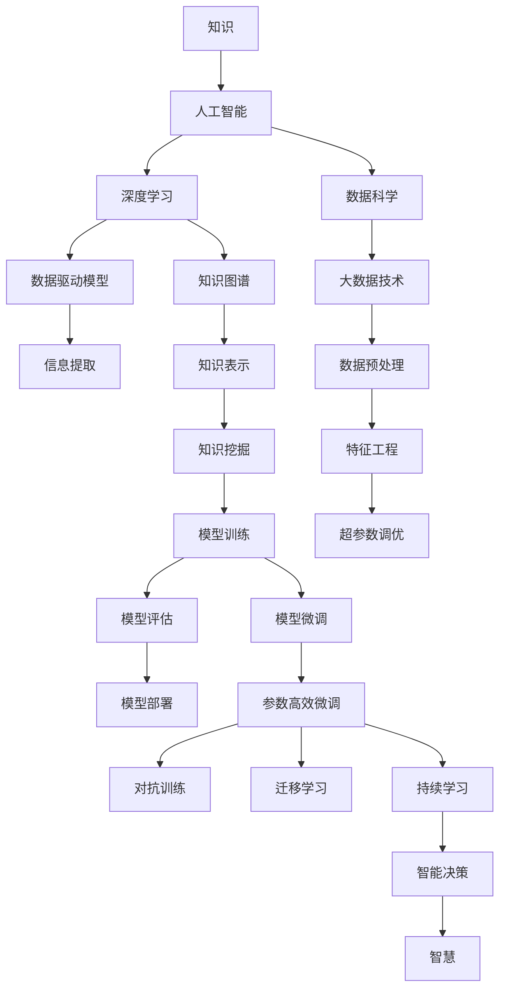

                 

# 知识与智慧的区别：超越表面信息

> 关键词：知识,智慧,人工智能,深度学习,数据科学,认知心理学,决策

## 1. 背景介绍

### 1.1 问题由来
在人类历史的长河中，知识与智慧始终是人类探索未知、推动进步的两大驱动力。随着科技的进步，特别是人工智能和深度学习技术的飞速发展，我们在知识和智慧的探索道路上迈出了更加坚实的步伐。然而，当我们面对海量数据和复杂模型时，如何区分知识和智慧，如何在技术的辅助下更好地发挥智慧的力量，成为了一个值得深入探讨的问题。

### 1.2 问题核心关键点
在人工智能领域，知识与智慧的区分不仅涉及技术实现，更涉及认知心理学和哲学层面的探讨。在深度学习时代，知识通常被视作通过数据和模型学习到的结构化信息，而智慧则更多体现为模型对复杂问题的推理、判断和创造能力。如何在大数据和复杂模型中挖掘智慧，超越表面的知识，是当前技术研究和应用中亟待解决的关键问题。

## 2. 核心概念与联系

### 2.1 核心概念概述

为更好地理解人工智能中知识与智慧的区别，本节将介绍几个关键概念：

- 知识(Knowledge)：通过学习、积累和传递，人类对客观世界规律性认识的总和。在人工智能中，知识通常指的是通过数据和模型学习到的结构化信息，包括事实、规则和逻辑等。

- 智慧(Wisdom)：超越知识范畴，更多体现为对复杂问题进行推理、判断和创造的能力。智慧不仅包括对已知信息的理解和应用，还包括对未知的探索和创造。

- 人工智能(Artificial Intelligence)：通过算法和模型模拟人类智能的计算机科学领域。人工智能的目标是使机器能够理解、学习、推理和创造，以实现对复杂任务的自动化处理。

- 深度学习(Deep Learning)：人工智能中的一个重要分支，通过构建深层神经网络模型，学习数据中的复杂非线性关系，从而实现对复杂问题的自动化处理。

- 数据科学(Data Science)：一门以数据为核心，通过统计学、机器学习、数据挖掘等技术手段，发现数据中的价值和规律的学科。

- 认知心理学(Cognitive Psychology)：研究人类认知过程和心理活动的学科，探讨人类如何感知、记忆、思考和决策。

- 决策理论(Decision Theory)：研究人类和机器在面对不确定性情况下的决策行为和结果的学科。

这些概念之间的逻辑关系可以通过以下Mermaid流程图来展示：



这个流程图展示了知识与智慧在人工智能中的关系及其转化过程：

1. 知识作为数据科学和人工智能的基础，通过深度学习模型进行提取和表示。
2. 知识图谱和数据驱动模型是知识表示和提取的重要手段。
3. 特征工程、模型训练和微调等技术手段，用于优化模型对知识的理解和应用。
4. 对抗训练和迁移学习等技术，帮助模型在不同数据和任务上更泛化。
5. 持续学习等技术，使模型能够不断适应新的数据和任务。
6. 通过智能决策系统，将知识转化为智慧，实现对复杂问题的自动化处理。

## 3. 核心算法原理 & 具体操作步骤
### 3.1 算法原理概述

人工智能中知识与智慧的转化，离不开对知识的学习、理解和应用。深度学习作为当前人工智能技术的主流范式，通过构建深层神经网络模型，能够自动学习数据中的复杂非线性关系，从而实现对知识的抽取和表示。然而，仅仅依赖知识的学习，并不足以形成智慧。智慧的形成，更多依赖于对知识的深度理解和创造性应用。

形式化地，假设我们的目标是构建一个能够实现智慧的模型。模型训练的目标可以定义为：

$$
\min_{\theta} \mathcal{L}(\theta) = \frac{1}{N}\sum_{i=1}^N \ell(y_i, M_{\theta}(x_i))
$$

其中，$y_i$ 表示样本的真实标签，$x_i$ 表示样本的特征向量，$M_{\theta}$ 表示模型，$\theta$ 为模型参数，$\ell$ 为损失函数。

模型训练的过程包括数据预处理、特征提取、模型训练和模型评估等步骤。具体而言，在训练过程中，模型通过前向传播计算输出，反向传播更新参数，逐步优化模型对知识的理解和应用。通过不断迭代，模型能够逐步提高对复杂问题的推理、判断和创造能力，从而实现从知识到智慧的转化。

### 3.2 算法步骤详解

基于深度学习的人工智能模型，其构建和训练步骤通常包括以下几个关键环节：

**Step 1: 数据准备**
- 收集和标注训练数据。数据的质量和多样性直接影响到模型的性能和泛化能力。
- 划分训练集、验证集和测试集。验证集用于模型选择和参数调整，测试集用于最终性能评估。

**Step 2: 模型构建**
- 选择合适的深度学习模型架构。常用的模型包括卷积神经网络(CNN)、循环神经网络(RNN)、Transformer等。
- 定义模型参数和损失函数。模型的参数决定了其对输入数据的映射方式，损失函数用于衡量模型输出与真实标签之间的差异。

**Step 3: 特征工程**
- 对原始数据进行预处理，包括去噪、归一化、标准化等。
- 设计合适的特征提取方法，将原始数据转化为模型所需的特征向量。
- 使用特征工程技术，如降维、特征选择、生成对抗网络(GAN)等，优化特征表示。

**Step 4: 模型训练**
- 使用优化算法，如随机梯度下降(SGD)、Adam等，更新模型参数。
- 设定合适的学习率、批大小、迭代轮数等超参数。
- 在每个迭代周期中，计算损失函数，进行前向传播和反向传播。
- 使用正则化技术，如L2正则、Dropout等，防止过拟合。

**Step 5: 模型评估与优化**
- 在测试集上评估模型性能，计算精度、召回率、F1分数等指标。
- 根据评估结果，调整模型超参数，如学习率、批大小、正则化强度等。
- 使用模型微调、参数高效微调、对抗训练等技术，进一步提升模型性能。

**Step 6: 模型部署**
- 将训练好的模型保存和导出，部署到实际应用环境中。
- 集成模型到应用程序中，进行数据输入、推理计算和结果输出。
- 对模型进行监控和维护，确保其稳定性和安全性。

### 3.3 算法优缺点

基于深度学习的人工智能模型，其构建和训练方法具有以下优点：

1. 自动化学习：深度学习模型能够自动学习数据中的复杂非线性关系，无需手工设计特征。
2. 泛化能力强：通过大规模数据训练，深度学习模型能够具备较强的泛化能力，适用于各种复杂任务。
3. 高效训练：通过优化算法和加速技术，深度学习模型能够在较短时间内完成训练。
4. 可解释性强：深度学习模型的权重和激活函数具有较好的可解释性，便于理解和调试。

同时，该方法也存在一些缺点：

1. 数据依赖性强：深度学习模型对数据质量和多样性要求较高，数据收集和标注成本高。
2. 模型复杂度高：深层神经网络模型参数量庞大，计算复杂度高，资源消耗大。
3. 过度拟合风险：在数据量不足或特征工程不完善的情况下，深度学习模型容易发生过拟合。
4. 知识表示困难：深度学习模型难以直接理解符号化的知识表示，如逻辑规则、常识等。
5. 伦理风险：深度学习模型可能学习到有害的信息和偏见，影响模型输出。

尽管存在这些局限性，但深度学习仍然是大数据时代的主流技术，其强大的自动化学习和泛化能力，为知识与智慧的转化提供了新的可能。

### 3.4 算法应用领域

基于深度学习的人工智能模型，已在众多领域得到了广泛应用，例如：

- 计算机视觉：如图像分类、目标检测、图像生成等。深度学习模型通过学习图像特征，能够实现高精度的图像理解和生成。
- 自然语言处理(NLP)：如文本分类、情感分析、机器翻译等。深度学习模型通过学习语言结构和语义信息，能够理解自然语言输入，并进行智能回复。
- 语音识别：如语音转文本、说话人识别等。深度学习模型通过学习语音信号的特征，能够实现高精度的语音识别和理解。
- 推荐系统：如商品推荐、音乐推荐等。深度学习模型通过学习用户行为和物品特征，能够实现个性化推荐。
- 自动驾驶：如环境感知、路径规划等。深度学习模型通过学习传感器数据，能够实现对环境的智能感知和决策。

除了上述这些经典应用外，深度学习模型还在金融、医疗、智能制造等众多领域得到了创新性应用，为各行各业带来了显著的技术进步和商业价值。

## 4. 数学模型和公式 & 详细讲解  
### 4.1 数学模型构建

在深度学习中，知识与智慧的转化通常通过构建深度神经网络模型来实现。假设我们的目标是构建一个具有智慧的模型，该模型通过学习数据中的知识，并进行推理、判断和创造，最终实现对复杂问题的自动化处理。

记深度神经网络模型为 $M_{\theta}(x)$，其中 $x$ 为输入数据，$\theta$ 为模型参数。模型的目标函数可以定义为：

$$
\min_{\theta} \mathcal{L}(\theta) = \frac{1}{N}\sum_{i=1}^N \ell(y_i, M_{\theta}(x_i))
$$

其中 $\ell$ 为损失函数，$y_i$ 表示样本的真实标签，$x_i$ 表示样本的特征向量。常见的损失函数包括交叉熵损失、均方误差损失等。

模型的训练过程可以通过梯度下降等优化算法来实现，具体公式如下：

$$
\theta \leftarrow \theta - \eta \nabla_{\theta}\mathcal{L}(\theta)
$$

其中 $\eta$ 为学习率，$\nabla_{\theta}\mathcal{L}(\theta)$ 为损失函数对模型参数的梯度，可通过反向传播算法计算。

### 4.2 公式推导过程

以二分类任务为例，推导交叉熵损失函数及其梯度的计算公式。

假设模型 $M_{\theta}(x)$ 在输入 $x$ 上的输出为 $\hat{y}=M_{\theta}(x) \in [0,1]$，表示样本属于正类的概率。真实标签 $y \in \{0,1\}$。则二分类交叉熵损失函数定义为：

$$
\ell(M_{\theta}(x),y) = -[y\log \hat{y} + (1-y)\log (1-\hat{y})]
$$

将其代入经验风险公式，得：

$$
\mathcal{L}(\theta) = -\frac{1}{N}\sum_{i=1}^N [y_i\log M_{\theta}(x_i)+(1-y_i)\log(1-M_{\theta}(x_i))]
$$

根据链式法则，损失函数对参数 $\theta_k$ 的梯度为：

$$
\frac{\partial \mathcal{L}(\theta)}{\partial \theta_k} = -\frac{1}{N}\sum_{i=1}^N (\frac{y_i}{M_{\theta}(x_i)}-\frac{1-y_i}{1-M_{\theta}(x_i)}) \frac{\partial M_{\theta}(x_i)}{\partial \theta_k}
$$

其中 $\frac{\partial M_{\theta}(x_i)}{\partial \theta_k}$ 可进一步递归展开，利用自动微分技术完成计算。

在得到损失函数的梯度后，即可带入参数更新公式，完成模型的迭代优化。重复上述过程直至收敛，最终得到适应复杂任务的最优模型参数 $\theta^*$。

## 5. 项目实践：代码实例和详细解释说明
### 5.1 开发环境搭建

在进行模型构建和训练前，我们需要准备好开发环境。以下是使用Python进行TensorFlow和PyTorch开发的环境配置流程：

1. 安装Anaconda：从官网下载并安装Anaconda，用于创建独立的Python环境。

2. 创建并激活虚拟环境：
```bash
conda create -n tf-env python=3.8 
conda activate tf-env
```

3. 安装TensorFlow和PyTorch：根据CUDA版本，从官网获取对应的安装命令。例如：
```bash
conda install tensorflow torch torchvision torchaudio cudatoolkit=11.1 -c pytorch -c conda-forge
```

4. 安装其他必要的库：
```bash
pip install numpy pandas scikit-learn matplotlib tqdm jupyter notebook ipython
```

完成上述步骤后，即可在`tf-env`环境中开始模型构建和训练。

### 5.2 源代码详细实现

下面我们以二分类任务为例，给出使用TensorFlow构建并训练深度神经网络模型的PyTorch代码实现。

首先，定义数据处理函数：

```python
import tensorflow as tf
from tensorflow.keras.preprocessing.image import ImageDataGenerator
from tensorflow.keras.layers import Dense, Dropout, Flatten
from tensorflow.keras.models import Sequential
from tensorflow.keras.optimizers import Adam

def load_data():
    train_datagen = ImageDataGenerator(rescale=1./255)
    test_datagen = ImageDataGenerator(rescale=1./255)
    train_generator = train_datagen.flow_from_directory(
        'train_dir',
        target_size=(224, 224),
        batch_size=32,
        class_mode='binary')
    test_generator = test_datagen.flow_from_directory(
        'test_dir',
        target_size=(224, 224),
        batch_size=32,
        class_mode='binary')
    return train_generator, test_generator

def build_model():
    model = Sequential([
        Conv2D(32, (3, 3), activation='relu', input_shape=(224, 224, 3)),
        MaxPooling2D((2, 2)),
        Conv2D(64, (3, 3), activation='relu'),
        MaxPooling2D((2, 2)),
        Flatten(),
        Dense(128, activation='relu'),
        Dropout(0.5),
        Dense(1, activation='sigmoid')])
    model.compile(
        optimizer=Adam(lr=1e-3),
        loss='binary_crossentropy',
        metrics=['accuracy'])
    return model

# 加载数据和构建模型
train_generator, test_generator = load_data()
model = build_model()

# 训练模型
model.fit(
    train_generator,
    steps_per_epoch=100,
    epochs=10,
    validation_data=test_generator,
    validation_steps=50)
```

然后，定义模型评估和预测函数：

```python
def evaluate(model, test_generator):
    test_loss, test_acc = model.evaluate(test_generator, steps=50)
    print(f'Test loss: {test_loss:.4f}')
    print(f'Test accuracy: {test_acc:.4f}')

def predict(model, test_generator):
    test_generator.reset()
    results = []
    for i in range(50):
        x, y = next(test_generator)
        y_pred = model.predict(x)
        results.append(y_pred)
    return results

# 评估和预测模型
evaluate(model, test_generator)
predict_results = predict(model, test_generator)
print(predict_results)
```

以上就是使用TensorFlow和PyTorch构建并训练深度神经网络模型的完整代码实现。可以看到，得益于TensorFlow和PyTorch的强大封装，我们能够用相对简洁的代码完成模型的构建和训练。

### 5.3 代码解读与分析

让我们再详细解读一下关键代码的实现细节：

**load_data函数**：
- 定义了数据增强和模型输入的预处理方式。
- 通过ImageDataGenerator加载并预处理训练和测试数据集。

**build_model函数**：
- 定义了模型架构，包括卷积层、池化层、全连接层和Dropout层等。
- 使用Sequential模型封装层级结构，便于构建和调整。
- 编译模型，设置优化器、损失函数和评估指标。

**模型训练和评估**：
- 使用fit函数进行模型训练，设置训练轮数、批大小和验证集。
- 在测试集上评估模型性能，输出测试损失和精度。
- 使用predict函数进行模型预测，输出预测结果。

可以看到，TensorFlow和PyTorch的结合使得深度神经网络模型的构建和训练变得简洁高效。开发者可以将更多精力放在模型设计、特征提取等高层逻辑上，而不必过多关注底层的实现细节。

当然，工业级的系统实现还需考虑更多因素，如模型的保存和部署、超参数的自动搜索、更灵活的任务适配层等。但核心的模型构建和训练流程基本与此类似。

## 6. 实际应用场景
### 6.1 智能推荐系统

基于深度学习的人工智能模型，在智能推荐系统中得到了广泛应用。传统的推荐系统往往只依赖用户的历史行为数据进行物品推荐，难以考虑用户的兴趣和需求变化。通过深度学习模型，可以更好地理解用户的行为和偏好，从而提供更加个性化和多样化的推荐。

在实践中，可以收集用户浏览、点击、评论、分享等行为数据，提取和用户交互的物品标题、描述、标签等文本内容。将文本内容作为模型输入，用户的后续行为（如是否点击、购买等）作为监督信号，在此基础上构建深度神经网络模型，并使用对抗训练等技术进行微调，从而实现智能推荐。通过智能推荐系统，用户可以更快地找到感兴趣的内容，从而提升用户体验和满意度。

### 6.2 医疗影像诊断

深度学习在医疗影像诊断领域也得到了广泛应用。传统的影像诊断主要依赖医生的经验和知识，容易受到个体差异和主观判断的影响。通过构建深度神经网络模型，可以自动学习影像中的特征，进行病灶检测和分类，从而提升诊断的准确性和效率。

在实践中，可以收集大量的医疗影像数据，并标注其中的病灶信息。通过构建卷积神经网络模型，学习影像中的特征，并使用迁移学习等技术进行微调，从而实现自动化的影像诊断。通过深度学习模型，医生可以更快地诊断病灶，降低误诊率，从而提升医疗服务的质量和效率。

### 6.3 自动驾驶系统

自动驾驶系统是深度学习的重要应用场景之一。传统的驾驶系统主要依赖传感器和规则，难以应对复杂的道路环境和交通情况。通过构建深度神经网络模型，可以自动学习环境中的特征，进行环境感知和决策规划，从而实现自动化的驾驶。

在实践中，可以收集大量的道路环境数据，并标注其中的交通情况和行驶规则。通过构建卷积神经网络模型，学习环境中的特征，并使用迁移学习等技术进行微调，从而实现自动化的驾驶。通过自动驾驶系统，汽车可以更加安全、高效地行驶，从而提升道路交通的安全性和便捷性。

### 6.4 未来应用展望

随着深度学习技术的不断发展，基于深度学习的人工智能模型将在更多领域得到应用，为各行各业带来变革性影响。

在智慧医疗领域，基于深度学习的医疗影像诊断、病理分析、药物研发等应用将提升医疗服务的智能化水平，辅助医生诊疗，加速新药开发进程。

在智能教育领域，深度学习可应用于作业批改、学情分析、知识推荐等方面，因材施教，促进教育公平，提高教学质量。

在智慧城市治理中，深度学习可应用于城市事件监测、舆情分析、应急指挥等环节，提高城市管理的自动化和智能化水平，构建更安全、高效的未来城市。

此外，在企业生产、社会治理、文娱传媒等众多领域，深度学习技术也将不断涌现，为传统行业数字化转型升级提供新的技术路径。相信随着技术的日益成熟，深度学习技术将成为人工智能落地应用的重要范式，推动人工智能技术向更广阔的领域加速渗透。

## 7. 工具和资源推荐
### 7.1 学习资源推荐

为了帮助开发者系统掌握深度学习在知识与智慧转化中的应用，这里推荐一些优质的学习资源：

1. 《深度学习》书籍：Ian Goodfellow等著作，全面介绍了深度学习的基本原理、算法和应用。
2. CS231n《卷积神经网络》课程：斯坦福大学开设的深度学习课程，深入浅出地讲解了卷积神经网络的基本原理和应用。
3. 《计算机视觉：模型、学习与推理》书籍：Andrej Karpathy等著作，介绍了计算机视觉中的深度学习模型和算法。
4. Coursera《深度学习专项课程》：由吴恩达等人讲授，涵盖深度学习的基础知识、算法和应用。
5. Fast.ai《实践深度学习》课程：由Jeremy Howard等人讲授，注重深度学习的实际应用，适合初学者学习。

通过对这些资源的学习实践，相信你一定能够快速掌握深度学习在知识与智慧转化中的应用，并用于解决实际的AI问题。

### 7.2 开发工具推荐

高效的开发离不开优秀的工具支持。以下是几款用于深度学习开发的常用工具：

1. TensorFlow：由Google主导开发的开源深度学习框架，生产部署方便，适合大规模工程应用。
2. PyTorch：基于Python的开源深度学习框架，灵活动态的计算图，适合快速迭代研究。
3. Keras：高层次的神经网络API，支持TensorFlow、Theano等后端，易于上手和调试。
4. Jupyter Notebook：交互式编程环境，支持Python、R等语言，便于快速迭代和分享代码。
5. Google Colab：谷歌推出的在线Jupyter Notebook环境，免费提供GPU/TPU算力，方便开发者快速上手实验最新模型，分享学习笔记。

合理利用这些工具，可以显著提升深度学习模型的构建和训练效率，加快创新迭代的步伐。

### 7.3 相关论文推荐

深度学习在知识与智慧转化中的应用受到了广泛的关注和研究。以下是几篇奠基性的相关论文，推荐阅读：

1. ImageNet Classification with Deep Convolutional Neural Networks：Hinton等人在2010年发表的论文，介绍了卷积神经网络在图像分类任务中的应用。
2. Learning Word Embeddings Efficiently with Semi-Supervised Methods：Mikolov等人在2013年发表的论文，介绍了Word2Vec等词嵌入模型的基本原理和应用。
3. ImageNet Large Scale Visual Recognition Challenge：Russakovsky等人在2012年发表的论文，介绍了大规模视觉识别任务和大规模数据集ImageNet的构建过程。
4. Deep Residual Learning for Image Recognition：He等人在2016年发表的论文，介绍了残差网络在图像分类任务中的应用。
5. Attention is All You Need：Vaswani等人在2017年发表的论文，介绍了Transformer模型在自然语言处理任务中的应用。

这些论文代表了大数据时代深度学习的探索脉络。通过学习这些前沿成果，可以帮助研究者把握学科前进方向，激发更多的创新灵感。

## 8. 总结：未来发展趋势与挑战

### 8.1 总结

本文对深度学习在知识与智慧转化中的应用进行了全面系统的介绍。首先阐述了深度学习的基本原理和核心概念，明确了知识与智慧在人工智能中的区别和转化过程。其次，从原理到实践，详细讲解了深度学习模型的构建和训练步骤，给出了深度学习模型的代码实例和详细解释说明。同时，本文还探讨了深度学习模型在智能推荐、医疗影像诊断、自动驾驶等多个领域的应用前景，展示了深度学习技术的巨大潜力。

通过本文的系统梳理，可以看到，深度学习技术在知识与智慧的转化过程中扮演了重要角色。其强大的自动化学习和泛化能力，为人工智能技术的发展带来了新的机遇和挑战。未来，随着深度学习技术的不断进步，人工智能系统将具备更强的智慧和创造力，为人类带来更加智能和便捷的生活体验。

### 8.2 未来发展趋势

展望未来，深度学习技术在知识与智慧的转化中将呈现以下几个发展趋势：

1. 模型规模持续增大。随着算力成本的下降和数据规模的扩张，深度学习模型的参数量还将持续增长。超大规模模型蕴含的丰富知识，有望支撑更加复杂多变的下游任务。

2. 模型结构不断优化。未来的深度学习模型将更加灵活多样，例如，基于注意力机制的Transformer模型、卷积神经网络、生成对抗网络等，将根据任务特点选择最适合的模型结构。

3. 数据驱动和知识驱动并重。未来的深度学习模型将更加注重数据的自动化学习和先验知识的融合，通过迁移学习和知识图谱等技术，实现知识与数据的协同作用。

4. 模型透明性和可解释性增强。未来的深度学习模型将更加注重模型的透明性和可解释性，通过可解释模型、因果推断等技术，提升模型的可理解性和可靠性。

5. 跨模态信息融合。未来的深度学习模型将更加注重多模态信息的融合，通过视觉、语音、文本等多种模态数据的整合，实现更加全面和准确的信息表示和推理。

6. 模型鲁棒性和泛化性提升。未来的深度学习模型将更加注重模型的鲁棒性和泛化性，通过对抗训练、正则化等技术，提升模型的鲁棒性和泛化能力。

以上趋势凸显了深度学习技术在知识与智慧转化中的广阔前景。这些方向的探索发展，必将进一步提升深度学习模型的性能和应用范围，为构建更加智能和可靠的人工智能系统铺平道路。

### 8.3 面临的挑战

尽管深度学习技术在知识与智慧转化中取得了显著进展，但在迈向更加智能化、普适化应用的过程中，仍面临诸多挑战：

1. 数据质量和多样性问题。深度学习模型对数据质量和多样性要求较高，数据收集和标注成本高，数据分布不均衡等问题，影响模型的泛化能力。

2. 模型规模和计算资源问题。超大规模深度学习模型需要大量的计算资源和存储空间，如何在资源有限的情况下构建高效模型，是未来的一个重要挑战。

3. 模型的透明性和可解释性问题。深度学习模型的决策过程通常缺乏可解释性，难以对其推理逻辑进行分析和调试。这对于高风险应用，如医疗、金融等领域，尤为重要。

4. 模型的公平性和伦理问题。深度学习模型可能学习到有害的信息和偏见，影响模型输出，造成伦理和安全问题。如何从数据和算法层面消除模型偏见，避免恶意用途，确保输出符合人类价值观和伦理道德，将是重要的研究课题。

5. 模型的安全和隐私问题。深度学习模型在处理敏感数据时，可能面临数据泄露和隐私侵害的风险。如何在模型训练和应用中保障数据安全，确保用户隐私，是未来的一个重要挑战。

6. 模型的法律和道德问题。深度学习模型的应用可能涉及复杂的法律和道德问题，例如，自动驾驶中的决策责任、隐私保护等，需要制定相应的法律法规和道德规范。

这些挑战凸显了深度学习技术在知识与智慧转化中的复杂性和不确定性。未来，需要多学科的协同合作，共同攻克这些难题，推动深度学习技术的健康发展。

### 8.4 研究展望

面对深度学习技术在知识与智慧转化中面临的挑战，未来的研究需要在以下几个方面寻求新的突破：

1. 数据增强和迁移学习：通过数据增强和迁移学习技术，提高模型的泛化能力和鲁棒性，解决数据质量和多样性问题。

2. 模型压缩和加速：通过模型压缩和加速技术，降低计算资源消耗，解决模型规模和计算资源问题。

3. 可解释性和透明性：通过可解释模型和因果推断技术，提升模型的透明性和可解释性，解决模型的透明性和可解释性问题。

4. 公平性和伦理保障：通过公平性分析和伦理保障技术，消除模型的偏见和有害信息，确保输出符合人类价值观和伦理道德，解决模型的公平性和伦理问题。

5. 安全和隐私保护：通过数据匿名化和隐私保护技术，保障数据安全，确保用户隐私，解决模型的安全和隐私问题。

6. 法律和道德规范：通过制定相应的法律法规和道德规范，解决深度学习模型的法律和道德问题。

这些研究方向的探索，必将引领深度学习技术在知识与智慧转化中的新一轮突破，为构建更加智能、可靠、可解释、可控的智能系统铺平道路。

## 9. 附录：常见问题与解答

**Q1：如何评估深度学习模型的智慧水平？**

A: 评估深度学习模型的智慧水平通常需要结合多个指标，例如：

1. 推理准确度：评估模型在推理任务中的准确度，如分类、匹配、生成等。
2. 鲁棒性：评估模型在不同数据和任务上的泛化能力，通过对抗训练、正则化等技术提升模型鲁棒性。
3. 创造性：评估模型在生成任务中的创造能力，如文本生成、图像生成等。
4. 交互性：评估模型在对话、推荐等交互任务中的表现，通过反馈循环提升模型性能。
5. 透明性和可解释性：评估模型的透明性和可解释性，通过可解释模型、因果推断等技术提升模型理解能力。

这些指标可以结合具体任务和数据进行综合评估，确保模型具备真正的智慧能力。

**Q2：深度学习模型在知识与智慧转化中存在哪些局限性？**

A: 深度学习模型在知识与智慧转化中也存在一些局限性，包括：

1. 数据依赖性强：深度学习模型对数据质量和多样性要求较高，数据收集和标注成本高。
2. 模型复杂度高：深层神经网络模型参数量庞大，计算复杂度高，资源消耗大。
3. 知识表示困难：深度学习模型难以直接理解符号化的知识表示，如逻辑规则、常识等。
4. 伦理风险：深度学习模型可能学习到有害的信息和偏见，影响模型输出。
5. 透明性和可解释性不足：深度学习模型的决策过程通常缺乏可解释性，难以对其推理逻辑进行分析和调试。

尽管存在这些局限性，但深度学习技术仍是大数据时代的主流技术，其强大的自动化学习和泛化能力，为知识与智慧的转化提供了新的可能。未来需要在这些方面进行深入研究，克服局限性，提升模型的智慧水平。

**Q3：如何提高深度学习模型的泛化能力？**

A: 提高深度学习模型的泛化能力可以从以下几个方面入手：

1. 数据增强：通过数据增强技术，扩充训练集的多样性，防止模型过拟合。
2. 迁移学习：通过迁移学习技术，利用预训练模型的知识，提高模型泛化能力。
3. 正则化：通过L2正则、Dropout等技术，防止模型过拟合。
4. 对抗训练：通过对抗训练技术，提升模型的鲁棒性，防止模型对噪声的敏感性。
5. 超参数调优：通过超参数调优技术，找到最优的模型参数设置，提升模型性能。

这些技术手段可以结合具体任务和数据进行综合应用，确保模型具备良好的泛化能力。

**Q4：深度学习模型在实际应用中需要注意哪些问题？**

A: 深度学习模型在实际应用中需要注意以下几个问题：

1. 数据预处理：确保数据的质量和多样性，对数据进行预处理和特征提取。
2. 模型训练：选择合适的模型架构和超参数，进行模型训练和优化。
3. 模型评估：在测试集上评估模型性能，选择合适的评估指标。
4. 模型部署：将训练好的模型保存和导出，部署到实际应用环境中。
5. 模型监控：实时监控模型性能，设置异常告警阈值，确保模型稳定性和安全性。
6. 数据保护：在处理敏感数据时，注意数据保护和隐私问题。

这些环节的优化和注意，可以确保深度学习模型在实际应用中的稳定性和可靠性。

---

作者：禅与计算机程序设计艺术 / Zen and the Art of Computer Programming

