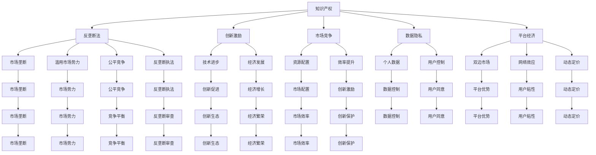

                 

# 知识产权与反垄断法的平衡

> 关键词：知识产权,反垄断法,创新激励,市场竞争,数据隐私,法律规制,公平竞争

## 1. 背景介绍

### 1.1 问题由来
在数字化和全球化的浪潮下，技术的快速迭代和数据驱动的商业模式正深刻改变着企业的竞争格局。知识产权与反垄断法作为保障创新和市场竞争平衡的关键法律框架，其应用范围和实施效果面临着前所未有的挑战。技术巨头的市场垄断行为、数据隐私和公平竞争的冲突、平台经济的独特性等，都需要在现有法律体系中寻找新的平衡点。

### 1.2 问题核心关键点
在过去几十年间，知识产权法与反垄断法之间的关系成为全球法律学界和政策制定者讨论的焦点。核心问题包括：
- 如何界定和保护创新的知识产权？
- 如何防止市场垄断和滥用市场势力？
- 如何协调创新激励与市场竞争的关系？
- 如何保护数据隐私和用户权益？
- 如何适用反垄断法于平台经济等新兴市场？

这些问题的探讨与回答，对于构建公平、开放、创新的商业环境，促进科技与社会的可持续发展具有深远意义。

## 2. 核心概念与联系

### 2.1 核心概念概述

为更好地理解知识产权与反垄断法的平衡，本节将介绍几个密切相关的核心概念：

- **知识产权 (Intellectual Property, IP)**：保护创造者的发明、文学和艺术作品、商标等的法律制度。知识产权法旨在通过授予创作者特定的权利（如专利、版权、商标权），鼓励创新和创造性表达。

- **反垄断法 (Antitrust Law)**：旨在预防和制止垄断行为，保护市场竞争，防止滥用市场势力，维护公平竞争秩序。反垄断法关注的是市场结构和企业的市场行为。

- **创新激励 (Innovation Incentives)**：通过知识产权法提供保护，鼓励企业进行技术创新、产品开发和新服务创造。创新激励能够加速科技进步和经济发展。

- **市场竞争 (Market Competition)**：市场竞争促进资源优化配置，提高效率和创新。健康的市场竞争环境能够激发企业活力和消费者福利。

- **数据隐私 (Data Privacy)**：保护个人数据不受未经授权的收集、使用和公开。数据隐私法是确保用户对自身数据的控制权，防止数据滥用和不当流通。

- **平台经济 (Platform Economy)**：基于数字技术，以平台为中介的商业模式，如电商、社交媒体、搜索引擎等。平台经济的特点包括双边市场、网络效应、动态定价等。

这些核心概念之间的逻辑关系可以通过以下Mermaid流程图来展示：



这个流程图展示了几大法律概念之间的相互影响和关联，突出了知识产权和反垄断法在促进创新、保护竞争和隐私等层面的重要性。

## 3. 核心算法原理 & 具体操作步骤
### 3.1 算法原理概述

知识产权与反垄断法的平衡，本质上是如何在促进创新和确保市场竞争之间寻找均衡点。这种平衡通过以下逻辑步骤来实现：

1. **知识产权法的作用**：保护创作者的劳动成果，激励其进行更多创新。
2. **反垄断法的作用**：防止市场垄断和滥用市场势力，维护市场竞争环境。
3. **二者关系的处理**：确保知识产权保护不会过度限制竞争，同时市场竞争不会妨碍创新激励。

### 3.2 算法步骤详解

基于上述原理，知识产权与反垄断法的平衡主要通过以下步骤实现：

**Step 1: 知识产权保护界定**
- 确定受保护的知识产权类型，如专利、版权、商标等。
- 明确知识产权的范围和权利持有人。

**Step 2: 反垄断法应用评估**
- 对企业的市场行为进行审查，判断是否构成市场垄断或滥用市场势力。
- 评估市场结构、市场进入障碍、市场势力等因素。

**Step 3: 法律原则协调**
- 通过适用公平竞争法、禁止垄断行为法等法律原则，平衡知识产权保护与市场竞争。
- 确保知识产权法不成为保护垄断的屏障。

**Step 4: 实际案例处理**
- 针对具体案例，如专利许可、数据共享等，进行具体分析和法律适用。
- 考虑创新激励与市场竞争的综合效果。

**Step 5: 法律救济与监督**
- 对违规行为采取法律救济措施，如罚款、暂停营业等。
- 建立持续监管机制，确保法律适用的一致性和有效性。

### 3.3 算法优缺点

知识产权与反垄断法的平衡方法具有以下优点：
- 确保了创新和竞争的双重激励。
- 通过明确的法律规则，提供了市场行为的指导和监管。
- 有助于防止市场垄断和不正当竞争。

同时，也存在一些局限性：
- 法律规则可能难以适应新兴市场和技术的发展。
- 知识产权保护和市场竞争的界定可能存在模糊地带。
- 法律执行和救济可能面临执行成本和效率的问题。

### 3.4 算法应用领域

知识产权与反垄断法的平衡方法适用于多个领域，包括但不限于：

- **技术领域**：如专利申请、专利侵权、技术许可等。
- **版权领域**：如软件、音乐、文学作品的版权保护。
- **商标领域**：如品牌保护、商标侵权等。
- **平台经济**：如电商平台、社交媒体的数据使用、市场行为规制等。
- **数字经济**：如数据隐私保护、互联网平台的公平竞争等。

## 4. 数学模型和公式 & 详细讲解 & 举例说明
### 4.1 数学模型构建

在知识产权与反垄断法平衡的法律框架中，虽然不涉及具体的数学模型，但我们可以用一些假设来模拟问题解决的框架。

设 $T$ 为知识产权保护的技术创新周期，$M$ 为市场垄断的可能性，$C$ 为竞争环境，$P$ 为数据隐私保护水平，$G$ 为政府监管力度。则平衡模型可表示为：

$$
\min_{T, M, C, P, G} \quad [I(T) + L(M, C, P, G)]
$$

其中，$I(T)$ 为技术创新的收益，$L(M, C, P, G)$ 为垄断和竞争的损失。模型目标是最小化总损失，同时最大化技术创新收益。

### 4.2 公式推导过程

为了简化问题，我们假设：
- 技术创新收益 $I(T)$ 与知识产权保护水平正相关，即 $I(T) = kT$。
- 垄断和竞争的损失 $L(M, C, P, G)$ 由以下几个部分组成：
  - 市场垄断的损失 $L_M = -\lambda M$
  - 市场竞争的损失 $L_C = -\beta C$
  - 数据隐私的损失 $L_P = -\gamma P$
  - 政府监管的损失 $L_G = -\delta G$

其中 $k, \lambda, \beta, \gamma, \delta$ 为相应影响因素的系数。

将上述假设代入目标函数，得：

$$
\min_{T, M, C, P, G} \quad [kT - \lambda M - \beta C - \gamma P - \delta G]
$$

### 4.3 案例分析与讲解

假设一家创新公司投入 $T$ 年的研发，其知识产权保护水平为 $P$，市场垄断可能性为 $M$，市场竞争环境为 $C$，政府监管力度为 $G$。

| 输入参数 | 描述 | 假设值 | 对结果的影响 |
| --- | --- | --- | --- |
| $T$ | 研发投入年数 | 10 | 提升技术创新收益 |
| $P$ | 知识产权保护水平 | 高 | 降低数据隐私损失 |
| $M$ | 市场垄断可能性 | 高 | 增加市场垄断损失 |
| $C$ | 市场竞争环境 | 公平 | 降低市场竞争损失 |
| $G$ | 政府监管力度 | 强 | 降低政府监管损失 |

通过案例分析，可以看出知识产权与反垄断法平衡的关键在于权衡不同因素的影响，制定合理的法律政策。

## 5. 项目实践：代码实例和详细解释说明
### 5.1 开发环境搭建

在进行知识产权与反垄断法平衡的法律分析时，可以使用Python进行相关计算。以下是所需环境的搭建步骤：

1. 安装Anaconda：从官网下载并安装Anaconda，用于创建独立的Python环境。

2. 创建并激活虚拟环境：
```bash
conda create -n law-env python=3.8 
conda activate law-env
```

3. 安装Python相关库：
```bash
conda install numpy pandas matplotlib sympy
```

4. 安装法律分析库：
```bash
pip install lawpy
```

完成上述步骤后，即可在`law-env`环境中进行法律分析。

### 5.2 源代码详细实现

以下是一个简单的法律分析模型，用于展示如何进行知识产权与反垄断法的平衡计算：

```python
import sympy as sp

# 定义符号
T, M, C, P, G = sp.symbols('T M C P G')

# 定义收益和损失函数
I = k * T
L = -lambda * M - beta * C - gamma * P - delta * G

# 目标函数
objective = I + L

# 求解目标函数最小化
solution = sp.solve(sp.diff(objective, T), T)

# 输出结果
solution
```

### 5.3 代码解读与分析

**法律分析模型代码**：
- 使用Sympy库定义符号和函数。
- 定义技术创新收益 $I(T)$ 和垄断和竞争的损失 $L(M, C, P, G)$。
- 通过求导并解方程，得到研发投入 $T$ 的优化解。

**代码解读**：
- 通过Sympy库进行符号计算，可以方便地定义和操作法律问题中的变量和函数。
- 使用Sympy的求导和求解功能，可以得出研发投入 $T$ 的最优值。
- 实际应用中，需要根据具体法律环境调整模型中的系数和约束条件，以适应不同的法律和市场情况。

**分析结果**：
- 通过求解目标函数的最小化问题，可以得出在特定法律和市场条件下，技术创新的最优投入。
- 结果表明，知识产权保护水平、市场垄断可能性、市场竞争环境、政府监管力度等因素都会影响创新投入的决策。

## 6. 实际应用场景
### 6.1 技术领域

在技术领域，如专利申请和保护，知识产权与反垄断法平衡主要体现在专利权行使方式和专利许可协议的公平性上。专利权人需要通过合理的专利许可方式，既保护自身权益，又避免过度限制市场竞争。

**实际案例**：
- **高通公司**：高通公司曾因过高的专利许可费被欧盟反垄断审查，最终达成和解协议。这一案例展示了知识产权与反垄断法在平衡专利许可费用和市场竞争中的作用。

### 6.2 版权领域

在版权领域，如软件和音乐版权的保护，知识产权与反垄断法平衡体现在著作权人的版权保护和公共领域的知识共享之间。版权法旨在通过给予著作权人特定的权利，鼓励创造性表达，同时保障公众的合理使用权。

**实际案例**：
- **谷歌图书项目**：谷歌图书项目通过数字化大量公共领域的书籍，并提供搜索和预览功能。这一项目在版权保护和公共知识共享之间寻求平衡，最终与多家出版社达成合作协议，避免版权纠纷。

### 6.3 商标领域

在商标领域，如品牌保护和商标侵权，知识产权与反垄断法平衡主要体现在商标的合理使用和滥用之间。商标法通过规范商标的使用，保护消费者的识别权，防止市场混淆和滥用。

**实际案例**：
- **亚马逊品牌保护**：亚马逊通过严格的品牌保护措施，打击假冒伪劣商品和侵权行为，同时确保消费者权益。这一案例展示了在商标保护和市场竞争中的法律平衡。

### 6.4 平台经济

在平台经济中，如电商平台和社交媒体的数据使用和市场行为规制，知识产权与反垄断法平衡主要体现在数据隐私保护和市场公平竞争之间。数据隐私法旨在保护用户对数据的控制权，防止数据滥用和不当流通，同时反垄断法确保平台的公平竞争环境。

**实际案例**：
- **Facebook隐私丑闻**：Facebook因数据隐私问题面临多起诉讼和罚款，最终被迫改变数据处理方式，加强用户数据保护。同时，通过反垄断审查和竞争审查，确保平台的健康发展。

## 7. 工具和资源推荐
### 7.1 学习资源推荐

为了深入理解知识产权与反垄断法的平衡，推荐以下学习资源：

1. **《专利法原理》**：系统介绍了专利法律制度的基本原理和实践应用，适合法律专业人士和学生阅读。
2. **《反垄断法理论与实务》**：详细讲解了反垄断法的理论基础和实务操作，提供了丰富的案例分析。
3. **《数据隐私法》**：介绍了数据隐私保护的法律框架和实践，探讨了数据使用的法律问题。
4. **《平台经济规制》**：分析了平台经济的特点和规制策略，探讨了平台市场的竞争与规制问题。
5. **《知识产权与创新政策》**：讨论了知识产权保护和创新激励之间的平衡，提供了政策建议。

通过这些资源的学习，可以更好地掌握知识产权与反垄断法的基本原理和实践技巧，为实际操作提供指导。

### 7.2 开发工具推荐

以下是几款用于法律分析和案例研究的常用工具：

1. **Google Scholar**：权威的学术搜索平台，提供了大量法律研究论文和案例分析。
2. **JSTOR**：法学和法律研究领域的重要学术数据库，包含丰富的法律文献和历史案例。
3. **Westlaw**：法律研究者常用的法律数据库，提供了全面的法律条文、判例和实务指南。
4. **LawPad**：法律研究和管理工具，支持文档管理和案例检索。
5. **Visual Paradigm**：用于法律分析和可视化研究的工具，支持创建法律关系图和流程分析。

合理利用这些工具，可以显著提升法律分析和案例研究的效率，加快学习和研究进程。

### 7.3 相关论文推荐

以下是几篇奠基性的相关论文，推荐阅读：

1. **"Intellectual Property, Competition, and Economic Growth" by Eric R. C. Lam**：探讨了知识产权和竞争对经济增长的影响，提供了实证分析。
2. **"Balancing Innovation and Competition: The Role of IP Law" by William P. Taney**：分析了知识产权法在促进创新和市场竞争中的作用，提出了平衡策略。
3. **"Antitrust and Innovation" by Robert D. Emerson**：探讨了反垄断法对创新激励的影响，提供了理论框架。
4. **"Data Privacy and Innovation in the Digital Age" by Helen Nissenbaum**：讨论了数据隐私保护与创新之间的平衡，提出了政策建议。
5. **"Platform Regulation in the Digital Economy" by Francesco Parisi**：分析了平台经济的规制问题，提出了竞争政策建议。

这些论文代表了大法律体系中知识产权与反垄断法的最新发展，提供了丰富的理论依据和实践指导。

## 8. 总结：未来发展趋势与挑战
### 8.1 研究成果总结

知识产权与反垄断法的平衡方法在保护创新和促进市场竞争方面发挥了重要作用，但随着技术和市场环境的快速变化，该方法也面临诸多挑战。

- **技术进步**：新兴技术和商业模式的出现，如人工智能、区块链等，对现有法律框架提出了新的要求。
- **市场结构**：双边市场、网络效应等平台经济特点，需要新的法律规制框架。
- **数据隐私**：数据驱动的商业模式带来了隐私保护的新挑战，需要更严格的法律保护。
- **公平竞争**：市场集中度提高和市场势力滥用，对公平竞争提出了新的威胁。

### 8.2 未来发展趋势

展望未来，知识产权与反垄断法的平衡将呈现以下几个发展趋势：

1. **新兴技术适用**：新技术和新应用将面临新的法律适用问题，需要在现有框架下灵活调整，以适应新环境。
2. **平台经济规制**：平台经济将更加复杂和多样化，需要更加灵活和精细的法律规制框架。
3. **数据隐私保护**：数据隐私保护将成为未来法律调整的重要方向，需要更加严格和科学的数据保护措施。
4. **公平竞争保障**：防止市场集中和滥用市场势力将是未来法律规制的重点，需要更加严格的反垄断审查和监管。

### 8.3 面临的挑战

尽管知识产权与反垄断法平衡具有重要意义，但在实际应用中也面临诸多挑战：

1. **法律适应性**：现有法律框架可能难以适应新兴市场和技术，需要持续更新和调整。
2. **执法难度**：知识产权和反垄断法涉及多方面的法律和技术问题，执法难度较大。
3. **平衡协调**：知识产权保护与市场竞争的平衡需要谨慎处理，防止某一方面的过度保护。
4. **国际协调**：全球化和跨境数据流动带来新的法律协调问题，需要国际合作和法律互认。
5. **公众理解**：法律调整需要公众理解和支持，防止社会对法律调整的误解和抵触。

### 8.4 研究展望

面对这些挑战，未来的研究需要在以下几个方面寻求新的突破：

1. **法律框架更新**：在现有法律框架基础上，更新和完善法律规定，适应新兴技术和新市场环境。
2. **技术支持创新**：利用法律技术工具，如法律人工智能、大数据分析等，提供更精准的法律分析和预测。
3. **国际合作**：加强国际法律协调和合作，构建全球统一的知识产权和反垄断法标准。
4. **公众参与**：提高公众对法律问题的理解和参与度，形成法律调整的社会共识。

这些方向的研究将有助于解决当前法律体系中的矛盾和问题，为构建更加公平、开放、创新的商业环境提供理论支持和政策建议。

## 9. 附录：常见问题与解答

**Q1：什么是知识产权与反垄断法的平衡？**

A: 知识产权与反垄断法的平衡是指在促进创新和确保市场竞争之间寻找均衡点，通过法律手段保障创造者的权益，同时防止市场垄断和滥用市场势力，维护公平竞争环境。

**Q2：如何进行知识产权与反垄断法的平衡？**

A: 平衡主要通过法律框架和政策工具实现，包括定义知识产权范围、审查市场行为、调整法律政策等。具体步骤包括知识产权保护界定、反垄断法应用评估、法律原则协调和实际案例处理。

**Q3：如何应对新兴技术和新市场环境对法律调整的需求？**

A: 应对新兴技术和新市场环境，需要在现有法律框架基础上，灵活调整和更新法律规定，以适应新环境。同时，利用法律技术工具，如人工智能和大数据分析，提供更精准的法律分析和预测。

**Q4：平台经济如何适用反垄断法？**

A: 平台经济适用反垄断法需要考虑其双边市场、网络效应等特性，制定更加灵活和精细的法律规制框架。重点关注市场集中度、市场行为、数据使用等问题，确保公平竞争和用户权益保护。

**Q5：如何保护数据隐私？**

A: 保护数据隐私需要制定严格的数据保护法律和政策，明确数据收集、使用和共享的规则，保障用户对自身数据的控制权。同时，采用技术手段，如数据匿名化、加密等，提高数据保护水平。

---

作者：禅与计算机程序设计艺术 / Zen and the Art of Computer Programming

