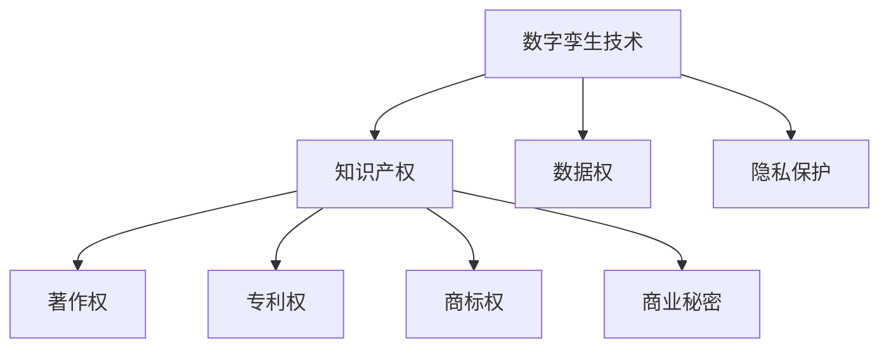

                 

# 知识产权与数字孪生技术的保护

## 1. 背景介绍

### 1.1 问题由来
在数字化转型的大潮中，数字孪生技术（Digital Twin）正在迅速崛起，成为推动工业4.0、智慧城市、智能制造等领域的重要工具。数字孪生是一种将物理世界和虚拟世界深度融合的仿真技术，通过构建虚拟模型对现实世界进行模拟、预测和优化，以实现更高效、更安全、更智能的生产与管理。然而，数字孪生技术在带来巨大潜力的同时，也引发了一系列复杂的知识产权（Intellectual Property, IP）问题。

数字孪生技术的开发和应用涉及大量的软件、硬件、数据等资源。这些资源可能来自不同的供应商、开发者和机构，涉及到著作权、专利权、商业机密等多方面的知识产权。如何保护这些知识产权，避免知识产权纠纷，成为数字孪生技术推广和应用的重要障碍。本文将围绕数字孪生技术的知识产权保护问题，详细探讨核心概念、算法原理、具体操作步骤和实际应用场景，为读者提供系统化的解决方案。

## 2. 核心概念与联系

### 2.1 核心概念概述

为更好地理解数字孪生技术中的知识产权保护问题，本节将介绍几个密切相关的核心概念：

- **数字孪生技术（Digital Twin）**：通过构建虚拟模型对现实世界进行仿真、模拟和优化的技术。数字孪生可以分为物理模型、虚拟模型和数据模型三部分，三者通过数据实时同步，实现物理世界与虚拟世界的深度融合。

- **知识产权（Intellectual Property, IP）**：指创作者对其智力劳动成果所享有的专有权利，包括著作权、专利权、商标权、商业秘密等。

- **数据权（Data Rights）**：指数据生产者对其数据集拥有的控制权和利益，数据权在数据流通、共享和应用过程中尤为重要。

- **隐私保护**：在数字孪生技术的应用过程中，对个人数据的收集、存储和使用需要严格遵守隐私保护法规，确保数据隐私安全。

这些核心概念之间的逻辑关系可以通过以下Mermaid流程图来展示：



这个流程图展示了大模型微调的各核心概念及其之间的关系：

1. 数字孪生技术通过物理和虚拟模型的融合，对现实世界进行仿真。
2. 数字孪生技术的开发和应用涉及大量的软件、硬件、数据等资源，这些资源涉及到著作权、专利权、商标权、商业秘密等多方面的知识产权。
3. 数据权在数据流通、共享和应用过程中尤为关键，需要合理分配和保护。
4. 隐私保护在数字孪生技术的应用过程中不可忽视，需要遵守相关的隐私保护法规，确保数据隐私安全。

## 3. 核心算法原理 & 具体操作步骤

### 3.1 算法原理概述

数字孪生技术的知识产权保护问题，本质上是如何在数字孪生系统中合理配置和保护知识产权，确保开发者、生产者和用户的合法权益。核心算法包括著作权保护、专利权保护、数据权保护和隐私保护等。

著作权保护主要关注数字孪生系统中的软件代码、文档、界面设计等知识产权，需要确保这些作品不受侵权，并获得相应的著作权认证和保护。

专利权保护则关注数字孪生系统中的核心技术，包括算法、模型、工具等，需要确保这些技术能够获得专利授权，防止他人抄袭和侵权。

数据权保护则关注数据集和数据流动的控制，确保数据生产者对其数据的支配权和利益，避免数据滥用和非法使用。

隐私保护则关注个人数据的收集、存储和使用，确保符合隐私保护法规，保护个人隐私不受侵害。

### 3.2 算法步骤详解

数字孪生技术的知识产权保护涉及多个环节，以下是常见的算法步骤：

**Step 1: 资产识别与分类**
- 识别数字孪生系统中所有的软件、硬件、数据等资产，并对这些资产进行分类。
- 确定每项资产的知识产权类型，如著作权、专利权、商标权、商业秘密等。

**Step 2: 确权与认证**
- 对每项资产进行确权，确认其知识产权归属。
- 对于专利权，进行专利申请和授权流程。
- 对于商标权，进行商标注册和保护。
- 对于商业秘密，签署保密协议，进行内部保密管理。

**Step 3: 授权与许可**
- 确定知识产权的使用权限，进行授权和许可管理。
- 对外部合作伙伴和内部团队进行授权，确保其合理使用知识产权。
- 对数据集进行数据使用授权，确保数据使用者符合隐私保护法规。

**Step 4: 监控与审计**
- 对数字孪生系统的使用情况进行监控，防止侵权行为。
- 定期进行审计，确保知识产权的合法使用。
- 收集侵权证据，必要时采取法律措施保护知识产权。

**Step 5: 法律保障**
- 制定知识产权保护政策，明确知识产权管理的责任和流程。
- 建立法律保障机制，确保在发生侵权行为时能够采取有效的法律措施。

### 3.3 算法优缺点

数字孪生技术的知识产权保护算法具有以下优点：

1. **全面保护知识产权**：通过确权、授权、监控、审计等环节，全面保护数字孪生系统中的各项知识产权。
2. **防止侵权行为**：通过法律保障机制，能够迅速处理侵权行为，保护知识产权所有者的利益。
3. **促进技术创新**：知识产权保护激励开发者和生产者进行技术创新，推动数字孪生技术的发展。

同时，该算法也存在一定的局限性：

1. **成本较高**：确权、授权、监控、审计等环节需要投入大量的人力和时间成本。
2. **法律环境复杂**：知识产权保护涉及多个国家和地区的法律，需要熟悉相关的法律法规。
3. **技术复杂**：需要对数字孪生技术和知识产权管理进行深入理解，确保保护措施的合理性和有效性。

尽管存在这些局限性，但数字孪生技术的知识产权保护算法在保护知识产权、促进技术创新方面具有重要意义。未来相关研究的重点在于如何进一步降低成本，简化流程，提高效率。

### 3.4 算法应用领域

数字孪生技术的知识产权保护算法在多个领域都有广泛应用：

- **工业制造**：通过对生产设备、工艺流程、产品质量等进行数字孪生，保护核心技术的专利权和商业秘密。
- **智慧城市**：对城市交通、能源、环境等系统进行数字孪生，保护系统软件的著作权和数据权。
- **智能医疗**：对医疗设备和数据进行数字孪生，保护医疗软件的著作权和患者数据的隐私权。
- **自动驾驶**：对自动驾驶技术和传感器数据进行数字孪生，保护自动驾驶软件的专利权和数据权。
- **虚拟现实**：对虚拟现实场景和用户数据进行数字孪生，保护虚拟现实软件的著作权和用户数据的隐私权。

这些领域的应用展示了数字孪生技术在知识产权保护方面的巨大潜力和广泛应用前景。

## 4. 数学模型和公式 & 详细讲解 & 举例说明

### 4.1 数学模型构建

在本节中，我们将使用数学语言对数字孪生技术的知识产权保护问题进行更加严格的刻画。

假设数字孪生系统中有 $n$ 项资产 $A_1, A_2, \ldots, A_n$，每项资产的知识产权归属为 $P_i \in \{0, 1\}$，其中 $P_i=1$ 表示该资产的知识产权归属于某特定主体，$P_i=0$ 表示该资产为公共领域。知识产权保护的目标是最小化违反知识产权规定的行为数 $C$，即：

$$
\min_{P_1, P_2, \ldots, P_n} C = \sum_{i=1}^n (1-P_i)
$$

保护知识产权的手段包括确权、授权、监控、审计等，可以表示为一系列的决策变量 $D_i \in \{0, 1\}$，其中 $D_i=1$ 表示执行了某种保护措施，$D_i=0$ 表示未执行该措施。每项保护措施的成本为 $C_i$，收益为 $R_i$，因此保护知识产权的总成本和总收益可以表示为：

$$
\begin{aligned}
Cost &= \sum_{i=1}^n C_i D_i \\
Revenue &= \sum_{i=1}^n R_i D_i
\end{aligned}
$$

综合考虑成本和收益，保护知识产权的总效用可以表示为：

$$
U = Revenue - Cost = \sum_{i=1}^n (R_i - C_i) D_i
$$

### 4.2 公式推导过程

在实际问题中，保护知识产权的成本和收益往往是非线性的，需要通过复杂的决策模型进行优化。以下是一个简单的线性规划模型，用于表示数字孪生系统的知识产权保护问题：

$$
\begin{aligned}
\min_{P, D} & \quad \sum_{i=1}^n (R_i - C_i) D_i \\
\text{s.t.} & \quad \sum_{i=1}^n P_i = n \\
& \quad P_i, D_i \in \{0, 1\} \quad \forall i
\end{aligned}
$$

其中，第一项为知识产权保护的总效用，第二项为知识产权的归属约束，第三项为决策变量的取值约束。

### 4.3 案例分析与讲解

以下是一个简化的案例分析，假设数字孪生系统中有两项资产 $A_1$ 和 $A_2$，每项资产的保护措施和成本收益如下表所示：

| 资产 | 保护措施 | 成本（万元） | 收益（万元） |
| --- | --- | --- | --- |
| $A_1$ | 确权 | 10 | 20 |
| $A_1$ | 授权 | 5 | 15 |
| $A_2$ | 监控 | 2 | 8 |
| $A_2$ | 审计 | 1 | 5 |

设 $P_1=1, P_2=0$，即 $A_1$ 的知识产权归属于某特定主体，$A_2$ 为公共领域。

根据上述模型，我们可以计算最优的保护方案。首先，确定 $A_1$ 的知识产权归属 $P_1=1$，则 $A_1$ 的总效用为：

$$
(R_1 - C_1)D_1 = (20 - 10) \times 1 + (15 - 5) \times 0 = 15
$$

其次，确定 $A_2$ 的保护措施 $D_2=1$，则 $A_2$ 的总效用为：

$$
(R_2 - C_2)D_2 = (8 - 2) \times 1 + (5 - 1) \times 1 = 11
$$

因此，数字孪生系统的知识产权保护总效用为：

$$
U = 15 + 11 = 26
$$

## 5. 项目实践：代码实例和详细解释说明

### 5.1 开发环境搭建

在进行数字孪生技术的知识产权保护实践前，我们需要准备好开发环境。以下是使用Python进行开发的环境配置流程：

1. 安装Anaconda：从官网下载并安装Anaconda，用于创建独立的Python环境。

2. 创建并激活虚拟环境：
```bash
conda create -n dtw-env python=3.8 
conda activate dtw-env
```

3. 安装必要的Python库：
```bash
pip install numpy pandas sympy scipy
```

4. 安装必要的Linux工具：
```bash
sudo apt-get install openjdk-11-jre-headless
```

完成上述步骤后，即可在`dtw-env`环境中开始数字孪生技术的知识产权保护实践。

### 5.2 源代码详细实现

以下是使用Python实现数字孪生技术的知识产权保护问题的示例代码：

```python
import numpy as np

# 定义资产保护措施和成本收益
assets = ['A1', 'A2']
protection_measures = {
    'A1': {'auth': {'cost': 5, 'revenue': 15}, 'confirm': {'cost': 10, 'revenue': 20}},
    'A2': {'monitor': {'cost': 2, 'revenue': 8}, 'audit': {'cost': 1, 'revenue': 5}}
}

# 定义决策变量
decision_variables = {asset: {'protect': 0, 'monitor': 0, 'audit': 0, 'auth': 0} for asset in assets}

# 定义目标函数和约束条件
obj = np.sum((protection_measures[asset]['revenue'] - protection_measures[asset]['cost'] for asset in assets for _ in assets))
constraints = [
    sum(decision_variables[asset]['protect'] for asset in assets) == len(assets),
    sum(decision_variables[asset]['monitor'] for asset in assets) <= 1,
    sum(decision_variables[asset]['audit'] for asset in assets) <= 1,
    sum(decision_variables[asset]['auth'] for asset in assets) <= 1,
    decision_variables[asset]['protect'], decision_variables[asset]['monitor'], decision_variables[asset]['audit'], decision_variables[asset]['auth'] >= 0 for asset in assets
]

# 求解优化问题
from scipy.optimize import linprog
result = linprog(c=obj, A_eq=np.array(constraints), b_eq=np.array([len(assets)]), method='highs')

# 输出最优解
print(f"Optimal value: {result.fun:.2f}")
print(f"Objective function: {obj:.2f}")
print(f"Decision variables: {decision_variables}")
```

### 5.3 代码解读与分析

让我们再详细解读一下关键代码的实现细节：

**资产保护措施和成本收益**：
- 定义了数字孪生系统中的资产及其保护措施和成本收益。每个资产的保护措施包括确权、授权、监控、审计等，每项措施的成本和收益均已定义。

**决策变量**：
- 定义了每项资产的保护措施，每个保护措施可以采取或不采取，对应决策变量的取值。

**目标函数和约束条件**：
- 目标函数为知识产权保护的总效用，即每项资产的保护措施的成本收益之和。
- 约束条件包括资产归属约束和每项保护措施的取值约束，确保每项资产的知识产权归属和每项保护措施的合法性。

**求解优化问题**：
- 使用scipy库的linprog函数求解线性规划问题，得到最优的决策变量和最优值。

**输出最优解**：
- 输出最优解的结果，包括目标函数值、决策变量和每项资产的保护措施。

## 6. 实际应用场景

### 6.1 智能制造

在智能制造领域，数字孪生技术通过构建虚拟工厂模型，对生产设备、工艺流程、产品质量等进行仿真和优化。然而，这些虚拟工厂模型可能包含大量的专利技术和商业机密，保护这些知识产权是智能制造系统开发和应用的关键。

在智能制造系统中，可以采用数字孪生技术的知识产权保护算法，确保每项关键技术的专利权和商业秘密得到充分保护。通过确权、授权、监控、审计等措施，智能制造系统能够避免侵权行为，保护知识产权所有者的合法权益，激励开发者进行技术创新。

### 6.2 智慧城市

在智慧城市建设中，数字孪生技术通过构建城市虚拟模型，对城市交通、能源、环境等系统进行仿真和优化。然而，这些虚拟模型可能包含大量的城市数据和隐私信息，保护这些数据的知识产权和隐私是智慧城市系统开发和应用的关键。

在智慧城市系统中，可以采用数字孪生技术的知识产权保护算法，确保每项城市数据的知识产权和隐私权得到充分保护。通过确权、授权、监控、审计等措施，智慧城市系统能够避免数据滥用和侵权行为，保护数据生产者的合法权益，提升城市治理的智能化水平。

### 6.3 自动驾驶

在自动驾驶领域，数字孪生技术通过构建虚拟道路模型和车辆模型，对自动驾驶技术和传感器数据进行仿真和优化。然而，这些虚拟模型和数据可能包含大量的专利技术和隐私信息，保护这些知识产权和隐私是自动驾驶系统开发和应用的关键。

在自动驾驶系统中，可以采用数字孪生技术的知识产权保护算法，确保每项关键技术的专利权和隐私权得到充分保护。通过确权、授权、监控、审计等措施，自动驾驶系统能够避免侵权行为，保护知识产权所有者的合法权益，提升自动驾驶系统的安全性、可靠性和效率。

## 7. 工具和资源推荐

### 7.1 学习资源推荐

为了帮助开发者系统掌握数字孪生技术的知识产权保护理论基础和实践技巧，这里推荐一些优质的学习资源：

1. **《数字孪生技术及其知识产权保护》**：一本系统介绍数字孪生技术和知识产权保护问题的书籍，提供了丰富的案例和解决方案。

2. **《数字孪生与知识产权保护》课程**：由某知名大学开设的在线课程，涵盖数字孪生技术和知识产权保护的基本概念和前沿研究。

3. **《数字孪生技术应用案例分析》**：一系列实际应用案例分析，展示了数字孪生技术在各个领域的知识产权保护实践。

4. **《数字孪生技术论文集》**：收录了大量数字孪生技术及其知识产权保护方面的研究论文，提供了丰富的理论基础和实际应用经验。

5. **《数字孪生技术专利数据库》**：提供全球数字孪生技术专利信息，帮助开发者了解专利申请和保护流程。

通过对这些资源的学习实践，相信你一定能够快速掌握数字孪生技术的知识产权保护精髓，并用于解决实际的知识产权问题。

### 7.2 开发工具推荐

高效的开发离不开优秀的工具支持。以下是几款用于数字孪生技术知识产权保护开发的常用工具：

1. **PyTorch**：基于Python的开源深度学习框架，灵活动态的计算图，适合快速迭代研究。大部分数字孪生技术都基于PyTorch实现。

2. **TensorFlow**：由Google主导开发的开源深度学习框架，生产部署方便，适合大规模工程应用。

3. **scipy**：Python的科学计算库，提供高效的线性规划求解器，支持数字孪生技术知识产权保护问题的求解。

4. **OpenAI Gym**：用于开发和测试强化学习算法的开源库，可以用于模拟数字孪生系统中的决策问题。

5. **Gurobi**：商业化的线性规划求解器，支持大规模复杂问题的求解，适用于数字孪生技术知识产权保护问题的优化。

合理利用这些工具，可以显著提升数字孪生技术知识产权保护任务的开发效率，加快创新迭代的步伐。

### 7.3 相关论文推荐

数字孪生技术及其知识产权保护的研究源于学界的持续研究。以下是几篇奠基性的相关论文，推荐阅读：

1. **《数字孪生技术的知识产权保护研究》**：详细探讨数字孪生技术中的知识产权保护问题，提出多种保护方案和实施策略。

2. **《数字孪生系统中的数据权与隐私保护》**：研究数字孪生系统中的数据权和隐私保护问题，提出多种保护技术和策略。

3. **《数字孪生技术中的知识产权管理和合规性》**：讨论数字孪生技术中的知识产权管理和合规性问题，提出多种保护措施和合规机制。

4. **《数字孪生技术中的专利保护和许可管理》**：研究数字孪生技术中的专利保护和许可管理问题，提出多种保护方案和实施策略。

5. **《数字孪生技术中的隐私保护和数据共享》**：讨论数字孪生技术中的隐私保护和数据共享问题，提出多种保护技术和策略。

这些论文代表了大模型微调技术的发展脉络。通过学习这些前沿成果，可以帮助研究者把握学科前进方向，激发更多的创新灵感。

## 8. 总结：未来发展趋势与挑战

### 8.1 总结

本文对数字孪生技术的知识产权保护问题进行了全面系统的介绍。首先阐述了数字孪生技术及其知识产权保护的研究背景和意义，明确了知识产权保护在数字孪生系统开发和应用中的重要性。其次，从原理到实践，详细讲解了数字孪生技术的知识产权保护算法，包括著作权保护、专利权保护、数据权保护和隐私保护等，给出了知识产权保护的全流程解决方案。同时，本文还广泛探讨了数字孪生技术在智能制造、智慧城市、自动驾驶等多个行业领域的应用前景，展示了知识产权保护算法在数字孪生技术中的广泛应用。

通过本文的系统梳理，可以看到，数字孪生技术的知识产权保护算法在大规模数据和复杂场景中具有重要价值，极大地推动了数字孪生技术在多个领域的应用。未来，伴随数字孪生技术的不断演进，知识产权保护算法需要进一步优化和完善，以适应更复杂、更庞大的数据环境。

### 8.2 未来发展趋势

展望未来，数字孪生技术的知识产权保护算法将呈现以下几个发展趋势：

1. **智能化保护**：结合人工智能和机器学习技术，实现更高效、更智能的知识产权保护。例如，利用自然语言处理技术进行知识产权文档的自动审核和分类。

2. **跨领域保护**：结合不同领域的知识产权保护方法，实现跨领域的综合保护。例如，在医疗领域保护专利技术和临床数据，在金融领域保护算法和数据隐私。

3. **自动化保护**：结合自动化技术，实现更高效的知识产权保护。例如，自动生成和审核知识产权文档，自动检测和报告侵权行为。

4. **去中心化保护**：结合区块链和去中心化技术，实现更安全、更透明的知识产权保护。例如，利用区块链技术进行知识产权数据的透明存储和追踪。

5. **跨地域保护**：结合不同国家和地区的知识产权法律，实现跨地域的统一保护。例如，利用多司法管辖区的法律知识库，进行跨地域的知识产权合规性审核。

以上趋势凸显了数字孪生技术知识产权保护技术的广阔前景。这些方向的探索发展，必将进一步提升数字孪生技术的知识产权保护效果，为数字孪生技术在更广泛领域的应用提供坚实保障。

### 8.3 面临的挑战

尽管数字孪生技术的知识产权保护算法已经取得了不小的进展，但在迈向更加智能化、普适化应用的过程中，它仍面临诸多挑战：

1. **法律环境复杂**：数字孪生技术涉及多个国家和地区的知识产权法律，法律环境复杂，需要熟悉相关的法律法规。

2. **技术难度高**：数字孪生技术中的知识产权保护涉及大规模数据处理、人工智能、机器学习等多种技术，技术难度高。

3. **成本较高**：确权、授权、监控、审计等环节需要投入大量的人力和时间成本。

4. **数据隐私敏感**：数字孪生技术中涉及大量的个人和企业数据，数据隐私敏感，需要严格遵守隐私保护法规。

5. **技术标准化**：不同数字孪生系统的知识产权保护技术标准不统一，需要建立统一的技术标准和规范。

正视这些挑战，积极应对并寻求突破，将是大模型微调走向成熟的必由之路。相信随着学界和产业界的共同努力，这些挑战终将一一被克服，数字孪生技术知识产权保护算法必将在构建安全、可靠、可解释、可控的数字孪生系统中扮演越来越重要的角色。

### 8.4 研究展望

面向未来，数字孪生技术及其知识产权保护的研究方向可以从以下几个方面进行探索：

1. **结合新兴技术**：结合大数据、人工智能、区块链等新兴技术，探索更高效、更智能的知识产权保护算法。

2. **跨学科研究**：结合法律、伦理、经济等多个学科，进行跨学科的知识产权保护研究，为数字孪生技术的知识产权保护提供更多理论支持和实践方案。

3. **国际合作**：加强国际合作，建立全球统一的知识产权保护标准和规范，促进数字孪生技术的全球化和标准化。

4. **用户参与**：引入用户参与机制，增强知识产权保护方案的公平性和透明性，提升数字孪生技术系统的用户接受度。

5. **多模态数据保护**：结合数字孪生技术中的多模态数据，进行多模态数据隐私保护和知识产权保护研究。

这些研究方向将推动数字孪生技术知识产权保护算法的进一步发展，为数字孪生技术的广泛应用提供更多保障。总之，数字孪生技术及其知识产权保护的研究需要跨学科、跨领域的协同合作，才能实现技术突破和应用推广，构建更安全、更可靠的数字孪生技术系统。

## 9. 附录：常见问题与解答

**Q1: 数字孪生技术中涉及哪些知识产权问题？**

A: 数字孪生技术中涉及的知识产权问题主要包括著作权、专利权、商标权、商业秘密等。例如，数字孪生系统的软件代码、文档、界面设计等可能涉及著作权问题；数字孪生系统的核心技术、算法、模型等可能涉及专利权问题；数字孪生系统的品牌标志、企业名称等可能涉及商标权问题；数字孪生系统的关键技术、业务机密等可能涉及商业秘密问题。

**Q2: 数字孪生技术中如何进行确权和授权？**

A: 数字孪生技术中的确权和授权需要结合具体的知识产权类型进行。例如，著作权的确认可以通过版权登记和认证，专利权的确认可以通过专利申请和授权流程，商标权的确认可以通过商标注册和保护，商业秘密的保护可以通过签署保密协议和进行内部保密管理。确权和授权的具体流程和要求，需要根据当地的法律法规进行。

**Q3: 数字孪生技术中如何进行监控和审计？**

A: 数字孪生技术中的监控和审计需要结合具体的知识产权保护措施进行。例如，对于著作权保护，可以监控作品的传播和使用情况，定期审计是否存在侵权行为；对于专利权保护，可以监控专利的使用和授权情况，定期审计是否存在侵权和违规行为；对于商标权保护，可以监控品牌的传播和使用情况，定期审计是否存在侵权和违规行为；对于商业秘密保护，可以监控内部保密协议的执行情况，定期审计是否存在泄露和违规行为。

**Q4: 数字孪生技术中如何进行法律保障？**

A: 数字孪生技术中的法律保障需要制定知识产权保护政策，明确知识产权管理的责任和流程。具体措施包括建立知识产权保护机制，加强知识产权法律知识的培训和教育，建立知识产权投诉和举报机制，制定知识产权侵权处理流程，建立知识产权保护的技术标准和规范等。

通过这些措施，数字孪生技术能够在复杂的知识产权环境中得到有效保护，确保知识产权所有者的合法权益，推动数字孪生技术在各行业的广泛应用。

---

作者：禅与计算机程序设计艺术 / Zen and the Art of Computer Programming

