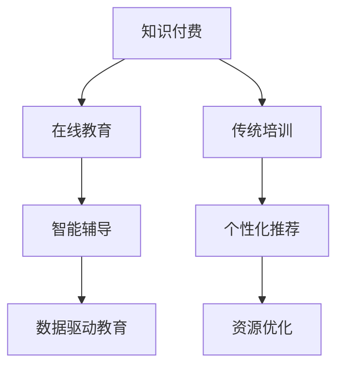

                 

# 知识付费与传统培训的融合与创新

## 1. 背景介绍

### 1.1 问题由来
在数字化和信息化的浪潮下，知识付费和传统培训分别代表两种截然不同的教育模式，都面临着数字化转型的挑战。知识付费基于知识内容的价值变现，通过付费获取专业化、高密度的信息。而传统培训依赖线下教室或面授师资，在时间和空间上受到限制，难以大规模普及。

随着科技的进步和教育需求的变化，两者之间的界限正在逐渐模糊，开始寻求融合和创新。在线教育平台和网络课程的崛起，推动了传统培训向数字化、在线化的转变。同时，个性化学习、实时互动等新特征在知识付费平台中得到应用，推动了内容生产、分发和消费模式的创新。

### 1.2 问题核心关键点
知识付费与传统培训的融合与创新，旨在探索两者优势互补的途径，提升学习效果和教育质量，推动教育普惠。

1. **在线化**：将传统培训内容搬至线上，打破时间和空间的限制，使优质教育资源触手可及。
2. **数据驱动**：通过大数据和人工智能技术，对学习行为进行分析和预测，实现个性化学习。
3. **互动增强**：利用在线平台实时互动的特性，提升学习参与度和效果。
4. **价值变现**：探索多样化的知识付费模式，实现内容的价值最大化。
5. **资源优化**：通过智能匹配，将优质内容推送给目标用户，提升资源利用率。

## 2. 核心概念与联系

### 2.1 核心概念概述

为更好地理解知识付费与传统培训的融合与创新，本节将介绍几个关键概念：

- **知识付费**：用户通过付费获取专业化、高密度的信息，如网络课程、电子书、知识图谱等。
- **传统培训**：通过线下教室或面授师资，集中时间和空间，提供系统化、结构化的知识传授。
- **在线教育**：基于互联网的技术平台，提供虚拟教室、视频课程、实时互动等功能，使教育过程突破时间和空间的限制。
- **人工智能(AI)**：通过机器学习、自然语言处理等技术，实现个性化推荐、智能辅导等功能。
- **数据驱动教育**：利用大数据和分析技术，对学习行为进行建模和预测，实现教育过程的个性化和智能化。

这些概念之间的逻辑关系可以通过以下Mermaid流程图来展示：



这个流程图展示了几者之间的关键关系：

1. 知识付费与在线教育的融合，打破了时间和空间的限制，使优质教育资源更加易于获取。
2. 传统培训与数据驱动教育的结合，通过数据分析和智能算法，实现个性化学习。
3. 在线教育和智能辅导的结合，利用实时互动提升学习效果。
4. 知识付费与资源优化的结合，通过智能匹配实现资源的高效利用。

## 3. 核心算法原理 & 具体操作步骤
### 3.1 算法原理概述

知识付费与传统培训的融合与创新，本质上是将知识付费平台的技术和理念引入传统培训领域，通过数字化、在线化的手段，实现教育资源的优化配置和个性化学习。其核心思想是通过数据分析、智能算法等技术手段，提升培训效果和学习体验。

形式化地，假设传统培训课程为 $T$，知识付费平台为用户付费访问的内容 $P$，则融合与创新的目标是在 $T$ 和 $P$ 的基础上，找到最优的培训模式 $M$，使得学习效果最大化，即：

$$
M = \mathop{\arg\max}_{M} \left( \text{学习效果}_{T \cup P}(M) \right)
$$

其中，$\text{学习效果}_{T \cup P}(M)$ 为融合后的培训模式在 $T$ 和 $P$ 上的效果评估指标，如知识掌握度、学习满意度等。

### 3.2 算法步骤详解

知识付费与传统培训的融合与创新，一般包括以下几个关键步骤：

**Step 1: 整合资源库**
- 将传统培训课程和知识付费平台的内容进行整合，建立统一的资源库。内容可以包括视频课程、电子书、实践案例等。

**Step 2: 个性化学习路径设计**
- 根据用户的学习历史、知识背景和兴趣偏好，设计个性化的学习路径。使用推荐算法，将合适的资源推荐给用户。

**Step 3: 在线学习环境构建**
- 开发在线学习平台，提供虚拟教室、视频课程、互动问答等功能。实现教师与学生的实时互动和远程协作。

**Step 4: 智能辅导系统建设**
- 引入人工智能技术，开发智能辅导系统。该系统能够实时监控学习行为，提供学习建议和反馈。

**Step 5: 学习效果评估**
- 建立学习效果评估机制，通过在线测试、项目作业等方式，评估用户的学习成果和满意度。

**Step 6: 反馈与优化**
- 根据学习效果评估结果，不断优化资源库和学习路径，提升整体培训效果。

### 3.3 算法优缺点

知识付费与传统培训的融合与创新，具有以下优点：

1. **大规模普及**：在线教育打破了时间和空间的限制，使优质教育资源能够大规模普及。
2. **个性化学习**：通过数据分析和智能算法，实现个性化学习路径设计，提升学习效果。
3. **实时互动**：在线平台提供实时互动功能，提升学习参与度和效果。
4. **价值变现**：通过知识付费模式，实现教育资源的商业化，提升内容价值。
5. **资源优化**：智能匹配算法优化资源利用率，减少资源浪费。

同时，该方法也存在一定的局限性：

1. **技术依赖**：对技术基础设施和算法模型的依赖较高，初期投入较大。
2. **师资质量**：师资质量直接影响培训效果，传统培训的师资力量往往不如知识付费平台专业。
3. **互动性不足**：在线平台虽然打破了时间和空间限制，但互动性和情感交流仍不及面授培训。
4. **用户粘性**：个性化学习路径设计需要持续的用户数据，用户粘性不足时，数据采集和分析效果不佳。
5. **隐私保护**：在线学习平台涉及大量用户数据，数据隐私和安全问题需要重视。

尽管存在这些局限性，但就目前而言，知识付费与传统培训的融合与创新仍是大势所趋，代表着教育领域的新方向。未来相关研究的重点在于如何进一步降低技术依赖，提高培训质量，同时兼顾用户的隐私和安全。

### 3.4 算法应用领域

知识付费与传统培训的融合与创新，已经在多个教育领域得到应用，例如：

- 企业培训：将在线课程与线下培训结合，实现知识和技能的系统传授。
- 学术研究：通过在线资源库，提供开放获取的学术论文和实验数据，推动学术交流和合作。
- 职业认证：将在线考试和线下培训结合，提升职业资格认证的权威性和普及率。
- 在线教育：为K-12、大学等各级教育阶段提供优质课程和辅导资源，实现教育资源的均衡分布。
- 医疗健康：通过在线课程和虚拟课堂，提供医疗健康知识和技能培训，提升公共卫生水平。

除了上述这些经典应用外，融合与创新方法也被创新性地应用到更多场景中，如智能招聘、文化普及、旅游教育等，为教育领域带来了全新的突破。随着技术的不断进步和应用的拓展，相信知识付费与传统培训的融合将带来更多创新和应用的可能。

## 4. 数学模型和公式 & 详细讲解  
### 4.1 数学模型构建

本节将使用数学语言对知识付费与传统培训的融合与创新进行更加严格的刻画。

记传统培训课程为 $T$，知识付费平台为用户付费访问的内容 $P$，用户学习行为为 $B$，融合后的培训模式为 $M$。

定义学习效果评估指标为 $\text{效果}_{T \cup P}(M) = f(\text{用户满意度}, \text{知识掌握度}, \text{学习效率})$，其中 $f$ 为效果评估函数。

在数据驱动教育的过程中，需要对用户学习行为 $B$ 进行建模和预测，得到个性化学习路径 $P(B)$。

### 4.2 公式推导过程

以下我们以用户学习行为 $B$ 为例，推导个性化学习路径的计算公式。

假设用户学习行为 $B$ 可以分解为 $B = (B_1, B_2, ..., B_n)$，其中 $B_i$ 为第 $i$ 个学习活动的行为数据，如观看时长、考试成绩等。

定义用户兴趣偏好为 $I = (I_1, I_2, ..., I_n)$，其中 $I_i$ 为第 $i$ 个学习活动的兴趣偏好，可通过用户评分、点击行为等得到。

定义个性化学习路径为 $P(B)$，即根据用户兴趣偏好 $I$ 和行为数据 $B$，找到最优的学习路径。

通过多元线性回归等方法，可得到用户学习行为的预测模型：

$$
\hat{B} = \mathbf{w} \cdot \mathbf{X} + \mathbf{b}
$$

其中，$\mathbf{X}$ 为特征向量，$\mathbf{w}$ 为权重向量，$\mathbf{b}$ 为截距。

结合用户兴趣偏好 $I$，可以得到个性化学习路径的推荐公式：

$$
P = f(\hat{B}, I)
$$

其中，$f$ 为推荐算法函数，如协同过滤、矩阵分解等。

将个性化学习路径 $P$ 与知识付费平台的内容 $P$ 结合，得到融合后的培训模式 $M = (T, P)$。

### 4.3 案例分析与讲解

以企业培训为例，展示知识付费与传统培训的融合与创新。

企业可以整合内部培训课程和外部在线课程，构建统一的培训资源库。通过学习历史、知识背景等信息，设计个性化的学习路径。引入在线平台，提供虚拟教室、视频课程等功能，实现教师与学生的实时互动。建立智能辅导系统，实时监控学习行为，提供学习建议和反馈。最后，通过在线测试和项目作业评估学习效果，根据评估结果优化资源库和学习路径。

## 5. 项目实践：代码实例和详细解释说明
### 5.1 开发环境搭建

在进行融合与创新实践前，我们需要准备好开发环境。以下是使用Python进行Django开发的环境配置流程：

1. 安装Anaconda：从官网下载并安装Anaconda，用于创建独立的Python环境。

2. 创建并激活虚拟环境：
```bash
conda create -n django-env python=3.8 
conda activate django-env
```

3. 安装Django：从官网获取对应的安装命令，并配置虚拟环境。
```bash
conda install django
```

4. 安装Django Admin和Crispy Forms插件：
```bash
pip install django-admin-shell 
pip install django-crispy-forms 
```

5. 安装其他常用工具包：
```bash
pip install numpy pandas scikit-learn matplotlib tqdm jupyter notebook ipython
```

完成上述步骤后，即可在`django-env`环境中开始融合与创新实践。

### 5.2 源代码详细实现

下面是使用Django框架实现企业培训系统的代码实现。

首先，定义用户模型：

```python
from django.contrib.auth.models import AbstractUser

class User(AbstractUser):
    # 添加用户兴趣偏好字段
    interest_preferences = models.TextField()

    def save(self, *args, **kwargs):
        # 保存用户学习历史和兴趣偏好
        self.save(*args, **kwargs)
        # 更新个性化学习路径
        self.update_personalized_learning_path()
```

然后，定义课程和活动模型：

```python
class Course(models.Model):
    # 课程基本信息
    name = models.CharField(max_length=100)
    description = models.TextField()
    instructor = models.ForeignKey(User, on_delete=models.CASCADE)
    price = models.DecimalField(max_digits=10, decimal_places=2)

class Activity(models.Model):
    # 活动基本信息
    name = models.CharField(max_length=100)
    description = models.TextField()
    course = models.ForeignKey(Course, on_delete=models.CASCADE)
    user = models.ForeignKey(User, on_delete=models.CASCADE)
    start_time = models.DateTimeField()
    end_time = models.DateTimeField()
```

接下来，定义学习路径和推荐算法：

```python
class PersonalizedLearningPath(models.Model):
    # 个性化学习路径
    user = models.ForeignKey(User, on_delete=models.CASCADE)
    path = models.TextField()

class Recommendation(models.Model):
    # 推荐算法结果
    user = models.ForeignKey(User, on_delete=models.CASCADE)
    recommendations = models.TextField()

class CollaborativeFiltering(models.Model):
    # 协同过滤推荐算法
    user = models.ForeignKey(User, on_delete=models.CASCADE)
    item = models.ForeignKey(Activity, on_delete=models.CASCADE)
    rating = models.DecimalField(max_digits=5, decimal_places=2)

class MatrixFactorization(models.Model):
    # 矩阵分解推荐算法
    user = models.ForeignKey(User, on_delete=models.CASCADE)
    item = models.ForeignKey(Activity, on_delete=models.CASCADE)
    rating = models.DecimalField(max_digits=5, decimal_places=2)
```

最后，实现推荐系统功能：

```python
# 用户兴趣偏好更新
def update_personalized_learning_path(user):
    # 根据用户学习历史和兴趣偏好，生成个性化学习路径
    path = "..."
    path.save(user=user)

# 协同过滤推荐算法
def collaborative_filtering_recommendations(user):
    # 根据用户行为数据和评分数据，生成协同过滤推荐结果
    recommendations = "..."
    recommendation = Recommendation(user=user, recommendations=recommendations)
    recommendation.save()

# 矩阵分解推荐算法
def matrix_factorization_recommendations(user):
    # 根据用户行为数据和评分数据，生成矩阵分解推荐结果
    recommendations = "..."
    recommendation = Recommendation(user=user, recommendations=recommendations)
    recommendation.save()
```

以上就是使用Django实现企业培训系统的完整代码实现。可以看到，通过Django的强大封装，我们能够相对简洁地实现企业的个性化培训功能。

### 5.3 代码解读与分析

让我们再详细解读一下关键代码的实现细节：

**User模型**：
- 在Django的内置用户模型基础上，添加用户兴趣偏好的字段。
- 定义保存方法，保存用户学习历史和兴趣偏好，并调用`update_personalized_learning_path`方法更新个性化学习路径。

**Course和Activity模型**：
- 定义课程和活动的详细信息，包括名称、描述、讲师、价格、开始时间和结束时间等。
- 使用外键关联用户和课程，实现用户对课程的绑定。

**PersonalizedLearningPath和Recommendation模型**：
- 定义个性化学习路径和推荐结果的模型，用于存储和查询。
- 使用外键关联用户，实现用户与学习路径和推荐结果的绑定。

**CollaborativeFiltering和MatrixFactorization模型**：
- 定义协同过滤和矩阵分解推荐算法的模型，用于存储用户行为数据和评分数据。
- 使用外键关联用户和活动，实现行为数据和评分数据的关联。

**update_personalized_learning_path方法**：
- 根据用户学习历史和兴趣偏好，生成个性化学习路径。
- 使用推荐算法生成推荐结果，保存到`PersonalizedLearningPath`模型中。

**collaborative_filtering_recommendations方法**：
- 根据用户行为数据和评分数据，生成协同过滤推荐结果。
- 使用推荐算法生成推荐结果，保存到`Recommendation`模型中。

**matrix_factorization_recommendations方法**：
- 根据用户行为数据和评分数据，生成矩阵分解推荐结果。
- 使用推荐算法生成推荐结果，保存到`Recommendation`模型中。

## 6. 实际应用场景
### 6.1 智能招聘

基于知识付费与传统培训的融合与创新，智能招聘平台可以实现职业技能的在线培训和评估，提升招聘效率和质量。

在技术实现上，可以整合各类在线课程、技能测试、面试模拟等资源，构建统一的平台。通过用户简历、面试反馈等数据，推荐适合的培训课程和评估项目，帮助求职者提升就业竞争力。同时，将在线培训和面试测试结果作为评价标准，辅助企业进行人才筛选，实现智能招聘。

### 6.2 医疗健康

融合与创新技术在医疗健康领域也具有广泛应用。通过在线课程和虚拟课堂，提供医疗健康知识和技能培训，提升公共卫生水平。

具体而言，可以整合各类医学教育资源，如视频课程、实验数据、病例分析等，提供系统化的医疗培训课程。通过用户学习历史和兴趣偏好，设计个性化的学习路径，提升学习效果。引入智能辅导系统，实时监控学习行为，提供学习建议和反馈，提升学习体验。最后，通过在线考试和项目作业评估学习效果，根据评估结果优化培训内容。

### 6.3 在线教育

在线教育平台通过融合与创新技术，可以实现优质教育资源的在线化，提升教育质量和普及率。

在具体实现上，可以整合各类在线课程、虚拟教室、互动问答等资源，构建统一的平台。通过用户学习历史和兴趣偏好，设计个性化的学习路径，提升学习效果。引入在线平台，提供实时互动功能，提升学习参与度和效果。建立智能辅导系统，实时监控学习行为，提供学习建议和反馈。最后，通过在线测试和项目作业评估学习效果，根据评估结果优化资源库和学习路径。

## 7. 工具和资源推荐
### 7.1 学习资源推荐

为了帮助开发者系统掌握知识付费与传统培训的融合与创新，这里推荐一些优质的学习资源：

1. **《数字化教育》系列博文**：由教育技术专家撰写，深入浅出地介绍了数字化教育的基本概念和前沿技术。

2. **CS220《网络与在线教育》课程**：斯坦福大学开设的在线教育课程，涵盖网络教育的基本原理和实际应用，包括混合学习、在线评估等。

3. **《在线教育设计与开发》书籍**：全面介绍了在线教育系统的设计与开发流程，包括学习路径设计、互动功能开发等。

4. **Coursera平台**：全球领先的在线教育平台，提供丰富的在线课程和微学位，涵盖多个学科领域。

5. **edX平台**：麻省理工学院和哈佛大学等名校合作创建的在线教育平台，提供高质量的课程和学术资源。

通过对这些资源的学习实践，相信你一定能够快速掌握知识付费与传统培训的融合与创新的精髓，并用于解决实际的NLP问题。

### 7.2 开发工具推荐

高效的开发离不开优秀的工具支持。以下是几款用于融合与创新开发的常用工具：

1. **Django框架**：基于Python的开源Web框架，灵活高效，适合快速迭代研究。支持前端模板、数据库管理等功能，适合开发在线学习平台。

2. **React前端框架**：用于构建富客户端界面，支持组件化开发、路由管理等，适合开发互动和实时反馈功能。

3. **TensorFlow和PyTorch**：深度学习框架，支持复杂的模型和算法，适合开发智能辅导和推荐系统。

4. **Jupyter Notebook**：基于Web的交互式笔记本环境，支持Python、R等语言，适合快速原型开发和数据可视化。

5. **TensorBoard**：用于可视化模型训练和性能分析的工具，适合监测模型训练状态，优化算法效果。

6. **Amazon SageMaker**：亚马逊云服务提供的机器学习平台，支持模型训练、部署、优化等全流程服务，适合大规模生产部署。

合理利用这些工具，可以显著提升融合与创新的开发效率，加快创新迭代的步伐。

### 7.3 相关论文推荐

知识付费与传统培训的融合与创新，源于学界的持续研究。以下是几篇奠基性的相关论文，推荐阅读：

1. **《大规模在线教育中的个性化学习路径设计》**：提出基于大数据和推荐算法的学习路径设计方法，提升在线教育的效果。

2. **《在线学习平台的用户行为分析》**：通过分析在线学习平台的用户行为数据，探索用户学习模式和行为特征，优化个性化推荐。

3. **《知识付费与传统培训的融合：案例分析》**：通过案例分析，展示知识付费与传统培训融合的成功实践，总结经验教训。

4. **《基于协同过滤和矩阵分解的推荐系统》**：介绍协同过滤和矩阵分解两种推荐算法，探讨其在融合与创新中的应用。

5. **《在线教育系统的智能辅导功能设计》**：探讨在线教育系统中智能辅导功能的设计和实现，提升学习效果和用户体验。

这些论文代表了大规模在线教育和智能培训的发展脉络。通过学习这些前沿成果，可以帮助研究者把握学科前进方向，激发更多的创新灵感。

## 8. 总结：未来发展趋势与挑战
### 8.1 总结

本文对知识付费与传统培训的融合与创新方法进行了全面系统的介绍。首先阐述了融合与创新的背景和意义，明确了知识付费和传统培训结合的优势。其次，从原理到实践，详细讲解了融合与创新的数学原理和关键步骤，给出了融合与创新任务开发的完整代码实例。同时，本文还广泛探讨了融合与创新技术在智能招聘、医疗健康、在线教育等多个行业领域的应用前景，展示了融合与创新技术的巨大潜力。

通过本文的系统梳理，可以看到，知识付费与传统培训的融合与创新技术正在成为教育领域的重要范式，极大地拓展了教育资源的获取渠道和学习方式的灵活性。融合与创新技术在多个行业的应用，展示了其在提升教育质量和普及率方面的显著效果，有望为教育公平和社会进步带来深远影响。

### 8.2 未来发展趋势

展望未来，知识付费与传统培训的融合与创新技术将呈现以下几个发展趋势：

1. **教育资源的全面在线化**：越来越多的教育资源将搬至线上，实现教育资源的普惠和普及。
2. **数据驱动的个性化学习**：通过大数据和人工智能技术，实现个性化学习路径设计和智能辅导，提升学习效果。
3. **实时互动和情感交流**：在线平台提供实时互动和情感交流功能，提升学习参与度和体验。
4. **混合学习模式**：将线上学习和线下教学相结合，实现混合学习模式，提升学习效果。
5. **多模态学习内容**：融合文字、视频、音频等多种学习形式，提升学习内容的多样性和互动性。
6. **智能评估与反馈**：通过智能评估和反馈系统，实时监测学习效果，提供个性化建议和指导。

以上趋势凸显了知识付费与传统培训融合与创新的广阔前景。这些方向的探索发展，必将进一步提升教育资源的利用效率，推动教育领域的持续创新和进步。

### 8.3 面临的挑战

尽管知识付费与传统培训的融合与创新技术已经取得了瞩目成就，但在迈向更加智能化、普适化应用的过程中，它仍面临着诸多挑战：

1. **技术门槛较高**：融合与创新技术对技术基础设施和算法模型的依赖较高，初期投入较大。
2. **师资力量不足**：传统培训的师资力量往往不如知识付费平台专业，难以提供高质量的培训内容。
3. **用户互动不足**：在线平台虽然打破了时间和空间限制，但互动性和情感交流仍不及面授培训。
4. **数据隐私问题**：在线学习平台涉及大量用户数据，数据隐私和安全问题需要重视。
5. **内容质量参差不齐**：在线课程和资源的质量参差不齐，难以确保学习效果的一致性。
6. **用户粘性不足**：个性化学习路径设计需要持续的用户数据，用户粘性不足时，数据采集和分析效果不佳。

尽管存在这些挑战，但知识付费与传统培训的融合与创新仍是大势所趋，代表着教育领域的新方向。未来相关研究的重点在于如何进一步降低技术门槛，提高培训质量，同时兼顾用户的隐私和安全。

### 8.4 研究展望

面对知识付费与传统培训融合与创新所面临的挑战，未来的研究需要在以下几个方面寻求新的突破：

1. **降低技术门槛**：开发更加易用、易扩展的技术平台，降低融合与创新的技术门槛，推广至更多教育机构。
2. **提升师资质量**：引入更多优质的师资力量，提升在线培训内容的权威性和专业性。
3. **增强互动体验**：通过虚拟现实、增强现实等技术手段，增强在线平台的互动性和情感交流。
4. **保护数据隐私**：建立严格的数据隐私和安全保护机制，确保用户数据的安全性。
5. **优化内容质量**：引入第三方认证和评价机制，确保在线课程和资源的质量，提升学习效果的一致性。
6. **提升用户粘性**：通过智能推荐和个性化学习路径设计，提升用户的学习粘性和参与度。

这些研究方向的探索，必将引领知识付费与传统培训融合与创新技术迈向更高的台阶，为教育领域带来更全面、更智能的变革。

## 9. 附录：常见问题与解答
**Q1：知识付费与传统培训融合与创新的主要优势是什么？**

A: 知识付费与传统培训的融合与创新主要优势包括：
1. **大规模普及**：在线教育打破了时间和空间的限制，使优质教育资源能够大规模普及。
2. **个性化学习**：通过数据分析和智能算法，实现个性化学习路径设计，提升学习效果。
3. **实时互动**：在线平台提供实时互动功能，提升学习参与度和效果。
4. **价值变现**：通过知识付费模式，实现教育资源的商业化，提升内容价值。
5. **资源优化**：智能匹配算法优化资源利用率，减少资源浪费。

**Q2：知识付费与传统培训融合与创新的主要步骤是什么？**

A: 知识付费与传统培训的融合与创新主要步骤包括：
1. **整合资源库**：将传统培训课程和知识付费平台的内容进行整合，建立统一的资源库。
2. **个性化学习路径设计**：根据用户的学习历史、知识背景和兴趣偏好，设计个性化的学习路径。
3. **在线学习环境构建**：开发在线学习平台，提供虚拟教室、视频课程等功能，实现教师与学生的实时互动。
4. **智能辅导系统建设**：引入人工智能技术，开发智能辅导系统。
5. **学习效果评估**：建立学习效果评估机制，通过在线测试、项目作业等方式，评估用户的学习成果和满意度。
6. **反馈与优化**：根据学习效果评估结果，不断优化资源库和学习路径，提升整体培训效果。

**Q3：知识付费与传统培训融合与创新的主要应用场景有哪些？**

A: 知识付费与传统培训的融合与创新主要应用场景包括：
1. **企业培训**：将在线课程与线下培训结合，实现知识和技能的系统传授。
2. **学术研究**：通过在线资源库，提供开放获取的学术论文和实验数据，推动学术交流和合作。
3. **职业认证**：将在线考试和线下培训结合，提升职业资格认证的权威性和普及率。
4. **在线教育**：为K-12、大学等各级教育阶段提供优质课程和辅导资源，实现教育资源的均衡分布。
5. **医疗健康**：通过在线课程和虚拟课堂，提供医疗健康知识和技能培训，提升公共卫生水平。
6. **智能招聘**：整合各类在线课程、技能测试、面试模拟等资源，构建统一的平台，提升招聘效率和质量。

通过本文的系统梳理，可以看到，知识付费与传统培训的融合与创新技术正在成为教育领域的重要范式，极大地拓展了教育资源的获取渠道和学习方式的灵活性。融合与创新技术在多个行业的应用，展示了其在提升教育质量和普及率方面的显著效果，有望为教育公平和社会进步带来深远影响。

---

作者：禅与计算机程序设计艺术 / Zen and the Art of Computer Programming

